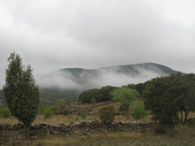
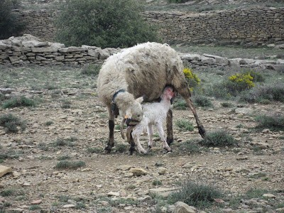

|  |
|:--:|
| Les meues coses. Listo. |

Sols em faltava veure aixó!!A les set  del mati del diumenge, ens varem anar al poble. La meua ama volia fer fotos a l’ermita de la Mare de Déu de la Font i també al mas, diu, que es la millor època del any, doncs el cap esta renaixent i ens van lluir! pel Coll d’Ares i un bon tros més, estava ple de boira, a vegades pareixia que anàvem dins dels núvols.

Fotos si en va fer, de tant en tant, rebíem una arruixada i varem acabar tots mullats, pareixíem sopes,i plens de fang, cada vegada que jo sortia del cotxe, l’ama en netejava les potetes, diu que l’embrutava, vaig corrent pels bancals,saltar parets i també en vaig remullar a la bassa del mas, doncs sempre l’havia vista seca i aquesta vegada hi havia aigua. Tot anava, bé fins quan ja marxàvem al poble a dinar, i varem trobar la rabera pel bosc, pastura’n sense parar l’herba fresqueta dels bancals. El pastó i els gos de guarda anava darrere, a mi, no van deixar que m’arrimarà,(amb lo divertit que seria,lladrar ben fort i fer correr al ramat) doncs els animals s'esglaiaven i ames armàvem molt de soroll, amb les esquelles que porten, penjades al coll.

Aleshores, el xiquet menut, va dir, que una ovella s’avia perdut i que estava a soles darrere, ens varem aturar i jo altra vegada castigat (sense manejar-me) En un tres i no res teníem un corderet recent nascut allí mateix, davant de nosaltres, la mare el va llepar tot,i amb el morro l’espentejava, el va fer alçar-se poc a poc, arrimant-sea ella i es va ficar a mamar. La meua ama feia fotos sense parar, el problema va ser quan la pluja va tornar amb ganes, i vérem al pastor que estava amb la rabera, molt allunat, cassi no es veia.

La meua ama, deia que el corderet es moriria amb la pluja,i que hi havia d’avisar-li, els demes deien que era una exagerada i que els animals per instin, saben que han de fer, desprès d’una bona discussió, ja tens al germà, remugant amb el paraigües, a dir-la al pasto,(que cada vegada estava mes allunat,) el que havia ocorri’t, i ell sense immutar-se va contestar que (ja ho sabia ) total, a la meua ama, li van dir tots enfadats, que cadascú sap de la seua faena i que axó era una lliçó, esta clar que no et pots ficar en camisa d’onze bares.

Vorem si un altra vegada o recordarem.
