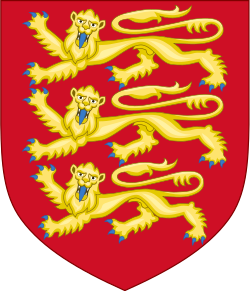
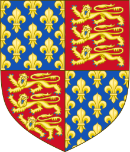
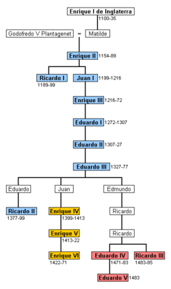

apellido proviene de Francia e Inglaterra.

Historia\[[editar](https://es.wikipedia.org/w/index.php?title=Polo_(apellido)&action=edit&section=1)\]

Sus orígenes se remontan a los primeros años de la Edad Media, aunque se cita ya a un Polo, que vivió a fines del siglo V (antes de J.C.) contemporáneo de Sócrates, filósofo que cita Platón y era originario de Agrigeluto, en la isla de Sicilia. También aparece otro Polo, un actor griego muy famoso que se distinguió en tiempos de Pericles.

En el caso del linaje Polo en España según los expertos, es atribuido a Francia, situando su origen en Aquitania desde donde pasó a Inglaterra y de este país a España en el siglo XIII (citado numerosas veces en la literatura inglesa).

Aparece en los archivos de los Condes de Salisbury, de los Duques de Suffilk y los Duques de Wanwock, y también en el mausoleo en que yacen los restos del Cardenal Raimundo Polo, estando los de este linaje emparentados con la casa real inglesa, en la dinastía de los Plantagenet a la que perteneció el célebre rey Ricardo, "Corazón de León".

Existe constancia de que Raymond Pole, o Polo, de la estirpe de los Plantagenet, fue sobrino nieto del rey de Inglaterra anteriormente citado, Ricardo. Este caballero inglés pasó a España en 1.192 y durante el siglo XIII prestó sus servicios con su hijo Martín en las primeras campañas de la Reconquista de los monarcas aragoneses, don Pedro y don Jaime I, llamado "el Conquistador". Sus descencientes, ya nacidos en España, ayudaron en la conquista de Valencia, por lo que fueron igualmente premiados con privilegios de tierras.

### 

### [Linajes de Aragón 1914](Linajes de Aragón 1914 - Volumen 4 - Página 407https://books.google.es/books?id=zE4vAQAAIAAJ)

[ - Volumen 4 - Página 407  
](Linajes de Aragón 1914 - Volumen 4 - Página 407https://books.google.es/books?id=zE4vAQAAIAAJ)

[https://books.google.es/books?id=zE4vAQAAIAAJ](Linajes de Aragón 1914 - Volumen 4 - Página 407https://books.google.es/books?id=zE4vAQAAIAAJ)

conquista de valencia 1238

1913 - ‎Vista de fragmentos - ‎[Más ediciones](https://www.google.es/search?hl=es&tbm=bks&q=editions:4cQraXOtsU0C&sa=X&ved=0ahUKEwim_bzil4TeAhWsKMAKHU1NAjsQmBYIKjAA)

Un caballero **Polo** fué de los conquistadores de la ciudad de **Valencia** cuando el rey D. Jaime I la conquistó en el año de ... dice: «son muy buenos y **antiguos** hijosdalgo: su origen es del **reino** de Francia, de donde de largo y **antiguo** tiempo 

<table>
<colgroup>
<col style="width: 32%" />
<col style="width: 67%" />
</colgroup>
<thead>
<tr>
<th colspan="2" style="text-align: center;"><strong>Casa de Plantagenet</strong></th>
</tr>
</thead>
<tbody>
<tr>
<td colspan="2" style="text-align: center;"></td>
</tr>
<tr>
<td colspan="2" style="text-align: center;"></td>
</tr>
<tr>
<td style="text-align: center;">Etnicidad</td>
<td style="text-align: center;">Ingleses, franceses</td>
</tr>
<tr>
<td colspan="2" style="text-align: center;"></td>
</tr>
<tr>
<td style="text-align: center;">Casa(s) materna(s)</td>
<td style="text-align: center;"><a href="https://es.wikipedia.org/wiki/Casa_de_Anjou">Casa de Anjou</a></td>
</tr>
<tr>
<td style="text-align: center;">Ramas menores</td>
<td style="text-align: center;"><ul>
<li>
<a href="https://es.wikipedia.org/wiki/Casa_de_York">Casa de York</a>
</li>
<li>
<a href="https://es.wikipedia.org/wiki/Casa_de_Lancaster">Casa de Lancaster</a>
</li>
</ul></td>
</tr>
<tr>
<td colspan="2" style="text-align: center;"></td>
</tr>
<tr>
<td style="text-align: center;">Lugar de origen</td>
<td style="text-align: center;"><a href="https://es.wikipedia.org/wiki/Francia">Francia</a></td>
</tr>
<tr>
<td style="text-align: center;">Títulos</td>
<td style="text-align: center;"><a href="https://es.wikipedia.org/wiki/Anexo:Monarcas_brit%C3%A1nicos">Rey de Inglaterra</a>  
<a href="https://es.wikipedia.org/wiki/Rey_de_Francia">Rey de Francia</a>  
<a href="https://es.wikipedia.org/wiki/Rey_de_Romanos">Rey de Romanos</a>  
<a href="https://es.wikipedia.org/wiki/Se%C3%B1or_de_Irlanda">Señor de Irlanda</a>  
<a href="https://es.wikipedia.org/wiki/Pr%C3%ADncipe_de_Gales">Príncipe de Gales</a> 
<a href="https://es.wikipedia.org/wiki/Duque_de_Aquitania">Duque de Aquitania</a> 
<a href="https://es.wikipedia.org/wiki/Duque_de_Normand%C3%ADa">Duque de Normandía</a> 
<a href="https://es.wikipedia.org/wiki/Duque_de_Breta%C3%B1a">Duque de Bretaña</a> 
<a href="https://es.wikipedia.org/wiki/Conde_de_Anjou">Conde de Anjou</a> 
<a href="https://es.wikipedia.org/wiki/Condes_y_duques_de_Maine">Conde de Maine</a> 
Conde de Nantes 
<a href="https://es.wikipedia.org/wiki/Anexo:Condes_de_Poitiers">Conde de Poitiers</a> 
Señor de Chipre</td>
</tr>
<tr>
<td style="text-align: center;">Gobernante en</td>
<td style="text-align: center;"><a href="https://es.wikipedia.org/wiki/Reino_de_Inglaterra">Reino de Inglaterra</a> 
<a href="https://es.wikipedia.org/wiki/Reino_de_Francia">Reino de Francia</a> 
<a href="https://es.wikipedia.org/wiki/Se%C3%B1or%C3%ADo_de_Irlanda">Señorío de Irlanda</a></td>
</tr>
<tr>
<td colspan="2" style="text-align: center;"></td>
</tr>
<tr>
<td style="text-align: center;">Fundación</td>
<td style="text-align: center;"><a href="https://es.wikipedia.org/wiki/1126">1126</a></td>
</tr>
<tr>
<td style="text-align: center;">Disolución</td>
<td style="text-align: center;">
<a href="https://es.wikipedia.org/wiki/1499">1499</a> (línea masculina)

<a href="https://es.wikipedia.org/wiki/1542">1542</a> (línea femenina)
</td>
</tr>
<tr>
<td colspan="2" style="text-align: center;"><strong>Miembros</strong></td>
</tr>
<tr>
<td style="text-align: center;">Fundador</td>
<td style="text-align: center;"><a href="https://es.wikipedia.org/wiki/Godofredo_V_de_Anjou">Godofredo V de Anjou</a></td>
</tr>
<tr>
<td style="text-align: center;">Último gobernante</td>
<td style="text-align: center;"><a href="https://es.wikipedia.org/wiki/Ricardo_III_de_Inglaterra">Ricardo III de Inglaterra</a></td>
</tr>
<tr>
<td style="text-align: center;">Jefe actual</td>
<td style="text-align: center;">Extinto por línea paterna</td>
</tr>
<tr>
<td colspan="2" style="text-align: center;">[<a href="https://www.wikidata.org/wiki/Q106151">editar datos en Wikidata</a>]</td>
</tr>
</tbody>
</table>

La **Casa de Plantagenet** fue la dinastía reinante en [Inglaterra](https://es.wikipedia.org/wiki/Reino_de_Inglaterra) entre [1154](https://es.wikipedia.org/wiki/1154) y [1399](https://es.wikipedia.org/wiki/1399). Después de que el último Plantagenet fuera obligado a abdicar, la corona pasó a dos ramas secundarias de la dinastía: primero la [Casa de Lancaster](https://es.wikipedia.org/wiki/Casa_de_Lancaster) y posteriormente la [Casa de York](https://es.wikipedia.org/wiki/Casa_de_York). La dinastía acabó finalmente en [1485](https://es.wikipedia.org/wiki/1485) con la muerte de [Ricardo III](https://es.wikipedia.org/wiki/Ricardo_III_de_Inglaterra), dando comienzo al gobierno de la [Casa de Tudor](https://es.wikipedia.org/wiki/Casa_de_Tudor).

La dinastía tiene su origen en [Francia](https://es.wikipedia.org/wiki/Francia), más precisamente en el [condado de Anjou](https://es.wikipedia.org/wiki/Condado_de_Anjou). En [1127](https://es.wikipedia.org/wiki/1127), [Godofredo V de Anjou](https://es.wikipedia.org/wiki/Godofredo_V_de_Anjou) se casó con [Matilde](https://es.wikipedia.org/wiki/Matilde_de_Inglaterra), única hija del rey [Enrique I de Inglaterra](https://es.wikipedia.org/wiki/Enrique_I_de_Inglaterra).

Armas de los Plantagenet entre 1340 y 1405.

En [1135](https://es.wikipedia.org/wiki/1135), tras la muerte de Enrique I, [Esteban de Blois](https://es.wikipedia.org/wiki/Esteban_de_Inglaterra), sobrino del rey, se hizo coronar rey de Inglaterra como Esteban I. Sin embargo, las luchas entre los partidarios de Esteban y los de Matilde llevaron a una guerra civil, conocida como "[anarquía inglesa](https://es.wikipedia.org/wiki/Anarqu%C3%ADa_inglesa)".

En [1151](https://es.wikipedia.org/wiki/1151) el hijo de Matilde y Godofredo V de Anjou, Enrique, heredó el condado de Anjou tras la muerte de su padre, como [Enrique I de Anjou](https://es.wikipedia.org/wiki/Enrique_II_de_Inglaterra).

En [1153](https://es.wikipedia.org/wiki/1153) Esteban firmó el [Tratado de Wallingford](https://es.wikipedia.org/wiki/Tratado_de_Wallingford), por el que se ponía fin a la Anarquía Inglesa y se designaba como sucesor al hijo de Matilde, el duque de Anjou Enrique I, que sería coronado como Enrique II de Inglaterra.

La dinastía Anjou comenzó a ser conocida como dinastía Plantagenet, debido a una característica de la vestimenta de Godofredo V de Anjou. Este personaje usaba como [cimera](https://es.wikipedia.org/wiki/Cimera) una ramita de [retama](https://es.wikipedia.org/wiki/Retama) (o [genista](https://es.wikipedia.org/wiki/Genista), o [hiniesta](https://es.wikipedia.org/wiki/Hiniesta)), y en el [francés](https://es.wikipedia.org/wiki/Idioma_franc%C3%A9s) antiguo (que se hablaba entonces en Inglaterra), "hiniesta" se decía "genest" (posteriormente y hoy, *genêt*). Esto le valió en su época el apodo de "Godofredo Plantagenest", luego "Plantagenet". Desde entonces, la Casa pasó a ser conocida como de los Plantagenet.[1](https://es.wikipedia.org/wiki/Casa_de_Plantagenet#cite_note-1)​

En [1399](https://es.wikipedia.org/wiki/1399) [Enrique de Lancaster](https://es.wikipedia.org/wiki/Enrique_IV_de_Inglaterra) obligó a su primo el rey [Ricardo II](https://es.wikipedia.org/wiki/Ricardo_II_de_Inglaterra) a cederle la Corona. Comenzando así la [Casa de Lancaster](https://es.wikipedia.org/wiki/Casa_de_Lancaster), rama de la Casa de Plantagenet.

En [1455](https://es.wikipedia.org/wiki/1455) estalló la [Guerra de las Dos Rosas](https://es.wikipedia.org/wiki/Guerra_de_las_Dos_Rosas) que enfrentó a dos ramas de la dinastía Plantagenet, la Casa de Lancaster (reinante) y la [Casa de York](https://es.wikipedia.org/wiki/Casa_de_York). Finalmente, [Eduardo de York](https://es.wikipedia.org/wiki/Eduardo_IV_de_Inglaterra) se convirtió en rey. La Casa de York ostentó la Corona hasta la [batalla de Bosworth](https://es.wikipedia.org/wiki/Batalla_de_Bosworth)([1485](https://es.wikipedia.org/wiki/1485)), en la que el rey Ricardo III es derrotado y muerto por el ejército de [Enrique Tudor](https://es.wikipedia.org/wiki/Enrique_VII_de_Inglaterra). Tras la batalla Enrique es coronado rey, acabando así la Casa de Plantagenet y naciendo la de [Tudor](https://es.wikipedia.org/wiki/Casa_de_Tudor).

## Índice

- [1Reyes de Inglaterra](https://es.wikipedia.org/wiki/Casa_de_Plantagenet#Reyes_de_Inglaterra)

  - [1.1Casa de Plantagenet (rama principal)](https://es.wikipedia.org/wiki/Casa_de_Plantagenet#Casa_de_Plantagenet_(rama_principal))

    - [1.1.1Casa de Lancaster (rama secundaria)](https://es.wikipedia.org/wiki/Casa_de_Plantagenet#Casa_de_Lancaster_(rama_secundaria))

    - [1.1.2Casa de York (rama secundaria)](https://es.wikipedia.org/wiki/Casa_de_Plantagenet#Casa_de_York_(rama_secundaria))

- [2Genealogía](https://es.wikipedia.org/wiki/Casa_de_Plantagenet#Genealog%C3%ADa)

- [3Véase también](https://es.wikipedia.org/wiki/Casa_de_Plantagenet#V%C3%A9ase_tambi%C3%A9n)

- [4Referencias](https://es.wikipedia.org/wiki/Casa_de_Plantagenet#Referencias)

- [5Enlaces externos](https://es.wikipedia.org/wiki/Casa_de_Plantagenet#Enlaces_externos)

## Reyes de Inglaterra\[[editar](https://es.wikipedia.org/w/index.php?title=Casa_de_Plantagenet&action=edit&section=1)\]

Árbol genealógico de los reyes de Inglaterra de la dinastía Plantagenet (en azul), incluyendo las ramas colaterales de los Lancaster (en amarillo) y los York (en rojo).

### Casa de Plantagenet (rama principal)\[[editar](https://es.wikipedia.org/w/index.php?title=Casa_de_Plantagenet&action=edit&section=2)\]

- [Enrique II](https://es.wikipedia.org/wiki/Enrique_II_de_Inglaterra) (1154 - 1189)

- [Ricardo I](https://es.wikipedia.org/wiki/Ricardo_I_de_Inglaterra) (1189 - 1199)

- [Juan I](https://es.wikipedia.org/wiki/Juan_I_de_Inglaterra) (1199 - 1216)

- [Enrique III](https://es.wikipedia.org/wiki/Enrique_III_de_Inglaterra) (1216 - 1272)

- [Eduardo I](https://es.wikipedia.org/wiki/Eduardo_I_de_Inglaterra) (1272 - 1307)

- [Eduardo II](https://es.wikipedia.org/wiki/Eduardo_II_de_Inglaterra) (1307 - 1327)

- [Eduardo III](https://es.wikipedia.org/wiki/Eduardo_III_de_Inglaterra) (1327 - 1377)

- [Ricardo II](https://es.wikipedia.org/wiki/Ricardo_II_de_Inglaterra) (1377 - 1399)

#### Casa de Lancaster (rama secundaria)\[[editar](https://es.wikipedia.org/w/index.php?title=Casa_de_Plantagenet&action=edit&section=3)\]

- [Enrique IV](https://es.wikipedia.org/wiki/Enrique_IV_de_Inglaterra) (1399 - 1413)

- [Enrique V](https://es.wikipedia.org/wiki/Enrique_V_de_Inglaterra) (1413 - 1422)

- [Enrique VI](https://es.wikipedia.org/wiki/Enrique_VI_de_Inglaterra) (1422 - 1461)

#### Casa de York (rama secundaria)\[[editar](https://es.wikipedia.org/w/index.php?title=Casa_de_Plantagenet&action=edit&section=4)\]

- [Eduardo IV](https://es.wikipedia.org/wiki/Eduardo_IV_de_Inglaterra) (1461 - 1483)

- [Eduardo V](https://es.wikipedia.org/wiki/Eduardo_V_de_Inglaterra) (1483)

- [Ricardo III](https://es.wikipedia.org/wiki/Ricardo_III_de_Inglaterra) (1483 - 1485)

## Genealogía\[[editar](https://es.wikipedia.org/w/index.php?title=Casa_de_Plantagenet&action=edit&section=5)\]

[Godofredo *Plantagenet*](https://es.wikipedia.org/wiki/Godofredo_V_de_Anjou) (1113-1151), [conde de Anjou](https://es.wikipedia.org/wiki/Conde_de_Anjou)

x [Matilde de Inglaterra](https://es.wikipedia.org/wiki/Matilde_de_Inglaterra) (1102-1167), [reina de Inglaterra](https://es.wikipedia.org/wiki/Monarca_brit%C3%A1nico), hija de [Enrique I](https://es.wikipedia.org/wiki/Enrique_I_de_Inglaterra)

│ y nieta de [Guillermo el Conquistador](https://es.wikipedia.org/wiki/Guillermo_I_de_Inglaterra)

│

└─\>[Enrique II Plantagenet](https://es.wikipedia.org/wiki/Enrique_II_de_Inglaterra) (1133-1189), rey de Inglaterra

x [Leonor de Aquitania](https://es.wikipedia.org/wiki/Leonor_de_Aquitania) (1122-1204), duquesa de Aquitania

│

├─\>[Enrique el Joven](https://es.wikipedia.org/wiki/Enrique_el_Joven) (1155-1183)

│

├─\>[Ricardo Corazón de León](https://es.wikipedia.org/wiki/Ricardo_I_de_Inglaterra) (1157-1199), rey de Inglaterra

│ x [Berenguela de Navarra](https://es.wikipedia.org/wiki/Berenguela_de_Navarra) (apr. 1170-v. 1230)

│

├─\>[Leonor de Inglaterra](https://es.wikipedia.org/wiki/Leonor_Plantagenet) (1160-1214)

│ x [Alfonso VIII](https://es.wikipedia.org/wiki/Alfonso_VIII_de_Castilla) (1155-1214), rey de [Castilla](https://es.wikipedia.org/wiki/Castilla)

│

├─\>[Godofredo II de Inglaterra](https://es.wikipedia.org/wiki/Godofredo_II_de_Breta%C3%B1a) (1158-1186)

│ x [Constanza de Bretaña](https://es.wikipedia.org/wiki/Constanza_de_Breta%C3%B1a) (v. 1161-1201)

│ │

│ └─\>[Arturo I](https://es.wikipedia.org/wiki/Arturo_I_de_Breta%C3%B1a) (1186-1203), duque de Bretaña

│

├─\>[Juana de Inglaterra](https://es.wikipedia.org/wiki/Juana_de_Inglaterra,_reina_de_Sicilia) (1165-1199)

│ x [Ramón VI de Tolosa](https://es.wikipedia.org/wiki/Ram%C3%B3n_VI_de_Tolosa) (1156-1222), [conde de Tolosa](https://es.wikipedia.org/wiki/Condado_de_Tolosa)

│

└─\>[Juan Sin Tierra](https://es.wikipedia.org/wiki/Juan_I_de_Inglaterra) (1166-1216), rey de Inglaterra

x [Isabel de Angulema](https://es.wikipedia.org/wiki/Isabel_de_Angulema) (1186-1246)

│

├─\>[Enrique III](https://es.wikipedia.org/wiki/Enrique_III_de_Inglaterra) (1207-1272), rey de Inglaterra

│ x [Leonor de Provenza](https://es.wikipedia.org/wiki/Leonor_de_Provenza) (1223-1291)

│ │

│ ├─\>[Eduardo I](https://es.wikipedia.org/wiki/Eduardo_I_de_Inglaterra) (1239-1307), rey de Inglaterra

│ │ x [Leonor de Castilla](https://es.wikipedia.org/wiki/Leonor_de_Castilla) (1241-1290)

│ │ │

│ │ └─\>[Eduardo II](https://es.wikipedia.org/wiki/Eduardo_II_de_Inglaterra) (1284-1327), rey de Inglaterra

│ │ x [Isabel de Francia](https://es.wikipedia.org/wiki/Isabel_de_Francia_(1292-1358)) (1292-1358), hija de [Felipe *el Hermoso*](https://es.wikipedia.org/wiki/Felipe_IV_de_Francia)

│ │ │

│ │ └─\>[Eduardo III](https://es.wikipedia.org/wiki/Eduardo_III_de_Inglaterra), Señor de Windsor (1312-1377), rey de Inglaterra

│ │ x [Felipa de Henao](https://es.wikipedia.org/wiki/Felipa_de_Henao) (1311-1369)

│ │ │

│ │ └─\>Eduardo, [príncipe de Gales](https://es.wikipedia.org/wiki/Pr%C3%ADncipe_de_Gales), el [*Príncipe Negro*](https://es.wikipedia.org/wiki/Pr%C3%ADncipe_Negro) (1330-1376)

│ │ x [Juana de Kent](https://es.wikipedia.org/wiki/Juana_de_Kent)

│ │ │

│ │ └─\>[Ricardo II](https://es.wikipedia.org/wiki/Ricardo_II_de_Inglaterra) (1367-1400), rey de Inglaterra

│ │

│ └─\>[Edmundo de Lancaster](https://es.wikipedia.org/wiki/Edmundo_de_Lancaster) (1245-1296)

│

├─\>[Ricardo de Cornualles](https://es.wikipedia.org/wiki/Ricardo_de_Cornualles) (1209-1272), [rey de Romanos](https://es.wikipedia.org/wiki/Rey_de_Romanos)

│

├─\>[Juana de Inglaterra](https://es.wikipedia.org/wiki/Juana_de_Inglaterra_(1210-1238)) (1210-1238)

│ x [Alejandro II](https://es.wikipedia.org/wiki/Alejandro_II_de_Escocia), rey de Escocia

│

└─\>[Leonor de Inglaterra](https://es.wikipedia.org/wiki/Leonor_de_Inglaterra_(1215-1275)) (1215-1275)

x [Simón V de Montfort](https://es.wikipedia.org/wiki/Sim%C3%B3n_V_de_Montfort) (1209-1265), conde de Leicester

Familia infanzona aragonesa, fusión de los Polo y los Bernabé. Los Polo proceden de Inglaterra y aparecen en Aragón en la campaña de Jaime I contra Valencia, en 1232. Sus armas heráldicas consisten en escudo azur con nueve estrellas de ocho puntas en banda de oro, una estrella de oro en cada cantonera y la leyenda «In moto lumine». Radicaron primeramente en Anento y estaban emparentados con los Entenza. Los Bernabé son oriundos de Báguena y uno de sus individuos Miguel, en 1363, prefirió arder antes que entregar la fortaleza de esta localidad. Sus armas heráldicas consisten en escudo de azur con un castillo de plata expresado de sable y por la torre del homenaje sale medio cuerpo de guerrero armado de oro, que tiene en una mano espada desnuda con un puño de oro y en la otra mano unas llaves de oro. La fusión de ambas familias tuvo lugar en 1477, en que un Polo casó con una Bernabé y reunieron ambos apellidos.

Raymond Polo, nieto de Richard Plantagenet Longsword, afincado en el ducado de Aquitania, vino en 1193 a servir a Pedro II de Aragón, recibiendo tierras en las comunidades de Daroca y Teruel; desde 1232 existirá casa solariega de los Polo en Anento. Su hijo Martín Polo, mesnadero de Jaime I de Aragón, figura en la conquista de Valencia y recuerda sus gestas Jaime Febrer en sus Troves; recibió tierras en Valencia, donde tendrá panteón familiar en San Miguel de los Reyes; casó con Teresa Gombal de Entenza. Entre sus descendientes sobresalieron: Pedro Polo de Entenza; Martín, que siguió detentando el casal de Anento; Miguel, héroe defensor de Báguena frente a Pedro I de Castilla; Domingo, diputado del reino en 1477; su hijo Pedro, casado con Constanza Maza de Lizana en 1487; el hijo de éstos, Domingo, acompañante de Carlos I de España a Italia en 1529. Este linaje, pos
