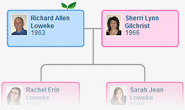
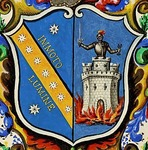
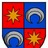

- **Colección:**

[Árboles Familiares de MyHeritage](https://www.geni.com/fwd/myheritage?profile_id=6000000037034663229&mh_match_id=externalmatch-cf2d255b5b5ac370e4c97fc1f200d9b0&src=hovercard&cmp=collection)

- **Nombre del sitio:**

[de Olivar Vivó.](https://www.geni.com/fwd/myheritage?profile_id=6000000037034663229&mh_match_id=externalmatch-cf2d255b5b5ac370e4c97fc1f200d9b0&src=hovercard&cmp=site)

- **Gestor del sitio:**

[María Pilar de Olivar Vivó](https://www.geni.com/fwd/myheritage?profile_id=6000000037034663229&mh_match_id=externalmatch-cf2d255b5b5ac370e4c97fc1f200d9b0&src=hovercard&cmp=site_creator)

- **Padres:**

Jose Joaquin Polo De Bernabe, Francisca De Paula Polo De Bernabe (nacida Mundina Marco)

- **Hermanos:**

Mariana De Bas Y Peñarroya (nacida Polo De Bernabe Y Mundina), Luis Polo De Bernabe I Fabra Mundina

- **Esposa:**

Peregrina Polo De Bernabe I Fabra Mundina (nacida Borrás Berenguer De Entenza Y Borrás Garcés De Marcilla)

- **Hijos:**

Jose Polo Borrás, Francisco Polo Borrás, Peregrina Polo Borrás, Manuela Polo Borrás

**  
Manuel Maria Polo De Bernabe y Mundina**

| Nacimiento: | 1780 |
|----|----|
| Fallecimiento: | 1832 |
| Padres: | [<u>Nombres de ambos padres</u>](javascript:%20openSignupPopup(languageCode,%20%7b%20startWith:'miniSignup',%20flavor:'miniSignup',%20signupReason:%20'seo%20data',%20showLoginInMiniSignup:%201,%20signupTitle:%20'Comience%20sus%2014%20dias%20de%20ensayo%20gratuito',%20miniSignupCustomFirstBullet:%20'Registro%20completo%20de%20Manuel%20Maria%20Polo%20de%20Bernabe%20y%20Mundina'%20%7d);) |
| Hermanos: | Mariana De Bas Y Peñarroya (nacida Polo De Bernabe Y Mundina) y [nombre de 2 más hermanos](javascript:%20openSignupPopup(languageCode,%20%7b%20startWith:'miniSignup',%20flavor:'miniSignup',%20signupReason:%20'seo%20data',%20showLoginInMiniSignup:%201,%20signupTitle:%20'Comience%20sus%2014%20dias%20de%20ensayo%20gratuito',%20miniSignupCustomFirstBullet:%20'Registro%20completo%20de%20Manuel%20Maria%20Polo%20de%20Bernabe%20y%20Mundina'%20%7d);) |
| Esposa: | [Nombre de esposa](javascript:%20openSignupPopup(languageCode,%20%7b%20startWith:'miniSignup',%20flavor:'miniSignup',%20signupReason:%20'seo%20data',%20showLoginInMiniSignup:%201,%20signupTitle:%20'Comience%20sus%2014%20dias%20de%20ensayo%20gratuito',%20miniSignupCustomFirstBullet:%20'Registro%20completo%20de%20Manuel%20Maria%20Polo%20de%20Bernabe%20y%20Mundina'%20%7d);) |
| Hijo: | [Nombre de hijo](javascript:%20openSignupPopup(languageCode,%20%7b%20startWith:'miniSignup',%20flavor:'miniSignup',%20signupReason:%20'seo%20data',%20showLoginInMiniSignup:%201,%20signupTitle:%20'Comience%20sus%2014%20dias%20de%20ensayo%20gratuito',%20miniSignupCustomFirstBullet:%20'Registro%20completo%20de%20Manuel%20Maria%20Polo%20de%20Bernabe%20y%20Mundina'%20%7d);) |

El dato completo incluye 

Esta es una copia en modo sólo lectura de los contenidos de Vilapèdia a fecha del 8/1/2016, recuperada por [<u>Wikis.cc</u>](https://www.wikis.cc/) gracias a un [<u>backup</u>](https://dumps.wikis.cc/external/vila_realinfo_vilapedia2015-20160108-wikidump/) de [<u>WikiTeam</u>](https://github.com/WikiTeam/wikiteam).

Polo de Bernabé i Fabra Mundina, Manuel

**Militar i terratinent (c. 1780 - 1832)**

Va nàixer a Vistabella, d'on era originari el seu pare José Joaquín Polo de Bernabé i Fabra, descendent d'una destacada família de la noblesa aragonesa arrelada a aquella vila, que es va fer propietari de diverses terres de conreu i d'un seguici de cases al carrer Major de Vila-real i que, a començaments del segle XIX ,va ser un dels administradors principals de l'Hospital Municipal, on va promocionar importants millores.

Sa mare era Francisca de Paula Mundina Marco, hereva d'una de les nissagues més destacades de la població, amb mansió senyorial enfront de les del seu marit, que encara es conserva i que llueix al dintell de la porta l'escut de la família [<u>Mundina</u>](https://vilapedia.wikis.cc/w/index.php?title=La_fam%C3%ADlia_Mundina&action=edit&redlink=1). Manuel María, nascut a la casa pairal a la població de Vistabella, va tenir tres germans: l'hereu José, Manuela i Luis (que va ser capità de barco).

Adscrit com a fill segon per a seguir la carrera militar, arribà al grau de capità de les Guàrdies Reals Valones i va participar de manera activa en la guerra contra els invasors francesos, distingint-se en la lluita durant la batalla de Bailén. Va casar a València amb la dama saguntina Peregrina Borrás Berenguer d'Entença i Borrás Garcés de Marcilla, amb la qual va tenir quatre fills: José, el més conegut a nivell local, Francisco (que va ser advocat davant els tribunals de Justícia), Peregrina i Manuela (mortes les dos molt joves).

Mort fadrí i sense descendència el germa major, Manuel María Polo va heretar els drets familiars i va dedicar els seus esforços a introduir moltes millores en les considerables possessions agràries que per les diverses herències, tant de la rama Polo com la dels Mundina, acumulava en els termes de Borriana i de Vila-real. Tot i que tenia residència habitual a València, on va formar part de la la Real Societat Econòmica d'Amics del País, va ser el constructor de la coneguda [<u>"alqueria de Polo"</u>](https://vilapedia.wikis.cc/wiki/Museu_de_la_Ciutat) al camí de la Travessa, on passava les seues estades a la vila per a controlar i promocionar les produccions de taronges i altres cultius, deixant abandonat el vell casalici matern del carrer Major, venut finalment pel seu fill, l'economista i polític [<u>José Polo de Bernabé</u>](https://vilapedia.wikis.cc/wiki/Polo_de_Bernab%C3%A9_i_Borr%C3%A1s,_Jos%C3%A9) que, proseguint la tasca innovadora de Manuel, va introduir en les terres familiars el cultiu de la mandarina i l'ús dels adobs orgànics. *(J.H.R.)*

[<u>José María Polo de Bernabé Borrás: genealogía por Seminario de ...</u>](https://gw.geneanet.org/sanchiz?lang=es&n=polo+de+bernabe+borras&oc=0&p=jose+maria)

[<u>  
</u>](https://gw.geneanet.org/sanchiz?lang=es&n=polo+de+bernabe+borras&oc=0&p=jose+maria)

[<u>https://gw.geneanet.org/sanchiz?lang=es&n=polo+de+bernabe...oc=0...maria</u>](https://gw.geneanet.org/sanchiz?lang=es&n=polo+de+bernabe+borras&oc=0&p=jose+maria)

1.  

Descubra gratis el árbol genealógico de José María Polo de Bernabé Borrás ... **Manuel María Polo de Bernabé Mundina** 1780-1832; Peregrina Borrás Borrás .

- [  
  ADN](https://www.myheritage.es/family-1_1000029_48317612_48317612/polo-de-bernabe-y-fabra-jose-joaquin-polo-de-bernabe)

- [Árbol](https://www.myheritage.es/family-tree?genealogy=1)

- [Investigación](https://www.myheritage.es/research)

- [Ayuda](https://www.myheritage.es/FP/in-house-help-center.php)

<table>
<colgroup>
<col style="width: 100%" />
</colgroup>
<thead>
<tr>
<th><table>
<colgroup>
<col style="width: 100%" />
</colgroup>
<thead>
<tr>
<th><table>
<colgroup>
<col style="width: 100%" />
</colgroup>
<thead>
<tr>
<th><table>
<colgroup>
<col style="width: 100%" />
</colgroup>
<thead>
<tr>
<th><table>
<colgroup>
<col style="width: 10%" />
<col style="width: 83%" />
<col style="width: 4%" />
<col style="width: 1%" />
</colgroup>
<thead>
<tr>
<th></th>
<th><table>
<colgroup>
<col style="width: 78%" />
<col style="width: 21%" />
</colgroup>
<thead>
<tr>
<th></th>
<th></th>
</tr>
</thead>
<tbody>
</tbody>
</table>
<table>
<colgroup>
<col style="width: 100%" />
</colgroup>
<thead>
<tr>
<th><table>
<colgroup>
<col style="width: 19%" />
<col style="width: 3%" />
<col style="width: 55%" />
<col style="width: 21%" />
</colgroup>
<thead>
<tr>
<th><h1 id="polo-de-bernabé-y-fabra">Polo de Bernabé y Fabra</h1></th>
<th></th>
<th><a href="https://www.myheritage.es/person-1000087_48317612_48317612/jose-joaquin-polo-de-bernabe-y-fabra">José Joaquín Polo de Bernabé y Fabra</a> + <a href="https://www.myheritage.es/person-1000088_48317612_48317612/francisca-de-paula-mundina-marco">Francisca de Paula Mundina Marco</a></th>
<th> </th>
</tr>
</thead>
<tbody>
</tbody>
</table></th>
</tr>
</thead>
<tbody>
</tbody>
</table></th>
<th></th>
<th></th>
</tr>
</thead>
<tbody>
</tbody>
</table></th>
</tr>
</thead>
<tbody>
<tr>
<td><table style="width:100%;">
<colgroup>
<col style="width: 0%" />
<col style="width: 98%" />
<col style="width: 0%" />
</colgroup>
<thead>
<tr>
<th rowspan="9"></th>
<th><table>
<colgroup>
<col style="width: 100%" />
</colgroup>
<thead>
<tr>
<th><table>
<colgroup>
<col style="width: 100%" />
</colgroup>
<thead>
<tr>
<th><table style="width:100%;">
<colgroup>
<col style="width: 1%" />
<col style="width: 96%" />
<col style="width: 1%" />
<col style="width: 0%" />
<col style="width: 0%" />
</colgroup>
<thead>
<tr>
<th colspan="5"></th>
</tr>
</thead>
<tbody>
<tr>
<td></td>
<td>Casado/a, con 5 hijos</td>
<td></td>
<td></td>
<td></td>
</tr>
<tr>
<td colspan="5"></td>
</tr>
</tbody>
</table></th>
</tr>
</thead>
<tbody>
<tr>
<td rowspan="2"></td>
</tr>
<tr>
</tr>
</tbody>
</table></th>
</tr>
</thead>
<tbody>
</tbody>
</table></th>
<th rowspan="9"></th>
</tr>
<tr>
<th><table>
<colgroup>
<col style="width: 100%" />
</colgroup>
<thead>
<tr>
<th><table>
<colgroup>
<col style="width: 100%" />
</colgroup>
<thead>
<tr>
<th><table>
<colgroup>
<col style="width: 98%" />
<col style="width: 1%" />
</colgroup>
<thead>
<tr>
<th><table>
<colgroup>
<col style="width: 100%" />
</colgroup>
<thead>
<tr>
<th>
Principio del formulario

<table>
<colgroup>
<col style="width: 100%" />
</colgroup>
<thead>
<tr>
<th><table>
<colgroup>
<col style="width: 30%" />
<col style="width: 69%" />
</colgroup>
<thead>
<tr>
<th></th>
<th><a href="javascript:%20void%20alert(&#39;Pronto&#39;);">Maximizar</a></th>
</tr>
</thead>
<tbody>
</tbody>
</table></th>
</tr>
</thead>
<tbody>
</tbody>
</table>

Final del formulario
</th>
</tr>
</thead>
<tbody>
</tbody>
</table></th>
<th></th>
</tr>
</thead>
<tbody>
<tr>
<td colspan="2"></td>
</tr>
</tbody>
</table></th>
</tr>
</thead>
<tbody>
<tr>
<td></td>
</tr>
</tbody>
</table></th>
</tr>
</thead>
<tbody>
</tbody>
</table></th>
</tr>
<tr>
<th><table>
<colgroup>
<col style="width: 1%" />
<col style="width: 96%" />
<col style="width: 1%" />
</colgroup>
<thead>
<tr>
<th></th>
<th><table>
<colgroup>
<col style="width: 100%" />
</colgroup>
<tbody>
</tbody>
</table></th>
<th></th>
</tr>
</thead>
<tbody>
</tbody>
</table></th>
</tr>
<tr>
<th><table>
<colgroup>
<col style="width: 1%" />
<col style="width: 96%" />
<col style="width: 1%" />
</colgroup>
<thead>
<tr>
<th></th>
<th><table>
<colgroup>
<col style="width: 6%" />
<col style="width: 11%" />
<col style="width: 82%" />
</colgroup>
<thead>
<tr>
<th>Mostrar: </th>
<th><strong>Eventos y Hechos</strong></th>
<th></th>
</tr>
</thead>
<tbody>
</tbody>
</table></th>
<th></th>
</tr>
</thead>
<tbody>
</tbody>
</table></th>
</tr>
<tr>
<th><table>
<colgroup>
<col style="width: 1%" />
<col style="width: 96%" />
<col style="width: 1%" />
</colgroup>
<thead>
<tr>
<th></th>
<th><table>
<colgroup>
<col style="width: 8%" />
<col style="width: 13%" />
<col style="width: 77%" />
</colgroup>
<thead>
<tr>
<th>Ordenar por: </th>
<th><a href="javascript:%20invokeuScrambleURL(&#39;h%20t%20t%20p%20s%20:%20/%20/%20w%20w%20w%20.%20m%20y%20h%20e%20r%20i%20t%20a%20g%20e%20.%20e%20s%20/%20f%20a%20m%20i%20l%20y%20-%201%20_%201%200%200%200%200%202%209%20_%204%208%203%201%207%206%201%202%20_%204%208%203%201%207%206%201%202%20/%20p%20o%20l%20o%20-%20d%20e%20-%20b%20e%20r%20n%20a%20b%20e%20-%20y%20-%20f%20a%20b%20r%20a%20-%20j%20o%20s%20e%20-%20j%20o%20a%20q%20u%20i%20n%20-%20p%20o%20l%20o%20-%20d%20e%20-%20b%20e%20r%20n%20a%20b%20e%20?%20s%20o%20r%20t%20=%20t%20y%20p%20e%20&amp;%20s%20h%20o%20w%20=%20e%20v%20e%20n%20t%20s&#39;)">Tipo</a> |  <strong>Fecha</strong> |  <a href="javascript:%20invokeuScrambleURL(&#39;h%20t%20t%20p%20s%20:%20/%20/%20w%20w%20w%20.%20m%20y%20h%20e%20r%20i%20t%20a%20g%20e%20.%20e%20s%20/%20f%20a%20m%20i%20l%20y%20-%201%20_%201%200%200%200%200%202%209%20_%204%208%203%201%207%206%201%202%20_%204%208%203%201%207%206%201%202%20/%20p%20o%20l%20o%20-%20d%20e%20-%20b%20e%20r%20n%20a%20b%20e%20-%20y%20-%20f%20a%20b%20r%20a%20-%20j%20o%20s%20e%20-%20j%20o%20a%20q%20u%20i%20n%20-%20p%20o%20l%20o%20-%20d%20e%20-%20b%20e%20r%20n%20a%20b%20e%20?%20s%20o%20r%20t%20=%20p%20l%20a%20c%20e%20&amp;%20s%20h%20o%20w%20=%20e%20v%20e%20n%20t%20s&#39;)">Lugar</a></th>
<th></th>
</tr>
</thead>
<tbody>
</tbody>
</table></th>
<th></th>
</tr>
</thead>
<tbody>
</tbody>
</table></th>
</tr>
<tr>
<th><table>
<colgroup>
<col style="width: 1%" />
<col style="width: 96%" />
<col style="width: 1%" />
</colgroup>
<thead>
<tr>
<th></th>
<th><table>
<colgroup>
<col style="width: 100%" />
</colgroup>
<tbody>
</tbody>
</table></th>
<th></th>
</tr>
</thead>
<tbody>
</tbody>
</table></th>
</tr>
<tr>
<th><table>
<colgroup>
<col style="width: 1%" />
<col style="width: 96%" />
<col style="width: 1%" />
</colgroup>
<thead>
<tr>
<th></th>
<th><table>
<colgroup>
<col style="width: 100%" />
</colgroup>
<thead>
<tr>
<th><strong>No se encontraron eventos</strong></th>
</tr>
</thead>
<tbody>
</tbody>
</table></th>
<th></th>
</tr>
</thead>
<tbody>
</tbody>
</table></th>
</tr>
<tr>
<th><table>
<colgroup>
<col style="width: 1%" />
<col style="width: 96%" />
<col style="width: 1%" />
</colgroup>
<thead>
<tr>
<th></th>
<th><table>
<colgroup>
<col style="width: 100%" />
</colgroup>
<tbody>
</tbody>
</table></th>
<th></th>
</tr>
</thead>
<tbody>
</tbody>
</table></th>
</tr>
<tr>
<th><table>
<colgroup>
<col style="width: 1%" />
<col style="width: 98%" />
</colgroup>
<thead>
<tr>
<th></th>
<th><table>
<colgroup>
<col style="width: 14%" />
<col style="width: 85%" />
</colgroup>
<thead>
<tr>
<th colspan="2"><table>
<colgroup>
<col style="width: 100%" />
</colgroup>
<tbody>
</tbody>
</table></th>
</tr>
</thead>
<tbody>
<tr>
<td><strong>Esposo</strong></td>
<td><table>
<colgroup>
<col style="width: 0%" />
<col style="width: 99%" />
</colgroup>
<thead>
<tr>
<th></th>
<th rowspan="2"><table>
<colgroup>
<col style="width: 18%" />
<col style="width: 81%" />
</colgroup>
<thead>
<tr>
<th colspan="2"></th>
</tr>
</thead>
<tbody>
<tr>
<td></td>
<td><table>
<colgroup>
<col style="width: 100%" />
</colgroup>
<thead>
<tr>
<th>
<strong>Nombre: </strong> <a href="https://www.myheritage.es/person-1000087_48317612_48317612/jose-joaquin-polo-de-bernabe-y-fabra">José Joaquín Polo de Bernabé y Fabra</a> 

<table style="width:100%;">
<colgroup>
<col style="width: 1%" />
<col style="width: 91%" />
<col style="width: 5%" />
<col style="width: 1%" />
<col style="width: 0%" />
</colgroup>
<thead>
<tr>
<th colspan="5"></th>
</tr>
</thead>
<tbody>
<tr>
<td colspan="4"></td>
<td></td>
</tr>
<tr>
<td></td>
<td></td>
<td></td>
<td></td>
<td></td>
</tr>
<tr>
<td colspan="4"></td>
<td></td>
</tr>
<tr>
<td></td>
<td colspan="4"></td>
</tr>
<tr>
<td colspan="5"></td>
</tr>
</tbody>
</table></th>
</tr>
</thead>
<tbody>
<tr>
<td></td>
</tr>
<tr>
<td></td>
</tr>
</tbody>
</table></td>
</tr>
</tbody>
</table></th>
</tr>
<tr>
<th></th>
</tr>
</thead>
<tbody>
</tbody>
</table></td>
</tr>
<tr>
<td><strong>Esposa</strong></td>
<td><table>
<colgroup>
<col style="width: 0%" />
<col style="width: 99%" />
</colgroup>
<thead>
<tr>
<th></th>
<th rowspan="2"><table>
<colgroup>
<col style="width: 31%" />
<col style="width: 68%" />
</colgroup>
<thead>
<tr>
<th colspan="2"></th>
</tr>
</thead>
<tbody>
<tr>
<td></td>
<td><table>
<colgroup>
<col style="width: 100%" />
</colgroup>
<thead>
<tr>
<th><strong>Nombre: </strong> <a href="https://www.myheritage.es/person-1000088_48317612_48317612/francisca-de-paula-mundina-marco">Francisca de Paula Mundina Marco</a> </th>
</tr>
</thead>
<tbody>
<tr>
<td></td>
</tr>
<tr>
<td></td>
</tr>
</tbody>
</table></td>
</tr>
</tbody>
</table></th>
</tr>
<tr>
<th></th>
</tr>
</thead>
<tbody>
</tbody>
</table></td>
</tr>
<tr>
<td><strong>Hijo</strong></td>
<td><table>
<colgroup>
<col style="width: 0%" />
<col style="width: 99%" />
</colgroup>
<thead>
<tr>
<th></th>
<th rowspan="2"><table>
<colgroup>
<col style="width: 30%" />
<col style="width: 69%" />
</colgroup>
<thead>
<tr>
<th colspan="2"></th>
</tr>
</thead>
<tbody>
<tr>
<td></td>
<td><table>
<colgroup>
<col style="width: 100%" />
</colgroup>
<thead>
<tr>
<th><strong>Nombre: </strong> <a href="https://www.myheritage.es/person-1500006_48317612_48317612/private-polo-de-bernabe-y-mundina">&lt;Private&gt; Polo de Bernabé y Mundina</a> </th>
</tr>
</thead>
<tbody>
<tr>
<td></td>
</tr>
<tr>
<td></td>
</tr>
</tbody>
</table></td>
</tr>
</tbody>
</table></th>
</tr>
<tr>
<th></th>
</tr>
</thead>
<tbody>
</tbody>
</table></td>
</tr>
<tr>
<td><strong>Hija</strong></td>
<td><table>
<colgroup>
<col style="width: 0%" />
<col style="width: 99%" />
</colgroup>
<thead>
<tr>
<th></th>
<th rowspan="2"><table>
<colgroup>
<col style="width: 30%" />
<col style="width: 69%" />
</colgroup>
<thead>
<tr>
<th colspan="2"></th>
</tr>
</thead>
<tbody>
<tr>
<td></td>
<td><table>
<colgroup>
<col style="width: 100%" />
</colgroup>
<thead>
<tr>
<th><strong>Nombre: </strong> <a href="https://www.myheritage.es/person-1000069_48317612_48317612/mariana-polo-de-bernabe-y-mundina">Mariana Polo de Bernabé y Mundina</a> </th>
</tr>
</thead>
<tbody>
<tr>
<td><strong>Fallecimiento: </strong>20 de Sep de 1861 --   Villareal</td>
</tr>
<tr>
<td></td>
</tr>
<tr>
<td></td>
</tr>
</tbody>
</table></td>
</tr>
</tbody>
</table></th>
</tr>
<tr>
<th></th>
</tr>
</thead>
<tbody>
</tbody>
</table></td>
</tr>
<tr>
<td><strong>Hijo</strong></td>
<td><table>
<colgroup>
<col style="width: 0%" />
<col style="width: 99%" />
</colgroup>
<thead>
<tr>
<th></th>
<th rowspan="2"><table>
<colgroup>
<col style="width: 30%" />
<col style="width: 69%" />
</colgroup>
<thead>
<tr>
<th colspan="2"></th>
</tr>
</thead>
<tbody>
<tr>
<td></td>
<td><table>
<colgroup>
<col style="width: 100%" />
</colgroup>
<thead>
<tr>
<th><strong>Nombre: </strong> <a href="https://www.myheritage.es/person-1000086_48317612_48317612/francisco-polo-de-bernabe-y-mundina">Francisco Polo de Bernabé y Mundina</a> </th>
</tr>
</thead>
<tbody>
<tr>
<td></td>
</tr>
<tr>
<td></td>
</tr>
</tbody>
</table></td>
</tr>
</tbody>
</table></th>
</tr>
<tr>
<th></th>
</tr>
</thead>
<tbody>
</tbody>
</table></td>
</tr>
<tr>
<td><strong>Hijo</strong></td>
<td><table>
<colgroup>
<col style="width: 0%" />
<col style="width: 99%" />
</colgroup>
<thead>
<tr>
<th></th>
<th rowspan="2"><table>
<colgroup>
<col style="width: 32%" />
<col style="width: 67%" />
</colgroup>
<thead>
<tr>
<th colspan="2"></th>
</tr>
</thead>
<tbody>
<tr>
<td></td>
<td><table>
<colgroup>
<col style="width: 100%" />
</colgroup>
<thead>
<tr>
<th><strong>Nombre: </strong> <a href="https://www.myheritage.es/person-1000092_48317612_48317612/luis-polo-de-bernabe-y-mundina">Luis Polo de Bernabé y Mundina</a> </th>
</tr>
</thead>
<tbody>
<tr>
<td></td>
</tr>
<tr>
<td></td>
</tr>
</tbody>
</table></td>
</tr>
</tbody>
</table></th>
</tr>
<tr>
<th></th>
</tr>
</thead>
<tbody>
</tbody>
</table></td>
</tr>
<tr>
<td><strong>Hija</strong></td>
<td><table>
<colgroup>
<col style="width: 0%" />
<col style="width: 99%" />
</colgroup>
<thead>
<tr>
<th></th>
<th rowspan="2"><table>
<colgroup>
<col style="width: 31%" />
<col style="width: 68%" />
</colgroup>
<thead>
<tr>
<th colspan="2"></th>
</tr>
</thead>
<tbody>
<tr>
<td></td>
<td><table>
<colgroup>
<col style="width: 100%" />
</colgroup>
<thead>
<tr>
<th><strong>Nombre: </strong> <a href="https://www.myheritage.es/person-1000093_48317612_48317612/josefa-polo-de-bernabe-y-mundina">Josefa Polo de Bernabé y Mundina</a> </th>
</tr>
</thead>
<tbody>
<tr>
<td><strong>Fallecimiento: </strong>Aprox. 1816</td>
</tr>
</tbody>
</table></td>
</tr>
</tbody>
</table></th>
</tr>
<tr>
<th></th>
</tr>
</thead>
<tbody>
</tbody>
</table></td>
</tr>
</tbody>
</table></th>
</tr>
</thead>
<tbody>
</tbody>
</table></th>
</tr>
</thead>
<tbody>
</tbody>
</table></td>
</tr>
</tbody>
</table></th>
</tr>
</thead>
<tbody>
</tbody>
</table></th>
</tr>
</thead>
<tbody>
</tbody>
</table></th>
</tr>
</thead>
<tbody>
</tbody>
</table>

public profile

### ¿**Polo de Bernabé y Arahuete** es tu apellido?

Investigar la familia Polo de Bernabé y Arahuete

[**Comienza ahora tu árbol genealógico**](https://www.geni.com/fwd/surname_lo?cmp=button&src=mh_family_tree_builder&trc=myheritage%3Ashare&url=http%3A%2F%2Fwww.myheritage.com%2Ffamily-tree-builder%3Ftrn%3Dpartner_Geni_lo%26trp%3Dfamily_tree_builder)

#### El perfil de Geni de José Joaquín Polo de Bernabé y Arahuete

-  [**Contactar con el administrador del perfil**](https://www.geni.com/profile/contact_manager/6000000037031751722)

-  [**Ver árbol genealógico**](https://www.geni.com/family-tree/index/6000000037031751722)

### Registros para **José Joaquín Polo de Bernabé y Arahuete**

[**42,573 Registros**](https://www.geni.com/fwd/records_lo?cmp=button&src=mh_profile_record_count&trc=myheritage%3Arecords&url=http%3A%2F%2Fwww.myheritage.com%2Fresearch%3Faction%3Dquery%26formId%3D1%26formMode%3D0%26qname%3DName%2Bfnmo.2%2Bfnmsvos.1%2Bfnmsmi.1%2Blnmo.4%2Blnmsdm.1%2Blnmsmf3.1%2Blnmsrs.1%2Bln.Polo%2Bde%2BBernab%25C3%25A9%2By%2BArahuete%2Bfn.Jos%25C3%25A9%2BJoaqu%25C3%25ADn%26trn%3Dpartner_Geni_lo%26trp%3Dprofile_record_count)

### **Comparte tu árbol genealógico y fotos** con la gente que conoces y amas

- Construye tu árbol genealógico online

- Comparte fotos y vídeos

- tecnología Smart Matching™

- **¡Gratis!**

[**Empezar**](https://www.geni.com/fwd/share_tree_lo?cmp=button&src=mh_share_your_family&trc=myheritage%3Aftb&url=http%3A%2F%2Fwww.myheritage.com%3Ftrn%3Dpartner_Geni_lo%26trp%3Dmh_share_your_family)

<table>
<colgroup>
<col style="width: 49%" />
<col style="width: 50%" />
</colgroup>
<thead>
<tr>
<th colspan="2"><h2 id="josé-joaquín-polo-de-bernabé-y-arahuete">José Joaquín Polo de Bernabé y Arahuete</h2></th>
</tr>
</thead>
<tbody>
<tr>
<td>Defunción:</td>
<td></td>
</tr>
<tr>
<td>Familia inmediata:</td>
<td>Hijo de <a href="https://www.geni.com/people/Jos%C3%A9-Polo-de-Bernab%C3%A9-y-Monserrat/6000000058542368928">José Polo de Bernabé y Monserrat</a> y <a href="https://www.geni.com/people/Mar%C3%ADa-de-Arahuete/6000000058542373880">María de Arahuete</a>  
Marido de <a href="https://www.geni.com/people/Josefa-Mar%C3%ADa-Fabra-y-Lluis/6000000037032192004">Josefa María Fabra y Lluis</a> y <a href="https://www.geni.com/people/Mar%C3%ADa-Luisa-Nebot-y-Lafont/6000000037032120631">María Luisa Nebot y Lafont</a>  
Padre de <a href="https://www.geni.com/people/Mar%C3%ADa-Manuela-Polo-de-Bernab%C3%A9-y-Fabra/6000000037032106891">María Manuela Polo de Bernabé y Fabra</a>; <a href="https://www.geni.com/people/Manuel-Ignacio-Polo-de-Bernab%C3%A9-y-Fabra/6000000037034334439">Manuel Ignacio Polo de Bernabé y Fabra</a>; <a href="https://www.geni.com/people/Jos%C3%A9-Joaqu%C3%ADn-Polo-de-Bernab%C3%A9-y-Fabra/6000000037034645400">José Joaquín Polo de Bernabé y Fabra</a>y <a href="https://www.geni.com/people/Josefa-Mar%C3%ADa-Polo-de-Bernab%C3%A9-y-Nebot/6000000037032248457">Josefa María Polo de Bernabé y Nebot</a> </td>
</tr>
<tr>
<td colspan="2"></td>
</tr>
<tr>
<td>Administrado por:</td>
<td>Private User</td>
</tr>
<tr>
<td>Última Actualización:</td>
<td>13 de octubre de 2015</td>
</tr>
</tbody>
</table>

[**Ver Perfil Completo**](https://www.geni.com/#name=Jos%C3%A9%20Joaqu%C3%ADn%20Polo%20de%20Bernab%C3%A9%20y%20Arahuete)

[ver todos](https://www.geni.com/#name=Jos%C3%A9%20Joaqu%C3%ADn%20Polo%20de%20Bernab%C3%A9%20y%20Arahuete)

#### Familia inmediata

- 

[**Josefa María Fabra y Lluis**](https://www.geni.com/people/Josefa-Mar%C3%ADa-Fabra-y-Lluis/6000000037032192004)

wife

- 

[**María Manuela Polo de Bernabé ...**](https://www.geni.com/people/Mar%C3%ADa-Manuela-Polo-de-Bernab%C3%A9-y-Fabra/6000000037032106891)

daughter

- 

[**Manuel Ignacio Polo de Bernabé ...**](https://www.geni.com/people/Manuel-Ignacio-Polo-de-Bernab%C3%A9-y-Fabra/6000000037034334439)

son

- 

[**José Joaquín Polo de Bernabé ...**](https://www.geni.com/people/Jos%C3%A9-Joaqu%C3%ADn-Polo-de-Bernab%C3%A9-y-Fabra/6000000037034645400)

son

- 

[**María Luisa Nebot y Lafont**](https://www.geni.com/people/Mar%C3%ADa-Luisa-Nebot-y-Lafont/6000000037032120631)

wife

- 

[**Josefa María Polo de Bernabé y...**](https://www.geni.com/people/Josefa-Mar%C3%ADa-Polo-de-Bernab%C3%A9-y-Nebot/6000000037032248457)

daughter

- 

[**José Polo de Bernabé y Monserrat**](https://www.geni.com/people/Jos%C3%A9-Polo-de-Bernab%C3%A9-y-Monserrat/6000000058542368928)

father

- 

[**María de Arahuete**](https://www.geni.com/people/Mar%C3%ADa-de-Arahuete/6000000058542373880)

mother

#  Polo de Bernabé y Nebot

public profile

### ¿**Polo de Bernabé y Nebot**es tu apellido?

Investigar la familia Polo de Bernabé y Nebot

[**Comienza ahora tu árbol genealógico**](https://www.geni.com/fwd/surname_lo?cmp=button&src=mh_family_tree_builder&trc=myheritage%3Ashare&url=http%3A%2F%2Fwww.myheritage.com%2Ffamily-tree-builder%3Ftrn%3Dpartner_Geni_lo%26trp%3Dfamily_tree_builder)

#### El perfil de Geni de Josefa María Polo de Bernabé y Nebot

-  [**Contactar con el administrador del perfil**](https://www.geni.com/profile/contact_manager/6000000037032248457)

-  [**Ver árbol genealógico**](https://www.geni.com/family-tree/index/6000000037032248457)

### **Comparte tu árbol genealógico y fotos** con la gente que conoces y amas

- Construye tu árbol genealógico online

- Comparte fotos y vídeos

- tecnología Smart Matching™

- **¡Gratis!**

[**Empezar**](https://www.geni.com/fwd/share_tree_lo?cmp=button&src=mh_share_your_family&trc=myheritage%3Aftb&url=http%3A%2F%2Fwww.myheritage.com%3Ftrn%3Dpartner_Geni_lo%26trp%3Dmh_share_your_family)

<table>
<colgroup>
<col style="width: 49%" />
<col style="width: 50%" />
</colgroup>
<thead>
<tr>
<th colspan="2"><h2 id="josefa-maría-polo-de-bernabé-y-nebot">Josefa María Polo de Bernabé y Nebot</h2></th>
</tr>
</thead>
<tbody>
<tr>
<td>Fecha de nacimiento:</td>
<td>estimado antes de 1804</td>
</tr>
<tr>
<td>Defunción:</td>
<td></td>
</tr>
<tr>
<td>Familia inmediata:</td>
<td>Hija de <a href="https://www.geni.com/people/Jos%C3%A9-Joaqu%C3%ADn-Polo-de-Bernab%C3%A9-y-Arahuete/6000000037031751722">José Joaquín Polo de Bernabé y Arahuete</a> y <a href="https://www.geni.com/people/Mar%C3%ADa-Luisa-Nebot-y-Lafont/6000000037032120631">María Luisa Nebot y Lafont</a>  
Esposa de <a href="https://www.geni.com/people/Crist%C3%B3bal-Marco-y-Mas/6000000037032138653">Cristóbal Marco y Mas</a>  
Madre de <a href="https://www.geni.com/people/Joaqu%C3%ADn-Marco-y-Polo/6000000037032426098">Joaquín Marco y Polo</a>  
Medio hermana de <a href="https://www.geni.com/people/Mar%C3%ADa-Manuela-Polo-de-Bernab%C3%A9-y-Fabra/6000000037032106891">María Manuela Polo de Bernabé y Fabra</a>; <a href="https://www.geni.com/people/Manuel-Ignacio-Polo-de-Bernab%C3%A9-y-Fabra/6000000037034334439">Manuel Ignacio Polo de Bernabé y Fabra</a> y <a href="https://www.geni.com/people/Jos%C3%A9-Joaqu%C3%ADn-Polo-de-Bernab%C3%A9-y-Fabra/6000000037034645400">José Joaquín Polo de Bernabé y Fabra</a> </td>
</tr>
</tbody>
</table>
