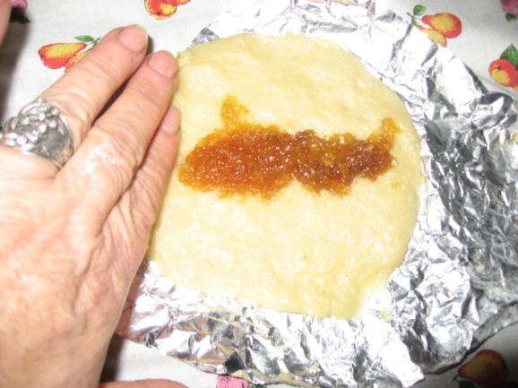
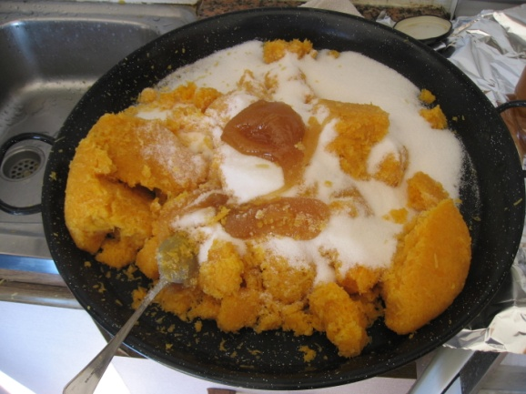
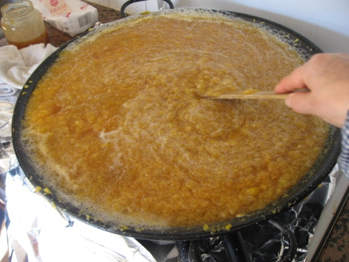
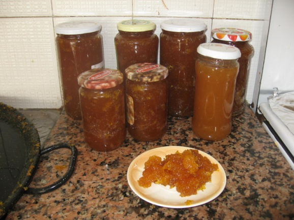

INGREDIENTES.

Un cuarto de litro de aguardiente con la mezcla que ponen en el pueblo.

Medio litro de aceite.

Dos medidas de azúcar.

Un kilo de harina.

Confitura de calabaza.

Esta medida es orientativa, se puede hacer más o menos cantidad.

De cada parte de masa en forma de bola que se aplana sale una coqueta, según el tamaño más o menos grande. La cantidad de confitura en el relleno a gusto.

 

 

CONFITURA.

Calabaza pelada y partida a trozos. Picada y escurrirla un tiempo con peso encima. Según su peso se cuece con la misma cantidad de dulce, mitad miel y mitad azúcar. Cocerla, revolviendo sin parar hasta que espese y se caramelice.

 

 

 
