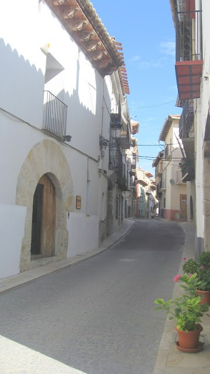

LAS PALABRAS

Las palabras, como tantas cosas nos traen recuerdos.

En los pueblos pequeños, el tiempo tiene otro valor, es habitual conversar con vecinos y gente que  encuentras por las calles, y es impensable cruzarse con alguien conocido o no, a quien no se le desea buenos días,** bon dia**  o buenas  noches,  **bona nit**. En el verano cada vez más personas nos  visitan, y están unos días de descanso entre nosotros, la primera vez que les saludas contestan con sorpresa, pero es curioso como  enseguida captan la situación y  ven normal hacer ellos lo mismo. Y qué decir de los niños, no importa si hablan en español, catalán o valenciano, o como sea, tienen habilidad de entenderse de todas las maneras sin ningún problema.

Una de las costumbres que afortunadamente no se han perdido es, **anar a pendre la fresca,** no pueden con ella ningún programa de televisión. Por la noche después de cenar, cada calle tiene su lugar escogido al lado de la puerta de algún vecino, donde se reúnen y conversan de cualquier tema, casi siempre resguardado  pues por la noche refresca, y con un jersey a mano por si hay  que cubrirse los hombros.

Me he dado cuenta, que en mi caso, estas veladas ha sido una lección intensiva de antropología, he aprendido  un montón de nombres y cosas.

Aquí no importa que seas de una familia importante, de solera,  o de la familia más humilde, además de nuestro nombre y apellidos todos somos de **casa de… hijos de…**

 Una noche, se acerco un adolescente a saludar a un vecino, y se me ocurrió preguntarle quién era,  muy orgulloso dijo: **Soc de casa Pepina…** y me dijo el nombre con que se conoce a  toda su familia desde  su bisabuelo, y me di cuenta que así es. Si  tus mayores son  de alguna masía, siempre serás **del mas de…** y no solo es eso, también si surge el tema, conocerás los nombres de los vecinos de las  fincas colindantes, si en tal lugar había un molino, una noria o una senda, en pocos días he aprendido la toponimia de casi todo el termino de Cinctorres.

De lo que estoy segura es que mis descendientes serán conocidos como: hijos o nietos de** Paquita  de Tadeo… **Así es como todos me conocen.

Paquita.
