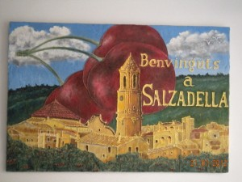
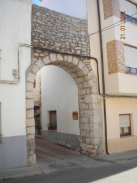
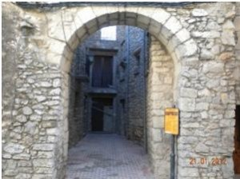
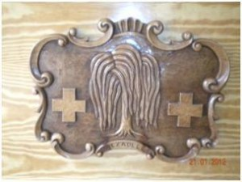

**0. INTRODUCCIÓN.**

Este trabajo se enmarca en la asignatura de Antropología, de la Universidad para mayores de la UJI. El objetivo es analizar desde un punto de vista antropológico y cultural un municipio de la provincia de Castellón, realizar una cuidadosa tarea de búsqueda de información y documentación, reflejar los principales hitos culturales y características de la población y, en definitiva, seguir aprendiendo. En concreto, se estudia y analiza la localidad castellonense de Salzadella.

**1. JUSTIFICACIÓN**

Cuando en este mi segundo curso de la Universidad para mayores de la UJI, en la asignatura de Antropología, se me dio la opción de hacer un trabajo sobre algo que nos interesara y nos permitiera disfrutar investigando, no tuve ninguna duda, elegí Salzadella. Yo no soy nacida allí, pero tuve la gran suerte de tener que vivir en este pueblo por motivos profesionales, durante 12 años. Fui muy feliz y guardo un recuerdo muy entrañable de esa época y creo que, ahora, después de tanta investigación sumada a los recuerdos y a las enseñanzas que me han aportado sobre qué son y como son, me puedo considerar una "Salsadellenca" más.

Los dos primeros apartados han sido muy interesantes pero, el bloque tercero, en donde hablo de las costumbres, oficios desaparecidos y estructuras sociales del pueblo, ha sido para mi la parte más entrañable y tierna de todo mi trabajo porque, para poderla desarrollar he tenido que entrevistar a los abuelitos del pueblo y les he hecho revivir tiempos pasados, tiempos que, cuando se cumplen muchos años, siempre parece que fueron mejores. Y los relatos fueron tan dulces, tan emocionantes y tan entrañables que no tienen cabida en la mente de un adulto... solo podía plasmarse esta inocencia en la boca de una niña, por eso la protagonista es Carmencita, una niña de ocho años de los años sesenta que lo escribe en forma de diario.

Por lo tanto, mucho de lo que aquí relato lo he vivido y disfrutado, estos escenarios los he recorrido. Espero conseguir que, al acabar de leer este trabajo, sientas unas ganas enormes de visitar esas tierras y yo, sin que nadie se entere, te diré cuando tienes que ir para acabar de enamorarte del todo. Pero eso será al final

**2. CARACTERÍSTICAS DEL MUNICIPIO**

El municipio de la Salzadella se encuentra situado en la comarca del Alto Maestrazgo, al pie de las estribaciones occidentales de las Atalayas de Alcala,  en la provincia de Castellón. En el año 2011 contaba con 870 habitantes, ocupa una superficie de casi 50 km2 y su altura media es de 339 metros sobre el nivel del mar.

La economía de la Salzadella es eminentemente agrícola y ganadera(porcina).Entre los cultivos tradicionales (almendro, olivo…) es destacable por su fama y calidad ¡la cereza!.

**3. ETIMOLOGÍA**

El nombre de Salzadella significa bosque de sauces. Actualmente no queda ninguno, pero hay constancia de la presencia de estos bosques. Existen 2 cartas en el archivo municipal que lo atestiguan. En una de ellas, del año 1594, se relata que “*en un gran bosc de salzes que tenim en aquest terme*“. En la otra carta se menciona, que se necesitaba de 25 a 30 hombres para vigilarlo.

Como ya he dicho, la Salzadella se encuentra situada en la comarca del Maestrazgo. La palabra “maestrazgo”  proviene de maestre o jefe o primera dignidad de una orden militar.

**4. ORÍGENES**

**4.1 Prehistoria e historia antigua.**

Esta zona fue poblada por íberos en el silo VI a. C, luego por fenicios y griegos. Se sabe por los restos de cerámica en las que aparecían escenas de la vida cotidiana, hallados en la zona.

En el siglo II antes de C. comienza la romanización de estas tierras que dura 7 siglos, en las que se construyeron magnificas vías de comunicación: la vía Hercúlea que enlazaba Roma con la Bética (Andalucía). Esta ruta primitiva era utilizada por los pueblos indígenas pre- romanos. Fue en tiempos de Augusto cuando cambio de nombre y pasó a llamarse Vía Augusta y ya, posteriormente, *Cami dels Romans*. En el borde de estos caminos se acostumbraba a poner estatuas, templos, arcos y se señalizaban con las llamadas piedras miliares.

Todos estos antiguos pobladores estaban por esta zona, pero en concreto, respecto al municipio de la Salzadella se considera que su fundación es árabe. Pero antes de este pueblo, ¿qué hubo? No se sabe con certeza, aunque distintas fuentes documentales hacen referencia a dos asentamientos, la *Cuadra Mitjana* y *Intibilis*. No se conoce la localización exacta de ninguno de ellos, ni tampoco si son el mismo asentamiento con distinto nombre. Tampoco se puede afirmar si alguno de ellos, o los dos, fueron los precursores de la actual Salzadella.

Entre San Mateo y Tirig existió un pueblo llamado la *Cuadra Mitjana*. Actualmente existe un camino  que se denomina así. Allí se halló una especial sepultura, en la partida “*dels Peters*” que contenía  dos enterramientos, donde se encontraron varios objetos de plata del siglo IV A.C El más importante es un broche de bronce con damasquinados de plata

En una descripción del itinerario de Antonino Augusto Caracalla, sale a relucir que pernoctó en *Intibilis*, y se sabe que fue una ciudad muy famosa,  porque en ella se dieron importantes batallas entre romanos y cartagineses.

Posteriormente, labrando un campo, aparecieron restos de cerámica de diferentes épocas y piedras labradas donde se contempla  una estela visigótica. Por lo que  se deduce que, el poblado de *Intibilis* o *Cuadra Mitjana*,  se mantuvo hasta la edad media.

**4.2 Historia medieval**

Sea como fuere, sean estas localidades precursoras o no del actual Salzadella, lo cierto es que como tal, fue una fundación árabe. Se sabe con certeza porque no fue citado por escritores romanos. No aprovecharon para su edificación ni ríos ni nada que sirviera para la defensa natural del pueblo y desarrollaron un sistema de riegos con acequias en una zona llamada “*la Llacuna*”, que actualmente, cuando llueve, se inunda.

Entre 711 y 718, esta tierra es conquistada por las bandas de Tarik y Abd-el-Aziz y dura el dominio musulmán 5 siglos. Esto trajo muchos beneficios, pues mejoraron la red de riegos de los romanos, se crearon las famosas norias (*senies*) y floreció la cerámica, en especial la de Traiguera. También introdujeron el cultivo del almendro.

La estructura del pueblo, por tanto, se considera arábigo-medieval, con calles estrechas e irregulares, casas con azotea y pocas ventanas.

Conserva varios arcos medievales, como el de la Bassa o el de les Coves. Son las antiguas e históricas puertas de acceso al recinto amurallado medieval de la Salzadella. Destaca en ellas el arco de medio punto de sillares. Están realizados íntegramente con mampostería, dando acceso a calles del antiguo núcleo medieval. En la localidad aún se conservan casas con arcos de medio punto. Se cree que el año de construcción de estos es alrededor del 1294. Según documentos la construcción de las murallas de la Salzadella coincide con el transcurso de la repoblación cristiana, durante los siglos XIII y XIV, periodo de fortificación de la mayoría de los pueblos del Maestrazgo

La expulsión de los moriscos  se realizó 1609 y Salzadella fue repoblada por cristianos de territorios que forman la actual Catalunya y Aragón, como lo indican los apellidos que tomaran de sus pueblos de origen: Albiol, de Tarragona, Calonge de Gerona, Fraga de Huesca, Ripoll de Barcelona y Segar

La localidad de Salzadella pertenecía, en estas fechas, al señorío de las Cuevas de Vinromà. El primer señor de las Cuevas de Vinromà fue el célebre y glorioso caballero D. Blasco de Alagón, que contribuyó a la reconquista de todo Castellón. Éste otorgó la Carta Puebla de Salzadella en 1.236 a D. Miguel de Ascó y a D. Pedro de Alsina, a los que les impuso unos privilegios y unas obligaciones, y les prometía protección y justicia. Se les señalaba un censo anual, a satisfacer en trigo, en la Virgen de Agosto. Les recordaba la obligación de pagar diezmos y primicias. Además, señalaba los límites del término municipal.

Todo esto  se escribía en un documento, se sellaba y se decía que no podía ser revocado por nadie, a la vez que se hacía con testigos. Esta Carta Puebla se destruyó en el 1936 pero todo lo anterior se sabe en la actualidad porque se conservan las Cartas Pueblas de las Cuevas, Tirig y Albocàcer.

A la muerte de Blasco de Alagón, sus bienes fueron confiscados, y se sabe que Jaime I concedió el castillo de Cuevas de Vinromà a la Orden militar de Calatrava y que Salzadella era la villa más importante, pues pleiteaba con los otros pueblos de la Tenencia de  Cuevas de Vinromà.

La Orden de Calatrava  permutó  la Tenencia de Cuevas, por Calanda, con Artal de Alagón como biznieto del primer señor de Salzadella.  Pese a todo, por desavenencias con el monarca Jaime II, éste perdió su señorío y pasó a depender de la corona, para más tarde ser cedido por éste a la Orden del Temple.

La Orden del Temple fue disuelta en 1317 por orden del papa Clemente V y sus bienes fueron confiscados. Entonces, pasó a pertenecer a otra nueva orden creada por el propio rey de Aragón. Dicha orden era la de Santa María de Montesa o de San Jorge de Alfama. Inmediatamente, pidieron al rey que les concedieran los privilegios que tenían antes los templarios.

El territorio estaba gobernado por el Gran Maestre, de ahí el nombre de la comarca. Básicamente, este personaje gobernaba todos los pueblos de dicha zona. El último Gran Maestre fue Pedro Luis Galcerán y de Borja, que la gobernó hasta su muerte en 1592. A partir de ahí, el rey fue el Gran Maestre de la Orden y, por tanto, Señor de la Comarca..

El rey nombraba un lugarteniente y capitán general, que residía en San Mateo  y quien,  a su vez, designaba sus lugartenientes y capitanes, que residían en sus encomiendas y gobernaban las villas, castillos y y pueblos de Montesa comprendidos entre el rio Cenia y el Mijares.

En 1784 murió el último gobernador de San Mateo (frei José Garcés de Marcilla). Entonces se suprimió este cargo y, en su lugar, se nombró un Justicia Mayor que, posteriormente pasaría a llamarse Alcalde Mayor, cargo que desapareció en vísperas de la guerra Carlista. Así murió la Orden Militar de Santa María de Montesa y de San Jorge de Alfama.

El Justicia Mayor se elegía cada año.

Los miembros del consejo proponían seis candidatos cada uno, en una votación. Los seis que mejores resultados obtuvieran, entrarían en un sorteo para ocupar dicho cargo. Una vez elegido el candidato, debía hacer juramento y nombrar su lugarteniente.

El cargo se ocupaba de todo lo referente a los asuntos del territorio. Ello quedaba registrado en unos libros llamados *JUDICIARIS*.

A partir de allí el pueblo disponía de más servicios y cargos como los Jurados, El Mayordom o *Mustaçaf*, el *Saig* (ministro de justicia), el *Guardia dels bens* (guardia del campo), los cuales se elegían de forma más o menos democrática, pero siempre pasando por el Consejo

**4.2.1 Visitantes ilustres de la Salzadella**

**Alfonso V el Magnánimo**

Hacia 1403 hubo tres papas al mismo tiempo, y uno de ellos, el **Papa Luna o Benedicto XIII de Aviñón** (Illueca, Zaragoza, 1328 - Peñíscola, Castellón, 1423), parece probable que  estuvo en Salzadella, ya que recorrió las tierras del Maestrazgo. Al decaer su popularidad, se fue a vivir a Peñiscola,  después de haber intentado establecerse en alguna parte de las tierras de Aragón.

El rey de Aragón, Fernando I, quería que el Papa renunciara a su papado, para ello le ofreció una entrevista en Morella en el verano de 1414.

Se sabe que el Papa se detuvo en San Mateo y que fue a la Salzadella porque unos intendentes le solicitaron ayuda para resolver unas cuestiones pendientes. La visita del Papa supuso una gran actividad económica en la zona, ya que éste tenía un gran séquito.

Otro ilustre visitante de esta localidad fue **Alfonso V  el Magnánimo** (Medina del Campo, 1396 - Nápoles, 27 de junio de 1458). Encontramos archivos que demuestran que pasó por Salzadella en 1423-24.

Se recibieron órdenes reales para que el pueblo arreglase los caminos por donde tendría que pasar el rey, que se dirigía a Valencia para ser coronado.

Por último, se sabe por diversas citas del Juradesc, que también **una infanta** visitó esta localidad. Infante es cualquier niño menor de 7 años. También se refiere a los hijos del Rey que carezcan de la condición de Príncipe o de Princesa, y a sus hijos.

Por dichas citas se sabe que el pueblo crió a una infanta del rey, concretamente el carnicero y su esposa (Berenguer Pastor). Parece ser que no se trata de una vulgar expósita por varias razones. En  primer lugar por el apelativo “infanta” con el que siempre se refieren a ella dichas crónicas y nunca la llaman con palabras despectivas como “borda”, “bastarda” u otras. También porque parece que sea una excepción el trato que le dan. En  tercer lugar, porque se encarga el municipio de pagar la crianza de la niña durante casi un año. Por contra,  no se sabía de quien era hija la infanta. Lo cierto es que al pueblo se le pagaba un muy generoso sueldo para la crianza de esta niña.

Escudo de la Salzadella con un sauce en el centro
