**<u>ÍNDICE</u>**

**PRÓLOGO...........................................................................................................................3**

**1. RAMBLA CELUMBRES.......................................................................................................4**

**2. FLORA.............................................................................................................................6**

2.1. ÁRBOLES BAYAS Y FRUTOS…………………………………….......................................................6

2.2. PARTES BÁSICAS DE UNA PLANTA…………………………………………………………………………………..9

2.3. PARTES BÁSICAS DE UNA FLOR……………………………………………………………………………………….9

IMÁGENES FLORA………………………………………………………………………………………………………………..11

**3. INVERTEBRADOS...........................................................................................................16**

3.1. ANTRÓPODOS……………………………………………………………………………………………………………….16

3.2. ARÁCNIDOS…………………………………………………………………………………………………………………..16

3.3. MIRIÁPODOS………………………………………………………………………………………………………………..17

3.4. INSECTOS………………………………………………………………………………………………………………………17

IMÁGENES VERTEBRADOS…………………………………………………………………………………………………….22

**4. VERTEBRADOS...............................................................................................................32**

4.1. ANFIVIOS………………………………………………………………………………………………………………………32

4.2. AVES……………………………………………………………………………………………………………………………..32

4.3. MAMIFEROS………………………………………………………………………………………………………………….34

4.4. REPTILES……………………………………………………………………………………………………………………….36

IMÁGENES INVERTEBRADOS………………………………………………………………………………………………….37

**5. MICROORGANISMOS....................................................................................................39**

5.1. HONGOS………………………………………………………………………………………………………………………39

5.2. LIQUENES…………………………………………………………………………………………………………………….40

IMÁGENES MICROORGANISMOS…………………………………………………………………………………………..41

**BIBLIOGRAFIA...................................................................................................................43**

**<u>PRÓLOGO</u>**

El término biodiversidad proviene de la contracción de las palabras: biológica y diversidad.

La biodiversidad, es un proceso natural de diversificación genética, está relacionada con la variedad, la diferencia y la pluralidad de los seres vivos.  

Las plantas, animales, hongos y microorganismos, forman parte de la diversidad biológica que vive en un espacio determinado, en donde se ubican los ecosistemas.

Está formada por tres componentes relacionados:

**La diversidad en los ecosistemas.** El sistema biológico se compone de un conjunto de seres vivos, el medio natural en que se desarrollan y las relaciones que establecen entre sí factores Bióticos y Abióticos que constituyen medios distintos pero unidos. Bióticos son los seres vivos, microorganismos, animales y plantas, que no pueden vivir sin los factores Abióticos, estos, no forma parte de los seres vivos como son: los minerales del suelo, agua, aire, viento, luz, calor.

**La diversidad en las especies**. Por diversidad genética se entiende la variación de los genes dentro de cada especie. Esto abarca poblaciones determinadas de la misma especie o la variación genética de una población.

**La diversidad genética**. La diversidad genética contribuye a la capacidad de las comunidades ecológicas para resistir o recuperarse de los cambios ambientales, incluyendo cambios climáticos relativamente largos. La variación genética de las especies es la base fundamental de la evolución, la adaptación de las poblaciones silvestres a las condiciones locales del medio ambiente, el desarrollo de la especie animal y de las variedades de especies cultivadas han producido significativos beneficios directos para la humanidad.

El naturalista británico Corolus Linneus en el S.XVIII clasificó todo el organismo vivo en dos grandes grupos: los reinos Plantae y el reino Animalia. Que a su vez los divide en diferentes categorías para su clasificación: Clase, Orden, Familia, Género, Especie. Escrito en latín, lengua que dominaba entre los estudiosos y gente culta. Esta ciencia dentro de la biología se llama **Taxonomía**.

Una mayor riqueza y diversidad puede generar que el ecosistema funcione más eficazmente ya que se ponen en disponibilidad más recursos para todas las especies.

Los usos tradicionales del territorio, los sistemas agrarios y forestales no intensivos, han propiciado la biodiversidad.

**<u>1. RAMBLA CELUMBRES</u>**

En la comarca dels Ports situada al noroeste de la provincia, haciendo frontera natural con Cataluña y Aragón, se encuentra El Paraje Natural Municipal Rambla Celumbres. Compuesto por parte de los municipios de Castellfort, Portell de Morella y Cinctorres.

En la Rambla Celumbres se encuentran los materiales más antiguos de la zona, del período Jurásico y Terciario, su formación es rocosa, de dolomías calcáreas, a las que entraron fluidos ricos en magnesios que la transformaron químicamente, perdiendo el calcio de carbonato y ganando los magnesios. La erosión de sus materiales visibles y la sedimentación son las gravas, arena y arcilla que arrastra sus aguas.

Es uno de los más extensos de los Parajes Naturales de la Comunidad Valenciana con un total de 1.194,40 ha.

Se cree que hay 10.000 especies distintas de plantas, 6.500 son autóctonas y 1.500 endémicas.

También abundante fauna.

Animales invertebrados.

Animales vertebrados.

Microorganismos.

El paisaje es montañoso y abrupto, y en los claros de los bosques se encuentran agrupaciones de vegetales, entre los que predominan los arbustos, presenta una densa vegetación, lugar de la zona donde más variedad de plantas vio el botánico Cabanilles, que dejó constancia en sus Observaciones en 1795. La Rambla Celumbres, se encuentra encajada por un lado con la Roca Parda de Cinctorres y por el otro la roca Roja de Portell. Sus acantilados son un paisaje único, autentico, sin alteraciones. Siguiendo sus dos márgenes hasta el camino o vía la Canà, se han dejado de cultivar campos de cereales, tubérculos y viñedos, debidos a la poca rentabilidad, y la ausencia de habitantes de las masías*. Mas de Clara, Mas d’Encosta de Benardo, Masnou, Collet, de Cristóbal, Coscollar.*

En los ribazos y campos en continuo barbecho vuelven a resurgir de manera espontánea plantas autóctonas y endémicas, como aliaga, erizo y abundancia de plantas aromáticas y medicinales: tomillo, te de roca, manzanilla, salvia, poleo, romero, valeriana, verbena, lavanda, etc. Siguiendo el cauce de la Rambla casi siempre seca (sus capas freáticas son muy profundas), pero peligrosa cuando recoge el agua de los montes y barrancos*; Barranc de la Barcella, Barranc del Solà de la Mestra, Barranc dels Collados, Barranc de la Cascaula* hacia su encuentro con el rio Calders \<Cinctorres\> después el Bergantes, \<Morella\> Guadalope, Mas de las Matas, y al final el Ebro por el Bajo Aragón.

También suman a la biodiversidad de la zona, las construcciones de piedra seca: barracas y paredes, que con su estructura representan un excepcional refugio para el hombre y para numerosas especies de fauna vertebrada y de artrópodos. Las paredes de piedra seca constituyen una importante área de refugio, de cría y de hibernación.

Es conocida a nivel popular la relación directa entre la cantidad de pared seca y la densidad de caracoles. Cuando en un desprendimiento o **portell** se ha podido observar el interior de una estructura de pared seca, se han encontrado en abundancia restos de avispas, estructuras de caza de arácnidos, y diversidad de invertebrados: anfibios saurios y ofidios.

Las construcciones y paredes secas son paredes de vida, se difuminan en el paisaje, y da naturalidad al lugar.

Disfrutar de la Biodiversidad es tan fácil como enriquecedor, toman parte todos los sentidos del ser humano.

Ver todo el conjunto, o bien cada una de las partes de que se compone, es un regalo de la naturaleza.

Oír no solo los sonidos de las aves, también el susurro del aire, el murmullo de las hojas, el rugir de la tormenta, es toda una experiencia.

El aroma de las plantas en cada lugar y del campo en general, es distinto en cada estación.

Los frutos silvestres tienen su sabor, único y variado.

El roce a veces fortuito y otras veces buscándolo de las diferentes texturas de los árboles, líquenes, piedras, y todo en general es distinto en cada caso.

Observar y apreciar la hermosura de las plantas y flores silvestres, es una sensación que se experimenta poco a poco sin darte cuenta. Se ven pequeñas y humildes, a veces escondidas entre todo tipo de hojas y vegetación, la primera vez que te inclinas para verlas mejor ya te ha atrapado. De todas las tonalidades, forma, de tacto tan ligero que se deshacen y otras veces sorprende por su consistencia. Unas tienen aroma, otras no, pero sin duda, son una lección de la naturaleza, que camufla y deja ver su belleza a quien verdaderamente lo busca.

Todo está relacionado con su nombre. Variedad, diferencia y pluralidad.

**<u>2. FLORA</u>**

Entendemos por flora el conjunto de los vegetales en el medio terrestre, que han sabido desarrollar órganos y estructuras adecuados para vivir y reproducirse en él, como raíces, tallos, hojas, flores semillas y frutos. Y a todos los organismos capaces de vivir gracias a la función clorofílica que les permites aprovechar la energía que nos viene del sol.

**2.1.** ÁRBOLES, BAYAS Y FRUTOS

Los árboles son los seres vivos que alcanzan la edad más avanzada. Pueden ser árboles arbustos y planta trepadora. Salvo alguna excepción las especies arbóreas se sirven del viento para transportar el polen de unas flores a otras. Las especies más abundantes y comunes de la zona son las siguientes:

*Acer platanoides*. Arce. El arce, vive disperso en bosques caducifolios de hayas o robles. Tienen las ramas y las hojas opuestas. Árbol de madera muy dura salpicado de manchas, hojas sencillas, lobuladas y angulosas y fruto ligero rodeado de alas. Estos árboles son una importante fuente de polen y néctar, a principio de primavera, para las abejas y larvas de varias especies de lepidópteros.

*Amelanchier ovalis Medicus*. Guilloma. **Corronyer**. Arbusto, de la familia de las rosáceas, su hábitat terrenos rocosos o pedregosos, la floración se produce antes de salir las hojas, tiene flores masculinas y femeninas separadas y distintas, son de color verde amarillento los amentos masculinos tras cumplir su polinización caen al suelo, los femeninos se conservan y forman los frutos.

*Arctostaphyllos uva-ursi* Colonica. **Gayuba**. Arbusto perenne, planta rastrera de la familia de las ericáceas, se cría en las laderas y collados pedregosos de las montañas se desarrolla en terrenos habitualmente calcáreos o silíceos, protege el suelo desnudo de la erosión, no le afecta el viento.

*Buxus sempervirem*. Bol. **Boix**. El boj tiene ramas y hojas opuestas estas ovales, enteras y lustrosas por la cara superior. Su madera, amarillenta y muy dura, se utiliza para fabricar piezas torneadas, y años atrás, moldes para grabados de imprenta.

*Corilus avellaana.* Avellano. **Avellaner**. Es un arbusto en que las flores nacen antes que las hojas. En el mismo árbol las flores masculinas y femeninas, aunque separadas. Su hoja es caduca, alterna, simple, no lobulada y dentada. Su fruto forma parte de los cuatro mendicantes, junto con los higos, las almendras, y uvas pasas. Se llaman así porque las cuatro órdenes; franciscanos, agustinos, dominicos y carmelitas, solo aceptan en ofrenda estos frutos.

*Crataegus monogyna.* Majuelo. Espino albar*.* Es un arbusto espinoso de la familia, rosáceas. Se localiza en las laderas y collados pedregosos, también en los ribazos de campos de labor. Las flores son blancas y se agrupas en ramilletes. Los frutos tienen el tamaño de un guisante de color rojo y sabor ligeramente dulzón.

*Grèvol. Llex aquifolium*. Acebo*. **Grèvol**.* La flor del acebo da solo polen en unos casos y frutos en otros. Ambos tipos de flor se encuentran en plantas diferentes. Sus bayas constituyen el alimento preferido de numerosas especies de pájaros. Se crían en las umbrías y barrancos tanto de bosque como pinares.

*Juniperus communis*. Conifera. Enebro. **Ginebre**. Son arboles o arbustos de crecimiento muy lento. Sus hojas son lineales agudas y punzantes. Existen enebros machos y enebros hembras. Las flores femeninas maduran formando unas falsas bayas o gálbulas negros-azulados, empleados a menudo en farmacia y para aromatizar la ginebra. La madera de los enebros recia y de larga duración es muy apreciada por los ebanistas.

*Juniperus phoonicea.* Coniferas. Savina. De hoja escamosa, viven espontáneamente. Se trata de un arbusto de copa cónica densa de color verde oscuro se cría en terrenos calizos y en las fisuras de las rocas. Sus frutos o gálbulas cuando maduran son de color rojo oscuro. Su madera es inatacable para la carcoma, fue muy utilizada para la construcción de vigas en ebanistería. Es especie protegida.

*Pinus silvestris.* Coníferas. Pino Albar. **Pí.** Son arboles resinosos, perennifolios. De ramificación verticilada con ramas sin hojas. Las flores masculinas se disponen en inflorescencias en la base de los brotes, mientras que las femeninas forman piñas que maduran al segundo o tercer año.

*Pinus pinaster*. Pino laricio. Se distingue pos las hojas recias y punzantes que pueden llegar hasta los 20-25 cm. Sus grandes piñas ovoidocónicas presentan unas escamas muy prominentes. La capacidad de la especie es crecer en suelos pobres y de sequías prolongas están relacionadas con la producción de madera y la conservación y protección del suelo. Es una especie de crecimiento rápido.

*Pinus pinea.* Piña. Fruto del pino y otras coníferas que tiene forma ovalada o de cono, termina en punta y está formada por muchas piezas duras y colocadas en forma de escamas, debajo que cada una de ellas hay uno o dos piñones.

*Populus alba*. Álamo. Tiene el reverso de las hojas cubierto de una densa pilosidad blanquecina, y el tronco gris claro.

*Prunus spinosa. Endrino. **Aranyoner**.* Es un arbusto muy ramificado, sus ramas terminaban una fuerte espina. Da numerosos frutos, las endrinas esféricas y de color entre azul y negro, son comestibles y se utilizan en la elaboración de licores como el pacharán*.*

*Q. coccífera*. Coscoja. **Coscoll.** Tiene las hojas con el borde espinoso, verdes y lustrosas por ambas caras. Se ramifica desde la base y forma más o menos grande un arbusto. El nombre coccifera significa portador de quermes, un insecto homóptero de la familia de los coccidos, Kermes sp que vive sobre la coscoja y se alimenta a expensas de su jugo.

*Quercus robur.* Roble*. **Roure.*** Sus hojas caducas son pequeñas y coriáceas, cubiertas de densos pelos estrellados por la parte inferior, y al margen con pequeños dientes regulares y agudos. Se caracterizan por sus flores amentos masculinos largos y péndulos y sus flores femeninas solitarias. Su fruto, es una bellota parecida a la de la encina pero con el cabillo que le une a la rama mucho más largo .El roble tiene mecanismos de defensa contra los parásitos. Las agallas o abogallas son estructura o crecimientos del tejido de tipo tumoral, que produce la planta ante un parásito aislándolo así del resto de la planta. Las agallas además suministran alimento y refugio a los parásitos, generalmente larvas de insectos a los que les permite vivir en los periodos de caída de las hojas en otoño e invierno.

Quercus humilis. Quejigo. Arbusto fagáceo de hojas duras algo vellosas por el envés.

*Quercus ilex. Encina.* Es un árbol corpulento, de crecimiento lento. Sus hojas son perennes, espinosas, también pueden ser dentadas o de margen liso. Las flores son de dos tipos masculinas y femeninas. Los dos tipos de flores están en el mismo árbol. Las flores masculinas producen el polen, las femeninas con su polinización se transforman en la bellota. La madera de la encina es dura y nudosa, difícil de trabajar, pero muy adecuada para mangos de herramientas. Antiguamente se utilizaba para obtener carbón.

*Quercus ilex subsp ballota. Bellota.* La bellota es el fruto de la encina carrasca y del roble. Está protegida por una caperuza o cúpula leñosa. Machacando su fruto se obtiene harina con la que algunos pueblos se alimentaban. Las bellotas del roble blanco son comestibles, las del negro son amargas, es alimento de los animales que viven en estado salvaje.

*Quercus ilex, rotundiffolia.* Carrasca. Tiene las hojas ovadas más anchas que la encina y las bellotas generalmente dulces.

*Rosa canina.* Rosal silvestre. **Gavernera***.* Son matas o arbustos con la rama provista de aguijones y hojas compuestas. Las flores blancas o rosadas son grandes y aromáticas y persisten en invierno. Crece en los márgenes del bosque y en los claros. Especie protegida.

*Rubus Ulmifora.* Zarzamora*. Mora.* **Romiguera***. Arbusto sarmentoso, familia de las rosáceas.* Las zarzas se caracterizan por su fruto colectivo, las moras, formados por numerosas frutitos carnosos, encerrados de forma conversa. Hacen de sus poblaciones zarzales, formaciones impenetrables. Es un género con muchas especies, difíciles de distinguir entre sí.

*Solanum*. Dulcarama. Planta, trepadora, leñosa por la parte inferior y herbácea por la superior, tallo flexionado que se extiende sobre los arbustos cercanos. Sus flores tienen forma de estrella violeta con corazón amarillo, las bayas verdes, al madurar son rojas de forma ovoide, son venenosas.

*Sorbus acuparia.* Serbal. Azarollas. **Serves***.* El serbal tiene hojas dentadas, de elegante contorno, vive sobre todo en los robledales de la montaña media. Sus frutos son las serbas redondeadas, harinosas y muy ásperas pero comestibles si se dejan sobremadurar.

*Ulmus minor*. Olmo. **Om**. Es un árbol de hoja caduca, hojas relativamente pequeñas y recias y de color verde oscuras. Las flores son rojizas y están reunidas en pequeños grupos. Los frutos están constituidos por una semilla rodeada de un ala delgada y membranosa de color verde claro. El olmo depende del viento para la polinización y para la dispersión de los frutos.

*Viscum álbum*. Muérdago. **Vesc**. Es una planta que parasita entre las ramas de los pinos, clava su raíz primaria en la corteza y profundiza en ella hasta atravesarla y llegar al leño, se caracteriza por sus tallos articulados y coloración siempre verde, su fruto es una baya pequeña y traslúcida. La sustancia pegajosa que tiene la baya, ha estado utilizándose tradicionalmente, para elaborar una pega con la cual se pueden coger pájaros en trampas. Hoy en día esta práctica está considerada ilegal

**2.2.** PARTES BÁSICAS DE UNA PLANTA

Capullo. Flor de la cual todavía no se han separado los pétalos.

Flor. Estructura reproductiva característica de las plantas que se reproducen por medio de semillas.

Fruto. Parte de la planta procedente del desarrollo del ovario de la flor tras la fecundación, rodeada por piel o cáscara, que protege las semillas y ayuda a su dispersión.

Hojas. Órgano vegetativo y generalmente aplanado de las plantas vasculares, especializado para realizar la fotosíntesis.

Raíz. Órgano generalmente subterráneo, carente de hojas, fija la planta al suelo y absorbe el agua y minerales.

Semilla. Simiente o pepita, contiene el embrión de la planta.

Tallo. Eje de la parte aérea de las plantas, órgano que sostiene a las hojas, flores y frutos. Incluye el sistema vascular que transporta el alimento y el agua.

Venas. Sistema vascular de las hojas.

**2.3**. PARTES BÁSICAS DE UNA FLOR.

Antena. Parte terminal del estambre de una flor.

Filamento. Parte basal estéril de un estambre.

Ovario. Estructura que contiene los óvulos a fecundar.

Óvulos. Célula reproductiva femenina de una planta.

Pétalo. Cada una de las hojas que componen la corola.

Pistilo. Órgano sexual femenino más interno de una flor.

Polen. Parte masculina de una flor.

Sépalo. Pieza floral que forma el cáliz de una flor.

Estigma. Parte del pistilo que recibe el polen durante la polinización.

Estilo. Prolongación del ovario de la cual aparece el estigma. El estilo no contiene óvulos.

Estambre. Cada uno de los órganos florales masculinos portadores de sacos polínicos.

Orquídeas. Silvestres. Las orquídeas son plantas que requieren ambientes determinados. Constituyen un ejemplo de evolución del reino vegetal. Su estructura está adaptada a la polinización por medio de insectos. Ciertas Orquídeas (Ophrys) son flores trampa, pues son muy parecidas en olor, tacto y color a las abejas y la polinización se realiza cuando una abeja macho intenta copular con las flores. Las semillas de las orquídeas son tan pequeñas que parecen polvo y solo pueden germinar si están asociadas a los hongos especiales que les proveen de alimentos, a su vez el hongo continuara siendo huésped de la planta cuando esta se desarrolla, habitando en sus raíces.

En los bancales de la partida **l’Arribassada** en el término municipal de Cinctorres la tierra hace 50 años no se cultiva, favorecido por el microclima de la zona, y al lado del margen de la Rambla Celumbres, entre otras muchas otras especies de plantas con flores endémicas, he encontrado, ocho variedades de orquídeas. Algunas pueden ser menos hermosas que sus cogéneres tropicales, pero es posible, que sean más delicadas y sutiles.

ÁRBOLES – ARBUSTOS

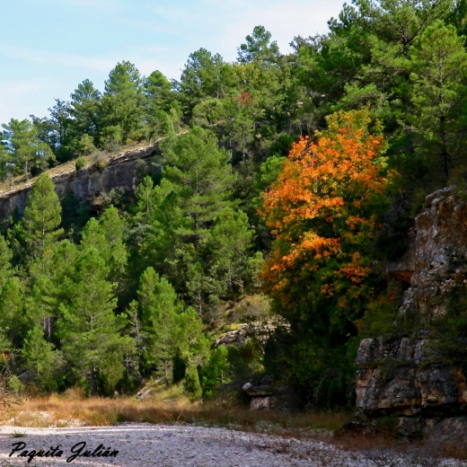

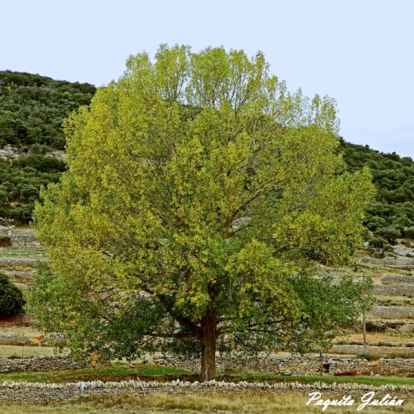

Acer - Arce real Ulmus - Olmo

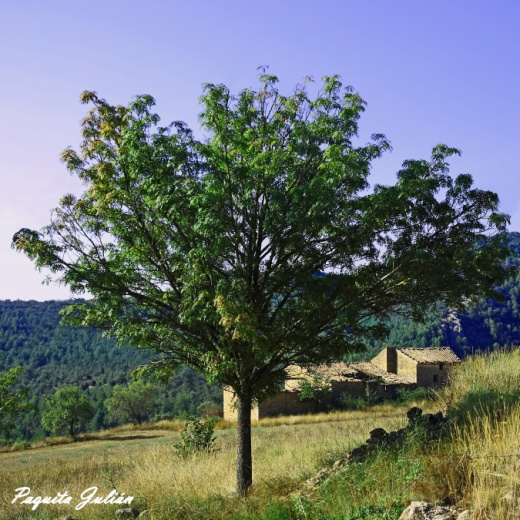

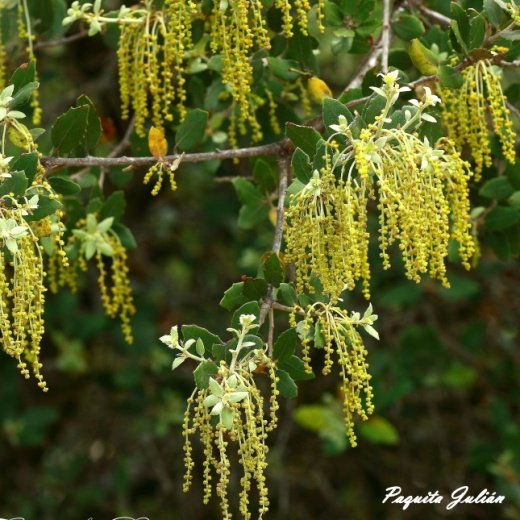

Serval Quercus ilex Carrasca floración

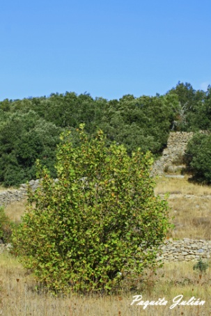

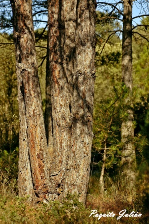

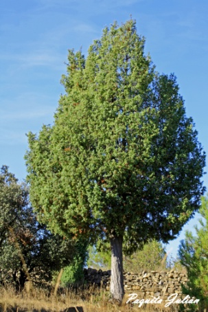

Corylus avellano Pino laricio Juniperus enebro

ÁRBOLES - ARBUSTOS

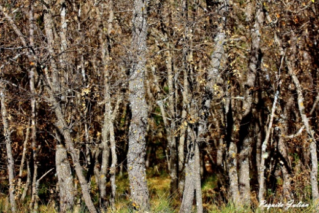

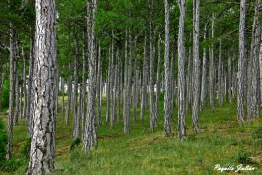

Quejigo Pinus sylvestris Pino albar

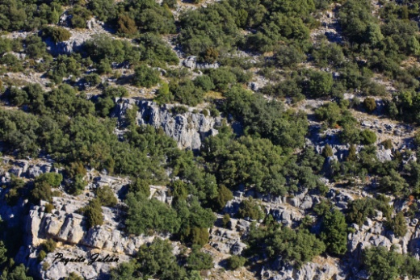

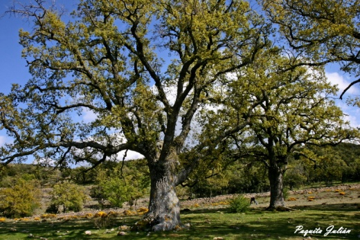

Coscoja Querqus faginea Roble

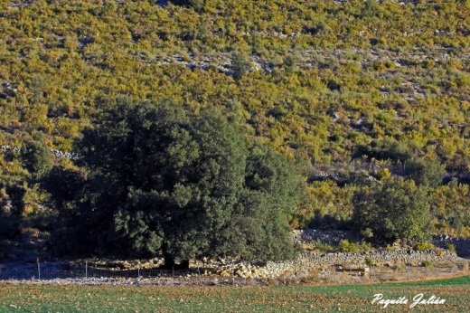

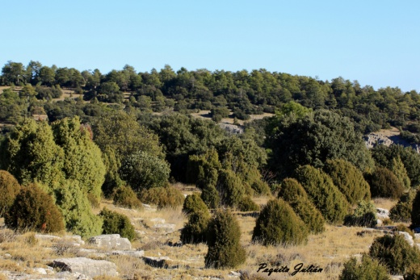

Querqus linex Sabina, enebro, carrasca, pino

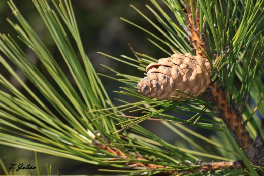

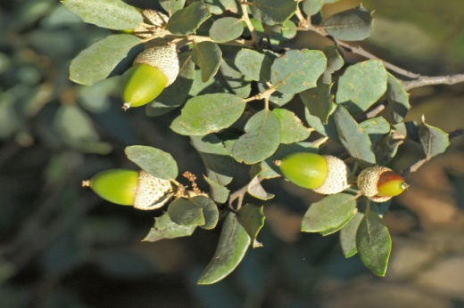

Pinus pinea Piña Bellota de carrasca

FRUTOS Y BAYAS

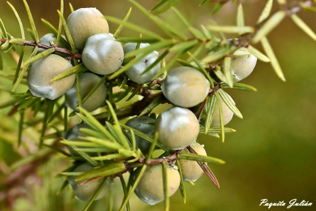

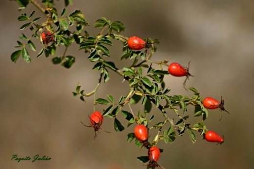

Enebro común Rosal silvestre

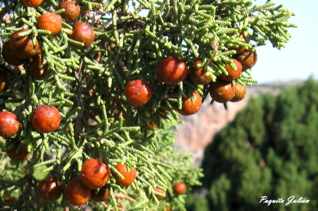

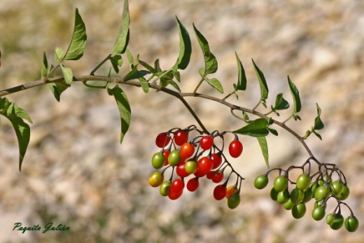

Sabina común Dulcarama

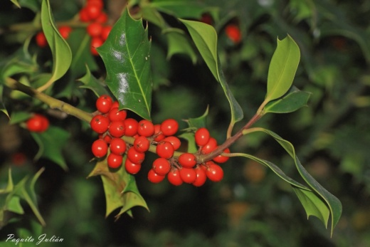

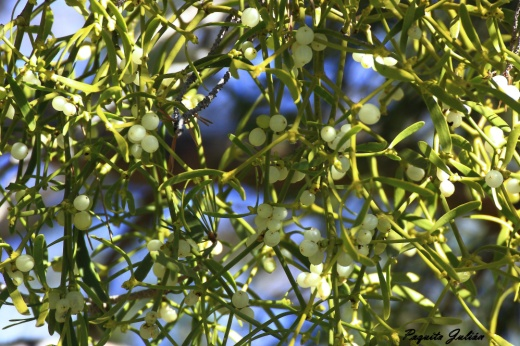

Acebo Muérdago

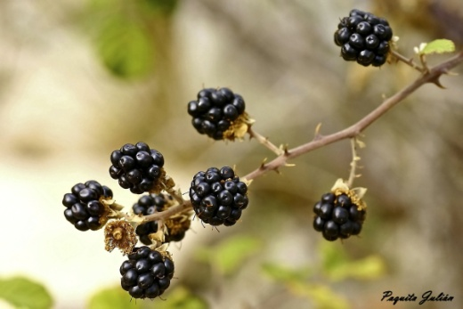

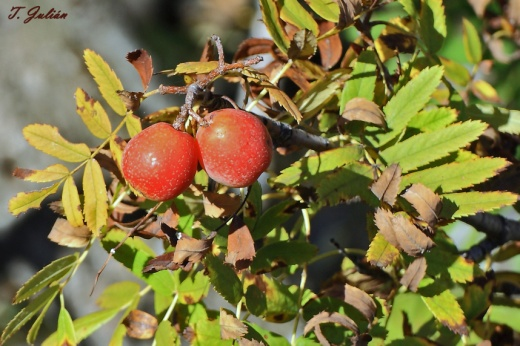

Zarzamora. Mora Zaraollas. Serves

FLORES

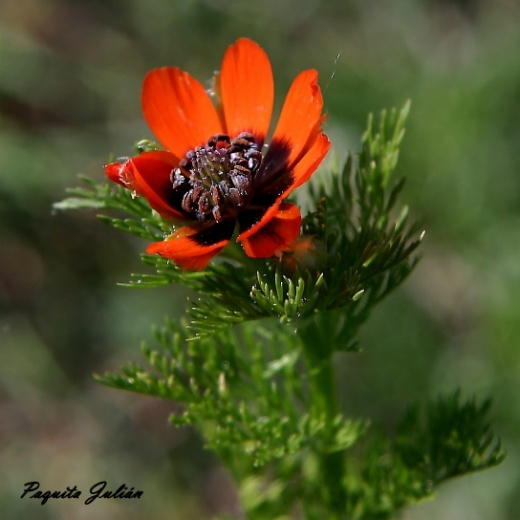

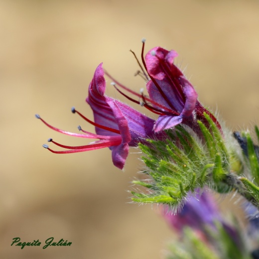

Adonis annua Echium plantagineum

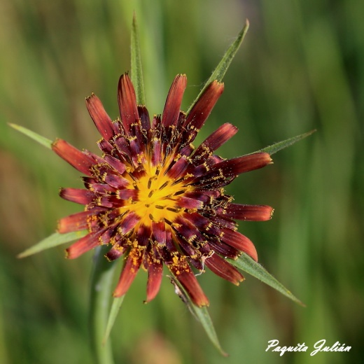

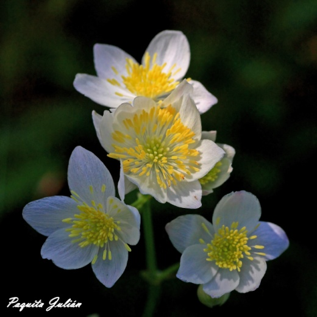

Tragopodón crocifolius Tralictrum tuberosum

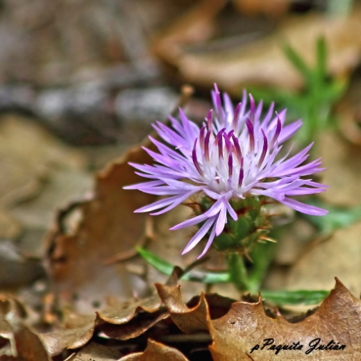

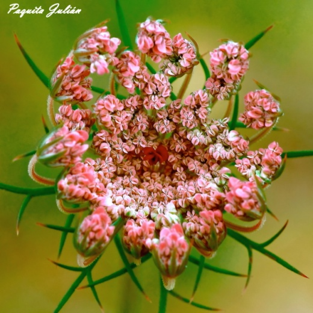

Centaura áspera Daucus carota

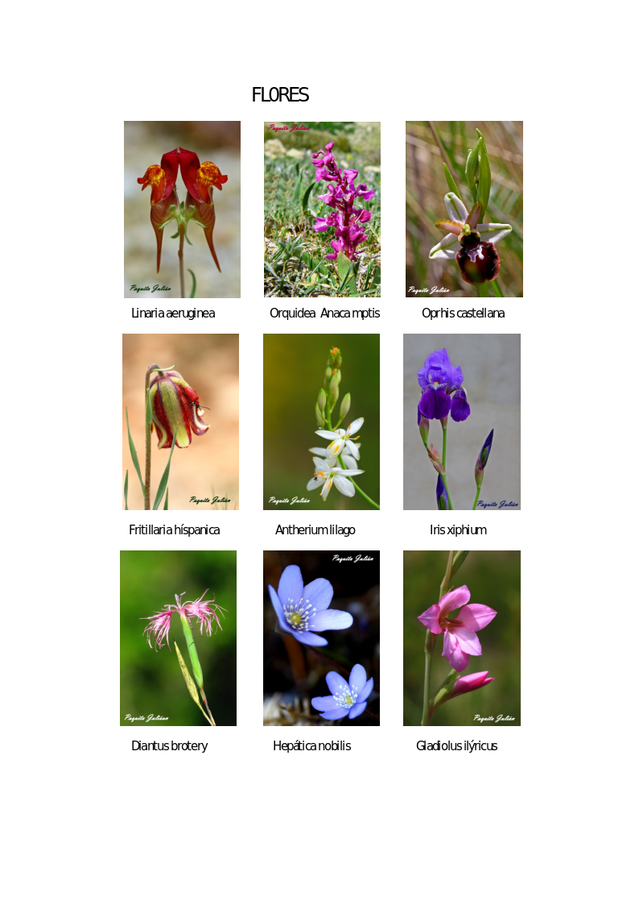

**<u>3. INVERTEBRADOS</u>**

El 95% de los animales invertebrados, no tienen esqueleto interno con columna vertebral. Son ovíparos (se reproducen mediante huevos).

**3.1**. ARTRÓPODOS.

Los artrópodos son animales con antenas, terrestres y recubiertos de quitina que endurece su cuerpo, formado por anillos con dos o tres pares de patas cada uno. Tienen respiración traqueal y experimentan mudas como: arácnidos, miriópodos insectos y crustáceos.

Los arácnidos, miriópodos, e insectos, son artrópodos terrestres que han colonizado los ambientes secos.

**3.2**. ARÁCNIDOS.

Los arácnidos tienen dos regiones del cuerpo: cefalotórax y abdomen, ocho patas, no tienen antenas, las partes bucales se llaman quelíceros, los cuales son colmillos en las arañas.

Las arañas son artrópodos terrestres, depredadores, comen varias especies de artrópodos, por lo general más pequeños que ellas mismas, grillos, moscas, abejas, chapulines (saltamontes) polillas y mariposas. Capturan su presa al acecho, por medio de cepos o tela de araña, incluso por el salto. La producción de seda forma parte de la vida normal de las arañas. Poseen hileras en los segmentos ventrales 10 y 11, hileras que son patas especializadas y varios tipos de glándulas que segregan distintos hilos de seda. La glándula mayor es la que fabrica la seda llamada de seguridad para tejer todo el entramado. La tela de araña es un prodigio de ingeniería. Fabrican hilos de la misma calidad pero distinto tamaño en función de su peso, forman hilos en forma de paracaídas que les sirve de transporte aéreo para desplazarse y también para encerrar a sus presas. Algunas arañas tienen ocho ojos, aunque la mayoría no puede ver muy bien con ellos. Las arañas tejedoras son casi ciegas. Se guían sobre todo, por el tacto y el olfato.

*Argiope.* Araña de listas amarillas y negras, fabrica telas geométricas para la captura de sus presas.

L*atrodectus*. Las tarántulas más peligrosas son la araña viuda, negra, de picadura mortal para el hombre. El término “viuda” viene de la costumbre que estas hembras tienen de devorar a sus compañeros machos, tras el apareamiento. Las arañas también tienen cortejos, el macho emite señales hacia la hembra.

*Lycosa*. Pueden producir veneno como la tarántula aunque no es peligrosa para el hombre.

Los enemigos de las araña son algunos insectos como ciertas avispas. Los de la familia (pompilidae) solo cazan arañas y las avispas alfareras (*Sphecidae*) insectos y arañas, que encierran en su nido vivas para servir de alimento a sus larvas.

En las zonas rurales se utilizan emplastos de telarañas para curar heridas en el ganado y animales domésticos.

*Scorpiones o scorpionida* Escorpión. Los escorpiones pertenecen a la clase de los arácnidos, y están estrechamente emparentados con las arañas, ácaros y garrapatas. Los escorpiones tienen ocho patas y un par de pinzas similar a las de un cangrejo. Llevan el veneno en una glándula en la parte posterior de la cola, dándole cierta apariencia amenazante y feroz.

**3.3.** MIRIÁPODOS. (Con muchos pies)

Son los primeros artrópodos mandibulados, que no han desarrollado la cala cérea como los arácnidos e insectos. Por ello pierden agua por evaporación, y tienen que hacer vida nocturna y pasa el día debajo de las piedras. Su cuerpo tiene dos partes: cabeza y tronco. Su cabeza se parece a la de un crustáceo, pero solo conservan el primer par de antenas, y tienen respiración traqueal. Presentan numerosos pares de patas articuladas, estas son como las de los arácnidos, para caminar por el suelo.

**Scolopendra.** Ciempiés. El primer par de patas se transforma en uña venenosa, en relación a su habito depredador.

**3.4.** INSECTOS.

Los insectos tienen mandíbulas como los miriópodos y parecen ser descendientes especializados de los mismos. Su cuerpo está dividido en segmentos: cabeza, tórax y abdomen.

Cabeza. Su cabeza es de tipo miriópodo con ojos desarrollados como los crustáceos. En la cabeza se encuentran las antenas situadas generalmente entre los ojos o algo debajo de ellos. La mayoría de los insectos utilizan las antenas para percibir sensaciones táctiles, mientras que otros como órganos olfativos o auditivos. Los ojos son de dos tipos. Los grandes ojos compuestos constituidos por facetas cada una de las cuales pueden tener una lente de una unidad ocular, algunas tienen muchas unidades oculares en cada ojo compuesto. La boca de ciertos insectos está adaptada para determinar cómo horadar tejidos o sorber líquidos.

Tórax. La segunda parte del cuerpo de los insectos, generalmente están implantadas las alas y las patas del animal. Tiene tres pares de patas, y dos o cuatro alas. Experimenta transformaciones en su desarrollo y respira por tráqueas comunicadas con el exterior.

Abdomen. El abdomen de los insectos está formado por placas, unas superiores y otras inferiores, mientras que en los lados se encuentran las membranas. Son la fauna dominante en todos los medios terrestres. Ningún grupo animal de los invertebrados se ha extendido por la superficie como lo han hecho ellos. Se han adaptado a todos los ambientes terrestres. Forman más del doble de todas las demás especies de animales juntas. Una particularidad consiste en que mientras crecen deben mudar varias veces su esqueleto externo.

Algunos aspectos conocidos de los colores de los insectos se han producido en respuesta a camuflarse de sus depredadores. Las manchas en forma de ojos de alguna mariposa confunden al depredador al no saber dónde está la cabeza, o la forma de parecerse algún objeto inanimado como una hoja. Estas coloraciones que imitan a otras especies se denominan miméticas. En cambio los animales tóxicos o repugnantes se revisten de colores vistosos y contrastados como negro y amarillo y anaranjado, ejemplo: avispas, chinches, etc. para enseñar a sus posibles depredadores que aprendan a reconocerlos y no se equivoquen en otra ocasión

**Coleópteros.** Las mariquitas o coccinélidos gozan de la estima del hombre en todos los países, se alimentan de insectos tan perjudiciales como los pulgones, en general, son muy beneficiosos para la agricultura. Las múltiples denominaciones populares de estos insectos demuestran su notoriedad. Su nombre se remonta a la Edad Media en cuya época se les puso bajo la advocación de la Virgen María llamándolas: escarabajos de Nuestra Señora, en Italia se conocen como gallinitas de Nuestra Señora, ovejitas de Dios en Alemania, avecillas de la Virgen n Inglaterra, en España las conocemos como mariquitas. Se conocen 5.000 especies la mayor parte miden menos de un centímetro. Su forma puede ser ovalada o esférica. En su mayoría son de color rojo anaranjado con motitas negras. También las hay de color negro y motitas de color rojo anaranjado. Todos los ejemplares adultos se aletargan durante el invierno, se pueden encontrar enterrados debajo de matorrales secos, entre las grietas de las encinas, amontonados unos encima de otros en gran número en sus refugios invernales.

***Dípteros.*** Esta orden incluye animales tan conocidos como las moscas, mosquitos, tábanos y otros muchos menos conocidos.

Se caracterizan por sus alas posteriores que se han reducido a halterios, o estructuras claviformes en forma de mazo, usados, para controlar la dirección del vuelo, y solo poseen dos alas membranosas y no cuatro como el resto de insectos. Algunas especies reciben el nombre de moscardones, dado su gran tamaño, su cuerpo peludo y el zumbido más grave de su aleteo.

**Hemipteros**. Los chinches de las plantas se caracterizan por poseer alas que están divididas por una mitad basal dura y la otra mitad membranosa. Su aparato bucal es de tipo chupador con 4 estiletes que según las especies chupan savia o sangre, como en el caso de chinches de cama que produce enfermedades.

Aunque hay especies depredadoras o parásitas, la mayoría se alimenta de las plantas gramosas, de las que sustraen la savia y por esta causa los vegetales se debilitan, tienen problemas de floración y de desarrollo de sus frutos.

Los chinches tienen pocos depredadores porque acumulan en su cuerpo el compuesto de mal sabor que encuentran en las plantas lechosas que sustraen generalmente en el revés de las hojas. Su coloración brillante anaranjada rojiza y negra sirve para avisar que saben mal.

He localizado un ejemplar de Leptoglossus occidenntalis. Esta chinche gigante norteamericana amenaza los pinos al destruir las semillas de sus piñas cuando son tiernas. La principal característica son sus grandes patas traseras aplastadas en forma de hoja, algo muy propio de las especies americanas. Son una plaga forestal que en España se encuentran por primera vez en 2004 en Gerona, avanzan rápido y son más abundantes que las especies autóctonas. Su aparato bucal es un picador a través del cual con una especie de pajita succiona la savia de las piñas tiernas.

**Himenópteros.** Insectos sociales. Las abejas, avispas y hormigas llamadas himenópteros son insectos sociables, son un admirable ejemplo de organización. La mayoría de las especies de este orden son muy útiles para el hombre, ya sea como polinizadores o controladores biológicos de plagas.

En estos grupos o colonias cada individuo tiene un cometido determinado. Las reinas ponen huevos, las obreras procuran los alimentos, atienden a la reina y cuidan de las larvas. Algunos individuos son vigilantes y protegen las colonias.

Las abejas no solo producen miel, su mayor utilidad reside en su función polinizadora. Se calcula que aproximadamente el 85% de los vegetales que se emplean en la alimentación humana tanto hortalizas, árboles frutales y demás plantas son polinizadas por insectos en su mayoría abejas.

*Apis melífera*. **Abella**. Abeja de la miel, forma sociedades numerosas y duraderas. La sociedad está formada por la reina y sus hijas, que realizan todo el trabajo, hacen la colmena con cera, en cuyas celdas la reina va depositando los huevos. La fecundación de la reina tiene lugar una sola vez y conserva la fertilidad toda su vida. La reina llega a poner hasta 2.000 huevos diarios a lo largo de su vida que dura de tres a cinco años. Las obreras son las que decidirán si en una celda el huevo originará un macho o zángano, o bien una obrera o hembra. Cuando la colonia de abejas se encuentra superpoblada, una reina y algunas obreras forman un enjambre. Mientras las abejas exploradoras buscan un lugar para establecer la nueva colonia el enjambre descansa.

Al grupo de las abejas pertenecen los abejorros Bombus, también alimentan a sus larvas con polen y miel, pero es una sociedad que no duda utilizar la agresión física por parte de la reina dominante.

*Avispas*. **Vespes**. Las sociedades de himenópteros avispa, están formadas por la madre y su descendencia todas hijas. Los machos aparecen cuando la sociedad está madura y solo tienen la función de fecundar a las hembras, tras lo cual ellos mueren. Son alimentados por las obreras.

Las sociedades de las avispas son temporales, deshaciéndose en otoño, antes machos y hembras asexuadas realizan el vuelo nupcial para la fecundación. Los machos mueren y las reinas pasa el invierno en letargo, hasta la primavera que se inicia un nuevo nido.

Las avispas alfareras, son una subfamilia de las avispas comunes, es solitaria y depredadora, se alimentan atacando a las arañas que tejen telarañas y orugas. Se llama así porque construye su nido con barro en forma de vasija o tubos de órgano que adhieren a tallos o muros. Se producen dos o tres generaciones al año.

*Formicidae*. **Formiges.** Las hormigas son especies sociables. El tamaño y la forma varían de una especie a otra. Una de sus características son las antenas articuladas y la protuberancia que poseen en el delgado pedículo que conecta el tórax con el abdomen. Su sociedad también está formada por la reina madre (aquí pueden haber varias reinas) y sus hijas forman nidos muy numerosos. Son animales terrestres, hacen sus nidos en el suelo y también en los troncos de los arboles. A diferencia de los otros himenópteros, las obreras carecen de alas.

**Lepidópteros**. Mariposas, polillas. **Papallones**. Desde niños a través de la literatura infantil conocemos a las mariposas, son insectos con alas cubiertas de escamas. Las mariposas constituyen uno de los mayores órdenes de insectos lepidópteros ya que existen más de 100.000 especies.

Los lepidópteros sufren metamorfosis completa, pasan sucesivamente por los estados de huevo, oruga, crisálida y adulto. Las hembras de ciertas especies depositan los huevos aislados entre sí mientras que otras los depositan formando pequeños grupos. Por lo general cada huevo va adherido al tipo de planta del cual se alimenta la oruga, otras especies los diseminan al azar. Ciertas mariposas ponen los huevos en el interior de los tejidos de las plantas y otras las recubren con una capa protectora muy resistente. Las orugas de casi todas las mariposas diurnas y nocturnas suelen ser de forma cilíndrica.

Como todos los insectos su cuerpo está dividido en tres tramos. La cabeza, el tórax con seis patas y el abdomen, tienen la boca conformada para la succión.

Varias características distinguen a las mariposas diurnas de las mariposas nocturnas o polillas.

Generalmente las nocturnas reposan con las alas extendidas. Las diurnas cuando descansan por lo común juntan las alas de forma que parecen una especie de vela sobre su cuerpo.

Las diurnas se diferencian de las nocturnas porque sus antenas terminan en forma de mazo o porra, las polillas poseen diversos tipos de antena pero nunca con forma de maza. Las diurnas tienen el cuerpo delgado, las nocturnas además de los hábitos nocturnos tienen el cuerpo más grueso y poseen una prolongación en forma de gancho en el borde interno de las alas posteriores, las diurnas no lo tienen.

Fotografiar mariposas es muy laborioso, vuelan muy rápido y la única manera posible es hacerlo por la mañana, pronto, antes que caliente el sol, el momento adecuado es cuando están libando el néctar de las flores. El número hasta ahora fotografiadas en la Rambla Celumbres es de 37 especies. De las diferentes familias de mariposas de la Rambla Celumbres: Hesperiidae, Licaenidae, Papilionidae, Piediare, Nympalidae, las más numerosas son de la familia Nynphalidae y las menos de la familia Hespiidare.

**Mantoideos.** La orden de los mastoideos o mantis son insectos que identificamos a primera vista por su aspecto característico. Han evolucionado de manera que confunden a sus depredadores adaptándose a las formas de su medio. Tienen la cabeza muy móvil, patas anteriores prensoras adecuadas para capturar a las presas y antenas cortas generalmente muy finas. Vive en zonas de matorral seco. La orden comprende unas 2.000 especies.

La mantis religiosa debe su nombre a la posición que asume durante el acecho. Vive entre la hierba y los matorrales, en terrenos soleados, siempre al acecho de animales vivos, langostas y otras presas que captura de forma fulminante.

La reputación de ferocidad de las mantis proviene de la costumbre que tienen las hembras de devorar la macho durante su apareamiento; sin embargo esta práctica no es sistemática.

La empusa o mantis palo es más grande, lleva el nombre de un espectro de la mitología friega que con su aspecto de una joven bella encubría sus instintos sanguinarios.

**Odonatos.** Las libélulas son insectos de la orden de los odonatos. En época estival se aprecia los esplendidos reflejos metálicos de sus cuerpos y la delicadeza de las alas iridiscentes. Su hábitat natural se encuentra en las cercanías de los lagos, ríos, charcos y tierras pantanosas, sus larvas y ninfas son acuáticos. Son grandes pero a causa de su vuelo las confundimos con los caballitos del diablo de menor tamaño. Las alas anteriores de las libélulas son mayores que las posteriores; los caballitos del diablo tienen ambos pares del mismo tamaño. Los ojos de las libélulas son extraordinariamente grandes y compuestos de muchas facetas y tienden a extenderse por encima de su cabeza; la de los caballitos del diablo parece sentadas sobre unos resaltes. Cuando reposan las libélulas tienen las alas extendidas y los caballitos las tienen plegadas en sentido vertical al soporte donde están parados.

Su vuelo es sorprendente, a veces como un helicóptero, o hacia atrás, en línea recta, abajo y hacia los lados, con elegancia y gracia, como un bailarín.

En estos insectos las ceremonias nupciales son muy singulares: aparecen como competiciones, en las que el macho precede siempre a la hembra y se aferra por el dorso con las pinzas.

**Ortópteros.** Los saltamontes, grillos se encuentran en la mayoría de los hábitats terrestres, son de tamaño medio a grande, cabeza grande y ojos compuestos, su aparato bucal es masticador. Poseen dos antenas en forma de hilos, que varía de longitud según familias, generalmente tienen dos pares de alas anteriores y posteriores.

En los octópodos el sonido nunca se origina en la boca, presentan órganos auditivos y estriduladores. La estridulación es la producción de sonido al rozar dos partes del cuerpo.

En el saltamontes el chirrido se produce al rozar las patas sobre las alas.

En el grillo se produce al rozar las alas anteriores.

Los grillos son animales crepusculares, nocturnos y territoriales. El famoso cri cri es parte fundamental en la reproducción, entre otras cosas para atraer a la hembra.

Son insectos con metamorfosis incompleta, pasan por tres fases: huevo, ninfa y adulto. Se alimentan mayoritariamente de gran número de plantas, son gregarios constituyendo a veces en plaga de cultivos, una buena muestra son las langostas.

ARÁCNIDOS

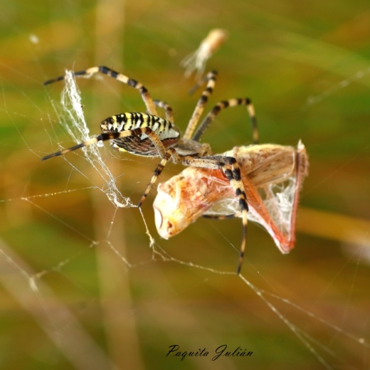

Arguiote bruennichi Araneus diademotus

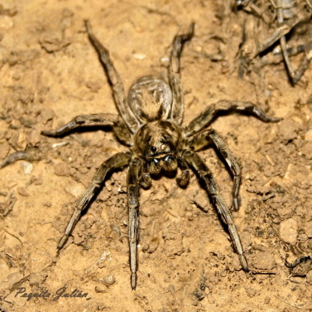

Lycosa tarántula Buthus occidentalis. Escorpión amarillo

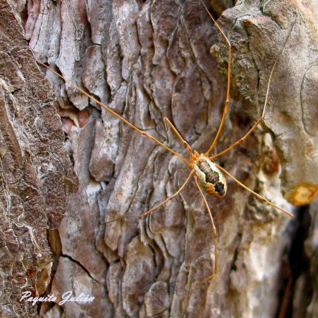

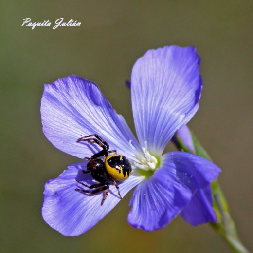

Plalangius opio Synema globosum

COLEÓPTEROS

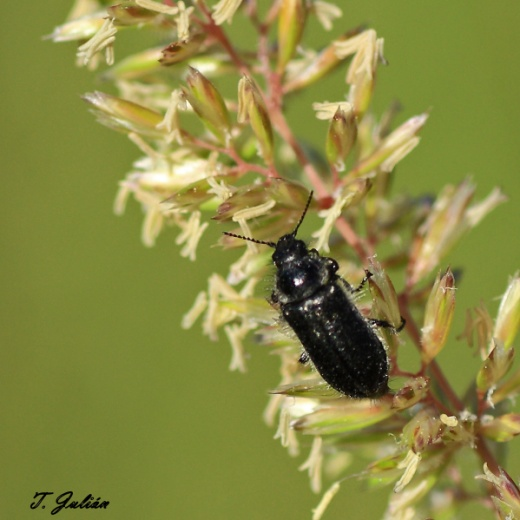

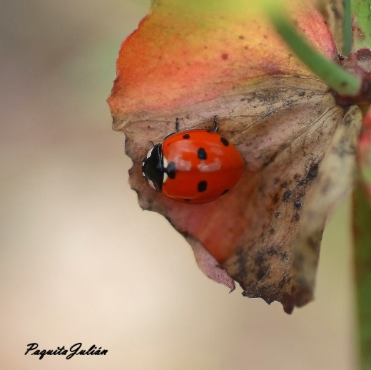

Acmeodera cylidrica Coccinella septempunctata

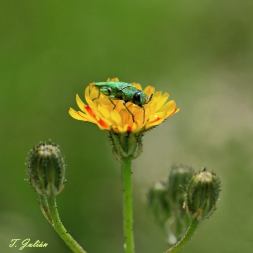

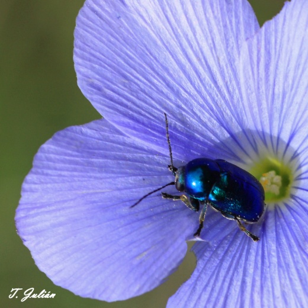

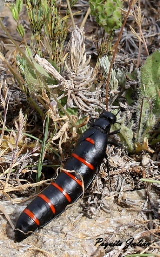

Anthaxia hungarina Clytocephalus

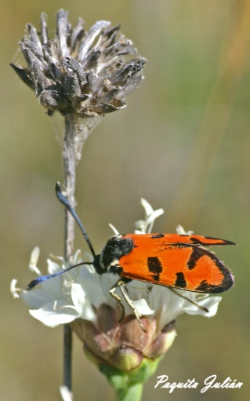

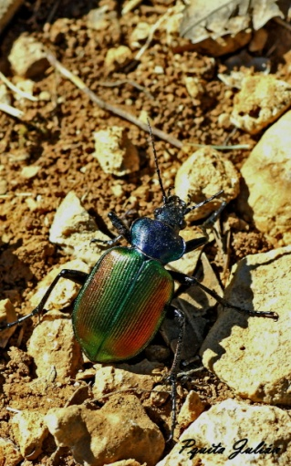

Calosoma sycophanta Zygaena hilaris Berberomeloe majadis

DÍPTEROS

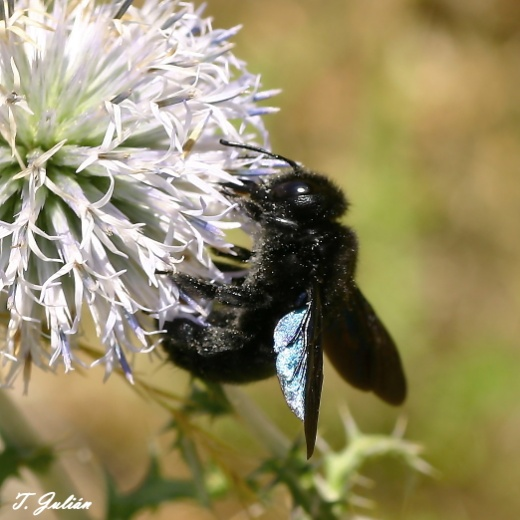

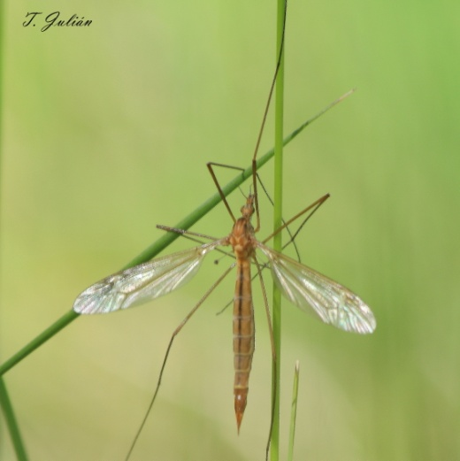

Xilocopa Típula Mosquito

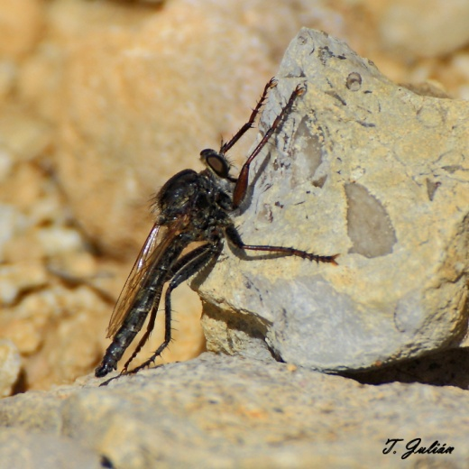

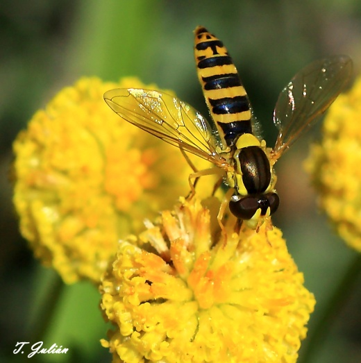

Lapia, marginata Sphaeropharia scripta

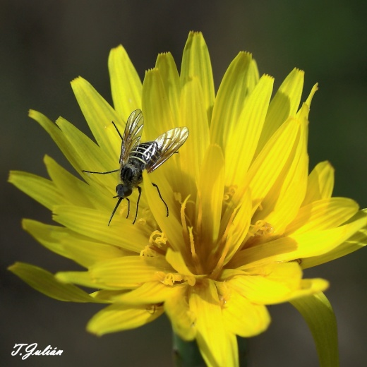

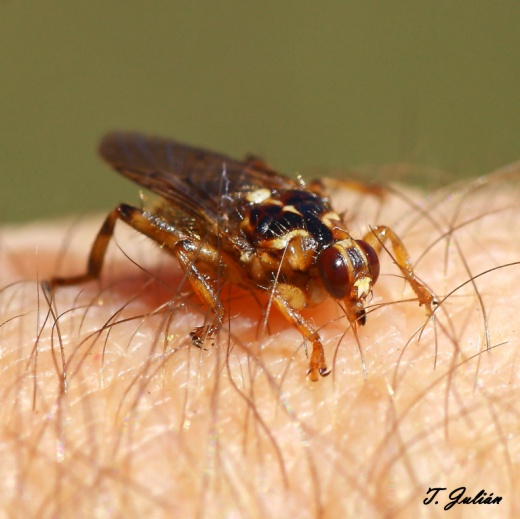

Paragerón incisus Tábano

HEMÍPTEROS

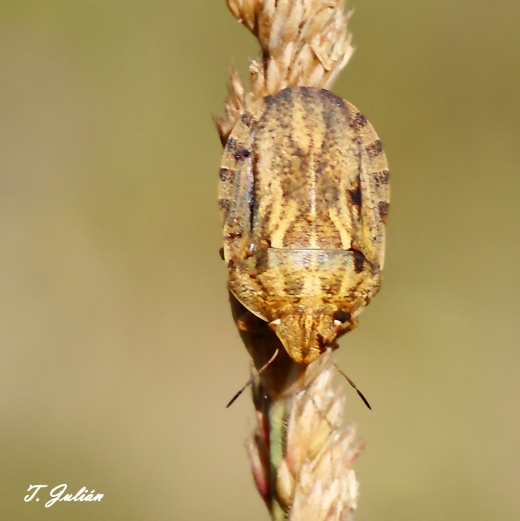

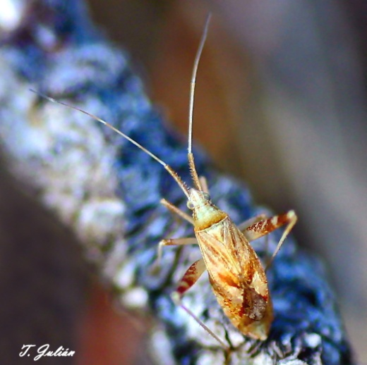

Rhaphigaster nebulosa Leptoglossus occcidentalis Chinche del pino

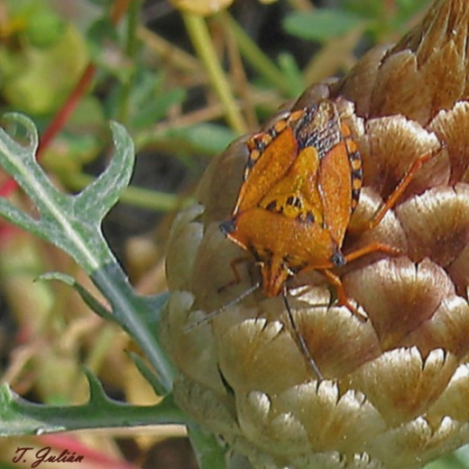


Codophila ninfa Codophila varia


Dolycoris baccarum Graphosoma lineatum

HIMENÓPTEROS


Polistes ninfa Avispa alfarera


Bombylus maior Apis melífera


Camponotus cruentatus Bombus terrestris

LEPIDÓPTEROS


Brintesia circe F. Nympalidae Melitaea proebe F. Nympalidae


Melanargia Galatea F. Nympalidae Pyronia bathseba F. Nympalidae


Argynnis paphia F. Nympalidae Iphilides Polihanidae F. Papihanidae


Euchloe crameri F. Pieridae Zerynthia rumina F. Papihanidae

LEPIDÓPTEROS


Colias alfacariesis F.Pieridae Argimis pandora F.Himphalidae


Polyommatus belagus F. Lyncaenidae Aricia montesis F. Lyncaeniade


Pyrgus malvae F. Esperidae Argimis pandora. Nympalidae

MARIPOSAS NOCTURNAS


Catocala nymphaca Ideata ochrata


Euclidia gliphica Chiasmia dathrata


Adscrita S P Pherphorus perladactyla

MANTOIDEOS


Mantis religiosa


Empusa penata

ORTÓPEROS


Oecanthus pellucens Grillo Chapulin Saltamontes

ODONATOS


Sympetrum fronscolombu Sympetrum striolatum


Sympetrum sinaiticum Trithemis kirbyi


Libelloides hispanicus Coenagrionn puella Libelloides beaticus

**<u>4. VERTEBRADOS</u>**

Los vertebrados, se caracterizan por tener un esqueleto interno compuesto por piezas óseas y cartilaginosas llamadas vertebras, que forman la columna vertebral y el cráneo, cuyo sistema nervioso central está formado por la medula espinal y el encéfalo.

Por lo general el cuerpo de los vertebrados se divide en tres partes: cabeza, tronco (que a su vez se subdivide en tórax abdomen) y cola. Del tronco sobresalen las extremidades que son pares a excepción de las lampreas.

Los vertebrados acuáticos tienen un aparato respiratorio branquial mientras que en los terrestres el aparato respiratorio es pulmonar.

Los animales vertebrados se componen de peces, anfibios, aves, reptiles, y mamíferos.

**4.1.** ANFIBIOS.

*Pelophylax perezi*. Rana común. **Granota**. Especie acuática se encuentra en todo tipo de agua, charcos y pozos. Comparte hábitat con numerosas especies de anfibios terrestres. Cuando detectan la proximidad de un depredador la huida hacia el agua es uno de los principales mecanismos de defensa. Consume principalmente dipneos, coleópteras e himenópteros. Los adultos toman frecuentemente el sol.

**4.2.** AVES.

Las aves son vertebrados superiores, cuya temperatura particularmente elevada, oscila entre los 38º C y 44º C. Tienen dos pares de miembros, los delanteros presentan forma de remo y sirven para volar. Aparecieron hace millones de años a partir de la evolución de los reptiles.

Tienen un sistema pulmonar desarrollado, tienen patas y pico, poseen plumas y un esqueleto muy complejo.

Los órganos de los sentidos de las aves presentan varios grados de desarrollo. Algunos de ellos están muy evolucionados, mientras que otros son rudimentarios. Por ejemplo el sentido del gusto, debido a que las aves no mastican los alimentos sino que los tragan directamente, no son capaces de apreciar el sabor, como lo hacen los mamíferos. La mayor parte de las aves tampoco tienen el sentido del olfato.

El órgano del sentido del tacto se encuentra bajo el pico y sobre la lengua, otras aves lo tienen en la base de ciertas plumas o en las patas, las aves que buscan el alimento en el suelo tienen órganos táctiles en la punta del pico.

El sentido más importante para las aves es la vista. Están mejor dotadas en este aspecto que el resto de los animales.

Otro sentido importante es el oído, a pesar de que su estructura sea menos perfecta y se parezca a la de los reptiles.

***De la guía d’aus comunes a la Comunitat Valenciana. Cinctorres*** ,y en los observatorios de aves del municipio número 6  Els Tallants o Mirador y también la estación de censo donde se encuentra la Rambla Celumbres, son, un lugar privilegiado para la observación de aves autóctonas y migratorias, las aves que se citan son las especies más comunes y conocidas; Buitre leonado, Chova piquirroja, Carbonero común, Carbonero garrapinos, Vencejos sp, Pinzón Vulgar, Mirlo común, vencejo pálido, Mosquitero papialbo, Herrerillo capuchino, Pelirrojo, Avion roquero, Chochín, Agateador común, Paloma torcaz, Cuervo, Zorzal charlo, Pico picapinos, Pito real, Carruca capiolata, Mito, Reyezuelo listado, Petirrojo, Topados azul, Vendejo real, Lugano, Verdecillo, Cuco común, Picituerto común, Arrendajo, Escribano montesino, Acetor común, Halcon peregrino.

Aves comunes en todo el ecosistema también son: Águila real, Alcotán europeo, Cernícalo vulgar, Abubilla, Alcaraván común, Búho real, Golondrina común, Jilguero, Mochuelo europeo, Gavilán, Halcón de Leonor, Gorrión común. Garza Pic pica. Perdiz, Chotacabras europeo, entre otras.

**Rapaces.** Las rapaces diurnas son aves depredadoras falconiformes están situadas en los lugares más altos de las cadenas montañosas, comen carroña y por lo tanta realizan un papel regulador de los ecosistemas en que viven. Son cazadoras y han desarrollado características como una visión excelente para ver a sus presas mucho más perfecta que la de los hombres. Para capturar y desgarrar a sus presas están dotadas de garras y picos muy afilados. Presentan variedades morfológicas externas por el tipo de vida y alimentación diversa.

En los cortados calcáreos de la Roca Parda en la Rambla Celumbres son comunes las rapaces necrófagas que se alimentan de carroña.

*Aquila Chrysaetos.* Águila real. Caza al acecho, es una de las rapaces más amenazadas a causa de la degradación del territorio (disminución de presas como el conejo, etc.).

*Buteo buteo.* Ratonero común. **Aligot**. Ave de rapiña. Ocupa en invierno campos de cultivo y baldíos. Sufre la presión genética. Se alimenta de roedores, pájaros e invertebrados, es un ejemplo de rapaz poco especializada y oportunista.

*Falco peregrinus.* Halcón peregrino. **Falcó**. Los halcones tienen alas estilizadas y cuerpos esbeltos y pueden lanzarse con rapidez en picado sobre sus presas. En estos picados los halcones peregrinos pueden alcanzar velocidades de más de 300 Km por hora. Depositan los huevos en una pequeña oquedad o repisa cubierta. Suelen cambiar de nido cada varios años. Algunas parejas utilizan nidos vacios de otras aves para depositar sus huevos, entre los meses de marzo y abril.

*Gups fulvus.* Buitre leonado. **Voltor.** Vive en colonias, posee un característico collar de largas plumas leonadas, es una de las mayores rapaces que pueden encontrarse en la península a ibérica.

**Córvidos.** Los córvidos han evolucionado dentro de las paseriformes es uno de los animales más inteligentes y de gran adaptabilidad. Los más conocidos son los siguientes aunque hay más de pequeño tamaño.

*Corvux coracs.* Cuervo común. **Corb**. Esta especie es capaz de aprender y repetir palabras, es territorial, ocupa su nido año tras año, lo cual lo hace vulnerable a la presencia urbana, buscando hacer sus nidos prioritariamente en cortados, viven de 10 a 15 años su régimen es omnívoro y oportunista, juntándose muchos ejemplares en basureros, busca ganados muertos, residuos alimentarios, cereales, bayas frutas y pequeños animales. ** **

*Garrulus glandarius*. Arrendajo. **Gaig.** Su voz rampante es característica en los bosques tanto de coníferas como de encinares. Su grito de alarma a veces en coro, alerta de cualquier peligro, imita las voces de otros animales. Es un ave forestal por excelencia que se alimenta de vegetales (bellotas, hayucos), tiene por costumbre esconder en el suelo frutos como las bellotas, de esta manera ayuda a la dispersión de los arboles.

*Garza* (urraca) Pica pica. El papafigo con su cola larga tornasolada y su plumaje blanco y negro es un córvido muy bonito. Necesita espacios abiertos pues come en el suelo. Se alimenta de todo como gusanos, frutos, tubérculos, carroñas, y tiene la costumbre de enterrar comida supuestamente para ir a buscarla después.

Vuela con la cola estirada y las alas redondeadas, en invierno al atardecer se juntan pequeños grupos para ir al dormidero, situado en pinos y grandes árboles.

*Pyrrhocorax pyrrhocorax*. Chova piquirroja. **Gralla de bec roig**. Vuela en grupos, realizan frecuentemente picados muy acrobáticos, nidifican en rocas y grietas. Son aves muy sociables comen en el suelo mexcladas con otras aves.  

**En el Catalogo Valenciano de Especies de Fauna Amenazadas de La Generalidad Valenciana,** por lo que respecta a la fauna, el grupo de aves es el más abundante y requieren medidas de protección. De las 88 especies de aves censadas en la zona cerca del 20 %presentan algún grado de amenaza. Lo mismo ocurre con el grupo de mamíferos, también relevante.

**4.3**. MAMIFEROS

Los mamíferos, originariamente terrestres, evolucionaron en animales adaptados al vuelo, a la vida acuática y a la terrestre. Hay mamíferos adaptados a la vida arbórea, a la vida subterránea, al medio propiamente terrestre, con a su vez gran número de nuevas adaptaciones según el lugar donde se vive. La adaptación se manifiesta principalmente en la alimentación, en el desplazamiento, y en su mecanismo de defensa. Son animales que reciben su nombre debido a que la madre alimenta sus hijos amamantándoles.

El comportamiento de los mamíferos se caracteriza por la capacidad de aprender con mayor rapidez que el resto de los vertebrados. Modifican su conducta, a base de aprendizaje.

*Capra pirenaica.* La cabra montesa es la especie más emblemática de entre los *artiodáctilos* ibéricos, Pues es casi estrictamente ibérica.

Se distingue por sus desarrollados cuernos que les hace especialmente atractiva desde un punto de vista estético. Las hembras posees cuernos menores.

Su hábitat son los sistemas montañosos agrestes y duros con desniveles y cortados como los Montes y Rambla Celumbres. Su dieta es estrictamente vegetal, incluso encaramarse a los arboles para comer sus hojas y frutos. El celo ocurre en octubre-noviembre y es muy espectacular. Los machos golpean fuertemente sus cuernos. Son polígamos, los partos en primavera, casi siempre un único cabrito. Se pueden encontrar todo tipo de grupos (mixtos o no) a lo largo de todo el año.

*Felix silbestri.* El gato salvaje se parece al gato doméstico, atigrado muy robusto, de color gris oscuro con tonos amarillos, su cabeza grande y la cola más corta y gruesa.

Es de carácter esquivo, solitario y agresivo. En época de celo puede buscar hembras domesticas en granjas y masías, rehúye la presencia humana y es muy difícil de ver. Se alimenta de pequeños animales, roedores, mamíferos, pájaros, caza por la tarde noche.

*Artiodáctilos.* Jabalí Mamífero terrestre con pezuña. Una de las peculiaridades de esta especie es la alimentación. El jabalí es un animal omnívoro, parte de su dieta es de origen vegetal bellotas, bayas, castañas, bulbos y raíces que obtienen horadando la superficie del suelo. Especialmente le gusta la trufa que percibe por su olor aromático y fuerte (las truferas de los campos están todas escarbadas parece que han pasado una manada entera y se las han comido).Ocasionalmente también comen carroña. La población de jabalíes tiene un patrón social definido. La hembra más vieja y experta, ocupa la posición dominante con otras hembras y sus crías llamadas *rayón*, los machos jóvenes deben abandonar el grupo cuando alcanzan la madurez sexual.

*Lepóridos.* El conejo es el más típico de nuestros *lagomorfos*. Vive en huras y orificios que el mismo excava, en la tierra o en agujeros entre piedras de las paredes y rocas, destacan por sus grandes orejas y patas largas. Son especies corredoras dado que son presas de numerosos depredadores y de los cazadores. Su alimentación es totalmente herbívora basándose principalmente de gramíneas papilionáceas. Poseen una tasa de reproducción muy elevada pudiendo colonizar un área en poco tiempo. Sus crías nacen desnudas con los ojos cerrados y no pueden caminar, formando colonias. Históricamente es la pieza más común de caza menor.

Las liebres son más grandes, no excavan madrigueras, tienen las patas traseras más grandes y también las orejas manchadas de negro en las puntas. Las liebres viven en solitario solo se juntan en época de apareamiento. Sus crías nacen con pelo y pueden andar recién nacidos.

*Mates foina.* La garduña tiene cola larga y bien poblada de pelo y un característico babero blanco en el pecho que se extiende por las patas. Junto al tejón son los dos mustélidos de aspecto alimentario más amplio, casi carnívoro. Come frutas, mamíferos, aves y sus huevos, reptiles e insectos y no dudan en ingerir anfibios y peces. La miel es uno de sus alimentos preferidos. Vive en todo tipo de hábitats, menos zonas húmedas, aunque prefiere los roquedos, y cañones rocosos.

*Mustela nivalis.* La comadreja es el más pequeño de los mustélidos. Los machos son 30% más pesados que las hembras.

Gracias a su pequeño tamaño y forma de salchicha puede introducirse por pequeños agujeros y orificios de los arboles, zarzas rocas, y piedras. Su dieta preferida son ratones, musarañas, etc. y si surge la ocasión, también pájaros.

*Sciurun vulgaris.* Las ardillas son animales inconfundibles. Su cola es larga y esponjosa, en el invierno le salen pelos como un pincel en la punta de las orejas, viven en los bosques de coníferas y caducifolios. Se alimentan de piñones, nueces, avellanas, hayucos y otros frutos de los arboles. No es difícil ver como saltan de pino en pino.

*Soricidae.* La musaraña es de mediano tamaño (hasta 72 mm de cabeza-cuerpo y 8 g de peso corporal) y cola relativamente larga (hasta 46 mm), de longitud siempre superior a la mitad de la longitud cabeza-cuerpo. El pelaje es denso y suave. En los adultos, el pelaje es generalmente tricolor, variando de sepia a pardo oscuro en el dorso, más claro en los flancos y gris amarillento en el vientre. Los juveniles muestran una coloración más pálida, sin contraste notable entre las regiones dorsal y lateral. La cola es bicolor (sepia por encima y ocre oscuro por debajo) y los pies son ocre sucio. El cráneo presenta el rostro relativamente corto y ensanchado en la parte anterior del paladar. En visión lateral, el perfil dorsal del cráneo es recto.

*Meles meles*. El tejón es un mustélido grande con poca vista (aunque si olfato y oído) y algo torpón. Sin embargo cuando es necesario puede ser rápido, suele vivir en pequeños grupos familiares que ocupan una o varias tejoneras excavadas en tierra, que a menudo se transmiten de generación en generación (he visto tres madrigueras debajo de grandes acantilados en la Rambla Celumbres que posiblemente estén comunicadas) Comen prácticamente todo la que encuentran, lombrices, bulbos, frutos, artrópodos, huevos, aves. Ocasionalmente causa daños a la agricultura. Abunda en los bosques caducifolios.

*Vulpes vulpes.* El zorro es un carnívoro medio. Su gran adaptabilidad le ha valido que se le atribuya gran inteligencia y viveza. Su dieta es totalmente omnívora, come fruta, lombrices, insectos, mamíferos, aves, reptiles, carroña, y en caso de necesidad miel y todo lo que encuentra. Es frecuente si puede entrar en los corrales donde captura gallinas, conejos y otros animales domésticos. Es también perseguido por ser transmisor de la rabia.

**4.4.** REPTILES.

Se caracterizan porque se arrastran para desplazarse, poseen piel escamosa y generalmente patas y cabeza.

*Malpolon monspessulanus*. Culebra bastarda. **Serp pardalera**. Tiene costumbres diurnas rápidas y movimientos agiles. Esta considerada como **Especie protegida** en el catalogo Valenciano de Especies Amenazadas de Fauna (decreto 265/ 1994).

*Psammodromus hispanicus.* Lagartija. **Sargantana.** Especie de cuerpo largo y delgado. Tiene una pequeña cabeza puntiaguda, grandes extremidades traseras y una larga cola esbelta.

*Vipera Latastei.* Víbora hocicuda**. Escurçó**. Su hábitat, aéreas rocosas y pedregosas expuestas al sol de zonas altas con arbustos donde refugiarse.


**<u>5. MICROORGANISMOS</u>**

**5.1.** HONGOS Y SETAS.

Los hongos pertenecen a las criptógamas; una denominación que significa \<nupcias ocultas\>. Sus órganos de reproducción no se ven a simple vista. Las esporas son reconocidas como semillas propias de algunos hongos.

Los términos hongos y setas son equivalentes. Se pueden distinguir en tres partes principales en la seta típica con forma de sombrero: el sombrero, el himenio y el pie. Existen otras setas de forma mucho más rara.

El sombrero es la parte más carnosa de la seta.

El himenio, es la parte fértil de la seta, la que contiene las esporas y suele encontrarse debajo del sombrero entre este y el pie, al que podíamos asimilar como el tronco de la seta. El himenio es el encargado de producir y diseminar los millones de minúsculas esporas que darán lugar al nacimiento de nuevos micelios y por la tanto de nuevas setas. Son capaces de lanzar sus esporas a casi medio metro de distancia: mediante un autentico cañón fúngico, orientado por los rayos del sol.

Las esporas de las especies de hongos que nacen en los árboles están recubiertas de una especie de pegamento que la impiden alejarse del mismo tronco, solo allí tiene posibilidades de fructificar, otra forma de diseminación de esporas es realizada por los insectos que frecuentan numerosas setas o bien para poner los huevos o para alimentarse de ellas.

Los hongos que viven en el bosque se adaptan descomponiendo la materia orgánica muerta. Otra forma de vida de los hongos es establecer una simbiosis con las raíces de los arboles. El árbol también tiene beneficios de esta unión, alargan su sistema radical y así consiguen más agua y nutrientes del suelo. La mayoría de los hongos no saben vivir de otra manera y solo se desarrollan cerca de su árbol amigo. Esta mutua dependencia explica porque algunas setas aparecen solamente en ciertos bosques.

Los hongos de la madera son pequeñas setas en forma de abanico que crecen formando repisas sobre los troncos de los arboles. Estos hongos llevan una importante misión para la vida del bosque. Descomponen la madera y logran degradar compuestos orgánicos como la celulosa. Si toda la materia orgánica muerta permaneciera mucho tiempo inalterado, los bosques quedarían sin espacio para el normal desenvolvimiento tanto de la vida vegetal como animal.

Como en todos los seres vivos la química de los hongos y de las setas es compleja variada y móvil.

El componente principal de un hongo suele ser en general agua que representan el 90% del peso en total, depende también de según sea la seta recolectada en periodo de lluvia o sequía y también el hábitat donde la encontremos.

En la Península Ibérica se encuentran alrededor de 4.000 especies de hongos y solo una cuarta parte producen setas que podemos llamar comestibles. De estas no llegan a 30 las que son realmente sabrosas y se pueden contar con una mano las que son realmente excepcionales.

Su valor nutritivo es poco, 1 Kg de setas aportan 400 calorías. Los níscalos o “robellons” son una de las especies más conocidas y valoradas.

Los boletus también son diversos y su sabor mejora los guisos.

La micología \<coger setas\> es una ciencia, es necesario conocer las distintas especies si se consumen. Alguna de las setas toxicas producen trastornos más o menos graves, algunas son alucinógenas y otras mortales. Desde la Antigüedad se han intentado distintos tratamientos para los envenenamientos por hongos. Está muy extendida la creencia, según la cual hacer hervir las setas sospechosas con sal y vinagre todos los posibles venenos debe desaparecer. No existen procedimientos culinarios que convierten comestible una seta venenosa. No se deben de comer si no se conocen

**5.2.** LÍQUENES.

Los líquenes dentro de los vegetales son especiales, no son un único organismo, sino la unión de dos distintos, un hongo y un alga que forman una simbiosis. No pueden vivir por separado.

El alga de la que se compone los líquenes gracias a su clorofila absorbe la energía de la luz solar y puede sintetizar azúcares, mientras el hongo absorbe del sustrato el agua los substratos que lleva disueltos.

El liquen crece como si fuera un solo individuo y así se le atribuye una sola nominación específica. El hongo es el que domina y forma casi todo el cuerpo del liquen dándole al crecer su forma y color. El alga se instala debajo de la superficie del liquen. Así es como recibe la luz que necesita para realizar la fotosíntesis, y el hongo le proporciona la humedad necesaria.

Los tipos de líquenes son variables aunque pueden resumirse en cuatro tipos: crustáceo, escamoso, folioso y fruticuloso. Cada especie de liquen se corresponde con un hongo distinto.

Son plantas pioneras, y muy resistentes. Al ser los primeros que colonizan un medio, como puede ser una roca, lo preparan para que formas superiores puedan asentarse en ella.

Se encuentran distribuidos por todo tipo de sustratos inertes u orgánicos desde las rocas desnudas, minerales, hojas, caparazones de animales, troncos de los árboles, etc. Una característica de los líquenes es su sensibilidad atmosférica. Cada especie tolera unos límites muy estrechos de sustancias contaminantes, por lo que su ausencia o su presencia permiten saber la carga atmosférica de productos contaminantes.

La escasez de animales que consumen líquenes es posible que sea por la capacidad de estos de segregar sustancias (los ácidos liquénicos y otras) que no les hacen aptos para ser comidos. Algunas sustancias liquenáceas tienen un poder antibiótico, que han sido utilizadas por el hombre. La mayoría de más de 400 sustancias liquenidas conocidas solo pueden ser producidas por el talo de los líquenes.

HONGOS – SETAS


Lycoperdon perlatum Amanita muscaria


Macrolepiota procera Lactarius deliciosus – níscalo


Armillaria mellea Hydnellum pechii


Fometopsis pinicola Macrolepiota procera

LÍQUENES

Caloplaca aurantia Parmelia caperata


Ramilea fracxinea Xanthoria calcicola


Xanthoria parietins Collema cristatum teloschistes chrysopphthaim

ES BIBLIOGRAFIA

Cinctorres volum I Introduccio a la Geologia del Terme. Cinctorres Club 1999. .

Enciclopedia de Ciencias Naturales de Centrarquidos a Granados. Editorial Brugera S.A.

Enciclopedia de la Naturaleza y Medio Ambiente. El Periódico.

Enciclopedia El mundo de los animales. Noguer Rizzoli. LAROUSSE. 1970.

Córdoba León, Juan M. Martin Toras, Gavino. Sesma Moranas, Jose M. Mariposas en libertad.

Mundi –Prensa Libros, S.A 2006.

Telleria Jorge, Mª Teresa. Los hongos. CSIC Catarata 2011.

Toharia Cortes, Manuel. El libro de las setas. Editorial Alianza. 1985.

Fotografias. Tadeo Julián Querol. Francisca Julián Querol.

Catálogo Valenciano de Especies de Fauna amenazada de la Generalidad Valenciana.

De la guía d’aus comunes a la Comunitat Valenciana. Cinctorres. Edita. ASSOCIACIÓ GRUP AU

Año 2000.
