Cuartel de San Francisco

Tras el traslado de su población, desde el Castell Vell al llano, en septiembre de 1251, la villa de Castellón empieza su desarrollo. En el mismo lugar, junto a la ermita de Santa Bárbara, y en distinta épocas, se han ubicado diferentes e importantes servicios, tanto de culto como sanitario y militar.

No se sabe con exactitud, la fecha de construcción de la ermita de santa Bárbara. Ésta se encontraba en extramuros, al lado de la Puerta de Valencia, era tierra de secano, viñas, y algarrobo. Su propietario, era el *consell*.

1411\. En documentos relativos al culto, aparecen datos en que Guillem Feliu se dirige al Papa Luna, pidiendo autorización para poder celebrar misa en la ermita de Santa Bárbara. Sobre esta consulta, en el Archivo del Obispado me comentan: “cuando el documento dice que se ha pedido permiso para celebrar misa, es posible que fuera esa la fecha o muy cercana la de su construcción”.

1502\. Después de dos siglos largos de la fundación de la villa, los monjes de San Agustín eran los únicos que tenían allí residencia. Rampston Viciana, lugarteniente del Gobernador General, creía conveniente tener también en la villa frailes franciscanos, y vio lo apta que era la ermita de Santa Bárbara, restaurada varias veces, y que estaba a la salida de la villa, al sur, con su *peiró*, rodeada de algarrobos y al lado del Pinar Vero o de Secano. El pinar, era de aprovechamiento comunal, extendido a lo largo del camino real de Valencia. El Gobernador de La Plana, junto con su asesor Micer Mascó, comunica al *consell* que una persona quería dar 10 libras de renta si se construye un monasterio franciscano. Reunido el *consell* en 18 de Marzo de 1502 se acordó conceder lo que pedían.

1536\. En esta fecha llegan tres frailes procedentes del convento de San Francisco de Onda. Puede decirse que es entonces la fundación del convento. Se establecen los llamados frailes de Santa Bárbara en aquellas modestas construcciones, que después fueron demolidas para levantar durante años y con la ayuda del *consell,* ya en pleno siglo XVII, el grandioso edificio con patio claustral, de tres plantas de orden corintio, concluido en la mitad del siglo XVIII. Durante años el c*onsell* prestará su ayuda y mediará en los conflictos entre las demás comunidades de las diferentes órdenes religiosas.

1596\. En mayo, el Papa Clemente VIII autoriza una cofradía puesta bajo la advocación de Santa Bárbara. En este momento el convento tenía cuarenta religiosos.

1659\. Por un protocolo notarial, sabemos que en la iglesia del convento existían varias capillas, entre ellas una dedicada a San Cesáreo y San Roque, San Jaime, San Diego, y también la de San Pascual Bailón.

1695\. El testimonio que ha pervivido del que fue el antiguo convento, es el lienzo que data de esta fecha, de estilo barroco; cuadro de altar que presidía alguno de los altares en el que aparece San Francisco mostrando sus estigmas, arrodillado en actitud de implorar y con la mirada hacia la virgen. Su autor fue: José Orient (c.1640- c.1714) pintor nacido probablemente por la zona del Maestrazgo (Sant Mateu?) Y también un retablo de azulejos con la imagen de san Francisco Con Fecha de 1698.

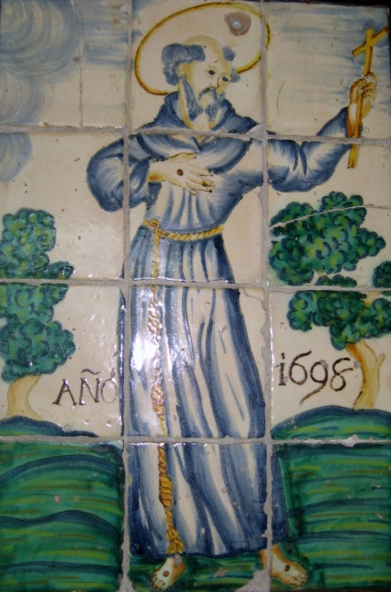

>

1696\. En diciembre de este año los frailes presentan un memorándum al *consell* pidiendo ayuda para el altar mayor de Santa Bárbara, percibiendo para ello la cantidad de 10 libras.

1705\. El pintor Eugenio Guillo pinta al fresco la capilla de la Trinidad. Nombre que dará lugar al barrio que se formará alrededor del convento.

1788\. El día 27 de diciembre, de manera imprevista, mueve el aire de Tramontana, a las doce horas y cuarto en que soplaba un viento terrible, derriba la pared del frontispicio de la iglesia hasta el anda del coro. Quedan muy dañados las capillas laterales y el altar mayor.

1790\. El prior solicita permiso para talar pinos del Pinar Vero que está al lado del convento, con los que levantar andamios para la restauración de la bóveda.

1793\. La iglesia de San Francisco fue reedificada, y una vez concluida la bendijo el obispo Salinas el día 9 de junio de este mismo año.

1808\. Iniciada la guerra del francés, el convento se convierte en cuartel de las tropas valencianas que subían hacia el Ebro, para enfrentarse con los invasores.

1809\. El convento, será utilizado como hospital militar. Los frailes se van a residir al convento de los dominicos de Santo Tomas. Pronto volverán para atender a los numerosos heridos. En julio de este mismo año mueren muchos soldados de fiebres, que contagiaran también a sus cuidadores.

1811\. El 26 de diciembre la partida del guerrillero Fraile Nevot (llamado así por haber sido franciscano descalzo Fr. Asensio Nevot) entra en la villa de 200 a 300 voluntarios y sorprendieron a varios soldados franceses que estaban desprevenidos fuera del cuartel. A partir de entonces el gobernador francés mandó que las tropas se retiraran al cuartel de San Francisco.

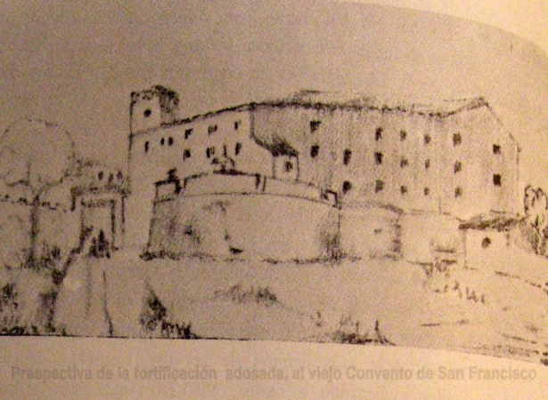

1814\. Volvió de nuevo a servir como hospital militar, para atender a las guerrillas que perseguían a los franceses.

1834\. Será otra vez convertido en hospital, pero ahora de coléricos. La comunidad religiosa seguirá prestando su valiosa ayuda.

1836\. Con el decreto de desamortización de Mendizábal (1835) los frailes abandonan el convento. Este edificio estaba comprendido entre los que debían excluirse de subasta por considerar pudiera ser utilizado en servicios públicos en virtud del Art. 2º del R D de 19/11/1836, siendo destinado en un principio para instalar en él la Casa de Beneficencia. El 2 de diciembre de 1842 el Ayuntamiento de Castellón se dirige al Regente del Reino, General Espartero, para que concediese el Convento de santo Domingo para instalar en él dicha Casa de Beneficencia en vez del de San Francisco, y que éste último se reservase para cuartel.

1837\. Junto al convento y como avanzada de las obras de defensa del futuro cuartel, se construye una batería, en uno de sus muros una lápida dice así: “La Victoria 1837”.

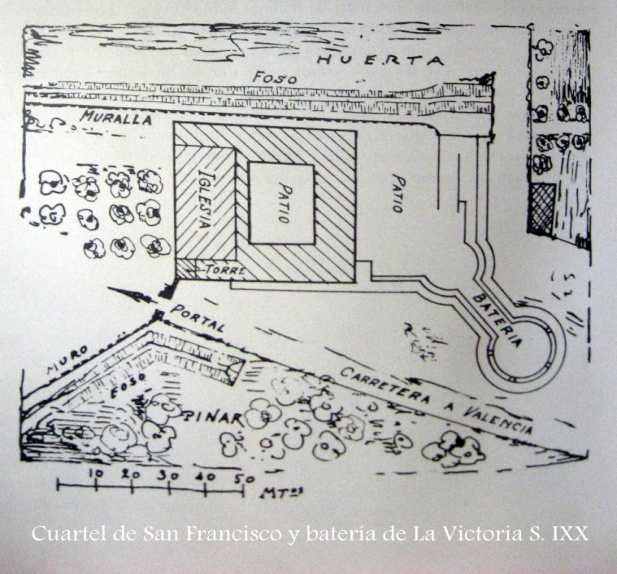

1840\. En este año, el edificio fue convertido en cuartel para albergar a las milicias, que hasta este momento pertenecían al “Quartel del Rey”

1843\. Se ponen a la venta nueve anegadas que constituían el huerto del convento junto al cuartel, por valor de cien mil reales de vellón.

1849\. Se ordena desmantelar las murallas del siglo XIX, excepto las continuas al convento

1852\. Fue publicado el plano de Castellón de la Plana por Coello, en el que están representadas las murallas, fuertes y baterías que pretendían convertir la ciudad en inexpugnable fortaleza. En él figura ya el “Ex-convento y fuerte de San Francisco” como Cuartel de Caballería e Infantería y junto a él estaba construida la batería de san Francisco.

1870\. Informe que se envió al depósito de la Guerra, sobre la situación del cuartel de San Francisco: “Situado a extramuros y al Oeste de la población, inmediato a la carretera de Valencia, estado del edificio regular, con capacidad ordinaria de 370 hombres y 48 caballos y extraordinaria de 500 hombres y 48 caballos. Tiene buena ventilación”.

BIBLIOGRAFÍA

Archivo del Obispado. Consultas.

BALBAS, Juan A.: **Casos y cosas de Castellón**. Imprenta y Librería de José Armengot. Castellón 1884.

MICHAVILA GIMENO, Vicente: **Del Castellón Viejo**. Est. Tip. Hijo de J. Armengot. Castellón de la Plana 1926.

ROCAFORT, Fr. Joseph.: **Libro de Cosas Notables**. Sociedad Castellonense de Cultura MCMXLV Castellón.

TRAVER TOMAS, Vicente: **Antigüedades de Castellón de La Plana**. Indus. Gráficas Hijos de F. Armengot 1982.

MADOZ, Pascual: **Diccionario Estadístico Histórico de Alicante Castellón y Valencia**. Tomo 1º

CURIOSIDADES

El lienzo de San Francisco, está datado en 1695, de estilo barroco, pero rodeado de una coloración fría, con una corporeidad pobre e iluminación plana. Se encuentra actualmente en el Museo de Bellas Artes de Castellón.

También el retablo cerámico de San Francisco, datado en 1698, está expuesto, en el Archivo Municipal de Castellón.

Los siguientes datos, son parte del archivo particular, cedidos generosamente para su estudio por:

D. Manuel Salvador Gaspar, Teniente Coronel.

1904\. Llega a Castellón el Regimiento de Infantería Tetuán nº 45 para relevar al de Otumba y permaneció en la ciudad (con batallones expedicionarios de la isla de Cuba y del norte de Marruecos) hasta el advenimiento de la 2ª República en que fue disuelto hasta febrero de 1953.

1931-1933. El cuartel de San Francisco durante la 2ª Republica fue sede del Batallón de Ametralladoras creado por Azaña. En 1936 lo abandonó para trasladarse al frente de Córdoba, y a lo largo de la Guerra Civil, soldados de varios batallones de las Brigadas Mixtas del Ejército Popular se instruyeron en su patio.

1939\. Con los batallones acuartelados en San Francisco se organizó el regimiento de Infantería nº, 10, que se desdobló a primeros de 1943 en otro Regimiento de la Serie 100, que recibió la denominación de Regimiento de Infantería 110, quedando acuartelados ambos en el mismo edificio, pero como el viejo cuartel, a pesar de haber sido ampliado con un nuevo pabellón, ofrecido por el Comercio e Industria de Castellón, con fachada a la calle Orfebre Santalínea, (más tarde Colegio Menor) era insuficiente para la guarnición del Regimiento 10 y su desdoblado, hubo que instalar dos compañías en un Campamento de barracones de madera en la carretera de Valencia y otras se alojaban en el Cuartel del Norte (edificio de la Harinera situada en el chaflán de la Avenida del Dr. Clará con la calle Lucena); dos unidades más en almacenes de la calle de Morella, y otras en unos almacenes situados en las proximidades del Estadio Castalia. Las cuadras de ganado estaban en la Avenida de Valencia, en un edificio situado entre las calles Barrachina y Escalante, frente al cuartel (actual Mercadona). Las unidades del Regimiento 110 durante el desembarco de los aliados en el norte de África, fueron destacadas a Benicasim, Grao de Castellón y Burriana.

1943\. La unidad militar que guarnecía Castellón pasó a denominarse Tetuán 14 y su desdoble 114, hasta el año 1946 en que fue disuelta ésta última unidad.

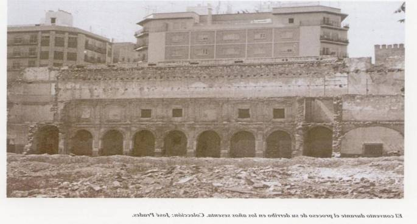

>

1953\. El día 21 de Febrero, el Regimiento de Infantería Tetuán nº 14 abandonó el viejo Cuartel del antiguo Convento de San Francisco y se trasladó a los modernos Cuarteles de la Partida del Bobalar, en donde en un solar (objeto de permuta al Ayuntamiento por el solar del viejo cuartel) la Comandancia de Obras y Fortificaciones de la 3ª Región Militar había construido un nuevo y moderno acuartelamiento cuya fachada principal es debida al Arquitecto D. Francisco Maristany Casajuana.

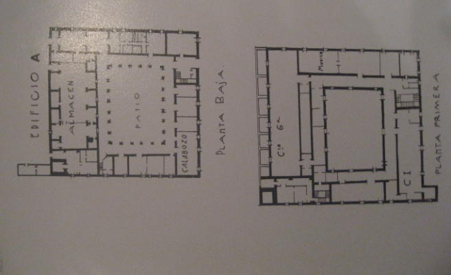

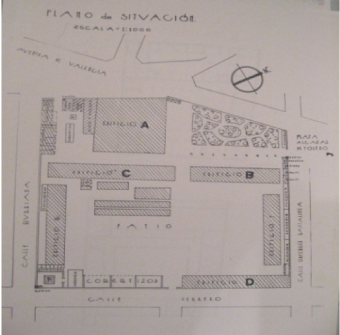

los que figuran en el plano adjunto.

EDIFICIO A - ANTIGUO CONVENTO FRANCISCANO.

EDIFICIO B - OFICINAS Y SERVICIOS.

EDIFICIO C - GARAJE, ARMAMENTO Y ARMAS PESADAS.

EDIFICIO D - ALOJAMIENTO TROPA.

EDIFICIO E - COMEDOR.

EDIFICIO F - PABELLON NUEVO. HOGAR DEL SOLDADO Y BIBLIOTECA.

Maqueta del Cuartel de San Francisco

MUSEO MILITAR DE CASTELLÓN

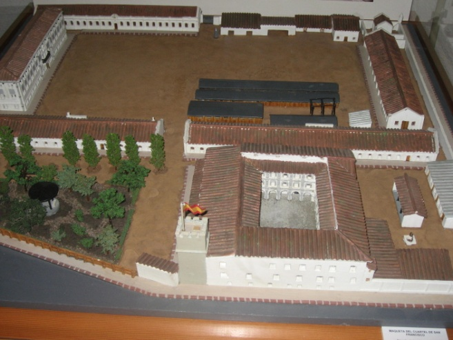

>

El cuartel contaba también con un gran patio de 120 X 70 m, apto para formaciones, actos deportivos e instrucción de pequeñas unidades. La instrucción de las compañías solía llevarse a cabo en el vecino y desaparecido Parque del Oeste, en donde se instaló también con motivos de las fiestas de la Magdalena una pista hípica.

Del cuartel de San Francisco se ha conservado únicamente el pabellón nuevo que se utiliza para otros fines, en la calle Orfebre Santalínea. El resto ha sido completamente derribado. Sobre parte del solar que ocupaba el edificio del convento con su patio claustral e iglesia, se ha levantado la actual y moderna iglesia de San Francisco.

Datos ofrecidos generosamente por: Aula Militar BERMUDEZ DE CASTRO

Coronel Ricardo Pardo Camacho

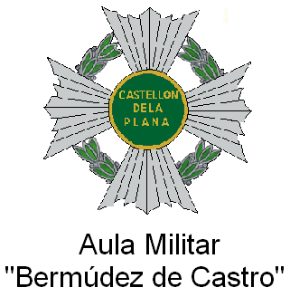

Cuadro sinóptico de la guarnición del Cuartel de San Francisco (1840-1953)

<table>
<colgroup>
<col style="width: 37%" />
<col style="width: 62%" />
</colgroup>
<tbody>
<tr>
<td><blockquote>

VI-1840 a VI-1841

</blockquote></td>
<td><blockquote>

Regimiento de Infantería Reina nº 2

</blockquote></td>
</tr>
<tr>
<td><blockquote>

VI-1841 a I-1842

</blockquote></td>
<td><blockquote>

Regimiento de Infantería Infante nº 5

</blockquote></td>
</tr>
<tr>
<td><blockquote>

I-1842 a IV-1842

</blockquote></td>
<td><blockquote>

Regimiento de Infantería Navarra nº 25

Regimiento de Infantería Valencia nº 23

</blockquote></td>
</tr>
<tr>
<td><blockquote>

IV-1842 a VI-1842

</blockquote></td>
<td><blockquote>

Regimiento de Infantería Valencia nº 23

</blockquote></td>
</tr>
<tr>
<td><blockquote>

VI-1842 a VII-1842

</blockquote></td>
<td><blockquote>

SIN GUARNICIÓN

</blockquote></td>
</tr>
<tr>
<td><blockquote>

VII-1842 a X-1842

</blockquote></td>
<td><blockquote>

Regimiento de Infantería Navarra nº 25

</blockquote></td>
</tr>
<tr>
<td><blockquote>

X-1842 a V-1843

</blockquote></td>
<td><blockquote>

Regimiento de Infantería Navarra nº 25

Regimiento de Infantería Galicia nº 19

</blockquote></td>
</tr>
<tr>
<td><blockquote>

V-1843 a VII-1843

</blockquote></td>
<td><blockquote>

Regimiento de Infantería Galicia nº 19

Regimiento de Infantería Albuera nº 26

</blockquote></td>
</tr>
<tr>
<td><blockquote>

VII-1843 a IX-1843

</blockquote></td>
<td><blockquote>

Regimiento de Infantería Albuera nº 26

Regimiento de Infantería Saboya nº 6

</blockquote></td>
</tr>
<tr>
<td><blockquote>

IX-1843 a I-1844

</blockquote></td>
<td><blockquote>

Regimiento de Infantería Saboya nº 6

</blockquote></td>
</tr>
<tr>
<td><blockquote>

I-1844 a III-1844

</blockquote></td>
<td><blockquote>

Regimiento de Infantería Saboya nº 6

Batallón Provincial Cuenca nº 24

Batallón Provincial Valladolid nº 27

Batallón Provincial Teruel nº 49

</blockquote></td>
</tr>
<tr>
<td><blockquote>

III-1844 a V-1844

</blockquote></td>
<td><blockquote>

Regimiento de Infantería Gerona nº 22

Batallón Provincial Cuenca nº 24

Batallón Provincial Valladolid nº 27

Batallón Provincial Albacete nº 26

Batallón Provincial Teruel nº 49

</blockquote></td>
</tr>
<tr>
<td><blockquote>

V-1844 a XI-1844

</blockquote></td>
<td><blockquote>

Batallón Provincial Cuenca nº 24

Batallón Provincial Valladolid nº 27

Batallón Provincial Lérida nº 42

Batallón Provincial Albacete nº 26

Batallón Provincial Teruel nº 49

</blockquote></td>
</tr>
<tr>
<td><blockquote>

XI-1844 a I-1845

</blockquote></td>
<td><blockquote>

Batallón Provincial Écija nº 13

Batallón Provincial Valladolid nº 27

Batallón Provincial Lérida nº 42

Batallón Provincial Albacete nº 26

Batallón Provincial Teruel nº 49

</blockquote></td>
</tr>
<tr>
<td><blockquote>

I-1845 a III-1845

</blockquote></td>
<td><blockquote>

Batallón Provincial Huesca nº 47

Batallón Provincial Écija nº 13

Batallón Provincial Valladolid nº 27

Batallón Provincial Lérida nº 42

Batallón Provincial Albacete nº 26

Batallón Provincial Teruel nº 49

</blockquote></td>
</tr>
<tr>
<td><blockquote>

III-1845 a VI-1845

</blockquote></td>
<td><blockquote>

Batallón Provincial Teruel nº 49

</blockquote></td>
</tr>
<tr>
<td><blockquote>

VI-1845 a VI-1846

</blockquote></td>
<td><blockquote>

SIN GUARNICIÓN

</blockquote></td>
</tr>
<tr>
<td><blockquote>

VI-1846 a VII-1847

</blockquote></td>
<td><blockquote>

Regimiento de Infantería Extremadura nº 15

</blockquote></td>
</tr>
<tr>
<td><blockquote>

VII-1847 a IX-1847

</blockquote></td>
<td><blockquote>

SIN GUARNICIÓN

</blockquote></td>
</tr>
<tr>
<td><blockquote>

IX-1847 a VIII-1848

</blockquote></td>
<td><blockquote>

Regimiento de Infantería Galicia nº 19

Regimiento de Infantería San Fernando nº 11

</blockquote></td>
</tr>
<tr>
<td><blockquote>

VIII-1848 a IX-1848

</blockquote></td>
<td><blockquote>

Regimiento de Infantería Galicia nº 19

Regimiento de Infantería San Fernando nº 11

Regimiento de Infantería Isabel II nº 32

</blockquote></td>
</tr>
<tr>
<td><blockquote>

IX-1848 a XI-1848

</blockquote></td>
<td><blockquote>

Regimiento de Infantería Galicia nº 19

Regimiento de Infantería San Marcial 45

Batallón de Cazadores Barcelona nº 3

Regimiento de Infantería San Fernando nº 11

Regimiento de Infantería Isabel II nº 32

</blockquote></td>
</tr>
<tr>
<td><blockquote>

XI-1848 a I-1849

</blockquote></td>
<td><blockquote>

Regimiento de Infantería San Marcial nº 45

Batallón de Cazadores Barcelona nº 3

Regimiento de Infantería San Fernando nº 11

Regimiento de Infantería Isabel II nº 32

Regimiento de Infantería Saboya nº 6

</blockquote></td>
</tr>
<tr>
<td><blockquote>

I-1849 a III-1849

</blockquote></td>
<td><blockquote>

Batallón de Cazadores Barcelona nº 3

Regimiento de Infantería San Fernando nº 11

Regimiento de Infantería Isabel II nº 32

Regimiento de Infantería Saboya nº 6

</blockquote></td>
</tr>
<tr>
<td><blockquote>

III-1849 a VII-1849

</blockquote></td>
<td><blockquote>

Regimiento de Infantería San Fernando nº 11

Regimiento de Infantería Isabel II nº 32

Regimiento de Infantería Saboya nº 6

</blockquote></td>
</tr>
<tr>
<td><blockquote>

VII-1849 a VIII-1849

</blockquote></td>
<td><blockquote>

Regimiento de Infantería San Fernando nº 11

Regimiento de Infantería Isabel II nº 32

Regimiento de Infantería Saboya nº 6

Regimiento de Infantería Jaén nº 41

Regimiento de Infantería Infante nº 5

</blockquote></td>
</tr>
<tr>
<td><blockquote>

VIII-1849 a IX-1849

</blockquote></td>
<td><blockquote>

Regimiento de Infantería Isabel II nº 32

Regimiento de Infantería Saboya nº 6

Regimiento de Infantería Jaén nº 41

Regimiento de Infantería Infante nº 5

</blockquote></td>
</tr>
<tr>
<td><blockquote>

IX-1849 a I-1850

</blockquote></td>
<td><blockquote>

Regimiento de Infantería Saboya nº 6

Regimiento de Infantería Jaén nº 41

Regimiento de Infantería Infante nº 5

</blockquote></td>
</tr>
<tr>
<td><blockquote>

I-1850 a III-1850

</blockquote></td>
<td><blockquote>

Regimiento de Infantería Saboya nº 6

Regimiento de Infantería Jaén nº 41

Regimiento de Infantería Infante nº 5

Regimiento de Infantería Asturias nº 31

</blockquote></td>
</tr>
<tr>
<td><blockquote>

III-1850 a X-1850

</blockquote></td>
<td><blockquote>

Regimiento de Infantería Saboya nº 6

Regimiento de Infantería Infante nº 5

Regimiento de Infantería Asturias nº 31

</blockquote></td>
</tr>
<tr>
<td><blockquote>

X-1850 a XII-1850

</blockquote></td>
<td><blockquote>

Regimiento de Infantería Infante nº 5

Regimiento de Infantería Asturias nº 31

Regimiento de Infantería San Fernando nº 11

</blockquote></td>
</tr>
<tr>
<td><blockquote>

XII-1850 a X-1851

</blockquote></td>
<td><blockquote>

Regimiento de Infantería Asturias nº 31

Regimiento de Infantería San Fernando nº 11

</blockquote></td>
</tr>
<tr>
<td><blockquote>

X-1851 a II-1852

</blockquote></td>
<td><blockquote>

Regimiento de Infantería Asturias nº 31

Regimiento de Infantería San Fernando nº 11

Batallón de Cazadores Barcelona nº 3

</blockquote></td>
</tr>
<tr>
<td><blockquote>

II-1852 a IX-1852

</blockquote></td>
<td><blockquote>

Regimiento de Infantería San Fernando nº 11

Batallón de Cazadores Barcelona nº 3

</blockquote></td>
</tr>
<tr>
<td><blockquote>

IX-1852 a XII-1852

</blockquote></td>
<td><blockquote>

Regimiento de Infantería San Fernando nº 11

</blockquote></td>
</tr>
<tr>
<td><blockquote>

XII-1852 a I-1853

</blockquote></td>
<td><blockquote>

Regimiento de Infantería San Fernando nº 11

Regimiento de Infantería África nº 7

</blockquote></td>
</tr>
<tr>
<td><blockquote>

I-1853 a I-1855

</blockquote></td>
<td><blockquote>

Regimiento de Infantería San Fernando nº 11

Regimiento de Infantería Asturias nº 31

</blockquote></td>
</tr>
<tr>
<td><blockquote>

I-1855 a V-1855

</blockquote></td>
<td><blockquote>

Regimiento de Infantería San Fernando nº 11

Regimiento de Infantería Rey nº 1

</blockquote></td>
</tr>
<tr>
<td><blockquote>

V-1855-VI-1855

</blockquote></td>
<td><blockquote>

Regimiento de Infantería San Fernando nº 11

Regimiento de Infantería Córdoba nº 10

Batallón de Cazadores Chiclana nº 7

</blockquote></td>
</tr>
<tr>
<td><blockquote>

VI-1855 a X-1855

</blockquote></td>
<td><blockquote>

Regimiento de Infantería San Fernando nº 11

Regimiento de Infantería Córdoba nº 10

</blockquote></td>
</tr>
<tr>
<td><blockquote>

X-1855 a XII-1855

</blockquote></td>
<td><blockquote>

Regimiento de Infantería San Fernando nº 11

Regimiento de Infantería Constitución nº 29

</blockquote></td>
</tr>
<tr>
<td><blockquote>

XII-1855 a I-1856

</blockquote></td>
<td><blockquote>

Regimiento de Infantería Constitución nº 29

</blockquote></td>
</tr>
<tr>
<td><blockquote>

I-1856 a II-1857

</blockquote></td>
<td><blockquote>

SIN GUARNICIÓN

</blockquote></td>
</tr>
<tr>
<td><blockquote>

II-1857 a VI-1857

</blockquote></td>
<td><blockquote>

Regimiento de Infantería Valencia nº 23

</blockquote></td>
</tr>
<tr>
<td><blockquote>

VI-1857 a XII-1857

</blockquote></td>
<td><blockquote>

Regimiento de Infantería Burgos nº 36

</blockquote></td>
</tr>
<tr>
<td><blockquote>

XII-1857 a V-1858

</blockquote></td>
<td><blockquote>

SIN GUARNICIÓN

</blockquote></td>
</tr>
<tr>
<td><blockquote>

V-1858 a VII-1858

</blockquote></td>
<td><blockquote>

Regimiento de Infantería Granada nº 34

</blockquote></td>
</tr>
<tr>
<td><blockquote>

VII-1858 a IV-1859

</blockquote></td>
<td><blockquote>

Batallón Provincial Alicante nº 50

</blockquote></td>
</tr>
<tr>
<td><blockquote>

IV-1859 a V-1862

</blockquote></td>
<td><blockquote>

SIN GUARNICIÓN

</blockquote></td>
</tr>
<tr>
<td><blockquote>

V-1862 a IV-1863

</blockquote></td>
<td><blockquote>

Regimiento de Infantería Constitución nº 29

</blockquote></td>
</tr>
<tr>
<td><blockquote>

IV-1863 a XII-1864

</blockquote></td>
<td><blockquote>

SIN GUARNICIÓN

</blockquote></td>
</tr>
<tr>
<td><blockquote>

XII-1864 a IV-1865

</blockquote></td>
<td><blockquote>

Regimiento de Infantería Burgos nº 36

</blockquote></td>
</tr>
<tr>
<td><blockquote>

IV-1865 a VIII-1865

</blockquote></td>
<td><blockquote>

Regimiento de Infantería Extremadura nº 15

</blockquote></td>
</tr>
<tr>
<td><blockquote>

VIII-1865 a X-1865

</blockquote></td>
<td><blockquote>

Regimiento de Infantería Mallorca, 13

Regimiento de Infantería Sevilla nº 33

</blockquote></td>
</tr>
<tr>
<td><blockquote>

X-1865 a I-1866

</blockquote></td>
<td><blockquote>

Regimiento de Infantería Sevilla nº 33

</blockquote></td>
</tr>
<tr>
<td><blockquote>

I-1866 a VIII-1867

</blockquote></td>
<td><blockquote>

SIN GUARNICIÓN

</blockquote></td>
</tr>
<tr>
<td><blockquote>

VIII-1867 a XII-1867

</blockquote></td>
<td><blockquote>

Regimiento de Infantería Sevilla nº 33

</blockquote></td>
</tr>
<tr>
<td><blockquote>

XII-1867 a XII-1869

</blockquote></td>
<td><blockquote>

SIN GUARNICIÓN

</blockquote></td>
</tr>
<tr>
<td><blockquote>

XII-1869 a V-1870

</blockquote></td>
<td><blockquote>

Regimiento de Infantería Galicia nº 19

Batallón de Cazadores Talavera nº 5

</blockquote></td>
</tr>
<tr>
<td><blockquote>

V-1870 a VI-1870

</blockquote></td>
<td><blockquote>

Regimiento de Infantería Galicia nº 19

Regimiento de Infantería Asturias nº 31

Batallón de Cazadores Talavera nº 5

</blockquote></td>
</tr>
<tr>
<td><blockquote>

VI-1870 a II-1871

</blockquote></td>
<td><blockquote>

Regimiento de Infantería Aragón nº 21

Batallón de Cazadores Talavera nº 5

</blockquote></td>
</tr>
<tr>
<td><blockquote>

II-1871 a VI-1871

</blockquote></td>
<td><blockquote>

Regimiento de Infantería Aragón nº 21

Batallón de Cazadores Barbastro nº 4

</blockquote></td>
</tr>
<tr>
<td><blockquote>

VI-1871 a II-1872

</blockquote></td>
<td><blockquote>

Regimiento de Infantería León nº 38

Regimiento de Infantería Granada nº 34

</blockquote></td>
</tr>
<tr>
<td><blockquote>

II-1872 a II-1873

</blockquote></td>
<td><blockquote>

Batallón Provincial Castellón nº 52

Batallón Provincial Segorbe nº 73

</blockquote></td>
</tr>
<tr>
<td><blockquote>

II-1873 a IV-1876

</blockquote></td>
<td><blockquote>

TERCERA GUERRA CARLISTA

</blockquote></td>
</tr>
<tr>
<td><blockquote>

21-IV-1876 a 23-X-1876

</blockquote></td>
<td><blockquote>

Regimiento de Infantería Málaga nº 40

Batallón de Cazadores Mérida nº 13

</blockquote></td>
</tr>
<tr>
<td><blockquote>

24-X-1876 a 19-I-1877

</blockquote></td>
<td><blockquote>

Batallón de Cazadores Mérida nº 13

Regimiento de Infantería Córdoba nº 10

</blockquote></td>
</tr>
<tr>
<td><blockquote>

20-I-1877 a 21-IV-1877

</blockquote></td>
<td><blockquote>

Regimiento de Infantería Córdoba nº 10

</blockquote></td>
</tr>
<tr>
<td><blockquote>

22-IV-1877 a 26-VII-1877

</blockquote></td>
<td><blockquote>

Regimiento de Infantería Burgos nº 36

</blockquote></td>
</tr>
<tr>
<td><blockquote>

27-VII-1877 a 12-XI-1878

</blockquote></td>
<td><blockquote>

Regimiento de Infantería Otumba nº 51

Regimiento de Infantería Burgos nº 36

</blockquote></td>
</tr>
<tr>
<td><blockquote>

13-XI-1878 a 12-VII-1879

</blockquote></td>
<td><blockquote>

Regimiento de Infantería Málaga nº 40

Regimiento de Infantería Antillas nº 44

</blockquote></td>
</tr>
<tr>
<td><blockquote>

13-VII-1879 a 26-VI-1880

</blockquote></td>
<td><blockquote>

Regimiento de Infantería Málaga nº 40

Regimiento de Infantería España nº 48

</blockquote></td>
</tr>
<tr>
<td><blockquote>

27-VI-1880 a 8-X-1880

</blockquote></td>
<td><blockquote>

Regimiento de Infantería Málaga nº 40

Regimiento de Infantería Princesa nº 4

</blockquote></td>
</tr>
<tr>
<td><blockquote>

9-X-1880 a 11-X-1882

</blockquote></td>
<td><blockquote>

Regimiento de Infantería Princesa nº 4

Regimiento de Infantería Otumba nº 51

</blockquote></td>
</tr>
<tr>
<td><blockquote>

12-X-1882 a 2-I-1883

</blockquote></td>
<td><blockquote>

Regimiento de Infantería Otumba nº 51

Batallón de Cazadores Alba de Tormes nº 8

Batallón de Cazadores Segorbe nº 12

</blockquote></td>
</tr>
<tr>
<td><blockquote>

3-1-1883 a 8-VIII-1883

</blockquote></td>
<td><blockquote>

Regimiento de Infantería Otumba nº 51

Batallón de Cazadores Alba de Tormes nº 8

</blockquote></td>
</tr>
<tr>
<td><blockquote>

9-VIII-1883 a 14-XI-1883

</blockquote></td>
<td><blockquote>

Regimiento de Infantería Tetuán nº 47

</blockquote></td>
</tr>
<tr>
<td><blockquote>

15-XI-1883 a 14-XII-1883

</blockquote></td>
<td><blockquote>

Regimiento de Infantería Otumba nº 51

Regimiento de Infantería Málaga nº 40

</blockquote></td>
</tr>
<tr>
<td><blockquote>

15-XII-1883 a 11-II-1884

</blockquote></td>
<td><blockquote>

Regimiento de Infantería Vizcaya nº 54

Regimiento de Infantería San Fernando nº 11

</blockquote></td>
</tr>
<tr>
<td><blockquote>

12-II-1884 a 14-V-1886

</blockquote></td>
<td><blockquote>

Regimiento de Infantería España nº 48

</blockquote></td>
</tr>
<tr>
<td><blockquote>

15-V-1886 a 29-X-1888

</blockquote></td>
<td><blockquote>

Regimiento de Infantería Guadalajara nº 20

</blockquote></td>
</tr>
<tr>
<td><blockquote>

30-X-1888 a 28-VIII-1893

</blockquote></td>
<td><blockquote>

Regimiento de Infantería Otumba nº 51

</blockquote></td>
</tr>
<tr>
<td><blockquote>

29-VIII-1893 a 27-XI-1897

</blockquote></td>
<td><blockquote>

Regimiento de Infantería Otumba nº 49

</blockquote></td>
</tr>
<tr>
<td><blockquote>

28-XI-1897 a II-1898

</blockquote></td>
<td><blockquote>

Regimiento de Infantería Otumba nº 49

Regimiento de Infantería Mallorca nº 13

</blockquote></td>
</tr>
<tr>
<td><blockquote>

II-1898 a 6-XII-1904

</blockquote></td>
<td><blockquote>

Regimiento de Infantería Otumba nº 49

</blockquote></td>
</tr>
<tr>
<td><blockquote>

7-XII-1904 a 14-VII-1911

</blockquote></td>
<td><blockquote>

Regimiento de Infantería Otumba nº 49

Regimiento de Infantería Tetuán nº 45

</blockquote></td>
</tr>
<tr>
<td><blockquote>

15-VII-1911 a 25-VII-1921

</blockquote></td>
<td><blockquote>

Regimiento de Infantería Tetuán nº 45

</blockquote></td>
</tr>
<tr>
<td><blockquote>

26-VII-1921 a 8-VIII-1921

</blockquote></td>
<td><blockquote>

Regimiento de Infantería Tetuán nº 45

Regimiento de Infantería Gerona nº 22

</blockquote></td>
</tr>
<tr>
<td><blockquote>

9-VIII-1921 a 8-VI-1931

</blockquote></td>
<td><blockquote>

Regimiento de Infantería Tetuán nº 45

</blockquote></td>
</tr>
<tr>
<td><blockquote>

9-VI-1931 a 18-VI-1931

</blockquote></td>
<td><blockquote>

SIN GUARNICIÓN

</blockquote></td>
</tr>
<tr>
<td><blockquote>

19-VI-1931 a 17-IX-1931

</blockquote></td>
<td><blockquote>

Batallón de Ametralladoras

</blockquote></td>
</tr>
<tr>
<td><blockquote>

18-IX-1931 a 22-IV-1936

</blockquote></td>
<td><blockquote>

Batallón de Ametralladoras nº 1

</blockquote></td>
</tr>
<tr>
<td><blockquote>

23-IV-1936 a 17-VII-1936

</blockquote></td>
<td><blockquote>

Batallón de Ametralladoras nº 3

</blockquote></td>
</tr>
<tr>
<td><blockquote>

18-VII-1936 a 31-III-1939

</blockquote></td>
<td><blockquote>

GUERRA CIVIL

</blockquote></td>
</tr>
<tr>
<td><blockquote>

1-IV-1939 a 30-IX-1939

</blockquote></td>
<td><blockquote>

Regimiento de Infantería América nº 23

</blockquote></td>
</tr>
<tr>
<td><blockquote>

1-X-1939 a 20-XII-1943

</blockquote></td>
<td><blockquote>

Regimiento de Infantería nº 10

</blockquote></td>
</tr>
<tr>
<td><blockquote>

21-XII-1943 a 21-II-1953

</blockquote></td>
<td><blockquote>

Regimiento de Infantería Tetuán nº 14

</blockquote></td>
</tr>
</tbody>
</table>

El 1 de octubre de 1939, se constituyó el Regimiento de Infantería nº 10, sirviendo para ello de base las unidades que se hallaban en Castellón:

> 9º Batallón del Regimiento de Infantería Bailén nº 24
>
> 116º Batallón del Regimiento de Infantería Toledo nº 26
>
> 120º Batallón del Regimiento de Infantería La Victoria nº 28
>
> 121º Batallón del Regimiento de Infantería La Victoria nº 28
>
> 193º Batallón del Regimiento de Infantería Mérida nº 35
>
> 196º Batallón del Regimiento de Infantería Mérida nº 35
>
> Tercio de Requetés Ntra. Sra. del Camino
>
> 4ª Bandera de F.E.T. y de las J.O.N.S. de Navarra

Se encontraban distribuidos entre el Cuartel de San Francisco en Castellón, el Grao, Burriana y Benicasim, aunque también cubrían destacamentos en Benicarló y Villarreal, dedicándose a servicios de vigilancia de costas y a la custodia de cárceles.

Por Decreto de 21 de diciembre de 1943 el Regimiento de Infantería nº 10 recibió la denominación de Regimiento de Infantería Tetuán nº 14 (De Línea).

El 1 de febrero de 1956 fue donado por el Ejército al Ayuntamiento de Castellón el Cuartel de San Francisco, cuya superficie era de 25.941 m2

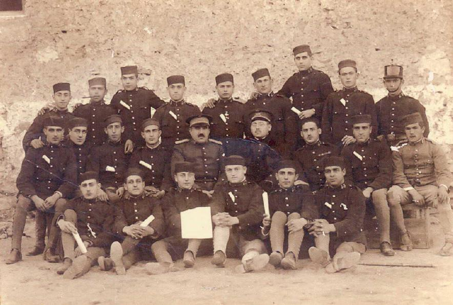

>
>
> Postal fecha 1913 Nuevos reclutas Cuartel de Francisco 1923
>
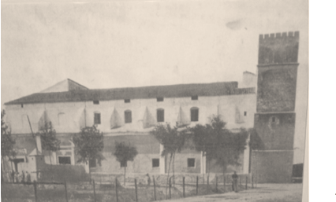

>

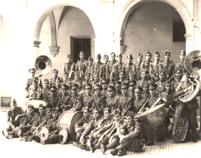

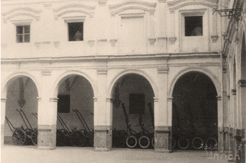

>
>
> Cuartel de San Francisco, en Castellón, hacia 1945 La Música del Cuartel de san Francisco 1945.

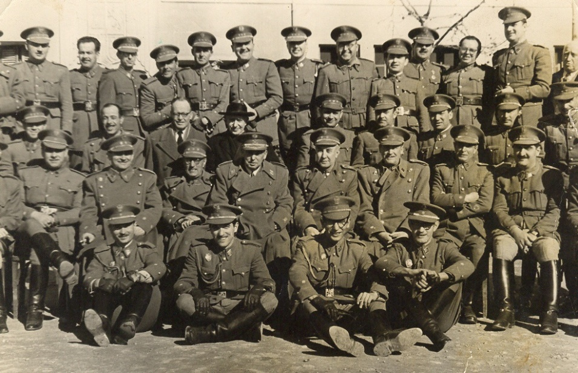

> Jefes y Oficiales en el Cuartel de San Francisco en 1949

Después de 800 años de servir como ermita, convento, hospital, y Cuartel de Infantería, vuelve a ser lugar de culto, conservando su toponimia, San Francisco.

> Francisca Julián Querol Febrero 2012
