## Vista por un corneta. Julio 1921- mayo 1922.

Entre los objetos personales de Nieves la hermana del soldado (corneta) Joaquín Fortea, su hija encontró un paquete envuelto cuidadosamente con una cinta, en el que se podía leer con dificultad (no tirar son cartas de mi hijo), escritas entre 1921-1922 en la guerra de África y que Joaquín mando a sus padres. Su hermana Nieves, lo guardó hasta su muerte, cuando lo encontraron sus hijos. Así es, como han llegado a mi poder las cartas escritas por mi padre en su juventud, en la guerra del Rif, y que nunca supe que su madre, mi abuela, había guardado.

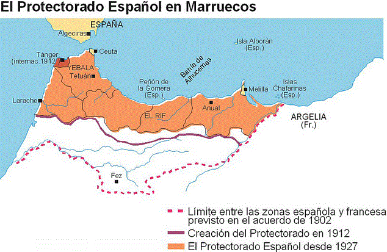

Están fechadas en Melilla y en otros lugares donde estuvo, leerlas después de 90 años es como revivir aquellos momentos vistos desde otra perspectiva que la oficial. Pretendemos narrar la historia, desde los recuerdos contados y oídos, las cartas y las noticias de prensa, que hemos podido rescatar de las hemerotecas. Por eso hemos titulado este trabajo “La guerra del Rif vista por un corneta, julio 1921-mayo 1922.”

Perdidas las últimas colonias, Cuba, Puerto Rico y Filipinas, a España que no tomó parte en la Primera Guerra Mundial, pero mantenía conflicto militar con Marruecos, sólo le quedaba la zona que le había correspondido según el Tratado de Madrid de 1912 donde se repartía la protección de sultanato de Marruecos en dos zonas: La sur, la zona rica, la de las ciudades notables como Casablanca, Rabat y Fez, se adjudicó a Francia, la zona norte, El Rif, el erial pedregoso, se adjudicó a España.

Todo empieza cuando los españoles se adentraron en el Rif estableciendo pactos con los jefes locales y asentándose en pequeñas posiciones que generalmente tenían la forma de* **blocaos***. Su retaguardia era Melilla. Las tropas españolas dirigidas por el general Silvestre se aventuraron a establecer posiciones más arriesgadas y desprotegidas. Este fue el momento elegido en 1921 por las tribus del Rif central para sublevarse bajo el mando de Abd el-Krim, notable de la belicosa tribu de los Ait Waryagar. En julio de 1921 las tropas españolas fueron ferozmente atacadas y sufrieron una grave derrota en Annual el día 22 de este mismo mes. Con esta victoria rifeña se inició una guerra que se prolongaría hasta 1926 cuando el 8 de septiembre el desembarco de Alhucemas por del ejercito y la armada española puso fin a la rebelión.

La sociedad española del momento, no entendía la guerra de Marruecos, sangrienta y sin ningún beneficio como no fuera cuestión de principios. Las tropas mandadas deprisa y corriendo, eran la mayoría de reemplazo, reclutadas obligatoriamente, sin ninguna preparación, sin apenas armas y sin equipo de ninguna clase**,** como lo demuestran las fotografías de prensa donde se ve a los soldados calzados con simples alpargatas, la mayoría eran jóvenes que no sabían a donde se dirigían. En 1921 uno de cada tres soldados de reemplazo se encontraba en la zona de guerra.

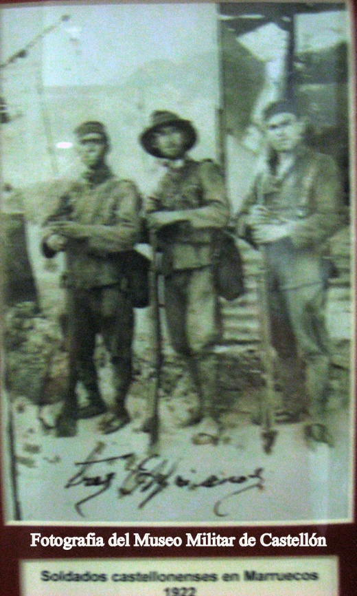

***Los sucesos de Melilla en Castellón*.** Desde primeras horas de la tarde del sábado día 23 de julio de 1921, comenzaron a circular por la capital rumores de que en Marruecos se habían registrado gravísimos sucesos. Poco después la prensa recibía una nota oficial que confirmaba la noticia; el gobierno había dispuesto el envío a Melilla de fuerzas de las guarniciones del litoral. Esto llevó el desasosiego a muchos hogares donde se temió que el Regimiento Tetuán 45 fuera uno de los designados.

Muchas familias se preparaban para celebrar la fiesta de Sant Jaume, que coincidía con el fin de semana, en las alquerías, masets y casas de campo, donde solían disfrutar los días de descanso. Pronto cundió la alarma, pues en casi todas las casas había algún soldado o amigo de la quinta de reemplazo. Todo Castellón estaba pendiente de la posible movilización del Regimiento y la gente acudía al Cuartel de San Francisco en busca de noticias.

La madrugada del domingo día 24, se recibió en Castellón la orden de que estuviera preparado el primer batallón del Regimiento Tetuán. Inmediatamente se conminó a incorporarse a sus respectivas compañías a los soldados de cuota que dormían fuera del cuartel.

La noticia se propagó con rapidez por la capital y también por los pueblos donde residían bastantes soldados de cuota pertenecientes al regimiento Tetuán y ese mismo domingo los alrededores del cuartel de San Francisco se llenaron de toda clase de vehículos atestados de familiares de los expedicionarios, ávidos de tener noticias de los suyos.

Inmediatamente el comandante de Intendencia señor Gilabert preparó el tren militar que quedó colocado en la tercera vía de la estación del Norte, dispuesto a marchar al primer aviso.

A mediodía se toco ***Fajina*,** dando permiso a los de cuota para ir a comer a sus casas. Iguales ordenes se les dió para la cena y a partir de este momento en los alrededores del cuartel se apiñaba la gente cada vez mas ansiosa.

A las doce y media de la noche se recibió en el cuartel de San Francisco la orden de marcha, momentos después se formaban las fuerzas expedicionarias que aguardaban el momento de la salida para embarcar en el tren, que esperaba en la estación del Norte.

A las doce y diez minutos se dió la orden de marcha, y el batallón abandonó el cuartel de San Francisco para dirigirse a la estación del Norte por la Ronda de la Magdalena, carretera Alcora y calle Lucena.

Un inmenso gentío se congregó en los andenes de la estación, a la que también acudieron las autoridades, los jefes y oficiales de la guarnición fuera de servicio.

Las tropas embarcaron con rapidez mientras los familiares de los soldados se acercaban a los distintos departamentos a despedirse, fueron momentos de mucha emoción. Por el testimonio del propio Joaquín sabemos que pese a la gravedad de la misión los soldados estaban animados después de haber recibido la arenga de los oficiales, muchos incluso iban cantando.

A las tres y veinte la campana de la estación dió la señal de partida y momentos después se ponía en marcha el tren.

***Los jefes y oficiales expedicionarios eran:***

Teniente Coronel, don Félix Molina.

Comandante, don Fernando Sicluna.

Capitán medico, don Benjamín Bonet.

Teniente ayudante, don Gabriel Toro.

Teniente del tren regimental, don Miguel González.

***Primera Compañía.***

Capitán, don Manuel Rodríguez.

Teniente, don Modesto Juan y don Ramón Ramos.

Alférez, don Alfonso Sastre.

**Segunda Compañía**.

Capitán, don Antonio López.

Teniente, don Anselmo Ribes.

Alféreces, don Luis Vives, don Luis González y don José Marco.

***Tercera Compañía (la del corneta Joaquín)***

Capitán, don Alfonso Cachavera.

Tenientes, don José Pastor y don Cándido Gimeno.

Alférez, don Enrique Simón.

***Ametralladoras***

Capitán, don Luis Rodríguez Palomo.

Tenientes don José Condensillo y don Luis Santacruz.

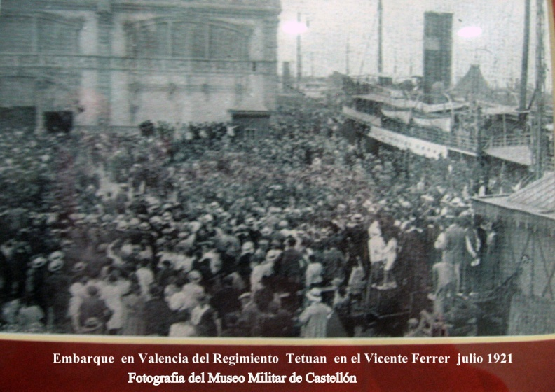

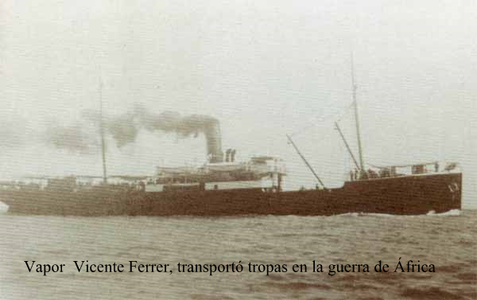

A las siete de la mañana llegó a Valencia el tren especial del Regimiento Tetuán. En la misma estación se les sirvió un almuerzo, y después se dirigieron al puerto, para embarcar a las dos de la tarde en el Vicente Ferrer.

A las siete de la tarde embarcaron en los vapores J.Sinter y Cullera los regimientos de Otumba y mixto de Ingenieros.

A la mañana siguiente lo hizo el sexto ligero de artillería.

> *Uno de los acuerdos adoptados por la Asamblea e secretarios del Ayuntamiento, que actualmente se celebra en esta capital Castellón, es la de contribuir con un día de haber a la suscripción en favor de los soldados de África. Igual ofrecimiento han hecho los guardas de Seguridad. En el hospital hay preparadas varias camas para los heridos y enfermos procedentes de Marruecos y muchos médicos han ofrecido su concurso gratuitamente. (Periódico ABC, 15 agosto 1921 Pág. 12).*

A continuación transcribimos intercaladas con el desarrollo de la contienda las cartas del propio corneta Joaquin. Todas las misivas empiezan de la misma manera, como era la costumbre. La primera, está escrita desde el Cuartel de San Francisco en Castellón, cuando esperaban noticias de la marcha, pues todo eran rumores.

Castellón julio 1921

Queridos padres. Les deseo que a la llegada de esta se encuentren bien de salud, como yo.

Cuando reciban esta carta ya estarán enterados de lo que pasa pues no tengan pesar por mí ,no va a ocurrirme nada, todavía no se sabe nada ,esta mañana ya nos marchábamos y se han vuelto atrás ,no sabemos si nos quedaremos en Valencia o en Málaga, tan pronto llegue a mi destino les escribiré ,vamos 4 Regimientos dicen que iremos enseguida a la línea de fuego yo estoy tranquilo y si Dios quiere pronto volveremos a Castellón pues será cosa de poco tiempo vamos todos hasta los de cuota ……………………………..etc Joaquín**.**

Melilla 29 Julio 1921.

Queridos padres. Les……………………………………………………….

Padres he llegado a esta sin ninguna novedad, la capital es muy bonita, no les he escrito antes pues llegamos ayer, pues estuvimos en el viaje 3 días y 3 noches con barco…………………………….etc. Joaquín

El tio Sentet de Castellón me dio 20 pts. y cuatro pares de calcetines no padezcan.

Mi dirección. Batallón expedicionario. Tetuán 45. 1º Bon. 3ª Compañía.

(Corneta ) Melilla.

Melilla 7 Agosto 1921.

Queridos padres. Les……………………………………

Me dicen en su carta que fueron a Castellón a despedirme, ya pensé que bajarían del pueblo como fue tan rápido no hubo tiempo de nada pues más vale así, pues me daba mucha pena despedirme y así me fui más tranquilo

Este terreno es muy caluroso y las aguas son muy flojas y mucha……por lo demás estoy bien………etc. Joaquín

A primeros de agosto el regimiento Tetuán dirigido por el Comandante Sicluna fue destinado a la posición de Tizza, después de que fuera reconquistada el 25 de julio por parte de la columna del General Sanjurjo. La posición fue fortificada y reparada la alambrada el día 1 de agosto por el 5º Regimiento de zapadores y minadores.

El corneta Joaquín y sus compañeros permanecieron allí 51 días hasta que fueron relevados.

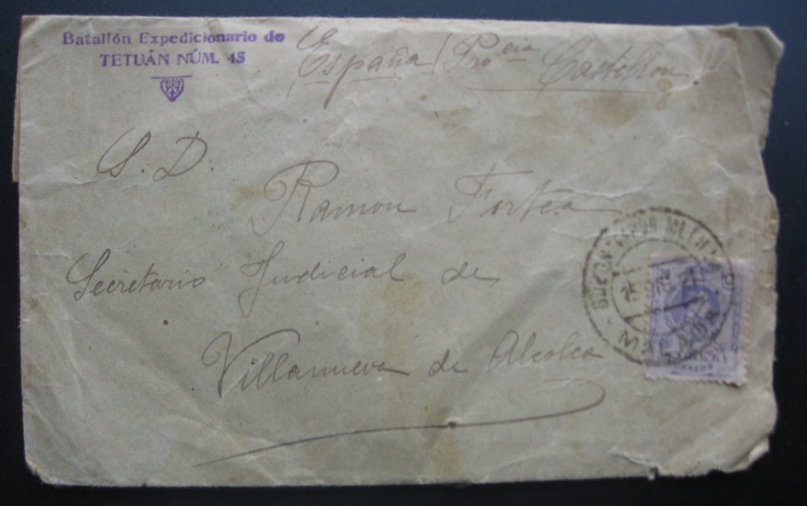

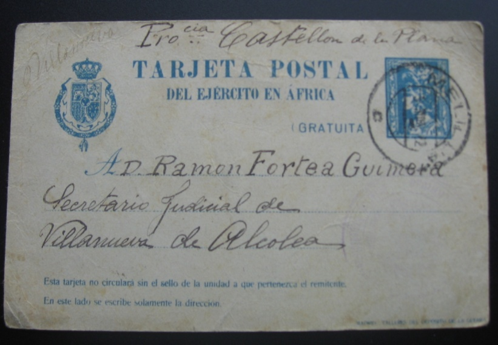

Tizza 15 agosto de 1921

Queridos padres…espero……

Padres Donde estamos no hay nada, solo higos chumbos (figues paleres) ) no salimos de dentro de la alambrada para nada, estamos bien, pues de 1000 hombres que somos de nuestro batallón ,no hemos sufrido ninguna baja, pues somos siempre muy prevenidos y bien armados, y sobre todo llevamos mucho coraje, pues nos hacemos una reflexión, que si no tenemos que morir de las balas por más que nos tiren no moriremos.

Sin mas que decirles……….Joaquín.

Melilla 29 de Agosto 1921. Tizza.

Queridos padres. La….,,…..

Padres hasta hoy nos encontramos todavía en la posición de Tizza que está protegida por el Zoco y el Haoch de Benisicaz y creo que no tardaran en relevarnos pues ya se nos crían unos bichos como granos de arroz y es imposible resistirlo mucho tiempo porque la miseria nos arrastraría hasta el rio, la otra carta creo que ya la escribiré desde el cuartel de Ceriñola……………Joaquín.

Tizza 9 septiembre 1921.

Queridos padre. Les deseo…………………

Por aquí todo sigue igual, creo que no tardaran en relevarnos, pues ya tengo ganas para poder beber agua suficiente y poder comprarme lo necesario, comida no nos falta, pero si cambiarnos la ropa y poder lavarnos la cara y manos pues hace un mes que no nos hemos lavado, estamos todos llenos de miseria hasta el comandante.

Espero que estén bien…………………….Joaquín.

Melilla Tizza 19 d septiembre 1921.

Queridos padres.Me……

Padres, esta mañana nos han dicho que ayer nuestras fuerzas tomaron la población de Nador y cuatro cañones que el enemigo nos quitó los días que se sublevaron.

Padres cuando llegue esta carta a sus manos hará dos mese que salimos de Castellón pues poco a poco irán pasando, los 21 mese que me faltan para cumplir.

Cuando me contesten ya me dirán como ha ido la cosecha de patatas si ha sido buena y si hay muchas almendras, aquí yo todos los días me como dos o tres docenas de higos chumbos ( figues paleres). Sin mas……………………..etc. Joaquín.

Melilla 23 de Septiembre 1921.

Queridos padres. La………………..Tizza,

Padres todavía nos encontramos en la posición, pues ya tanto me da estar aquí como en otro sitio, ojala no nos releven hasta que tengamos que embarcar para España, creo que no tardaremos mucho tiempo pues por aquí corren rumores de que esto no durara porque estamos de cara al invierno y aquí cuando empieza a llover no se termina, dicen los soldados que ya llevan 30 meses en esta, aquí hay muchísimos hombres y cuando empiezan las lluvias si no hay retiro para refugiarse caerán muchos enfermos así que el gobierno pensara terminarlo enseguida . Hace unos días que por la parte de Nador se avanza mucho pues hace unos días que tomaron dicha población y también dicen si habrán tomado Tetuán y y Monte –Arnit pues ahora les dan unas palizas a estos salvajes. Hoy volaron por los alrededores de nuestra posición una cuadrilla de 6 aeroplanos y arrojaron varias granadas en las posiciones enemigas, se dice que han traído un aparato que es un refectorio y lo enfocan a una persona y lo quema y a todas las munición es que lleva encimase las hace explotar, también dicen que han llegado tanques yo no lo sé cierto por qué no lo he visto, pero si fuera cierto esto no duraría mucho tiempo……………….Joaquín

Después de 10 días sin poder llegar a Tizza por estar sitiada la posición, era preciso abastecer la guarnición y castigar al enemigo antes de que se convirtiera en otro Iguriben.

Se constituyeron dos columnas comandadas por el general Tuero y el coronel Silven. El mando del conjunto lo llevaba el Comandante General de Melilla Cavalganti. El general Tuero establece baterías para proteger el avance de las fuerzas, mientras la columna de Silven va avanzando por las lomas. El fuego de los rifeños parapetados en el poblado que rodea la posición y detrás de las chumberas, es tan fuerte y certero, que parte de la columna busca la protección del terreno.

Entonces el convoy se decide a salir al amparo de una cortina de fuego.

El general Cabalganti sigue con inquietud la marcha del convoy, y al notar que los soldados empiezan a retroceder, se pone a la cabeza de las fuerzas de su cuartel general diciendo: “Yo marcho inmediatamente a Tizza, el que sea valiente que me siga, no obligo a nadie”. Y dirigiéndose al jefe del convoy señor Aranguren, le ordena: “Usted se encarga de entrar en la plaza con el convoy; yo sin aguardar más, entraré en la posición”. Espolea el caballo, se lanza a galope y tras él, todo su estado mayor y 25 soldados de la segunda compañía del quinto regimiento de Zapadores. El general cruza a caballo por el poblado rifeño seguido de su cuartel y de los ingenieros bajo una lluvia de balas . El acto heroico anima a las tropas y al poco rato entra el convoy de aprovisionamiento.

De la intensidad del tiroteo da fé, el hecho de que todos los ayudantes del general fueron heridos, murió el sargento de su escolta y el propio caballo del general recibió tres tiros.

Melilla 4 Octubre 1921

Queridos padres. Después de pasar 51 días en la posición de Tizza donde el enemigo nos atizaba todas las noches, vino el deseado relevo y descanso, que bien merecido lo tenemos, ahora G.A.D. estamos en El barranco del Lobo cerca de Melilla, descansamos y nos divertimos pues vamos a Melilla todos los días. Así que llegamos a esta, nos dieron camisa y calzoncillos nuevos y nos pusimos el traje nuevo y un sombrero reglamentario que me compre voy más chulo que el Gallito, pues hoy ya no me acuerdo de las penas pasadas, vamos de paseo y a beber alguna cerveza pues eso por la sed que he pasado pues no teníamos ni agua, de bote de leche condensada me tomo cada dos días uno Como he recibido 5 duros de la tía Carmen y 8 pesetas no sé quien, más los 50 de sobras, y como en la posición no las podíamos gastar ahora me vienen muy bien.

Espero que estén………………Joaquín

Melilla 20 Octubre de1921.

Queridos padres…………………. Hoy hace 20 días que estamos descansando en un cuartel al lado de Melilla, yo no hago guardias ni ningún servicio pues de algo me vale ser corneta.

Padre ayer recibí la de ustedes………………..

Padres de lo que me preguntan sobre Pepito mi primo solo se que hoy o mañana saldrá del hospital y del suboficial que iba con el que también hirieron junto hace unos días fuimos muchos de la Compañía al cementerio pues murió a los pocos días de caer herido, y del convoy que iba con ellos, tuvo que volverse, y de los 80 mulos de carga se apoderaron los moros mi primo Pepico y el suboficial fueron los únicos que se atrevieron a entrar los hirieron a los dos y si mas soldados hubieran ido todos estarían heridos pues aquello era una lluvia de balas. A los cuatro días de haber pasado todo, vino otro convoy y nuestro relevo que fue el día que el General Cavalganti entro el primero y le dieron tres balas al caballo y un Comandante herido y de la escolta también muchos heridos. De la columna aquel día hubo más de 700 bajas. Yo uno de estos días estuve tirando toda la mañana en total siete paquetes o sea 350 cartuchos y estaba completamente sordo, para llevar el convoy vinieron 2 columna con 20 baterías que disparaban todos sin parar ni un instante. Aquel día los moros tuvieron la gran derrota pues tuvieron más de 2000 bajas y el Abd. Del Crim les dice a los moros que nosotros somos las fuerzas que hemos venido de España, les dice que somos extranjeros y que los aeroplanos y barcos y todo de la guerra ha venido del extranjero y que cuando nos volvamos y solo queden las españoles, les dice que se apoderaran hasta de Melilla, y como ahora nos han dado sombrero ellos aun no se creen más que somos extranjeros, pues antes llevaban gorro como los que llevamos en Castellón

Sin nada mas que decirles…….etc.. Joaquín.

Melilla 1 de noviembre de 1921

Queridos padres, mi salud es buena…………………….

Padres hace unos días recibí su carta en la que me mandaban dos sellos para contestarles, de la función que han hecho en esa del cabo Noval les digo que hace unos días estuve donde mataron a dicho cabo que fue en el Zoco de Benisicar, Pues han hecho muy bien de mandarme directamente lo que recaudaron de la función en Villanueva pues de los donativos del Batallón solo nos han dado un paquete de tabaco y un cuarto de vino para cinco hombres, asi que antes de llegar a las manos del soldado tropiezan con muchos ganchos y el soldado percibe una miseria.

Mañana es fácil que nos reunamos todos los del pueblo, pues me han dicho que llegan todas las fuerzas del Batallón y que estaremos unos días todos por aquí, El día 28 del mes pasado nos pusieron una inyección en la espalda que nos ha hecho estar acostados tres días, creo que era para que no cojamos el tifus, es una especie de vacuna que nos han dado a todos.

En cuando lleguemos a donde nos manden ya les escribiré, contándoles donde estamos..

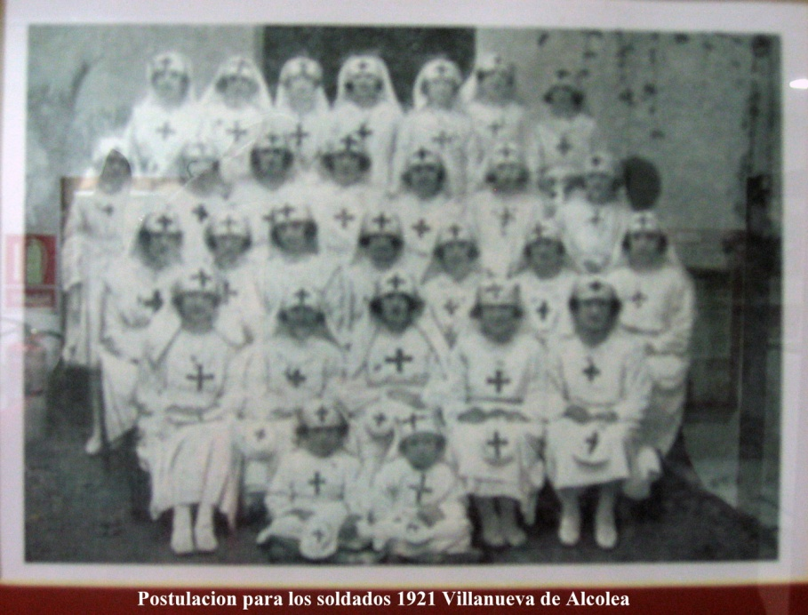

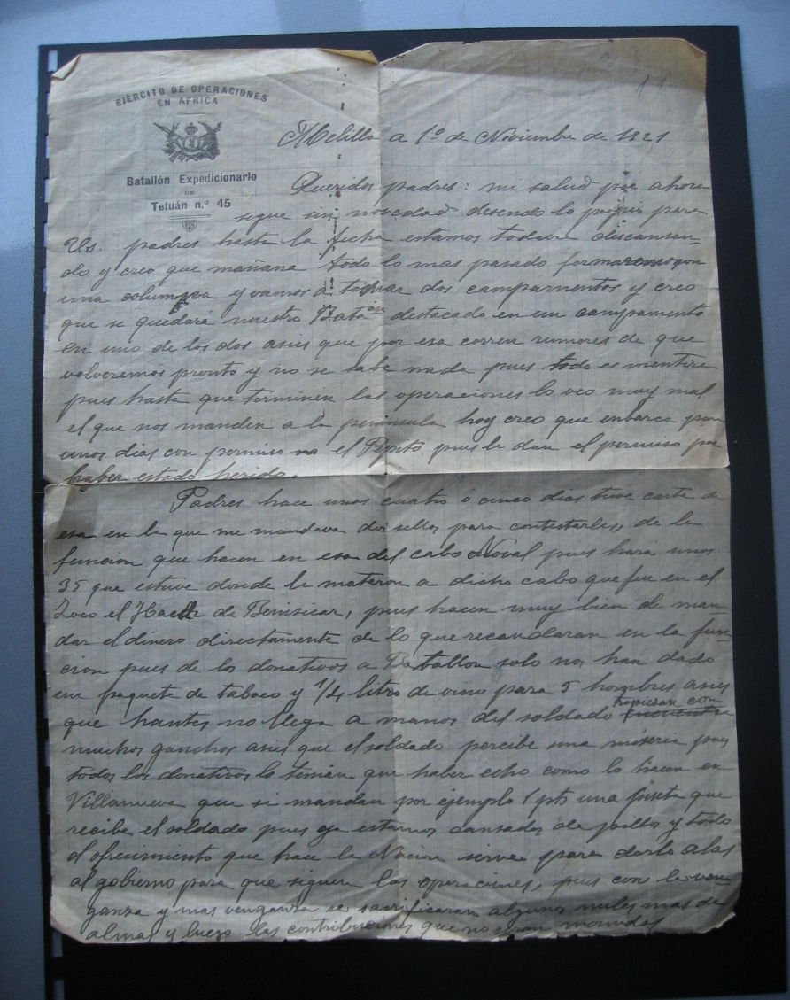

Sin nada mas que contarles, reciban un abrazo…..Joaquín.

***Fotografía del Museo Militar de Castellón***

Durante el mes de octubre, descansaron varios días en El Barranco del Lobo, a tres kilómetros de Melilla. Después del merecido descanso, el batallón fue destinado a Tauima.

Tahumina 21 de Diciembre 1921.

Queridísimos padres: he recibido la de ustedes……….etc.

Padres el motivo de esta es para darles la noticia de que estamos destacados en una posición llamada Tahumina pues está situada entre Nador y Tetuán, aquí estamos bien, pues no se hace ni un solo tiro, tenemos agua y comida en abundancia, esta posición esta en medio de un llano que habrá a unas 4 horas en cuadro, en medio hay un monte y nosotros estamos encima ,tiene una vista muy bonita, a unos 1500 m. está el campo de aviación y todo el día vemos aterrizar los aviones que hoy han hecho operaciones ,cada 5 minutos pasan los aeroplanos que venían del fuego, cargaban las bombas y se volvían otra vez, así que estamos muy distraídos. Hoy al atardecer han pasado por la carretera que está a 80 metros de la posición más de 50 camiones de regulares que salían de las operaciones y venían cantando después de luchar todo el dia.

Ayer cuando venimos unos cuantos en el tren ,en Nador, tuvimos que esperar más de dos horas y vimos todas las malezas ocasionados por los barbaros moros, vimos la fabrica toda quemada y las paredes acribilladas a balazos, ,en la iglesia de Nador tenían nuestros prisioneros y la estación toda quemada ,quitaron el reloj y la campanita, el techo derrumbado y 5 máquinas completamente destruidas unos 20 vagones quemados, un taller de construcción todo deshecho y cinco camiones con el motor aplastado es decir mil atrocidades y de Nador hasta la posición muchas cruces pues por estos alrededores murieron centenares de soldados .

Padres de lo que me decían……..etc. Joaquín.

El 23 de septiembre de 1921, llega la Legión a Tauima y recupera su aeródromo y su aguada, con escasas bajas frente al gran numero del enemigo. En octubre, se empieza a utilizar su aeródromo construido en un llano de ocho kilómetros cuadrados. Las instalaciones se limitan a pocos hangares y talleres de campaña desmontables rodeados de un muro de protección, después de la destrucción del aeródromo de Zeluan en los últimos días de Julio.

Taumina 5 enero 1922

Queridos padres…………………….

Me preguntan donde habito, pues hasta la fecha en una tienda de campaña, estábamos en una tienda de campaña, como las sardinas de bota, y las pulgas nos comían, entre un chico de Albocacer, y yo hemos hecho una casita y dormimos en ella, todas las mañanas sacudimos las mantas y los sacos de paja todo barrido y llevo un desinfectante del botiquín lo rociamos todo y así dormimos bien.

Les mando el mapa en que se ve las posiciones que he estado nº 1 esl a posición de Tiza , el nº 2 Cabrerizas a Altas que es el Cuartel de Ceriñola nº 42, nº 3 la posición de Taumina.

Desde donde estamos nosotros se ve Zeluan y otros puntos importantes tenemos una vistas magnificas.

Cuando tenga ocasión me hare una foto para que me vean con el capote manta de campaña, parecemos moros porque es igual que una chilaba, pues lleva una capucha.

Por aquí corren rumores que si hubiese cambio de gobierno volveríamos pronto a la península y de lo contrario aun tardaremos.

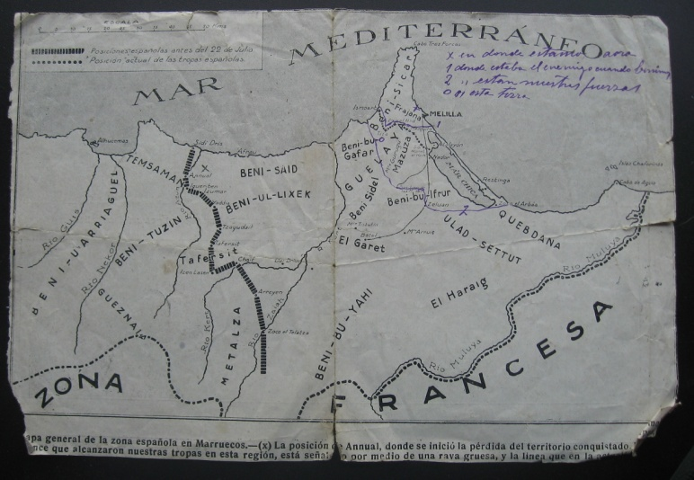

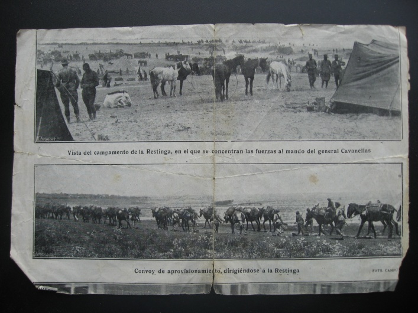

Taumina 25 enero 1922.

Queridos padres…………………………………………

Madre, me pregunta si hago muchas guardias pues cada dos días, no son guardias ni nada pues voy sin correaje y sin armamento, solo la corneta colgada. Desde que salimos de Tiza no hemos tenido ocasión de disparar ningún tiro.

Ayer vinieron unos moros a vendernos dos toros ,ellos mismos los mataron y los arreglaron , pues no son tan tontos como parecen ,tienen costumbres diferentes a las nuestras siempre vemos al moro a caballo ,la mora va detrás cargada lo misma que acémila y descalzas y algunas con media cara tapada , las tierras las cultivan las moras ,hay moro que tiene 4 o 5 mujeres pues las compran como los animales ,en una familia los chicos son hermanos y las chicas no son nada pues no les tienen cariño, cuando vuelva a casa ya les contare muchas cosas.

Ya han licenciado a los del 18 yo creo que pronto repatriaran las fuerzas pues hoy hace medio año que salimos de Castellón, la salida fue muy rápida pero la vuelta es muy costosa. Les mando la canción que cantamos a quien esta canción van nombradas algunas posiciones reconquistadas al enemigo.

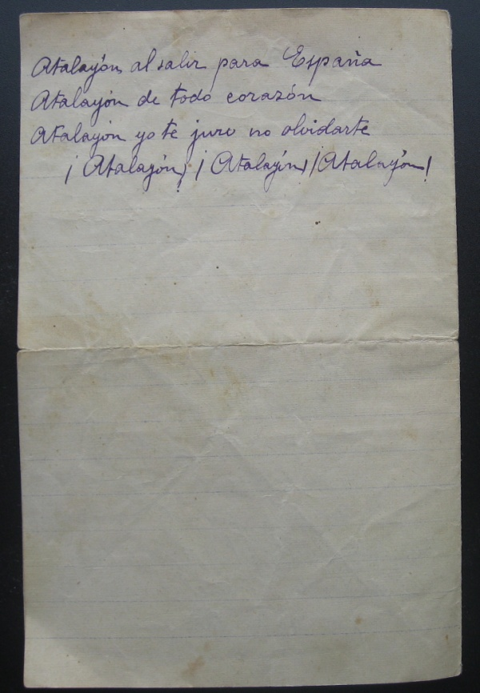

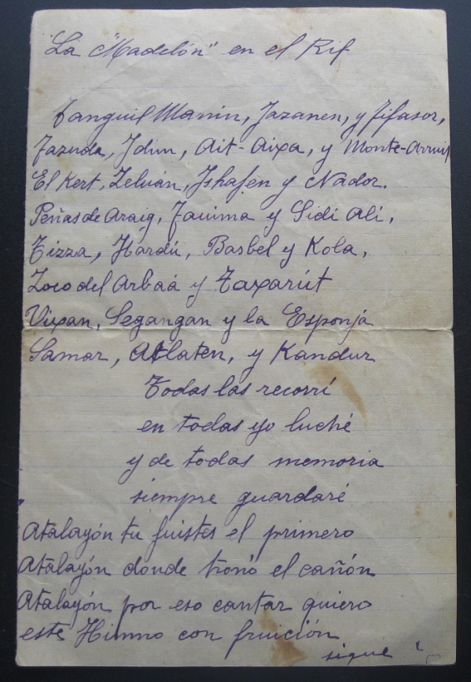

El dia 1 de marzo de 1922, el batallón de Joaquín fue destinado a La Alcazaba de Zeluan.

Los rifeños pusieron asedio a Zeluan y a su aeródromo, el 24 de julio de 1921. Después de días de resistencia y sufrimiento el 2 de Agosto de 1921 se pactó la rendición de los pocos combatientes que quedaban, los rifeños no respetaron el acuerdo y masacraron a todos los habitantes y soldados dejando más de 500 víctimas. La fecha de su reconquista es el 14 de octubre de 1921. Actualmente es un pueblo de la provincia de Nador, situado a 344 metros sobre el nivel del mar. El primer aeródromo de Zeluan fué construido en 1914 por las fuerzas españolas.

Zeluan 2 de Marzo 1922

Queridos padres ………………..

Padres les notifico que nos hallamos en la Alcazaba de Zeluan, ayer nos relevaron de Taumina y por la tarde nos fuimos a Zeluan llegamos a las tres de la tarde, todavía no puedo explicarles nada, pues esta mañana he entrado de guardia, este local está situado en el mismo Zeluan, el pueblo tiene unas 40 casa y todas quemadas. Antes del suceso de Julio del año pasado este edificio fue una obra bastante bonita, pero hoy no se puede apreciar, todo está quemado. En este mismo edificio cuando lo recuperaron nuestras fuerzas encontraron dentro más de 300 cadáveres y en una casa que está al lado pasaban de 400, pues era el depósito donde los amontonaban

Desde arriba de la Alcazaba se divisa Monte Arrinit, estará a unas dos horas de lejos. Aquí ahora no hay ningún peligro, ya les iré contando , cuando no tenga guardia pienso ver toda Zeluan , e ir al cementerio que está a unos 200 metros..

Madre, de lo que………………….Joaquín

Zeluan 10 marzo 1922.

Queridos padres………………………………..

Padres, aquí estamos bien distraídos, ésta mañana han pasado 6 tanques de artillería que se dirigían al frente, ya veremos el resultado que darán ,los que los conducían han comido con nosotros y luego los han bajado de la plataforma en que iban montados por que era demasiado peso para pasar por el puente del río Zeluan y los tanques han tenido que pasar por debajo, como yo estaba libre de servicio he ido a ver como bajaban y subían , por lo que he visto creo que darán buen resultado, según dicen tienen que tomar parte mañana en unas operaciones. El armamento que yo he visto es un cañón y 2 ametralladoras, creo que es imposible atentar a los que van dentro, ahora se esperan otros tanques de infantería; esta mañana han marchado parra el frente 3 Escuadrones de Regulares de Caballería que estaban aquí e la Alcazaba en compañía nuestra.

Nada mas………….. Joaquín

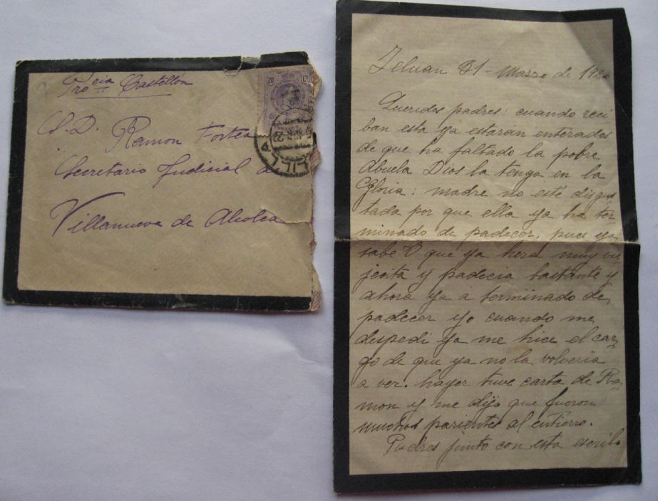

Zeluan 27 Marzo 1922.Queridísimos padres……………..

Mañana estaré de guardia, por aquí no dicen nada de nuestro relevo, pues esto cada día va peor, los moros cada día se sienten más farrucos, pues ya sabrán que el enemigo nos ha bombardeado en Alhucemas y ha mandado a pique el vapor Juan deJuanes de la Compañía Transmediterránea, si esto ocurriera en otras naciones, otra cosa seria. .

Cuando estaba en el cuartel de Castellón para ir de paseo llevábamos un machete y los oficiales sable, aquí cuando vamos de paseo vamos sin armas y los oficiales con un garrote y nada más, se ve cada cosa que parece mentira, el mundo al revés, en Barcelona país civilizado tienen grandes cañones y aquí antes de los sucesos muchos campamentos sin cañones, pues si en el Mauro y el Gurugu hubiesen estado los cañones que hay en Montjuic, no hubiera pasado lo que ha pasado.

Aun me quedan pasar quince meses. Todas las noches cuando termino de tocar Retreta, digo un día más y uno menos de mili, ya llegara el día.

Padres el otro día vino una nota de Comandancia General en la que decía que por R. O. del 22 de febrero pasado tenemos autorización de poder llevar la medalla de campaña con el Pasador de Melilla ,pues esto solo la han dado a nuestra Compañía , por la distinción de lo pasado en Tizza.

Les mando un recorte de Mundo Grafico del día 22 del corriente pues el día que pasaron los tanques les seguimos un trozo y al cruzar el rio Zeluan lo fotografiaron ,como estaba al lado del tanque también he salido aunque no muy bien ,me han conocido los de la Compañía incluso los oficiales. El que está a mi lado es el hijo del Conde de Consuegra, que ha muerto en las últimas operaciones, era voluntario en los Regulares de Caballería y estaba aquí en Zeluan.

Ayer pasaron para Melilla 3 tanques que fueron averiados por los moros, pues se les termino la bencina y tuvieron que abandonarlos , los moros hicieron una reata con mulos bueyes y camellos para llévaselos pero no pudieron , ayer los llevaban para arreglarlos, está visto que para estas fieras no hay ni aeroplanos ni tanques que valgan pues son terribles si el tiempo, volviese a otra vez esta catástrofe, ellos ya tendrán aeroplanos y de todo y esto será más negro, pues ellos cada día aprenden mas, ya saben hacer funcionar los cañones como nosotros y los automóviles los guían mejor que nosotros por estas tierras, es decir que si dentro de unos años tenemos otra como esta, Dios nos Libre. Sin nada más que decirles……..Joaquín.

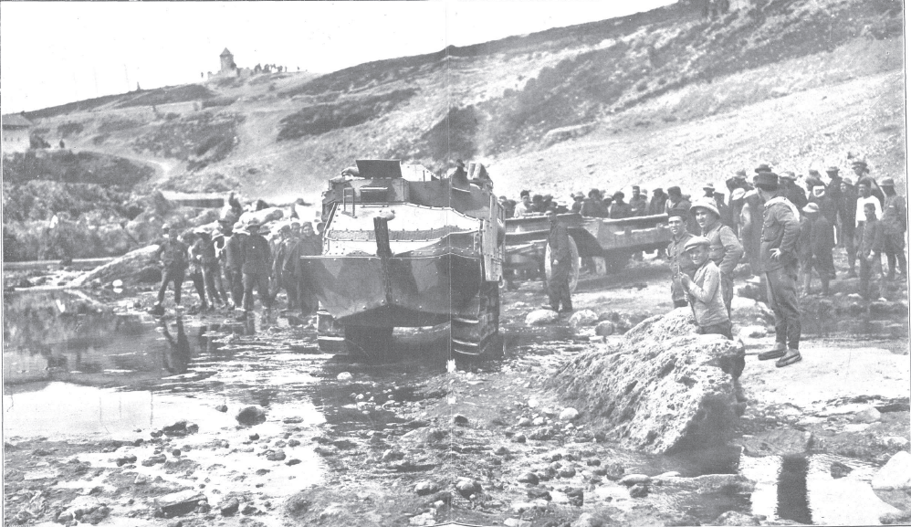

Fotografía obtenida a través de la oficina de reprografía. Expediente nº.207/ Biblioteca Nacional.

Hemos obtenido esta imágen gracias a la información que en la carta anterior el propio Joaquín daba a sus padres y ha supuesto para nosotras una grata y emocionante sorpresa recuperar esta fotografía noventa años después.

Zeluan Abril 1922

Querido padres…………………………….

Padres por aquí circulan rumores que si es verdad, el quince del mes que viene ya les podre dar un abrazo, hoy ha venido otro Capitán de la compañía y se ha mostrado muy contento de los soldados de la 3ª Compañía los que nos supimos defender en los combates de Tizza. También dice que al llegar a Castellón a nosotros nos darán una gran fiesta y un buen permiso, así que si es verdad lo que nos han dicho ya les escribiré diciéndoles la fecha

Nosotros todos los de la 3ª Compañía estamos muy orgullosos por la distinción que nos han hecho y de poder llevar la medalla de campaña por aquí somos los únicos que tenemos ese permiso.

Sin nada mas espero verles………………………..Joaquín.

***  
CURIOSIDADES.***

Por el B.O. del 14 de agosto de 1922 sabemos que se se concede al Batallón del Regimiento Tetuán del que formaba parte Joaquín la Medalla Colectiva, que da derecho a los soldados de dicho batallón a lucir el Pasador de Melilla.

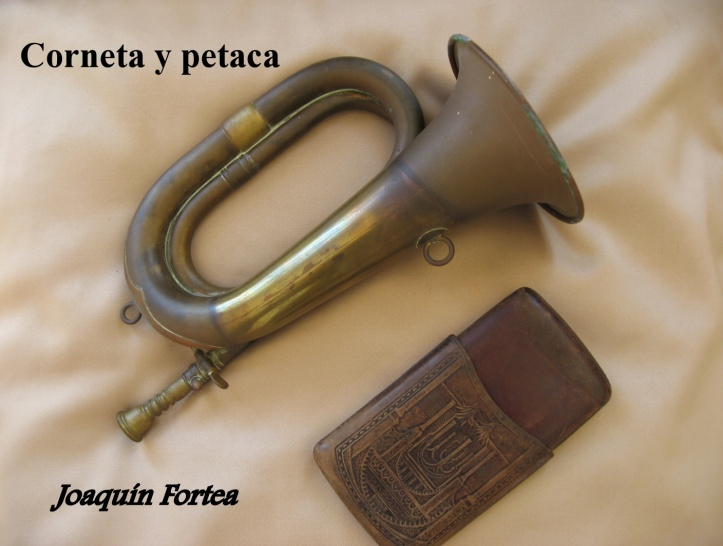

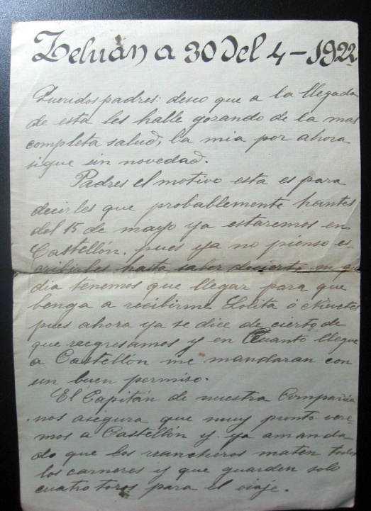

Mientras Joaquín estuvo en Tizza conoció al soldado Vicente Bellmunt Sales, se hicieron amigos y cuando Vicente enfermó de fiebres, Joaquín salía todas las noches arrastrándose por debajo de la alambrada para coger higos chumbos con los que hacia zumo que daba de beber su amigo mientras los demás compañeros estaban pendientes del ***paqueo.***

Después, **cu**ando les destinaron a Melilla Vicente le regaló su ***petaca*** que Joaquín conservó toda su vida. Vicente también le mostró una foto de su hermana que cautivó a su amigo. A la vuelta de la guerra, Joaquín conoció a la hermana de su amigo, Elodia, se casaron el 23 de Mayo de 1924 y compartieron su vida durante 66 años.

***  
VOCABULARIO:***

***Aguada***. Pozo de agua potable que se encontraba alejado del campamento a veces 500 metros. Para abastecerse se necesitaba vigilancia, por eso hacer \<la aguada\> era muy peligroso.

***Blocao***: Trinchera construida por sacos terreros, maderas, matas y una alambrada de metro o metro y medio. Se comunicaban entre ellos por el heliógrafo. Por la noche, por medio de señales luminosas con linternas.

***Corneta***. Instrumento musical de viento metal utilizado en el jazz, música clásica y en bandas militares.

***Fajina***. Toque que ordena la retirada de la tropa a sus alojamientos.

***Heliógrafo***: Instrumento de comunicación que empleaba la luz solar reflejada en un espejo plano, manipulándolo se podían mandar mensajes. No se podía utilizar de noche, con niebla ni bruma.

***Paqueo***. La palabra paco deriva de la onomatopeya del disparo, el ruido seco al pasar la bala sobre el observador, seguido de la detonación del disparo en la boca del fuego (que se produce antes pero llega al observador después).Este nombre empezó a utilizarse en la guerra con Marruecos a mediados de 1909 para designar a los moros que disparaban en solitario colocados un punto de observación difícil de ver y que causaban numerosas bajas a nuestras tropas el sonido paco debido al eco se pronunciaba pac…o.

***Petaca***. Estuche de cuero u otro material en el que se sirve para llevar cigarrillos o tabaco picado

***Sobras***: Nombre que se daba a la paga o soldada. El soldado raso percibía 25 cts. de peseta cada día, el corneta 37 cts. de peseta.

***Tarka***. Sinónimo de expedición guerrera.

***Tan- tan***: Nombre que daban los rifeños a los aviones de los españoles.

***Vivaquear***: Pasar la noche al raso.

***  
CONCLUSIÓN.***

Hacer este trabajo ha sido como buscar una aguja en un pajar y una vez encontrada, siguiendo el hilo, conocer la historia a través de las cartas de mi padre, Joaquín Fortea, ha constituido para mi una herencia inesperada.

En una carta fechada en Zeluan el 27 de marzo de 1922 al final dice que los rifeños aprenden rápido. Él intuía que guerreaba en territorio hostil, que el enemigo se movín en su terreno y tarde o temprano acabaría reclamando lo que consideraba suyo.

En medio del dolor y sinsabores de la guerra, en sus cartas no había rencor y jamás una queja, ni una palabra de reproche hacia sus superiores o su patria, e incluso rara vez arremete contra el enemigo al que de alguna manera quiso comprender.

El, en su clara conciencia siempre tuvo la serena sensación de haber cumplido con su deber.

Cuando el 6 de noviembre de 1975 se inició la Marcha Verde que puso fin a la soberanía española sobre el Sahara, mi padre, con lágrimas en los ojos, lamentó que tanto dolor y sacrificio por ambas partes acabara así, con la claudicación de España ante Marruecos.

De este trabajo, ha sido coautora, mi amiga y compañera de clase, Francisca Julián. Hemos compartido tiempo, esfuerzo, ganas de saber y entender la historia de la Guerra del Rif. También a ella le debo, el haber aportado sin olvidar el lado humano, la parte objetiva de esta tarea. Y me alegra el haber podido dar a conocer por medio de sus cartas, al Gran Hombre que fue mi padre Joaquín Fortea, “corneta en la Guerra del Rif”.

***  
BIBLIOGRAFÍA:***

ABC. Año 1921-1922.

Blanco y Negro. Año 1921-1922

Enciclopedia Universal Ilustrada Espasa-Calpe, tomo 27 pág. 983

Diccionario de la Real Academia Española

Heraldo de Castellón. Año 1921-1922

Mundo Gráfico. Miércoles 22 de Marzo 1922

La Provincia Nueva. Año 1921-1922
