**PRESENTACIÓ**

**Em diuen Listo. Soc un gos.**

La meua ama Paquita diu, que quan em va portar a sa casa un dels seus fills, la vaig mirar de manera com si sabés el que ella volia dir i va pensar, -Que llest és - i així es va quedar el meu nom, soc LISTO. Tenia pocs dies, i segons ella, era el cadell de gos més bonic que havia vist mai. Ja soc adult. Tots els de casa em volen, jo a ells també.

Compartim casa nou anys, sofà i butaca, passegem junts tres vegades al dia, al poble, a la ciutat a la platja i a tots el llocs on anem.

Tenim les mateixes manies. A tots dos ens molesta el sol, ens agrada escoltar música que no faci massa soroll i veure el que passa al nostre voltant. Però a vegades no la entenc de tot. Si a mi m’agrada quan m’acaricia el cap, per què jo no puc (fer jo) el mateix i tinc que esperar quan fa una becadeta a la butaca, per a llepar-li les seues orelles?

Jo sé quan està contenta, i quan està malalta no em moc del seu costat, i de tan en tan li llepo les mans per a que sàpiga, que no està a soles.

Quan escriu, em pregunta què em pareix, si m’agrada moc les orelles i si no m’agrada n’estic quiet i ella ho entén. Per això penso, que podia escriure també, tot el que ella no veu, i jo sí.

Ara tecleja a l’ordinador però abans o feia asseguda a la butaca, i escrivia en llapis. Jo em gitava al seu braç, la seua llibreta recolzada al meu llom i estava quiet, a més a més deia el que escrivia parlant, tot un llibre sencer!! (el sé de memòria) i clar, m’ha apegat l’afició d’escriure, crec, que també tinc alguna cosa que dir. Penso dir-li tot el que m'agrada i el que no, i escriure ací.

Listo. 2010

**TERTULIA ENTRE AMICS**

Quan anem a passejar a la placeta del meu carrer, tots els dies em trobe a les meues amigues, la Gala i la Tula. La Tula és petita, revoltosa i molt espavilada, i la Gala com que porta el cognom d'un escriptor famós, es dona una mica d'importància.

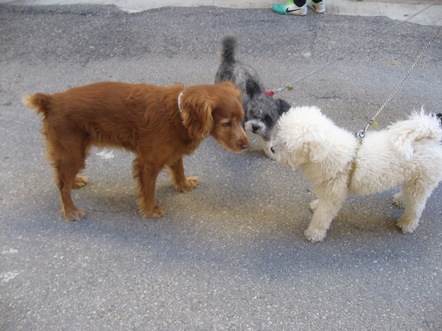

Huí la Tula ens ha dit:

TULA: Escolteu: crec que prompte seran festes, eixes que hi ha tanta gent pels carrers i tiren coets.

GALA: Com ho saps? A mí els coets em fan por!

TULA: El meu amo, ha portat a casa un llibret i una cinta verda, com la que tots els anys em fica al collaret.

GALA: Quina vergonya! Una cinta verda penjada al collaret .No tens prou amb el llaç que portes al pirri?

TULA: Mira qui parla! tu portes el teu nom grapat al teu collar per si et perds, i a més, l’abric de quadres que et fica la teua ama no t’afavorís gens ni mica; et fa gorda.

GALA: Ja ho sé però a la meua ama li fa il·lusió i com estem a soles i em vol tant…

LISTO: Ja està bé! Sempre feu el mateix, discutir sense cap substància.

GALA: Clar, com que tu eres xic i no et fiquen res.

TULA: A tu, Listo no et fa falta, amb eixa melena daurada que tens, eres molt trempat!

LISTO: Jo faig faena. Vigile la casa i a més com la meua ama moltes vegades no sent el timbre de la porta, lladre molt fort i així ella sap que han trucat, i també, quan truca el telèfon aleshores lladre diferent, com un llop i així, ella pot parlar amb qui la crida, i em fa carícies i em diu guapo!

TULA: Doncs jo no faig res, tots els de casa em cuiden al braç i surt molt al carrer amb el meu amo.

GALA: Nosaltres estem molt tranquil·les, no ens agrada el soroll.

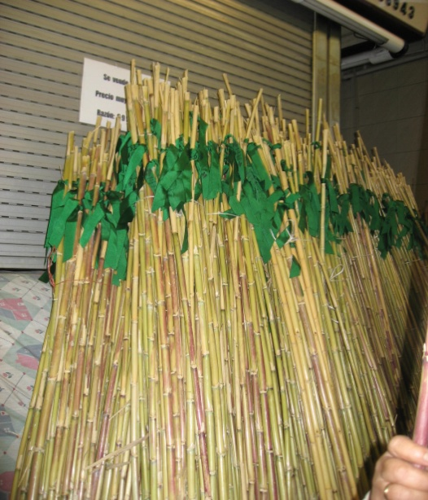

LISTO: Que avorrit! A ma casa sempre hi ha gent, el xiquet que més m’agrada és el menut, m’ha donat la meua ama un joguet de fusta d’ells que vaig rosegar, molt bonic. Primer es va empipar, però aleshores és meu, a més quan li donen de berenar, em dona d’amagat les seues llepoleries que són boníssimes.

TULA: Ens anem a casa, segur que demà ja portaré la cinteta verda que m’agrada molt.

.

GALA: Doncs la meua ama i jo, crec, que com tots els anys ens anirem a la platja fins que passen les festes, i els coets.

LISTO: Que bé! a mi segur em donaran a tastar llonganissetes, botifarres seques i xorissets, com sempre, que bones estan!!!.

Listo.

**ESTEM DE DE VACANCES**

Com tots els anys, quan arriba Sant Joan, ens preparem per anar de vacances a la platja, i una de les coses que sempre fa la meua ama és portar-me al veterinari. Em canvien el collaret per protegir-me de no sé quantes coses i em tallen el pèl. Aquesta vegada s’han passat i quassi m’he quedat calb, en tres i no res, m’han desaparegut totes les ones, amb el que jo lligava amb la meua melena... Però aixó sí, estic molt fresquet.

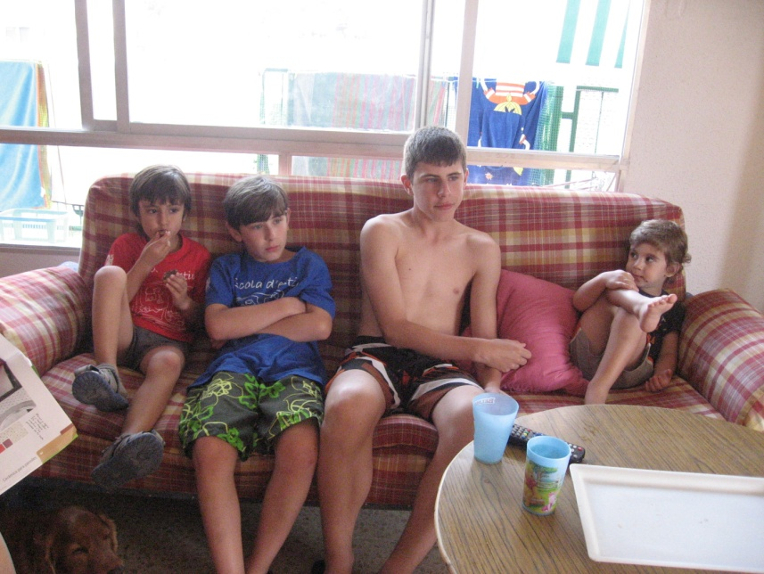

Al primer pis del nostre apartament, viu tot l’any una gosseta amb la seua ama que sols parla angles, es diu Babsy i em conta totes les novetats del veïnat.

Està molt espantada doncs a la planta baixa, viu una família nova i m’ha dit que tenen un gat que pareix un monstre.

-No serà tant!! Li he dit jo, un gat és un gat. I recorda que nosaltres som els millors amics de les persones i ens estimen molt.

Huí de matí hem fet el passeigs pel voltant de la Torre Sant Vicent, on anem tots els dies. Al arribar al jardí del nostre apartament, la meua ama sempre em lleva la corretja i em deixa que em rebolco per l'herba i he vist al gat que tenim com a veí. Clar que la Babsy està espantada com que és més gran que ella!! Em mirava i m’ha fet un bufit, quina poca vergonya!! Com si sols ell tinguera dret a estar al jardí i jo fora el foraster!. He corregut darrere d'ell, hem fet una bona cursa i li he donat un bon esglai. Quasi el tenia agafat quan s’ amagat per una gatera que té al costat de la porta de sa casa. Fins i tot estaré vigilant que no s’acoste a la Babsy

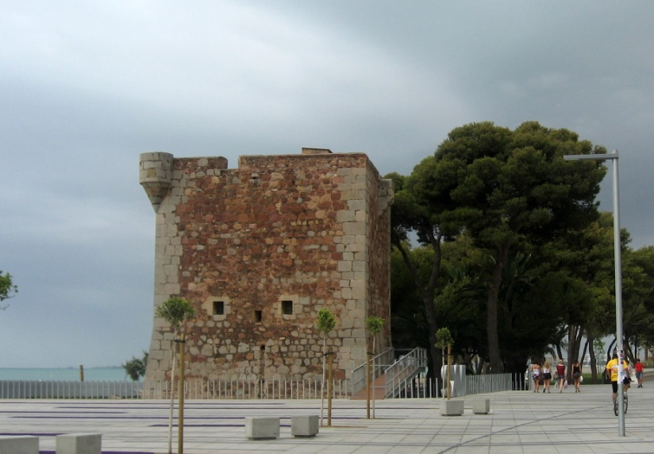

Per la vesprada, la gosseta i la seua ama estan les dos assegudes a uns bancs que hi ha al jardí per la part de la façana, sols escolten, no parlen mai. Allí estan també unes quantes veïnes desfeinades que miren tot el que entra i surt de l'edifici i també xafardegen de tot el que ocorris pel voltant .Quan la meua ama i jo ens anem a passejar i passem per allí ens diuen, que sempre tenim pressa, i és veritat, ens agrada més anar a caminar, així és, que la meua ama no mai sap res de res, sempre està en Babia referent a les notes socials del carrer.

Però Babsy m'ho conta a mi tot. Les persones es creuen que nosaltres no veiem res, i saben tot el que es diu i es fa al nostre voltant. Ahhh si parlarem!.

Listo.

**JA ESTEM A CASA.**

He escoltat a la meua ama, dir amb un sospir profund (Ja estem a casa. Gràcies a Dèu!!!) i jo penso – I tant... fa tres mesos que anem pel món. Carregats amb la seua maleta, el meu menjar, el llit, xampú i no sé quantes coses més. De fet, no cabem en els cotxes dels fills. Sempre fa de carregador Tadeo, el germà. En el seu vehicle anem al poble, de tant en tant fem alguna parada i jo puc córrer i fer altres coses ... pel camp abans d’arribar.

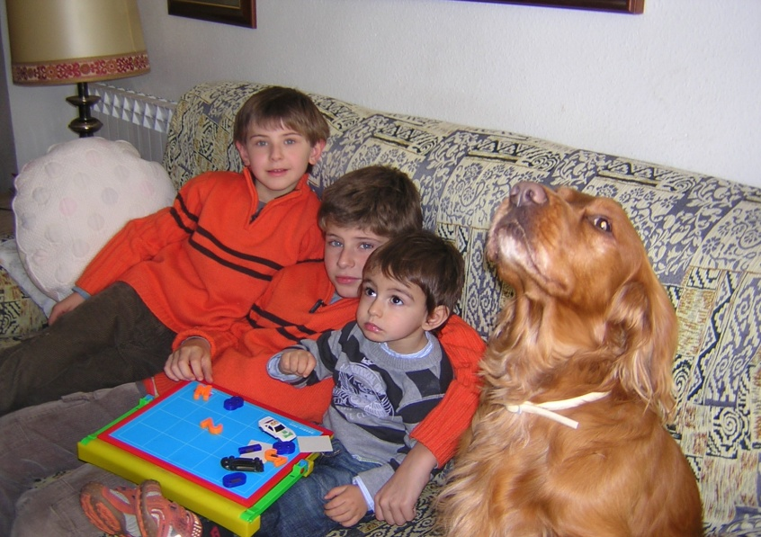

Estic acostumat a fer canvis. Quan comença l’estiu, ens anem a la platja, allí s’està bé, sols tinc que estar vigilant als xiquets, menys mal que es fan grans i quan ja estic fart d’ells, m’amago sota el sofà, allí, no poden acostar-se i n'estic una estona tranquil, També tinc la ventaja de tastar totes les llepolies que ells mengen i que em donen d’amagat, més que res, els gelats de tota mena que ens agraden molt, quan van cap al frigorífic jo vaig amb ells, sempre cau algun mosset.

Desprès toca el poble, també uns dies a Morella i al mas.

Quan m’agrada Cinctorres!!! tinc tota l'entrada de la casa per mi, a més d’una renglera d’escales fins al terrat. En veritat són moltes escales, tres pisos, però com m’agrada estar prop de la meua ama, faig tants viatges amunt i avall com ella. A vegades les potes em tremolen i penso...desprès a Castelló descansaré.

De bon matí, ens anem a passejar a la font del Bassí, està a les afores del poble. Primer, faig una ullada al galliner que té la Rosa, la veïna del carreró de La Placeta a les eres, són cinc gallines i un gall molt presumit, blanc i negre, les gallines de color quasi roig. El gall és un escandalós, fa molt de soroll amb el seu kikiriki. Al sortir de casa ja l’oïm, i quan jo m’acosto lladrant, s’amaguen tots i només marxem nosaltres, tornen a ficar-se a la finestra del corral. La meua ama diu, que els ous de les gallines de La Rosa són molt bons.0

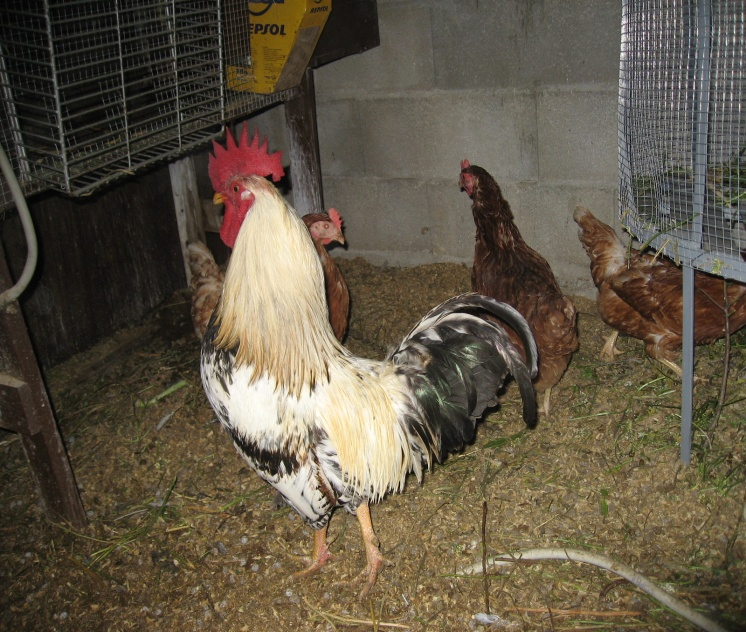

El camí de la font és un passeig on va la gent del poble i els forasters que estan estiuejant. A mi m’agrada anar pels bancals, córrer i botar, doncs la terra és molla i a les meues potetes no li fa mal.

Quan arribem, tinc molta set i el primer que faig es beure al xorro, (que fresqueta esta l’aigua!.) La meua ama, desprès de guaitar que no hi ha ningú a prop, em deixa prendre el bany al bassiol, on beuen els animals de la rabera i els cavalls i desprès seguim caminant. Però aquest any, no hem pogut menjar mores dels esbarzers. Al Barranc de La Vila, que està prop, la sequera no ha deixat que maduren... l’any que ve, serà.

Listo

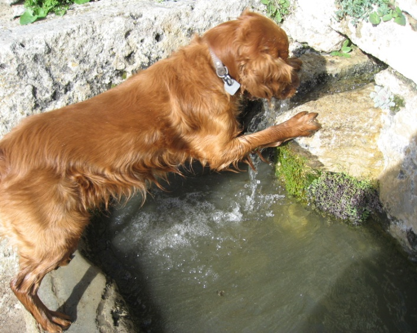

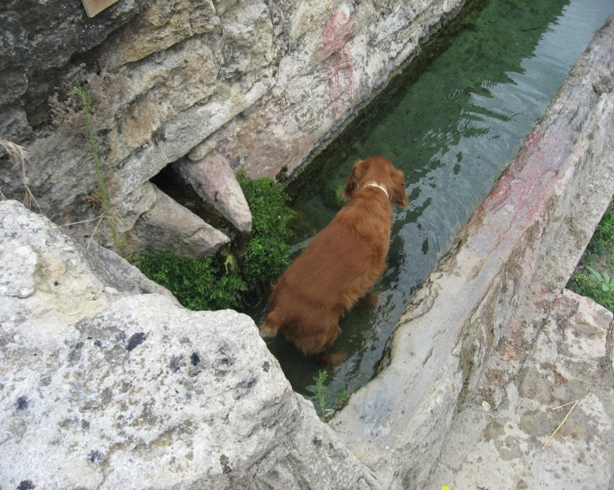

**EL CORDERET**

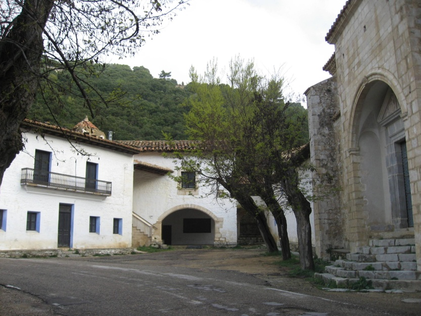

Sols em faltava veure aixó!! A les set  del mati del diumenge, ens vàrem anar al poble. La meua ama volia fer fotos a l’ermita de la Mare de Déu de la Font i també al mas. Diu que és la millor època de l'any, doncs el camp està renaixent i ens vam lluir!. Pel Coll d’Ares i un bon tros més, estava ple de boira, a vegades pareixia que anàvem dins dels núvols.

Fotos sí en va fer, de tant en tant, rebíem una arruixada i varem acabar tots mullats, pareixíem sopes, i plens de fang. Cada vegada que jo sortia del cotxe, l’ama em netejava les potetes, diu que l’embrutava, vaig corrent pels bancals, saltant parets i també em vaig remullar a la bassa del mas, doncs sempre l’havia vista seca i aquesta vegada hi havia aigua. Tot anava bé fins quan ja marxàvem al poble a dinar, i vàrem trobar la rabera pel bosc, pasturant sense parar l’herba fresqueta dels bancals. El pastor i els gos de guarda anava darrere, a mi no em van deixar que m’arrimarà, (amb lo divertit que seria lladrar ben fort i fer córrer al ramat) doncs els animals s'esglaiaven i a més armaven molt de soroll, amb les esquelles que porten penjades al coll.

Aleshores, el xiquet menut va dir que una ovella s’havia perdut i que estava a soles darrere. Ens vàrem aturar i jo altra vegada castigat (sense menejar-me). En un tres i no res teníem un corderet recent nascut allí mateix, davant de nosaltres, la mare el va llepar tot, i amb el morro l’espentejava, el va fer alçar-se poc a poc, arrimant-se'l a ella i es va ficar a mamar. La meua ama feia fotos sense parar, el problema va ser quan la pluja va tornar amb ganes, i vérem al pastor que estava amb la rabera, molt allunat, quasi no es veia.

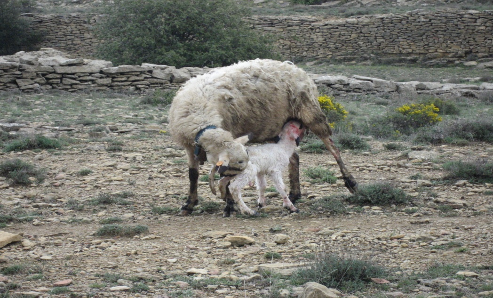

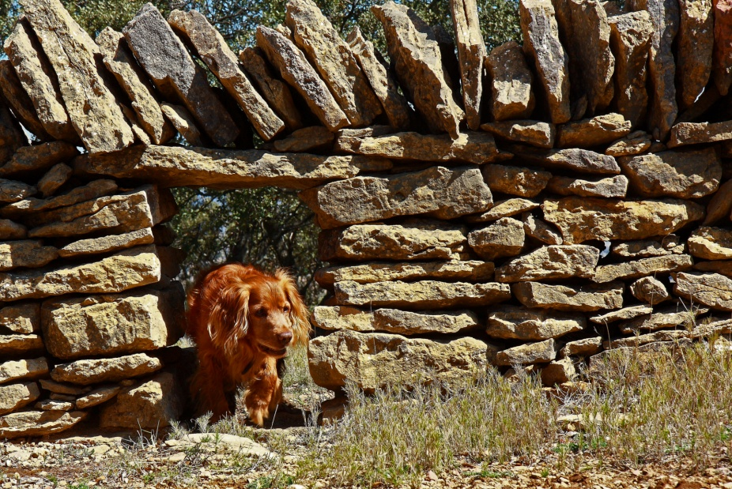

La meua ama, deia que el corderet es moriria amb la pluja, i que hi havia d’avisar-li. Els altres deien que era una exagerada i que els animals per instint, saben què han de fer. Després d’una bona discussió, ja tens al germà, remugant amb el paraigües, a dir-li al pastor, (que cada vegada estava més allunat,) el que havia ocorri’t, i ell sense immutar-se va contestar que ja ho sabia. Total, a la meua ama, li van dir tots enfadats, que cadascú sap de la seua faena i que aixó era una lliçó, està clar que no et pots ficar en camisa d’onze vares

Veurem si un altra vegada ho recordarem.

Listo

**DÉU DIRA**

*«Quan més menuda es la nou, més soroll mou»*. Aquesta dita, la diu moltes vegades la meua ama. Però no mai sabia el que volia dir, **i** ara ho entenc, quan hem anat, a passar un cap de setmana a Morella fa pocs dies.

La casa de la cosina està prop de la muralla, entrant per les portes de Sant Miquel, per la part de darrere junt a la torre redona, ho sé, perquè m’agrada donar la volta a la casa rodant la muralla.

Pel matí ens anem a l’Alameda per un camí que hi ha separat del passeig, a la part de dalt, allí em llança pinyes seques, i ho passo molt bé corrent amunt i avall, fins a la vesprada que tornem a anar.

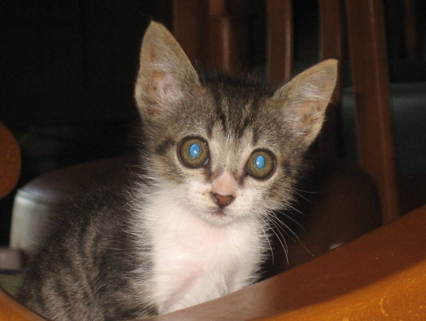

La casa, té un balcó molt gran per on es veu cap amunt, el castell, l’església i quasi tot el poble. A la part de baix de la renglera d’escales, els antics rentadors, les muntanyes i la gent que puja a peu o en cotxes al poble. Quan em quedo a soles m’agrada estar al balcó, i lladrar al gats que veig pels patis de les cases, doncs quan està la meua ama estic callat, no li agrada el soroll.

Però aquest viatge tot ha sigut al revés, a l'entrar a la casa, ja vaig notar un olor diferent, com mai, i a escoltar a la meua ama dir amb alegria... un gatet!! vaja que si! damunt, de la millor butaca, des d’eon es veu el carrer i prenent el solet allí estava mirant de manera molt descarà, un gat menut, d’un color indefinit...

A la meua ama li agraden els animalets, l’acarona i el té al bracet i al gat li agrada, i es sent ronronejar.

Encara recordo a Sara un pardal anomenat Ninfa que ja estava a casa quan jo vaig arribar, tenia la cresta de color taronja i un bec corb d’aspecte amenaçador. Tots els dies sortia de la gàbia i donava una volta, li agradava ficar-se damunt del rellotge de paret que està al menjador des d'on ho vigilava tot. Quan la meua ama Paquita descansava al sofà, d’un vol es ficava damunt del seu muscle com si sols fora d’ella, jugant amb la cadena que portava al coll i li donava besets, i amagava el cap a la seua butxaca i quan es cansava, ella sola tornava a la gàbia. Al principi em mirava amb curiositat i després no em feia cas, (qualsevol li deia res amb aquell bec corb )a mi em donava el mateix, però un gat!!!

Aquest, és menut, arguellat sols té ulls i orelles i a més a més tampoc té cap nom!, i l'ama m’ha dit: «*el gatet està a casa seua, el foraster eres tu, així que vorem que fas»*.

El que menys m’agrada és que roda pel meu costat, i quan jo fart d’ell, me'n vaig a un altre lloc, es fica a miolar amb totes les ganes, i al moment se sent: Listo!!! Que li has fet!!!.

No sé com acabarem quan a l’estiu vindrem un dies de visita. Potser que ocorrisca un miracle i el gat no estiga. Com diu la meua ama, Déu dirà.

Listo

.

.

**EL CARRERO DE LA PLACETA**

Ja estem a l’agost  i el millo, la meua ama Paquita i jo hem arriba -t a Cinctorres, que ganes tenia!!.

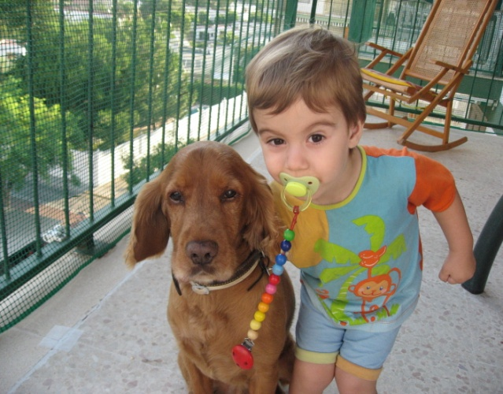

Tots  els anys el mateix,  estem a  Benicassim fins que el xiquet menut compleix anys el dia dos d’agost. La meua ama vol estar ací, no de bades quasi va nàixer a l'apartament. Diu  que a les dos de la vesprada la mare del xiquet encara estava a la piscina a remulla (ja se sap la calor que fa al mes d’agost) i  dos hores més tard, només  arribar a la maternitat,  Manel  va nàixer armant soroll com sempre.

L’adéu de Manel quan ens anàvem ha sigut  molt emocionat, m’ha donat besets per orelles, morro i tot arreu, fins que se’n va adonar sa mare...i va dir... aixó no es fa!! , com si fóra la primera vegada!!

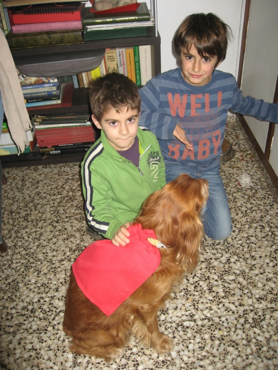

Però després he tingut  que aguantar-me... fins que vaig començar a ganyolar un poc, i clar, la meua ama va vindre corrent a veure que passava,

Ell i el Ferran (doncs volien ficar-me  dins de la seua samarreta). Primer me les va ensenyar totes i quan va aplegar a la que té  el dibuix  de Spiderman, va decidir que eixa era la més bonica, i em deia: T'agrada?  Em  vaig escapar  de miracle!!

L’estiuejar està molt bé però quan hi ha xiquets al voltant i dos mesos seguits  és esgotador.

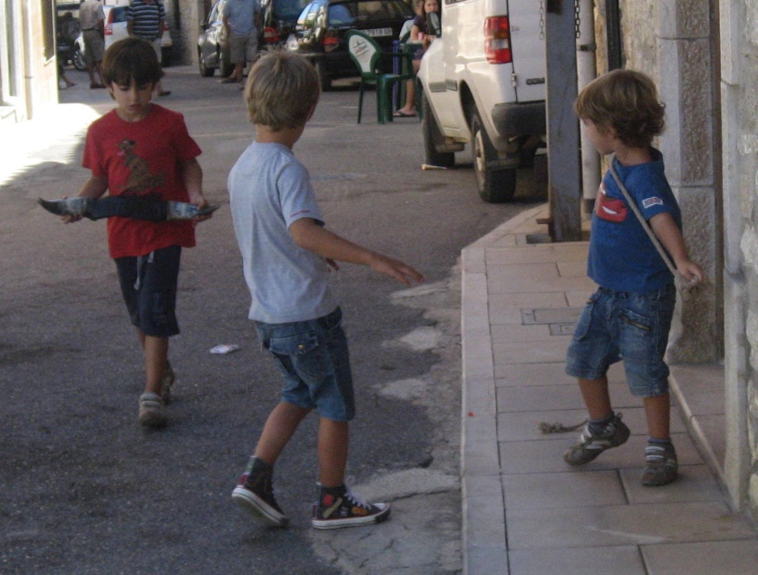

Dels quatre néts de la meua ama, els  majors no em fan patir gens. Joan em demostra els seu afecte d’un altra manera: m’acarona, m’abraça i juga amb mi sense atorrollar-me. Però quan s’acosta el menut, tinc que anar amb quatre ulls. L’any passat,  la setmana de festes a Cinctorres, els dos  menuts i  més xiquets del carreró de la Placeta, no sé d’on van traure unes banyes de bou.  Jugaven  a bous tot els dies, a  mi em  tenien més que fart,  no podia eixir de baix del sofà, al moment quan em veien preferien torejar-me a mi. Entre tots em marejàvem. Ehhh toro!!!. Quina afició! vorem aquest  any que tocarà.

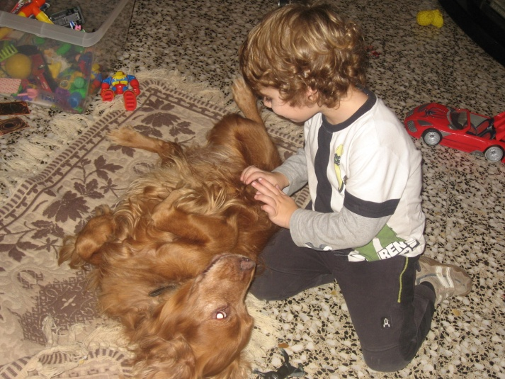

Aleshores estaré tranquil fins els dies de les festes en que vindrà la família  uns dies amb nosaltres, però s’ha de reconèixer, que quan  Manel em rasca la panxa m’agrada molt.

Listo

**LA MEDICACIÓ**

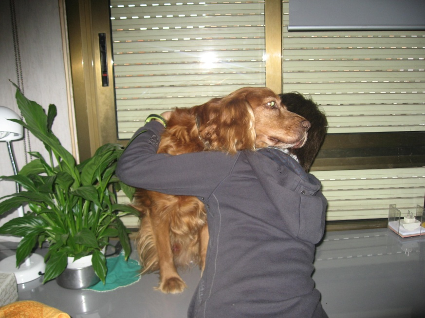

Quan pels matins ens anem a fer el passeig, com tots els dies a la plaçà del nostre carrer, acabem gelats de fred, L’últim dia feia tant de vent que es van trencar diverses branques dels arbres gairebé ens cauen damunt. A la muea ama solament se li veuen els ulls de tapada que va amb un barret que s’ha comprat i la bufanda. Donem dos voltetes a la plaça, i cap a casa.

També tenim mala sort!! Per una averia greu a l’ascensor de casa nostra, em estat uns quans dies pujant els quatre pisos a peu, tot el dia cap amunt i cap avall. Per poc no ho contem. Els dos estem baldats.

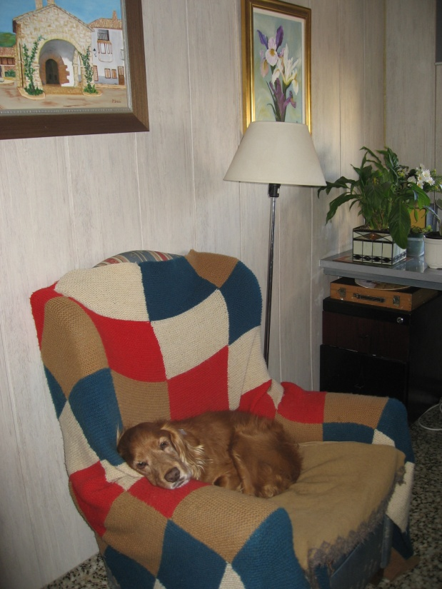

Ja tinc 12 anys, em fan mal les potes de darrere, i Paquita, m’ha portat al veterinari, li ha dit que tinc artrosis ella ja o sap, doncs m’ha ocorri’t més vegades i baix caminant coixí coixa, com que per a tot té solució, sempre em fa el mateix, uns dies de medicació quan en veu d’aquesta manera, diu, que calculant el meu pes em toca prendrem la meitat de una de les seues pastilles (ella se’n pren dos al dia ) creu que si son bones per a ella, també ho son per a mi, (de fet a mi en fan més efecte que a ella).La mitja pastilla que em dona no m’agrada gens ni mica i no la vull tragar, jo sé, que la barreja en un tros de formatge, com ho trec de la boca, cada vegada el tros de formatge que em dona és més gran y està boníssim. I clar, com que estic malet, em deixa una butaca per a mi, ficat al llim amb ella s’està molt bé,i a mes estic al seu costat, i com que(el que se da no se quita) la butaca ja es meua i l’habitació també. Quan s’enfada amb mi em diu: vés-te’n al teu quarto!! Doncs estic poc bé!! I més, aleshores que els xiquets s’han fet grans i estan al col·legi.

Espero que la medicació dures un temps. Hi ha dies que si no té formatge, la pastilla la posa dins d’un tros de llonganissa, que també m’agrada molt.

Qui no es conforma, per que no vol.

Listo.

**NO ÉS EL QUE ERA**

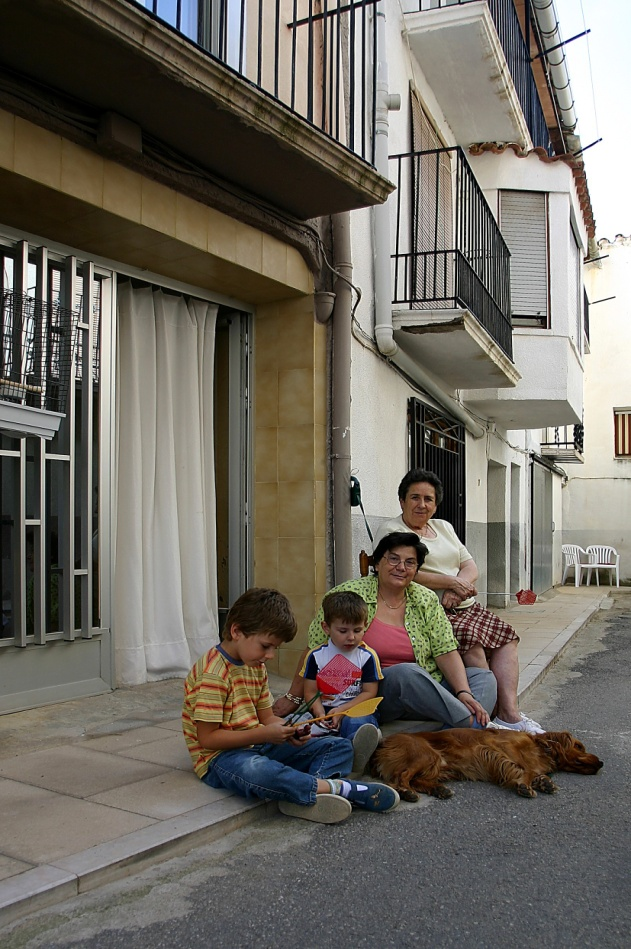

La casa de Joanet de la Fura, que està davant de la nostra, fins que no arriba quasi meitat d’agost no es veu a ningú, està tancada, aleshores ve l’avi  amb algun fill,  desprès, tot son visites que jo no conec, fins quan venen els néts i besnéts a visitar-lo i s’escolta soroll de xiquets i grans.

  No es veu gent  al carrer com abans, quan fent rogle amb una taula, els veïns,  totes les vesprades   jugaven a les cartes, i jo, estava  assegut al costat de Mercé amb la corretja dins de la pota de la cadira, així no me'n anava darrere  de la meua  ama Paquita, i les seues amigues.

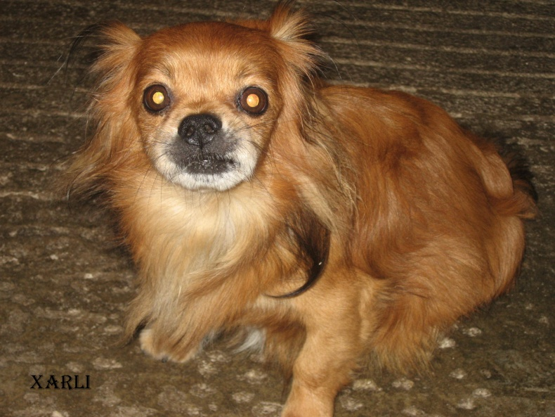

Aquest any, no he vist a Xarli el gosset de la Rosa, diu, que està al paradís dels animalets, el que aleshores té, també li diuen Xarli i  no té res que veure amb el meu amic de sempre. Aquest, és un cadell  dos vegades més gran,  amb una orella més baixa  que l’altra i sols li agrada  jugar,   li faltava aixó   a Yako l’altre gos de  la família!!!. Abans, quan anava de passeig  amb el primer Xarli pareixia un sinyoret, tot el pel blanc com un corderet i es comportava,  aleshores està  fent les mateixes tonteries que el nou Xarli , si no fos, perquè la meu ama Paquita em diu cuidadet  de fer patir  als veïns !!!els donaría un bon ensurt,  no fan més que estossinar-me, jo vull estar  a la meua porta mirant a les gossetes   que passen  per la Placeta del Cap de Vila.

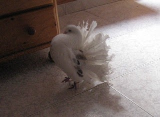

A més, passa  un altra cosa: al galliner de les eres, on hi havia cinc  gallines ponedores i un gall  molt escandalós, que jo anava a veure’ls  tots els dies i els lladrava,  sols hi ha dos polletes avorrides que no diuen ni *“mu”* quan vaig  a veure què

  Es clar que el carreró de La Placeta, no és el que era.

Listo

**LISTO T´HE PILLAT¡¡¡**

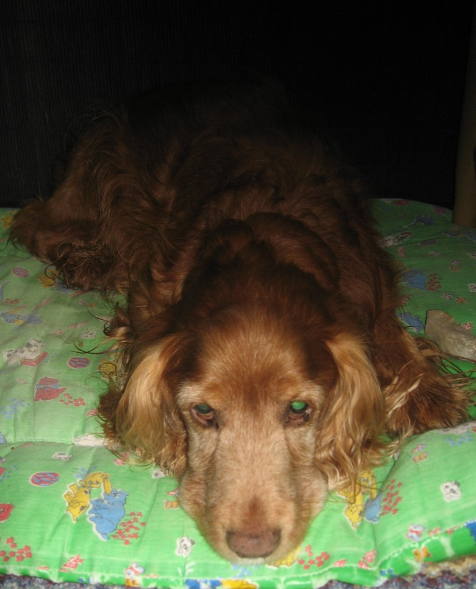

La meua Paquita quan se'n va de casa, sempre tanca la porta de la seua habitació, tota la resta de casa es queda oberta, a mi m'agrada estar a tots els llocs.

Jo, sempre faig una ullada a veure si s’ha quedat la porta oberta (a vegades amb les presses no se’n recorda de tancar-la.) Com que ja fa fresqueta i el sol entra per les dos finestres del xamfrà, damunt del llit es dorm molt bé, recolzat amb dos coixins grans que fica damunt d’un altre allargat.

Estava jo donant voltes i rebolcant-me per tot el llit i gojant amb els coixins, quan de moment em sent: LISTOOO...T’HE PILLAT!! quin esglai, per on ha vingut ? no he oït res!. Vist i no vist m’he amagat baix del llit. Paquita portava una granera i un bon empipament... Surt de baix del llit, pocavergonya.!!

  Qualsevol s’arrisca, segur que la granera aniria al meu llom. Va llevar el cobertor, els llençols, coixins i ho va ficar tot a la rentadora, també va flitar el llit, amb un spray i deia: a saber les puces que has deixat!! Puces? Si de tant tan em fica una pipeta al llom que no m’agrada gens, i a més, no sé d’on ha tret la idea de ficar-me a l'aigua de beure unes gotes de vinagre de poma que diu es antiparàsit. Puces? Seria un milacre.

Vaig estar baix del llit fins es va fer de nit i no podia aguantar el pis, així que li vaig portar el meu joguet preferit (un cocodril verd que xiula) manejant la cua. Encara se’n recordava,  mirant-me amb ulls acusadors, però ens vàrem anar al carrer a passejar, doncs jo tenia molta pressa.

  Es clar que tinc que anar amb conte, i quan tornaré a veure l’habitació oberta faré alta vegada, una bona dormideta, escoltaré si s’obri la porta de casa per a poder fugir apressa. Es dorm tant bé al seu llit !! es tan gran!! que és un llàstima no aprofitar-ho.

Listo.

**EL GRAN PI**

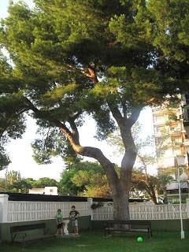

Aquest estiu, tant com s’acosta  la reunió de veïns de l’apartament surt el tema del  gran pi del jardí.

La nostra vivenda, està a la cinquena altura, i les rames, quasi es poden tocar per la barana del balcó. Pareix, que a molts veïns es fa nosa l’arbre, i és un tema de debat.

Diu la  meua ama que  de tallar-lo  rotundament no, doncs  té el mateix temps que la finca, 35 anys, fa ombra i ja és part de l'espai del jardí.

La meua ama, quan els seus fills Juan i Manolo eren menuts els va fer una foto al costat del pi recent plantat, (un plantó que va portar un veí) Els xiquets recolzats a la fonteta que està al costat ( potser per aixó l’arbre s’ha fet tant gran, doncs està  regat per l’aigua que cau del xiulet quan els xiquets juguen a mullar-se), així que ha fet la mateixa foto als néts menuts, fills de Manolo, també recolzats a la font. El pi, es  veu enorme al seu costat.

Com que els gossos no podem entrar al jardí on juguen els xiquets, jo,  ho mirava tot assomat  del balcó, lladrant molt enfadat, doncs a mi també m’agrada sortir a les fotos i a més, aquesta vegada soc perjudicat,  doncs els pardalets que  han fet  els nius entre les seues  rames, teuladins i una parella de merles, són molts descarats, sempre estan passejant pel nostre terrat con  si foren els amos i  damunt de la teulada ¡¡ la meua ama, els fica granets d’arròs del que em  guarden a mi de la paella i  molletes de pa, a vegades, també picotegen el meu menjar  que tinc a la galeria de la cuina. Si per mi fora ...l'arbre tallat,  a més, no m’he pogut arrimar mai a marcar-lo  fent  un pis al seu tronc,  i tinc 12 anys¡¡ doncs, per a  que serveis?.

Listo

**NIT DE MAITINES**

Quan escolto dir *«sopar de Maitines*» ja sé el que vol dir. He après el significat d’aquesta paraula. La meua ama estarà uns dies abans, preparant les pilotes de Nadal i altres coses.

Ella trau d’una caixa de cartó figuretes del Naixement de fang cuit de quan era xiqueta que s’estima molt, i les col·loca damunt d’un prestatge del moble del menjador. Ha escarmentat, doncs quan el Betlem estava tot muntat damunt d’una tauleta i arribaven els néts, era un joguet per a ells. El mateix ficaven l’estel damunt del pou, als Reis d’Orient dins del portal amb la mula i el bou, que a la Mare de Déu amb Jesuset al costat del riu de paper d’estany amb la bugadera, i Sant Josep per allí perdut. La rabera de corderets amb el pastor, on volien, així com els porcellets amb sa mare tots escampats: gallines, pollets, ànecs i tota mena d’animalets cada vegada d’una manera diferent, i tota mena de casetes i muntanyes de suro plenes de farina o sucre, el que venia bé.

Cada dia quan els néts se'n anaven a la seua casa tornava a recompondre el Naixement.

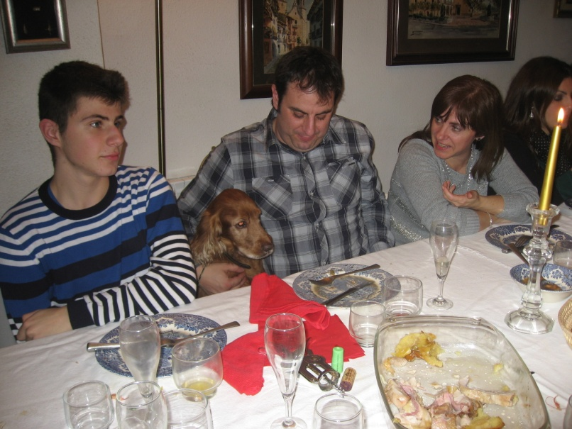

La primera festa de Nadal que recordo, va ser molt moguda. La meua ama va estar tota una vesprada trencant ametlles i cremant sucre per a fer torró com al poble. Va omplir la safata del forn plena de torró de *guirlache*, la va deixar damunt de la taula de la cuina i se'n va anar al llit. Feia una oloreta que no es podia aguantar, donant bots moltes vegades, vaig fer caure la safata i tot el torró cruixent per terra a trossos. Que cosa més bona!!! vaig estar rosegant tota la nit i me’l vaig menjar tot. Que malet estava de matí!!! Quan la meua ama em va veure, es va esglaiar, va cridar a un fill i corregudes al veterinari de Vila-real que estava de guàrdia, aquest, a més de cobrar un grapat de diners , va dir que no sé com no me’n vaig anar a l’altre barri. Degut a aquesta feta, sempre he menjat un compost especial que la meua ama diu que costa un ull de la cara (aixó no entenc que vol dir).

Com a càstig, prohibit donar-li res dols a Listo.

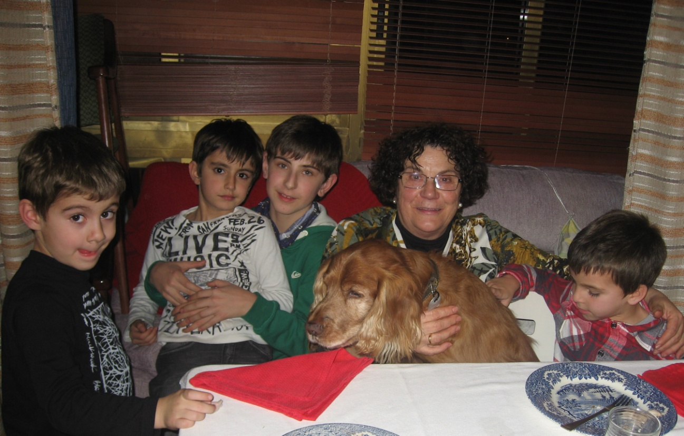

La meua ama quan s’enfada es fica seria de debò , jo sé que és millor fer-li cas. Quan era cadell, estava al seu bracet i em sortien les dentetes, m’agradava mossegar-li els dits i les mans , ella deia que li feia mal... fins una vegada que em va agarrar una poteta, i em va pegar ella a mi, un mos de veritat a les molletes que tinc baix dels dits, uhhh que mal!!! em va fer ganyolar, quan ho penso encara m’esgarrifo, que mal em va fer!!!.I hem va dir, t’agratat?. Vaig aprendre la lliçó, i a les seues mans només llepadetes i amb el seu permís. També diu, que té totes les portes del pis plenes de marques dels meus arraps, i el moble del vestíbul un costat tot rosegat, (si no podia mossegar les seues mans algun lloc ho tenia que fer) va tapar el desperfecte amb cera i no sé quantes coses més, però ja se li va passar l’empipament.

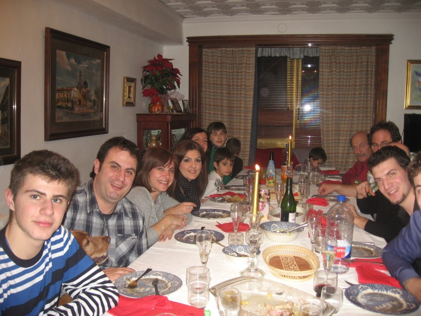

Ja tenim la taula muntada amb plats, coberts i tots els aparells per a la Nit de Maitines ,així es diu a Cinctorres la Nit de Nochebuena, el sofà a un racó, al voltant de la taula ple de cadires, les de casa i unes plegables que porta un germà, som 17 persones i jo, que també soc de casa. El millor de tot el que em donen d’amagat els menuts, sempre estic al seu costat i provo tot el que ells mengen. Baix de la taula tot són peus i de totes les mesures. No cap ningú més, la meua ama els diu al xics grans, que res de portar les núvies a sopar.

Aleshores fins l’any que ve. Ahhh, el torró de *guirlache* mai més l'he tastat ,amb una vegada vaig tindre prou.

Listo.

**SANT ANTONI DEL PORQUET.**

**Diuen, que Sant Antoni del porquet és l’advocat dels animals, pot ser per aixó, que sempre l’acompanya un gorrinet.**

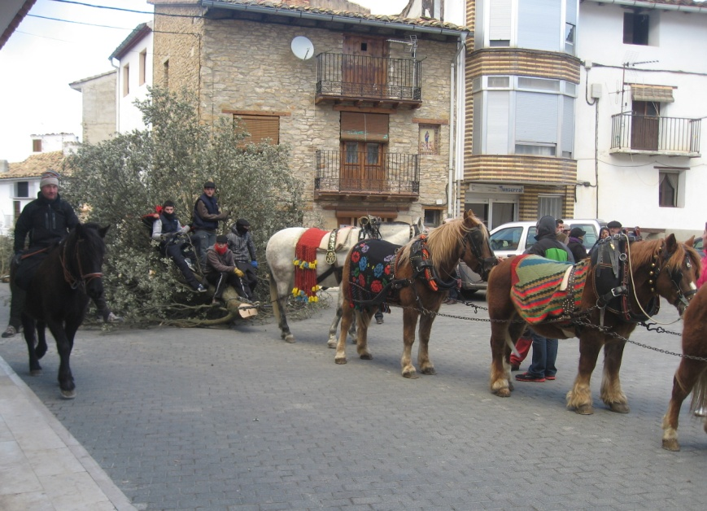

Serà per aquest motiu, que tots els anys, el dia de la seua festa ens anem al poble. Moltes vegades fa fred, com que es rigorós hivern... Però la meua ama y jo estem tot el matí pel carrers veient con els homes del poble construeixen la barraca i els animals de càrrega, porten les carrasques arrossegant-los per ha fer la foguera a la Plaça Vella, com es el costum.

Esta vegada, ha tingut companyia al carreró, doncs a l’argolla de la casa del costat, on abans es nugava del ramal als animals, ases, burros,mulos, que hi havia a totes les cases del poble, ha estat tota la vesprada, una burreta amb la seua cria, de tant en bramava de bo, fins que li han portat un cabàs de gra, jo estava mirant darrere del vidre de la porta, fins que ha segut de nit i ens em anat.

El que menys m’agrada d'aquesta festa, es anar tots el anys a rebre la benedicció. Els carrers del poble estan plens de gent que porta algun animalet, es veuen corderets, conills, gallines, pollets. Pardalets dins de les gàbies, un ratolí també dins d’una gàbia, cavalls engalanats de festa i altres com els que portaven els traginers.

Quan es fan les deu de la nit, la plaça davant de l’església està plena de gent i molts, molts companys meus, molts gossos de totes les maneres, i quantes gossetes!!! m’agradaria saber on estan a l’estiu quan vaig pel poble, a les hores no se’n veu cap, Ara, no pots arrimar-te a elles, els seus amos, em miren de reüll, doncs si soc quasi del poble!!!. El pitjor de tot es que sempre surt mullat, dons el senyo retor, te molta afició a mullar-nos a tots amb l’aigua beneïda que porta en una caldereta i amb el isopo aplega a tots; i clar, com que sempre estem a primera fila... ja n’estic cansat.

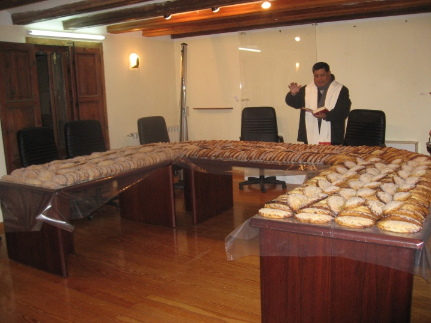

Després caminar per mig poble, com una processó,els cavalls van davant, es té que anar amb conte que no et solten una gita, sols es veuen peus i potes, com et descuides un poc et xafen, fins arribar als porxos de l’ajuntament, on el majoral, dona a cada persona que porta un animalet una coqueta de panoli, farcida de confitura de carabassa que el capellà ha beneït, i un traguet de mistela.

Aixó no esta bé !!! Si es la nostra festa; per que no ens dona la coqueta a nosaltres?.

Aquest any l’ama m’ha donat a tastar, un trosset del pastis, que bo!!!. Feia molt de fred, anaven tots tapats.

Anirem al poble a les vacances de Pasqua uns dies, i desprès a l’estiu. En un any, tornarà a ser Sant Antoni i la nostra festa, la dels animalets. I un altra vegada el mateix, gelat de fred, sense pastis i mullat.

Listo

***GRÀCIES LISTO***

*Gràcies Listo, per ajudar-me en aquest blog. Ens coneixíem tant, que els dos sabíem amb ironia el que pensàvem i volíem dir, això s'ha acabat. Huí és el moment de donar-te les gràcies. *

*Amb el anys, els nostres passejos  cada vegada eren més curts.*

*Quan aquest estiu vàrem anar al poble com tots els anys, el primer passeig va ser a la font dels Bassis on prenies el bany dins del abeurador, vas fer com sempre, mullar-te i desprès rebolcar-te per l’herba,   però al dia següent, abans de baixar la costera del camí et vas parar y em vas mirar amb interrogació, a mi em va sorprendre y et vaig deixar fer, tu vas donar la volta i vàrem tornar a casa. Així va ser durant dos mesos, l’últim dia vàrem tornar fins la font i ja no volies entrar dins  l’aigua.*

*Sempre vas saber  quan ens anàvem. D’un salt pujaves al cotxe i t’acomodaves fins arribar al nostre destí, el mateix vas fer esta vegada, menejaves la cua molt content.*

*No sé  si sabies que era l’últim viatge que fèiem junts, però quan vàrem arribar al poble  a l’obrir  la porta  et vaig  dir: Listo, hem  arribat!!, tu em vas mirar en uns ulls... que no eren els teus, et vaig agafar  al braç  con a un xiquet i recolzat   al  coixí que t’agradava tant,  et vas dormir, potser somiant saltant  parets i fent bots   pels bancals, gojant amb els meus néts, fent corregudes amb la pilota que  et tiraven cada vegada més fort, i sempre les trobaves .*

*Pareix que volies descansar on has segut feliç, entre els pins i les carrasques, a l’ombra de la Roca Parda i al costat de la Rambla Selumbres. Et faran  companyia els pardals, els esquirols,  i segur que també les papallones que tu voltaves,  i de tant en tant cauran damunt del teu llit  les pinyes seques, i les glans madures, també escoltaràs  als porcs senglar, cabres salvatges i tots els animalets que allí viuen. Al seu temps, t’envoltarà una catifa de fulles d’or, blanca neu, flors silvestres i plantes aromàtiques. Hem desfet un tros de paret per a ficar damunt del teu llit, les lloses que et guardaran sempre, les mateixes  que fa un munt d’anys els meus avantpassats van carrejar pedra a pedra per a  construir la paret que separa  la rambla dels bancals.*

*Gràcies Listo. També per el que m’has cuidat, per la manera que em miraves, amb adoració, per fer-me sentir que jo era el màxim per a tu, per estimar-me tant. Listo...quanta falta em fas.*

*Paquita Novembre 2014.*

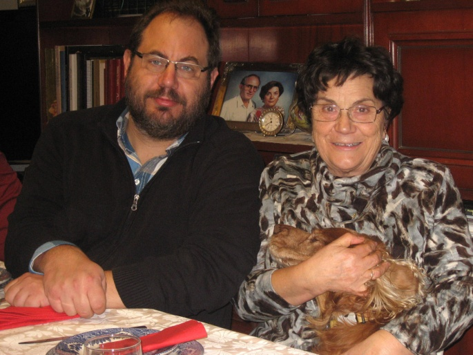

