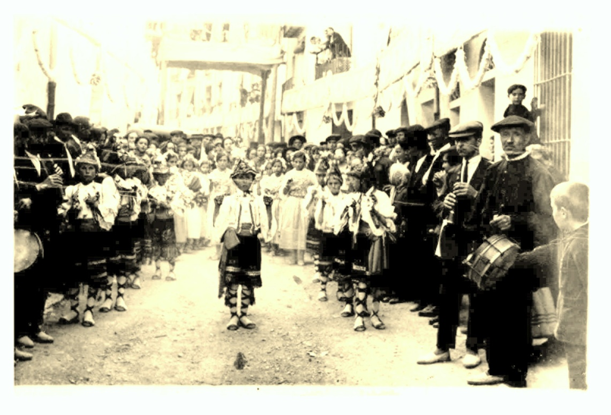

*DANZA DELS LLAURADORS*

En el *Sexenni* del año 1922, mi padre Tadeo Julián Querol, participo en las fiestas dels Sexenni como miembro activo de la cofradía de labradores, tenía 8 años.

Es el primer danzante de la parte izquierda de la foto, según decían sus hermanas, mis tías, el lugar más difícil, pues era el que empezaba y dirigía los distintos pasos de la danza de caracol acompañados por la música de *dolzaina i tabal**.***

*Paquita.*
