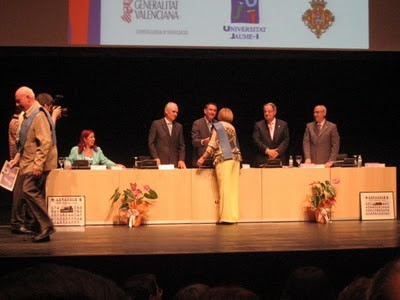

CCLOENDA DEL CURS.

Els dimarts, durat tot l’any fora dels dies de vacances son dia de classe. Ja se que als meus anys sona un poc a broma però ni en la meua època d’estudiant fa ... uhhh... un munto d’anys tenia tant d’interès d’acudir i no perdé ni un dia. de lliçó

El dia 15 de juny amés va ser la cloenda del curs de Majors en el Paranimf i la entrega de títols als companys que han acabat el primer sicle.

Pareixia una invasió pacífica de persones majors pel Àgora i els volta'ns. A diferencia dels jovents que es vestiren com volen, nosaltres anem tots mudats, en som de totes les maneres, prims, grossos, amb més cabells, calvus, millor dir amb( front despagada)

majors, menys, amb vestits tira’n a clàssic i més desenfadats, però aleshores pot ser amb més il•lusió que abans quan teníem edat de aprendre i formar-nos intel•lectualment

.

M’agrada assistir tots el anys. Desprès d’acabar l’acte molt cerimoniós doncs va ser la primera vegada que es va realitzar a quest lloc, ens van oferir un vi d’honor, desprès a les 10 de la nit teníem el sopar de fi de curs a un hotel dins la ciutat.

No mai s’aprèn prou!! tots els anys anat, ho ha pasat molt bé, però això de ballar... en poc tenia prou. Aquesta vegada em vaig comprar unes sabates que es diuen (manoletinas) doncs son planes i paregudes als que porten els toreros. Les vaig amagar a la cartera i quan es va començar la música en un rapit canvi, els tacons fora i a desfruitar de la festa agust i sen se por de caure.

Crec que ho faré així tots el anys i a totes les ocasions que tindré. Per que no ha pogut pensar axó abans?

Encara no es tard
