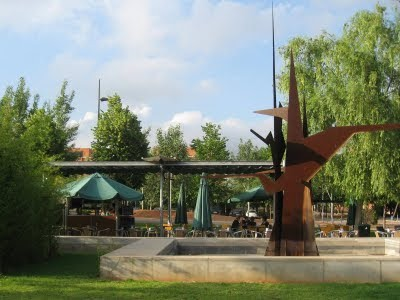
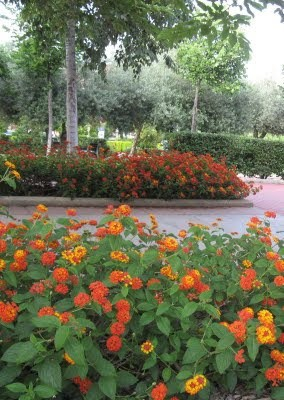

L’últim dia de classe, ha segut el triat per a dinar juntes, unes quantes companyes de la UJI, i així, recordar els moments en que em estat juntes durant tot el curs de Majors.

Primer de tot, era triar el menú adequat i que ens agrada a totes. Una vegada em estudiat les tres opcions que tenim, i que oferís la Universitat, diferent, a cada facultat, em decidit anar a dinar a la Facultat de Jurídiques.

Com que el preu és d’estudiant,la varietat es poca i cada una a escollit el que més l’agrada.

Desprès del primer i segon plat, jo haig agarrat de postres natilles,una amiga es veu que també volia fer el mateix, el recipient que ella ha triat, era una escudella,el contingut del mateix, color però el sabor molt diferent, doncs quan a ficat la cullera i se’l menjava a soltat un crit, tota enfadada, no està dols,!! no son natilles,!!era un gaspatxo andalús, carregadet d’alls i vinagre, mol poc adequat pal moment.

Les rialles i humor, han segut el millor postres que em tingut,

en aquest dia tant senyalat. I com calia acabar bé, em pres el cafè o infusions al jardí Dels Sentits, que porta el nom que toca, doncs està dividit per gaudir del cinc sentits, com vista, oït olfacte, gust, i tacte. Però desprès de dinar el que em sentit, ha segut molta son,de bona gana haguérem fet una bona becadeta, Pel nostre volta’n, hi havia més d’un jove fen la sesta damunt l’herba, però clar, qui s’atrevís a fer el mateix? Que pensarien els nostres fills, si ens veient així, com se tinguérem 18 anys?Quant estem rondant cassi els setanta?.

Comentant el cas a uns companys, ens han dit que hi ha un petit salo de descans amb sofàs, al costat del menjador de la cafeteria. Serà cosa de buscar-lo, per si ens fa falta el proper curs, i poder fer us d’ells.
