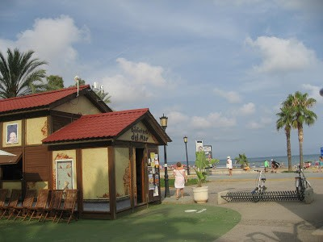
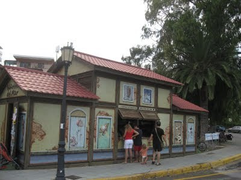

Mi verano en la playa termina, cuando llevo a la biblioteca, el último libro que he leído y me devuelven el carnet de lectora, que tengo, no se cuantos años con el nº9327 en La Biblioteca del Mar.

No es un edificio como los que estamos acostumbrados a ver, este, es un espacio reducido, vivo, lleno de gente y muchos niños mezclados con personas de todas las edades. Es un lugar privilegiado en un paseo, en la playa, desde donde se ve, se huele y oye la mar.

Hay libros muy variados para ser un lugar temporal, escritos en castellano, valenciano. catalán-e ingles, prensa y muchos libros infantiles y de viajes donde los pequeños lectores a veces aun llevan puesto el traje de baño.

Soy lectora empedernida me gusta todo tipo de temas. Mi verano empieza cuando termina el colegio de mis nietos, entonces, me voy a la playa hasta los primeros días de agosto en que cambio la mar, por las montañas en un pueblo, de la comarca Dels Ports.

Los últimos tres libros que he leído entre otros, han sido muy distintos.

AGUIRRE EL MAGNÍFICO: Manuel Vicent. El autor nos dice, que sin ser una biografía del último Duque de Alba, es una vida a veces tan irreal que parece ficción literaria. y es verdad, aunque cada uno de nosotros veamos las cosas de distintsa maneras.

TRANVIA A LA MALVARROSA: Manuel Vicent. Es un libro, de los que más me gustan de este autor de la comarca de La Plana,(creo que he leído todos los que ha escrito )La obra, refleja, muchos aspectos de Valencia y su ambiente, también reconozco, los lugares que describe de Castellon que tengo en la memoria, y la forma de vida familiar de aquella época. Ha sido un placer releer esta historia, en uno de los lugares en que también transcurre como es, las Villas de Benicassim.

ASTUR: Isabel Sansebastian. Es un tipo de novela Histórica –ficción muy interesante La autora, ha debido documentarse muy bien para poder tejer la historia, con nombres de reyes y caudillos, tan lejanos en el tiempo,que por mi parte,a veces, no sabía ni recordava.

He guardado el carnet de lectora. Aun queda verano, pero será distinto, con ambiente de pueblo de amigos y familiar, hasta mediados septiembre, y será el próximo año, cuando volveré a ir y disfrutar de sus libros y ambiente distinto, en la Biblioteca del Mar.
