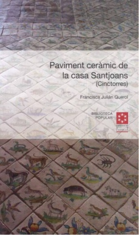

Així comença el llibre del escriptor cinctorra Joan Josep Rovira Climent:

*La Mundart no és solament la Parla de la mare, sinó que és al mateix temps i sobre tot la Mare de la parla.*

Aquestes lletres estan traduïdes de un text del filòsof alemany Martin Hidegger.

Rovira, explica que no és fàcil trobar un mot per traduir Mundart, la parla original, la parla formada en la infància,la parla inicials son expressions aproximatives. La Mundart és ames de un lèxic determinat el color i la sonoritat de la parla en l’espai on la van assimilar. Hi han bones probes amb paraules que s’escriuen de la mateixa manera con per exemple \<peu\> en pobles diferents i que tenen la mateixa llengua. Però la Mundart del cinctorrà li ha fet conèixer aquell mot en la seua parla original en un so diferent que s’aproxima a \`piau.

També diu, que viure, és tornar a la infantesa, al temps de les puritats primeres, a les descobertes sensacions inicials ; la primera tronada, la primera pluja sobre la pell, els primer estels la primera mort, la fe primera, la temor primer,la primera fruita, la primera absència, la primera buidor, el primer amor, la primera pregunta, els primers amics, el primer dubte, la primera vacil·lació de la innocència, el primer viatge, la primera llàgrima, el primer bes, el primer adéu, la primera cançó, la primera carta, la primera nit, la primera solitud, la primera companyia, el primer riu, el primer pinar, la primera escola. Tot el que serem i tot el que deixarem de ser, tot es troba, en estes primeres sensacions.

Amb la Parla de la mare, o la Mare de la parla, l’autor ja major, recorda i escriu, la manera de viure,al poble, quan era, un xiquet cinctorrà.

’

|     |
|:---:|
|     |

**Nueva publicación de la estudiante Paquita Julián**

La veterana estudiante de Postgrado Paquita Julián ha presentado su ultimo libro "Paviment ceràmic de la casa de Santjoans (Cintorres)" este ha nacido fruto de un trabajo de investigación realizado en la Universitat per a Majors. Felicidades por la culminación de este magnifico trabajo.
