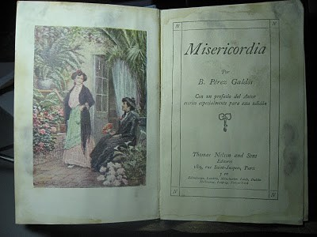
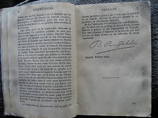

[<u>  
</u>](http://4.bp.blogspot.com/-LqknDgFOI38/Tne21QMd3II/AAAAAAAAAzM/bESJuR2FsOA/s1600/galdos%2B1.jpg)

Revolviendo por el viejo baúl, en el que guardo libros que siempre vi por la casa de mis padres, He encontrado dos pequeños volúmenes con tapas de tela color azul muy estropeados por la humedad, de 11x16 cm. Uno de ellos me ha llamado la atención, se trata de Misericordia de Benito Pérez Caldos. El mismo, en su PREFACIO DEL AUTOR dice así:

Escribí Misericordia en la primavera de 1897, cuando terminó el litigio arbitral en que los Tribunales me reconocieron la propiedad íntegra de todas mis obras Anteriores a Misericordia, son mis Novelas Contemporáneas, desde Doña Perfecta hasta Nazarín, y las dos primeras series de Episodios Nacionales; Posteriormente las novelas del Abuelo Casandra y El Caballero Encantado, más la tercera cuarta y quinta serie de Episodios, esta  no terminada todavía.

Explica los motivos que le llevaron ha escribir esta novela y comenta sobre los editores de este libro. Al final está su firma y la fecha: Madrid febrero 1913.

Me ha llamado la atención, pues no tenía noticias de estos problemas. He buscado en su biografía, alguna referencia a este tema y no explicas muy bien los motivos. Esta novela la leí en mi época de estudiante, ahora la he vuelto a leer. Está centrada en la realidad social, son esenciales las descripciones de los personajes, su ambiente es realista y con un fin didáctico muy de aquella época

No se, como no he visto antes estos libros, hay algunos  mas, bastante interesantes. El próximo verano en el pueblo los volveré a leer. 

