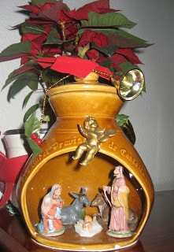
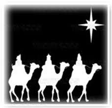
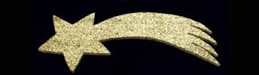

[<u>  

</u>](http://3.bp.blogspot.com/-DyklDuv8Kb4/TwH5K_Q7NvI/AAAAAAAAA1s/z3tpOunchgc/s1600/005.JPG)

Aquestos dies, durant les festes Nadalenques, cada vegada més sovint, hi han concerts de Nadal per  diferents corals,  a molt llocs de la ciutat. També es representa els últims  dies abans de Nadal, al Teatre Principal, l’obra de Matilde Salvador anomenada, El Betlen de La Piga, composta en 1979.

No em pareix que s’acosta Nadal, fins que es veuen els preparatius per ha representar aquesta obra, que te el seu sentit i nom al forn de Quiqueta la Pigà, molt comboiant   l’ama del forn, on se celebra el betlen,  on hi ha pa tots, carabassa torrà

Josep  i Maria, busquen allotjament a  Castelló i terme, pasant per la Torreta Alonso i  pel desert,  arriben  al forn del Pla,on son ben rebuts. Els Reis Mags, al final,troben  el camí, seguin  l’estrella que segur aura tingut faena, pera  guiar-los  entre  terra de secà, tarongers , marjals...  i apleguen  el forn  del Pla. Amb la gentada que hi ha! Tombatosals i la suea congolla ,el rei Barbur i  els veïns del carrer  San Nicolau, el cacauer, pastorets, dolçainers i tabalades  i moltes  persones més. Totes adorant a Jesuset.

Ames de ser un acte social  pa molta gent, per altres, és el esperit de Nadal que s’acosta, La representació es molt nombrosa pel que fa als participants, 150 actors, amb tota mena de  situacions costumbristes que ens fan somriure, pel seu vocabulari, aleshores en desús, i no cal dir la quantitat de nadales precioses que canten, així com les danses que ens ofereixen els diferents grups.

Aleshores ja estem en l’Any Nou. Els meus nets menuts, mirant l’estrella,( mes bé una cometa) que tinc penjada  a la vidriera del menjador a ma casa, que dona al carrer i ha la fosca s’encén,   que amés, es veu per tot el barri, m’han preguntat; segur que els Reis Mags sabran que  han de deixar ací els nostres joguets? jo els ha dit- Els Reis Mags son molt sabuts, si han trobat a Jesuset al forn del carrer San Felix , també vora’n  l’estrella de  casa  l’abuela, i com vos porteu molt be,  us deixaran ací, el  vostres regals. I així serà.
