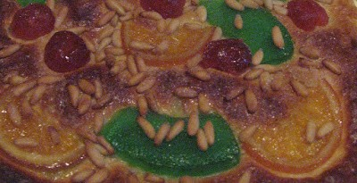

Aquest any,la nit de Sant Joan ha segut diferent, res que veure, quan pel anys 60 se celebrava al nostre barri a Castelló. Tots el xiquets i jovents del carrer, uns dies abans, recollíem per les cases dels veïns, trastos vells en els que podien engrandir la foguera que fèiem Al Pla,el lloc que era punt de reunió de tots, no recordo quan es va acabar el costum, pot ser al pavimentar els carrers i fer-nos majors.

Aleshore,s es fa la festa de diferents maneres ,la més nombrosa es a les platges del litoral. Des de la platja d’el Voramar a Benicassim, fins la platja del Pinar a Castelló, aquesta nit, estan plenes de gom a gom, colles d’amics, famílies senceres, d’una manera o de un altra ho celebren sopant al voltant de les fogueres que es fan vora la mar.

Desprès a les dotze es té que prendre el bany i trencar les onades diuen que dona bona sort, hi ha persones que segueixen tot el ritual.

Als pobles del interior fa uns anys,com que no hi havia mar, es deia, que les xiques tenien que llevar-se la cara abans de sortir el sol, amb l’aigua correnta de les fons. Segons en quina part del poble es vivia se’n anàvem a fer el ritual o bé, a la font d’en Prat, a La Fontanassa o Al bassi, es beu que no hi havia diferencia d’eon sigues l’aigua.

Amb els anys,moltes vegades no ha recordat esta data,o be no a fet cas d’aquesta celebració tant antiga. Aquest any, estava al poble, i uns amics m’han convidat a sopar dient-me, celebrarem junts la nit de Sant Joan. Sempre es un plaer la companyia de les persones que estimes, he gaudit de les delícies culinàries dels amfitrions, i la meua sorpresa a sigut Jaume,ell ha elaborat, una boníssima coca de Sant Joan, farcida de confitura de carabassa i de fruites confitades,a mes de un bon grapat de pinyons, i com requeria el cas, remullada amb una copeta de cava.

Diuen, que el fo purifica tot i que de les cendres torna a sortir la bona sort. No mai n’ha fet cas de aquestes coses, els costums estan pa gaudir-ne d’elles si dona el cas, el que està clar, és, que la propera nit de Sant Joan, d’una manera o altra intentaré fer, una coca de Sant Joan ,com la d’aquest any, crec que aquesta, si és bona costum.
