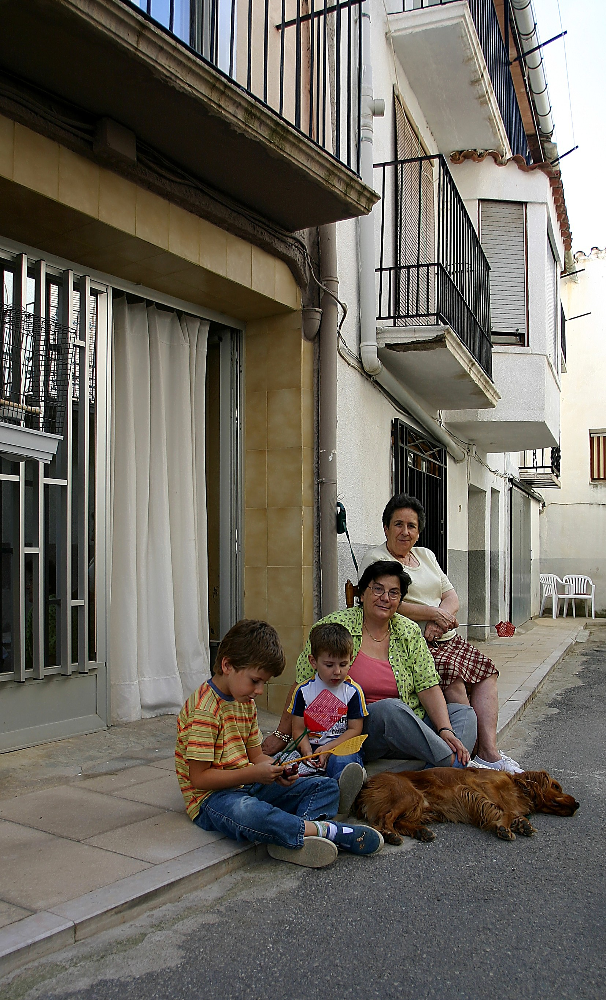
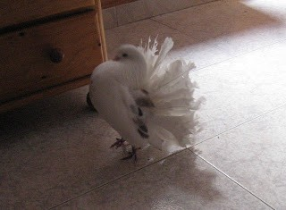

NO ÉS EL QUE ERA

La casa de Joanet de la Fura, que està davant de la nostra, fins que no arriba quasi meitat d’agost no es veu a ningú, està tancada, aleshores ve l’avi  amb algun fill,  desprès, tot son visites que jo no conec, fins quan venen els néts i besnéts a visitar-lo i s’escolta soroll de xiquets i grans.

  No es veu gent  al carrer com abans, quan fent rogle amb una taula, els veïns,  totes les vesprades   jugaven a les cartes, i jo, estava  assegut al costat de Mercé amb la corretja dins de la pota de la cadira, així no me'n anava darrere  de la meua  ama Paquita, i les seues amigues.

Aquest any, no he vist a Xarli el gosset de la Rosa, diu, que està al paradís dels animalets, el que aleshores ve, també li diuen Xarli i  no té res que veure amb el meu amic de sempre. Aquest, és un cadell  dos vegades més gran,  amb una orella més baixa  que l’altra i sols li agrada  jugar,   li faltava aixó   a Yako l’altre gos de  la família!!!. Abans, quan anava de passeig  amb el primer Xarli pareixia un sinyoret, tot el pel blanc com un corderet i es comportava,  aleshores està  fent les mateixes tonteries que el nou Xarli , si no fos, perquè la meu ama Paquita em diu cuidadet  de fer patir  als veïns !!!els donaría un bon ensurt,  no fan més que estossinar-me, jo vull estar  a la meua porta mirant a les gossetes   que passen  per la Placeta del Cap de Vila.

A més, passa  un altra cosa: al galliner de les eres, on hi havia cinc  gallines ponedores i un gall roigs  molt escandalós, que jo anava a veure’ls  tots els dies i els lladrava,  sols hi ha dos polletes avorrides que no diuen ni *“mu”* quan vaig  a veure què fan!!!.

  Espero, que això que vaig a dir no sigui, una  moda nova y li agrade  a la meua ama: La Rosa, també té passejant per tota casa, una  coloma amb la cua oberta estarrufà  com un paó.

  Es clar que el carreró de La Placeta, no és el que era.

Listo
