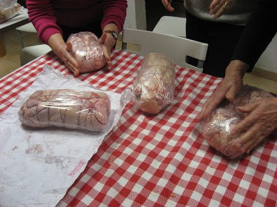
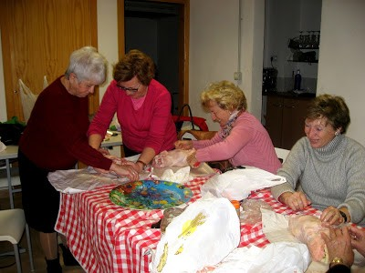

Quan varem xalar

Entre les millors  coses de tindre un bon grup d’amigues és compartir. Sempre  alguna de nosaltres,  sap de qualsevol tema que les  altres  no coneixem.

Una de les preguntes habituals quan s’acosten les festes de Nadal és: Que feu per a  menjar estos dies de festes?

Cadascuna  de nosaltres té les seues costums, moltes vegades diferents i altres paregudes o iguals.

Aquesta vegada, jo vaig comentar  que sempre feia per a  sopar la nit de Maitines, un pollastre  desossat i farcit.

Com que per a  fer festa, no fa falta més què ganes, vàrem decidir que totes el faríem amb la meua ajuda. Pensat i fet: per la vesprada carregades amb l’animalet recent comprat i amb el farciment  preparat, varem començar la classe de desossar el pollastre de cada una de nosaltres.

Aprendre  a llevar els ossos al pollastre, no ho va  fer ninguna, de fet, ni ho van intentar, però enrotllar-lo,   cadascuna va fer el seu. Va ser una aventura del  més divertida, el formatge i el pernil dolç quan enrotllaven el fil,   fugia per tot arreu, Alicia tambè  volia ficar fruits confitats, albercocs, prunes i panses, vàrem fer i desfer el rotllo no se quantes vegades, però a la fi és va aconseguir, i molt satisfetes desprès de  bromes i soroll,  teniem que  berenar,( doncs la faena va ser complicada).

|  |
|:--:|
| Podem dir que aquestes festes a les nostres cases hem menjat ROTLLO DE POLLASTRE FARSIT AMB PERNIL I FORMATGE, fet per nosaltres.     |

