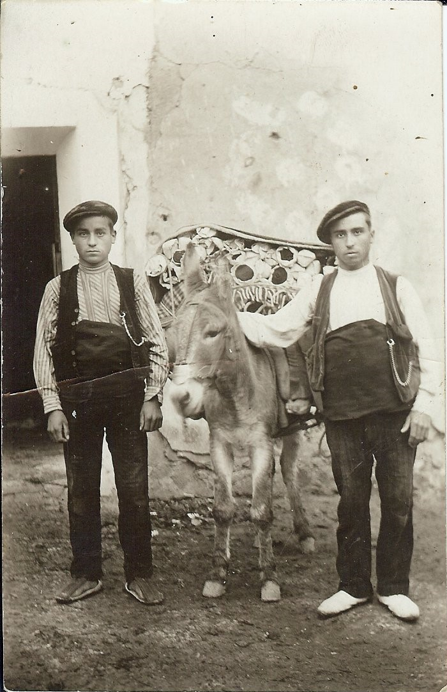

FAIXEROS

En muchas familias de Cinctorres tienen fotografías parecidas a esta.

Su época sobre 1913. Son dos hermanos Martin y Antonio Martí Querol, el menor tiene 15 años es tío mío, recorrían con el mulo parte de Aragón y la Rioja, repostando el género fajas y alforjas en posadas de su recorrido que antes habían mandado por correo.

La faja que llevan, se ve muy voluminosa pues era el lugar donde se guardaba, la petaca, servía de caja fuerte, de abrigo y de todo lo que necesitaba.

Paquita
