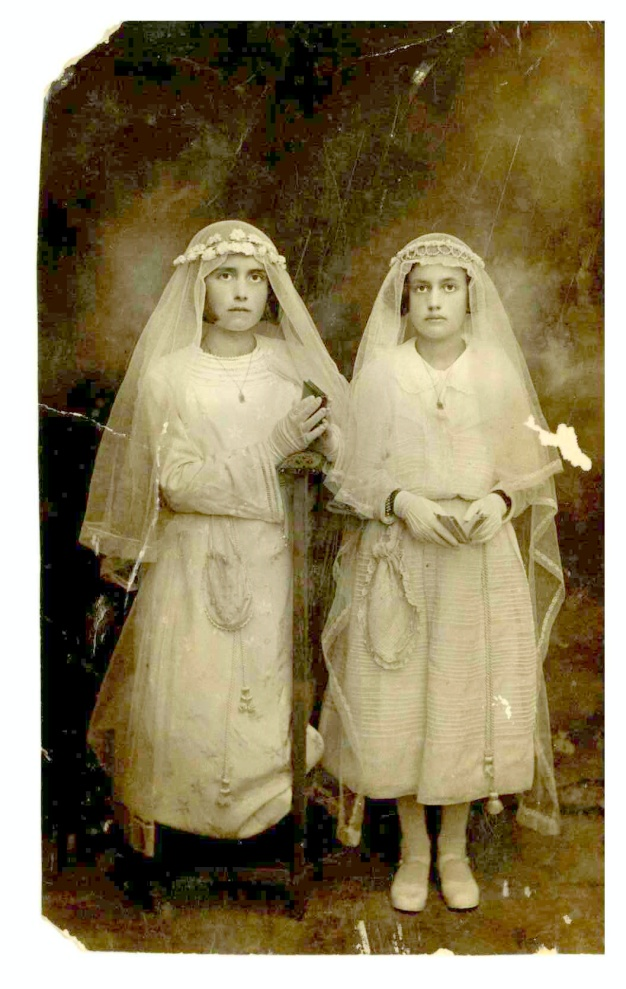

PRIMERA COMUNIÓN

La fotografía lleva una dedicatoria de las hermanas Pilar y María Celma a mi abuelo materno Francisco Querol Antolí en su Primera Comunión, fecha 191…

Son sus sobrinas, hijas de una de sus hermanas que vivían en la Fresneda provincia de Teruel.

Paquita.
