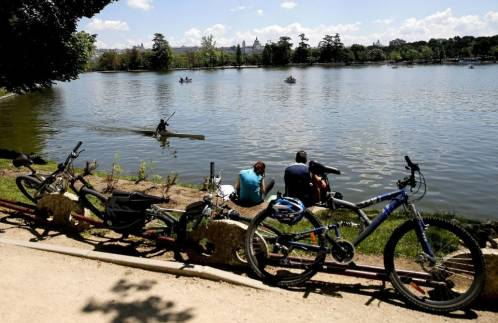

La gota de sangre (**Adonis annua**), también llamada ojo de perdiz, es una planta anual herbácea de la familia de las ranunculáceas, utilizada en jardinería por .

Prunus dulcis, el almendro, es un árbol caducifolio de la familia de las rosáceas. Esta especie pertenece al subgénero 

El ajo campestre (**Allium oleraceum**) es inconfundible por su inflorescencia que nace protegida por un par de largas brácteas, de consistencia papirácea, que la ...

El ajo pardo (**Allium scorodoprasum** ssp.rotundum \[= A.rotundum\]) es un ajo silvestre

 **Anchusa azurea**. - Nombre común o vulgar: Ancusa, Chupamieles, Lengua de buey, Argámula. - Familia: Boraginaceae. - Altura: 0 ..caracterizado por sus flores purpúreas y las hojas en forma de cinta plana, ..

***Androsace*** es un [género](http://en.wikipedia.org/wiki/Genus) en la [familia ](http://en.wikipedia.org/wiki/Family_(biology))[Primulaceae](http://en.wikipedia.org/wiki/Primulaceae) , sólo superada por [*Primula*](http://en.wikipedia.org/wiki/Primula) en número de especies. Herbácea

La hierba de la araña o falangera (**Anthericum liliago**) es una herbácea de la antigua familia de las agaváceas ahora subfamilia Agavoideae

**Aquilegia vulgaris**, la aguileña común, es una especie del género Aquilegia perteneciente a la familia de las ranunculáceas

**Aristolochia pistolochia** es una especie de planta herbácea perteneciente a la familia Aristolochiaceae. Detalle de la flor. **Aristolochia pistolochia** ...

Los asfódelos (también asfodelos) o gamones (**Asphodelus** Alvus.) constituyen un género de plantas vivaces herbáceas, bienales o perennes, oriundas del sur y .varas de SaHace 8 horas**larazón.es. ** Madrid.

La primavera llega mañana a las 23:45 horas

Efe

El invierno se termina este viernes, 20 de marzo, con un eclipse de Sol que dará la bienvenida a la primavera. La nueva estación comenzará oficialmente a las 23.45 horas y terminará 92 días y 18 horas después, el 21 de junio, con la llegada del verano, según cálculos del Observatorio Astronómico Nacional del Ministerio de Fomento.

Nueve días después, el 29 de marzo, tendrá lugar el cambio de hora. A las 2 de la madrugada, hora peninsular, habrá que adelantar el reloj hasta las 3 (la 1 de la madrugada en Canarias pasará a ser las 2), con lo que este día tendrá, oficialmente, una hora menos.

Del mismo modo, según ha destacado el Instituto Geográfico Nacional, esta primavera se producirá un eclipse total de Luna (el 4 de abril) que no se podrá observar desde España, pero sí en Asia, Australia, océano Pacífico y América.

Además, Saturno pasará de ser visible al amanecer al principio de la primavera, a verse durante toda la noche y terminará la estación siendo sólo visible al anochecer, la inclinación de sus anillos será bastante favorable para su observación y el día 23 de mayo se producirá su máximo acercamiento anual a la Tierra. Por otro lado Venus, Júpiter y, hasta finales de abril, Marte serán visibles al atardecer.

El Instituto Geográfico Nacional explica que, según convenio, el inicio de las estaciones, por convenio, se produce en aquellos instantes en que la Tierra se encuentra en determinadas posiciones de su órbita alrededor del Sol.

En el caso de la primavera, esta posición es aquella en que el centro del Sol, visto desde la Tierra, cruza el ecuador celeste en su movimiento aparente hacia el norte. Cuando esto sucede, la duración del día y la noche prácticamente coinciden, y por eso, a esta circunstancia se la llama también equinoccio de primavera. En este instante en el hemisferio sur se inicia el otoño.

De este modo, el equinoccio de primavera puede darse, a lo sumo, en tres fechas distintas a lo largo del siglo XXI, pudiendo iniciarse en los días 19 al 21 de marzo (fecha oficial española), siendo su inicio más tempranero el del año 2096 y el inicio más tardío el de 2003.

Las variaciones de un año a otro se deben a la forma en que encaja la secuencia de años según el calendario (unos bisiestos, otros no) con la duración de cada órbita de la Tierra alrededor del Sol (duración conocida como año trópico).

## DIAS MAS LARGOS

La primavera es la época del año en que la longitud del día se alarga más rápidamente. A latitudes de la Península, el Sol sale por las mañanas antes que el día anterior y se pone después por la tarde. Como consecuencia, al inicio de la primavera el tiempo en que el Sol está por encima del horizonte aumenta casi tres minutos cada día a la latitud de la península.

En cuanto a la actividad del Sol, en su superficie hay manchas, fulguraciones y protuberancias y en la Tierra se aprecia en alteraciones en la propagación de las ondas de radio y en una mayor presencia de auroras polares. Esta actividad sigue un periodo de aproximadamente 11 años, y está asociada al ciclo magnético del Sol.

La etapa actual es el ciclo solar número 24, que comenzó en diciembre de 2008 y llegó a su máximo en abril de 2014. Según las estimaciones realizadas por NOAA y Space Weather Prediction Center, durante la primavera el número de manchas solares decrecerá alcanzando valores entre 53 y 79.

La primera luna llena de la primavera se dará el 4 de abril, siendo el domingo siguiente (5 de abril) el Domingo de Pascua. En esta primavera se darán otras dos lunas llenas: 4 de mayo y 2 de junio.

En esta estación, sin necesidad de telescopio, se pueden observar las lluvias de meteoros que se producen ocasionalmente. La lluvia más importante de la primavera suele ser la de las Eta Acuáridas, cuyo máximo se da alrededor del 5 de mayo.

## OBSERVACIONES

Leer más:  [La primavera llega mañana a las 23:45 horas](http://www.larazon.es/sociedad/la-primavera-llega-manana-a-las-2345-horas-AB9232882#Ttt1tAVHPf2V4Edp)  <http://www.larazon.es/sociedad/la-primavera-llega-manana-a-las-2345-horas-AB9232882#Ttt1tAVHPf2V4Edp>  
Convierte a tus clientes en tus mejores vendedores: [http://www.referion.com](http://www.referion.com/)  
n Jose

a **primavera** es una de las **estaciones** del año, la que le sigue al **invierno** y antecede al [**verano**](http://definicion.de/verano/). El origen etimológico del término se refiere al **“primer verdor”**, en referencia a que, en la época primaveral, las plantas reverdecen.  
  
L*nombre femenino*

1.  **1**.

Estación del año comprendida entre el invierno y el verano; en el hemisferio norte, se sitúa aproximadamente entre el 21 de marzo, equinoccio de primavera, y el 21 de junio, solsticio de verano, y en el hemisferio sur entre el 21 de septiembre y el 21 de diciembre.

"al comienzo de la primavera despiertan las plantas y comienza su actividad, iniciándose un período de crecimiento y floración"

ee todo en: [Definición de primavera - Qué es, Significado y Concepto](http://definicion.de/primavera/#ixzz3UqsllFA2) <http://definicion.de/primavera/#ixzz3UqsllFA2>

La primavera es una de las cuatro estaciones del año y la única con nombre femenino, significa´´ primer verdor ´´.

Este año el invierno ha terminado el día 20 de Marzo a las 23,45 con un eclipse de sol que en esta zona no hemos visto debido a la nubosidad durante todo el dia. Con el equinoccio de primavera hasta el 21 de junio el día se alarga casi 3 minutos en la península, y despiertan las plantas que han estado hibernando, inician un periodo de crecimiento y floración, comienza su actividad.

El verde del conjunto que forman árboles, arbustos y todo tipo de vegetación es luminoso, limpio. A las plantas bulbosas, les brotan las hojas y tallos que han perdido en invierno. Sus bulbos, son órganos que están bajo tierra donde acumulan reservas nutritivas con las que alimentan la nueva planta.

En los arboles caducos brotan otra vez sus hojas, producen sombra y retienen la humedad. Caminando por el campo se aprecia que la tierra esta exuberante, cada pocos días cambia el colorido, no sé por qué en las flores dominan los colores azulados y amarillos y los campos con almendros en flor, son una extensa alfombra de color blanco o rosa pálido según su fruto sea Marcona o Mollar, y en los ribazos y tierra de labranza el rojo intenso de las amapolas parecen gotas de sangre que dan vida entre el verde de la vegetación. Es un espectáculo que cambia día a día.

El invierno se termina este viernes, 20 de marzo, con un eclipse de Sol que dará la bienvenida a la primavera. La nueva estación comenzará oficialmente a las 23.45 horas y terminará 92 días y 18 horas después, el 21 de junio, con la llegada del verano, según cálculos del Observatorio Astronómico Nacional del Ministerio de Fomento.
