[**SoLiCom DokuWiki**](https://roure.act.uji.es/wiki/)

- Estámanda numero movil ablamos fpl50@hotmail.com skype paco-60-y [Denunciar](http://www.tagged.com/messages_center.html?uid=5978922297)

- Recordando la conferencia que di ayer er www.paquita&tadeolulianblogspot .com

- 

Hola

El izado de esta corona, que realmente solo es la maqueta a tamaño natural del proyecto, tuvo muchos problemas para el artista.  
A pesar de estar realizada en cartón, madera, corcho, cordeles... el peso desafiaba la ley de la gravedad.  
Así se lo demostró en tres ocasiones al romperse como si se tratara de un hilo, cuando en realidad eran dos gruesas cuerdas y un cable de acero.  
  
Era la noche del 7 de diciembre de 1912 y debía estar dispuesto para el día siguiente, fiesta de la Inmaculada.  
Desolado y sin palabras, Gaudí se fue a dormir.

Hola amics,aquest cap de setmana Tadeo i jo em estat a Cinctorres, doncs al Pilar, el proper dimecres em vaig de viatge amb les amigues,i com que Mercedes deia que hi havien robellons varem anar.

Pot ser que encara en trobareu s’han fet moltíssim.

No se quan tornarem a anar al poble ho farem saber . Tadeo ja te preparat el programa de fotos del que van parlar. Una forta abraçada i gracies per la foto del dinar del jubilats.

Viodibersidad  
Las paredes secas son paredes de vida, que ayudan a superar el estigma de que todo aquello que flota como elemento antrópico en el paisaje, actúa en detrimento de la "naturalidad" del lugar. 

Y fue su ayudante, Juan Rubió, quien volvió a intentarlo a requerimiento de Martín Llobera, mayordomo de Palacio.  
Pero de nuevo los cables se rompieron, "dejémoslo", dijeron quienes estaban allí, solo el maestro Miguel Sans siguió intentándolo y dijo saber donde y quien les prestaría un cable lo suficientemente grueso para aguantar.  
  
Y así fue como el baldaquino subió a las alturas y allí sigue.  
  
Rubió no asistió a la presentación en sociedad, pero si se paseó nervioso, junto con Sans, por encima de la muralla frente al Mirador, rogando para que no sucediese una desgracia.  
  
El baldaquino consta de tres partes; un repostero de brocado antiguo, la corona de forma octogonal adornada con espigas, pámpanos, racimos y un calvario con un crucifijo procedente del retablo barroco y el lampadario con 35 lámparas.  
  
La muerte del Obispo Campins y la rescisión del contrato a Gaudí han prolongado su provisionalidad.

En el año 2005 hubo en la comarca des Pots varias exposiciones por la Fundacion La luz de las Imágenes con el nombre de Paisajes Sagrados con este motivo se restauraron las ermitas de San Pere de Castellfort, La Màre de Deu de la Font ,San Pau de Albocaser ,La iglesia de Sant Mateu ,de Peñiscola, invertebrados márgenes.

San Pere de Castellfort por dentro no lo havia visto nunca ,siempre esta cerrada, tiene el piso todo empedrado de forma artesanal y una portada románica que no se ve, pues esta pegada a l edificio del ermitaño poca gente sabe de su existencia.

En la Mare de Deu de la Font restauraron sus pinturas y había una exposición muy detallada dels Peregrins de Cati, .

San Pau de Albocacer los frescos de las pareces y bóvedas restaurados son preciosos .

En la iglesia arciprestal de San Mateo además de ver sus pinturas, recuerdo sobre los comentarios de historia de la abdicación de Clemente VIII en este lugar en Agosto de 1429, pero lo había olvidado

En Peniscola estaban expuestas varias piezas de orfebrería de Cinctorres. Muy importante es una cruz procesional que tenemos con el punzón de los orfebres Santa línea de Morella pues hay muy pocos piezas con su marca o punzón. El retablo de Sant Pere que esta en el ayuntamiento y que dicen es el rostro del Papa Luna y también el cuadro grande que había en el altar de la iglesia, al restaurarlo vieron que tenía menos calidad de la que creían ahora lo tenemos al lado de la capella de la Mare de Deu de Gracia.

Creo que a finales de este año 2013 se retoman las exposiciones La Luz de Las Imágenes en Vinaroz, Benicarlo, Culla y Cati, es una manera de restaurar y asi poder disfrutar de nuestro rico patrimonio que en la Comarca dels Port estaba muy olvidado.

Tu comentario me ha hecho pensar y como soy la más longeva de la familia, no tengo referencia del tiempo que me pueda quedar. Así, que todo el verano lo voy a pasar haciendo fotos de todo lo que me llama la atención y charlar que es muy gratificante y mas con los amigos de la infancia que es una cura de humildad cuando aprecias las calvas y arrugas etc y piensas ¿cómo me verán a mi?Saludos.

Vinaroz benicarlo Culla y Cati

Su abdicación la llevo a cabo en la iglesia de Sant Mateo (Castellón) en Agosto de 1429

ESCRITO POR A LAS [2](http://noloseytu.blogspot.com.es/2008/05/solo-el-cielo-lo-sabe.html)

s aquí: [start](https://roure.act.uji.es/wiki/start) » [public](https://roure.act.uji.es/wiki/public/start) » [docencia](https://roure.act.uji.es/wiki/public/docencia/start) » [univmajorsculturalibre](https://roure.act.uji.es/wiki/public/docencia/univmajorsculturalibre/start) » [tema4](https://roure.act.uji.es/wiki/public/docencia/univmajorsculturalibre/tema4)

[Ver fuente](https://roure.act.uji.es/wiki/public/docencia/univmajorsculturalibre/tema4?do=edit&rev=)[Revisiones antiguas](https://roure.act.uji.es/wiki/public/docencia/univmajorsculturalibre/tema4?do=revisions)

[Cambios recientes](https://roure.act.uji.es/wiki/public/docencia/univmajorsculturalibre/tema4?do=recent)[Índice](https://roure.act.uji.es/wiki/public/docencia/univmajorsculturalibre/tema4?do=index)[Conectarse](https://roure.act.uji.es/wiki/public/docencia/univmajorsculturalibre/tema4?do=login&sectok=9006fc7fd23d66107b70e53bb11f6532)

**Tabla de Contenidos**

- [Casos prácticos. Software libre](https://roure.act.uji.es/wiki/public/docencia/univmajorsculturalibre/tema4#casos_practicos_software_libre)

  - [Sistema Operativo.](https://roure.act.uji.es/wiki/public/docencia/univmajorsculturalibre/tema4#sistema_operativo)

    - [Distribuciones GNU/Linux](https://roure.act.uji.es/wiki/public/docencia/univmajorsculturalibre/tema4#distribuciones_gnulinux)

    - [OpenBSD](https://roure.act.uji.es/wiki/public/docencia/univmajorsculturalibre/tema4#openbsd)

    - [Android](https://roure.act.uji.es/wiki/public/docencia/univmajorsculturalibre/tema4#android)

  - [Otros ejemplos](https://roure.act.uji.es/wiki/public/docencia/univmajorsculturalibre/tema4#otros_ejemplos)

    - [LibreOffice](https://roure.act.uji.es/wiki/public/docencia/univmajorsculturalibre/tema4#libreoffice)

    - [Gimp](https://roure.act.uji.es/wiki/public/docencia/univmajorsculturalibre/tema4#gimp)

    - [Rosegarden](https://roure.act.uji.es/wiki/public/docencia/univmajorsculturalibre/tema4#rosegarden)

# Casos prácticos. Software libre

En este tema simplemente vamos a presentar algunos programas libres para recapacitar sobre si realmente dependemos del software propietario o podríamos vivir en el conocimiento abierto. Es cierto que en algunos casos no hay programas alternativos libres de suficiente calidad para sustituir a los propietarios. Pero en esos casos se debería financiar las mejoras necesarias por parte de los usuarios. Habríamos ganado la libertad sobre la herramienta y además podríamos generar empleo local.

Muchos de estos programas no se usan de forma masiva porque no están apoyados por campañas de mercadotecnia ni por las instituciones públicas o bien porque sus interfaces de usuario no están tan esmeradas o encaminadas al público como los equivalentes propietarios (por ejemplo a nivel de diseño).

Por otro lado están de moda las aplicaciones que de forma repipi llaman *en la nube*. Se trata de aplicaciones **web** o disponibles **en la red** o **en línea**. El ejemplo por excelencia son las herramientas de la empresa Google. De éstas, la mayor parte pertenece a empresas y el código suele ser cerrado. Aquí tenemos dos problemas: el código que ejecutamos y la dependencia que creamos con esa empresa, a que tienen **nuestra información**.

Instituciones como la UJI está migrando su sistema de información hacia empresas y servidores externos.

También hay iniciativas de asociaciones o fundaciones que ofrecen servicios en línea.

Ejercicio. Buscar información sobre condiciones de uso de UbuntuOne y sobre Wordpress.

## Sistema Operativo.

El sistema operativo es lo que hace funcionar el ordenador. Tiene un núcleo que controla y coordina y comunica las partes materiales del ordenador para que se puedan ejecutar simultáneamente varios programas que realizan diferentes tareas.

### Distribuciones GNU/Linux

Un distribución GNU/Linux es un sistema operativo con Núcleo Linux que funciona sobre un entorno de programas del proyecto GNU. GNU es un proyecto software promocionado por la **Free Software Foundation**. Las**distribuciones** son empaquetados de sistemas GNU/Linux en los que se selecciona ciertos programas y entornos de usuario. Suelen tener algunos programas propios, los cuales en algunos casos no son libres y suele ser opcional instalarlos. Las organizaciones que hacen estas distribuciones suelen tener mecanismos para actualizar el sistema y repositorios y un sistema de gestión de software para instalar nuevos programas o borrar programas que no usamos.

Puede haber distribuciones **especializadas** o de **uso general**. Por ejemplo, Ubuntu o Debian son distribuciones de uso general y OpenWRT es una distribución especializada para sistemas de comunicaciones como pequeños ordenadores-servidores de red o routers.

Algunas distribuciones GNU/Linux promocionadas por **comunidades autónomas**. Lástima que no se hayan unido:

<http://es.wikipedia.org/wiki/Distribuciones_GNU/Linux_espa%C3%B1olas>

Más información sobre distribuciones:

<http://es.wikipedia.org/wiki/Distribuci%C3%B3n_Linux>

**Posibilidades de instalación**:

1.  Como sistema único.

2.  Live CD, Live DVD o Live USB. La distribución se graba en estos soportes. Habilitamos el ordenador para que arranque del dispositivo que corresponda y podemos probar la distribución sin instalarla en el ordenador. Suele ir lenta porque la memoria desde que la usamos es más lenta que el disco duro. Luego suelen dar la posibilidad de instalar el sistema y normalmente respeta otros sistemas operativos que encuentre instalados.

3.  Con arranque dual. En este caso tenemos más de un sistema operativo instalado en el disco duro, y al arrancar podemos decir que cuál de ellos queremos iniciar el ordenador.

4.  Usar un sistema operativo **anfitrión** y otro en una **máquina virtual**. Tanto una como otra podrían ser una distribución GNU/Linux o las dos.

### OpenBSD

Este sistema es un derivado del sistema BSD (Berkeley Software Distribution), el cual es a su vez una versión o*implementación* del núcleo UNIX. El sistema operativo MacOS X de Appel también deriva de BSD.

### Android

Es el sistema operativo de Google en principio para *smart phones* y *tablillas*. Existen dudas sobre su completa libertad. Parece que hay partes no publicadas y aplicaciones de Google muy comunes en Android no son libres. Este sistema también deriva del núcleo o *kernel* Linux.

## Otros ejemplos

En este apartado simplemente mostramos algunos ejemplos de aplicaciones libres de gran uso.

### LibreOffice

Conjunto de programas alternativo a Office de Microsoft. Muy usado el procesador de textos, la hoja de cálculo y el programa para hacer presentaciones. También dispone de un programa para crear o modificar imágenes y un gestor de bases de datos.El formato de los ficheros que genera de forma nativa es abierto y estándar, lo que permite que sus ficheros puedan ser interpretados y manipulados por otras aplicaciones.

Disponible para GNU/Linux, Windows y MacOS X.

LibreOffice lo mantiene la fundación *The Document Foundation*. Es una bifurcación del OpenOffice.org (promocinado por Sun Microsystems) que a su vez es una bifurcación de Staroffice. La bifurcación se produjo cuando la empresa Oracle compró Sun Microsystems.

<http://www.libreoffice.org/>

### Gimp

Programa para manipulación de imágenes. Parte del proyecto GNU promocionado por la *Free Software Foundation*. Disponible para sistemas GNU/Linux y Windows.

<http://www.gimp.org.es/>

### Rosegarden

Programa para edición y composición de música. Promocionado por la Universidad de Bath, Reino Unido.

Disponible para sistemas GNU/Linux.

<http://www.rosegardenmusic.com/>

Principio del formulario

Final del formulario

public/docencia/univmajorsculturalibre/tema4.txt · Última modificación: 2012/11/04 20:09 por boronat

[Ver fuente](https://roure.act.uji.es/wiki/public/docencia/univmajorsculturalibre/tema4?do=edit&rev=)[Revisiones antiguas](https://roure.act.uji.es/wiki/public/docencia/univmajorsculturalibre/tema4?do=revisions)

[Ir hasta arriba](https://roure.act.uji.es/wiki/public/docencia/univmajorsculturalibre/tema4#dokuwiki__top)

      

Hola amiga mia gracias por contestar mi message.Eso da un gran placer leer tus palabras. Siento que tu das las energías positivas y sentimientos que tu pone en tu mensaje. Siento que las buenas vibraciones que provienen de su mensaje que me llena de felicidad y sonrisas y una paz interior y la paz.          Ti deseo un día lleno de coraje para luchar con la vida cotidiana y sin embargo mantener la paz en tu alma interior. Te deseo un día de felicidad y bendiciones. Espero que tu tenga un día que le ofrece comodidad y tu obtiene sucess en todo lo que haces.         Espero que nos mantengamos en contacto y espero volver a leer tu palabras muy pronto. Envío de ti todos los aspectos, y te guarde siempre en mis oraciones.

<table>
<colgroup>
<col style="width: 100%" />
</colgroup>
<thead>
<tr>
<th><table>
<colgroup>
<col style="width: 17%" />
<col style="width: 82%" />
</colgroup>
<thead>
<tr>
<th></th>
<th><table>
<colgroup>
<col style="width: 100%" />
</colgroup>
<thead>
<tr>
<th><a href="http://www.facebook.com/l/zAQFmpzMU/jorgealbuixech.blogspot.com/2012/10/my-new-housemate-pachamama.html"><strong>Leaving La Plana: My new housemate Pachamama</strong></a></th>
</tr>
</thead>
<tbody>
<tr>
<td><a href="http://www.facebook.com/l/zAQFmpzMU/jorgealbuixech.blogspot.com/2012/10/my-new-housemate-pachamama.html">jorgealbuixech.blogspot.com</a></td>
</tr>
<tr>
<td></td>
</tr>
</tbody>
</table></th>
</tr>
</thead>
<tbody>
</tbody>
</table></th>
</tr>
</thead>
<tbody>
</tbody>
</table>

de juny de 1966, va nàixer Juan,eEl primer fill meu, era com sempre havia imaginat que seria rubiet i amb els ull blaus com son pare. \#87 Motivos para que CATALUÑA PIDA PERDÓN AL RESTO DE ESPAÑA NO LE FALTAN; EN 1641 EL PRESIDENT DE LA GENERALITA, PAU CLARIS, DECLARÓ LA REPÚBLICA CATALANA DE MODO UNILATERAL. ANTE LA ENTRADA DE LAS TROPAS DE FELIPE V, UNA SEMANA DESPUÉS, PROCLAMÓ A LUIS XIII DE FRANCIA CONDE DE BARCELONA PONIENDO ASÍ EL PRINCIPADO BAJO SOBERANÍA FRANCESA. EN 1808 LAS TROPAS FRANCESAS INVADEN ESPAÑA RECIBIDOS COMO LIBERTADORES POR LA SOCIEDAD CATALANA QUE TERMINAN ANEXIONÁNDO CATALUÑA AL IMPERIO FRANCÉS. TRAS LA ABDICACIÓN DE FERNANDO VII INVADEN EL RESTO DE ESPAÑA Y RETORNA EL REY EN 1814 EXPULSANDO A LOS FRANCESES. EL RESULTADO FINAL FUE LA PÉRDIDA DE POSESIONES DEL NORTE DE CATALUÑA EN FAVOR DE FRANCIA EN 1873, DURANTE LA PRIMERA REPÚBLICA Y EN MEDIO DE UNA GRAVE CRISIS ECONÓMICA ESPAÑOLA, UNILATERALMENTE SE DECLARA EL ESTADO CATALÁN QUE FUE REVOCADO CON LA DISOLUCIÓN DEL EJÉRCITO DE CATALUÑA Y LA HUÍDA A FRANCIA DEL PRESIDENTE... PFFF, ¿SIGO?

**Newc Special envoy for Middle.East security focusing on Plestiman amb Israeli segundo issues retired Marine Gere El enviado especial de la seguridad newc Middle.East centrándose en cuestiones Plestiman amb israelíes Segundo retiró Marine Gere**

**photoshop cs4 portable windows 7**  
¿Quieres anular la suscripción a Tagged?

Además de marcar este mensaje como spam, puedes cancelar la suscripción haciendo clic en el enlace que proporciona el remitente, lo que abrirá una ventana nueva. [Más información](http://support.google.com/mail/bin/answer.py?hl=es&ctx=mail&answer=80405)  
  
[**http://www.tagged.com/no_more.html?unsem=paquitaj%40gmail.com**](http://www.tagged.com/no_more.html?unsem=paquitaj%40gmail.com)

**kalinero7gato, Alicia.** Hola Rosario te mande un mensaje ,y no me has  respondida, llame por teléfono a tu hija y como vi que no podía hablar le dije que cuando hablara contigo tu me contestaras. Ayer estuve en el apartamento ,y me dijeron que estaba en el medico con Fina que la cuida.  
La vecina de tu lado quiere que le arregle la mancha de agua que se ha hecho por una fuga de la bañera, y estoy teniendo problemas con ella porque no puedo hacer nada.  
Como comprenderás me siento engañada por ti, mi prima me ha dicho que así no puede continuar que ella también es mayor y tiene problemas, se, que  tu también los tienes, pero la dueña del piso es ella , y prefiere tenerlo cerrado que seguir con esta situación.  
Siento mucho lo que ocurre pues le tengo mucho afecto a tu hija y lo está pasando muy mal. Contéstame. Paquita.

Amparo, lo que tu cuentas más o menos es como todos hemos crecido, leerte es un buen ejercicio de memoria.

Las huchas que nos daban para recapta perretes eran de cerámica y daba gusto hacer sonar el tintineo de las monedas, aunque no se caía ninguna, ni por casualidad.

En Valencia ciudad se oye poco hablar en valenciài no así en los pueblos limítrofes,¿ como hablabais en vuestra infancia? hablaba

Hola Rosario, he intentado varias veces ponerme en contacto contigo por teléfono pero me dicen que no esta en activo.

Quiero recordarte que en septiembre se ha de arreglar la fuga de agua en casa de tu vecina y es necesario saber si aun filtra agua de vuestra bañera, es conveniente que la utilicéis para ver si la silicona que pusisteis ha funcionado.

Mi prima Mercedes me dice que no ha recibido ningún ingreso de alquiler, el último fue en Marzo, y está preocupada pues ve que cada vez aumenta la cantidad y a ella también le hace falta.

La próxima semana espero estar en Castellón, llámame, o ponte en contacto conmigo por hotmail y dime como se encuentra Jordana.

Un abrazo. Paquita.

atraya472yahoo.com **Por favor, no te disculpes, no hay nada que perdonar. Ahora se supone que al hacernos mayores tenemos tiempo libre, es al revés, no sé si a ti también te ocurre pero a mí siempre me falta tiempo para todo lo que quiero hacer.  
También me gustan las fiestas populares, son las mejores. Sant Jaume junto con Sant Cristofol es el patrón de Castellón, hoy domingo, se celebra la fiesta de Sant Jaume de Fradell, he ido muchas veces, se celebra en el ermitorio de este nombre con concurso de paellas y juegos populares en el término de la ciudad, rodeado de naranjos un lugar precioso. Este lugar, fue el primer asentamiento cristiano de la población que dio Jaume I a Castellón en 1233, no recuerdo la fecha exacta.  
Ahhhh y gracias por tus amables palabras sobre mis fotos. Un beset.  
  
P. D. Según que temas me siento mas cómoda escribiendo en mi lengua materna,**

                                        Las penas que mas me duelen son las penas  de mi alma,  
de dia me ahogan y de noche me abrasan  
                                         no me importa ser joven o viejo  
    me importa la vida que se me va escapando   
                                          Como el viento que estoy mirando y solo veo mi soledad:  
           
                                          Az un milagro señor, déjame navegar, déjame pescar

y la marcha de mi barco alegraras,  
                                          Pez verde pez dorado sige por el agua sige  
                                          Llora con el llanto mio :  
   
                                          Y tu mi niña durmiendo con los ojitos abiertos   
                                          Miras como va el agua corriendo ,por que polo se fue  
                                          Al norte o fue al sur Hay .Que no lo se :  
   
                                          El mar solo el mar dime amor por que me sacastes del mar  
                                           Y me trajistes a la ciudad dejame ser marinero dejame oler a mar  
                                           Quiero pirata ser antes que marinero ?que altos son los montes de   
                                            Mi pueblo pero no se ve la mar :  
   
                                            Le di mi sangre alos mares barcos navegen por el con las velas   
                                            hechas jirones en las tardes las vere::  
 

**y otro de la roca pardo yrambla celumbres en *valencià*, no lo tengas en cuenta, tu escribe como quieras. **

- Te fuiste.
  Ni tu nombre  puedo recordar,  
  ni aquel  brillante  color de  tus ojos.  
  Sólo que por las tardes leíamos a Neruda;  
  aún me llega el timbre de tu voz profunda,  
  y el alarido enternecedor de tu dicha, suelto,  
  huyendo  a  medianoche  por  la  playa.  
    

Te fuiste.
  Irremediablemente huiste de mi vida.  
  Fue el océano tu cómplice fortuito:  
  zarpaste al borde de un balandro cualquiera  
  una tarde cualquiera.  
  Yo me quedé sobre la playa dilatada,  
  salpicado de ocaso, solitario en la arena.  

Te fuiste.
  Nos habíamos amado con la furia de los 25 años.  
  Todo  fue  en la playa cerquita del  mar:  
  besos  de  amor llenos de sal y yodo,  
  mordiscos  de  medusa  enloquecida,  
  saltos  de  delfines  felices  en  celo,  
  abrazos hasta brotar la sangre marinera.  
    

Te fuiste.
  Como se fueron también la rada familiar,  
  las velas madrugadoras de los camaroneros,  
  el lecho duro de nuestros combates clandestinos.  
  Hasta  el  mar  cambió  de rostro  y de fragancia;  
  la  codicia   del   hombre   corrompió  las  aguas.  
  El aire mismo se llenó de venenos y de miasmas.  
    

Te fuiste.
  Como se van todas las cosas.  
  Y   yo   me   quedé  aqui solo,  
  con las uñas clavadas en la arena,  
  viendo como se alejaban las mareas.

-  

-   Manuel David.

[Timeslide](http://paquitajulian.blogspot.com.es/?view=timeslide)**http://francescdura.com/**

<table>
<colgroup>
<col style="width: 100%" />
</colgroup>
<thead>
<tr>

<th>
                 Las complicaciones de la vida. 

                                        

el pasado no fue bueno, y el futuro no sabemos;

No  codicies  lo  ajeno,  si es mejor lo tenemos.

Olvidemos  el   pasado,  disfrutemos  el  presente;

Si estas enamorado, ten valor y hazle frente. 

                            

  Yo amo  a  una  mujer, la quiero y la necesito;

Cuando  no  la   puedo  ver,  mi   corazón   debilito.

La veo dulce y hermosa, como la mejor del mundo;

No pienso en otra cosa, no la olvido ni un segundo.
</th>
</tr>
</thead>
<tbody>
</tbody>
</table>

- 

[CINE](http://paquitajulian.blogspot.com/2012/04/cine-oeste.html)

[Tus besos son mi mejor poesía

***                *** *** ****** ***
***Tengo  que  amarte  en  silencio...***](http://paquitajulian.blogspot.com/2012/04/cine-oeste.html)

[***entregarme a tu pasión por completo...***](http://paquitajulian.blogspot.com/2012/04/cine-oeste.html)

[***gritar  que  te  amo  en  un gran  gemido.. .***](http://paquitajulian.blogspot.com/2012/04/cine-oeste.html)

[***llorar en un suspiro... shhhh no hagas ruido...***](http://paquitajulian.blogspot.com/2012/04/cine-oeste.html)

[***deja te explico...me importa si la gente nos sigue,***](http://paquitajulian.blogspot.com/2012/04/cine-oeste.html)

[***me  importa  mucho esta  unión  sublime...***](http://paquitajulian.blogspot.com/2012/04/cine-oeste.html)

[***deseo meterme y quemarme en tu fuego...***](http://paquitajulian.blogspot.com/2012/04/cine-oeste.html)

[***y  aferrarme  con   fuerza   a   tu  pecho...***](http://paquitajulian.blogspot.com/2012/04/cine-oeste.html)

[***en el silencio, en la quietud de la noche***](http://paquitajulian.blogspot.com/2012/04/cine-oeste.html)

[***decirnos    cuánto    nos    queremos...***](http://paquitajulian.blogspot.com/2012/04/cine-oeste.html)

[***te amare  toda mi  vida en silencio...***](http://paquitajulian.blogspot.com/2012/04/cine-oeste.html)

[***estar junto a ti es  estar  en el cielo...***](http://paquitajulian.blogspot.com/2012/04/cine-oeste.html)

[***Te quiero mucho, Manuel David.***](http://paquitajulian.blogspot.com/2012/04/cine-oeste.html)

[OESTE](http://paquitajulian.blogspot.com/2012/04/cine-oeste.html)

Yo soy un hombre de pueblo, criado en la montaña;
Paisano de  mucho  vuelo,  emigrante  desde  España.  
Un  pastor  de  jovencito,  en   casa   de   labradores;  
Me llamaban con un grito, con la voz de los pastores.  
   

Mi padre era cantero, evanista de la piedra;
Mi abuelo un paraguero, y  afilador con la rueda.  
Dos hobres profesionales, que se vuscaban la vida;  

Prestigiosos y legales, con su familia atendida.
   

A mi me enseñaron su escuela, respetar y trabajar;
Con los mimos de mi abuela, que tierno era mi hogar.  
María Espasandín, abuela, madre y buena educadora;  

Trabajadora sin fin, nuestra  madre protectora.
   

No había lavadora, ni gas para la cocina;
Cocinera y limpiadora, e hilandera  en  lana  fina.  
Que  abuela  encantadora,  nos  ayudó  a  crecer;  

Nos cuidaba a toda hora, y nos daba de comer.
   
Hoy recordando aquel tiempo, de pobreza y de carencias;  
Orgullosos y muy  contento, disfruto  aquellas  herencias.  
Aun hoy lloro por mi abuela, despues de cincuenta años;  

Nos enseñó con su escuela, a respetar sin engaños.
   

Fué madre de nueve hijos, abuela de treinta nietos;
Sin   aplicarnos   castigos,  nos   hizo  casi  perfectos.  
Que en paz este mi abuela, y nuestros  antepasados;  

Hoy gracias a su escuela, somos viejos educados.

Manuel David.

### 

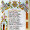

### [DE LA FESTA, LA VESPRA.](http://paquitajulian.blogspot.com/2012/03/de-la-festa-la-vespra_14.html)

1

### [EL SECRETO DE MEISSEN](http://paquitajulian.blogspot.com/2012/02/el-secreto-de-meissen.html)

### [NADAL I ANY NOU](http://paquitajulian.blogspot.com/2012/01/nadal-i-any-nou.html)

### [LA BELLEZA ¿ Objetiva o Subjetiva?](http://paquitajulian.blogspot.com/2011/12/la-belleza-objetiva-o-subjetiva.html)

### [DÉU DIRÀ](http://paquitajulian.blogspot.com/2011/11/quan-mes-menuda-es-l-nou-mes-soroll-mou.html)

### [LA BALMA](http://paquitajulian.blogspot.com/2011/10/la-balma.html)

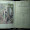

### [MISERICORDIA](http://paquitajulian.blogspot.com/2011/09/revolviendo-por-el-viejo-baul-en-el-que.html)

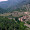

### [La Estrella](http://paquitajulian.blogspot.com/2011/09/anat-per-la-carretera-de-mosquerola.html)

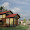

### [LA BIBLIOTECA DEL MAR](http://paquitajulian.blogspot.com/2011/08/la-biblioteca-del-mar.html)

### [NIT, DIFERENT](http://paquitajulian.blogspot.com/2011/07/nit-diferent.html)

1

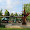

### [Dinar](http://paquitajulian.blogspot.com/2011/06/dinar.html)

1

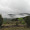

### [El corderet](http://paquitajulian.blogspot.com/2011/05/el-corderet.html)

### [ANEM A LA MADALENA](http://paquitajulian.blogspot.com/2011/04/tinc-ma-casa-un-canter-dadorn-ple-de.html)

1

### [HA COMPLIT CINQUANTA ANYS](http://paquitajulian.blogspot.com/2011/03/ha-complit-cinquanta-anys.html)

1

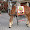

### [Sant Antoni del porquet](http://paquitajulian.blogspot.com/2011/02/sant-antoni-del-porquet.html)

### [Han vingut Els Reis](http://paquitajulian.blogspot.com/2011/01/han-vingut-els-reis.html)

1

### [LA HISTORIA AMB PEDRES DE RIU](http://paquitajulian.blogspot.com/2010/12/la-historia-amb-pedres-de-riu.html)

2

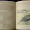

### [LA FELICIDAD DE VIVIR CON LA NATURALEZA](http://paquitajulian.blogspot.com/2010/11/la-felicidad-de-vivir-con-la-naturaleza.html)

### [JA ESTEM A CASA](http://paquitajulian.blogspot.com/2010/10/ja-estem-casa.html)

3

### [LA QUINTA DEL 66](http://paquitajulian.blogspot.com/2010/09/la-quinta-del-66.html)

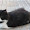

### [Estem de vacances.](http://paquitajulian.blogspot.com/2010/07/estem-de-vacances.html)

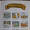

### [TOMBATOSALS](http://paquitajulian.blogspot.com/2010/06/tombatosals.html)

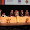

### [Cloenda curs UJI](http://paquitajulian.blogspot.com/2010/06/cloenda-curs-uji.html)

### [Tertúlia entre amics](http://paquitajulian.blogspot.com/2010/06/tertulia-entre-amics.html)

1

### [Presentació](http://paquitajulian.blogspot.com/2010/06/presentacio.html)

1

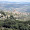

### [Esglesia de Sant Pere](http://paquitajulian.blogspot.com/2010/06/esglesia-de-sant-pere.html)

1

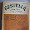

### [CASTELLÓ 1200-1900](http://paquitajulian.blogspot.com/2010/06/castello-1200-1900.html)

1

### [Llegaron las cerezas](http://paquitajulian.blogspot.com/2010/05/llegaron-las-cerezas.html)

3

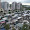

### [El mercat de Dilluns](http://paquitajulian.blogspot.com/2010/05/el-mercat-de-dilluns.html)

1

### [Aprender Nuevas Tecnologias](http://paquitajulian.blogspot.com/2010/05/aprender-nuevas-tecnologias.html)

### [Els cinc sentits](http://paquitajulian.blogspot.com/2010/05/blog-post_2488.html)

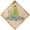

### [Casa Sanjoan i Sousa](http://paquitajulian.blogspot.com/2010/05/casa-sanjoan-i-sousa.html)

1

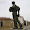

### [Faixero faixes!](http://paquitajulian.blogspot.com/2010/05/faixes.html) Els meus tresors

2

• **Luchar contra la erosión**

Con la construcción de ribazos se ejerce una lucha contra la erosión en un paisaje de grandes

pendientes, poca tierra y grandes tormentas.

• **Habitat y refugio de la flora y fauna**

Las construcciones de piedra en seco se convierten en un habitat, a veces indispensable, para

la flora y sobre todo para la fauna, así cierta vegetación es típica de los ribazos o tiene un

buen ecosistema, líquenes y musgos en zonas de umbría, morella, hiedra, uva de pastor.

Pero es la fauna la que tiene un refugio o acude para obtener el alimento mediante la caza o

el pasto. Ejemplos típicos que se refugian en estas piedras son los caracoles, caracolas,

*sargantanas*, *fardachos*, culebras, sapos, ratones, conejos, erizos.*Líquenes*

*9 de noviembre 20011.*

> 1
>
> *de nieve que filtra en la tierra y alimenta los auríferos,* [www.labutaca.net](http://www.labutaca.net/)

### **3. Estructura de una crítica.**

- La ficha técnica.

- Párrafo/s introductorio/s:

  - antecedentes.

  - filmografrías relacionadas (películas anteriores del director, de los actores).

  - comparaciones con otras películas.

  - comentario de la mercadotecnia de la película.

  - género.

  - contexto histórico, cinematográfico,....

<!-- -->

- Párrafos de análisis, mínimo de tres o cuatro. Aspectos que deben tenerse en cuenta:

  - El argumento (el guión)

  - Los personajes. La actuación.

  - Los efectos especiales.

  - La música

  - La ambientación: vestuario, decorados,...

  - La narración: ritmo, montaje,...

  - Las emociones.

  - Los temas.

- Párrafo de valoración. Después del análisis, ¿es, en definitiva, una buena o una mala película? En este momento es cuando tu capacidad de argumentación es fundamental: ¡razona tu opinión!

- Párrafo conclusivo.

### **4. Consejos útiles**

1.  **Busca un buen título para tu crítica, juega con las palabras para hacer atractivo.**

2.  **Una crítica es un texto periodístico formal. La expresión debe ser cuidada y rigurosa, el vocabulario entre estándar y culto de manera que evitaremos coloquialismos y vulgarismos, la expresión refinada y elegante. Si la crítica es negativa siempre optaremos por la ironía y el razonamiento punzante antes que por el desprecio y el insulto.**

3.  **Planea bien la introducción.**

    1.  **Narra una escena de la película, un incidente o un trocito de diálogo que atrape al lector y le incite a seguir leyendo.**

    2.  **Asocia la película a algún suceso actual importante.**

    3.  **Recuerda a los lectores los trabajos anteriores del director o los actores.**

4.  **Empieza con un resumen muy breve del argumento de la película. Sugiere cuál es tu opinión pero no la digas, guárdala para más adelante.**

5.  **No des detalles de posibles sorpresas ni, por supuesto, del final.**

6.  **Aunque sea una crítica negativa, no olvides mencionar los aspectos positivos que pueda tener.**

7.  **Justifica todas tus opiniones. Escoge bien los adjetivos que usas porque a menudo revelan lo que opinas antes de hora.**

8.  **Procura comentar, aunque sea brevemente, todos los aspectos del filme (recuerda el esquema de más arriba).**

9.  **Caracteriza bien a los personajes. Analiza si están bien interpretados, si son verosímiles, auténticos, o falsos y endebles, explico lo que te ha gustado de ellos y lo que no y por qué,...**

10. **Y, sobre todo, trata de disfrutar escribiendo tu crítica sin dejar de ser riguroso.**

###  

### **5. Vocabulario útil.**

** **

<table>
<colgroup>
<col style="width: 16%" />
<col style="width: 83%" />
</colgroup>
<thead>
<tr>
<th style="text-align: left;"> </th>
<th style="text-align: left;"><h1 id="vocabulario-útil">VOCABULARIO ÚTIL</h1></th>
</tr>
</thead>
<tbody>
<tr>
<td style="text-align: left;"><strong>Generales</strong></td>
<td style="text-align: left;">
inolvidable, imprescindible, maravillosa, entretenida, emocionante,

olvidable, prescindible, lamentable, soporífera, violenta, innecesaria, decepcionante, tópica, repetitiva, magistral, ....
</td>
</tr>
<tr>
<td style="text-align: left;"><strong>Argumento</strong></td>
<td style="text-align: left;">aburrido, complicado, interesante, original, absurdo, intrincado, rebuscado, realista, verosímil, inverosímil, hilarante, absorbente, estremecedor, escalofriante, confuso, tópico, reiterativo, provocador, desasosegante, inquietante, predecible, sorprendente,...</td>
</tr>
<tr>
<td style="text-align: left;"><strong>Dirección y montaje</strong></td>
<td style="text-align: left;">ritmo lento, vertiginoso, vigoroso, rápido, aburrido, confuso, atrevido, singular, novedoso, personal, efectista, pedante, banal, fragmentario, sorprendente, embrollado, torpe,</td>
</tr>
<tr>
<td style="text-align: left;"><strong>Personajes</strong></td>
<td style="text-align: left;">increíble, endeble, contradictorio, falso, arquetipos, auténticos, reales, creíbles, gran papel, pésimo papel, insustancial, carismático, personalidad, atractivo, indiferencia,</td>
</tr>
<tr>
<td style="text-align: left;"><strong>Actores, actuación</strong></td>
<td style="text-align: left;">natural, inexpresivo, impasible, apático, lamentable, fría, brillante, acertado, con profundidad psicológica, terrible, remarcable, inolvidable, exacta, convincente, creíble, honesta, sincera, sentida, emotiva, entereza, gravedad, excesos, matizadas, notables, gélidas, correcto,...</td>
</tr>
<tr>
<td style="text-align: left;"><strong>Efectos</strong></td>
<td style="text-align: left;">sencillo, chapucero, lamentable, irrisorio, ridículo, competentes, aceptables, sorprendente, espectacular, asombroso, sobrecogedor,...</td>
</tr>
<tr>
<td style="text-align: left;"><strong>Fotografía, decorado, luz, música, paisaje,...</strong></td>
<td style="text-align: left;">suntuoso, pobre, espectacular, evocador, bello, estimulante, emotivo, fascinante, exagerado, estimulantes,  claustrofóbico, luminoso, intrigante, rica en matices, efectista, ...</td>
</tr>
<tr>
<td style="text-align: left;"><strong>Diálogos</strong></td>
<td style="text-align: left;">ingenioso, chispeante, irónico, satírico, ágil, ácido, ocurrente, agudo,  malo, lleno de tópicos, típico, torpe, manido, carente de chispa, aburrido,...</td>
</tr>
</tbody>
</table>

 

<table>
<colgroup>
<col style="width: 11%" />
<col style="width: 43%" />
<col style="width: 44%" />
</colgroup>
<thead>
<tr>
<th style="text-align: left;">
<strong>Expre-</strong>

<strong>siones útiles para la conclu-</strong>

<strong>sión</strong>
</th>
<th style="text-align: left;">
POSITIVAS

<ul>
<li>
recomendable, prescindible, inolvidable... para cualquier amante del buen cine (cinéfilo),
</li>
<li>
la recomiendo fervorosamente
</li>
<li>
esta es una película que no deberían perderse
</li>
<li>
si tiene ocasión, no deje de verla
</li>
<li>
si hay una película debería ver este año, es ésta.
</li>
<li>
merece la pena acercarse al cine y verla
</li>
<li>
se ve con gusto y entretiene
</li>
</ul></th>
<th style="text-align: left;">
NEGATIVAS

<ul>
<li>
no vale/merece la pena
</li>
<li>
si hay algo que salvar, sería...
</li>
<li>
una película que deberían evitar
</li>
<li>
no malgasten su tiempo ni su dinero
</li>
<li>
lamentablemente, no cumple las expectativas
</li>
<li>
una película decepcionante,
</li>
<li>
una idea fallida,
</li>
<li>
un bodrio insoportable, un verdadero abuso,
</li>
<li>
película plana y aburrida que sólo provoca bostezos
</li>
</ul></th>
</tr>
</thead>
<tbody>
</tbody>
</table>

 

<table>
<colgroup>
<col style="width: 21%" />
<col style="width: 78%" />
</colgroup>
<thead>
<tr>
<th>
<strong>CONECTORES ÚTILES</strong>

 
</th>
<th style="text-align: left;">en primer lugar, merece la pena destacar, por otro lado, además, respecto a, por lo que respecta a, acerca de, lo más llamativo, lo mejor de, no se trata sólo de....sino también de, en conclusión, en definitiva, para finalizar, por último,....</th>
</tr>
</thead>
<tbody>
</tbody>
</table>

 

 

En La Tinença de Benifassà se encuentra el único monasterio de monjas cartujas de España con el nombre de Santa Maria de Benifassà. Se puede visitar los jueves a la una de la tarde. yo lo he hecho alguna vez. Una escena del documental de Philiip Groning en el que se ve a gente por los alrededores del monasterio curioseando, y los monjes esperando en el interior en silencio me ha recordado estas visitas. Solo se puede visitar la iglesia y el antiguo patio de la hostelería muy interesante no se ven los claustros ni sus moradoras, y , también transmite serenidad como muchos lugares de culto, pero si vuelvo a visitarlo des de luego ahora lo haré en silencio.

### Cómo borrarse de Facebook

05MAY**201022:09**

Tras los [últimos problemas de seguridad](http://www.elmundo.es/elmundo/2010/05/05/navegante/1273070407.html) en la Red social y dados los[polémicos cambios en la política de privacidad de la compañía](http://www.elmundo.es/elmundo/2010/05/03/navegante/1272871340.html), hay mucha gente que se pregunta cómo borrarse de [Facebook](http://www.facebook.com/). Y la realidad es que**eliminar por completo los datos del sitio es más complicado de lo que parece**, dado que hay que solicitarlo de forma expresa a la compañía y esperar 15 días, pero es **más fácil probar a darse de baja de forma inmediata antes de decidir si se quiere desaparecer completamente**.

Para ambos casos, aquí va una **guía completa para borrarse de este sitio web** cada vez más polémico.

**Caso a) Darse de baja de forma temporal**

**Paso 1 - Configuración de la cuenta**

Desde el menú 'Cuenta' se selecciona 'Configuración de la cuenta' en el desplegable para acceder a las posibles opciones del usuario de Facebook -un ac  
El 15 de marzo de 2012 13:25, Ana Belén Prados \<anabprados@gmail.com\> escribió:

Buenos días, soy Ana.

Os envio este correo para poneros un poco al dia de lo que se esta haciendo en la escalera.

Tal y como hablamos en la reunion, os comento:

 

-He hablado con Luisa (limpieza) y entiende perfectamente la situación actual. Terminará el mes de marzo y ya está.

-He hablado con Berta y le parece bien la idea que le propusimos a Stoica, ella tambien esta dispuesta a resolver asi la situación. Despues de Magdalena quedaremos para hablar y fijar fechas y detalles. Me acompañara el sr. Vicente.

-Hemos pedido presupuesto a los electricistas para resolver lo de los contadores de luz. Despues de Magdalena nos darán presupuesto y decidiremos. Uno lo aporto yo y el otro el Sr. Vicente.

-Tambien estoy en conversaciones con Juan, por la deuda pendiente, y lo resolveremos despues de fiestas.

 

Creo que no se me olvida nada.

ceso que, por cierto, tarda bastante en cargar...-.

 

**Paso 2 - Desactivar la cuenta**

Al final del menú de configuración hay que seleccionar la opción 'Desactivar la cuenta'.

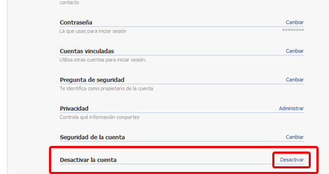

 

**Paso 3 - Te echarán de menos**

Una vez en la pantalla desde la que se puede solicitar la baja, Facebook recurre a la lágrima fácil: 'Fulano te echará de menos' con la foto del 'amigo' correspondiente. Si este truco barato no te asusta, sigue adelante. Si por el contrario gimoteas, no te des de baja.

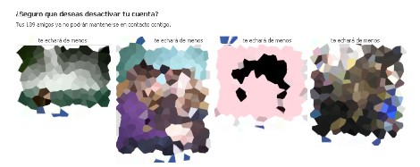

En el primer caso, debes seleccionar el motivo por el que te das de baja y, en función de lo que escojas, Facebook te dará diversas 'recetas' para intentar evitar la salida de su red. Si aún así no cejas en el empeño, aún debes escoger si quiere recibir mensajes de correo electrónico de Facebook o no... porque tus 'amigos' podrán etiquetarte en fotos o pedirte que te unas a grupos aún cuando te hayas dado de baja.

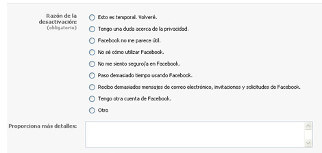

En fin, que una vez seleccionado todo, dale a 'Desactivar mi cuenta'.

 

**Paso 4 - Los últimos palitos en las ruedas**

No, todavía no se ha acabado el proceso. Facebook volverá a pedir que introduzcas tu contraseña y, después, un código de seguridad -captcha-. Nadie dijo que fuese cómodo.

 

**Paso 5 - Recuerda que siempre puedes volver**

Es aquí donde está la gracia del asunto. Facebook no borra tu información de su base de datos. Hace que desaparezcan tus mensajes, fotos o vídeos, pero no los borra. En cualquier momento puedes volver a la red con sólo iniciar sesión con tu correo electrónico y contraseña habituales.

Es decir, prácticamente es como si hubieras cerrado sesión aunque de forma mucho más enrevesada. Por supuesto, no cuentes con que Facebook avise a tus 'amigos' de que te has dado de baja: un grave fallo desde mi punto de vista.

**Caso b) Eliminación completa**

**Paso 1 - Entra en Facebook**

En primer lugar, entra en Facebook con tu correo electrónico y contraseña habituales.

**Paso 2 - Solicita tu desaparición de Facebook**

No hay, o al menos no lo he encontrado, un espacio en la navegación de Facebook para solicitar la eliminación completa de una cuenta. Debería estar junto a 'Desactivar cuenta' \[Paso 2 del caso a)\], pero no es así.

La única forma de hacerlo es [hacer click en este enlace](http://www.facebook.com/help/contact.php?show_form=delete_account) y darle a 'Aceptar.

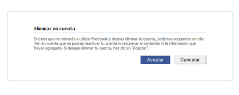

vicesalcedo@hotmail.com

 

**Paso 3 - ¿Estás seguro de que estás seguro?**

Una vez hecho, cómo no, Facebook solicita tu contraseña y que rellenes un código de seguridad. Esta vez de verdad, estamos en el último paso.

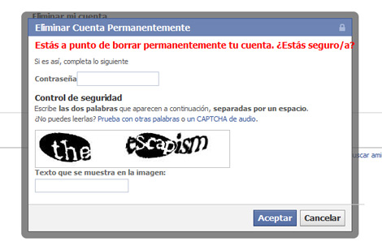

 

**Paso 4 - Espera 15 días**

En 15 días, si no vuelves a entrar en el sitio con tu correo electrónico y contraseña, tu cuenta debería ser eliminada por completo. A final de mes confirmaré si es cierto.

**Y si quiere darse de baja de algún sitio más y no sabe cómo, pregunte.**

**Actualizacion (I):** Mucha gente recomienda en los comentarios modificar los datos personales que dimos a la red antes de solicitar el borrado e incluso establecer contacto con gente que no se conozca. Por si acaso.

**Actualización (II)**: Juan Diego, amable lector, me pasa el enlace de[Suicide Machine](http://suicidemachine.org/), un sitio que 'limpia' perfiles de diversas redes sociales: Facebook, Twitter, MySpace y LinkedIn. Por si todo lo demás falla. Advierto que este método no lo he probado.

**Actualización (III)**: Tomo nota de vuestras peticiones. En los próximos días os contaré cómo borrarse de Tuenti y cómo borrarse de Hotmail. ¿Algún sitio que añadir a la lista?

Principio del formulario

Final del formulario

- [**TODOS**](http://www.elmundo.es/blogs/elmundo/catalejo/2010/05/05/como-borrarse-de-facebook.html#comentarios)

- [MEJOR VALORADOS](http://www.elmundo.es/blogs/elmundo/catalejo/2010/05/05/como-borrarse-de-facebook.html#comentarios)

- TE MENCIONAN

- TU RED

### 95 » Comentarios¿Quieres comentar? [Entra](http://www.elmundo.es/blogs/elmundo/catalejo/2010/05/05/como-borrarse-de-facebook.html#comentar) o [regístrate](http://app.elmundo.es/elmundo/registro/registro.html)

- [«« Inicio](http://www.elmundo.es/blogs/elmundo/catalejo/2010/05/05/como-borrarse-de-facebook.html#comentarios)

- [« Anterior](http://www.elmundo.es/blogs/elmundo/catalejo/2010/05/05/como-borrarse-de-facebook.html#comentarios)

- [6](http://www.elmundo.es/blogs/elmundo/catalejo/2010/05/05/como-borrarse-de-facebook.html#comentarios)

- [7](http://www.elmundo.es/blogs/elmundo/catalejo/2010/05/05/como-borrarse-de-facebook.html#comentarios)

- [8](http://www.elmundo.es/blogs/elmundo/catalejo/2010/05/05/como-borrarse-de-facebook.html#comentarios)

- [9](http://www.elmundo.es/blogs/elmundo/catalejo/2010/05/05/como-borrarse-de-facebook.html#comentarios)

- 10

1.  **Anónimo***04.nov.2010 \| 17:41*

#### \#91

graciiias ya borre mi cuenta aber si es verdad eso de dentro de 15

> Responder[Citar mensaje](http://www.elmundo.es/blogs/elmundo/catalejo/2010/05/05/como-borrarse-de-facebook.html#comentar)
>
> Valorar

[PositivoNegativo](http://www.elmundo.es/blogs/elmundo/catalejo/2010/05/05/como-borrarse-de-facebook.html)

Denunciar

2.  **Anónimo***30.nov.2010 \| 22:49*

#### \#92

Asi es mas facil... https://ssl.facebook.com/help/contact.php?show_form=delete_account  
  
Sin tantos rodeos nomas escribe la contraseña y listo esperas 14 dias

> Responder[Citar mensaje](http://www.elmundo.es/blogs/elmundo/catalejo/2010/05/05/como-borrarse-de-facebook.html#comentar)
>
> Valorar

[PositivoNegativo](http://www.elmundo.es/blogs/elmundo/catalejo/2010/05/05/como-borrarse-de-facebook.html)

Denunciar

3.  **Anónimo***28.dic.2010 \| 13:46*

#### \#93

GRACIAS......

> Responder[Citar mensaje](http://www.elmundo.es/blogs/elmundo/catalejo/2010/05/05/como-borrarse-de-facebook.html#comentar)
>
> Valorar

[PositivoNegativo](http://www.elmundo.es/blogs/elmundo/catalejo/2010/05/05/como-borrarse-de-facebook.html)

Denunciar

4.  **Anónimo***11.mar.2011 \| 16:50*

#### \#94

gracias...me a servido de muxo

> Responder[Citar mensaje](http://www.elmundo.es/blogs/elmundo/catalejo/2010/05/05/como-borrarse-de-facebook.html#comentar)
>
> Valorar

[PositivoNegativo](http://www.elmundo.es/blogs/elmundo/catalejo/2010/05/05/como-borrarse-de-facebook.html)

Denunciar

5.  **lavil***26.feb.2012 \| 10:50*

#### \#95

Sergio te pido por favor que nos digas el sistema de como borrarnos de las listas de Hacienda, que son muy cansinos todos los años nos dan la vara, pero además que no quede ni rastro de nuestra existrencia ni anterior ni futura. Y te agradezco que me he podido borrar del caralibro que me tenia harto de tanta solicitud estúpida.

> [ResponderCitar mensaje](http://www.elmundo.es/blogs/elmundo/catalejo/2010/05/05/como-borrarse-de-facebook.html#comentar)
>
> Valorar

[PositivoNegativo](http://www.elmundo.es/blogs/elmundo/catalejo/2010/05/05/como-borrarse-de-facebook.html)

Denunciar

- [«« Inicio](http://www.elmundo.es/blogs/elmundo/catalejo/2010/05/05/como-borrarse-de-facebook.html#comentarios)

- [« Anterior](http://www.elmundo.es/blogs/elmundo/catalejo/2010/05/05/como-borrarse-de-facebook.html#comentarios)

- [6](http://www.elmundo.es/blogs/elmundo/catalejo/2010/05/05/como-borrarse-de-facebook.html#comentarios)

- [7](http://www.elmundo.es/blogs/elmundo/catalejo/2010/05/05/como-borrarse-de-facebook.html#comentarios)

- [8](http://www.elmundo.es/blogs/elmundo/catalejo/2010/05/05/como-borrarse-de-facebook.html#comentarios)

- [9](http://www.elmundo.es/blogs/elmundo/catalejo/2010/05/05/como-borrarse-de-facebook.html#comentarios)

- 10

##### **Queremos saber tu opinión**

##### Usuario registrado

Principio del formulario

Email: Contraseña:

Recordadme en este ordenador
[Recuperar contraseña »](http://app.elmundo.es/ELMUNDO/RegistroUnico/Controlador?opcion=11)

¿Eres un usuario nuevo? [Regístrate](http://app.elmundo.es/ELMUNDO/RegistroUnico/Controlador)

Final del formulario

[**Comentarios (95)**](http://www.elmundo.es/blogs/elmundo/catalejo/2010/05/05/como-borrarse-de-facebook.html#comentarios)

Compartir

- 
- 
- 
- 
- 
- 

Herramientas

- [**Enviar a un amigo**](http://www.elmundo.es/elmundo/envia_noticia.html)

- [**Valorar**](http://www.elmundo.es/elmundo/graciasporvalorar.html)

- [**Imprimir**](javascript:imprimir())

- [**En tu móvil**](http://www.elmundo.es/servicios/palm.html)

- [**Rectificar**](http://www.elmundo.es/elmundo/rectificaciones/enviar.html)

<!-- -->

-

**Sergio Rodríguez**

Periodista de ELMUNDO.es. Noticias, curiosidades y novedades de Internet en pequeñas dosis.

##### [@sergiors](http://twitter.com/sergiors)

### Sergio Rodríguez

#### [SergioRS](http://twitter.com/intent/user?screen_name=SergioRS)

[marioviciosa](http://twitter.com/intent/user?screen_name=marioviciosa) Mini helicópteros robot de la Universidad de Pensilvania tocan la banda sonora de 007 [\#JamesBond](http://twitter.com/search?q=%23JamesBond)[youtube.com/watch?v=\_sUeGC…](http://t.co/ey6hNL6k)[yesterday](http://twitter.com/marioviciosa/status/175630641130508288) · [reply](http://twitter.com/intent/tweet?in_reply_to=175630641130508288) · [retweet](http://twitter.com/intent/retweet?tweet_id=175630641130508288) · [favorite](http://twitter.com/intent/favorite?tweet_id=175630641130508288)

[SergioRS](http://twitter.com/intent/user?screen_name=SergioRS) ¿Qué pasa cuando intentas eliminar correos enviados desde 2009? Pasa que... pff[14 days ago](http://twitter.com/SergioRS/status/170573502804533248) · [reply](http://twitter.com/intent/tweet?in_reply_to=170573502804533248) · [retweet](http://twitter.com/intent/retweet?tweet_id=170573502804533248) · [favorite](http://twitter.com/intent/favorite?tweet_id=170573502804533248)

[g_moralesg](http://twitter.com/intent/user?screen_name=g_moralesg) Paper Papers: El titular más inteligente del año[paperpapers.net/2012/02/el-tit…](http://t.co/yRdk9ag1)[16 days ago](http://twitter.com/g_moralesg/status/170191071823933440) · [reply](http://twitter.com/intent/tweet?in_reply_to=170191071823933440) · [retweet](http://twitter.com/intent/retweet?tweet_id=170191071823933440) · [favorite](http://twitter.com/intent/favorite?tweet_id=170191071823933440)

[SergioRS](http://twitter.com/intent/user?screen_name=SergioRS) [@angeljimenez](http://twitter.com/angeljimenez) ¿No le falta Siri? :-)))[16 days ago](http://twitter.com/SergioRS/status/170147932836868097) · [reply](http://twitter.com/intent/tweet?in_reply_to=170147932836868097) · [retweet](http://twitter.com/intent/retweet?tweet_id=170147932836868097) · [favorite](http://twitter.com/intent/favorite?tweet_id=170147932836868097)

[SergioRS](http://twitter.com/intent/user?screen_name=SergioRS) ¿Qué diferencia a The Verge para que en cinco meses sean la referencia tecnológica? Calidad y cariño por lo que hacen[theverge.com/2012/2/16/2801…](http://t.co/CogyXb62)[16 days ago](http://twitter.com/SergioRS/status/170145936327192576) · [reply](http://twitter.com/intent/tweet?in_reply_to=170145936327192576) · [retweet](http://twitter.com/intent/retweet?tweet_id=170145936327192576) · [favorite](http://twitter.com/intent/favorite?tweet_id=170145936327192576)

[Join the conversation](http://twitter.com/sergiors)

|  |
|------------------------------------|
|                                    |

##### Últimos Posts

- 1.  **3 de marzo de 2012**[*Apple: 500.000 empleos en EEUU y... ¿cuántos en Asia?*](http://www.elmundo.es/blogs/elmundo/catalejo/2012/03/03/apple-500000-trabajos-en-eeuu-y-cuantos.html)

  2.  **1 de marzo de 2012**[*Cómo rebelarse contra los cambios de privacidad de Google*](http://www.elmundo.es/blogs/elmundo/catalejo/2012/03/01/como-rebelarse-contra-los-cambios-de.html)

  3.  **31 de enero de 2012**[*Obama saca la hucha... electrónica*](http://www.elmundo.es/blogs/elmundo/catalejo/2012/01/31/donar-hasta-desde-el-movil.html)

  4.  **25 de enero de 2012**[*Por qué los últimos resultados de Apple importan (mucho)*](http://www.elmundo.es/blogs/elmundo/catalejo/2012/01/25/por-que-los-ultimos-resultados-de-apple.html)

  5.  **21 de enero de 2012**[*Todos contra Hollywood*](http://www.elmundo.es/blogs/elmundo/catalejo/2012/01/21/todos-contra-hollywood.html)

  6.  **20 de enero de 2012**[*¿'Piratería' o falta de oferta?*](http://www.elmundo.es/blogs/elmundo/catalejo/2012/01/20/pirateria-o-falta-de-oferta.html)

  7.  **19 de enero de 2012**[*Del Atari al iPhone*](http://www.elmundo.es/blogs/elmundo/catalejo/2012/01/19/del-atari-al-iphone.html)

  8.  **18 de enero de 2012**[*Si la ley SOPA hubiese existido hace 10 años...*](http://www.elmundo.es/blogs/elmundo/catalejo/2012/01/18/si-la-ley-sopa-hubiese-existido-hace-10.html)

  9.  **17 de enero de 2012**[*A Google tampoco le gusta la SOPA*](http://www.elmundo.es/blogs/elmundo/catalejo/2012/01/17/a-google-tampoco-le-gusta-la-sopa.html)

  10. **5 de enero de 2012**[*Adiós, cable; hola, 'streaming'*](http://www.elmundo.es/blogs/elmundo/catalejo/2012/01/05/adios-cable-hola-streaming.html)

##### Archivo

- 

###### [2012](http://www.elmundo.es/blogs/elmundo/catalejo/archivo/2012/index.html)

1.  [**MARZO (2)**](http://www.elmundo.es/blogs/elmundo/catalejo/archivo/2012/03/index.html)

2.  [**ENERO (8)**](http://www.elmundo.es/blogs/elmundo/catalejo/archivo/2012/01/index.html)

- 

###### [2011](http://www.elmundo.es/blogs/elmundo/catalejo/archivo/2011/index.html)

1.  [**DICIEMBRE (6)**](http://www.elmundo.es/blogs/elmundo/catalejo/archivo/2011/12/index.html)

2.  [**NOVIEMBRE (5)**](http://www.elmundo.es/blogs/elmundo/catalejo/archivo/2011/11/index.html)

3.  [**OCTUBRE (3)**](http://www.elmundo.es/blogs/elmundo/catalejo/archivo/2011/10/index.html)

4.  [**SEPTIEMBRE(6)**](http://www.elmundo.es/blogs/elmundo/catalejo/archivo/2011/09/index.html)

5.  [**AGOSTO (2)**](http://www.elmundo.es/blogs/elmundo/catalejo/archivo/2011/08/index.html)

6.  [**JULIO (7)**](http://www.elmundo.es/blogs/elmundo/catalejo/archivo/2011/07/index.html)

7.  [**JUNIO (3)**](http://www.elmundo.es/blogs/elmundo/catalejo/archivo/2011/06/index.html)

8.  [**MAYO (11)**](http://www.elmundo.es/blogs/elmundo/catalejo/archivo/2011/05/index.html)

9.  [**ABRIL (12)**](http://www.elmundo.es/blogs/elmundo/catalejo/archivo/2011/04/index.html)

10. [**MARZO (23)**](http://www.elmundo.es/blogs/elmundo/catalejo/archivo/2011/03/index.html)

11. [**FEBRERO (7)**](http://www.elmundo.es/blogs/elmundo/catalejo/archivo/2011/02/index.html)

12. [**ENERO (5)**](http://www.elmundo.es/blogs/elmundo/catalejo/archivo/2011/01/index.html)

- 

###### [2010](http://www.elmundo.es/blogs/elmundo/catalejo/archivo/2010/index.html)

1.  [**DICIEMBRE (11)**](http://www.elmundo.es/blogs/elmundo/catalejo/archivo/2010/12/index.html)

2.  [**NOVIEMBRE (5)**](http://www.elmundo.es/blogs/elmundo/catalejo/archivo/2010/11/index.html)

3.  [**OCTUBRE (5)**](http://www.elmundo.es/blogs/elmundo/catalejo/archivo/2010/10/index.html)

4.  [**SEPTIEMBRE(7)**](http://www.elmundo.es/blogs/elmundo/catalejo/archivo/2010/09/index.html)

5.  [**AGOSTO (1)**](http://www.elmundo.es/blogs/elmundo/catalejo/archivo/2010/08/index.html)

6.  [**JULIO (7)**](http://www.elmundo.es/blogs/elmundo/catalejo/archivo/2010/07/index.html)

7.  [**JUNIO (16)**](http://www.elmundo.es/blogs/elmundo/catalejo/archivo/2010/06/index.html)

8.  [**MAYO (3)**](http://www.elmundo.es/blogs/elmundo/catalejo/archivo/2010/05/index.html)

9.  [**ABRIL (6)**](http://www.elmundo.es/blogs/elmundo/catalejo/archivo/2010/04/index.html)

10. [**MARZO (16)**](http://www.elmundo.es/blogs/elmundo/catalejo/archivo/2010/03/index.html)

11. [**FEBRERO (4)**](http://www.elmundo.es/blogs/elmundo/catalejo/archivo/2010/02/index.html)

12. [**ENERO (9)**](http://www.elmundo.es/blogs/elmundo/catalejo/archivo/2010/01/index.html)

### [Untitled Document - Arrakis](http://www.arrakis.es/~rebra/Noticias/boletines/84/nobleza.htm)

www.arrakis.es/~rebra/Noticias/boletines/84/nobleza.htm

La casa solariega de los Sanjuán permanece en Cinctorres como vivo testimonio de **...Su** fachada de sillería y **su** lateral de mamposterías, y **sus** viejos y hermosos aleros, **...** y contrajo matrimonio con doña **Isabel Sousa** y Cabrera, natural de Valencia, **...** Don**Joaquín Sanjuán** y Sousa casó con doña María Joaquina Piquer **...**

### [Crisis dinástica del<u> siglo XVIII</u>](http://html.rincondelvago.com/crisis-dinastica-del-siglo-xviii.html)

### [Untitled Document - Arrakis](http://www.arrakis.es/~rebra/Noticias/boletines/84/nobleza.htm)

www.arrakis.es/~redivisores, excluido él mismo. Los divisores son 1, 2, 4, 7 y 14, que suman 28.

[1 comentario](http://www.libertaddigital.com/opinion/amando-de-miguel/la-magia-de-los-numeros-63967/1.html)[Imprimir](http://www.libertaddigital.com/c.php?op=imprimir&id=63967)[Corregir](mailto:soporte@libertaddigital.com?subject=Errata%20detectada%20por%20un%20lector.%20&body=Hola%2C%20%0D%0AHe%20detectado%20una%20errata%20en%20este%20art?culo:%20%0D%0Ahttp%3A%2F%2Fwww.libertaddigital.com%2Fopinion%2Famando-de-miguel%2Fla-magia-de-los-numeros-63967%2F)

Compartir:[Enviar](mailto:ESCRIBA_AQUI_EL_EMAIL_DE_SU_AMIGO?subject=Te%20recomiendo%20este%20art%EDculo%20de%20Libertad%20Digital.%20&body=Hola%2C%20%0D%0ATal%20vez%20te%20interese%20este%20art%EDculo%20de%20Libertad%20Digital.%20%0D%0Ahttp%3A%2F%2Fwww.libertaddigital.com%2Fopinion%2Famando-de-miguel%2Fla-magia-de-los-numeros-63967%2F)[Menéame](http://www.meneame.net/submit.php?url=http://www.libertaddigital.com/opinion/amando-de-miguel/la-magia-de-los-numeros-63967/)[Tuenti](http://www.tuenti.com/share?url=http%3A%2F%2Fwww.libertaddigital.com%2Fopinion%2Famando-de-miguel%2Fla-magia-de-los-numeros-63967%2F)[Twitter](javascript:(function()%7bwindow.twttr=window.twttr||%7b%7d;var%20D=550,A=450,C=screen.height,B=screen.width,H=Math.round((B/2)-(D/2)),G=0,F=document,E;if(C%3eA)%7bG=Math.round((C/2)-(A/2))%7dwindow.twttr.shareWin=window.open('http://twitter.com/share','','left='+H+',top='+G+',width='+D+',height='+A+',personalbar=0,toolbar=0,scrollbars=1,resizable=1');window.twttr.shareWin.location.href='http://twitter.com/share?_='+(new%20Date()).getTime()+'&url=http%3A%2F%2Fwww.libertaddigital.com%2Fopinion%2Famando-de-miguel%2Fla-magia-de-los-numeros-63967%2F&text='+encodeURIComponent('Amando%20de%20Miguel%20-%20La%20magia%20de%20los%20n%C3%BAmeros')+'&via=libertaddigital';%7d());)

### Otros artículos del autor

- [(2012-03-28) Étimos, donaires y contumelas](http://www.libertaddigital.com/opinion/amando-de-miguel/etimos-donaires-y-contumelas-63948/)

- [(2012-03-26) El acertijo contable](http://www.libertaddigital.com/opinion/amando-de-miguel/el-acertijo-contable-63914/)

- [(2012-03-23) La gran polémica: castellano o español](http://www.libertaddigital.com/opinion/amando-de-miguel/la-gran-polemica-castellano-o-espanol-63867/)

- [(2012-03-22) Escribir es rectificar](http://www.libertaddigital.com/opinion/amando-de-miguel/escribir-es-rectificar-63834/)

- [(2012-03-18) La magia de los números](http://www.libertaddigital.com/opinion/amando-de-miguel/la-magia-de-los-numeros-63776/)

- [Todos los artículos de Amando de Miguel](http://www.libertaddigital.com/opinion/amando-de-miguel/)

Hablamos aquí continuamente a la magia de las palabras, pero también me he referido a la magia de los números. Sobre el particular he recibido muchos correos que ni siquiera puedo comentar por razones de espacio. Adelanto solo algunas sugerencias para hacer pensar, que es la misión de esta seccioncilla.

Alberto Laria recuerda que, de niños, utilizaban los palmos y los dedos para contar distancias. No es nada insólito. **Los palmos y los dedos** se han utilizado para contar en muchas culturas primitivas. En la Castilla rural se utiliza todavía el jeme o palmo como medida de longitud. La pulgada no es más que la falange del dedo pulgar. Se llama así porque se utilizaba para matar pulgas. Ahora sirve para manejar con soltura el teclado de los teléfonos móviles. Gracias a esa nueva función no se extinguirá.

José Luis Mallagaray detecta un error en mi exposición: el famoso paralelo de la Guerra de Corea no fue el 40 sino el 38. Perdón por el desliz. En relación con la magia del **número 40**, don José Luis añade que la baraja española consta de 40 cartas. Félix Redondo detecta otra errata mía: "No es contar los 40 sino cantar las 40", una regla del juego del tute. Creo que me confundí con "la crisis de los 40" años. Ya se sabe: "de los 40 para arriba no te mojes la barriga".

Jesús Fierro me explica que el **número 28** es "perfecto" porque es igual a la suma de sus divisores, excluido él mismo. Los divisores son 1, 2, 4, 7 y 14, que suman 28.

José Antonio Martínez Pons añade el **número siete** por su carácter mágico: los días de la semana, las notas musicales, las cuerdas de la lira, los planetas de la antigüedad, las maravillas del Universo, los sabios de Grecia, los colores convencionales. Respecto a las unidades de medida, señala la milla marina, que es la longitud del arco de un minuto de meridiano. Añado que la palabra "milla", latina, equivalía a mil pasos. La legua viene a equivaler a 20.000 pies, unos cinco kilómetros. Es una unidad que se manejaba en toda la Europa medieval, aunque con las naturales variaciones locales. Manuel J. Samaniego añade que la magia del número siete está muchas veces en la Biblia. Así, dice Jesús que hay que perdonar setenta veces siete. Entiendo que para los judíos de la época bíblica los guarismos siete o setenta indicaban algo así como muchos, lo incontable.

Alberto Torrijos me manda un completo alegato crítico contra **el AVE**, un tren rentable para distancias medias. Ahora bien, necesita  obras de infraestructura tan gigantescas que lo hacen poco aprovechable a la larga. Razona don Alberto, con datos, que el **aeropuerto fantasma** de Castellón va a ser mucho menos rentable que el de Ciudad Real. Considero que ambas obras son un símbolo de la sociedad expansiva de la que estamos saliendo. Entramos en una sociedad estacionaria en la que ya no habrá lugar a grandes desarrollos.

Roberto Tojo registra muy bien los datos del desastre económico de **Grecia**. Viene a ser como el español elevado a no sé qué potencia. Sintetizo algunas de las locuras estadísticas de Grecia: contabilidad pública falsa, exceso de funcionarios hasta extremos increíbles, engaño generalizado en las pensiones, despilfarro en los gastos hospitalarios, abuso de las jubilaciones anticipadas, organismos públicos inservibles, fraude fiscal masivo, agobiante peso del sector público, etc. Se comprende que la crisis griega sea insalvable. Con esos datos en la mano el dictamen razonable es que Grecia no reciba ni un euro más de la Unión Europea y que se salga del euro a toda  velocidad. Nada de eso ocurrirá, digo yo. Lo malo para nosotros es que la imagen de España, aunque lejos de la griega, sigue sus mismos pasos. Convendría aprender de los errores de los vecinos. Me temo que el Partenón entero va a terminar en Berlín, donde también irán los frisos del Partenón que están en el Museo Británico. Tampoco quiero dar ideas sobre la desamortización del Museo del Prado.

[1 comentario](http://www.libertaddigital.com/opinion/amando-de-miguel/la-magia-de-los-numeros-63967/1.html)[Imprimir](http://www.libertaddigital.com/c.php?op=imprimir&id=63967)[Corregir](mailto:soporte@libertaddigital.com?subject=Errata%20detectada%20por%20un%20lector.%20&body=Hola%2C%20%0D%0AHe%20detectado%20una%20errata%20en%20este%20art?culo:%20%0D%0Ahttp%3A%2F%2Fwww.libertaddigital.com%2Fopinion%2Famando-de-miguel%2Fla-magia-de-los-numeros-63967%2F)

Compartir:[Enviar](mailto:ESCRIBA_AQUI_EL_EMAIL_DE_SU_AMIGO?subject=Te%20recomiendo%20este%20art%EDculo%20de%20Libertad%20Digital.%20&body=Hola%2C%20%0D%0ATal%20vez%20te%20interese%20este%20art%EDculo%20de%20Libertad%20Digital.%20%0D%0Ahttp%3A%2F%2Fwww.libertaddigital.com%2Fopinion%2Famando-de-miguel%2Fla-magia-de-los-numeros-63967%2F)[Menéame](http://www.meneame.net/submit.php?url=http://www.libertaddigital.com/opinion/amando-de-miguel/la-magia-de-los-numeros-63967/)[Tuenti](http://www.tuenti.com/share?url=http%3A%2F%2Fwww.libertaddigital.com%2Fopinion%2Famando-de-miguel%2Fla-magia-de-los-numeros-63967%2F)[Twitter](javascript:(function()%7bwindow.twttr=window.twttr||%7b%7d;var%20D=550,A=450,C=screen.height,B=screen.width,H=Math.round((B/2)-(D/2)),G=0,F=document,E;if(C%3eA)%7bG=Math.round((C/2)-(A/2))%7dwindow.twttr.shareWin=window.open('http://twitter.com/share','','left='+H+',top='+G+',width='+D+',height='+A+',personalbar=0,toolbar=0,scrollbars=1,resizable=1');window.twttr.shareWin.location.href='http://twitter.com/share?_='+(new%20Date()).getTime()+'&url=http%3A%2F%2Fwww.libertaddigital.com%2Fopinion%2Famando-de-miguel%2Fla-magia-de-los-numeros-63967%2F&text='+encodeURIComponent('Amando%20de%20Miguel%20-%20La%20magia%20de%20los%20n%C3%BAmeros')+'&via=libertaddigital';%7d());)

**Tamb**
