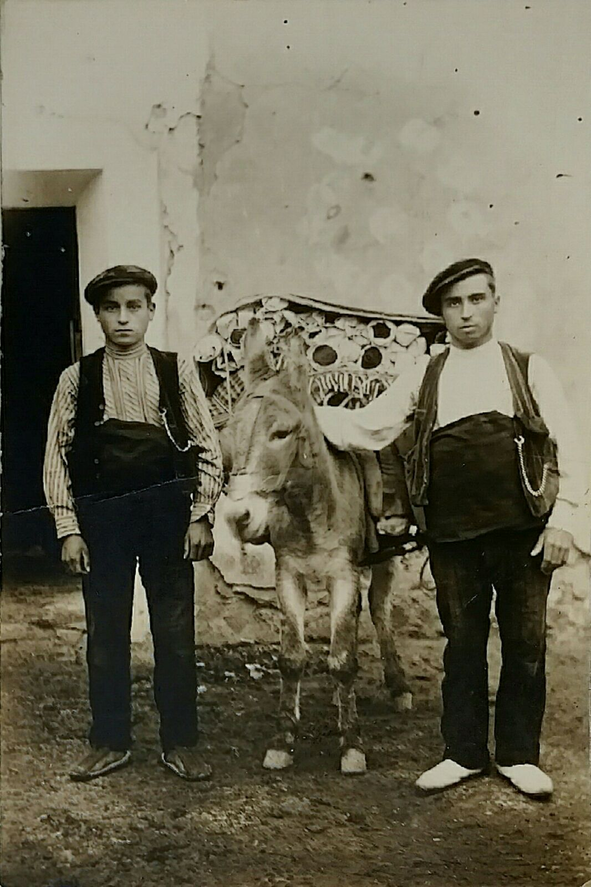
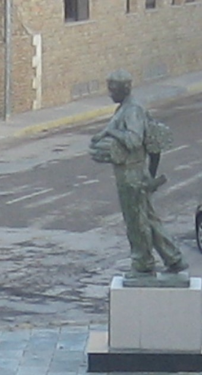

FAIXEROS

Els faixeros com diu el seu nom venia faixes. Aquestos homes eren o bé de Portell o Cinctorres encara que les faixes es teixien en més pobles de la comarca dels Ports. Però sols anaven pel món, com es deia, els homes d’aquestos dos pobles. A més de les cinc o sis fàbriques que hi havia pel poble on treballaven les jovents, moltes cases tenien un obrador amb el teler i el torn on es feien els canons. El soroll tric-trac tric-trac era com una música pels tots els carrers.

Els filats els portaven d’Alcoi, i una empresa tèxtil del poble els donava el color que volien (els tintava) i repartia els rolls per les cases , quan el roll es posa al teler, els fils que component la llargària forment l’ordi de les faixes, la trama es fa amb el fil que surt de la llançadora i els moviment compassats de braços i peus de la teixidora. Per ha fer els canons que van dins de la llançadora es roda el torn, el fil del fus s’enrola als canons que mesuren un pam, tot açò fet de manera manual.

Després d’acabar de teixir, d’un roll es fan sis o set dotzenes de faixes d’espiga o cordó, sempre es conten per dotzenes. Les mesures més corrents són:5x0´24, 6x0´28, 7x0´3,2 8x036, 9x0´40 i 10x0´44 cm.

L’acabament de les faixes o remat son els cordons. La faixa té que estar subjecta dins de la cordonera, i amb molta habilitat, la dona que ho treballa roda un numero determinat de fils, sempre els mateixos entre els dits i el braç rematant amb un nugo

Quan la faixa està subjecta al abdomen de la persona que la porta els cordons pengen con adorn.

Els diferents colors, que es fan al tint, son blanc, negre, roig, blau i verd. Les blanques més grans amb ratlles roges, eren les que portaven al Marroc l’Exèrcit Espanyol i també de color roig ,blau i verd. Actualment Els Regular de Ceuta les porten roges i els de Melilla blaves.

Les de més qualitat s’anomenen de “merino” són de pura llana, blanques o negres i més menudes per poder ficar-les vaig dels vestits els senyors.

La faixa la portava la gent que treballava al cap i que feia esforços per a protegir la zona lumbar era un amagatall de la petaca de tabac, dels diner i el que venia be, també com abric.

El faixero s’encarregava de la distribució i venda del producte pels mercats setmanals i pels pobles on passava. Aquesta faena passava de pares a fills. Quan els jovents tenien 15 o 16 anys ja anava amb son pare a aprendre l’ofici. En la majoria de les cases hi havia algun faixero .La temporada de treball començava a primer d’Agost quan s’ha replegat la collita dels cereals i s’acabava a desembre, a les festes de Nadal els faixeros estaven ja a casa. La resta del any treballaven les seues terres. Cadascú tenia el seu itinerari, Recorrien Catalunya, Llevant, La Manxa, les dos Castelles i la Rioja per Andalucia i Extremadura anàvem més els de Portell.

La distribució del gènere era per ferrocarril des d’Alcanyis. Del poble amb mulos portaven els paquets de faixes a Morella i allí amb carros a l’estació del tren. Açò es feia al mes de juliol, cada faixero facturava els seus paquets a diferents pobles de la seua ruta separats entre si 50 o 60 Km. Després ell, tal com anava venen o reportava als hostals on li guardaven la seua mercaderia. En un mulo anava a peu pels pobles oferint els seus productes, cada dia recorria dos o tres pobles.

als hostals on el guardaven. Quan s’acabava la temporada al mes de desembre invertia el camí tornava a casa a peu., sempre caminant amb el mulo i uns anys després com tots els faixeros amb bicicleta .

Cada faixero del poble tenia un itinerari que els demés respectaven, no es feien malt entre ells, dons en moment determinar si feia falta, s’ajudaven.

Quan s’arriba a Cinctorres, en mig d’una plaça està la figura del faixero amb bronze ,és un homenatge a tots els faixeros, als homes del poble que ”anaven pel mon” acostumats a fer camí calçats amb espardenyes pinyoneres, pantalon de pana o dril, faixa, jupetí i boina, amb un feix de faixes damunt de l’esquena i el pit subjectes amb una corretja per damunt del muscle. Sols falta que diga:

***Faixero, faixes***
