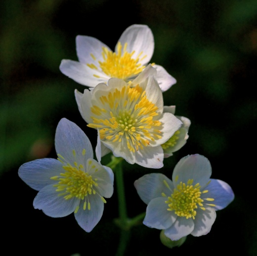
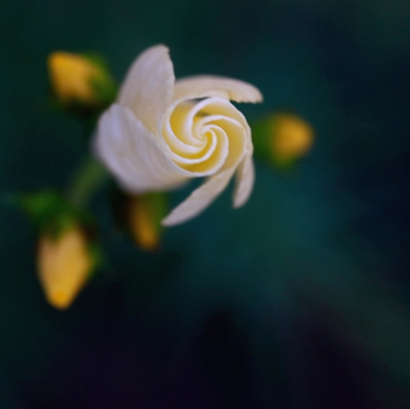
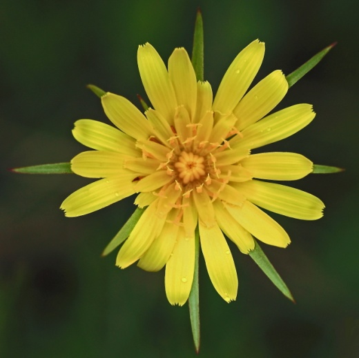
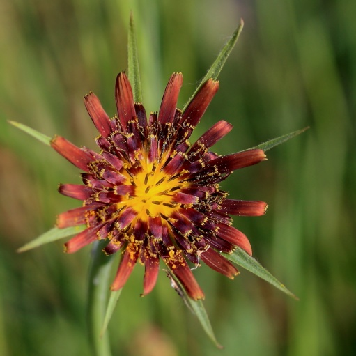
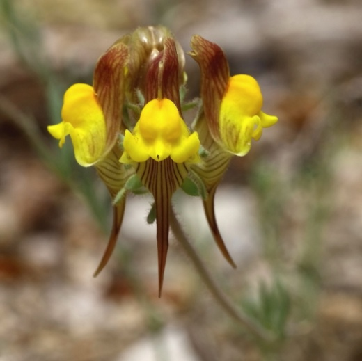
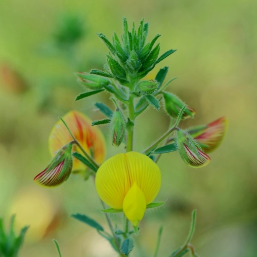

Flora.

Entendemos por flora el conjunto de los vegetales en el medio terrestre, que han sabido desarrollar órganos y estructuras adecuados para vivir y reproducirse en él, como raíces, tallos, hojas, flores semillas y frutos. Y a todos los organismos capaces de vivir gracias a la función clorofílica que les permites aprovechar la energía que nos viene del sol.

ARBOLES FRUTOS Y BAYAS.

PLANTAS Y FLORES.

MICROORGANISMOS.

PARTES BASICAS DE UNA PLANTA

Capullo. Flor de la cual todavía no se han separado los pétalos

Flor. Estructura reproductiva característica de las plantas que se reproducen por medio de semillas.

Fruto. Parte de la planta procedente del desarrollo del ovario de la flor tras la fecundación, rodeada por piel o cáscara, que protege las semillas y ayuda a su dispersión.

Hojas. Órgano vegetativo y generalmente aplanado de las plantas vasculares, especializado para realizar la fotosíntesis

Raíz. Órgano generalmente subterráneo, carente de hojas, fija la planta al suelo y absorbe el agua y minerales

Semilla. Simiente o pepita, contiene el embrión de la planta.

Tallo. Eje de la parte aérea de las plantas, órgano que sostiene a las hojas, flores y frutos. Incluye el sistema vascular que transporta el alimento y el agua.

Venas. Sistema bascular de las hojas.

PARTES BÁSICAS DE UNA FLOR.

Antena. Parte terminal del estambre de una flor.

Filamento. Parte basal estéril de un estambre.

Ovario. Estructura que contiene los óvulos a fecundar.

Óvulos. Célula reproductiva femenina de una planta.

Pétalo. Cada una de las hojas que componen la corola.

Pistilo. Órgano sexual femenino más interno de una flor.

Polen. Parte masculino de una flor.

Sépalo .Pieza floral que forma el cáliz de una flor.

Estigma. Parte del pistilo que recibe el polen durante la polinización.

Estilo. Prolongación del ovario de la cual aparece el estigma. El estilo no contiene óvulos..

Estambre. Cada uno de los órganos florales masculinos portadores de sacos polínicos.

Linun suffruticosum Tralictrum tuberosum

Tragopodon trapensis Tragopodon crocifolius

Linaria arabinaria Ononis natriux
