LOS LIQUENES

Los líquenes dentro del los vegetales son especiales, no son un único organismo, sino la simbiosis de dos distintos, un hongo y una alga que forman una combinación. No pueden vivir por separado.

El alga de la que se compone los líquenes gracias a su clorofila absorbe la energía de la luz solar y puede sintetizar azucares, mientras el hongo absorbe del sustrato el agua los substratos que lleva disueltos.

Los tipos de líquenes son variables aunque pueden resumirse en cuatro tipos: crustáceo, escamoso, folioso y fruticuloso. Cada especie de liquen se corresponde con un hongo distinto.

Son plantas pioneras, y muy resistentes. Al ser los primeros que colonizan un medio, como puede ser una roca, lo preparan para que formas superiores puedan asentarse en ella.

Se encuentran distribuidos por todo tipo de sustratos inertes u orgánicos desde las rocas desnudas, minerales, hojas, caparazones de animalesm, troncos de los arboles etc. Una característica de los líquenes es su sensibilidad atmosférica. Cada especie tolera unos límites muy estrechos de sustancias contaminantes, por lo que su ausencia o su presencia permiten saber la carga atmosférica de productos contaminantes.

La escasez de animales que consumen líquenes es posible que sea por la capacidad de estos de segregar sustancias (los ácidos liquenicos y otras) que no les hacen aptos para ser comidos. Algunas sustancias liquenáceas tienen un poder antibiótico, que han sido utilizadas por el hombre. La mayoría de más de 400 sustancias liquenidas conocidas solo pueden ser producidas por el talo de los niqueles.

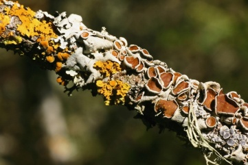

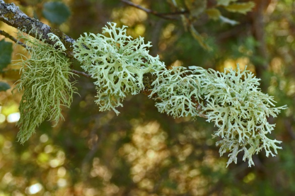

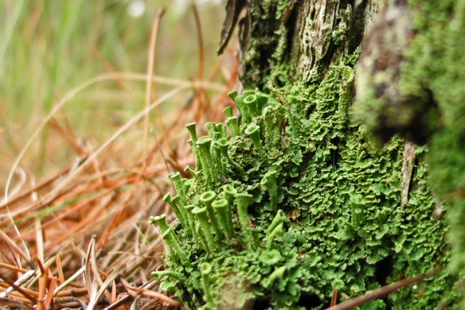

Lecadona chahlotera Evernia Prunastri Cladonia pixilata

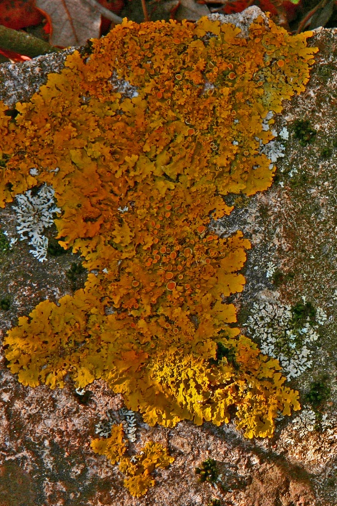

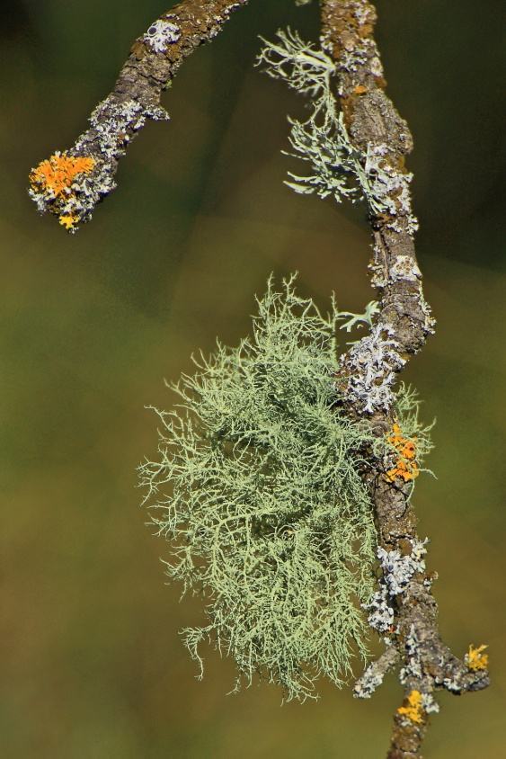

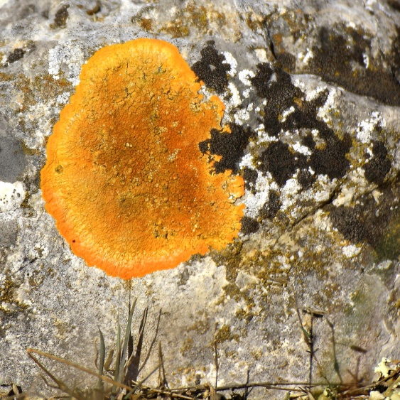

Xanthoria parietina Ramalinea Fracxinea Caloplaca aunantia

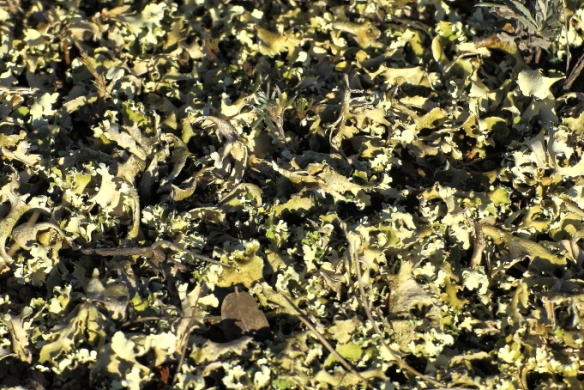

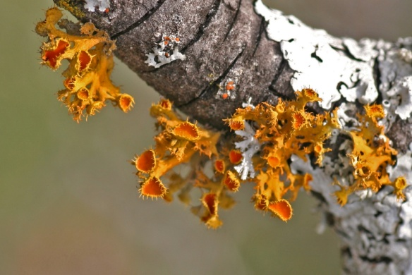

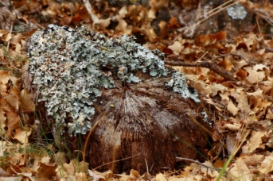

Teloschistes chyrsopphthalmus Cladonia foliácea Flanoparmelia caperata

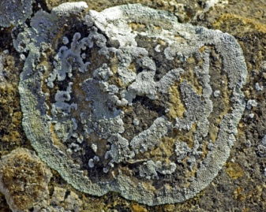

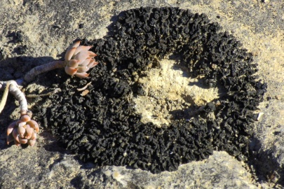

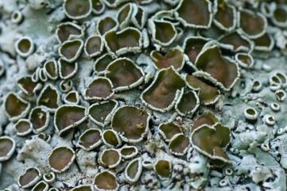

Aspicilia calcárea Collenera cristalum Apotecio lecanorinos
