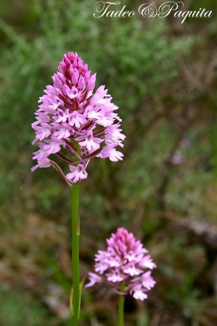
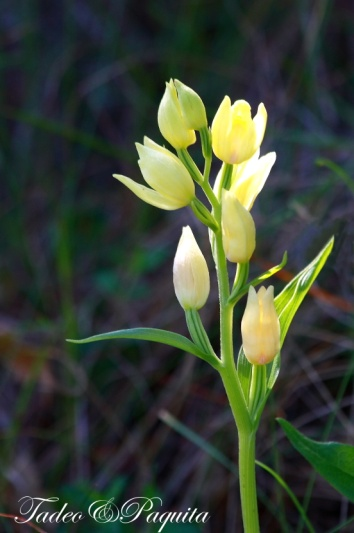
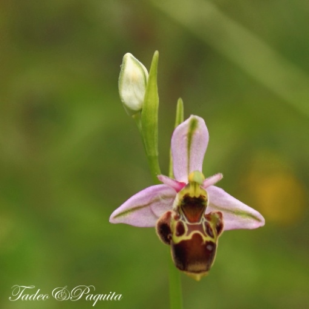

Orquídeas. Silvestres

Las orquídeas son plantas que requieren ambientes determinaos. Constituyen un ejemplo de evolución del reino vegetal. Su estructura está adaptada a la polinización por medio de insectos. Ciertas Orquídeas ( Ophrys) son flores trampa, pues son muy parecidas en olor, tacto y color a las abejas y la polinización se realiza cuando una abeja macho intenta copular con las flores. Las semillas de las orquídeas son tan pequeñas que parecen polvo y solo pueden germinar si están asociadas a los hongos especiales que les proveen de alimentos, a su vez el hongo continuara siendo huésped de la planta cuando esta se desarrolla, habitando en sus raíces.

En los prados de las montañas se encuentran muchas especies de orquídeas de pequeño tamaño, pero su belleza no pasa inadvertida al buen conocedor de las plantas.

En los bancales de l’ Arrivasada cercanos a la Rambla Celumbres entre otras muchas otras especies de plantas con flores, he encontrada ocho variedad distintos de orquídeas. Algunas pueden ser menos hermosas que sus cogeneres tropicales pero es posible que sean mas delicadas y sutiles.

