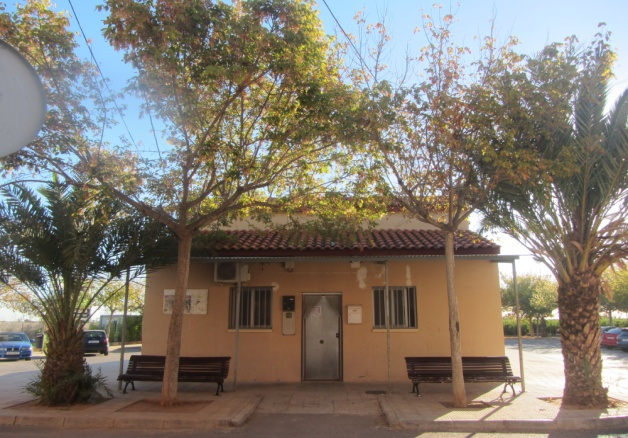
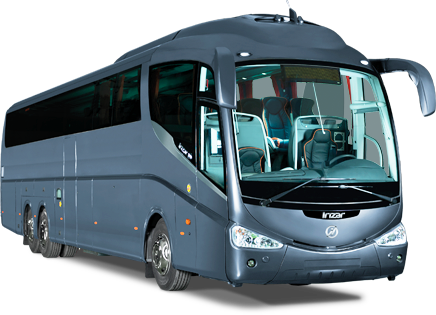
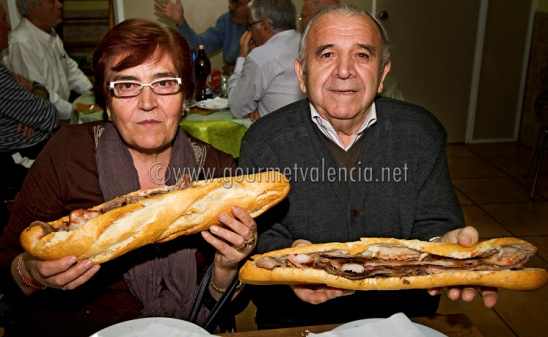
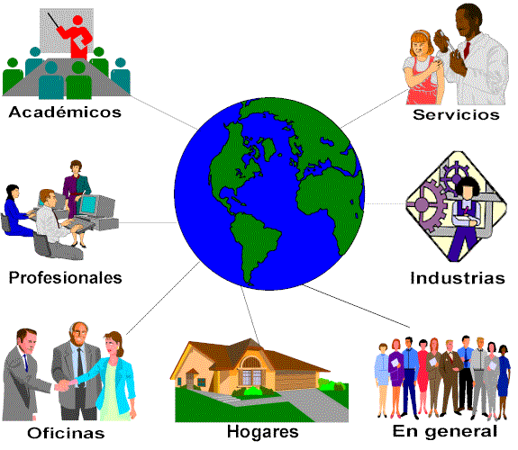
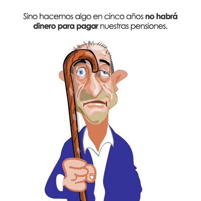
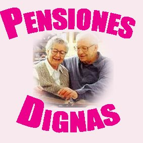
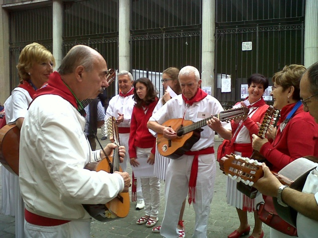
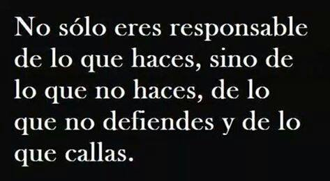
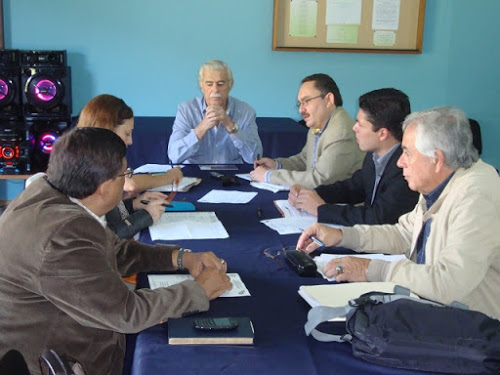

***Sensibilidades***

### Ingredientes para esta receta

500 g de aleta de ternera picada, 250 g de pechuga de pollo picada, 6 huevos (2 de ellos duros), ajo, miga de pan, leche, pan rallado, harina, jamón ibérico en tiras, perejil, sal y pimienta.

500 g de aleta de ternera picada, 250 g de pechuga de pollo picada, 6 huevos (2 de ellos duros), ajo, miga de pan, leche, pan rallado, harina, jamón ibérico en tiras, perejil, sal y pimienta.

### Elaboración de esta receta

2014-05-15 10:00:00.0

Cocemos 2 huevos. En un bol, batimos 4 huevos y añadimos la carne picada, el ajo y el perejil también picados, miga de pan mojada en leche, un poco de pan rallado, sal y pimienta. Mezclamos bien hasta conseguir una consistencia parecida a la masa de albóndigas. Si queda muy blanda añadimos un poco más de pan rallado para dejarla bien homogénea. Vertemos la mezcla encima de un papel de aluminio previamente espolvoreado con harina y extendemos formando un rectángulo de unos 2 cm de espesor. Cortamos el huevo duro y el jamón en tiras y lo colocamos encima de la carne. Enrollamos formando un brazo de gitano. Lo envolvemos en el papel y lo introducimos en el horno precalentado a 200º C unos 50 minutos. Si lo queremos más dorado, abrimos el papel una vez cocido y lo dejamos unos 10 minutos más. Servimos cortado en rodajas con ensalada de lechuga con sal de apio y patatas fritas paja.

***Programa de actividades***

**1º Actividades: Las actividades deberían ser una continuación de lo mismo, siempre y cuando la situación económica nos lo permita.**

**La pregunta es, ¿cómo nos podemos o debemos organizar en una asociación pequeña como esta?**

#### Centro Cívico Las Roquetas o bien… Roquetas

(Creo que así suena mejor)

**2º Viajes: Sin viajes no hay facturas y sin facturas no hay subvenciones, para tener subvenciones necesitamos realizar viajes.**

**Para facilitar la comunicación y reducir gastos necesitamos crear una línea de comunicación, fácil, rápida, y económica, por ejemplo: Correo electrónico y WhatsAPP.**

**3º Almuerzo: Realizaremos un almuerzo mensual de sobaquillo con sobremesa Y carajillo. Por ejemplo: el último miércoles de cada mes, a las 10 horas en el Centro Cívico del Grupo Roquetas.**

**4º El futuro de una Asociación está en las Nuevas Tecnologías de la Comunicación, formación y abaratamiento de costes. Ya sabemos que las Nuevas Tecnologías nos han llegado 30 años tarde. Para los que no dispongamos de internet, la mayoría tenemos hijos y nietos que viven cerca y nos pueden facilitar la comunicación.**

**Nunca es tarde para aprender**

**5º Nuevas Tecnologías: Crearemos un grupo virtual de formación continua de Nuevas Tecnologías, favoreciendo el intercambio y el aprendizaje mutuo como actividad de la asociación, en Internet y Redes Sociales.**

**Crearemos un grupo de WhatsAPP o Telegram**

**Las nuevas tecnologías son el futuro del Mundo.**

**6º Pensiones: En una Asociación de Jubilados y Pensionistas debería ser de sentido común hablar de pensiones y derechos de los mayores, el presidente debería trasladar las inquietudes de los socios al consejo de la tercera edad.**

**El día que el 70 % de los jubilados naveguemos por Internet y las Redes Sociales, los Jubilados seremos más respetados y las pensiones más garantizadas, ya que los jubilados somos un granero de votos para el Gobierno.**

¿ Están la pensiones garantizadas?

**7º Grupo Musical: Crearemos un grupo de aficionados a la música de cuerda y acordeón como actividad de la Asociación, con el fin de tener una Rondalla propia.**

***La Junta directiva***

- ***Presidente***

- ***Vicepresidente***

- ***Secretario***

- ***Tesorero***

- ***Vocal***

- ***Vocal***

[**porcar48@gmail.com**](mailto:porcar48@gmail.com)

## Castellón 14 de Febrero de 2015

Añadiría: No solo eres responsable de lo que haces, sino de lo que no haces, de lo que no dices y de lo que callas .Nos necesitamos todos. (Esto es una opinión mía, suaviza el texto)
