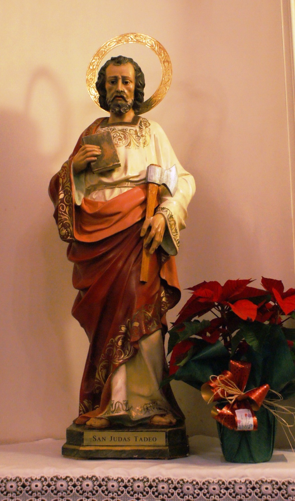

*San judas Tadeo, camina por mi casa llévate mis preocupaciones y cualquier enfermedad .Por favor vigila, sana y bendice a mi familia y amigos y aleja a mis enemigos en el nombre de Jesús . Amén.*
ODA A LA INMORTALIDAD  
  
William Wordsworth   
  
  
  
"Aunque mis ojos ya no puedan ver ese puro destello que en mi juventud me deslumbraba, aunque nada pueda hacer volver la hora del esplendor en la hierba, de la gloria en las flores, no debemos afligirnos, pues encontraremos fuerza en el recuerdo, en aquella primera simpatía que, habiendo sido una vez, habrá de ser por siempre, en los consoladores pensamientos que brotaron del humano sufrimiento y en la fe que mira a través de la muerte. Gracias al corazón humano, por el cual vivimos, gracias a sus ternuras, a sus alegrías, y a sus temores la flor más humilde, al florecer, puede inspirarme ideas que, a menudo, se muestran demasiado profundas para las lágrimas".
