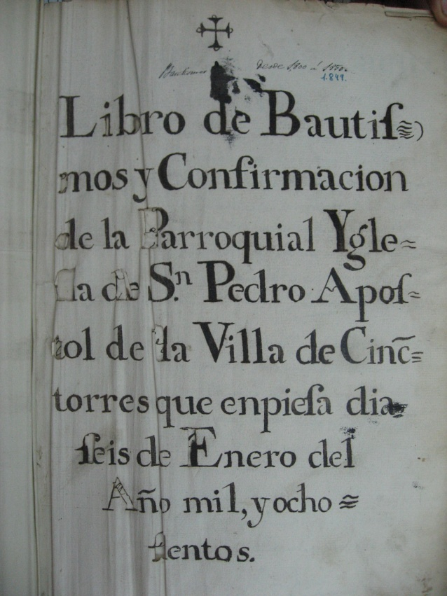
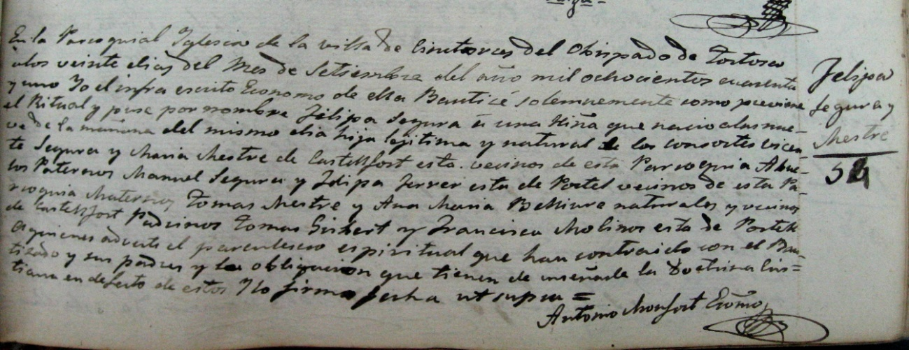

Registro del padrón de Cinctorres 1817

Mas de Clara:

Apellidos: Segura Jordán.

Rosaura Jordán viuda de ¿….Segura. Apellido oriundo de Castellfort

Apellidos: Segura Monserrat.

Vicenta Monserrat de Cinctorres. Viuda de: Vicente Segura Jordan . Hijo Manuel Segura Monserrat. Y seis hermanos más.

Apellidos: Segura Ferrer.

Manuel Segura y Montserrat hijo de Vicente Segura y Vicenta Monserrat de Cinctorres. Casado con: Felipa Ferrer Sorolla de Portell, hija de Francisco Ferrer y Teresa Sorolla de Portell.

¿181…Vicente Segura Ferrer. Sin mas informacion de su fecha de nacimiento.Con su matrimanio con Maria Mestre de Castellfort se inicia nuestra familia a partir del libro de Bautismos de la Parroquia de Cinctorres, en el que tenemos informacion mas detallada de la fecha de nacimiento de los demas mienbros de la familia.

Miguel Segura Ferrer el 4 de Septiembre de 1820.

1831\. 2 Enero. Nace Felipe Segura Ferrer.

1833\. Manuel Segura Ferrer.

1836\. 28 mayo. Teresa Segura Ferrer.

Apellidos: Segura Mestre.

Vicente Segura Ferrer hijo de Vicente Segura y Felipa Ferrer casado con Maria Mestre hija de Tomas Mestre y Ana Maria Benlliure de Castellfort.

I839. 20 de Abril.Nace Manuela Segura Mestre, hija de Vicente Segura y Maria Mestre.de Castellfort.

1841\. 20 Septiembre. Nace, Felipa Segura Mestre hija de Vicente Segura y María Mestre de Castellfort.

1844\. 8 de Mayo. Nace, Rosa Segura Mestre, hija de Vicente Segura y Maria Mestre de Castellfort.

185…? Antonio Segura Mestre hijo de Vicente Segura y Maria Mestre de Castellfort.

Rosa Segura Mestre. Casada con Julián Monserrat Bonet: Hijos:

Vicente. Monserrat Segura.

Manuel Monserrrat Segura.

Julián Monserrat Segura.

Elvira Monserrat Segura.

Francisco Monserrat Segura.

Domingo Monserrat Segura.

Manuel Monserrat Segura, casado con Beatriz Mampel del Mas de Maciá. Hijos:

Manuela Monserrat Mampel.

Vicente Monserrat Mampel.

Domingo Monserrat Mampel.

Antonio. Monserrat Mampel.

Florencio Monserrat Mampel.

Manuela Monserrrat Mampel casada con Francisco Vives Roca:Hijos.

Elodia Vives Monserrat

Vicenta Vives Monserrat.

Francisco Vives Monserrat.

Elodia Vives Monserrat casada con Ramón Viñals: Hijos.

Elodia

Monserrat.

24 de Agosto de 2103.

Francisca Julián Querol ( Paquita de Tadeo)
