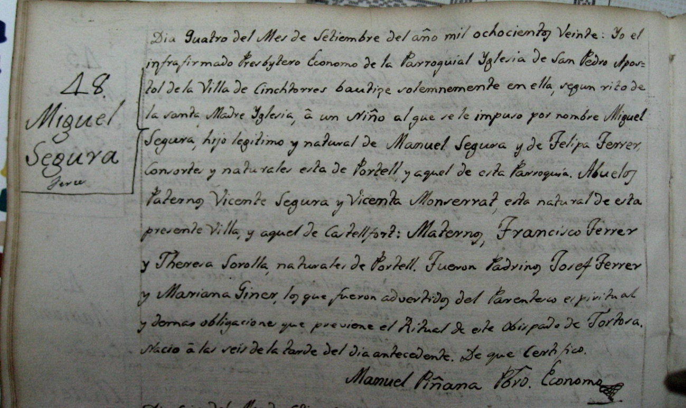

Registro del padrón de Cinctorres 1817

Mas de Clara:

Apellidos: Segura Jordan.

Rosaura Jordán viuda de ¿….Segura. Apellido oriundo de Castellfort

Apellidos: Segura Monserrat.

Vicenta Monserrat de Cinctorres. Viuda de: Vicente Segura Jordan . Hijo Manuel Segura Monserrat. Y seis hermanos más.

Apellidos: Segura Ferrer.

Manuel Segura y Montserrat hijo de Vicente Segura y Vicenta Monserrat de Cinctorres. Casado con: Felipa Ferrer Sorolla de Portell, hija de Francisco Ferrer y Teresa Sorolla de Portell.

¿181…Vicente Segura Ferrer. Sin mas informacion de su fecha de nacimiento.Con su matrimanio con Maria Mestre de Castellfort se inicia nuestra familia a partir del libro de Bautismos de la Parroquia de Cinctorres, en el que tenemos informacion mas detallada de la fecha de nacimiento de los demas mienbros de la familia.

Miguel Segura Ferrer el 4 de Septiembre de 1820.

1831\. 2 Enero. Nace Felipe Segura Ferrer.

1833\. Manuel Segura Ferrer.

1836\. 28 mayo Teresa Segura Ferrer.

Apellidos: Segura Mestre.

Vicente Segura Ferrer hijo de Vicente Segura y Felipa Ferrer casado con Maria Mestre hija de Tomas Mestre y Ana Maria Benlliure de Castellfort.

I839. 20 de Abril.Nace Manuela Segura Mestre, hija de Vicente Segura y Maria Mestre.de Castellfort.

1841\. 20 Septiembre. Nace, Felipa Segura Mestre hija de Vicente Segura y María Mestre de Castellfort.

1844\. 8 de Mayo. Nace, Rosa Segura Mestre, hija de Vicente Segura y Maria Mestre de Castellfort.

185…? Antonio Segura Mestre hijo de Vicente Segura y Maria Mestre de Castellfort.

Aquí empieza los apellidos Julián Segura.

186… Felipa Segura Mestre se casa con Ramón Julián de Morella.

Hijos :

Antonio .Julián Segura casado con …………………

Hijos:

Ramona,

Pepet, (padre de Lucas)

Manuela

Manuela Julián……………. casada con ……………………………………………..Hijos:

Lázaro.

Enrique.

Leonila.

Ramón. Julián Segura. Soltero.

Joseph. Julián Segura. Casado con Manuela Querol del Mas de Sabate. Hijos:

Francisco

Ramón

Juliana

Tadeo

Rosario

Josefina

Manuel

María. Julián Segura casada con Manuel Segura Marti

Hijos:

Maria

Antonio

Manuela

Josefina,

Manuel.

Bernardo. Julián Segura. Soltero

En el testamento dotan a Antonio el mayor (l,amillorat) con el mas de Julián.

Ramón murió en Cuba.

A Josep le dotan con 400 duros.

María .La casa de Morella.

Bernardo Maset de Conill más tarde conocido como Maset de Benardo en Cinctorres.

Cinctorres 23 de Agosto 2013.

Francisca Julián Querol
