r [**<u>Paquita Julián</u>**](http://mayores.uji.es/blogs/antropports/author/al061966/) LA UTILITAT DE LA PEDRA EN SEC.

[<u>  
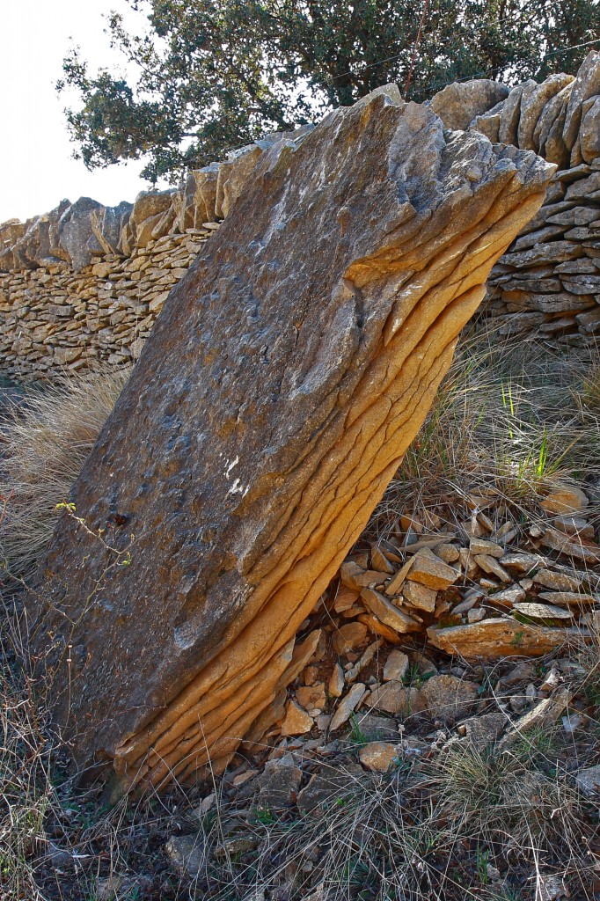

</u>](http://mayores.uji.es/blogs/antropports/files/2012/04/MG_16763.jpg)

L'origen de les lloses. Els Llivis. P. J.

La manera de viure del món rural, està condicionada pel territori, i l’aprofitament del recursos naturals geogràfics que determinen el seu desenvolupament. La modificació física del territori a segut obligat pel imperatiu de la pròpia supervivència. La sàvia arquitectura tradicional de la pedra en sec, és en principi, la utilitat de l’humil pedra seca, matèria  prima, que està a l’abast del mig en que es viu, on tot s’aprofita, en harmonia amb la naturalesa.

La majoria de la pedra de La Comarca dels Ports, es de L’era Secundaria. Aquesta es divideix en tres períodes, el Triàsic, el Juràssic i el Cretaci. El període  Cretaci inferior, implica una ruptura de continuïtat del sediments del Juràssic,al iniciar-se una nova immersió marina que canvia  novament la sedimentació del relleu. Es passa, de sedimentació calcària anterior, a la  sedimentació de sorres i bioclastos. En aquest materials, estan  construïts, els pobles de la comarca i sense donar-nos compte el que més hem trepitjat, com  exemple, les lloses utilitzades entre altres coses, pera fer les parets i eres dels pobles i masos. És pedra de color gris clar, que  s’ajusta a la perfecció en qualsevol construcció.

  Les construccions de la pedra, son degudes a la necessitat de augmentar la superfície i la qualitat del terreny cultivable amb els bancals i tot tipus de parets, separar, fent murs per ha  controlar el bestià  o rabera dels camps de cultiu, així com altres tipus de serveis.

Quan veig,  l’ordenada col·locació d’unes pedres dalt d’altres, sustentades pel  propi pes, la correcta i solida disposició constructiva, com és, la sàvia Arquitectura de la Pedra en Sec, recordo a llauradors i pastors,( tornant* portells* o *solsides* )de les parets de pedra seca a les seues finques. Anys darrere, els homes d’aquestes terres, han fet de arquitectes constructors, amb senzills plantejaments sobre el terreny ,sense planons, amb escasses i rudimentàries ferramentes, aplicant l’antiga tècnica constructiva apresa de pares a fills, i han construït paisatges culturals amb l’humil pedra com l’únic element material. No es el cas d’amuntonar pedra sobre pedra en el que se està construint, sinó de ficar cada pedra al lloc apropiat “.*El bon paredador no es el que agafa una pedra i li troba un lloc adequat, si no el que agafa la pedra adequada, per cada lloc”. *Tota pedra, es deu col·locar damunt de dos i a la vegada esta, davall de dos mes.

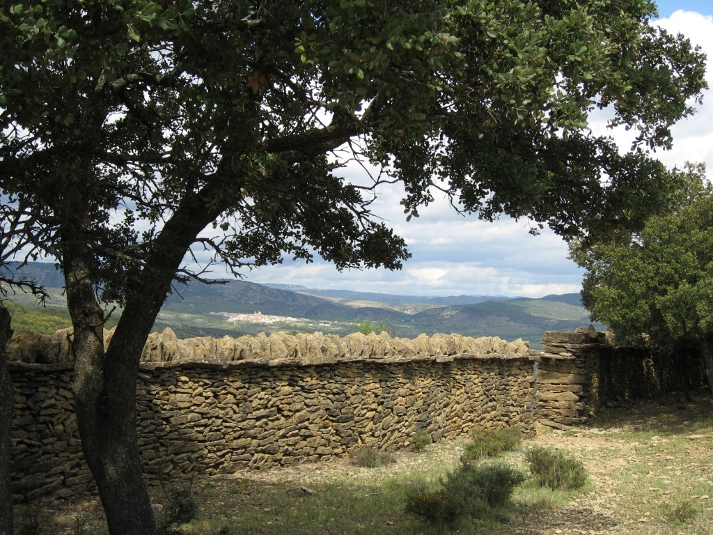

Paret mitgera. Mas de Julian. Al fons, Cinctorres P. J.

*El professor de l’àrea de Geografia Humana de la Universitat Jaume I. Javier Soriano,qualifica,en diferents grups el patrimoni de la pedra en sec, com:* *  La arquitectura de la piedra seca es:* *Patrimonio. Durable.* *Caracter. Comunitario.* *Valor. Superior al real.* *Propiedad. La ciudadania.* *Valor de uso.(Utilidad))* *Valor formal. (Estètica).* *Valor simbólico. (Historia).*

**DIFERENT* * ARQUITECTURA DE LA PEDRA EN SEC**

 **Agrícola**. Bancals, desaigües,parets, ribassos.

**Comunicacions**. Camins empedrats, entrades, rampes, passeres, escales.

**Gestió de l’aigua**. Pous, basses, clots, rentadors, abreujadors.

**Serveis**. Eres, fites, assegadors, parets d’assegadors,trinxeres, parapeto, balmes, refugis, barraques, corrals, neveres, fors de calç.

** AGRICOLA.**

** Abancalar**. Realitzar bancals en terreny erm,netejar, traure les pedres i deixar-les a la vora per aprofitar-les desprès. Els murs d’abancalament (marges) permeten utilitzar per a l’agricultura terrenys amb pendents originals molt pronunciades i de poca terra. El mur d’un bancal ,ha de ser més ample que  la coronació, el( cascall ) o pedra petita, resultant de la neteja del terreny s’anirà posant a l’interior però sempre en profunditat pe r a no trau-la al llaurar.

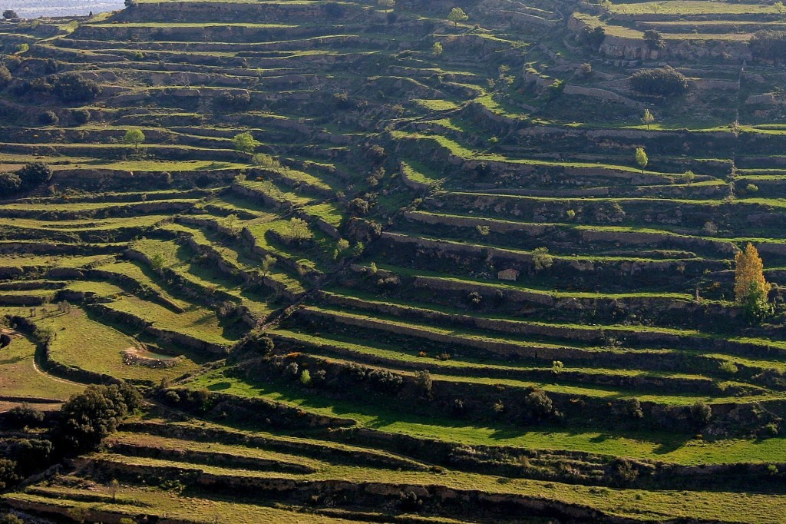

Bancals de Castellfort. P. J.

Una paret de bancal es un mur de contenció de terra, i està sotmesa, a la pressió que exerceix sobre ella la terra que aguanta. Des de el punt de vista mig ambiental, els bancals minoren l’erosió i regulen la funció de l’aigua de pluja , limitant la escorrenteria superficial, retenen d’humitat i afavoreixen la regeneració vegetal i la reforestació. Els bancals formen una finca, més o menys gran segons la superfície útil de conreu. Per a saber la extensió d’una finca, es calculava per jornals. Un jornal, es l’extensió de camp que llaura una parella d’animals de carrega en un dia, que traduït a metres son 3.333m/jornal.

**Comptador. **Obertura de  dimensions adequades fetes a la paret d’una serrada que serveix per facilitar el pas del bestiar oví i cabrum i si convé comptar-lo.També hi han bancals amb xicotetes obertures  a nivell de terra per on poden passar els conills, és una manera de conservar la caça.

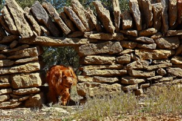

Comptador d'ovelles. Serra Calduc. P. J.

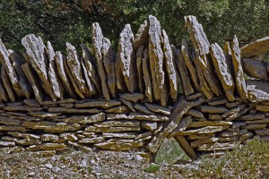

Pessera de conills. Serra Calduc. P. J.

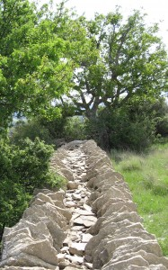

>
>
> Peret doble, Paredó. Serra Calduc P.J.

**Ribassos.    **Marge natural fet entre dos bancalsamb terra i cobert de vegetació espontània. Amb al construcció de ribassos, es controla l’erosió de paisatges de pendents de poca terra y on hi ha tronades.**Paret.** Obra feta amb pedra en sec, alçada en vertical, per tancar un espai de terreny o servir de cara lateral a una caseta o altra construcció. Una paret té que tindre l’alçada suficient per al fi que és persegueix. Una vegada feta l’alçada, la paret es remata amb les (aleres)o pedres posades en un (rastellat) vertical. De vegades davall de les aleres es posa una passada horitzontals de lloses aleró), la seua funció és de evitar que l’aigua de pluja filtre  damunt de la paret També a vegades es freqüent rematar parets o paredons de poca alçada amb lloses planes que permeten transitar per damunt, sense necessitat de xafar la terra de cultiu.

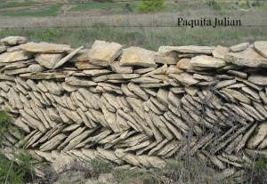

Filigrana. Serra Calduc. Morella.

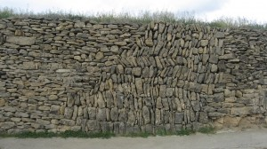

Marge. Cinctorres. Paquita.J.

 **COMUNICASIONS.**

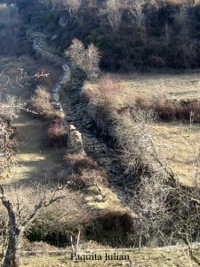

Cami Vell de Sant Pere. Cinctorres.

> **Camins empedrats **.Em copiat les vies romanes?. Els camins empedrats, son camins molt transitats per cavalleries,a vegades per pendents pronunciades i que estan sotmesos a l’erosió provocada per les aigües fluvials, s’empedren per aconseguir una durabilitat quasi eterna.

**Entrades**. Quan la finca quedava  a diferent nivell del camí calia adaptar fer un gran brancal de pedra,  de la mesura necessària

.

**Escales i Saltadors**.

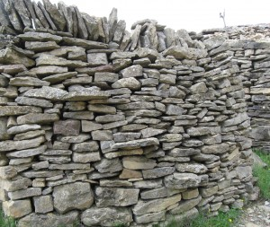

Escales, Saltador. Serra Calduc. P. J.

 Esglaons fets amb pedra a les parets I escales que a vegades estan als graners, on  tenen l’entrada pel carrer, així amb l’alçada es conserva millor el gra.

**Rampes i passeres.** Pera facilitar l’accés d’un bancal es feien rampes amb pedres grans i planes.

**GESTIO DE L’AIGUA.**

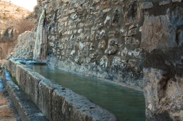

>
>
> Abeurador Castellfort. Paquita.J

**Abreuador. **Bassi. Recipient per abeurar el bestiar, generalment fet amb pedres treballades i degudament ajuntades i recull l’aigua d’una font, un pou o cisterna.

**Basses**. Lloc de recollida i emmagatzemant de l’aigua de pluja, destinada primordialment per ha abeurar el bestià. Les bases son com estanys, construïdes sempre al lloc més adequat en terreny argilós,impermeable, per ha replegar l’aigua de la pluja  i on desemboquen els camins  i les torrenteres de les parts mes altes,  també els desaigües dels bancals. La bassa es rodeja a vegades, de murs de pedra, menys la part d’eon beuen els animals, així està mes protegida de l’erosió del terreny i quan neva, també s’aguanta mes la neu, que filtra poc a poc a la terra.

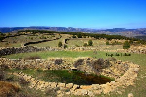

Bassa, Serra Calduc. Morella.

**Clots**. Llocs on l’aigua s’assenta desprès de la pluja i que dura poc, rodejats de pedres a nivell  de terra.

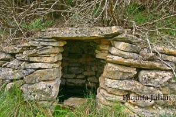

>
>
> Pou Maset de Benardo. Cinctorres                                                         
>
> **  Pous**. La  gestió dels aigua és molt important a les terres del interior. Es un bé escàs a la majoria dels masos. Hi han pous als que els han incorporat una barraca, hi han cassi camuflats en els murs de les parets o (magres),on repleguen l’aigua de les capes freàtiques del subsòl, en barrancs i rambles, camins de pas,i  també pous –aljubs.
>
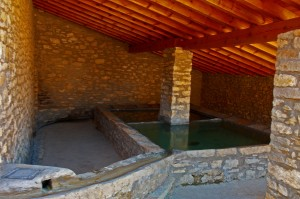

>
>
> Rentadors. Castellfort. Paquita.J

**Rentadors.**Els rentadors comuns, estan construït a les afores dels pobles. Solen tenir una o dos piques,pera  llavar i rentar la roba, estan a coberta .No es així als masos, en que es fan servir les basses  a nivell de terra amb lloses planes a un costar

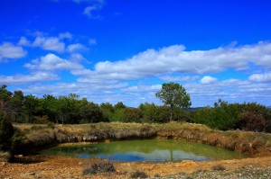

Rentador de mas. Serra Calduc

.

** **

**     **

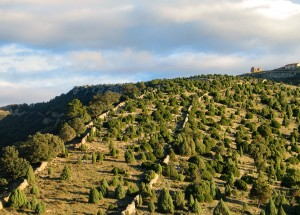

>
>
> Assegador. Vilafranca. Paquita Julian                                
>
> **SERVEIS:**
>
> **Assegadors**. Camins per a la circulació del ramat. Tenen una arquitectura de la pedra molt definida ,quilometres de paret de doble cara delimiten amb aquestes parets les pastures,  els caps de conreu i finques particulars. Els assegadors constituïxen una de les imatges mes característiques d’aquestos paisatges, uneixen els camins ramaders dels pobles, el mateix poble amb diferents partides del terme i masos, mesuren segons el terreny, es el cas dels 8 metres d’ample en la Serra dels Llivis, Cana d’Ares 10 m. d’ample, Les Candeales 15 m. d’ample, Del campello15 m. d’ample, …etc,tots estos en la dena dels Llivis, terme de Morella.
>
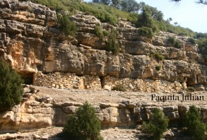

>
>
> Rambla Cellumbres. Cinctorres

**Balmes.** Vuit a les roques ,generalment prop dels rius barrancs o rambles. El pastor o llaurador aprofita l’espai fent paret, deixant una obertura. En cas de necessitat en un refugi.

.**Barraques.**Les obres majors de la pedra, son les casetes o barraques, suposen la consumació de tècnica, equilibri i estètica. Les barraques de pedra seca, son, el paradigma de la simplicitat constructiva i un estalvi  de mitjos, fent servir un sol element, la pedra, proporcionant amb senzillesa un espai habitable pa l’home. Es sempre, un refugi davant les inclemències del temps. Estan adaptades al lloc on es construeixen, per això les podem trobar integrades en algun tipus d’estructura, que l’envolti. Per  mesures son:

**        Menudes**,les que escassament permetent refugiar-se una o dos persones, solen estar integrades en parets o marges. ( portal amb llinda de llosa).

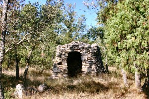

Cinctorres. P. J.

 

      **Mitjanes**. Les que permeten refugiar-se a un grup de persones, també a vegades estan integrades en les parets, o bé mig embeguda en la roca ( portal amb llinda  curta.)

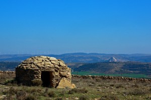

Serra Calduc. Morella. P. J.

**    Grans.  **Generalment, estan aïllades al mig del terreny, i tenen capacitat en cas necessari de donar refugi a persones i animals. La majoria son de planta circular amb diferents   tipus d’entrades, o be d’arc pla, llinda, muntants inclinats.etc. però la més usual és la d’aproximació de filades ,seguint el procés de la seua construcció amb successives filades de pedra una dalt d’altra uns centímetres cap l’interior de la barraca, amb coberta resolta amb la tècnica de falsa volta.(Portal amb aproximació de filades)

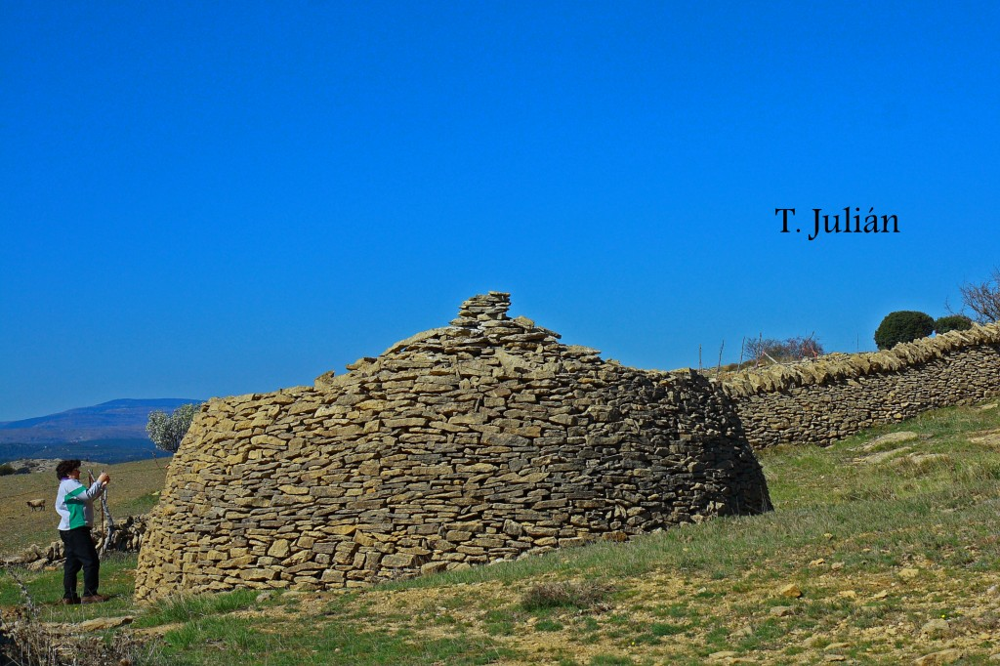

Barraca. Serra Calduc. Morella.

 

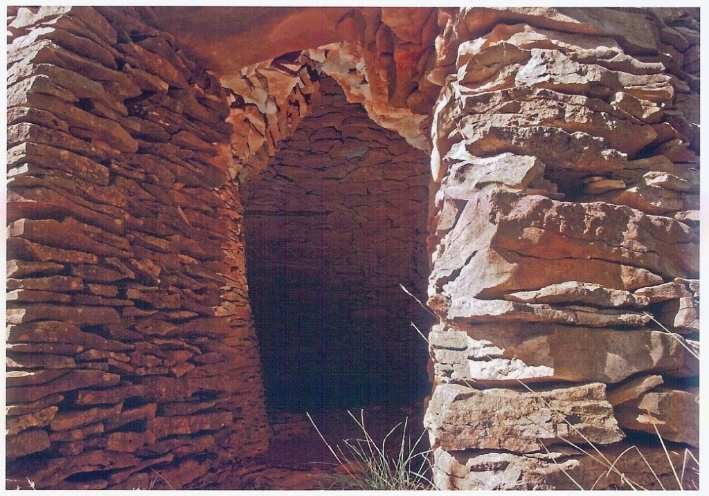

Barraca interior, coberta falça volta. P.J.

 

**Corrals**. Segons el seu desplaçament, poden distingir-ne en dos tipus basics :

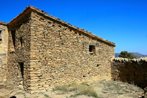

Corrals. Serra Calduc. Morella. P. J.

Els corrals integrats en una vivenda o un altre tipus de construccions, estaven construïts amb un mur de pedra seca, de forma quadrada o rectangular. Una o diverses  parts,limitaven amb la construcció on havia sigut adossat. Les dimensions mes o menys variables estaven determinades pel nombre de caps de bestiar. Per a permetre la circulació de l’aire en l’interior, en cada tros de les parets es practicaven ranures que també servien de desguàs quan plovia o nevava. L’interior esta separat per una apart coberta i altra descoberta pera usar segons el temps, quan plou o neva i els animals no poden sortir a pasturar.

Les parets exteriors, amb pedra alera pa evitar que entres cap animal de rapinya,

Els corrals  aïllats al camp, tenen paregudes característiques** ** 

**Eres. **Imprescindibles als masos .Per menut que siga un mas tots tenen l’era per a batre,prop de la pallissa. Construïda al lloc on més bufa el ven, necessari pa poder ventar el gra i separar la palla, feta, amb lloses, quan més grans millor, i encaixades una al costat de l’altra sense deixar espai. Les eres generalment son rodones.

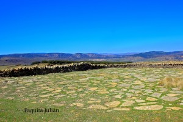

Era de mas. Serra Calduc. Morella.

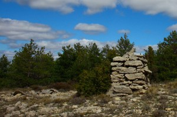

>
>
> Fita de Terme. Portell-Cinctorres P.J.

**Fites**. Munto de pedres, de manera mes o menys col·locades, al lloc en que delimita els termes i finques  de diferents propietaris. Llevar a moure una fita és un delit.

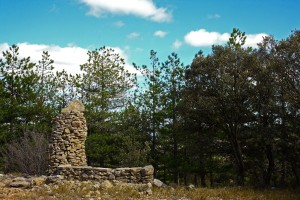

Fita, Mas del Camarero Cinctorres P. J.

**Forns de calç. **La calç s’elaborava coent la pedra calitja. Tenir un forn de calç, era usual als masos i també als pobles,  la seua construcció era de pedra seca, s’havia de triar un marge  amb l’altura relaciona en la grandària que hi havia que donar al forn. Consistia en una peça buida de forma cilíndrica,anomenada olla, que hi havia d’estar soterrada a l’interior del magre excepte la par frontal on hi havia la boca del forn .La part superior sortia un poc per dalt del nivell inferior del magre. Les parets del forn eren de pedra seca.

.**Nevera.** Pou de neu, aquest  es redueix a simples clots construït vestits de pedra, d’una fondària no excessiva, al voltant de 6 m. Generalment la construcció no te coberta. Quan s’ha de conservar, la neu,una capa de branques de pi damunt substitueixen la funció de sostre. La nevera pròpiament dita és més sofisticà. Solen ser més grans que els pous,però construïts con ells, rodats de pedra seca. També tenen coberta. Aquesta pot esta feta amb una falsa volta  de pedra o utilitzant columnes i nervis. La part superior de les neveres sobresurt per damunt del nivell de la terra, la resta de la nevera està soterrada obtenint així aïllament tèrmic respecte de la temperatura exterior. Entre el nivell del pis exterior i la teulada solen haver una o diverses finestres de dimensions suficients com per  a que càpigues una persona . Son aquestes les vies de entrada i sortida de la neu.

**HÀBITAT I REFUGI DE LA FLORA I FAUNA.**

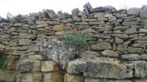

Rosella. Paquita J.

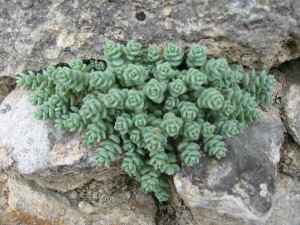

Paquita J.

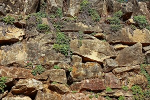

Diferent Flora. P. J.

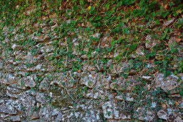

Hedra P. J.

Les construccions de pedra en sec, es converteixen en un habitat a vegades indispensables  per  la flora. Certa vegetació es típica dels ribassos i parets,on tenen un bon ecosistema, els líquens i murgó creixen en les zones d’ombria. També la fauna, té el refugi entre les garites de les construccions de pedra. Els caus dels conills sempre estan en forats a les parets a ras de terra,sargantanes, caragols, eriçons, ratolins, serps, i altres animals segons el terreny.

** **

** La LEY 4/1998, del 11 de junio, de la Generalitat Valenciana, del Patrimon iCultural Valencià,  Título I,Capítulo I, artículo 1 dice: “El patrimonio cultural valenciano está constituido por los  bienes muebles e inmuebles de valor histórico, artístico, arquitectónico, arqueológico, Paleontológico,  etnológico, documental, bibliográfico, científico, técnico, o de cualquier otra naturaleza cultural, existentes en el territorio de la Comunidad Valenciana o que, hallándose fuera  de él, sean especialmente representativos de la historia y la cultura valenciana.”**

*** LA LEGISLACIÓ.*** *Ante el futuro panorama que se presenta a las construcciones de piedra en seco, es necesario que: se creen leyes específicas para la protección de este tipo de construcciones, para controlar su conservación, intervenciones inadecuadas o su total destrucción.*

* * ***CONCLUCIÓ.*** Tot tipus de construccions  de pedra en sec, per senzilles que siguen tenen la seua importància, estan construïdes al lloc que li pertany, els homes, ho han fet amb la saviesa que els dona el coneixement del terreny i les seues necessitats. És un model d’arquitectura pràctica, minimalista, integrada amb el ambient. Aleshores és,** paisatge del oblit i del silenci.**

**BIBLIOGRAFIA.**

Cebrián Gimeno, Rafael: La arquitectura de la piedra seca, Carena editors, s.l. 2011.

Cinctorres, volum I : Introducció a la Geologia. Cintorres Club. 1999.

Julian Querol. Francisca: Masos de Morella, Publicacions de la Universitat Jaume I, 2006.

Martí, Miguel Angel:La pedra en sec a Bennafigos.

Miralles Francès, Monfort Julio, Marín Margarita: Els Homes i les pedres, Servei de Publicació  Diputació de Castelló, 2002.

Soriano Martí, Javier: Area  de Geografia Humana. Universitat Jaume I.
