**0. INTRODUCCIÓN.**

Este trabajo se enmarca en la asignatura de Antropología, de la Universidad para mayores de la UJI. El objetivo es analizar desde un punto de vista antropológico y cultural un municipio de la provincia de Castellón, realizar una cuidadosa tarea de búsqueda de información y documentación, reflejar los principales hitos culturales y características de la población y, en definitiva, seguir aprendiendo. En concreto, se estudia y analiza la localidad castellonense de Salzadella.

**1. JUSTIFICACIÓN**

Cuando en este mi segundo curso de la Universidad para mayores de la UJI, en la asignatura de Antropología, se me dio la opción de hacer un trabajo sobre algo que nos interesara y nos permitiera disfrutar investigando, no tuve ninguna duda, elegí Salzadella. Yo no soy nacida allí, pero tuve la gran suerte de tener que vivir en este pueblo por motivos profesionales, durante 12 años. Fui muy feliz y guardo un recuerdo muy entrañable de esa época y creo que, ahora, después de tanta investigación sumada a los recuerdos y a las enseñanzas que me han aportado sobre qué son y como son, me puedo considerar una "Salsadellenca" más.

Los dos primeros apartados han sido muy interesantes pero, el bloque tercero, en donde hablo de las costumbres, oficios desaparecidos y estructuras sociales del pueblo, ha sido para mi la parte más entrañable y tierna de todo mi trabajo porque, para poderla desarrollar he tenido que entrevistar a los abuelitos del pueblo y les he hecho revivir tiempos pasados, tiempos que, cuando se cumplen muchos años, siempre parece que fueron mejores. Y los relatos fueron tan dulces, tan emocionantes y tan entrañables que no tienen cabida en la mente de un adulto... solo podía plasmarse esta inocencia en la boca de una niña, por eso la protagonista es Carmencita, una niña de ocho años de los años sesenta que lo escribe en forma de diario.

Por lo tanto, mucho de lo que aquí relato lo he vivido y disfrutado, estos escenarios los he recorrido. Espero conseguir que, al acabar de leer este trabajo, sientas unas ganas enormes de visitar esas tierras y yo, sin que nadie se entere, te diré cuando tienes que ir para acabar de enamorarte del todo. Pero eso será al final

**2. CARACTERÍSTICAS DEL MUNICIPIO**

El municipio de la Salzadella se encuentra situado en la comarca del Alto Maestrazgo, al pie de las estribaciones occidentales de las Atalayas de Alcala,  en la provincia de Castellón. En el año 2011 contaba con 870 habitantes, ocupa una superficie de casi 50 km2 y su altura media es de 339 metros sobre el nivel del mar.

La economía de la Salzadella es eminentemente agrícola y ganadera(porcina).Entre los cultivos tradicionales (almendro, olivo…) es destacable por su fama y calidad ¡la cereza!.

**3. ETIMOLOGÍA**

El nombre de Salzadella significa bosque de sauces. Actualmente no queda ninguno, pero hay constancia de la presencia de estos bosques. Existen 2 cartas en el archivo municipal que lo atestiguan. En una de ellas, del año 1594, se relata que “*en un gran bosc de salzes que tenim en aquest terme*“. En la otra carta se menciona, que se necesitaba de 25 a 30 hombres para vigilarlo.

Como ya he dicho, la Salzadella se encuentra situada en la comarca del Maestrazgo. La palabra “maestrazgo”  proviene de maestre o jefe o primera dignidad de una orden militar.

**4. ORÍGENES**

**4.1 Prehistoria e historia antigua.**

Esta zona fue poblada por íberos en el silo VI a. C, luego por fenicios y griegos. Se sabe por los restos de cerámica en las que aparecían escenas de la vida cotidiana, hallados en la zona.

En el siglo II antes de C. comienza la romanización de estas tierras que dura 7 siglos, en las que se construyeron magnificas vías de comunicación: la vía Hercúlea que enlazaba Roma con la Bética (Andalucía). Esta ruta primitiva era utilizada por los pueblos indígenas pre- romanos. Fue en tiempos de Augusto cuando cambio de nombre y pasó a llamarse Vía Augusta y ya, posteriormente, *Cami dels Romans*. En el borde de estos caminos se acostumbraba a poner estatuas, templos, arcos y se señalizaban con las llamadas piedras miliares.

Todos estos antiguos pobladores estaban por esta zona, pero en concreto, respecto al municipio de la Salzadella se considera que su fundación es árabe. Pero antes de este pueblo, ¿qué hubo? No se sabe con certeza, aunque distintas fuentes documentales hacen referencia a dos asentamientos, la *Cuadra Mitjana* y *Intibilis*. No se conoce la localización exacta de ninguno de ellos, ni tampoco si son el mismo asentamiento con distinto nombre. Tampoco se puede afirmar si alguno de ellos, o los dos, fueron los precursores de la actual Salzadella.

Entre San Mateo y Tirig existió un pueblo llamado la *Cuadra Mitjana*. Actualmente existe un camino  que se denomina así. Allí se halló una especial sepultura, en la partida “*dels Peters*” que contenía  dos enterramientos, donde se encontraron varios objetos de plata del siglo IV A.C El más importante es un broche de bronce con damasquinados de plata

En una descripción del itinerario de Antonino Augusto Caracalla, sale a relucir que pernoctó en *Intibilis*, y se sabe que fue una ciudad muy famosa,  porque en ella se dieron importantes batallas entre romanos y cartagineses.

Posteriormente, labrando un campo, aparecieron restos de cerámica de diferentes épocas y piedras labradas donde se contempla  una estela visigótica. Por lo que  se deduce que, el poblado de *Intibilis* o *Cuadra Mitjana*,  se mantuvo hasta la edad media.

**4.2 Historia medieval**

Sea como fuere, sean estas localidades precursoras o no del actual Salzadella, lo cierto es que como tal, fue una fundación árabe. Se sabe con certeza porque no fue citado por escritores romanos. No aprovecharon para su edificación ni ríos ni nada que sirviera para la defensa natural del pueblo y desarrollaron un sistema de riegos con acequias en una zona llamada “*la Llacuna*”, que actualmente, cuando llueve, se inunda.

Entre 711 y 718, esta tierra es conquistada por las bandas de Tarik y Abd-el-Aziz y dura el dominio musulmán 5 siglos. Esto trajo muchos beneficios, pues mejoraron la red de riegos de los romanos, se crearon las famosas norias (*senies*) y floreció la cerámica, en especial la de Traiguera. También introdujeron el cultivo del almendro.

La estructura del pueblo, por tanto, se considera arábigo-medieval, con calles estrechas e irregulares, casas con azotea y pocas ventanas.

Conserva varios arcos medievales, como el de la Bassa o el de les Coves. Son las antiguas e históricas puertas de acceso al recinto amurallado medieval de la Salzadella. Destaca en ellas el arco de medio punto de sillares. Están realizados íntegramente con mampostería, dando acceso a calles del antiguo núcleo medieval. En la localidad aún se conservan casas con arcos de medio punto. Se cree que el año de construcción de estos es alrededor del 1294. Según documentos la construcción de las murallas de la Salzadella coincide con el transcurso de la repoblación cristiana, durante los siglos XIII y XIV, periodo de fortificación de la mayoría de los pueblos del Maestrazgo

La expulsión de los moriscos  se realizó 1609 y Salzadella fue repoblada por cristianos de territorios que forman la actual Catalunya y Aragón, como lo indican los apellidos que tomaran de sus pueblos de origen: Albiol, de Tarragona, Calonge de Gerona, Fraga de Huesca, Ripoll de Barcelona y SegarPortal medieval de les Coves

La localidad de Salzadella pertenecía, en estas fechas, al señorío de las Cuevas de Vinromà. El primer señor de las Cuevas de Vinromà fue el célebre y glorioso caballero D. Blasco de Alagón, que contribuyó a la reconquista de todo Castellón. Éste otorgó la Carta Puebla de Salzadella en 1.236 a D. Miguel de Ascó y a D. Pedro de Alsina, a los que les impuso unos privilegios y unas obligaciones, y les prometía protección y justicia. Se les señalaba un censo anual, a satisfacer en trigo, en la Virgen de Agosto. Les recordaba la obligación de pagar diezmos y primicias. Además, señalaba los límites del término municipal.

Todo esto  se escribía en un documento, se sellaba y se decía que no podía ser revocado por nadie, a la vez que se hacía con testigos. Esta Carta Puebla se destruyó en el 1936 pero todo lo anterior se sabe en la actualidad porque se conservan las Cartas Pueblas de las Cuevas, Tirig y Albocàcer.

A la muerte de Blasco de Alagón, sus bienes fueron confiscados, y se sabe que Jaime I concedió el castillo de Cuevas de Vinromà a la Orden militar de Calatrava y que Salzadella era la villa más importante, pues pleiteaba con los otros pueblos de la Tenencia de  Cuevas de Vinromà.

La Orden de Calatrava  permutó  la Tenencia de Cuevas, por Calanda, con Artal de Alagón como biznieto del primer señor de Salzadella.  Pese a todo, por desavenencias con el monarca Jaime II, éste perdió su señorío y pasó a depender de la corona, para más tarde ser cedido por éste a la Orden del Temple.

La Orden del Temple fue disuelta en 1317 por orden del papa Clemente V y sus bienes fueron confiscados. Entonces, pasó a pertenecer a otra nueva orden creada por el propio rey de Aragón. Dicha orden era la de Santa María de Montesa o de San Jorge de Alfama. Inmediatamente, pidieron al rey que les concedieran los privilegios que tenían antes los templarios.

El territorio estaba gobernado por el Gran Maestre, de ahí el nombre de la comarca. Básicamente, este personaje gobernaba todos los pueblos de dicha zona. El último Gran Maestre fue Pedro Luis Galcerán y de Borja, que la gobernó hasta su muerte en 1592. A partir de ahí, el rey fue el Gran Maestre de la Orden y, por tanto, Señor de la Comarca..

El rey nombraba un lugarteniente y capitán general, que residía en San Mateo  y quien,  a su vez, designaba sus lugartenientes y capitanes, que residían en sus encomiendas y gobernaban las villas, castillos y y pueblos de Montesa comprendidos entre el rio Cenia y el Mijares.

En 1784 murió el último gobernador de San Mateo (frei José Garcés de Marcilla). Entonces se suprimió este cargo y, en su lugar, se nombró un Justicia Mayor que, posteriormente pasaría a llamarse Alcalde Mayor, cargo que desapareció en vísperas de la guerra Carlista. Así murió la Orden Militar de Santa María de Montesa y de San Jorge de Alfama.

El Justicia Mayor se elegía cada año.

Los miembros del consejo proponían seis candidatos cada uno, en una votación. Los seis que mejores resultados obtuvieran, entrarían en un sorteo para ocupar dicho cargo. Una vez elegido el candidato, debía hacer juramento y nombrar su lugarteniente.

El cargo se ocupaba de todo lo referente a los asuntos del territorio. Ello quedaba registrado en unos libros llamados *JUDICIARIS*.

A partir de allí el pueblo disponía de más servicios y cargos como los Jurados, El Mayordom o *Mustaçaf*, el *Saig* (ministro de justicia), el *Guardia dels bens* (guardia del campo), los cuales se elegían de forma más o menos democrática, pero siempre pasando por el Consejo

**Portal de les Coves**

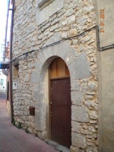

**Portal de la Bassa Vivienda portal de medio punto,**

**4.2.1 Visitantes ilustres de la Salzadella**

Hacia 1403 hubo tres papas al mismo tiempo, y uno de ellos, el **Papa Luna o Benedicto XIII de Aviñón** (Illueca, Zaragoza, 1328 - Peñíscola, Castellón, 1423), parece probable que  estuvo en Salzadella, ya que recorrió las tierras del Maestrazgo. Al decaer su popularidad, se fue a vivir a Peñiscola,  después de haber intentado establecerse en alguna parte de las tierras de Aragón.

El rey de Aragón, Fernando I, quería que el Papa renunciara a su papado, para ello le ofreció una entrevista en Morella en el verano de 1414.

Se sabe que el Papa se detuvo en San Mateo y que fue a la Salzadella porque unos intendentes le solicitaron ayuda para resolver unas cuestiones pendientes. La visita del Papa supuso una gran actividad económica en la zona, ya que éste tenía un gran séquito.

Otro ilustre visitante de esta localidad fue **Alfonso V  el Magnánimo** (Medina del Campo, 1396 - Nápoles, 27 de junio de 1458). Encontramos archivos que demuestran que pasó por Salzadella en 1423-24.

Se recibieron órdenes reales para que el pueblo arreglase los caminos por donde tendría que pasar el rey, que se dirigía a Valencia para ser coronado.

Por último, se sabe por diversas citas del Juradesc, que también **una infanta** visitó esta localidad. Infante es cualquier niño menor de 7 años. También se refiere a los hijos del Rey que carezcan de la condición de Príncipe o de Princesa, y a sus hijos.

Por dichas citas se sabe que el pueblo crió a una infanta del rey, concretamente el carnicero y su esposa (Berenguer Pastor). Parece ser que no se trata de una vulgar expósita por varias razones. En  primer lugar por el apelativo “infanta” con el que siempre se refieren a ella dichas crónicas y nunca la llaman con palabras despectivas como “borda”, “bastarda” u otras. También porque parece que sea una excepción el trato que le dan. En  tercer lugar, porque se encarga el municipio de pagar la crianza de la niña durante casi un año. Por contra,  no se sabía de quien era hija la infanta. Lo cierto es que al pueblo se le pagaba un muy generoso sueldo para la crianza de esta niña.

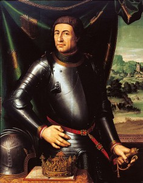

Alfonso V el Magnanimo Coronación del Papa Luna

Escudo de la Salzadella con un sauce en el centro

 Bibliografia

*Els enterraments iberics del Espleters de Salzadella*. Joan Coromines. Anuari VI 1915.

*El Maestrazgo historico Morella ( puertos y comarcas)*. Manuel Milian y Juan Bautista Simó. Historia y Arte.

[www.wikipedia.org](http://www.wikipedia.org)

**5 PATRIMONIO HISTORICO. BIENES ETNOLOGICOS**: **Els Peirons.**

Els Peirons son unas monumentales cruces de piedra que se empiezan a construir en la Edad Media. Estaban ubicados a la entrada de los pueblos con el fin de mostrar a los viajeros la fe de sus habitantes. También se usaban para indicar la localización de un espacio sagrado (ermita o santuario), los límites del término municipal o para recordar una fecha de interés local; su construcción corría a cargo del consejo municipal o de algún rico habitante de la localidad.

La estructura de los Peirons consta de varias partes. En primer lugar una gradería de planta circular, cuadrada o poligonal, compuesta por dos o tres escalones. Encima de ella se alza el fuste, que puede ser circular u octogonal, con un eje de cobre central (ánima) para enlazar los diferentes elementos del monumento.

El capitel puede tener muchos adornos, pero el peso ornamental y simbólico recae sobre la cruz, que suele tener como protagonistas al Cristo crucificado en el anverso y a la Virgen en el reverso.

La decoración de estas cruces puede ser muy variada. A veces aparecen motivos florales, santos, apóstoles e, incluso, a los que han sufragado el monumento, mediante su escudo heráldico. Cuando lo sufraga el erario público, aparece el escudo de la villa o de la corona.

En Salzadella se empezaron a poner en el 1.407, llegando a seis el número total de cruces en el siglo XVI. Pero en el siglo XX solo quedaron dos en pié. Estos fueron derruidos en la guerra civil del 1.936. En la actualidad se han reconstruidos tres, de los cuales, dos de ellos se encuentran en su ubicación original, excepto el de San José que originalmente se encontraba en la salida hacia San Mateo.

Actualmente el Peiró de Santa Bárbara está junto a la ermita homónima, en la carretera que, desde Salzadella, conduce a Tirig. El Peiró de Sant Josep está en el *Camí de la Cantera* o *Camí del Cementerio* y el Peiró de Les Coves se accede por la carretera CV-10 a la altura de PK 56,5 y está junto a la carretera.

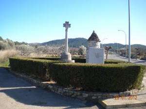

> El peiró de Sant Josepet

**6. PATRIMONIO HISTORICO. BIENES ETNOLOGICOS: La ermita de San José**

 En la vida de los habitantes de Salzadella tiene mucha importancia esta ermita, a quien este pueblo profesa auténtica y sentida emoción, y a la que acude en sus tribulaciones y alegrías.

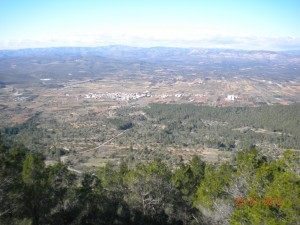

Por eso Salzadella le dedica un día al año, el *Dia Salzadellà Josepíssim*. Este día la comunidad salsadellense se reúne en la cumbre de una de sus montañas más altas desde donde se divisan espectaculares paisajes: altas montañas, llanuras espaciosas salpicadas con muchos pueblos y masías, y allá a lo lejos, el mar.

Esta montaña, *el Puig de Sant Josep*, es sin duda alguna la más bonita. Tiene forma de cono y es totalmente verde, pues la recubre un manto de frondosos pinares a los que, de momento, San José ha preservado de los incendios. Su cima tiene una altura de 635 metros,  en donde se ubica  la ermita, visible desde el pueblo.

** 6.1** **Características de la ermita.**

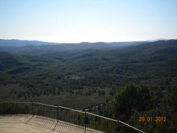

La ermita es pequeña, tan solo 42 m2. Ni la superficie en la cúspide de la montaña ni los medios constructivos de la época dieron para más. Es una construcción de mampostería con las esquinas de sillares. El acceso al interior se efectúa a través de un arco de medio punto, también de sillares bien trabajados. En su interior encontramos una única nave dividida en dos tramos por un arco de medio punto, con el techo en bóveda de cañón. La cubierta exterior a dos aguas está realizada con tejas de tradición musulmana, decorada con una espadaña de hierro en la fachada.

**6.2  Historia de la ermita.**

Las primeras noticias sobre su existencia son del siglo XIV, y según parece, estaba dedicada a San Cristóbal. Los promotores de la construcción de la ermita fueron ermitaños, que en este siglo invadieron toda España fruto de un fervor religioso insólito y ansias de vida solitaria.

Esta información proviene de un gran investigador y amante de la ermita, y del pueblo de Salzadella, Josep Miralles, o *Mosén Pepet*, como era conocido por todos en el pueblo. Este sacerdote trabajó en el pueblo durante la mayor parte de su vida, y fue él quien, a petición popular, inició los trabajos de restauración de su ermita. Así, pues, según su investigación la ermita estuvo dedicada al mártir San Cristóbal hasta, al menos, 1670. Esta afirmación se basa en un texto encontrado por él en los archivos municipales:

*Per una lliura de biscuit per a un refresc al reverente clero que pujà e pregàries la present vila al gloriós Sant Cristòfol per aigua en abril del present any 1670, nou sous.*

Así pues, hasta 1670 al menos, la ermita estuvo dedicada a Sant Cristòfol, San Cristóbal.  El cambio de advocación, en el siglo XVI, parece que estuvo motivado por la labor de los franciscanos de promocionar y difundir la devoción a San José, figura que estaba muy olvidada.

Puede parecer extraño que se realice un cambio de “titular” en una ermita por caprichos de la moda, pero hay muchos casos bien documentados en localidades cercanas: Sant Mateu (de San Antonio Abad a la Virgen de los Ángeles), Zorita (de Santa María Magdalena a la Virgen de la Balma), Cabanes, Benlloc, Tírig…

Esta labor franciscana de promoción trajo otra consecuencia: se empezó a bautizar con los nombres de José y Josefa. En 1538 se empiezan a registrar los bautismos del pueblo, y en 1553 aparece el primer bautizado con este nombre, José Montull. El segundo es José Cifre en 1573, y en los siglos XVII y XVIII son los nombres más frecuentes en el pueblo.

En cualquier caso, en 1738 la ermita ya había cambiado de titular, según un texto encontrado por Mosén Pepet en los archivos parroquiales. Además, de finales del siglo XVIII se conserva el único exvoto que se salvó del fuego de 1936, con la siguiente inscripción:

Prodigioso milagro que obró en el año 1793 el Patriarca San Joseph el de la villa de Salzadella, colocado en el monte. Yendo embarcados el Padre Joseph Calduch, religioso capuchino, se perdieron después de haber sido perseguidos por los yngleses, pues estando el patrón y el piloto llorando les dixo el referido padre que tuviesen fee, que él tenía un piloto que les sacaría del desconsuelo, pues sólo les quedaba comida para un día, y al día siguiente a la madrugada salieron a tierra salva rindiendo gracias al Santo. A expensas de un devoto”.

El Miracle de Sant Josep.

Era una nit molt refosca

de trons i rellampecs

quan va pujar Enric Folch

a salvar a Sant Josep.

Això era al mes d’agost

quan la guerra va esclatar.

A espantes i tabalades

la porta la va forçar

i Sant Josep a l’esquena

Enric Folch se’l va posar.

Ací caic jo i allà m’alço

als Reguers el va portar,

i en una paret de pedra

el nostre sant va amagar.

I quan d’ell se despedia

li va dir a l’orelleta:

En 1938 se iniciaron los trabajos de restauración de la ermita, maltrecha por lo ataques antirreligiosos de 1936: sólo quedaba en ella las paredes y el tejado, se habían perdido los altares, los retablos, las imágenes y los ornamentos. Se salvó la imagen del santo, gracias al fervor religioso (aunque un tanto interesado) de un vecino del pueblo, Enrique Folch. Su hermano, Francisco Folch, escribió una poesía donde cuenta la gesta de su hermano:

“si no me salves a mi

i a tot lo de casa meua

per sempre estaràs roblit”.

El dia següent dos antics

salzadellas van pujar

per cremar-lo a la placeta.

Quin susto se’n van portar

en vore la porta oberta

i que el sant no estava ja.

Lliberat el nostre poble

a l’alcalde va parlar

Enric Folch que Sant Josep

ell el tenia amagat.

En provessó, dels Reguers,

tot lo camí el va pujar,

llarg camí, forta costera,

el mateix que el va baixar.

I en aplegar a l’ermita

a l’altar el va dixar.

Oh, jóvens d’avui en dia

que en miracles no creeu!,

Tots los ganaos del poble

se van perdre, i no el d’ell:

el de Folch. en vindre el front

lo va salvar Sant Josep.

Vixca Sant Josep!

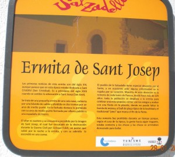

La romería se restableció con normalidad hasta la década de los 50, donde por razones forestales (evitar el fuego de los bosques) se suspendió. En la actualidad, una tablilla situada en la fachada de la ermita explica este capítulo de su historia, aunque la razón que alega, la extraoficial, deja bien a la vista que el fervor religioso de la romería no estaba reñido con la buena vida: los hombres se arrimaban demasiado a las chicas en esta romería, cuando tras la comida ya iban un poco alegres por el vino.

 Fue el mismo Mosén Pepet quién la restablecido en 1971. Poco a poco, gracias a aportaciones de vecinos del pueblo, la ermita recuperó esplendor y lustre: campana, pavimentación del camino, restauración de la imagen de San José (salvada *in extremis*del fuego por el héroe local), pintura…

**6.3 La romería a Sant Josep**

El lunes de Pascua se dan cita las autoridades locales en el Ayuntamiento a primera hora

de la mañana. De aquí parte la comitiva presidida por el sacerdote y secundada por todo el pueblo. Se inicia el bonito ascenso hasta la cima del Puig de Sant Josep. El recorrido pasa al lado del conocido cariñosamente como Peiró de Sant Josepet, por el cementerio

y entre pinos hasta la parada obligatoria a mitad del camino. Allí se degustan un dulce y una copita de moscatel, para recargar fuerzas.

Una vez en la cima se realiza un “pequeño” almuerzo, a base de carne a la brasa: longanizas, chuletas, morcillas… Con el espíritu recuperado tras la caminata se acude a la misa, a las 12. En ella se cantan los gozos a San José:

**Gozos  a San José**

Pues sois santo sin igual

Y de Dios el más honrado,

sed José nuestro abogado

en esta vida mortal.

Antes de veros nacido

os visteis santificado

y  así de gracia adornado

y  en todo favorecido

nacisteis esclavecido

linaje y sangre real.

Vuestra vida fue tan pura

que en todo sois sin segundo,

después de María el mundo

no vio más bella criatura,

rara fue vuestra ventura

entre tanto siendo tal.

Vuestra Santidad declara

al mismo Dios con certeza,

cual paloma en tu cabeza

se paró la seca vara

floreció sin que dudara

nadie viendo esta señal.

A  la vista de este portento

merecisteis por esposa

la más santa y más hermosa

a  María ¡Oh, qué portento!

lograr vos el casamiento

con la Reina Celestial.

Con júbilo recibisteis

A  María por esposa

Virgen, pura, santa, hermosa,

con la cual feliz vivisteis

y  por ella conseguisteis

dones  y luz celestial.

Oficio de carpintero

ejercisteis en vida

para ganar la comida

a  Jesús, Dios verdadero,

y  a vuestra esposa y lucero

compañía virginal.

Tras la misa y los cantos, las “pandillas” se juntan para preparar la comida a base de paella. El Ayuntamiento prepara el “rancho” para las autoridades: alcalde, concejales, médico, veterinario, farmacéutico, Mosén Pepet (o quién le sustituye desde su muerte, hace pocos años), la Guardia Civil… Este rancho se degusta bajo techo, en una espacio aledaño a la ermita, mientras que las pandillas se distribuyen por la montaña.

La comida copiosa se debe bajar con algo de actividad, para lo cual se realiza un baile, a cargo de la banda municipal. Se inicia con el "B*all pla" *, típico de Salzadella, y se continúa con pasodobles. Esto está aderezado con una copita de moscatel, cortesía del Ayuntamiento (entiendo que para evitar algún desmayo por la falta de alimento).

Los comerciantes aprovechan para montar “*paraetes*” con dulces, turrones, juguetes para los críos…

Es una fiesta dedicada a San José, destinada a satisfacer necesidades divinas y otras mucho más humanas: la comida y la bebida, el buen vino y el moscatel, la reunión de las pandillas, los dulces y turrones, las risas, la unión de las gentes del pueblo que, con la excusa de venerar a su santo, pasan uno de los días más entrañables de todo el año.

**7. Bibliografía**

*La ermita de San José de la villa de Salzadella*. Josep Miralles. Centro de estudios del Maestrazgo, boletín nº30, Abril-Junio 1990.

*La villa de Salsadella.* Jose Miralles Sales. Sociedad castellonense de cultura, obras de investigación histórica.-XLIX.

[www.wikipedia.org](http://www.wikipedia.org)

** 8. Fotos**

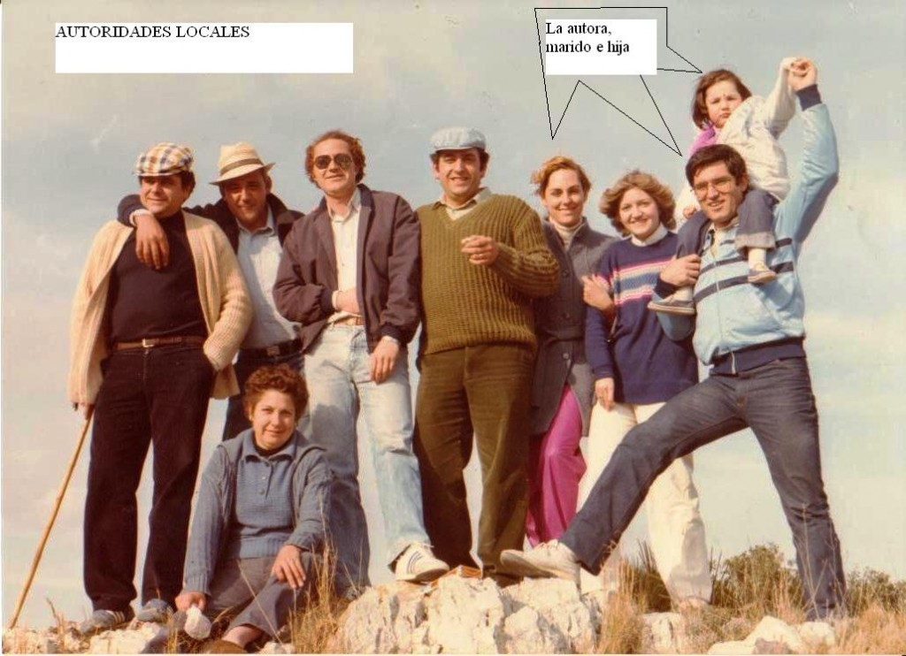

>
>
> La autora del trabajo con su familia y las autoridades locales en la romería de Sant Josep, en el año 1984.
>
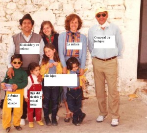

>
>
> La autora con el alcalde y su familia, en la ermita de Sant Josep el año 1985

** P.d La mejor época para ir a visitar Salzadella**

En la introducción prometí confesar cuando es el mejor momento para ir a visitar esta maravillosa localidad del Maestrazgo. Pues bien, ha llegado el momento de decir la verdad.

La mejor época para visitar Salzadella es durante la floración de los miles de cerezos que llenan sus campos. ¿Y cuándo es esta floración? Pues depende de las temperaturas, de la cantidad de lluvias, de si hay muchos días nublados o si el sol brilla constantemente. Capricho de las musas, en resumen. Preguntadles a ellas.

Venga, vaaaaaa, os daré una pista: este año 2012 será la última semana de marzo y primera de Abril. Después de la floración hay una feria de la cereza, que es espectacular y merece la pena ser visitada. A finales de junio.

En la floración o en la fiesta de la cereza, **¡¡en Salzadella nos vemos!!**

**p.d.2. Una mención especial.**

En una de las fotos de la romería aparece el alcalde, su señora y su hija Isabel. Actualmente Isabel es jueza, ha sacado esta dificilísima oposición y estamos todos muy orgullosos de ella y de sus padres. Desde aquí, una vez más, **nuestra enhorabuena Isamari!!!!!**

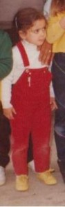

**LA VIDA DE SALSADELLA EN LOS AÑOS 60**

 Este relato pretende dar una visión general de como se vivía en esa época. Todo lo que describiré es verídico y lo único que es ficticio es el personaje de Carmencita, aunque, en realidad, podríamos haber sido cualquiera de nosotras.....

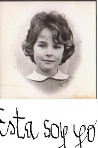

**DIARIO DE CARMENCITA **

¡Qué maravilla! Como cada año me acaban de dar mi regalo. Todos los niños esperamos con mucha ilusión este día y ya ha llegado! El Sinyo Daniel, es muy bueno y esta vez nos ha traído un cuaderno, aunque él dice que se llama diario. Ha venido a nuestra escuela de chicas primero y nuestras maestras, que son dos (Dña. Vivin y Dña. Emilia) nos han explicado lo que significa la palabra diario. También nos han dejado muchos lapiceros y un aparatito que se llama *“sacapuntas,”* pero como no sabemos lo que se pone en un diario, él nos ha contado su historia para que empecemos a escribir. Yo las palabras que no entiendo las pondré en otro color y así me dejarán más veces el  sacapuntas para que lo use.

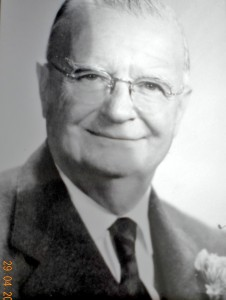

> El señor Daniel Montull.

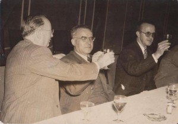

**REDACCION DE CARMENCITA ( 8 años)**

Todos sabéis que me llamo Daniel Montull Segura, vivo en México y que soy rico, pero quiero que conozcáis mi vida y aprendáis de mi. He nacido  en el 1888 y mi padre se llama, German Montull   y fueron 10 hermanos. Cada familia tiene un apodo y el nuestro es” *Els Pelegrins*” porque somos rubios y con ojos azules. Mi madre se llama Nieves, somos seis hermanos y hemos vivido siempre en la calle Mayor, esquina con la calle Pilar.. Mis padres tenían una  tienda con un poco de todo, comestibles, alpargatas, estanco, bar, y hasta carros para transportar personas o mercancías. Yo fui a la escuela hasta los 14 y  como todos mis hermanos, al acabar los estudios me puse a trabajar en el negocio familiar. Pero, yo me aburría y quería aprender más,  así que me fui con Ángel Giner a Vinaroz porque era amigo de mis padres y él también tenía una  tienda. Pero al poco tiempo, me pasó lo mismo y entonces me mandaron a Valencia y cuando ya aquí me lo sabía todo lo de la tienda, me fui a Barcelona.  Allí  conocí  a Pla, que me habló de unos parientes que tenía en Mexico. A mí siempre me ha gustado ir de un sitio a otro, pues ésta es la mejor escuela que hay," la escuela de la vida."

Volví al pueblo y hablé con mis padres, yo aún no tenía los 18 años, pero me quería ir  a México a probar fortuna. Mi madre lloró mucho, pero mi padre pidió dinero a la familia y conocidos para poder comprarme el billete. Total, que salí de Barcelona, llegué a Nueva York, donde me tuvieron en cuarentena y luego al puerto de Veracruz y por último, a México distrito federal.

Allí me esperaban los parientes del tal Plá que me hospedaron en su casa. Enseguida encontré trabajo y me pude independizar. Trabajé mucho y se me hizo "e*l culo plano de tanto cabalgar*" (aquí nos entró mucha risa a todas!). Al poco tiempo entré en una fábrica de cerillas, trabaje  con tanto interés que conseguí ser la mano derecha del dueño  y cuando él se hizo mayor, pasé yo a a ser" *El Presidente"*. Con mis ahorros también he comprado tierras en un lugar llamado " *las lomas de* *Chapultepec*" y luego las he vendido para que se pudieran construir viviendas. Después compré una papelera, es decir, una fábrica de papel y como yo quiero mucho a la gente de aquí, le dije a Tomas Molins y a Antonio Benavent que se vinieran para México. Nos hemos hecho socios y hemos fundado una compañía cerillera. Tengo muy buena relación con todos los dirigentes de México, con el presidente y los ministros. Y he viajado mucho. En el año 1929 vine a la exposición Universal de Barcelona y estuve con el rey Alfonso XIII y Victoria Eugenia. También voy a San Sebastian, a Palma de Mallorca, a la feria de San Isidro. Pero donde más me gusta estar, es en mi pueblo con los míos y como yo he hecho fortuna, quiero ayudar al bienestar de todos y, por eso a mis sobrinos, que sois muchos os digo: que si queréis estudiar, yo os pagaré los estudios, pero todos los años os revisaré las notas y mientras aprobéis tendréis mi ayuda económica.

Y ahora os invito a todas a un helado pues Rosa Helena "*la mantecaera*" está en la calle esperándonos y ¡el helado es de peseta!

Esta es mi redacción. La maestra me ha dicho que la he hecho muy bien y me ha explicado todas las palabras difíciles y además ¡ya domino el arte del sacapuntas!

Después de estar con nosotras, el sinyó Daniel ha ido a la escuela de los chicos que está muy cerquita de la nuestra, en la calle Jesús. Mis hermanos han venido muy contentos porque les han regalado un libro que se llama *"El Quijote*". Parece ser que es muy importante y yo lo he empezado a leer, pero no entiendo casi nada. Uno de los maestros, el que se llama Luis Ibañez Fandos nos quiere mucho a todos y seguro que si le pregunto cosas de ese libro me lo explicará, porque mira si  es bueno, que los jueves por la tarde, que no hay cole, se va con los más listos de la clase, que son Herminio Querol, Jose Salvador (Joseret) y Angel Monfort, se los lleva por el campo y les va explicando todo lo que ven, que si las abejas , que si las flores de los almendros, los nidos,hasta de las ranas y mosquitos. Dice que todo es importante y que no habría mundo si no fuera por las abejas *¡" avaita tu”!*

 A nosotras, que los jueves tampoco tenemos clase, nuestras mamás nos dan unos "*safes*" con ropa y nos mandan al "*safareig*" de la fuente de San Alberto a lavarla. Cuando vuelvo, Joseret siempre me espera y me empieza a contar todo lo que ha aprendido y así poco a poco se me pasa el enfado, porque yo me iría con ellos. Al final, si me quedaba un poquito de pena, se me va, porque mi mama me consuela diciéndome que de mayor me dejará estudiar, pero esto es un secreto que tenemos ella y yo porque en el pueblo ninguna chica estudia.

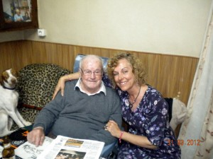

> Joseret y la autora

**Martes**

Esta tarde he sido muy mayor, mi mama ha confiado en mí y no le he defraudado. Ella ha tenido que irse porque venía el “*Tortosí*" pero, como también venía “*el Roget*” me ha pedido que hiciera la venta de las pieles yo solita, y es que, cada vez que matamos un conejo, ponemos a secar su pellejo y así cuando viene el “*Pellero*” se la vendemos.

Mi mama me ha dicho que esté atenta y cuando oiga esta canción es cuando tengo que salir a la calle con mis pieles. A mí me ha dado mucha risa y ya verás como a ti también: “*compro pells de conills i de conilla, i igual compre a la mare que a la filla*”

 Pero resulta que, como tenemos poco dinero, hacemos cambios y hoy yo ¡lo he hecho muy bien! Te lo contaré...

 Cuando le he oído, he salido a la calle corriendo y le he ofrecido una bota de vino, a la cual le ha dado muchos tragos y enseguida le he sacado mis pellejos de "*conills*". ¨Él me ha dado a cambio azafrán, pero me ha parecido poco y yo le he vuelto a ofrecer la bota y he aprovechado que se estaba poniendo muy contento, para pedirle que también me diera cerillas. "*El Roget"* me ha sonreído a la vez que me ha  acariciado la cabeza y entonces yo le he dado dos besos por el regalo, y ha sido en ese momento cuando, ademas de las cerillas, se ha sacado del bolsillo dos metros de veta, que nos servirá para hacer el colchón y para distinguir a mis gallinas.

 ¿A que lo he hecho muy bien?

 Bueno, pues al rato ha llegado mi madre, que venía muy enfadada y ha sido mi hermano quien me ha contado lo sucedido. Resulta, que se ha disgustado con su prima y te voy a contar el porqué.

El "*Tortosí"* ha llegado al pueblo, como siempre, en su bicicleta-tienda y la llamo así, porque en la parte de atrás lleva una caja de madera con una tapa de cristal y dentro 10 o 12 gafas. Siempre va armando mucho jaleo y cantando” *ulleres de totes clases, vista cansada, vista operada. Miopes, curt de vista, graduació a la vistaaaaaaaaa*”

Mi mamá y su prima se pusieron a elegir el modelo de la gafa y el "*Tortosí* "saca un cuaderno con letras, que unas son más pequeñas y otras más grandes y según con que gafas vean bien, se quedan con una u otra. Pues bien, ellas veían las dos bien con la misma gafa y eso no podía ser, pues ¡solo había una!

Así que, al final lo echaron a suertes y perdió mama. Ahora, he sido yo la que la ha tenido que consolar enseñándole todo lo que me había regalado "el *Roget*."

**Miércoles**

Hoy he aprendido mucho y estoy muy contenta. Mi papa me ha llevado con él a su trabajo. Nos hemos ido a la fábrica de alpargatas más grande de todas y es que, Salsadella es un pueblo muy industrial y te voy a contar por qué lo digo. En primer lugar te explicaré lo que son las abarcas y las alpargatas. Las abarcas están hechas de goma de las ruedas de camión y es el calzado que se lleva, tanto si hace frio, como si hace calor, porque tiene agujeritos para que salga la tierra por ellos y no se la tengan que quitar cada vez que, estando trabajando en el campo, se les llena de tierra. Si hace frió, se ponen calcetines. Pero las alpargatas son más finas y son las que yo llevo. Están hechas de esparto o de ruedas de coches, pero solo las suelas, las caretas y las taloneras son de tela y se atan con las famosas vetas.

La que hemos ido a visitar es la que se llama “*Vulcanizados Orti*” y es la más moderna. Tiene mucha gente trabajando, casi 50 personas que van a turnos y hacen hasta 24.000 pares diarios. Me han ido enseñando las máquinas y es muy curioso ver como lo hacen. Se llama Orti porque los dueños son dos hermanos, Manuel y Diego y, su madre, que se llama "*Vicenta la de Nelo"*, tiene una tienda de ropa en la Plaza Mayor y vende piezas de tela para que las mamas nos hagan la ropa.

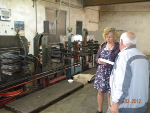

En esta misma calle hay otra fábrica que se llama “*Primitiva de abarcas y* *alpargatas*" y su dueño es Heliodoro Mateu, y si no te creías que hay mucha industria te diré que aún hay otra fábrica y es la de Arsenio Montull. Total que descalcitos no estaremos.... Y siguiendo con la industria, también hay una fábrica de escobas que, aunque no es una fábrica, Severino se lo toma muy en serio y se va a recoger las palmas al monte y las cañas al río San Alberto, y con esas escobas es con las que barremos todos los días la calle. No creas que he acabado. Aún queda *“el corretger*" o guarnicionero que es el tío Jose Palatsi y este repara los aperos del campo y los “*correatges*” de las caballerías.

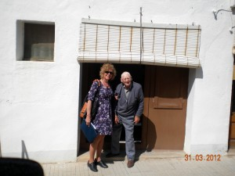

Pero lo que más hay son hornos que, puede que no sean industrias como llaman los mayores, pero yo pienso que si la fábrica de alpargatas lo es, también lo serán los hornos que, en vez de hacer suelas, cuecen panes y muchos. Aunque, en realidad, quienes hacen los panes son las mujeres en sus casas y, ese día, nosotras, las niñas, ayudamos mucho. Menos mal que solo se hacen un día a la semana porque, aunque es divertido, cuesta mucho rato y no nos da tiempo para jugar.

Ahora pondré muchas palabras difíciles pero las explicaré. En todas las casas tenemos la harina guardada en las “*Talegas*”. Esta palabra tan rara quiere decir, que es un saco de tela gruesa con una raya azul o granate. La harina la pasamos por un “*sedàs*” (es también palabra difícil) pero quiere decir, que es como un colador para que la harina no tenga bichitos ni cascaras. Luego cogemos un trocito de levadura a la que llaman "*mare*". Yo he preguntado muchas veces el porqué de este nombre y no me saben responder, aunque yo, después de ver lo que ocurre con el pan, pienso que la levadura es como las mamas que hacen grande y fácil todo lo que tocan. Con un poquito de esta levadura nos salen muchos panes y, en mi casa somos ya cinco panes, cuatro chicos y yo. Por eso, yo, a la levadura la cuido mucho y, el trocito que guardo para la próxima semana, la envuelvo en un paño y la dejo a oscuritas guardada en un armario. Cuando ya está amasado el pan, los dejamos  en un “*taulell*” que es una madera alargada a la cual le ponemos un paño   y yo les hago un bordecito para que, cuando el pan se engorde y suba, no se peguen unos con otros. Hay veces que hacemos 20 y yo siempre me hago dos panes más pequeños y son solo para mí. Cada vez los hago de una forma diferente y hoy los voy a hacer en forma de un rayo porque ha habido una tormenta. Cuando ya ha crecido el pan, mis hermanos se ponen en la cabeza una "\**capçana*” y esta es la última palabra difícil, pero no te contaré aun lo que quiere decir porque, en la escuela nos han explicado que se pone una estrellita al lado de la palabra y, cuando se acaba la redacción es cuando se explica lo que es. Con los panes encima de la cabeza, nos vamos al horno y allí se dejan para que se cuezan. Y yo soy la que elige cada vez al horno al cual se lleva el pan. Es un poquito complicado decidirlo pero, en cada horno hay una cosa bonita que me gusta. El “*forn de Curta*” está en la calle La Cort y yo le llamo el horno de los enamorados. El ama se llama Mariana Sospedra y, un día muy caluroso, paso por allí un guardia civil llamado Antonio Gallego que estaba muy cansadito, pues venía haciendo la ruta desde Morella y le pidió agua porque allí hay una cisterna que tiene fama de tener un agua “*bona i fresqueta*”. El agua le sentó muy bien y, cada vez que hacía la ruta, el Antonio se pasaba por el horno y ella le daba agua y algo más ( creo que un “*pastiset*”), porque, al cabo de un tiempo, en casa de la sinyora Consuelo, se dijo “*que el Antonio,el andaluz*, \`*s\`ha tornat boig*” porque ha colgado la capa de guardia y el macho y se casan. Pues, si eso es enamorarse, yo tendré que llevar cuidado con Joseret, no vaya a ser que a mí me dé por colgar a mis gallinas con las vetas moradas que me sobraron. Al Antonio, cuando se le pasó la locura, resultó que sabía de letras y lo nombraron secretario del ayuntamiento y es el que ahora firma los papeles importantes.

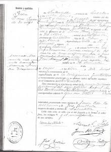

> Firma de Antonio Gallego - Doc. Ayuntamiento
>
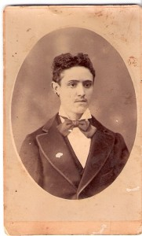

>
>
> Antonio Gallego

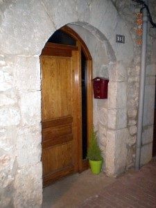

> La puerta del Forn Vell

Luego está el “*forn Vell*” que está en la calle del mismo nombre y sus dueños son Pilareta y Manuelet. Yo los quiero mucho porque, cuando hace frío, nos dan a todos los niños que se lo pedimos, unas brasas y las ponemos en unos botes con cuerdas para llevarlos a la escuela y no pasar frío. También está el “*forn de la tía Benita*” en la calle Sant Antoni y, aquí voy cuando tengo que llevar a cocer “*pataques, moniatos*, *codonys y pastissos de Sant* *Blai*”. Pero aún quedan dos hornos más. El de la tia Gumersinda de la calle del Pilar y el del tío Gumersindo en la calle San Vicente, al lado de la Plaza Mexico. Cuando ya está cocido el pan, nos vamos a recogerlo y podemos pagar o no pagar, Si mama tiene dinero pues me dá y lo pago pero, si no tiene, yo dejo un pan al que llaman “el *pa de putxa*” y luego, ellos lo venden a otros que no amasan pan en su casa, pero sí que tienen dinero para comprarlo. ¡Ah! Pero el pan que nunca dejo es el que hago para mí, este es mío y solo mío.

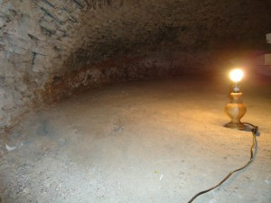

> Forn Vell

\*“*Capçana*”: es como un flotador de los que nos ponemos cuando nos bañamos en la balsa pero hecho de tela rellena de pelo de cabra y borra y se pone en la cabeza para llevar pesos Esto lo pone en un libro que se llama diccionario y nos lo regaló a la escuela un valenciano amigo del Sinyo Daniel que se llama Rayo.

**JUEVES**

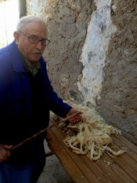

> El colchonero cardando la lana

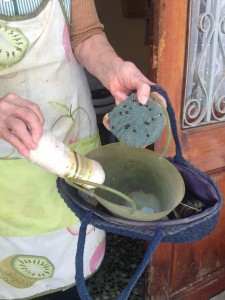

> Utensilios que utilizaba la mujer del colchonero para coser los colchones

 ¡Hoy he tenido una idea genial! Y como dice mamá, “*de subin*” pero en un momento inoportuno. Pienso que puede tener razón, pues “*m'ha vingut al cap*” cuando estaba barrejando la lana; y es que hoy... está el "*Matalafé"* en casa. Hace 3 años ya me pasó igual y es que, eso de cardar la lana, a mí me espabila el cerebro y yo sé por qué: es muy aburrido y tanto hacer lo mismo pues… piensas... y piensas....y al final te viene la idea. Y hoy ha sido esta: que cuando vuelva en Septiembre el  sinyó Daniel, voy a ser yo quien le haga un regalo, pero como yo no le puedo comprar nada, le voy a devolver, el que él me ha dado a mí: el diario, pero rellenito de todo lo que ha pasado en el pueblo desde Mayo a Septiembre. No sé cómo no se me ha ocurrido antes, porque si nos da los lápices, los colorines y el sacapuntas…. ¡será para que lo usemos! Así que le contaré lo que hago cada día y le haré hasta dibujos. Y como la idea se me ha ocurrido hoy, voy a contar como se hace un colchón.

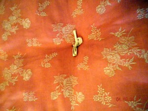

>
>
> **Colchón de mi muñeca**

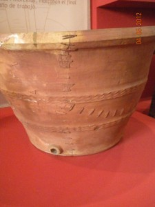

> El cossi con grapetes

El *matalafé o colchonero-lanero* viene cada dos o tres años y, lo primero que hacemos nosotros es deshacer el colchón viejo y lavar la lana en el río. Yo me he quedado con un poquito de lana para hacerle uno a mi muñeca y la he lavado en el “*cóssi*”. Ahora haré un dibujo muy bonito y veras como lo han cosido con grapas, porque hace poco se "*badó*" y cuando vino el adobador, lo arregló.

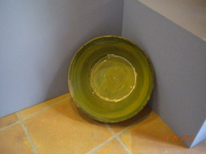

Este señor también arregla los paraguas y viene al pueblo de vez en cuando. A veces coincide con el lebrillero que viene desde Jaén y llega muy contento y es porque va acompañado de varios burritos blancos, vestidos de andaluces con borlas de colores y cascabeles, pero cargados con lebrillos, unos de color marrón, que es donde lavamos los platos y otros de color verde que solo se usan para hacer magdalenas y pastisos pero  como yo soy “*la reina de mi casa*” de pequeñita me bañaban a mí en él. Es verdad y si no te lo crees te enseño una foto. Una vez limpia la lana, se pone al sol a secar y luego se carda. Esto es muy pesado y, es aquí cuando me viene la inspiración, aunque mis hermanos, sobre todo Alberto, me dicen que lo que me coge es una insolación. Se ríen de mí y hasta me hacen llorar y es mamá la que me consuela y me dice que lo que tienen es envidia porque yo lo quiero saber y aprender todo.

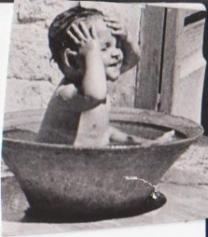

> ¿Ves cómo es verdad?

Pero sigo con mi colchón. Luego ponemos la lana entre dos piezas de tela que tienen muchos agujeritos de arriba a abajo y de derecha a izquierda y por ahí pasamos las vetas que me regaló el *Roget*. Yo soy la encargada de hacer los nudos. Este colchón que hemos hecho hoy es para mí y se llama" *canónigo"* y no entiendo por qué, pues yo me llamo Carmencita.

Pero esta vez, no le voy a decir a nadie lo de mi diario aunque es Alberto quien más me ha insistido en que se lo cuente y es porque la otra vez, aunque se me ocurrió a mí, fuimos los dos los que hicimos lo que ahora tengo que contar.

Mi abuelo hace el vino en casa y, en la entrada ponemos un “*carratell*” lleno de vino y unos vasitos para que los hombres que pasan por la calle y tienen sed, puedan echarse un “*glopet de vi*”. Yo soy la encargada de poner “*lo ram*” (ramo de romero) colgado en la puerta para que sepan que ya tenemos el vino preparado. Tengo que vigilarlo porque a veces se lo lleva el viento. Esto me divierte mucho porque, luego, por las tarde, vuelven los que han bebido y me dan dinerito, según los vasos que se han tomado y, hay alguno que me paga hasta tres. Y la idea que tuve la otra vez que “*barrejava*” fue está. Resulta que siempre nos han dicho que los gatos tienen siete vidas y nuestro gato Isidoro se puso a dormir al sol, pero encima de la lana que yo acababa de cardar y esto me dio mucha rabia. Fue entonces, cuando decidí quitarle una vida, pero de verdad que solo quería que fuera una…. Se lo conté a mi hermano Alberto y, entre los dos cogimos al gato y lo metimos en el “*trull*” que estaba tapadito con unas maderas y es un recipiente grande donde la uva hace pomporitas. El gato se movió....chilló.... y por mas que esperamos.... no salió. Nos asustamos un poco pero decidimos guardar el secreto. Por eso lo puedo contar ahora, porque lo que se escribe en un diario, nos ha dicho la maestra, que no se puede decir y creo que vosté Sinyó Daniel no lo va a charrar y estoy muy segura de que así será porque ¿se acuerda aquella vez que felicito a mi papa cuando le regalo una garrafa de vino y al probarle *vosté va dir*?:" *Manuel..... Este vino está buenísimo, tiene….no sé qué le noto… ¡ah ya ¡ que tiene mucho cuerpo, pero que mucho cuerpo".*

> **VIERNES**

 Cuando llega el viernes se hace una cosa distinta a los demás días. Muchos hombres del pueblo dicen “*vaig a esquila-me”* y como pagan una iguala anual, van todas las semanas. Yo sé distinguir quién acaba de afeitarse, por una cosa y es que llevan la cara de dos colores, el cuello color normal oscurito, pero la cara es de color blanca. Yo no entendía porque el barbero los dejaba como si fueran payasos y como, a mi papa también le pasa lo mismo y yo le pregunté tanto, el por qué de estos dos colores, el, para explicármelo, hizo como el maestro de mis hermanos: me llevó con él.

En Salsadella hay cuatro barberías y como todas son de nuestra familia , cada semana elegimos  ir a una distinta, porque no queremos que nadie se enfade.

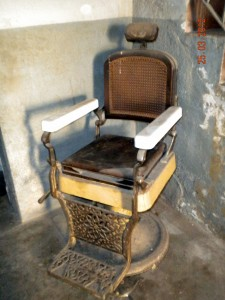

Está la de Batiste Montull o "*el Cordà"*, en la calle San Alberto, también la de Gaspar Sospedra en la calle Mayor, luego una muy cerquita de donde vivimos y es la del "*tío Quiles"*, que aunque lo llamamos así tiene un nombre y es José Sales. También hay otra y es la de Jose Boch o Pepet que está en la calle Mayor, pero a esta no me gusta ni acercarme, porque además Pepet pone inyecciones y cada vez que te pone una,* "plores un mes seguit*." Total que hemos ido a la de Pepet, porque mi papa me dice que es muy moderna, y tiene hasta escupideras. Cuando llegamos mi papa se subió al sillón que es alto y metálico y Pepet se pone a afilar la navaja frotándola en una cinta de cuero (da mucho susto). Enseguida coge la brocha con el jabón y lo pone en la cara y le da...y le da vueltas pero cuesta mucho de que haga espuma, pero Pepet no se cansa de darle. Al final, sale la espuma pero es de color chocolate con leche.  Entonces  coge la navaja y lo va quitado  todo: los pelos, la espuma y es cuando se ve la cara blanca. Y Pepet me aclaro el misterio: ”*No es de color chocolate, es de color tierra, porque de tanto trabajar en el campo es tierra lo que llevan en la cara y por eso el cuello queda más oscuro".*

Cuando hemos salido de la barbería, he tenido que darme prisa en recoger a mis gallinas que estaban en la higuera detrás de mi casa. Las mías llevan una veta de color morado que ¿te acuerdas? me la dio el Roget.

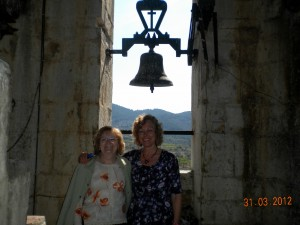

Son muy listas porque nada más verme se vienen detrás de mi y es porque me entienden, yo les hablo y les digo: “*Titas titas tirolitas*”, les abro la puerta y se van a dormir solitas.

 También todos los niños del pueblo hacemos como mis gallinas, cuando empieza a anochecer el Campaner hace sonar el toque del Ave María, y volvemos a casa corriendo a la vez que decimos gritando “*A l'Ave María les bruixes per la vila"*”

> La campana María. La autora con la sacristana.

**SÁBADO**

Hoy voy a hablarte de una persona que a todos los niños nos encanta, y que tiene poderes especiales. Se trata del Tío Aparici o el “*sereno* “.Esto quiere decir que trabaja de noche y duerme de día, por eso le veo poco, pero cuando vuelvo por las tardes de recoger hierba para mis conejos, nada menos que de” *Les llacunes*” paso siempre por su casa para hablar un rato y me cuenta cosas que ocurren por las noches, que son muy curiosas y siempre acabo pensando que tiene unos poderes especiales porque, adivina el futuro .Y es que, su trabajo es el más importante de todos, pues sabe todo lo que pasa de noche y aunque parezca que de noche no pasa nada, él dice que si, que al principio de la noche hay mucho trabajo y no lo acabo de entender, pues no puede hablar con nadie ,pero él me explica que de noche no hay palabras, lo que hay son sonidos y que se los conoce todos y según sean, adivina lo que está ocurriendo .Me explica que es fácil, porque solo hay 3 .El que más se oye son las toses y es cuando El Tío Aparici se espera en la puerta por si hay que llamar al médico. El otro sonido, son lamentos o quejidos y aquí si que entra sin problema, porque las puertas, tanto de día como de noche, siempre están abiertas y pregunta si tiene que llamar a la tía Mercedes que es la comadrona ya que los niños prefieren nacer por las noches porque saben que el tío Aparici lo tienen todo controlado y es por eso por lo que nos quiere tanto a todos pues participa en nuestros nacimientos y el tercer sonido es el que más le gusta a él y el que menos entiendo yo .Dice que son una especie de risitas raras, pero que aquí ni se para, ni entra en la casa , solo hace que reírse...... y sigue dando la vuelta a todo el pueblo .Por fin cuando ya todos están calladitos es cuando le da por   cantar las horas y empieza diciendo :" Alabado sea Dios –Nublado-Lloviendo o Sereno" y esto tampoco lo entiendo porque si por fin todos duermen…¿ para quién lo dice?

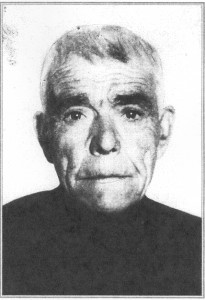

También hace de despertador, porque así, si alguien tiene que levantarse temprano ,le ponemos unas piedras en el escalón de la entrada de la casa   En las cuenta y ya sabe a la hora que tiene que entrar ......  te despierta sin hacer nada de ruido...... y sin molestar a nadie más.

Pero lo más increíble es que tiene el poder de parar las tormentas que pueden echar a perder la cosecha. Esto si que no sabemos cómo lo hace, porque cuando tira los petardos es siempre de noche. Pero nosotros los niños compramos los mismos petardos en la tienda de"* Polit*" que también vende cacahuetes, altramuces y chocolate del moro y aunque queremos tirarlos para arriba, caen al suelo y no sirve para nada, pero cuando los tira el tío Aparici, suben al cielo y mágicamente rompe las tormentas.

**DOMINGO**

 Los domingos todos nos divertimos. Ese día ni los papas no van al campo, ni hay escuela....solo hay fiesta. El único que sale a trabajar es el pastor que se lleva a las ovejas y a las cabras porque ¡pobrecitas, no se les puede dejar un día sin comer! Así que Paco Juliana hace la " *Dula* "y eso quiere decir que recoge todos los animales y se los lleva al campo. Si las ovejas pastan en tierra de los dueños, pues no pasa nada, pero si las entra en un campo de otras personas que no le han dejado ovejas, primero les tiene que haber pedido permiso y luego les paga con ¡un queso! Todos los animalitos al abrirle la puerta de los corrales le siguen y poco a poco se llena la calle. Cuando regresan por la tarde, primero beben en la “*Bassa*” y luego cada una, se va sólita a su casa, pero hay una cabra que es muy “*mama*” y antes de irse a dormir entra  en casa de Remedios y le da de mamar a Salvadora y a Fulgencio y es porque los oye llorar y sabe que tienen hambre ¡es una cabra muy lista!

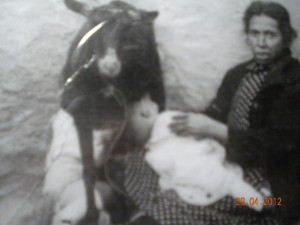

> Debajo de la cabra, a la izquierda de la foto, está Fulgencio mamando. A la derecha, la madre sostiene a Salvadora para que pueda mamar también.

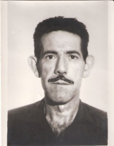

> Andrés, el Campaner

Pues esto ocurre prontísimo por la mañana y cuando oímos los cencerros,  nos levantamos y nos ponemos guapísimas. Yo me peino con  vetas en el pelo, como mis gallinas y me calzo zapatos que solo los usamos los domingos. Así de apañadas nos vamos a misa, que es obligatorio, con nuestras maestras y, para que no lleguemos tarde, Andrés “*El Campaner*” toca las campanas o la María o la Carmen. Estas son muy alegres y no la que se llama “*Barjoles*” que da mucho miedo y la tocan cuando muere “Nostre Sinyó”. Esto lo contare otro día, porque es muy triste y hoy es fiesta.

Al acabar la misa viene lo bueno ¡nos vamos al baile! Bueno, a nosotras no nos dejan entrar porque no tenemos 14 años y a los chicos tampoco, pero da igual...... ¡nosotras nos colamos ¡…y si tenemos suerte que “*los polis*” que vigilan son amigos, nos echan un poco más tarde y es que cada semana apuntan en una pizarra a los que “*han de parar comte*” de que no se cuelen ni niños ni abuelitos de los que llaman “*verdes*”. Nosotros solo queremos aprender a bailar y los abuelitos que sí que saben bailar, no entiendo porque se quieren colar. Pero en la calle igual aprendemos y es porque no veas el interés que ponen los chicos y es que cuando cumplen los 14 años se les hace un examen que…. ¡fíjate¡ …lo llaman igual que el de la escuela, "*Ingres*o", pero en este, han de demostrar ante el presidente tres cosas:

 Primero: que eres un buen  tocador de “*picup*”, que quiere decir, que sabes manejar el tocadiscos.

Segundo: que sabes bailar y tercero: que tienes un duro al año para pagar la cuota a la” *Unión Salsadellense*”.Tenemos suerte porque nosotras no pagamos y podemos sentarnos en unas pocas sillas que están a la derecha y los chicos se colocan a la izquierda, pero de pie y mira si hay pocos asientos, que nos tenemos que poner unas encima de otras haciendo como un tren y ¿sabes qué pasa?, pues que las más feas se quedan atrás porque nunca las sacan a bailar y las más guapitas tienen que "dar la vez" a los chicos que están enfrente. Cuentan los mayores que antes había un organillo, pero que solo tenía “*una dotzena de cançons* " y que cuando la gente ya se las sabía de memoria, iban al pueblo de al lado y se intercambiaban los organillos. Y la verdad, el baile, siempre está lleno. El sitio es muy bonito y le ponemos en el techo papeles de colores cortados como si fueran flecos, de parte a parte del local, aunque de vez en cuando hay una gotera, pero..... no pasa nada, hemos aprendido a bailar esquivando los cubos que hay en el suelo y nadie se tropieza ni se moja. Cuando se acaba el baile nos vamos todos a comer.

Por la tarde, todos los habitantes del pueblo estamos muy ocupados. Los niños nos vamos otra vez a la iglesia a rezar el rosario, pero esta vez nos han puesto un nombre muy simpático “*lo rebañito*“y cantamos todos juntos esta canción

Vamos niños alsagrario,

que

                                                 *      “Vamos niños al sagrario.*

*                                                      que Jesús llorando está*

*                                                       y habiendo tantos niños*

*                                                      muy contento se pondrá.*

*                                                     No llores Jesús, no llores*

*                                                    que nos vas a hacer llorar*

*                                                    y los niños de este pueblo*

                                                 *   te queremos consolar.”*

Los papás se van a jugar al *"Trinquet,"* que es el deporte del pueblo. El local está al lado del baile. Hay dos formas de jugar: los que lo hacen a mano y los que lo hacen a pala .Los que mejor juegan a mano son dos: Juan Blay y Gallatano. Paco Pauls, Victoriano Gallego y Pavía, que es el boticario, son los que juegan mejor a pala. Lo hacen tan bien que, incluso, van a jugar a otros pueblos y se hacen apuestas. En la entrada siempre está el abuelo “*Trinketet”* que es el que fabrica las pelotas muy bien hechas con trapos.

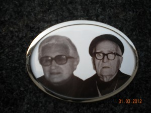

> Los dueños del Trinquet.

Mientras tanto, las mamás se reúnen en” *ca la syñora* *Consuelo*” que está en la Plaza Mayor y, lo primero que hacen es, como nosotras, rezar el rosario. Luego se toman una copita de moscatel y sacan la baraja para jugar a la brisca, Después, ya un poco mas alegres, se dan consejos unas a otras, sobre cosas muy personales y siguen bebiendo muchas copas porque se les seca *"la gola*". Acaban riéndose mucho, pues comentan todo lo que ha ocurrido durante la semana y, al final, critican a todo bicho viviente

    **LOS JÓVENES Y LOS NIÑOS NOS VOLVEMOS AL BAILE**

Vienen muchos mozos del “*Mas den Rieres”* porque resultan que allí los policías…. son las madres. Ellas sientan a su niña encima y si el que las solicita es “*riquet”* les dan un empujón en el trasero y a bailar, pero si es “*pobret,  l'agafave ben for*t". Pero lo que a mí más me gusta, es el último baile que se llama “*dels fadrins*.”

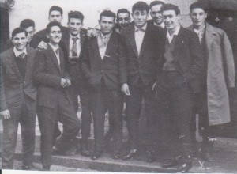

> Fadrins del poble

y lo bailan los chicos que más calabazas han recibido. Sacan unos pañuelos blancos y todos cogidos del hombro y con muchas risas, se van calle arriba al bar de “*La Tia Blassa”* y allí toman para consolarse una “*ausenta un carajillo y un* *calmant*” que es la especialidad de la casa. Figúrate si el tío Victoriano lo hace bien, que a veces, para acabar una buena comida lo llamamos y él viene con todos sus cachivaches y nos lo hace en casa.

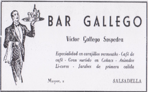

> ¿A que sale muy guapo Victoriano?

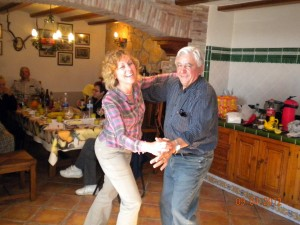

Esto lo toman los mayores, pero nosotros tomamos helados porque *“La mantecaera”* está en la puerta y cuando no nos lo paga nadie, le decimos que nos lo ponga en un vaso porque cuesta menos ( 50 céntimos).

Total que, tanto los papás, como las mamas, como nosotros, nos lo pasamos “*chanchi pirul*i”.

> Fuentes empíricas de la autora: Victor, uno de los fadrins.

**LA SEMANA SANTA**

 He oído repetir a los abuelitos muchas veces esto: "*cuando yo era niño hacíamos esto... y lo otro....y ahora todo se ha perdido*". Lo dicen con mucha pena y si, por si acaso, cuando sea mayor, esto de la "*Solispasa"* y las *"maçes"* ya no se hace, yo voy a escribirlo en mi diario. Me gusta,  porque este día todos los niños, podemos ser un poquito malos,.... no hay ni riñas..... ni castigos..... y eso nos divierte mucho. Se empieza como casi siempre, acudiendo a la iglesia, eso sí, todos muy ”*mudaos*” y los que tienen zapatos se los ponen. En ella preparamos los *“arreus*” que los niños tenemos que llevar en la procesión y son: garrafas, capazos, un embudo y una pasta que preparamos con “*sego*” (salvado) y agua bendita y también la lista de las casas que han solicitado que les echen la santa  bendición.

Todos en fila, siguiendo al *"capellá",* nos dirigimos a la primera casa a la cual tenemos que bendecir y, es aquí cuando el" *mosen"* coge un poco de la pasta de" *segó*"  y lo lanza hacia la puerta de forma que queda pegado en ella, aunque a veces, si no hemos hecho la masa al punto, o bien resbala mucho y cae en forma de chorrete o bien no se pega. Y nos divierte mucho ver si el mosén, tiene buena puntería. Cuando ya la puerta está sucia pero, eso si bendita,  se abre y sale el ama y, es entonces el momento más emocionante,  porque nosotras hemos hecho apuestas de qué clase de pago hará cada una, pues, puede que sean huevos y van al capazo, o aceite que con el embudo ponemos en las  garrafas y, los más ricos, dan dinerito, pero eso, va siempre a la *“butxaca”* del capella. Cuando ya hemos hecho todo el recorrido, los chicos vuelven a sus casas corriendo y cogen les "*maçes"* que ya tienen preparadas, y son una especie de martillos de fusta que, según la edad del niño, puede ser más grande o más pequeña. Con esto recorren todo el pueblo buscando una puerta cerrada ya que ese día, después de la bendición, todo el mundo abre las puertas de par en par porque si llegan los niños y la ven abierta, pasan de largo, pero.... como la descubran cerrada, aporrean la puerta con las "*maçes*" y, a la vez dicen: “*porta oberta, bona cuberta, y porta tanca, bona maçá”.*

Mientras tanto, las chicas volvemos a la iglesia y las niñas que hemos ganado la apuesta y, con el visto bueno del señor cura, llevamos los huevos y el aceite a las familias más pobres del pueblo, pero yo me llevo el salvado bendito que ha sobrado para mis" *gallinetes"* y el cura parece que me ve …..Pero nunca me pilla.

**EL VIERNES SANTO**

 Escribir sobre el viernes Santo va a ser muy difícil y es porque me da mucho miedo.

Cuando empieza el tío Andrés a hacer sonar ese ruido, que no es  de campana, aunque está en el campanario, y que lo hace con un aparato que  se llama” *barjoles”,* me da tanto susto, que por segunda vez este año me he escondido debajo de mi cama y es que hace un sonido muy triste, y por si fuera poco.... habla. Dice " *raca raca*" y parece que "*esgarra"* el corazón. El tío Andres me lo quiere  enseñar, pues es de madera, y se parece a una carraca de esas que venden en la feria, quiere que la   toque con mis manos y vea que no pasa nada. También me dice que lo hace para que se entere todo el pueblo que "*s'ha mort nostre Sinyor"* y yo le contesto que con una o dos veces que lo tocase ya lo sabríamos todos ¡ hasta mi perra se esconde conmigo!.

El capellá ese día tiene mucho trabajo. Pone en la iglesia agua bendita y las niñas van con sus "*pitxerets*" que tienen "*aixeta*", lo llenan y se lo llevan cada una a su casa, para bendecir todas las habitaciones. Mis primas, son muy buenas y como saben que tengo miedo y no voy a por el agua, me la traen a casa y a la primera que le echan el agua bendita, es a mi para espantar mi miedo y que salga de mi escondite. Cuando ya me ha hecho efecto el agua, soy yo la que bendice todo y a todos, sobretodo para que no nos echen el mal de ojo, no nos entre la gripe, esa que llaman  de la cucaracha y sobre todo que: “*les bruixes*" nos dejen en paz.

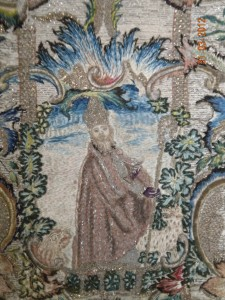

Por la tarde, no sé si estoy bendita o bendecida, el caso es que ya no suena el "*raca raca"* y yo me encuentro bien, por eso me voy a la misa junto con los niños y las niñas. Al entrar a la iglesia, los *"mestres"nos* miran los bolsillos porque está prohibido llenarlos de piedras. Al acabar la misa, el mòsen, pone una especie de medio arco de hierro con doce cirios de menor a mayor tamaño, de los cuales el numero 6 es el más grande y está en el centro. Entonces 12 niños van acercándose a los cirios, pero de uno en uno y se dice " *uno y la* *marieta" y " el coteret "* con una especie de capuchón, lo apaga. Sale otro niño y dice " *dos* *y la marieta* " y se apaga también el cirio y así hasta llegar al más grande. No se me tiene que olvidar preguntar al monsen por qué son 12 cirios, aunque casi lo sé. Creo que serán los 12 apóstoles, lo que sí sé, es que cuando se apagan todos, es porque Jesús está muerto y cuando se murió de verdad, se hizo de noche, hubo tormentas, relámpagos y truenos. Por eso nosotros, que ya estamos sentaditos en nuestros bancos, con nuestros pies zapateamos el suelo y con las manos, pero sin piedras, golpeamos la madera. ¿a qué ahora entiendes porque nos miran los bolsillos?

> Casulla de San Blas.

PD: Esto de la pe.... de.... también es nuevo. En la clase de hoy, la maestra nos ha explicado que cuando se tiene que añadir algo se escribe un Pd y es que quiero que sepas que, de miedos estoy mejor, ya soy más valiente ahora, porque antes, que era más pequeña, me metía dos veces bajo la cama cada año, una es, la que te he contado y la otra era, cuando chillaba el cerdo que mataban los vecinos de mi casa.

**FIESTA DE BIENVENIDA**

Cada vez que viene el syño Daniel al pueblo, se hace una  fiesta y de las grandes. Estamos invitados todos los niños, abuelos, papas... hasta los perros no se la quieren perder.

Nosotros somos los primeros que le demostramos nuestro cariño, porque salimos a la carretera a recibirle. Preguntamos en casa del tío Germán, que es el que le hace de chófer, cuanto le falta para llegar, y cuando ya se acerca la hora, nos vamos al final de su avenida y con banderitas, le esperamos. Y es que al syño Daniel y al señor Tomás Molins, no les han puesto una calle......no....... les han puesto una avenida a cada uno. Y claro, siempre que vienen al pueblo, cada uno entra por la suya, por la que lleva su nombre. Ese día todos nos damos mucha prisa en hacer nuestras faenas y por la tarde-noche vamos a la plaza donde está la banda de música tocando y nos juntamos muchísima gente.

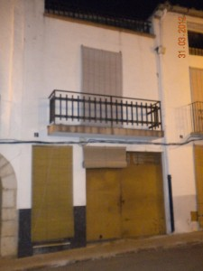

> La casa del veterinario

A los que más les cuesta venir es a los herreros, porque aunque aquí hay tres herrerías, la de Vicente Sales, la de Andrés Sales y la de Román, ellos tienen mucho trabajo, porque en casi todas las casas hay machos, y son los herreros quienes les arreglan los zapatos. Estos animales tienen que estar muy bien cuidados, por eso todos pagan una* "iguala"* al veterinario o Menescal, que es  Don Angel. Pero aún así, cuando han trabajado mucho estos animalitos también se mueren. La otra noche que  estábamos todos mis hermanos y yo sentaditos en unos troncos alrededor del fuego, papá se levantó de su silla y nos dio como siempre un beso de buenas noches, pero nos dijo que se iba a velar el macho del tío Manuel, y a darle el pésame. Según él, es una gran desgracia que se te muera el macho, porque es el que más trabaja de la casa y...... el que menos disgustos da.

Por eso los herreros llegan siempre los últimos. Los que menos tardan en llegar son los de los bares, primero llega *el" Poll"* que es el que tiene el cine, y el segundo el del "*Trinquet",* que ese día no abre. El tercero el de "*Tomás"*, y los últimos son los que están en la plaza, que son el de" Ca *Blasa, o Bar Gallego*", y el de *"Pruedencio o el Centro"*, y es porque mientras la gente espera en la plaza, ellos se toman sus copitas.

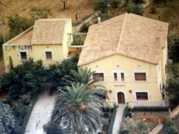

Cuando ya estamos todos juntos nos vamos camino de su casa, que ha quedado preciosa, pero aunque se llama Villa México, los de la capital lo llaman el “*chalet*” Esta es una palabra nueva para mi, y la tengo que poner entre comillas, porque eso es lo que me dijo mi profesora que hay que hacer. Esa casa no es como las normales de aquí, por eso tiene un nombre distinto. Está recién estrenada y estamos muy orgullosos de ella, porque casi todos los hombres del pueblo han trabajado allí. Tiene unos muros muy gordos y para adornarla han puesto unas piedras muy bonitas que trajeron de la cantera. Además tiene un jardín dentro. Los caseros que la cuidan ya sabes lo trabajadores que son. El Estanislao es el que más oficios tiene del pueblo. Primero es carpintero "*artista"*, porque ha hecho

> Foto aérea de la Casa México. 1945

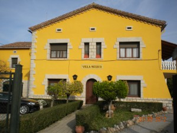

todos los muebles: las camas, las sillas con trenzas para que te puedas sentar, las lámparas y las mesas. Pero además de carpintero-artista es carpintero- "*juerguista",* no sólo ha hecho una mesa larga, que sirve para comer y caben hasta 40, si no que  ha hecho otra, para jugar a las cartas, que es redonda. Los niños jugamos por la calle, pero los papas, como ya son mayores se tienen que sentar, y por eso le ha hecho la mesa y yo creo, que es redonda, para que no se puedan hacer trampas porque las trampas, si que son cosa de mayores.

> La Casa México en la actualidad.

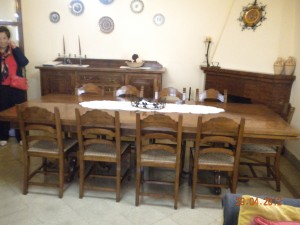

> Mesa del comedor.

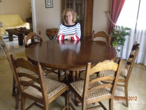

> Mesa de juego.

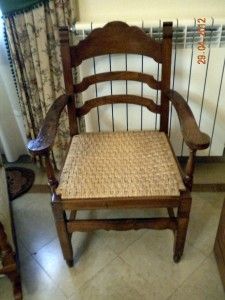

> Sillón trenzado.

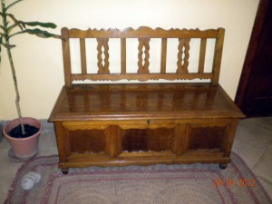

> Banco.

     Pero el secreto, señor Daniel, de que el Chalet se haya hecho tan aprisa y esté tan bonito, ha sido cosa mía. Y te lo tienes que creer porque yo no digo mentiras. Resulta que Estanislao tiene otro oficio secreto y yo lo descubrí, Un día que volvía de recoger la hierba para los conejos desde las Llagunas, entré a ver cómo iban trabajando y me encontré a Estanislao encerrado en la carpintería. Entré sin que me viera, y descubrí que también es inventor, y sabe construir un aparato con maderas, que cuando se le da a un botón se oye una música. Le pregunté que qué era aquello y me dijo que se llama “*arradio*”. Estaba sonando una canción muy alegre y tanto me gustaba que le pedí permiso para abrir las puertas para que así lo pudieran escuchar los de fuera. Y todos siguieron trabajando al ritmo de la música y parecía como aquellas películas que a veces en el cine se enganchan y pasan aprisa ¿a qué tengo razón y no digo mentiras?.

     Lo de trabajar con música les encantó a todos y le encargaron muchas "*arradios*" a Estanislao, pero hubo uno, el tal Bernardino, que la devolvió todo enfadado y fue porque cada vez que la encendía quería que sonase solo *"La Campanera"*...

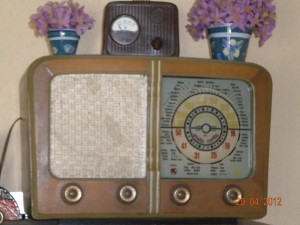

> La "arradio".

Hasta Pepita Samper (este apellido me gusta mucho) que es su mujer salió a ver lo que pasaba y cuando me vio y su marido le contó lo que yo había hecho, me dio dos besos y me dijo que casi todas las ideas buenas de este mundo se le ocurren a las mujeres y que ¡qué sería de los hombres sin ellas!. Yo sé, que se ha equivocado un poco, porque es imposible, Syño Daniel, que a su mujer, doña Carmen, se le hayan ocurrido todas las buenas cosas que "*vosté",* ha hecho por el pueblo. Le hubiera cogido mucho dolor de cabeza. Yo sé que fue idea suya traer un teléfono al pueblo para que todos pudiéramos hablar con los de fuera, poner unos tubos por debajo de las calles para que el agua se cuele cuando llueva, hacerle una casa al médico y ponerle un aparato mágico que se llama “*RX”* y que puede ver hasta lo que te has tragado sin darte cuenta,( como me pasó a mi, que me tragué un dedal),  pagar todo el año una habitación en el Hospital Provincial por si alguno de nosotros lo necesita, hacer las escuelas nuevas y traernos regalitos, ayudar al fútbol y a la banda de música con su iguala, también el retablo de la iglesia con la Virgen de Guadalupe,( si puedo lo del retablo lo contaré otro día)  y sobre todo....la Plaza México... uf, son tantas cosas, que estoy segura que han tenido que pensarlo los dos juntos... aunque yo sé que la campana más pequeña del campanario y el armario... bueno, creo que es “*armonio”* si que fue idea solo de Doña Carmen.

Ahora el dolor de cabeza me ha cogido a mi de tanto escribir, ya seguiré otro día, que me han venido a buscar mis amigas.....aunque creo que ha venido también algún… chico.

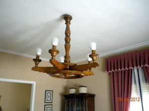

> Una lámpara.

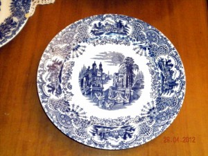

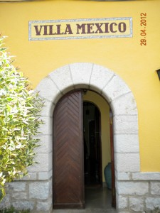

> Puerta Casa México

Otro día...

Cuando ya estamos todos listos, salimos caminando hacia su casa al compás de la música. Y pasamos por la plaza Mexico que ha quedado preciosa (tiene hasta una fuente, pero esto si me da tiempo lo contaré otro día). Luego cogemos la Avenida Daniel Montull y lo primero que encontramos es la casa del médico, que también es un "*chalet*". Siguen las fábricas de alpargatas y por último, al fondo y a la derecha esta su casa, la villa "Mexico"

Es entonces cuando toda su familia al completo sale a la calle. El primero es el "*Syño Daniel*", luego doña Carmen, que esta guapísima y le gusta vestir mucho de negro. Aquí se visten de negro cuando están de luto, porque se les ha muerto algún familiar. A lo mejor, ella, se pone de negro porque tiene aún mucha penita del niño que se le murió. Lo que sí que tiene son tres hijas preciosas, que se llaman Carmen, Pilarin y Marisa, y que ya le han dado nietos. Yo los conozco a todos porque salen a pasear por el pueblo con sus *"nanis*" y jugamos todos juntos en la plaza. Las *"nanis*" llevan unas trenzas largas con lazos, y van vestidas con unos trajes largos de muchos colores y volantes, y claro, como aquí nadie lleva esas ropas tan alegres, nos parecen muy raras. Pero a mí me encantan, la próxima vez que vea al *"Fiao"* le voy a encargar que me traiga una tela parecida. El *"Fiao*", por si no lo conoce, es un forastero muy querido por todos que viene de San Mateo en una bici cada semana y lo reconocemos desde lejos por el pañuelo azul que lleva en el cuello y también por el muchísimo cargamento que lleva encima. Le he contado a veces 5 o 6 sabanas, varios cortes de ropa, incluso batas ya hechas y el pedalea como si nada. Las mamas le miran mucho pues además de fuerte es.....muy guapo y como es andaluz entre zeta y zeta dice alguna "espardenya". Pero a mí lo que me encanta es cuando saca su cuaderno, que se parece a mí diario, aunque tiene las tapas de madera y en el apunta lo que cada mujer le debe, ya que nunca se lo pueden pagar de una vez y así cada semana.......pues… le dan un poquito, por eso le han puesto el buen nombre del "Fiao" ya que se fía de todas. Aunque su nombre de verdad es Paco y cuando ya le entra mucha sed y hambre, se va al bar Gallego y se pone a hablar con la abuela Blasa; esta mujer acoge a todos los forasteros con mucho cariño y yo creo que es ella la que le  está enseñando las palabras en valenciano. Así practicando...practicando nos cuenta cosas de su vida, pero como es un poco exagerado a veces nos dice unas "bolas" que yo no me las creo. La última fue que se puso muy serio y nos dijo que nació en un rincón que se llama Victoria… será la calle Victoria y ¡como su pobre madre lo va a tener en un rincón! ......es andaluz. Lo que si es cierto es que el pueblo se llama Benagalbon y es de Málaga. También nos contó que el 31 de Diciembre de 1948 se casó con su prima hermana Francisca y tuvieron que pedir permiso al Papa. Tenían 24 y 19 años y Paca lo tenía muy claro, ya que desde los 13 años eran novios. Enseguida se trasladaron a Alcala de Chisvert, donde Paco tenía un hermano y el fue quien le enseño el negocio de las telas. Allí vivieron 22 meses y nació la primera de sus hijas "Brigidin " y cuando ya se vio con ánimo de trabajar solo se mudaron a San Mateo y vendía sus telas en Cervera, donde iba a casa de Leonor a almorzar, Salsadella y Cuevas. Ya estando en San Mateo nacieron Loli, Jesús y Amadita. Yo los conozco a todos pues muchos domingos me invitan a pasar el día y nos vamos de excursión con una gran cazuela de un guiso buenísimo, que también lo hace Paco y le pone de todo, conejo, pollo, guisantes, patatas, y a veces ...hasta caracoles y con todo esto nos vamos cada vez a una fuente a la Balaguera, Fuente Morella, Agua Nova, o a la fuente las Picas, y nos lo pasamos de bien.....Jugamos mucho con piedras y claro con el agua, pero el mejor juguete de todos se llama Paco, nos pilla, nos da sustos cuando menos nos lo esperamos y nos hace andar subidos en sus pies pegando nuestra espalda a su pancha. Es muy.... pero que muy divertido y cariñoso sobre todo con su Paca. Entre ellos se llaman "niño y niña" y parece ser que nunca riñen ni se ponen mala cara, al revés ¡se besan delante de todos! y en su casa siempre está la radio puesta y con cualquier musiquita hacen fiesta. Pero la mayor fiesta es la que se arma cuando se recibe la carta de la abuela, aquella que pario en El Rincón, como ellos dicen, de la Victoria, anunciando que llega un paquete ¡que emoción! contamos los días y cuando por fin llega al abrirlo sale de todo: longanizas, chorizos, cansala, manteca blanca y manteca colora, higos secos almendras y unos huesos blancos que luego los ponen al caldo. Todo lo de la abuela lo aprovechan hasta el cajón donde viene todos estos regalos ya que Paco ha hecho una mesita de noche y Paca le ha puesto unas cortinas, pero tendrán que esperar otro año para poder tener otra mesita en la habitación.

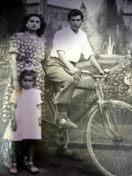

> El matrimonio con una de sus hijas.

Tanto me gustan esos colores para mi vestido, que por si acaso el "*Fiao*" no me lo trae, porque no lo encuentra, se lo diré al "*Barato"*, que este también viene. Pero no va por las calles con bici, viene en un coche y para siempre en los hostales. Primero en el  de Agapito, y luego en el de Pepito, donde a veces,si se le hace tarde, se queda a dormir.

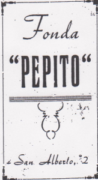

> Anuncio del programa de fiestas de 1967.

Total que uno de los dos me lo traerá, seguro. Yo, para que no se me olvide el día que vienen a vender, me lo apunto en un calendario que tenemos en casa, que se llama "*Zaragozano*". Mi abuelo dice que es muy necesario tenerlo, porque avisa de cuando tienes que plantar o cortarse el pelo y las uñas. Y no es una persona la que lo dice, es la Luna y será una luna que da mucha luz, porque resulta que el que lo vende es ciego, pero sabe hacer su trabajo muy bien porque siempre los vende todos, y va diciendo con muy buena voz: *"Calendarios Zaragozanos, mentiras para todo el año*" y luego añade "*Calendari venut, calendari begut".*

Pero voy a seguir con las fiestas. Por si no te acuerdas, me he quedado en cuando ya estamos juntos todos en la calle. La banda va dando una serenata, y todos nos ponemos a bailar. Nos gusta mucho que vosotros seáis los primeros en empezar, y.... no lo hacéis del todo mal, pero  nosotros estamos deseandito poder acompañaros en el baile, pues ahora no hay polis, ni las chicas pueden dar calabazas, por eso ningún *"fadrí*" deja de asistir, y los que tampoco se lo pierden son los niños, porque cuando la orquesta hace un descanso salen las *"nanis*" y las criadas con unas bandejas llenas de galletas, magdalenas y, para nosotros.......... caramelos.

Cuando ya estamos todos muy alegres, bien comidos pero un poco cansaditos, es cuando los que mandan en el pueblo, que creo que se llaman autoridades locales, aprovechan para pedirle cosas que mejorarán la vida de todos nosotros. Por eso, cada año el pueblo se mejora y se hacen cosas tan bonitas como fue la plaza de Mexico. Esto también lo tendría que contar otro día, porque lo mismo que ahora estamos todos bailando aquí,  también estuvimos todos trabajando allí, en la construcción de la plaza. Aunque estoy pensando que como lo de la fiesta "*vosté"* se lo sabe todo, mejor será que le hable un poco de lo de la plaza.

Antes había una gran "*bassa*" que se llenaba con el agua de la lluvia. Aquí se dice "*les* *escorrentilles*", y allí bebían los animales, aunque a veces.... olía un poquito mal. Llegó a tener hasta tres metros de profundidad, y se desaguaba por medio de unas acequias que dirigían el agua hacia *"les Llagunes".* Mi abuelo me contó, que en el 1935 un señor, que se llamaba Jose Vicente Sales Aviño y que vivía en Barcelona pero que había nacido en  el pueblo, ya mando una carta muy bien escrita al ayuntamiento donde proponía que el" *Pati de la Bassa*" se saneara y para convencerlos lo llamo  *"lugar asqueroso, foco de inmundicia, azote de salud para el pueblo*" y lo peor de lo peor, *"incubadora"* pero nada menos que de microbios  Se convencieron enseguida y empezaron a trabajar

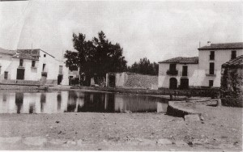

> La bassa. Actual Plaza México

Todo el pueblo colaboró en el relleno de la "*bassa",* con "*els* j*ornals de vila*". Eso quiere decir que se trabaja en ratos o días libres, y no se cobra. Por eso la plaza es de todos, y todos somos los amos. Cuando ya no había" *bassa"* y estaba el suelo lisito, decidieron plantar árboles y aunque quedo bonita, cuando llovía se ponía todo con barro y el ayuntamiento aprovechando que estaban por aquí, tanto el "*Syno Daniel como el Syño Tomas*", los  invito a la sesión y todas las ideas les gustaron tanto que decidieron que iban a ayudar, pero claro, no con" j*ornals de vila*" sino con dinerito. La plaza costo 226.800 pesetas y uno dio 50.000 y el otro 40.000 y otro desde México que se llamaba Salvador Villazon, sin conocernos,, nos regaló 26.800 pesetas y es entonces cuando pusieron una cosa que se llama pavimento, y como era muy caro lo pagaron los hermanos Gonzalo y German Rocha, que vivían en México. Para que nos pudiéramos sentar, hicieron 24 bancos de piedra, y cada uno lo pagó un socio de las cerilleras mexicanas, y el nombre de cada empresa lo grabaron en la piedra, así se puede saber quién pagó cada banco. La piedra la sacaron de las canteras de Xert y el artista que lo hizo se llama Genaro Gil Beltrán y ¿sabes qué? yo sé lo que costo cada banco, nada  menos que 10.714 pesetas, por eso yo me siento cada vez en uno distinto ¡es como si fuera un trono!.... y de los caros. Los mexicanos, cuando se enteraron de lo bonita que había quedado la plaza, decidieron que su Virgen de Guadalupe tenía que proteger a todos los Salsadellenses, por eso se encargó un retablo muy bonito en la que se ve a un indio, pero no de los que llevan plumas, este tiene una capa donde recoge las rosas que le da la Virgen y lo han puesto a la izquierda del altar mayor. Una vez se acabó todo, se hizo una gran fiesta de inaguracion que fue el 9 de Junio de 1964 y se les invito a venir a los mexicanos que habían contribuido a que la plaza quedase así de preciosa y de limpia .Uno de ellos fue Don Francisco Cusi que represento a la cámara cerillera mexicana. Vinieron hasta autobuses y una de tantas  cosas que se hicieron ese día, nos hizo reír hasta llorar y fue que encendieron una traca, cosa normal entre nosotros y ellos se asustaron mucho y se fueron corriendo a esconderse por las casas...¡se creyeron que eran tiros!. Pasado ese susto, al alcalde Diego Ortíz le vino un gran problema y era que donde metía a tanto mexicano inesperado. Entonces pidió colaboración a todo el pueblo y se decidió que se hospedarían en casas particulares. Así todas las familias prepararon sus mejores habitaciones para los invitados.

Y en nuestra casa nos mandaron a dormir a todos mis hermanos y a mí a la *"algorfa"* pero como acabamos todos reventados de tanto dar vueltas por  el pueblo, ya que si fútbol, cine, bailes y hasta castillos de fuego, nos pareció un final de fiesta perfecto. Pusimos mucha paja en el suelo con  sábanas por encima y fue divertido porque, entre otras cosas, cuando nos entró el hambre, nos pusimos a saltar encima de las sabanas y así saltando… saltando conseguimos alcanzar  dos longanizas que estaban "*penjades en el* *cabiró"*. Pero solo robamos  dos...que si no mamá se daría cuenta.

**LAS FIESTAS DE LA ESCUELA**

El 22 de noviembre es la fiesta de "*Santa Catalina"*. Esta es la fiesta de las chicas y el día 6 de diciembre es la de" *San Nicolas de Bar*i "que es  la de los chicos y, aunque todos acabamos comiendo en la fuente de "*San* *Alberto"*, nuestra fiesta es mejor, porque nosotras nos divertimos de verdad de la buena, como lo hacen las niñas y aunque  ellos dicen que se divierten,  yo no me lo creo, porque hacen malezas y, esta vez no son con las puertas sino con las pobres gallinas, ya verás.....lo cuento .

A todas nosotras, nuestras mamas nos preparan la "*mochilla*" para que podamos poner el bocadillo dentro, y esta puede ser de palma o de tela. Si se hace con palma, no cuesta dinerito y casi todas son así porque la palma se coge del monte y se trenza, esto se llama hacer *"llata*" y solo lo saben hacer unos pocos en el pueblo, pero yo tengo mucha suerte porque el que lo sabe hacer ¿a que no adivinas quien es? Pues....mi abuelo Jose Luis. Por eso, como mi "*mochilla*" no hay otra, tiene adornos y lleva mi nombre. Ahí  metemos el bocadillo y, este día  nos ponen una "*tallaeta"* o una *"llonganisa"* y de dulce una "*prima"*. Esto solo lo comemos un día al año porque es nuestra fiesta.

Al salir de misa, como siempre que hay fiesta, nos vamos a la fuente de "*San Alberto"*, pero antes de salir del pueblo, si vemos algún niño le cantamos una canción-poesía, porque lo que  les pasa es que, como nuestra fiesta es antes que la suya, tienen "*envejeta*".Esta vez si que somos un poquito malas y nos reímos de ellos porque, fíjate lo que les decimos:" *los nicolauets tenen envejeta perque no els donem una tallaeta y los nicolauets* *pa compte de prima agafen un tros de pa y un cap de sardina",je....je.* Vamos caminando un poco cargadas porque llevamos los cántaros que están un poco "*badats*" y cantamos a Santa Catalina una canción que te voy a escribir:"*Santa Catalina, la rosa divina*

*anirem al cel a minjarnos la prima*

*al andar, al andar, les catalinetes se confesaran*

*viva la mestra, viva els confits*

*viva el syñó retó que nos va a repartir".*

Una vez en la fuente, llenamos los cantaros o de agua, o de barro, o con pajas y, si tenemos caramelos, también. El juego se llama el *"trencar el cànter"* y elegimos a una niña a la que tapamos los ojos y le damos una caña. Ella tiene que intentar romperlos y, figúrate lo que le puede caer encima. Un año pusimos sapos porque había llovido mucho y estaban por todos los lados y, para que estuvieran callados, los tapamos con trapos. Fue muy divertido, cuando cayeron al suelo, porque se fueron corriendo hacia el rió, tenían sed y susto de los chillidos que dio la niña cuando le quitamos la venda.

Pero a lo que más jugamos  es al corro. Hay muchos corros. El de la patata, el de la gallinita ciega y otro que no me acuerdo del nombre pero si de la letra: “Santa *Bàrbara está al plá i San Josep a la costera*

                     *guerengue, gerengue, que pum*

*                     i garan garanga que pam.*

*                     les sabatetes blanques que pum*

*                     i al mitj totes rojetes".*

Pero el que más me gusta es el de la gallinita ciega porque acaba la canción y la gallina ve. Se canta así:

                       *  "Gallinita ciega como puede ser*

*                         las niñas de corro te han de conocer*

*                         mira para arriba y mira para abajo*

*                         cu cu ¿de dónde vienes?*

*                         de Roma y ¿que traes?  una corona*

*                         ¿porque luchas? por el amor de Dios*

*                          pues pega tres saltos y lo verás bien"*

Cuando ya empieza a anochecer, nos volvemos a casa y ya no cantamos porque ya, casi todas nos hemos quedamos sin voz

**         SAN NICOLAS O LA FIESTA DE LOS CHICOS**

Como siempre la fiesta comenzaba con la Santa Misa. Ellos ya tenían preparados unos sables que les había hecho el carpintero pero que, al llegar a la iglesia los tenían que dejar fuera "*fent un muntó*". Los chicos tenían más suerte que nosotras porque su misa era muy corta. La nuestra todo eran cantos y rezos y a ellos solo bendiciones y "*al carrer"*. Al salir agarraban los sables y corriendo iban "*a la caza de la gallina"*. Ese día las pobres gallinas tenían poco tiempo para comer...Y así como los días normales ellas iban por las eras o calles comiendo solitas, y nosotras las llamábamos diciendo *"tita tita, titoleta*" que por si no lo sabes,  en el lenguaje de las gallinas quiere decir  "*volver al gallinero"* ese día las niñas las recogíamos  con un palo y sin hablarles, entendían que tenían que ir corriendo a casa, antes de que salieran los chicos de misa.

Los niños, ya con sus sables, recorrían todo el pueblo recitando la siguiente poesía:

                          "*Sant Nicolau, santo bendito*

*                          Confesor de Jesucristo*

*                          la gallina que encontremos*

*                          manda el rey que la matemos.*

*                          Ki Ki Ri Ki, Ka Ka Ra Ka*

*                          la gallina nos ha dit*

*                          que tanquen les portes en clau*

*                          que avui els xiquets de l'escola*

*                          fan la festa de Sant Nicolau."*

 Después de la persecución acababan comiendo en San Alberto y ahora, eran ellos los que nos cantaban esta canción:

                        * "Les catalinetes tenen envejeta*

*                         perque no els donem una tallaeta" *

**EL SUEÑO DE CARMENCITA **

Mi mamá siempre me ha dicho que soy especial, que lo que me pasa a mi no le pasa a nadie en el pueblo, y lo gordo es que no lo dice ella sola, mis hermanos, mis vecinos y hasta el "*tío Aparici*" le dan la razón. Y yo me lo tengo que creer y si lo escribo aquí es para que voste," Syñó Daniel "que conoce mucho mundo y sabe de todo, me diga si tienen razón y si es una *"malaltia roïna"*

     Resulta que soy "*sonámbula*" esta palabra no la he inventado yo, nos la dijo el médico cuando mi mamá, junto con el" *tío Aparici"*, que actuó de testigo, me llevaron al médico, y todo fue en que una noche me acosté y como siempre recé el "J*esusito de mi vida," el* "*Bendita sea tu pureza*", todo lo que debía, pero al dormirme soñé, nada menos que a Salsadella venía un barco, figúrate "*quin deslligo*" pero yo lo veía y lo peor de todo, tenía los ojos abiertos y claro, viendo yo  un sucedido tan extraño, también quería que lo vieran mis hermanos, mis papás, mis vecinos y por eso chillaba diciendo, para que todos me oyeran "¡*que viene el barcoooo!*" y ya lo creo que me oyeron, toda la calle se enteró, menos mal que el tío Aparici  tranquilizó a todo el gentio diciendo que él se ocupaba del asunto.  Los de la calle hicieron como que se metían en sus casas pero luego resultó que hicieron "*cucaferes",* otra palabra rara pero no te preocupes que te lo explico, eso es "*escuadriñar"* mirar detrás  del cañizo *y* *"cucaferaron"* muy bien, porque todos se enteraron del final de la historia. Mientras tanto, los de mi casa no conseguían que me calmase porque me decían que no veían el barco y yo, ya con muchos lloros, les dije que para que se lo creyeran me iba a subir en él. Menos mal que en ese momento entró el" *tío Aparici*" y ante el asombro de todos, me dio la razón, me cogió de la mano y me dijo que me acompañaba y los dos  juntos y secándome las lágrimas, nos montamos en el  barco, que resultó ser el gallinero, y así se acabó el problema.

     Al día siguiente mamá dijo "*hoy no hay cole, vamos al médico"* yo no entendía nada porque lo único que me dolía un poco era la "*gola*", a lo que ella me contestó que no le extrañaba nada con los gritos que había pegado, aún lo entendí menos, porque yo había estado toda la noche durmiendo..........

     Llegamos los tres al médico y él fue quién me puso el nombre de" *sonámbula*". Nos explicó que eso le pasa solo a algunas personas,...que no hay que despertarlas, que no se les puede llevar  la contraria y que estaba prohibido reírse de mi porque, yo, si que veía y vivía todo lo que contaba.

     Al acabar el "*tío Aparici"* tranquilizó a mi mamá diciéndole que vigilaría más nuestra calle por si acaso me tenía que acompañar a recoger hierba, a la fuente de San Alberto o a subirme a un tren. Mi mamá, por si acaso, decidió llevarme al Sr. cura para que me echase agua bendita. Ese fue mi primer sueño "*con actuación"* pero normalmente son más tranquilos y bonitos. Verás el que soñé ayer:

     Estábamos en la entrada de casa con mis vecinos todos sentadítos y pelando *"panotxes*" ya que teníamos el suelo lleno de mazorcas de maíz  A dos amigas mías les había pedido que convencieran a sus hermanos para que que vinieran también a ayudar; total que empezamos a pelarlas y de repente a mí me salió una mazorca "*roja"* y cuando eso pasa "*está mandao"* que se tiene que dar un beso a quien la ha pelado. Joseret y Pascualet son los chicos que me gustan, y claro...estaban allí así que los dos me dieron un beso, pero no creas que fue como los de las películas,  no......fue como los de los pueblos, con ruido. Luego les dí las hojas para que cada uno me hiciera un lazo y yo elegiría el más bonito y lo colgaría en el "*cabiró*" de la entrada de casa. Ganó Joseret y decidí que él sería mi novio pero cuando fuera mayor, y para celebrarlo tomamos melón y galletas. Y, claro el melón, no se puede tomar por la noche porque dicen que hace tener pesadillas.

     Mañana tengo que  ir yo a casa de Joseret para ayudarles a pelar mazorcas ¿te figuras que mi sueño se haga realidad?

**                                                         MIS OTROS AMIGOS**

Los mayores dicen que hay que hacer amigos hasta en el infierno, pero eso es una bobada. Todos mis amigos viven aquí, están vivos y la verdad es que me encanta conocer gente nueva de otros sitios. Hay algunos que han nacido en el pueblo, pero viven fuera y vienen de vez en cuando, como el "*Syño. Daniel* "o el "*Syño. Tomás*". Luego ya están los vendedores, como ya he contado, pero que aún quedan más. El primero, y el que más me gusta a mí es el "*Cojo de Albocacer*". Porque viene cargado de "*porcellets, baconets y gorrino*s". No creas que son animales diferentes. ¡Son todos el mismo! pero en tres idiomas diferentes. Además de cojo es muy pillin y a veces nos quiere engañar. Resulta que los gorriníllos son de varios tamaños. Cuanto más grandecito sea, quiere decir que es más comilón, y cuando nos los va a vender, él les estira las patas para que parezca que es mas largo que los demás y nos guste. El año pasado compramos uno que no quería comer y nos dio mucha faena…Teníamos que ir a casa de Paco Juliana y comprarle el *“Soligot”…*esto huele fatal, pues es el “*pis*” que suelta la leche cuando se está haciendo el queso. Resulta que eso le gusta al "*porcelle*t" y se lo ponemos por encima de lo que come, y cuando ya pesa 8 Kgr. a la comida normal, que son nabos, patatas o remolacha hervida, le añadimos "*segó"* y así se pone más gordo en menos tiempo y su carne es más buena porque está “*sanado”*. Resulta que los porcellets tienen unas bolsitas en medio de las patas traseras que si las dejan crecer envenenan la carne y tiene un sabor muy fuerte. Por eso, al poco de venir “*el cojo”* aparece “*el  sanador*” de Tirig y a todos los "*baconets*" les corta sus bolsitas; este también se anuncia con una armónica, pero diferente, que hace unos “*chulits*” muy largos. No creas que todos pueden comprar *el "porcellet".* Cuesta dinerito y no todo el mundo tiene, pero los que si podemos nos lo llevamos a casa, donde ya tiene preparada su habitación, pero en el corral, porque son un poquito sucios y si no se limpia el suelo todos los días, se les ensucian las patas y huelen un muchito mal. Yo además, de vez en cuando, le cepillo el lomo y le hablo pues no tiene mamá y es pequeñito. También, una vez al mes le lavo, pues ese olor es muy fuerte y se me mete por la nariz. Mi mamá dice que eso no se hace pero ella si que me baña a mi…¡y nada menos que una vez a la semana!. Todos los años, el cura o las beatas compran un" *pocellet*" y el *Capellà* lo bautiza con este nombre: *“el porcellet de S. Antoni*”. Como es de todos y de nadie, le han puesto una "*esquella" * de color plata en el cuello. El único problema es que, como no es de ninguna casa no tiene  habitación, pero no le hace falta, duerme donde quiere…¡y mira si es listo! que va de casa en casa y te toca la puerta. Como ya lo sabemos, le sacamos comidita para él y se la echamos en el suelo y aunque yo probé a ponérsela en un plato él no quiso... ¿Comprendes porque le llaman “*gorrino*”?. Así, poco a poco se hace grande y gordo. Mientras es pequeño estoy más contenta, pero cuando se empieza a poner majo me va cogiendo un sentimiento muy raro de describir…a veces siento alegría, pero no tanta como para poder decir que es alegría y escribirlo con todas las letras. Lo voy a dejar en “ale”, y como también siento penita de pensar en lo que le espera, voy a escribirlo todo junto y ver que tal suena: “ale – pena”…así no me gusta, pero si lo cambio un poco suena mejor… “pe –le-ana”…¡Pues es eso lo que siento cuando  oigo el cascabel…y aunque su apellido es el de un santo, este no siente *“peleana*” por él, pues cuando llega el día de Sant Martin , aparece el tío Vicent,  y el santo no le libra de la muerte. Para saber quién será el amo final del "*porcelle*t", el cura organiza una rifa, y mira por donde este año (y me han dicho que alguno más) le ha tocado "*al escolá*". Y la verdad es que no me parece mal que así sea. Así el dinero de la rifa será para la iglesia, y la iglesia es de todos, lo mismo que al "*porcellet"* lo criamos entre todos y lo queríamos…y aunque muere cada año, nos queda su recuerdo y lo empleamos muy bien  pues cuando no encontramos a la gente en su casa decimos" *te pareces al gorrino de Sant. Antoni”.* Pero hablando de amores con animales, los que ganan son los toros. Cada año, para las fiestas de "*Sant Blai"*, que nosotros esperamos “*en candeleta*” traen un montón de toros de una ganadería que se dice “*Charnego*”.  Vienen del Mas de Barberans y como tardan tres días andando duermen en corrales de los pueblos. Aquí  llegan unos setenta u ochenta y aunque para torear solo utilizan seis u ocho, ellos no quieren separarse. Los que se quedan en el corral, se lo pasan muy bien jugando al corro y los que tienen que trabajar, bajan al pueblo siguiendo al pastor y a la “*Manseta”*. La “*Manseta*” es una tora que cuando nació su mamá se murió y el amo la tuvo que criar, y claro, como le daba el biberón, la sacaba de paseo, le ponía un colchón de paja y le hablaba mucho, pues se hizo muy manseta y como a los otros toros les daba mucha pena por eso, la mimaban y la seguían para que no se perdiera. Fue cuando su amo le puso una" *esquella" *pero mucho más grande que la que le ponen al" *porcellet"*. Es un cencerro y hace “*tolón tolón*” y al estar en el campo se oye muy bien…y es que las montañas también la ayudan y por cada “*tolón*” ellas le responden con otro, pero que suena un poco menos. Mientras  los toros trabajan en la Plaza del pueblo que han preparado con muchos carros, ella para no aburrirse, se da una vueltecita por las calles y todos la acariciamos y le hablamos.

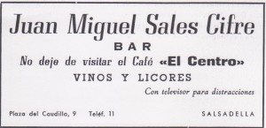

> Anuncio del bar Prudencio del programa de fiestas del año 1967

También, como hace frio  la entramos en los bares,  pero no en el de Prudencio, porque en fiestas se pone un poco nervioso y solo sirve *“vi y coñac”,*  *“vi y coñac”, “vi y coñac”* y a la manseta le gusta solo la "*ausenta"*, pero aunque entra en varios bares y bebe varias" *ausentas",* no por eso se despista. Ella también está trabajando y por eso, cuando algún toro se cansa de torear y se escapa, ella va a buscarlo. Casi siempre cogen el mismo camino, por eso todos dicen: “*ja ha fet cap al corro*”  y no se equivocan. Voy a poner una foto pero no me busques, que yo no estoy en ella.

La manseta con sus amigos

Pero  el animalito más tremendo es el caballo del *"Bar de los Gallegos*", este ha hecho muchas trastadas, ha dado muchos sustos y sobre todo ha conseguido que su amo, Victoriano, reciba muchas riñas de su Palmira. Tiene dos nombres *“Rayo y Centella*” aunque yo creo que más que *Centella*" se debería llamar “*Dentellá*”. Y el caso es que sus amos dicen que" *té coneiximent"…*Y según donde se encuentra saca un" *coneiximent" u* otro. Así es que cuando está en la casa, el duerme en una habitación que hay detrás del bar y que se llama “*cuadra*”, pero delante tiene un pasillo que conduce a otras habitaciones donde hay, muy bien ordenadas: patatas, cebollas, leña, tomates de colgar y muchas cosas de la huerta que Victoriano cultiva y que se necesitan en el bar  Pero la habitación más visitada por todos es la que hay en un rincón al fondo  y que se usa para eso que todos hacemos varias veces al día, que tiene tres letras y que empieza por “*p*” y acaba por “*pis”*. Total que al pobre animalito no le dejan dormir, porque como en el bar hay mucha gente que siempre está bebiendo, pues el pasillo tiene mucho tráfico de personas que entran continuamente, y como tiene conocimiento comprende que tienes prisa y te deja entrar sin problemas, pero a la vuelta…que ya vuelves tranquilo, y sin pis, ha decidido que te cobra un impuesto o iguala, y si no, no te deja salir porque te bloquea el paso con una pata. Tenemos suerte porque le gusta todo: lechuga, col, jamón, cacahuetes y se conforma en seguida, pero si con las prisas se te olvida y  te creas que con una caricia lo dejas conforme, te puede pasar como al "Charnego", que aunque le habían avisado del cobro y de que era un macho que estaba *“brofeg”* él no hizo caso, el "*Rayo*" le miró, echo las orejas para atrás y le acerco sus morros, que son blancos y muy bonitos y el no pudo resistir la tentación y antes de subirse los pantalones cometió el error de creerse que con una caricia se iba a conformar y este le dio unas patadas que todos los del bar oímos. Cuando salimos todos a la calle nos entró mucha risa porque el "Charnego" iba corriendo calle arriba con los "*calçotets*".....por las rodillas. Al único que obedecía era a Victoriano y en una ocasión que se fueron todos "*a beremar a França*", como muchos del pueblo, pues pasó lo que pasó: la abuela Blasa y Victorín se quedaron al frente del negocio familiar, es decir: del bar y del caballo. Victorín tenía que sacarlo de paseo todos los días y darle de beber, sin olvidar que “*se feia loco”* si otro animalito se ponía a beber a su lado, por eso el chico se aseguraba de que no hubiera nadie en el abrevadero, pero un día, estando bebiendo al abuelo *“guaso”* (Tio Batiste) se le ocurrió sacar a su" *aca"* y ponérsela al lado. El Rayo que la vio hecho las orejas hacia atrás, se encendió, la arrinconó en la pared y comenzó a darle como unas patadas en la tripa. El abuelo se puso a chillar y aunque Victorín intentaba sujetarlo con la cuerda solo consiguió quedarse colgado en el aire. Cuando ya se les pudo separar el "*Rayo*" todo chulin” se fue a refrescarse y a beber. De vuelta a casa la abuela Blasa, que había acudido al oír los gritos, decidió castigarle haciéndolo trabajar, pero no contaba con el *“coneiximent”* del "Rayo". El sabía que su amo no estaba y que el mando lo tenía el. El pobre asustado y obediente Victorín si que le puso las alforjas para llenarlas de melones que tenían que recoger de “*Les Llacunes*”, pero cada vez que él veía que enfilaban para salir del pueblo, se quedaba pinchado en el suelo sin querer andar. Victorín le daba otra vuelta al pueblo intentando engañarle pero sin conseguirlo. Pero lo peor de todo le tocó a Paquita y esta vez si que estaba el amo con todos sus hijos.Resulta que cuando acabaron de trabajar todo el día  en “La *Segurana*” y ya estaban recogiendo para volver, el papá pidió a Paquita que cogiera por el ramal al caballo que estaba “*pasturant*” y por lo visto debía de tener aún hambre ya que no le pareció bien que le interrumpieran. Cuando la" *meua amiga*" se acercó, se fue cara a ella con las orejas hacia atrás, la cogió de la ropa levantándola al aire y fíjate si la subió alto que vio como el" *garrofer voltaba"* a su alrededor. Menos mal que cayó en el bancal que acababa de labrar Victoriano y estaba blandito, con lo cual Paquita se hundió y no se hizo demasiado daño, pero como tenía" *coneiximent"*, se dio cuenta de que no chillaba y la remató con una coz en la espalda. Se detuvo porque el papá la empezó a llamar y como estaba enfadado le llamo *“¡aca,* aca!” y esa palabra le ofendió y lo frenó. Paquita no podía ni respirar y el papa le curó el susto y el disgusto solo con agua. Pero el susto le fue cogiendo a él en el camino de vuelta solo de pensar en lo que le diría a Palmira; por eso les dijo a todos que no se lo" *charrasen* a *la mare",* pero eso que pasa con las mamas cuando llegaron ella...... los miró, incluido al caballo y antes de preguntar nada al más pequeño se le fue la lengua y dijo: “¡*a la maña*, *Centella le ha dado una patada*!”…y esta vez quien agachó las orejas fue Victoriano, al recibir la bronca que la mamá le dio.  Pero hubo otro día que también el pobre recibió lo suyo, pero no pasa nada...... porque ya está acostumbrado. Ese día fueron tres de los hijos con él a" *La Sení*a", donde está el huerto y claro, llevaban el carro con el caballo. Después de pasar todo el día allí y de haber comido, estando ya todos los hijos encima del carro, Victoriano se dio cuenta de que se había dejado la azada y se volvió a recogerla. El pobre animalito, obediente, siguió a su amo, y aunque tenía conocimiento no vió un" *clot majo"* que estaba en medio del camino. Total, que cayeron, carro, caballo y niños. Los chicos salieron pero el carro cayó encima del caballo. Uno de ellos se fue a pedir ayuda al pueblo y mientras, los otros hijos consolaron al padre diciéndole: “*Pare no patisca que té un ull obert y esta vegá de veritat no ho charrarem* *a la mare*”   Uno de los que vienen y de tierras muy lejanas es el afilador, o el “*esmolaor*”. Tiene una forma de hablar distinta, pues lo hace poniendo los labios en forma de O cerrada. El disimula diciendo que habla así porque es" *gallegu*", pero yo sé porque lo hace. Resulta que arrastra un  aparato como si fuera un carro,pero que el caballo es él y  que lleva dos ruedas unidas con una madera alargada y encima otra rueda pequeñíta  envuelta con una cinta que llega casi hasta los pies; allí hay una pieza que él hace girar con el pie y cuando acerca un cuchillo, una azada, unas tijeras o cualquier cosa que se necesite afilar, salen muchas chispitas, y claro él ha tenido que acostumbrarse a cerrar los labios y por eso habla tan raro Tiene miedo a que le entren chispitas en la boca y le quemen. Lo que el pobre no sabe, es que  nuestro patrón es San Blas, y a todos los del *"terme*" nos protege la gola, y la prueba de ello la tenemos en el alguacil. Eliseo tiene una buena voz siempre y su trabajo consiste, entre otras cosas anunciar a  todo el vendedor que nos venga a visitar. Se ayuda   con una trompeta y en cada esquina la toca y te dice quien acaba de entrar en el pueblo, aunque cuando viene el afilador el solito se anuncia con una melodía que toca con su "*armónica".* *  * Otro que también aparece y pedaleando en su bici aunque menos mal, que es de vez en cuando, es el   *" Faisero del Forcall"*. Este lleva dos cosas muy diferentes. Una buena y otra mala. La buena son unos "*mocadors"* a cuadros azules que nos ponemos el día del Ball Plá, y la mala es una especie de tubo estrecho que se ponen las mujeres y que para meterse dentro sufren bastante. Como resultado de tanto sufrimiento les salen por debajo del cuello unas tetas grandes, que antes no tenían, y que suben y bajan al respirar, y lo que es peor,  a las chicas les parece bien, pagan dinerito para quedarse con ellas y se ríen mucho…y la verdad no entiendo para que se las quedan  .Y el caso es que para los hombres también se venden estas piezas pero ellos sí que saben para que usarlas

> Bicicleta del faixero.

Unas son para ponérselas cuando tienen dolor de espalda de tanto trabajar en el campo y otras son para el" *ball plá"*, y además de color rojo. Total, que entre la tela que aprieta y las chispas que salen de todo lo que cae en las manos del “*esmolaor*”, a nosotros los niños estos dos vendedores no nos gustan porque nos dan un poquito de miedo, y claro, como los mayores lo saben, cuando quieren que nos estemos quietos nos dicen: “*que ve el esmolaooor..Que ve el faiserooo*”, así, con muchas oooos, bajito y a oscuras…¿a qué es para que te entre miedo a ti también?

> Monumento al faixero de Cinctorres.

**RESOPA Y REPELA: LAS JUERGAS DE LOS CHICOS.** A mi hermano Alberto le encanta que llegue el frío y mucho más si se acompaña de viento;  es entonces cuando me pide que me vaya con él  a buscar unos palitos que luego usaremos para engañar a los tordos. Por lo tanto, por las tardes, después de salir del cole nos vamos primero a por la merienda al horno. La mamá nos ha llevado a cocer una patata, o un boniato o una mazorca, lo que tenía en casa, pero como nosotros no lo sabemos pues…es una sorpresa. Al estar caliente y buenísima, nos entran muchas fuerzas  y ganas de andar por los pinares, buscando esas ramitas que sirven para luego cazar. Mientras llegamos yo le pido que pasemos por los sitios donde, en la primavera habrá un mar. Se hace un mar pero no de agua sino de alfalfa: verde....., alto......., suave...... y a mí me encanta tirarme encima, a la vez que muevo los brazos y las piernas como si nadara.   Algún día, cuando sea mayor, iré a conocerlo de verdad. Solo se del mar por lo que me enseñan en la escuela y también por lo que me cuenta Tomasín, que como vive en México, lo atraviesa para venir a Madrid. A la vuelta  estamos siempre mirando al cielo, esperando ver a los tordos. La mejor hora es al atardecer, y cuando por fin los vemos acudimos a casa del carnicero "*Vicen*t" y le avisamos. A  veces él ya los ha visto y se ha ido al "*parany*", pero casi siempre nos lo encontramos liando unos cigarros tan gordos que, como pesan tanto al fumárselos, hace que la ceniza le caiga y le queme la camisa y se le descosan los botones, pero a él..... le da igual. Le encanta el humo. Él tiene un “*parany*” de olivera, aunque también puede ser de garrofero o de carrasca, y es allí donde prepara las cañitas con el "*visch*" (liga) y las sube al olivo, poniéndolas encima de una tabla, como si fuera un tren, separados los vagones cuatro dedos uno de otro. Mientras hace esto ya tiene encendido el fuego dentro de su barraca, que es de tierra, luego se da una vuelta y comprueba cómo están las ollas. Las ollas son los peroles de la cocina que se han roto, pero no del todo y se ponen enterradas a ras del suelo. Cuando ya está todo preparado "*Vicent*" se mete en su barraca y conecta su casete donde suena el canto de un tordo  y él se acuesta. Antes lo hacía con una especie de pito que sonaba como un silbido pero el lenguaje de los tordos es difícil de imitar, por eso  con el casete, se les engaña mejor y además así se puede dormir mientras el canto suena solo.  Se acuesta en un somier que tiene truqui........ es muy bajito y lo ha elegido así para que el humo flote por encima de él y como no puede salir por arriba, púes su barraca no tiene chimenea, le deja la puerta abierta y el humo sabe que ha de irse por ahí. Si lo miras de lejos parece un “*parany*” mágico pues todos los humos salen por arriba, pero el suyo parece un cohete, porque sale de lado. Como no le gusta dormir solo, ha llenado su barraca de las muñecas viejas de sus niñas, las cuelga en las paredes y en el techo y como no las baña están todas negras del humo.

> El parany del Tio Vicent

Cuando se despierta mira cuantos tordos se han pegado a las ramitas y han caído al suelo y es entonces cuando saca a su compañero el *"musol"*  o  mochuelo  y se lo presenta al tordo. "*El muso*l"  sabe que tiene que girar el cuello para todos los lados y abrir mucho los ojos como si fuera un demonio, para que al tordo le entre miedo y pida auxilio, que lo hace cantando y menos mal que "*Vicen*t" es “*molt cantaor*” y sabe de música, porque si canta bien, le perdona la vida pero como se quede mudo o desentone, con *“un apretó al cap*” lo tira a las ollas, que aunque estén rotas aún sirven para algo.

> Ramitas donde se pegan los tordos

Pero muchas tardes, que lo encontramos en la carnicería él nos dice “*nemon a* *caçar a l’ensesa*” y es que por muy cazador que sea, sin la ayuda de los chicos esta otra forma de cazar no saldría bien pues lo hacen en equipo y con equipaje. Blas, por ser el más pequeño, carga con la pila que pesa poco. Toni, como es el más mayor, lleva el arma, nada menos que  un rifle de aire comprimido. Vicent lleva una paleta y claro como es carnicero, la sabe manejar muy bien y consigue matar más tordos que Toni con su rifle  y Victorin, no sé  qué lleva, pero también va.

> La guitarra o la paleta asesina

Al dejar atrás las ultimas casas ya está prohibido hablar y son los chicos los que hacen callar al "*Tio* *Vicent"* que le da por cantar  y  querer  tocar la guitarra, pero los pillines  ya saben cómo solucionar el problema, le piden que encienda un cigarro y que se consuele con su paleta asesina haciendo el gesto de tocarla como si fuera una  guitarra Después de dejar atrás las escuelas, llegan al barranco de la "*Font*". Ahora ya no pueden hablar nada, solo se tiene que oír el viento. Los tordos están acostaditos entre las cañas del barranco porque allí hace menos aire y entonces es cuando empieza a actuar el equipo. Primero es Blas quien enfoca con su pila y deslumbra a los tordos, luego Vicent da los palazos a todos los que puede y a los que salen volando y quieren escapar, es Toni quien los remata con su escopetilla;  y ya me acuerdo de lo que hace Victorín,  hace de perro y busca los tordos que como les han disparado, se han caído un poquito más lejos y mi Albertito es el que los mete a todos en un saco.

> Dueños del bar

De vuelta ya se puede hablar y cantar, pero como han trabajado mucho les ha entrado a todos un poco de hambre y sed. Es entonces cuando van a  *“Repelá”* y repelan todo lo que ha sobrado en el Bar de los Gallegos: que si un trocito de queso, cuatro *“almeles”,* dos longanizas, y al final el  hueso del jamón…*¡"lo que siga"*!. Con el estómago un poco más tranquilo sacan los tordos y se los reparten, pero si hay muchos se los queda Eliseo" *el Alguacil*" o Gustavo "*el Cartero"*, y por medio del autobús los hacen llegar a algún bar de Castellón.  Esto ocurre solo cuando está abierta la veda, es decir desde San Francisco hasta San Blás. Y cuando ya no se puede hacer  esto *"Vicent"* se añora, es muy chiquero y muy trabajador por eso  al acabarse el día, siempre se quiere dar un *"gust"* y si nos ve  nos dice "¿*qué no* *resoparem*?" Y es que al lado del Ayuntamiento, entre el *“Calvo”* y la casa del *“Lozar”* Vicent tiene una casita donde guarda los toneles de "*ví*" gigantes; estos no tienen grifito para sacar el vino, pero nosotros cogemos un  candil  *(cresol)*  y un punzón y hacemos  un agujerito muy pequeño entre las maderas del barril, y así evitamos que estalle. Pero  solo llenamos  un "*picheret"* y no todas las noches, aunque en realidad no sé por qué tanto secreto ya que gracias a que hacemos esto, hemos evitado que los toneles estallen. Esto también lo repartimos, como los tordos, sin que nadie nos vea, pero antes con un papelito liado como si fuera una bolita, cerramos el *"forat”…*y hasta la próxima noche. No  he dicho que a esto le llamamos “*Pinchar la bota o carretell*” y que a esta juerga yo también  me apunto y….está muy bueno… **     ** ** **

**COMO TODO TIENE SU FIN LLEGO SAN MARTÍN** Acabo de estar con Pepa y voy a escribir todo lo que me ha contado antes de que se me olvide y vuelva a pensar como antes,  porque, aunque todos los años pasa lo mismo, esta vez yo no voy a hacer *“lo* *mismo*”.  Cuando mañana maten a mi "*porcellet",* ya no me esconderé debajo de la cama ni me taparé los oídos, y sobre todo ¡lo más importante! no me enfadaré con San Martín,  ni pondré su estampita castigada cara a la pared. Y  es que tengo mucha suerte de tener a Pepa, pero no como tía, ni abuela, sino como amiga. ¡Es mayor y muy maja!... y cuando digo maja no creas que solo la esté llamando *“gorda”,* que lo es, sino maja de sabuda y buena. Es difícil de entender que de su escuela, que según ella se llama “*de la vida*” le puedan explicar tantas cosas…¡y acaben todas bien!. Por eso cuando tengo alguna *“peleana”, * la busco y casi siempre la encuentro a la sombra de la higuera que está detrás de su casa, haciendo ganchillo y me siento a su lado, en una silla pequeñita  también con mi labor y hablamos…hablamos y …se resuelve todo. Acabo tan contenta que siempre me vuelvo a casa dando saltitos…y mamá, que ya me conoce, me pide que se lo cuente siempre… Pero si no la encuentro en la higuera ya no la busco, pues en una ocasión me dijeron que estaba en el cementerio, y yo, que ese día solo quería darle un regalo, me fui a buscarla, y fue la única vez que lo que me contó me hizo poner tan triste, que, esa vez, no volví a casa dando saltitos,  sino ¡sonándome muchos mocos…! Me contó que su mamá murió cuando ella tenía seis años y su hermanito Jaime era tan pequeño que solo podía tomar leche y su abuela lo intentaba, pero solo callaba un poco, porque a las abuelas no les sale  leche y el niño pasaba mucha hambre;  lloraba y todos los vecinos lo oían, pero en esa misma calle había otra mamá que le pasaba como a la cabra que ya te conté, que al oír los lloros le daba mucha pena y fabricaba más leche y claro, ¡su niño se atragantaba!, por eso llamaban a la abuelita de Pepa y le pedía por favor que le llevara a Jaime para darle un rato de “*mamella*”. Pero ya no quiero contar más cosas tristes. Quiero explicar lo del " *porcellet",* porque solo de escribir esto ya lloro…un poco. Pero aunque parece que sea poco,! mancho mucho el papel !. *"El baconet"* que tan a gusto hemos criado y que nació por Sant Antoni, cuando se acerca el día de San Martín, no sé si con ayuda o él solo, decide que hay que ayudar y alegrar a la familia que le ha cuidado tan bien. Él tiene su carne muy tierna, casi no tiene un año, y nosotros solo compramos carne blandita cuando hay alguien malito en casa…y ¡se entera todo el pueblo! El carnicero, que es el tío Sento, siempre te pregunta: ¿quién está malito? Menos mal que esto pasa pocas veces, pues esta carne es más cara que la otra, y es porque cura y con dos corderitos que mate a la semana ya tiene para sanar a todos los enfermos del pueblo. Los demás, cuando podemos, compramos carne de la más barata, pero que está un poco dura. Sento elige a las cabras y ovejas que son un poco mayores y que se portan mal. ¡Y es que algunas tienen mal genio, otras son feas, y ¡lo peor de todo! hay algunas que son malas madres, y nuestras mamás  que sí que son buenas madres, estos trozos de carne nos los cuecen en el puchero mucho rato, para que a nosotros no se nos haga *“bola”* Y como en el pueblo todos nos conocemos, cuando *"el baconet"* recibe la visita del tío Sento y le saluda, ya sabe lo que le espera. Entran a recogerlo dos de sus seis hijos: Tofol y Vicente,  mientras que el padre se queda fuera, donde hay preparada una gran mesa. Cuando ya está en la calle empieza a dar unos gritos muy fuertes, y hasta que Pepa no me lo explicó yo creía que eran de miedo, y por eso yo me escondía, pero no, es que se está despidiendo de todos, a la vez que da saltos, pero como son de alegría no se resiste ni se escapa, y para que no se haga daño con tantos brincos, los chicos le atan las cuatro patas y lo suben a la mesa.

> La matanza y Vicentet

Es allí donde hay un cuchillo que si se lo clavan en un sitio del cuello donde hay un hueco que no le duele, pero sí que le hace mucha sangre y poco a poco se le va yendo la voz y quedándose quieto y eso quiere decir que…….. se ha muerto. Es entonces cuando empieza “la *chalera”* para todos los niños, pues se coge una *"archilaga*" seca, se enciende y se le pasa por todo el cuerpo para quemarle los pelos y así poco a poco las pezuñas se van haciendo flojas y muy negras del fuego, y es en este momento cuando  todos los chicos nos ponemos a la espalda de "*Sento"* esperando que las *"picholas"*se hagan tan tiernas que se separen de las manitas del cerdo. Luego, con agua caliente y una *“tosca”* se acaba de limpiar muy bien y se queda tan blanco como las servilletas que sacamos los días de fiesta…y ahora es cuando "*Sento*" le hace “l*os honores al cerdo*”. Esto quiere decir que lo va partiendo con mucha gracia y, según Pepa, es todo un honor para el cerdo porque todo  lo suyo se aprovecha. Nosotros le dimos nuestras sobras más lo que nos da la huerta y él lo trasforma en unas carnes muy sabrosas y tiernas .Además nos consuela a los niños que nos hemos quedado sin *“pichola”.* Y este es el segundo honor que nos hace .Cuando toca sacar la *“bufa”* o como lo llaman los mayores la vejiga, se vacía de pipí y sin limpiar se le pone un palito para que se pueda hinchar. Esto lo hace "Tafol" porque es el que tiene una “*bona bufera*” pero antes le da unos golpes en la mesa…así….así…para hacerla blandita y poderla inflar mejor. Cuando ya parece una pelota se cierra el agujerito por donde se ha bufado y todos jugamos a pasárnosla. Al  principio es de color claro, brillante y rueda mucho, pero poco a poco se va haciendo pequeña, negra, pegajosa y lenta. Tenemos cuidado en no romperla porque quien lo hace recibe un *“calbot”* y tiene que soportar los lloros inconsolables de los niños más pequeños. Pero nos conformamos enseguida, cada tarde se repite en otra casa y…volvemos a empezar Una vez hecho esto *"Sento"* ya se va y toda la carne se mete en la casa donde se empiezan a preparar las morcillas, los chorizos, ¡ hum!….,"*les llonganiçes*", los jamones, ¡no se tira nada!. Ayudamos todos, vecinos, amigos y familiares y después comemos el hígado frito en una paella  grande Tengo que agradecer a Pepa el que me haya hecho comprender que gracias al *“porcellet”* no hace falta estar malito para comer carne… y de la tierna **                                           **

** LAS FIESTAS DE AGOSTO** Hoy no es ni 15, ni 16, ni 17 de Agosto; es enero, y en la calle hace mucho frío, pero yo tengo mucha suerte. Estoy en casa al lado del fuego, contando los días que faltan para las fiestas de San Blas, que son el 3 de febrero, y es que en Salsadella tenemos fiestas en invierno y en verano. Ahora tendré que contar muchas cosas de las que pasan estos días, y como hace frío tendré mucho más rato para escribir y por eso voy a empezar a explicarte lo que ocurre en las fiestas de la Virgen de Agosto, porque San Blás será importante, pero la Virgen lo es más. El día 15 es el día más señalado del año, es la fiesta de la Virgen, y nada menos que es la Virgen de la Leche, por eso tenemos un retablo con la imagen de la *"Mare de Deu",* con el niño en el pecho y es que todas las mamás nos dan lo mejor, por eso nuestras madres ese día, ya por la mañana van a casa Fraga y compran los melones que nos comeremos el día de la venta, y además nos hacen un *“prim”* para que nuestra comida sea de fiesta. Me encanta este día porque, vamos a Misa Mayor con los mejores vestidos que tenemos y estamos tan guapos, tan mudaos y cantamos tanto, que la iglesia parece hasta más grande, más bonita y más alegre. Cuando acaba la misa nos vamos al local de *"Aguedeta"* a bailar, y como esta vez, no hay polis bailamos todos, mayores, abueletes y niños. Nuestra música es la mejor y la más moderna de toda la *"contorna",* porque los discos nos los regalan las hijas de Daniel. Cuando estrenamos el disco y hasta que cogemos el ritmo, nos pisamos, tropezamos…pero enseguidita nos espabilamos y “*chalem amuntó*”. Al acabar los bailes, volvemos a encontrarnos los de casa y nos vamos a comer todos juntos en una mesa muy larga que tenemos ya preparada, los abuelos, tíos y primos y como las familias son muy grandes, nos divertimos mucho. A media tarde toca bailar otra vez, pero ya no es con discos, es con la banda del pueblo. Las parejas que quieren se visten con el traje típico para bailar el “*Ball Plá*” y es costumbre que salga una representación del Alcalde. Yo siempre he pensado que tendría que salir él, pero he comprendido que, como las chicas tienen más gracia, vale más que salga su mujer o su hija, y eso es lo que pasa. El día 16 es el día de los *“xiquets”* y por eso le llamamos *“Agostet”.* No creas que nosotros nos vamos a quedar sin baile. Tenemos los trajes preparados de un año para otro, pero este año pasado mi blusa ya me estaba un poco apretada y mamá, cuando me ayudó a vestirme y vio que no me entraba se puso un poco triste y me dijo que era porque me hacía mayor, ¡con lo contenta que estoy yo!, pero es porque se cree que me tiene que comprar otra blusa y ya no se acuerda de que, cuando se nos queda pequeña esa ropa, siempre heredamos de un familiar o un vecino. Yo me hago grande, tengo 9 años y voy para 10. Nací un día muy bonito que es el día de la Virgen del Rosario, por eso tengo tres nombres. Uno más que *"Fernandet",* que solo tiene dos. El primero es *"María"* porque todas las vírgenes son Marías, el segundo es *"Carmen",* por mama, aunque siempre me llaman *"Carmencita"* y el tercero es *"Rosario"* y ya te puedes imaginar el porqué. El día 17 es el de la romería a la venta. Lo primero que hacen los jóvenes es preparar el *“Fató”.* Esa palabra tan rara no me la he inventado yo, quiere decir comida pero no sé en qué idioma. Se prepara todo lo necesario para hacer paella, pero solo se compra la carne, porque los dulces y los melones las mamás ya los tienen preparados; y como los chicos y las chicas tienen poca perra, pues hacen una recolecta de casa en casa y así se consigue el dinero para el arroz, las verduras, el aceite…… no perdón, el aceite es de casa. De la comida se encargan las chicas y los chicos escogen al mulo más listo, con el carro más nuevo y seguro, que les llevará a la venta. Pero la bebida también es cosa de hombres, por un lado están las garrafas que luego tendrán que llenar en la fuente y servirá para cocer el arroz y por otro la bebida que ayudará a alegrarnos a todos. El vino y coñac para ellos y el anís y la *"champaiña!"* para ellas. Esta es una bebida que se hace en casa especialmente para las mujeres y es un moscatel pero *“una* *miqueta mes mollet*”, que alegra un montón, pues ataca a la lengua y la suelta, y si no acuérdate de lo que pasa los domingos en casa de la "*Sra. Consuelo".* Con todo este cargamento se suben los que quieren al carro, y para que el mulo quiera ir y no piense que va a trabajar, se va cantando hasta que se llega a la “*Venta de la Figuera*”.

> En la Venta con garrafas cantaros, melones y sartén

Allí, bajo del puente ya se quedan algunos a preparar sus paellas, buscando la leña, haciendo el fuego y sin olvidarse de poner los melones a enfriar en el río  pero cada uno tiene que tener una señal distinta, así nadie se confundirá al ir a sacarlo para comérselo. Al principio es fácil, pero se nos acaban las señales y si se repiten es difícil de saber cuál es el tuyo…y queda precioso verlos en el río  porque como saben nadar no se hunden. También se ponen a enfriar las botellas y hay que vigilarlo todo para que nadie te *“fotie*” ninguna. La paella  cuando vamos a comérnosla lo hacemos “*con una cuchara y* *paso atrás*” y estamos sentados en el suelo encima de unas mantas. Esto se nos hace un poco incómodo para las chicas pero muy divertido para los chicos, que además de mirar mucho, nos cuentan chistes, pero, cuando ya está el arroz siempre  falta gente, que parece como si se hubieran perdido, es entonces cuando los más mayores nos mandan a los pequeños a buscarlos entre las cañas…y siempre los encontramos.

> La Eucarina del tio Cayetano

Pero el momento mejor es cuando aparece *"Vicent* o *Fernandet",* que no creas que son dos personas, es solo una pero vale por muchas porque el solo igual te toca el acordeón o la guitarra… ¡y lo hace de bien!... Y él dice que no sabe de *"solfa",* que solo toca de oído y cuando le acompañan cantando la colla de los Tamarros con Cayetano tocando la Eucarina y el tio Foro con el acordeoncito que le trajeron de Cuba, pues ya nadie se aguanta y todos nos ponemos a bailar armando una gran polvareda. Hay otras collas que también hacen mucho ruido y tienen unos nombres muy originales: La Taurina, Oeste, Caldero, Burriach y Decálitro.  Ah! Y no he hablado de la del tío Foro, que además de ser" *molt cantaor*", sabe tocar el clarinete.

> El Acordeón de "Fernandet"

En esta primera parada los jóvenes tienen que tener cuidado con la bebida, pues ya sabemos que cuando se bebe, a algunos les da por decir y hacer tonterías…Algunas no importan mucho y nos hacen gracia pues les da por llamarnos a las chicas *“culo alegre”* porque algunas lo tenemos un poquito respingón, pero con las tonterías, que ellos dicen que son bromas, ya es otra cosa. Un año a *"Fernandet",* que se toma la música muy en serio, le escondieron su guitarra y claro, como él es “*una miqueta*” especial…pues pasó lo que pasó, que “*plegó los trastos*” y casi se acaba la fiesta. Menos mal que al final todo quedó en una amenaza y dijo: “*ja no tornaré mai mes a la venta*” y es que a veces se pasan mucho, como el año en que Tomasín y Danielin no podían bajar de la roca que estaba en el rio porque les tiraban piedras y todo era por envidia, pues a ellos les habían llevado a la venta en coche y nada menos que con chófer  que se llama *"Vicentet".* Yo, eso no creo que sea una broma porque las piedras hacen pupa.

> Pandilla en la roca

La segunda parada es en *“El Molinet*”. Esto es como un pueblo, tiene varias casas y  hasta un horno. Allí vive "*Vicentic*a *Labernia*", que es gran amiga de Pepa y ya mía también. Los jueves, como no hay cole, es cuando vamos a lavar la ropa, y cuando hemos de ir a verla, Pepa me ayuda para que acabe antes y así, las dos y mi perra, nos vamos paseando cogidas de la mano y hablando mucho, hasta que llegamos al *“Moline*t”. Por el camino da tiempo para contarme cosas que a mí me gustan muchos, tantos que a veces me tengo que parar y pensar……. pero Pepa me estira de la mano y yo le sigo. La última vez me contó que aunque ella vive con sus padres, resulta que tiene dos mamas y dos papás y que los cuatro la quieren. Los papás de mentiras iban todos los años a “*tomar los baños*” a Alcocebre y allí estaban un mes viviendo en casa de un matrimonio que tenía muchos hijos pero poca comida. Se ve que se encariñaron con la niña y para poderla criar mejor se la dejaron a los del *"Molinet",* pero con la condición de que pasara parte del verano y de la Navidad  con ellos para conseguir que los hermanos y los padres se siguieran queriendo. El único problemilla era que para ir a la Escuela le pillaba un poquito lejos porque estaban en el Mas d’En Rieres, pero su papá lo resolvió no sé cómo, pero *"Vicentica"* iba tan contenta con su cartera que me la enseñó un día y es preciosa, le cabe justo dos libros y algún lápiz.

> La cartera de Vicentica

> La cartera de Vicentica por dentro, con dos libros y dos lápices.

Cuando me contó esto, me paré tanto rato, que hasta mi perra se me disgustó y me ladró. Ella también tiene prisa, sabe que cuando llega Vicentica le da alguna golosina. Por eso yo siempre intento que mi familia haga la paella en *"El Molinet",* y no me cuesta nada convencerles. Allí hay una fuente y los, *"safareig"…y* ¡lo mejor de lo mejor! hay sombra, pero una sombra que a veces te deja caer una sorpresa en forma de gusanos; aun así el arroz sale siempre bueno, la *"champaineta"* mejor y el brazo de gitano y el *“prim”* de las mamás está *“de categoría”.*

> Los safareig del Molinet

Después de comer, beber, bailar, bañarnos, pero solo un poco los pies, jugar al escondite algunos, perseguir a los melones y botellas rio abajo y muchas más cosas, toca pensar en volver. Ahora el mando lo cogen a medias las chicas y los mulos y a los carros le ponemos cañas del  río y ramas, para adornarlos y así   que desde lejos se nos vea. Los chicos consiguen con nuestra ayuda, subirse al carro, porque casi no pueden andar y “se *giten”* en él, pero a veces dejan las piernas colgando por la parte de atrás y nosotras padecemos por si se caen. Menos mal que los mulos, que son los más listos del pueblo, van despacito y saben el camino de vuelta.

Los que se han quedado en sus casas también quieren ver un poco la fiesta y se asoman a la carretera para verlos llegar y cuando los ven venir los anuncian…”*Ya viene la peña taurina*” y a estos se les oye cantando “*cruzando montes y valles*”. Pero una vez dentro del pueblo se cambia de canción y los mulos ya saben que tienen que repartir a todos sus pasajeros, pues cantan  “*adiós con el corazón*”. Luego de descansar y dormir se repasaba si había quedado sobras para la cena. Si era si… ¡pues estupendo!, pero si era no, se cogía un huevo para tortilla y esta era la cena de despedida y tampoco está mal ¡hemos comido mucho!

> Pandillas en el día de la venta

**MIS AMIGOS LOS FORASTEROS**:

Tengo dos amiguitos, muy importantes para mí, que son de fuera, uno de un país muy lejano que es Méjico y se llama Tomasín y el otro no sé de donde es pero se llama Pepe.   Digo que son amiguitos, porque son niños como yo, ya que amigos míos lo son todos los que viven en  Salsadella, aunque  hay algunas cosas que no entiendo de los mayores y una de ellas es que hay personas que no se hablan con otras, ni se saludan por la calle, eso lo he visto yo, y boba de mi, me creía que era porque estaban sordos, y ¿cómo no? fue" *Pepa",* como siempre, quien me lo aclaró.

Es cierto que los amigos se hacen con el juego y ellos ya no corren, ni juegan al escondite ni al" *Doli_Fo*li" pero sí que juegan aunque sea de otra forma, pues hacen partidas de cartas, van al "*trinquet"* y se reúnen en los bares. Por eso, cuando estaba cosiendo toda pensativa mi *“pedás”* a la sombra de la higuera, Pepa me aclaró que a veces no se sabía la causa del enfado, y que habían sido los antepasados los que se habían disgustado y ellos seguían aun sin hablarse. No sé porque no aprenden de los animales de su casa, sobre todo de los perros y las gallinas que nunca se enfadan aunque reciban riñas como las que les da mi mamá cuando se enfada, sobre todo con Papá, en vez de reñirle a él se va muy decidida al corral y les suelta una buena a las gallinas, menos a las que están cluecas, aunque al que más le cae es al gallo, que es muy chulín. Este aún le rechista un poco, pero las gallinas la miran, la escuchan y luego nos regalan sus huevos. Y no hablemos de los perros. Yo tengo una *"goseta"* que se llama Nana y siempre viene conmigo, tanto de día como de noche. Yo le hablo mucho y me entiende todo, hasta adivina cuando estoy contenta o muy contenta, porque yo triste casi nunca estoy.  Se sienta a mi lado y me da cariñitos. Ella no me puede dar besos pero cuando yo la acaricio me lame una mano y como le parece poco, me pide la otra. Mi amigo *"Tomasín"* es hijo de D. Tomás y de Dª Flora y los tres pasan temporadas muy largas en Salsadella. Cuando no están con nosotros viven y  trabajan en Méjico con el Sr. Daniel en el negocio de las cerillas. D. Tomás es un hombre que no hace ruido, es calladito; parece que no hace nada, pero yo sé que ha hecho grandes obras por el pueblo y quiero que me las cuente. Voy a aprovechar que nos han invitado al cumple de *"Tomasín"* para pedirle que, si le parece bien, me explique su vida. Me he enterado que lo último que él ha pagado ha sido el alumbrado público y ha hecho felices a todas las abuelas que juegan a las cartas por la noche, a la fresca en la calle; ellas se ponían alrededor de la mesa y no veían ni papa, hasta que pusieron las farolas. Pero D. Tomás es casi más feliz que las jugadoras, ya que  muchas noches se pasea por las calles con Dª Flora y todas las abuelas le dicen lo bien que ahora ven las cartas y, como hay tanta luz su mujer reluce mucho. Es muy maja, delgada y se peina recogiéndose el pelo con un moño, aunque lo que más me gusta son los vestidos que lleva; casi todos son estampados de flores rojas. Mi amiga Maribel tiene un vestido que, cuando se muda  los domingos y se lo pone, ella solita se dice: “*Hoy voy vestida de Dª Flora*”. Claro que en verano es más fácil ir guapa que en invierno, pues como hace tanto frío tenemos que ponernos “*el refajo*”. La tela la compramos en *“ca la tía Vicenta*”, la de Nelo, que tiene una *"botiga",* pero el vestido nos lo hace  mamá. Es incómodo, pesa mucho, es de manga larga y en el pecho ponen la tela arrugada. Lo único bonito es que está todo con puntillas de colores: azul, rosa, blanco…

> Anuncio del programa de fiestas año 1957."Ca la tia Vicentica"

El cuerpo, así, lo tenemos abrigado, pero las piernas se nos hielan. Todas llevamos unos calcetines cortos de color blanco y el resto al aire. A los chicos les pasa lo mismo, llevan pantalones cortos y las rodillas se les ponen hasta moradas. Encima del refajo nos ponemos las batas *de "guida"  *que son las que usamos en verano y tienen cuadritos, por eso tenemos tanta ilusión cuando llega La Purísima, pues es entonces cuando estrenamos, si podemos, algo de ropa, o zapatos, o un jersey, o aunque solo sea una cinta para el pelo como las gallinas .

> La casa de Tomasin con la Guadalupana

Hace unos días fue el cumple de Tomasín y como son ricos nos invitaron a todos los niños a merendar en su casa. Viven en la Plaza Méjico y su casa tiene una imagen de la *“Guadalupana”.* Ponen unas mesas muy largas en la cochera y nos dan chocolate, pero no del que se come “a *bocaos”* sino uno que se pone en una taza como si fuera leche y se pueden mojar bollos y “*pasta de mida*” y nos ponen tanta que  podemos repetir hasta hartarnos. Fíjate si son amables que a todos nos dan un regalo. Yo creía que teníamos que ser nosotros los que le regalásemos a Tomasín, pero Dª Flora dijo que nuestro regalo tenía que ser una canción dedicada a él. Ahí nos pilló a todos pues no se nos ocurría ninguna que hablara de Tomasín, pero ella, como buena mamá, lo arregló enseguida y nos dijo muy bajito, en la oreja, a cada uno lo que teníamos que cantar aunque “*aixó no ho habiem sentit dir* *mai”*. Verás, decía así. "¡*A la bimbo, bimbo, bimbo!* *¡A la bimbo, bimbo, ba!* ¡*Tomasín, Tomasín, ra,ra,ra!"* Bien… ¡y aplausos! El ra, ra, ra lo teníamos que decir muy fuerte, y fue después de la canción cuando nos dio los regalos. Esta vez a las chicas nos tocó una salita de estar que tenía una mesa camilla y dos mecedoras de hojalata y de color azul. Todo muy pequeño, metido dentro de una cajita larga pero muy bien arreglado. Después de acabar de ver los regalos, nos dimos cuenta de que en la calle había mucho jaleo y, claro, salimos todos a escudriñar. Allí estaba Blas Fraga con su coche furgoneta que iba *"arranada"* de tanto peso y rodeada de gente que lanzaba gritos de asombro. Blas viene de pescar en Vinaroz y es el mejor pescador de todos, trae más de 20 peces, que se llaman doradas y *"llobarros",* grandísimos y muy relucientes. Eso de relucir quiere decir que es fresco y no como el que trae “*lo Mañá*” que cuando llega, de tanto calor que ha pasado en el camino,  parece que el pescado ya se ha cocido. Ellos vienen tres días en semana subidos en un camioncito de color rojo, que parar lo sabe hacer bien, pero volverlo a arrancar le cuesta mucho y todos intentamos ayudar empujándolo, aunque nosotros solo hacemos fuerza. Es una carraca y cuando no arranca se le da vueltas con una manivela, pero eso es al final de la venta de su pescado. El alguacil, que últimamente está muy guapo, pues lleva una boina que le regaló Diego, lo anuncia  tocando su trompeta y diciendo: “*De* *parte del Sr. Alcalde se hace saber que ha llegado lo Mañá y trae pescado* *fresco”*. En la calle ponen unas cajas de madera y encima las del pescado. Vende “*Els llangostins del pobres*” que tienen muchos pinchos y parece un gusano gordo blanco. Lo llaman galeras. Su ayudante es un chico joven, y aunque es tuerto sabe despachar muy bien "*les palaetes, la morralla o els llangostins*".  Algunos llevan un plato en donde les dejan  el pescado que compran y a otros se los ponen en una hoja de col la media libra que han pagado. La morralla es lo que primero se acaba, es lo más barato y tiene muchas espinas, pero las mamas con los dedos y mucha paciencia lo dejan sin ninguna y otra vez convierten en bueno lo que parecía imposible, y encima está rico. Pero el día que aparece Blas todo es distinto. Él vive en la plaza México enfrente de Tomasín y como trae tantos peces los regala a sus vecinos, amigos y familiares. El, aunque es mayor, sí que se habla con todos, no está enfadado con nadie y todos le queremos Para poder pescar tanto, siempre se tiene que buscar  un ayudante porque el solo, no podría recoger tantas piezas. Me contó papá que un día se fue con él y no le dejaron los peces ni comer, pues aunque ellos preparaban las cañas y las echaban al mar, picaban tan aprisa que no podían sacar el bocadillo. Al final decidieron que, aunque picasen, dejarían las cañas sin recoger hasta que no acabaran la comida, pero fue imposible, las cañas se doblaban tanto que si las dejaban se romperían. Parece que Blas es mago.  Los pescadores se alegran mucho cuando lo ven aparecer y todos quieren  ponerse a su lado, pues es seguro que se empieza a animar la tarde. Según el su magia está en comprar la mejor sardina, pero los otros compañeros tienen que comprender que Blas juega con ventaja porque el patrón del pueblo  es San Blas, y, si además te han puesto de nombre Blas y te han pasado la reliquia por la gola pues el Santo te concede una gracia especial y es la de saber poner el anzuelo dentro de la sardina, de forma que se le clave en la *"gola"* y así lo puedas pescar. Este pescado tiene mucha carne y además, es gratis. Fue un final de cumpleaños  estupendo, aunque en realidad la fiesta acabó un poco más tarde porque a Tomasín le encanta ir a recoger *“fem”* con nosotros y como a sus papás esto no les gusta, cuando queremos ver de verdad disfrutar a nuestro amigo le invitamos a ir a buscar el *“fem”.* Cogemos  un capazo al que atamos una cuerda y nos  vamos por todo el pueblo recogiendo boñigas. Además de limpiar las calles, cuando ya está lleno el capazo se lo llevamos a *"Garrete"y* este nos  paga con dinerito y moras para las gallinas. Y ahora me toca hablar de Pepe, pero si no te cuento cosas de Pepita no entenderás nada. Antes, cuando empecé a escribir este diario se lo dedicaba casi todo al Sr. Daniel, pero ese cuaderno se acabó. Ahora tengo otro nuevo y resulta que me gusta seguir contando todo lo que veo y esta vez lo hago para mí y así siempre me acordaré de lo feliz que soy. Es tan bonito mi pueblo y pasan cosas tan estupendas que ¿cómo no voy a ponerlas en el papel? Pues Pepita es nuestra telefonista, que junto con Elvireta son las chicas más guapas de Salsadella. Antes el teléfono estuvo en otro sitio, creo que al lado de un bar, luego en casa de Simeón y  Consuelo y por último lo pusieron en la calle San Vicente y se lo dieron a María, la hermana de Pepita, pero María se fue a América y se quedó  Pepita con la central. En San Mateo también había una telefonista *"fadrina"* que le gustaba un chico de aquí y le pedía a Pepita que le conectara con él para poder *“festejar”* un poco. La de San Mateo pasaba un poco de miedo pues padecía  por si bajaba el ama y los pillaba. Como cada día que pasaba la cosa entre los dos iba mejor, la chica en agradecimiento le dijo a Pepita: ¿*amb  quí vols parlar debae*s? Como no supo que contestar la *"santmatevana" le* dijo: “*te conectaré con el 24, que allí vive un buen partido*”. El buen partido se llamaba Isidorín y tenía una serrería. Así que, como era gratis, tanto hablaron que se cansaron solo de oírse y la "sanmatevana" que no se había cansado del suyo, les animo a que se conocieran cara a cara. Entonces pasaron dos cosas importantes. Una fue que llegaron las fiestas de S. Blás y la otra fue que Isidorín se hizo “*quinto*”…Ahora ya te tendré que llamar Isidoro, que ya es mayor y se va a la mili. Antes de irse a la mili, los quintos estaban un mes o dos semanas de fiesta y hacían lo que llaman" *La Capte*" y es que cogen un capazo y van pidiendo comida y cada uno les da lo que tiene o puede. En una casa les dan vino (esa es la mía), en otra un *"conill"o* unas patatas, en los masos huevos, y casi siempre les invitan a comer. Quieren tener mucha fiesta y sentirse queridos por todos porque después se pueden añorar y algunos ponerse tristes, por eso, cuanto más cariñitos se lleven de nosotros mejor lo resistirán y más ganas tendrán de volver. Isidoro y su amigo El Bombet querían  llevarse también cariñitos de las dos más guapas del pueblo y para poderlo hacer se compró una Iresa. Se llama así, pero en realidad es una moto que la compraron de tercera mano a su primo, y que para arrancarla había que “*fer força*”, pero una vez en marcha hacía más ruido que un avión y todo el pueblo se enteraba de cuando *“los forasteros”* habían acabado de *“festejar”.* A la  segunda vez que los *“fadrins del poble*” vieron que les iban a robar a las *“chiques* *mes guapes del  poble*" y cuando oyeron el ruido del avión, salieron cargaditos de piedras y los persiguieron calle del Sol hasta arriba. Tuvieron suerte porque a la moto, aunque era vieja, una vez calentita, le pasa como a las abuelas, que les da por irse al bancal, pero ellas a trabajar y los otros… ¡a escaparse! También apareció el Tío Aparici pues eran nada menos que las dos de la mañana; y como tiene poderes con todo lo que vuela, consiguió que las piedras no le dieran ni a la Iresa ni a ellos, pero un poco de razón sí que tenían de enfadarse, porque *el"Bombet",* que es un poco chulín, en su pueblo presumía  de que ligaba mucho en Salsadella…¡como si aquí no hubiese chicos guapos!, por eso, cuando venía Isidoro solo, no le decían nada aunque hiciera mucho ruido al irse. Te iba a hablar de Pepe, pero ahora no lo haré. Acaba de venir a buscarme, y me voy con él  y ya te contaré...cuando me apetezca volver a escribir.

**LA CENTRAL TELEFÓNICA  Y “LA CAPTE”**

** ** Cada vez que viene Pepe a buscarme a mi sola, es para ir a la casa en la que vive largas temporadas, que es la central del teléfono. Allí también trabaja como telefonista su prima, que aunque de verdad no es su prima, se quieren como si lo fueran. Viene a buscarme porque dice, que las chicas somos más pillas en entender cosas de amores y que yo le doy a todo una explicación que a él le gusta, y la prueba está en que Pepe, aunque es más mayor que yo, se ríe mucho conmigo y yo....de él y es porque de esto, casi no entiende nada.

La central está en casa del “tío *Vicent",* que es el papá de Pepita y que se casó por primera vez con una chica muy buena que se llamaba María, pero cuando nació su hijita se quedó mal y al cabo de algunos meses se murió. El "tío *Vicent"* no sabía hacer de mama y al poco tiempo conoció a Encarnación y Encarnación se enamoró de él y de su hijita. Además de cuidar de María, le regalo otra niña preciosa que fue Pepita y Pepe era hijo de un hermano de la primera mujer, por eso no son primos pero da igual, el pasa temporadas con nosotros y es uno más. Resulta que desde que ya se conocen, pero de verdad, a Isidoro y Pepita eso de oírse por teléfono ya no les gusta tanto y como tiene su moto, les apetece más hablar pero mirándose a la cara y estando juntos, por eso cuando llega Isidoro, lo primero que hace, es darle faena a Pepe que, como no entiende de amores, siempre está por medio y al ser forastero necesita un ayudante, que soy yo, para poder hacer bien los recados. Cuando ya estamos en la central la primera cosa que nos piden siempre......siempre es la misma: quiere que le compremos tabaco en "*ca Germane*t", pero del rubio y además nos dice que demos una vuelta entera al pueblo tanto al ir a comprarlo como al volver, quiere que paseemos porque sabe que los niños no nos podemos estar quietos en la silla si antes no nos hemos agotado bien y ¿cómo vamos a estar delante de las clavijas y cables de la central quietecitos si no nos hemos cansado?. La primera vez que fuimos a por el tabaco, se nos ocurrió que si íbamos corriendo tardaríamos menos y nos cansaríamos más y así lo hicimos, pero resultó que a Pepita no le gustó nada, dijo que habíamos meneado mucho al tabaco y que eso hacía que al fumárselo se mareara Isidoro. Total que vamos despacito, hablando y por eso Pepe para no aburrirse viene y me busca para que le acompañe.

> Anuncio programa de fiestas año 1957(estanco)

Cuando hemos dejado el tabaco, nos vuelven a enviar a que avisemos a las personas que van a recibir una conferencia. Yo llevo apuntadas en un papelito las horas en que tienen que acudir a la central para meterse en la cabina y poder hablar con sus familiares y claro Pepe no sabe dónde viven, pero yo sí. Al acercarnos, ya de vuelta de esta segunda salida, también siempre nos pasa lo mismo y es que oímos varias llamadas a la vez y ahora sí que corremos para llegar antes porque a ellos se les ha acumulado el trabajo y no tienen bastantes manos para enchufar tantas clavijas. Nada más entrar encendemos todas las luces pues como Pepita tiene tanta practica no la necesita, lo hace hasta con los ojos cerrados, pero a nosotros, que solo trabajamos en esto cuando viene Isidoro, sí que nos hace falta más luz para no equivocarnos de cables. Este adelanto solo lo tiene Salsadella y como siempre, ha sido un regalo del Siño Daniel y vienen de los otros pueblos para hablar por teléfono y para que nadie se pierda han puesto en la calle un cartel con una flecha azul que pone **TELÉFONO**. Pero la tarde de ayer fue distinta, Isidoro nos pidió que nos partiéramos el trabajo, necesitaba que uno se quedara luchando con las clavijas y que el otro fuera a buscar el tabaco, ya que ese día no había conferencias. Como lo de fumar es cosa de chicos se fue Pepe y yo me quede sentadita mirando los cables y sin moverme porque según Isidoro tenía que hablar seriamente con Pepita, ya que se iba a la mili al día siguiente. Y eso fue lo que hicieron, se pusieron a un lado para hablar. Yo sé que no está bien oír lo que hablan los enamorados pero por más que esperé que los ring…..ring sonaran y me ayudaran para no oír su conversación no ocurrió….y me entere de casi todo Y lo primero que le dijo Isidoro a Pepita fue que quería pedir su mano, tiene miedo de que ahora que se va se la roben y todos sabemos que si le dices 2 veces seguidas al mismo chico que si quieres bailar con él quiere decir que ya es tu *"noviet"* y Pepita se lo dijo 5 veces en la misma tarde y todos nos enteramos . Aun así él no estaba tranquilo y por eso le pidió la mano, pero como estaba un poco nervioso por ser el último día y también por tener mucho miedo de subir en el barco, él no lo dice, pero Pepita si, no se había enterado que la mano de verdad ya la tenía cogida. Pero ella, que si se dio cuenta, puso la otra mano encima y le dio golpecitos a la vez que decía “*açó és molt corregut, agarreu-ho amb paçençia”* Yo aunque no miraba hacia ellos, vi con mis ojos como Isidoro hacia pucheros y que Pepita levantando la mano dijo “*¡pos vale t’escriuiré*!” y menos mal que en ese momento llegó Pepe, le consoló con los cigarros y …..Sonó el teléfono. Cuando acabe de conectar mi cable me acerqué a ellos, les di un beso a cada uno y a Isidoro además…….. Le di mi mano. Después de todo esto, Isidoro se fue porque esta noche tiene que hacer una cosa muy bonita que se llama “*La capte*”. Mientras tanto nosotros subimos a la "*angorfa"* y revisamos todos los gusanos de seda que tenemos dentro de una caja. Les ponemos hojas de mora para que coman y vemos como poco a poco van haciendo los capullos y me gusta mucho la olorica que hace cuando abrimos la caja, no paran de trabajar y comer, aunque el mejor trabajo lo hacen ya dentro del capullo, no sé cómo, pero se transforman en "*palometes"* y por fin pueden ser libres y volar, esto es muy bonito. Hago apuestas con Pepe para ver quién gana en número y hoy hemos empatado, no ha salido ni una y digo que me gusta porque como aquí no hay ventanas, "*les* *palometes"* se van tan contentas a la calle y al cielo. Estando allí arriba hemos oído la música y es que los quintos ya están haciendo" *La capte".* Resulta que los chicos han comido muchos días en el bar donde ellos han llevado la comida que entre todos les hemos dado. Allí la abuela *"Nela"* se lo ha guisado muy requetebién, por eso hoy tienen que recoger dinerito para pagar esta deuda y lo hacen cantando, llevan muchos una gorra, y la banda de música les acompaña y en cada esquina echan un canto, me parece que se lo inventan,  pero suena bien. Ahora están diciendo esto: "*Una noche en Zaragoza* *asomado a una ventana* *me tiraron un balazo* *a las 2 de la mañana"* Y siempre acaban así: "*Pararemos…. pararemos y haremos un buen parado* *pararemos en la esquina y echaremos un buen trago"* Todos estamos contentos de que se vayan los quintos, ellos están muy alegres, dicen los que ya han vuelto, que allí, se acaban de hacer más hombres, a las únicas que no les gusta es a las mamas pero ellos que lo saben les cantan esta canción: "*Ya se van los quintos madre* *ya se va tu corazón* *ya se va el que tiraba* *piedrecitas al balcón"* Al acabar de cantar, hay uno que lleva una bandeja y te la pone delante para que le eches moneditas y así poco a poco,  con mucho canto y muchas paradas en las esquinas consiguen el dinero de la deuda y cuando van a pagar todos los años aciertan en la cantidad, la tía siempre les dice, traigan lo que traigan, que esa era justo lo que le debían .Y una cosa muy importante, esto se hace el primer día del año y hoy es 1 de enero.

**JUEVES** **Y** **TOCA** **LAVAR**

> Anuncio del programa de fiestas año 1967

Hoy es jueves y toca lavar la ropa. Mi mamá ya me ha preparado la mía junto con la pastilla de jabón para que la deje toda limpia y como en casa no hay nadie enfermo, no tengo que ir a los" *Safareig de* *Sant Migue*l" que es donde se lava la ropa de los enfermitos y no sé porque pero siempre esta vacío  . Mama me dice que gaste poco Lagarto,  que es como se llama el jabón porque *“vale perres*” y eso hago, aunque a veces es difícil, porque se me resbala y cae en el agua de los" s*afareigs"* donde se va deshaciendo. Cuando nos pasa esto a mi o las chicas que me acompañan, nos vamos a la herrería que está al lado y pedimos un hierro largo y jugamos a pescar la pastilla,  pero en realidad con lo que mejor jugamos es con los calcetines. Estos están a veces tan sucios que se ponen tiesos y cuando los remojas y les das jabón, casi no sale *“bromera”* pero si sigues frotando se va haciendo blandito y es entonces cuando está preparado para jugar. Todas cogemos nuestro calcetín y *“bufamos”* fuerte y la que lo tiene con *“forat”* pues nada, pero la que lo tiene entero empieza a sacar *“pomporitas”,* que al darles el sol se ven de colores y vuelan. Cuando esto ocurre todas queremos *“bufar”* con este calcetín y hacemos apuestas a ver quién ha conseguido la pomporita más grande y haya tardado más tiempo en caer al suelo... Yo a esto aún no he ganado nunca y es porque soy la más pequeña de todas las lavanderas,  pero no importa, a mí me encanta este juego y también lavar aunque, no creas trabajamos mucho pero es divertido. Es el único sitio donde solo hay *"dones"* y cuando llegas allí nos saludamos diciendo "¿a *llavar?* y las que están contestan "a *llavar"* ya que no se puede decir ni buenas tardes ni hola aunque esto sea más moderno; y es que lavar es muy importante ya que solo nos cambiamos la ropa una vez por semana y como solo tenemos "*de quita y pon*" no nos podemos encantar en tenerla sucia. Empezamos lavando  la ropa blanca y la extendemos para que se seque en las plantas de alrededor ya que  así el agua se escurre pesa menos y es más fácil de llevar  pues  la tenemos que poner en la tina y esta se lleva en el *"cap".* Luego lavamos la de color y* * cuando acabamos recogemos, como si fuera un tesoro, el jabó*n* ya que este también lo hacemos en casa, aunque a mi no me dejan, me dicen que soy pequeña y como se hace con sosa y aceite es peligroso aunque cuando mama le da vueltas con un palo largo a mí me encanta la olorica que hace ¡perfuma toda la casa¡

Estando ya recogiendo han pasado D. Tomás y Dª Flora que vuelven de dar un paseo y al oír nuestro jaleo se han acercado a nosotras y al verme me han recordado que tenemos una cita pendiente. A mí no se me había olvidado, pero me daba un poco de" *vergoña*” ir a su casa yo solita; yo se lo he dicho a algunas de mis amigas pero no quieren., no les interesa, dicen que me ha dado por escribir y estar siempre preguntando, por eso me ha alegrado que a D. Tomás si que le parezca bien que siga con mi diario. Así que he vuelto a casa corriendo, me he puesto la bata de *“guida”* de cuadritos azules y mientras mamá me ayudaba a peinarme, pues voy a casa de los ricos y voy a entrar en una casa muy importante; me ha contado que al principio ellos no tenían casa en el pueblo y que cuando venían tenían que ir con la madre, que se llamaba Modesta, que vivía en un *“carreró oscuro”* y estaban muy incómodos. Al año siguiente fueron a casa de Ramoneta y Benito, que era su hermana donde les metieron a los cuatro en una habitación. Allí estuvieron mejor, sobre todo los niños, pues jugaban con sus primos Florita y Manolo. Pero Dª Flora le dijo a su marido que no volvería más al pueblo si no era a su propia casa. Y fue entonces cuando compraron el hostal de la Pza. Méjico y lo obraron con materiales nuevos. Eso fue en el año 53. Dice mamá que en la habitación de estar tienen un piano negro muy bonito y que una vez vino una, que se llamaba Virginia, de Valencia, que sabía tocarlo muy bien, tan bien que todas las personas que estaban en ese momento en la plaza pensaban que era una música celestial y nadie se movió de allí hasta que acabó de oírse  Ella quería hacerse amiga de Jose Luis,que es el hermano de Tomasin,pero a él no le debió de gustar la valenciana, porque sus papás ya no la volvieron a invitar más. Cuando ya he estado preparada me he ido a contárselo a Pepa, que estaba en la higuera y me ha dicho que no sea pesada y que no le pregunte muchas cosas al Sr. Tomás. Ella no sabe que voy como un periodista y que estos, para poder escribir tienen que preguntar y mirar mucho. Para eso yo me he preparado mi cartera, la del cole y he puesto lapiceros y una libreta. Los libros de clase los he dejado debajo de mi almohada para que nadie me los toque; son muy bonitos y yo los quiero y a mi cartera también, y voy a poner una foto para que a ti también te guste, la pegaré con esparadrapo y esta vez pondré la foto recta. En una de las lecciones de mi libro dice que cuando te invitan a una casa hay que llevar un regalo a la dueña, que es de buena educación y como a Dª Flora le gusta tanto llevar vestidos con telas de flores, le voy a coger un ramo de flores silvestres que las tengo al lado de la higuera. Cuando he llegado a su casa me han pasado a la sala del piano y las flores las han puesto en la mesa donde estaba Dª Flora haciendo labor, y me parece que le ha gustado, porque en seguida me han dado de merendar; pero no de lo que merendamos nosotras sino chocolate con *"prim",* como si fuera un cumple. Al acabar de comer he sacado de mi cartera el cuaderno y mis lápices y les he preguntado si estaban preparados para contestarme a todas mis preguntas, ya que era yo la periodista. Ellos han estado un ratito mirándose y riendo y al poco, sin yo preguntar nada empezó a hablar y esto es lo que me contó D. Tomás. Yo también tengo una historia parecida al Sr. Daniel ya que los dos emigramos a Méjico, pero mi vida ha sido muy emocionante…Verás: Mi madre se llamaba Modesta y mi padre Agustín Molins. Tuvieron cuatro hijos: Tomás, Agustina, Ramoneta y Blay, que murió de pequeño y mi madre siempre decía: “*Ay! mi pequeño Blayet*!...¡siempre se acordaba de él!. Al poco tiempo también mi padre murió y mi pobre madre tuvo que trabajar para darnos de comer. De vez en cuando la llamaban de Santa Magdalena para ayudar en la casa de unos ricos, con la matanza, aceitunas, almendras o lo que fuera y ella solita se iba cruzando las montañas y se estaba varios días allí. Le pagaban seis pesetas por día, pero comía bien. Nosotros quedábamos al cuidado de la abuela pero pasábamos mucha hambre. Ella nos preparaba el desayuno y nos hacía en una paella sémola de maíz con agua y nos la comíamos a cucharadas. Cuando salía un poco más dura parecía una torta y muy contentos nos llevábamos nuestra *“farineta”* al cole. Luego la pobre abuela preparaba un puchero que dejaba en la lumbre con patatas, alubias y aceite, que se cocía mientras ella se iba al huerto a buscar alguna col para echarla y que le diera un poco más de gusto. Nosotros, cuando salíamos del cole, si alguno nos preguntaba porque volvíamos tan aprisa a casa le decíamos: *“es* *que tenim molta fam y mon anem a* *menjar un plat de recapte*”, pero al día siguiente lo decíamos con otro nombre: “*Olla de dejuni*”, aunque en realidad comíamos otra vez lo mismo. Por la tarde la merienda la recogíamos en el horno y era divertido porque nunca sabíamos lo que nos esperaba. Lo único que teníamos claro es que estaría caliente: moniato, patata, ¡mazorcas asadas!.  Era lo que más me gustaba y todos sabían lo que habíamos merendado por los morros negros que se quedaban….Y por fin, por la noche al mismo puchero se le añadía, con suerte, un poco de pescado que le comprábamos “al Mañá” y ahora si que estaba bueno. Mi madre se volvió a casar con el bueno de Jaime, que nos quiso como hijos, pero también se murió joven. Te cuento todo esto para que comprendas porque me fui tan pequeño a trabajar y me dejé la escuela. Trabajé en dos tiendas de ultramarinos: una que tenía un pariente nuestro en Albocácer y otra, la de Angel Giner, que estaba en Vinaroz y aunque me pagaban poco me conformaba porque me dejaban dormir en el suelo, detrás del mostrador y al no tener gasto pude ahorrar dinero para irme a Cuba, donde vivía un paisano mío. Pero mis aventuras comenzaron incluso antes de salir de Salsadella, aunque siempre me acompañó la suerte. Yo me esforzaba para que las cosas me salieran bien y es que, hija mía y ¡esto apréndelo!: “*quien la* *sigue la consigue*” y no se tiene que contar las veces que se ha intentado, ni desanimarte. Lo importante es el fin. Al ser hijo de viuda y estar en edad militar no podía irme de España, pero yo me empeñé y busque la solución. Esa solución se llamaba Felix pues era uno de los pocos que tenía pasaporte, todo era cuestión de pedírselo. Me costó unas pocas veces convencerlo, porque era mucho más mayor que yo, pero al final me lo dio. Ya sé que me lo vas a preguntar, y no hace falta que lo hagas ¿Cómo puede ser? Ya que ahora llevan foto pero entonces solo ponía el nombre y la fecha de nacimiento y según eso yo tenía cuarenta años. Con este gran inconveniente en el año 1914 muy contento e ilusionado cogí el barco, pero mi alegría se convirtió en susto cuando en plena travesía nos paró un submarino de guerra alemán. Nos hicieron una inspección, pero cuando vieron lo humildes y pobres que eran todos los pasajeros se convencieron de que no éramos ningún peligro y nos dejaron marchar. Cuando ya desembarqué en Cuba y presenté el pasaporte de Félix, se dieron cuenta de mi año de nacimiento y se me quedaron mirando a la vez que me daban varias vueltas alrededor, pero lo único que dijeron es que estaba muy joven para la edad que reflejaba el pasaporte. Mis conocidos me buscaron trabajo en las plantaciones de la caña de azúcar, pero mis compañeros eran unos negros muy grandes que llevaban siempre el machete en la cintura, cosa que a mi me asustaba un poco. Aguanté dos años y ya casi me había decidido a volver cuando se me ocurrió ir a ver a Daniel Montull…y como estaba un poco indeciso dejé que una moneda al aire eligiera por mí. Y el azar decidió que me quedara en Méjico trabajando con el Sr Daniel, pero aun así yo seguía añorando mucho a España y a los de mi pueblo, por eso se me ocurrió que si me rodeaba de emigrantes españoles estaría mejor y lo primero que hice es ir a comer a *“Casa Ignacia”*. Ignacia era vasca y en principio viuda con dos hijas. Antes de irse a Méjico, como no podía alimentar a sus niñas, cedió a una de sus hijas, que se llamaba Florentina, a un matrimonio amigo en Méjico. Ella se quedó en el país vasco con su otra niña, pero esta enfermó y también murió. Como ya no tenía nada que le atara en España decidió irse a vivir con su hijita la de Méjico, y para ganarse la vida se le ocurrió poner una casa de comidas al estilo español, donde todos los que, como yo nos añorábamos de nuestra tierra pudiéramos comer comida nuestra: paellas, bacalao, pastisos, etc. y sentirnos como en casa. Y aquí fue donde yo encontré lo mejor de mi vida y es mi Florentina. Tuve que esperar mucho tiempo para casarme con ella, era una niña preciosa y cuando ya cumplió los veinte años yo ya tenía treinta, nos casamos y nuestro padrino de boda fue D. Daniel. Después de la boda mis mujeres dejaron el restaurante y nos pusimos a vivir los tres juntos. Nada más empezar a trabajar en la fábrica hice mucha amistad con Antonio Benavent, que era de un pueblo de Valencia que se llama Cuatretonda. Él se casó con Chavela, que significa Isabel y al poco tuvieron a Chavelita y nosotros a nuestro José Luis, y como eran de la misma edad siempre jugaron juntos. Tanta amistad nos unía que decidimos montar otra fábrica de cerillas los dos juntos, en la que él sería el comercial y yo el técnico. Y por nombre le pusimos: *“La Nueva Cerillera*”. Esto no le gustó demasiado a  D. Daniel, pero como siempre fue un caballero no hubo nunca entre nosotros ningún problema y además benefició mucho a Salsadella, ya que hemos ayudado a la mejora del pueblo cada uno por nuestro lado….Así transcurría mi vida hasta que a los cinco años de tener a mi Jose Luis, mi Florentina, que ya tenía cuarenta y dos años me trajo un regalazo que fue mi Tomasín. Como nos sentimos tan orgullosos de nuestros hijos siempre queremos pasar grandes temporadas en el pueblo. Para ello dejo encargado a Antonio de todo el negocio, y cuando yo vuelvo él hace lo mismo, y se va unos cuantos meses al suyo de Valencia. Tan a gusto están mis hijos aquí que mi Tomasín me pidió tomar la Primera Comunión con sus amiguitos del pueblo. Tanto a mi mujer como a mí no nos gustan las ostentaciones y no queríamos que se vistiera con ningún traje en especial, pero mis hermanas se pusieron como locas de pensar que iba a ir con un traje normal y para convencernos nos hicieron ir a una comunión a Villafranca, para que viéramos lo que hacían los ricos de la zona. Al final conseguimos que de marinerito no fuera, pero lo vistieron con un traje blanco de solapas y brillantes que aún era más elegante que el marinerito. Tomaron la comunión los dos hermanos junto con sus primos e hicimos una gran chocolatada en el garaje de casa para todo el pueblo. Y fíjate si mis hijos se han hecho de Salsadella que cuando nos volvemos a Méjico, a su abuela la vasca ¿te acuerdas? Le hablan en valenciano y la pobre no entiende nada. Y ahora te voy a contar una cosa que ha ocurrido y que aún no sabe nadie y es eso precisamente lo que hacen los periodistas. Son los primeros que se enteran de las noticias…y ¡no abras tanto la boca y escribe! Ayer tanto Daniel como yo planeamos una comida que resultó muy interesante y divertida. Se nos ocurrió invitar a nuestro amigo Grasman, que además de ser muy grande se llama así porque es nada menos que sueco. Él ahora vive en Benicassim, pero nosotros lo conocemos porque fue dueño de otra fábrica de cerillas en México, hasta que se jubiló y traspasó el negocio. Cuando salió de América tenía una idea fija y era que quería pasar sus últimos años en la playa más bonita del Mediterráneo y se enamoró en cuanto vio la de Benicassim.

> Actualmente llamada "villa de los culos"

Ha comprado una villa en el Paseo Marítimo, entre la Torre de S. Vicent y el Voramar, en la zona más bonita de toda la playa y todos la llamamos *“La villa de los culos*” porque tiene unas esculturas de chicas denudas de terracota que miran hacia la casa ¿eh?. ¡Vuelve a cerrar la boca periodista!. Pues bien, con este señor, ayer estuvimos saboreando una gran comida. Cuando Victoriano que ya había preparado su buenísimo "*Calmant"* y nos estaba sirviendo la tercera vuelta, D. Daniel, que es más decidido que yo aprovechó el momento de alegría, pues ya empezábamos a cantar rancheras, y le sacó el tema de lo último que teníamos que comprar para el pueblo, pero antes le explicamos todo lo que las otras cerilleras de Mexico le habían regalado ya a Salsadella, él se sintió aludido y sin saber casi cuál era su regalo, dijo que si. En ese momento el Dr. Maqueda se levantó y con su acento andaluz, pero al ritmo de las rancheras y al son de la guitarra del Tio Vicent, que no se sabe cómo apareció,  pero allí estaba, le anunció que el regalo iba a ser un “*aparato de rayos”* “*pero no se procupe* *usté* *na más que de pagar, que yo lo compraré*”. Todos le aplaudimos porque gracias a su generosidad se beneficiaría toda la *“contorná”* con este adelanto. La comida acabo siendo un gran éxito. Se consiguió todo lo que nos habíamos propuesto Daniel y yo. El único que sufrió un poco fue el obediente de Victoriano, que nos confesó que nunca había hecho un Calmant con tanto ron. Total, que me duele la mano de tanto escribir pero no le he hecho ni media pregunta. **CINE DE VERANO: LA BOTIFARRETA Y ….TAMBIEN LAS** **COMUNIONES.** Cuando llega el buen tiempo, en el pueblo aún se vive y se pasa mejor pues ocurren muchas cosas y es porque el día es más largo. Unos de los que vienen, nada menos que  en una tartana, son los que nos hacen el cine. Le llamamos la" *botifarreta"* y, cuando lo cuente, ya verás el por qué. El primero que los ve venir de lejos, nos lo va diciendo a todos los que se va encontrando a su paso y así, poco a poco, todo el pueblo se prepara y adelantamos nuestra faena porque, por la noche ya sabemos la juerga que nos espera; se recogen antes los animales, las gallinas, los rebaños, hasta la cabra mamá parece que lo sabe porque aun va más aprisa a su casa para darle lechita a sus nenes. En la tartana viajan tres personas, el padre, la madre y un niño pero que no es su hijo; la mamá de verdad se murió y su papá se hizo un lio con el niño y se lo entregó a la hermana de su mujer, por eso el niño a su mamá nueva le dice “*tieta*”. La *tieta* es muy buena con él y tiene miedo que le pase como a su mamá, que le entro la “*tuberculosis*”. Ella cree que si le pone caramelo hecho polvito en la leche, no le pasará nada y eso es lo que hace.  Se los pica en la barandilla del carro, yo lo he visto, pero ella me dijo que era una medicina secreta y así debe ser porque  el niño está muy bien y tiene buena “*bufera*”; él es el que toca la trompeta como si fuera el alguacil, y su papá de mentiras, que es francés y tiene una voz así….así…con muchas ges, va diciendo esto:" *para esta noche gran función de cine sonoro, la película titulada “Maripositas y Nodo*”. Mientras tanto la "*tieta"* que es muy trabajadora arregla su tartana, si hace buen tiempo, duermen en la calle pero si aún refresca por las noches mucho, entran la tartana con el  caballo y  van a la" *palliza"* de los del bar Gallego. Hasta a "Centella" le parece bien y les deja entrar en su casa. Y es que, claro, no es caballo sino caballa y muy maja y fuerte. No sé cómo caben tantas cosas en ese carro. La máquina es grande y, según dicen todos, “*de calidad*”. Y es que tiene un sonido “*aceptable*”, como dicen los mayores. El francés trabaja poco pero algo hace. Yo solo lo he visto pasar el plato, porque la faena de verdad, la del cine la hace la *"tieta"* ella es la que maneja la máquina y le llamamos la “*butifarreta*”……bueno…..lo contaré después. El cine lo hacen en la Plaza del Caudillo, que es la más grande. Allí preparan la pantalla y, esta vez, sí que  el francés trabaja un poco, porque la montan con una sábana grande que ponen colgada de los balcones que hay encima de la fuente. Si tenemos suerte y no hace viento, vemos la película normal, pero como haga aire, parece que las chicas quieran salirse de la sabana porque no son" *maripositas y nodo*", sino “*Mujercitas* y *nodo*”. El francés habla con media lengua pero ya nos lo sabemos porque, el año pasado trajo la misma peli y, gracias a eso  la conocemos  casi de memoria y nos sirve para, después, jugar entre nosotras. Muchas veces nos creemos artistas y repetimos todo lo que hemos visto y oído en la película. Hacemos como teatro y hasta nos desmayamos......  aunque esto solo se hace si hay chicos. Cada uno se lleva una “*cadireta*” para sentarse cómodamente y   uno de nosotros, además, se lleva un vaso. Y esto es lo que más usamos pues vamos muchas veces a la fuente a beber, aunque no tengamos sed, lo hacemos adrede....je....je La peli nunca se nos hace larga y es porque la paran muchas veces. Cuando se acaba un rollo, todos avisamos diciendo: “*sa acabat la* *botifarreta*” porque ellos, como se la saben de memoria, están un poco despistados. Pero la "*tieta"* se pone a empalmar el siguiente rollo y, mientras tanto, el francés nos entretiene contándonos chistes. Este trabajo si se le da muy bien, y aunque  la peli, sí que  es la misma de otros años,! los chistes  son nuevos¡ Cuando ya van por el tercer rollo y la película está en lo más interesante, de repente paran y, otra vez al francés le entran las ganas de trabajar y pasa el plato para  que le paguemos la entrada que, según los mayores es “*la voluntad*”. Pero es en ese momento preciso cuando a todos  los "*chiquets"* nos entra la" *pisera"* y nos vamos al "*carreró"* del toril que  es donde ponen a los toros cuando llegan las fiestas,  y hacemos un poco de pis ¿entiendes ahora lo de llevarnos el vaso? Cuando acaba la película se hace una rifa. Compramos una *"tireta"* y cada día sortean una cosa. Pero casi siempre es para la cama: una “*banua*” o un juego de sabanas aunque, a veces, como la "*tieta"* es muy limpia, rifan toallas. Esta noche creo que si harán cine, no hace mala noche y la película que  vamos a ver se llama “*El valiente de las* *diligencias*”. Siempre están más o menos una semana y podemos ver hasta tres películas pues todos los días no hacen cine. Cuando anuncian “*Genoveva de Bramante*”  ya sabemos que se van a ir. Siempre es la última que  ponen y, en esta peli, todos lloramos y por eso hacemos menos pis aunque esta vez  no nos libramos de pagar. … y pagamos;  pero casi nos da igual porque con todas estas pelis aprendemos a decir cosas diferentes y hacemos como un teatro. La última que nos aprendimos fue: *"Rodrigo…..Rodrigo…..sálvam*e". Eso lo decíamos las chicas y el chico nos salva como en el cine. También nos desmayamos pero sin caer al suelo. Con el dinero que recoge cada día  viven bien, pues ellos no se esperan a estar malos para comer carne. Van todos los días a la carnicería y compran carne que luego les guisa Palmira y, es Palmira la que nos ha dicho que ellos también duermen en la tartana con sábanas y, nada menos que blancas. Y es que la "*tieta"* también es muy aseada y le gustan que  las cosas de las telas estén bien, por eso, cada vez que vienen le encanta estar ratos y ratos con las modistas del pueblo. La que más amiga se ha hecho suya es Pepita la de Estanislao que cose tan bien que se ha hecho maestra y enseña a coser. Y es que  tiene una forma muy fácil de cortar. ¡¡¡Tira la tela al suelo!!! Luego la cose y, cuando te la prueba, te queda perfecto. Les ha hecho el vestido de novia y, nada menos que  de blanco, a *"Pepita la de Villalonga, Elia la de Germanet, Carmen Montul  y a Florita*", porque antes se hacían de tela negra y cortos y servían igual para casarse como para ir a un entierro o un bautizo o incluso a otra boda. También se lo ponían en las procesiones, porque era el vestido más “*mudador*”. Ademas saben coser Angelita la panadera y Carmen Sospedra. Estas hacen vestidos de comunión y también, a veces, negros que dan una penita cuando ves a un niño o niña comulgar de negro porque eso quiere decir, que ya no tiene papas. Y, claro, en esas casas no se hacen fiestas con lo bonitas que son y  además, no se hace solo una fiesta sino dos. El día de la comunión es el día más grande, pero dos días antes nosotros ya nos lo empezamos a pasar bien. Al salir del cole nos vamos a recoger hierba pero, esta vez, no es para los conejos, sino para la Iglesia y, además, tiene un nombre: *“hiedra”* y crece al lado de las cenias.  El día que  fui yo, venía con nosotros el travieso de *"Arsenio"* y os hizo padecer un montón pues le dio por subirse a los “*cadufos*” de la rueda y parecía que se iba a caer pero no se caía ni se ahogaba. Al final le convencimos para que se bajara y metiera la hiedra en el saco. Esa hierba la ponemos en el pasillo de la iglesia y, los que comulgan, se sientan en sus “*cadiretes*” que están en el centro. Pero antes de salir de casa, la mamá ya ha preparado refrescos, aguardiente, moscatel o la “*champaiñeta*” para todos los invitados a la comunión y, después de recibir al "*Nostre Syño*r", la mamá parece que hace milagros porque la comida le sale buenísima, arroz y, esta vez, con carne para todos y también dulces. A mí el que más me gusta tiene un nombre tonto, se llama "*brazo de gitano*" y es porque el bizcocho se enrolla y mide lo mismo que los brazos de los gitanos. Lo que se pone dentro es crema y esta se hace con leche, pero de vaca y a mí me mandan a comprarla al único sitio que  la venden que es en la calle del Pilar.

> Anuncio en el programa de fiestas año 1967

Pero las abuelas también hacen cuajadas y galletas;  total que se monta una comida familiar muy alegre. Los mayores han de llevar cuidado con el "*calmant"* de Victoriano porque, por la tarde, hemos de volver a la iglesia. Esta vez llevamos una cestita con flores y nos suben a una mesita que tiene faldas y recitamos una poesía o *“loa”* que el  "*señó retó*" nos la ha enseñado pero nos la tenemos que saber de memoria. Él, como ya nos conoce, sabe a quién se la tiene que  dar más corta y a quien más larga pues, según la memoria que tienes, te da una larguísima o cortísima. A mí me la dio mediana y, como aún me acuerdo, te la digo: *“La virgen de las ermitas* *Que contemplas al pasar* *Por los caminos que cruzan* *Las tierras que nos dan pan´* L*a virgen oliendo flores* *Jazmín, claveles y azahar* *Vírgenes de Andalucía* *A  las que rezan llorando* *En tibia noche otoñal.* *Sentí  el alma española* *Llena de gozo y afán* *Y de dejé en cada cerro  una ermita* *Y en cada pecho un altar".* Cuando se acaba de recitar se dice: ¡Viva la Virgen María! Y se tiran todas las flores de la cestita. Pero si se te había olvidado la poesía y no sabías seguir pues dices ¡¡¡ viva!!! antes y “*agachaes* *el* *cap*”. A los que no invitamos a nuestra comida, pero nos aprecian, les dicen a los papás: “*Ya me enviaras a lá* *chiqueta*”. Y al día siguiente los niños vamos a esas casas y les regalamos una estampita a la vez que les besamos la mano. Ellos nos dan dinerito, que luego nos sirve para pagarnos la otra fiesta. Esta fiesta se hace el día del Corpus por la tarde y tiene un nombre muy chulo que seguro que no lo has oído nunca *“Borrasqueta”.* Por la mañana hacemos una procesión por las calles y nos paramos en todos los altares que entre todos hemos preparado. Para ello, ponemos como unas mesas alargadas cubiertas con unos manteles, como si fueran para comer pero que tienen muchas puntillas, de esas que hacen las abuelas por las tardes en la calle, a la fresca, o debajo de la higuera como Pepa y que quedan muy bonitas. También sacan las mejores macetas de cada casa y alrededor ponemos otra vez hiedra y si tenemos pétalos de colores........... pues aún más bonito y como nosotras vamos, como si fuéramos princesitas, pues parece como si fuera un cuento. Y por la tarde tenemos la merienda y esta vez, la pagamos los niños con el dinerito que nos han dado a nosotros cuando les dimos un besito en la mano y una estampita a todos los que nos apetece, pero el año pasado ocurrió una cosa especial ¡qué suerte tuvieron los 5 chicos y las 12 chicas¡ ya que cuando estaban en plena *"borrasqueta"* en casa de Celestino y Pepita, los de la calle San José  aparecieron Don Tomas y Dº Flora y pagaron ellos el gasto de la merienda y ese dinerito se lo volvieron a quedar los niños.

> Coronita de la comunión de Paquita Gallego

¿A que tengo razón cuando digo, que como mi pueblo no hay otro de grande, dé alegre, de bonito, y en el que ocurren muchas cosas que si yo no te las cuento tu no las sabrías? y que sepas que aún no he acabado. Hay más, si te gusta.......¿sigo? **TARDE DE NEGOCIOS CON ELISEO, GUSTAVO, CARLOS Y EL TERONCHERO**

Tienen razón mis amigas cuando dicen que me ha dado por escribir, y es cierto, se ríen de mi porque piensan, que  a quien le va a interesar todo lo que  escribo y no se dan cuenta, que a quien más le interesa, es a mí.  Cuando Pepa me explica cosas de cuando era joven, me lo tiene que  repetir, por lo menos dos veces, porque  me suena muy raro, que todo lo que dice, haya podido suceder. Ella me cuenta, que parece que pasó hace *“nada”* pero, yo, que cuento con los dedos para no equivocarme, sé que fue hace muchos años….unos 10 y a mí, me asombra, pero me gusta oírlo, sobre todo cuando estamos en la higuera, yo con mi *"Nana"* y mi “*pedas*” y ella con su ganchillo.

> La silla de Pepa bajo la higuera. Imagen reciente.

Por eso, yo quiero escribirlo para poder hacer lo mismo que Pepa, contarlo, y si es a mis nietos aún mejor   porque, no lo he dicho, pero de mayor quiero ser dos cosas, primera: ser médico, pero de animales y la segunda: quiero ser mamá. Por eso lo tengo que escribir y así no pensaran los que me oigan que les estoy contando…. un cuento. Aunque primero te voy a explicar lo que es el “*pedás*”. El “*pedas*” es un trozo de tela que nos mandan hacer en el cole para que aprendamos a coser.  En él hacemos muchas clases de puntos, como si fueran reglones. Cada uno tiene un nombre, festón, punto de cruz, vainica, repuntar, cadeneta, ojales, botones cosidos, bordados, etc. De tantas veces que lo cojo, poco a poco va cambiando de color, de blanco pasa a más oscurito y, al final, cuando ya lo acabas, parece casi marrón, pero se puede lavar. Cuando ya sabes hacer todo esto, las maestras nos piden que traigamos dos metros de tela blanca para empezar a hacer ya nuestro ajuar. Ahora son las mamás que, con la ayuda del *"Fiao",* se las apañan para ahorrar el dinero y podérnosla comprar. Y entonces ya empezamos a bordar las sabanas y las toallas. Pero eso será  más adelante, yo aún estoy con mi “*pedas*”. Por lo tanto, voy a poner en mi cuaderno mis faenas de esta tarde. Lo primero que tengo que hacer es ir a casa de Eliseo el alguacil. Mi papá cazó tres perdices y, si se las llevo, él me las compra. Es fácil de encontrar, siempre está cantando y la canción que más le gusta es la que empieza así: *“Antonio Vargas Heredia*”. Entre sus cantos y el gorro que siempre lleva, además de estar guapo, enseguida lo encuentras. Yo le quiero mucho, es muy bueno y……paga muy bien. Las perdices se las da al cobrador del coche de línea y se las comen en un bar de Castellón, porque  en las ciudades no hay perdices, pero si personas a las que  les gustan.

> Anuncio del programa de fiestas 1967

También me acercaré a casa de Gustavo, que es nuestro cartero y creo que algo más, pero yo no lo sé, y a este le llevamos lo que  cosechamos de casa y no nos lo podemos comer todo, como son cebollas, patatas, cebada y aceite. A estos dos les llaman “Los *corredores”,* aunque  no corren. Tanto uno como al otro, siempre se les ve andando y, menos mal porque si hicieran su trabajo corriendo, no nos enteraríamos de los bandos y….. las cartas saldrían volando. Estos nombres, tan raros, solo lo saben poner los mayores. Y lo tercero que tengo que hacer, es preparar los trapos para cuando aparezca el de la loza, que se llama Carlos, y aunque hoy no viene, si lo tengo preparado, mejor, porque este se presenta de repente y tienes que dárselo rapidito. Además de los trapos también quiere suelas de goma, la de las abarcas cuando se nos rompen y nos las cambia por platos, tazas, vasitos, todo de loza. Viene de un pueblo que se llama Alcora, donde todo el mundo hace de eso y él carga su carro y va haciendo estos cambios: tú le das y él te da. Y trabaja  mucho, tiene que pasar por todas las casas recogiendo lo que le tenemos preparado y no acaba en un día. Cuando se le hace de noche, se va a la fonda donde a todos los cuidan muy bien .La dueña se llama Amparo y es muy adelantada ¡sabe conducir ¡ y tiene un coche que se llama seiscientos que le regalo el medico Don Manuel Zorita Ramos y como era de Madrid no tenía casa y vivía en la fonda. Amparo hace de chofer y la veíamos muchas veces conduciéndolo, sobre todo cuando tenía que llevarle a curar  a los enfermitos *y "el metge"* siempre estaba muy contento… pero que muy contento con su Amparo Y el que si viene hoy es el” *taronger”.* También llega en su carro cargadito. ¿a que no te puedes figurar de qué?. Va a ser como una adivinanza y así, cuando de mayor se lo cuente a mis niños, pues,” *chalaran”.* El carro parece que  esta preñado, por debajo tiene como una gran red o” *soto* “como decimos nosotros, llena de unas bolitas  de un color muy bonito y que aquí vemos poco. Eso sí que lo tienen los de la plana. Conforme va entrando por el pueblo, los niños nos vamos poniéndonos detrás y, cuando se para y las mamás o compran o las cambian por cebollas, nosotros observamos si tiene algún agujerito la malla y, sí con  un poco de suerte, alguna intenta escapar, cuando ya la vemos que quiere salir, le ayudamos a que por fin salga con un palito, pero esto sin que el amo nos vea. Cuando ya la tenemos en las manos, buscamos una pared y la estrellamos contra ella y recitamos una poesía que  dice: “*María Magdalena se comió la miel* *Lávate las manos, sécatelas bien,* *Arrodíllate, ponte en cruz y levántate”.* Si aun no está blandita repetimos pero cambiando la poesía y esta vez en valenciano que hace más efecto y se ablanda antes: “*Pomereta, si fas pomes* *Mendarás una roba y un cabas”*. Después de esta segunda canción, seguro que ya está blandita, jugosita y buenísima. Para que nos dure más, le hacemos un agujerito y por ahí la chupamos hacia arriba. Tenemos que limpiarnos con la manga para quitarnos los chorretones de la boca porque si no, pueden pensar, los que nos vean que la hemos robado. Y ¿ a que ya has adivinado lo que es?. Pues…. ¡La naranja!. A las que les gusta mucho comprar naranjas son a las maestras de las Sección Femenina. Ellas están cuatro o cinco meses viviendo en *"la* *casita de pape*l” y enseñando a nuestras mamas a cocinar platos  nuevos. Una de las cosas que les han enseñado, le llaman” *Rollo de patatas”* y a la otra,” *Ensaladilla rusa”* y, el día que  la hicieron en su casita, luego se la comieron entre todas, porque, normalmente, hacen una rifa pero, ese día, todas la querían probar y se dieron un gran banquete, no falto ni el dulce aunque este lo trajeron ya hecho de casa ¡y nada menos que “un *coc* a*mb cireres*”.Es muy fácil de hacer y yo he ayudado muchas veces a hacer la masa y a quitar los huesos a las cerezas y cuando acabe de contar, lo de las maestras, pondré la receta .

> El tio Toni de Beti

En la Casa de la Cultura, que está en la calle San Vicente, dan clases de corte y confección y también de canto; les han enseñado a cantar las cantigas de" *Alfonso X El* *Sabio*". Ellas también nos han enseñado a perfeccionar *el”* *arte del regateo*” y esto nos sirve de mucho cuando el *“taronge*r” quiere hacer cambios con nuestras cebollas. Cuando es “*pes per pes*”, pues todo va bien, pero, si de repente dice, que dos por uno, se arma un lio tremendo y no hay negocio. Menos mal que  de reserva tenemos al tío “*Toni de Betí*” que también vende naranjas. Vive con su mujer, que se llama Arsisa en la calle San Vicente. Sus naranjas son distintas... son de sangre y, nada menos que de” *caball”,* las traen de Alcocebre y llenan una habitación hasta el techo. Aunque da un poco de susto eso de la sangre, están buenísimas. Y ahora te explico cómo se hace el *“coc”* Lo primero que has de hacer es coger cerezas del árbol pero las más maduras y grandes, luego en casa las tienes que dejar sin rabito y lavarlas bien. También te has de lavar las manos y buscar una tacita de esas que te cambia Carlos, el de la loza .Es muy importante que te pongas un delantal y que busques una sillita bajita por si no llegas a la mesa donde tienes que amasar el *"coc".* Entonces pones en una fuente honda 2 tacitas de agua de la fuente de San Alberto,mas 1 tacita de aceite y allí deshacemos un poco de lavadura madre, como 2 nueces y con una cuchara le damos vueltas. Cuando ya está bien mezclada, buscamos el salero que está en el estante y cogemos solo un *“pesic”y* más vueltas y ahora ponemos la harina poco a poco hasta que se separe de la fuente y la podamos coger con las manos. Pero para que no se te pegue, te has de poner un poco de aceite por las manos y cuando ya está a punto la ponemos encima de la mesa.  La mama que ya ha traído la llanda, a la tenemos que mojar con un poco de aceite para que no se pegue la masa. Con una cosa que es de madera y se llama rodillo, se hace finita y se pone dentro de la llanda. Ahora se le ponen todas las cerezas en fila ,unas al lado de las otras pero sin el hueso, y para que estén más jugosas se pone otra vez, en la tacita, aceite, azúcar y un poquito de harina y se riega por encima a las cerezas pero sin salirte de la masa y con los dedos se va echando un poco más de azúcar por encima. Ahora ya la puedes llevar al horno y volver a los 30 minutos a recogerla sobre todo si el panadero Vicente Juan  te dice que el horno está a punto y eso quiere decir que lo menos está a 180 grados.¡ Esta buenísima!¿Te atreves a hacerla?

**LA FIESTA DE LOS REYES**

**   **  A los 6 días de comenzar el año, a nosotros los niños nos llega nuestra gran fiesta y son los Reyes Magos .La noche del día 5 se nos presenta con mucho trabajo,  pero a este le llamamos *“trabajo del bueno"*. Lo tenemos que hacer antes de que se haga de noche ya que ahora las tardes son muy cortas, por eso después de comer empezamos a preparar la comida que le daremos a los caballos de los Reyes y como vienen de tan lejos traen un hambre........Les ponemos en varios capazos, maíz,  paja, algarroba y zanahorias, un poco de todo y aunque parezca fácil, no lo es, hay que dejar lo justo y nunca sabemos cuál es la medida*.* Estamos confundidos y la culpa la tienen los papas por que el año pasado, ellos nos dijeron *“ya tenin prou*” y al día siguiente cuando vimos los regalos, que no era nada de lo que pedimos, la mama nos dijo que era porque le habíamos dejado pocas zanahorias y precisamente era eso,  lo que más le gustaban a los caballos de ese año.

Y lo de las zanahorias fue porque nos fuimos al huerto para cogérselas frescas y se nos hizo de noche. Estando allí,  empezamos a ver las hogueras que hacen los pastores en la montaña de San José para guiarlos y que no se pierdan. Cuando nosotros vemos el fuego a lo lejos, nos entra una gran alegría, nos da por saltar y chillando les decimos:

*Aquí Sr: Rey ….que estoy aquí*

*les garrofes y les palletes pa el Rosi*

*y les cossetes bones pa mi*”

Ahora el trabajo lo tienen los papas y este sí que es difícil: ¡acostarnos! ¿y cómo vamos a dormir cuando los Reyes están a punto de dejarnos caer por la chimenea, nada menos que caramelos ? En esto sí que aciertan, nos gustan a todos .Por eso, este año, como me ha dado por escribir, ha sido distinto: les he mandado una carta que lleve en mano al cartero Gustavo y al preguntarle la dirección me dijo que aún faltaba mucho y que se le había olvidado,  pero al final, como yo le dije que no me iba de su casa hasta que no me lo dijera, haciendo un gran esfuerzo y rascándose mucho la cabeza se acordó:

"*Sus majestades los Reyes Magos de Oriente*

*Calle de las Ilusiones y los Deseos Concedidos s/n*

*Madrid, Oriente, Mundo, Universo"*

El año pasado también la escribí pero me fue de Pepa y creo que no la envió por lo que paso. Yo no me puedo enfadar con los Reyes, ellos no tuvieron la culpa, demasiado hicieron, pero yo me lleve un disgusto.

En el bar han puesto una tele para “*distracciones*” y siempre están viéndola los hombres, pero como fuman mucho, no puedo entrar ¡me pican los ojos!. Lo que no me pierdo nunca y lo miro por la ventana desde la calle, son los dibujos de “*Vamos a la cama*” eso me encanta, y al acabar yo me voy cantando y desfilando al son de la música calle abajo. Por lo tanto se me ocurrió pedir una tele a los Reyes, ¡es gratis! Y eso hice, pero como no recibieron la carta, los pobres no la tenían preparada y rebuscando en su cargamento encontraron una pequeñita de colorines, tan pequeña que era un “*sacapuntas*” pero muy bonita. Así que este año he puesto yo la dirección, se la he llevado al cartero pero.....no se .....no se......  ha dado muy poco  resultado.

En la tele del bar anuncian una muñeca que se llama “*Tresy la muñeca de los 1000 peinados,* *su pelo crece, crece, crece”* .y yo tengo que practicar, pues ya he contado que quiero ser mama, por eso la pedí en mi carta y ahora, en vez de una muñeca me han traído un “*Nino*” pero no “*despulla*t” y es que cuando llega este día siempre ocurren cosas mágicas y confusiones muy extrañas;¡ pues no que a ese Nino, yo ya lo conocía de antes!. El día que vino Carlos “*el trapero*” el de la loza, ¿te acuerdas? yo fui con mama y lo llevaba colgando en su carro, era un muñeco de cartón pero sin pelo y el cartón de la cabeza le hacía onditas. Iba desnudo y los Reyes en vez de la “*Tresy*” me han traído a ese “*Nino*” pero no “d*espullat*” sino vestido y para no volverse a confundir se lo han hecho con la misma tela que lleva mi bata de *“guida”* porque*” Ninos*” como ese han dejado muchos en el pueblo. No es tan guapo como la “*Tresy*”y lo que no tiene es ningún pelo, no puedo practicar ¡con lo que me gusta peinar a mis muñecas!,  pero a cambio si que tiene unos ojos muy originales: son dos botones de color azul como mis ojos.

Pero a quienes les han dejado muchísimas cosas y todas buenas son a mis hermanos. Les han traído nada menos que  calcetines, una boina, una peseta de papel, lapiceros y gomas y de comer, cosas muy ricas que solo en Reyes comemos hasta que se acaban: un plato de miel, tomates de colgar y unos cuantos *"Margallones"* que han recogido por los montes y por si no sabes lo que es te lo explico. Son como una especie de palmeritas, que al pelarlas tienen una cosa dentro que es como su corazón y se llama “f*ioles*” o palmito y está buenísimo. Estas plantas crecen por Sto Tomas, que es antes de los Reyes y solo ellos lo saben encontrar y por eso la traen.

Pero de lo que más se alegraron mis “*maños*” ha sido de las latas de sardinas que descubrieron cuando ya creían que no habían más cosas. Estaban tapadas con cuatro barras de chocolate, de ese que huele tan bien y es negro y mira si eso les gusta, que ese mismo día ya se comieron las sardinas y con un cordel que encontraron en la algorfa y las asas de los cantaros que se rompen y que han conseguido pidiéndoselas a mama y a todos los vecinos, se han hecho un juguete precioso, parece un carro tirado por dos mulas y nada menos que blancas.

Y como mi hermano Alberto es muy habilidoso con los juegos de la calle, le han dejado recambio para jugar al" *Doli-Foli y al Cercol*”. El bastón largo está bien pulido y el bastón pequeño tiene dos puntitas perfectamente hechas. Casi cada año le traen un recambio nuevo porque, solamente ellos lo saben hacer así de bien. Y para jugar al Cercol le han traído el alambre y el aro.

La carta que les envié a los Reyes resulto un poco larga y como hoy llueve me apetece escribirla aquí. Decía así:

Queridos Reyes Magos: Yo soy Carmencita la que el año pasado os pidió una tele y no pudisteis dejársela por haberos enterado tan tarde ¿os acordáis?. Me hubiera gustado poderos decir que no os preocupaseis por lo que paso, la verdad es que llore,  pero solo un poco y como siempre fue Pepa quien me hizo comprender que una tele pesa mucho y se puede estropear con tanto subir y bajar montes, así que mejor que no supierais de mi tele,  pero este año no quiero que pase nada extraño y me traigáis lo que pido

> Hecho por Carmencita año 1962

En la tele del bar, cuando llega Noviembre, empiezan a poner una cosa que llaman anuncios y salen unos juguetes preciosos que nosotros a través de la ventana jugamos a pedírnoslos. Yo sé que en mi casa como somos 5, no debo encargaros muchas cosas, solo os pediré una y os prometo que no será tan grande como una tele .Quiero una muñeca que se llama “T*resy*” y para convenceros quiero que sepáis que he sido muy buena, que he hecho todos mis deberes y en el cole en algunas cosas soy muy aplicada, en otras no tanto y...... hay alguna que me suspenden. Pero en labores acabo de terminar un delantal en el que he bordado un patito feo, que también lo vi en la tele y me lo copie y me ha quedado precioso. Te lo voy a dibujar y así lo entenderás mejor.

Los dos libros que tenemos que sabernos están llenos de lecciones y vosotros seguro que de juguetes entenderéis mucho, pero de de lo que ponen en los libros de ahora, creo que no, y yo os voy haceros el favor de contarlo y así de paso, relleno la hoja entera .

El libro se llama “Enciclopedia *cíclico – pedagógica*”por Don Jose Dalmau Carles Profesor Normal Ex director del Grupo Escolar, de Gerona, Grado Preparatorio, Nueva Edición corregida y aumentada, Aprobada por la autoridad .Más abajo hay un dibujo de 3 libros con una cara de niño encima, que significa, que todo eso te tiene que entrar en la cabeza y por ultimo pone Dalmau Carles, Pla S.A- Editores Gerona-Madrid.

> Libro de la escuela

Empieza por la Gramática Castellana, tiene nada menos que 23 lecciones, solo le gana la Historia Sagrada que tiene 25 y aunque son muchas me gusta leerlo porque parece un cuento Esta dividido en dos partes el Antiguo y el Nuevo Testamento donde salen historias de mucha gente, el único problema es que me lo tengo que leer varias veces para poder acordarme de esos nombres tan raros, que no los hemos oído nunca, Ciro, Anas, Caifas, Nabucodonosor, pero encontré la solución: a cada gallina le pondré un nombre de estos, a las más viejas del Antiguo Testamento y a los pollitos del Nuevo Testamento

En la Gramática nos enseñan a escribir mejor y para que se me quede claro, yo lo repito en voz alta. Escucha y veras como suena bien: a, ante, bajo, cabe, con, contra, de, desde, en, entre, hacia, hasta, para, por, según, sin, sobre, y tras

Ahora viene la Aritmética que no me gusta, pero se que es necesario saberlo, pues sin sumar ni restar no podría comprar a los que nos vienen a vender cosas .Pero, hay un problema que cada vez que lo repaso, me da un resultado distinto y dice así: ¿cuantas pesetas hay en 2.500 reales? Así nada menos que 22 lecciones. Le sigue la Geometría y esa no está mal porque nos hacen dibujar mucho aunque algunos nombres son difíciles de repetir como el icosaedro, no me entra y no entiendo cómo se pueden poner juntos 20 triángulos sin caerse y sin usar pegamento, menos mal que solo son 14 lecciones. Después viene la Geografía que es una de mis preferidas. En esta saco muy buenas notas, nos hablan de nuestros pueblos, provincias, de la tierra, del firmamento, de las razas y acaba diciendo, en la lección 28, que en nuestra patria hay 26 millones de habitantes.

Después empieza la Historia de España y es muy interesante, hablan de los antiguos habitantes y en Salsadella ya hay cosas de ellos, sobre todo de los árabes. Lo que no me gusta de estas 14 lecciones es que acaba con una guerra y yo sé que todas las guerras son malas, menos mal que después llega mi preferida y es…...pues La educación Social. Estas 15 lecciones me las he leído muchas veces .La 1ª lección se llama Urbanidad y mira si es importante que pone que” *el que no tiene urbanidad* *no agrada a nadie y no hay persona que le quiera, le respete y le distinga*”. También explica cuáles son las reglas de educación social y como nos debemos de comportar en la calle, en el juego y la lección 11 que se llama “*consejos de gran valor*” entre otras cosas dice” *que el hombre mal hablado repugna a todo el mundo y el niño bien hablado se conquista el cariño, la consideración y el apoyo de los demás”*

Detrás viene las Ciencias Físicas y Naturales. Son 15 lecciones y como voy para veterinaria quiero sacar un 10 en esta y en la de Higiene también .En ella se nos dice de lo limpios que debemos ser y de cómo se curan las heridas y en la página 160 que es de la lección 8 de las 12 que hay, dice ¿*Que suelen hacer los ignorantes*? y contesta esto, aunque parezca mentira: “*Las persona*s *ignorantes se exponen a morir, poniendo en las heridas telarañas, polvo finísimo de tierra u otras cosas, a fin de contener la salida de la sangre o hemorragia”.* Yo eso no lo he visto hacer nunca pero nosotros hacemos pis en el suelo y con ese barro nos lo ponemos en donde nos ha picado la avispa y nos pasa el dolor

Ahora vienen 13 lecciones que nos hablan de Sociedad y Estado, nos cuentan quienes son los ministros, el ejército, "*la Fet y las Jons*" y también de la fiesta de la" *Unificación"* que se celebra el 11 de Abril

A continuación viene Nociones de Moral y son 20 lecciones pero fáciles pues es lo que hacemos todos los días : obedecer, agradecimiento hacia los padres,  gratitud para con los maestros,  las buenas compañías, modestia y el orgullo, socorrer al desvalido, el ahorro,   la mejor riqueza, la paciencia y que no nos venguemos, la generosidad, la verdad, la honradez, y los tres amores, a Dios, a la patria, y al prójimo y ya por ultimo tengo 16 lecciones de Doctrina Cristiana aunque de eso creo que vosotros, aunque no tengáis libros sabéis más que yo y además se me ha acabado el papel y me llaman a cenar ¡que tengáis buen viaje y portaros bien! Gracias

**ORQUESTAS -ALBAES…...FIESTAS**

Cuando pienso en las orquestas que nos visitan, de repente y sin querer, me sale esta cancioncilla “*El Espres de Toculman……El Espres de Toculman” va cargado de sorpresas, el Espres de Toculman*” y si además el alguacil me asegura, que están por llegar, es seguro que ya ni me lo quito de cabeza, ni de la boca….. y canso a todos los de mi casa. Y es que como la orquesta de Sta Magdalena ninguna. Siempre hay algún vecino que los ve venir por las montañas y entra en el pueblo anunciándolo y parece como si fueran” *Los Reyes*” porque vienen cargaditos, pero con una diferencia, a los Reyes no les vemos pues es de noche y aunque tienen las hogueras encendidas para que no se pierdan y sepan el camino, ellos parecen invisibles, no dejan ni rastro pero con la orquesta es distinto, a estos sí que les vemos. Como vienen en mulas ellos van andando y los animalitos al llevar todos los instrumentos encima, echan como destellos cuando les da el sol. Llevan platillos, bombos, guitarras y más cosas, son muchos músicos, unos siete u ocho y hay veces que actúan o bien en casa de" *Aguedeta"* o en el bar Mejico, ya que como" *Aguedeta"* se ha hecho mayor, se ha cansado de poner “*La* *Gramola*” y los discos de” *La voz de su Amo* “se lo ha alquilado a los jóvenes y le han puesto un nombre muy largo “*Sociedad Recreativa* *Salsadellense*”.Es tan importante que han elegido hasta un presidente, como si fuera un "*Kennedy*", pero el nuestro se llama Agapito, el de la fonda y Victoriano, el de los calmant, ha dicho, que cuando le toque a el lo de ser presidente, pondrá un suelo que se apellida *"porlant"* y así por más que bailemos no levantaremos polvo, aunque bien pensado sería mejor que arreglaran las tejas, porque el otro día, en pleno baile se nos cayó otra vez una teja y aunque ya estamos acostumbrados y le dimos, una patada, no hizo daño a nadie, ni perdimos el ritmo, aunque esto resulto difícil porque justo cayo cuando la orquesta cantaba este estribillo:” *El Espres de Toculman….el Espres de Toculman…va cargado de sorpresas (¡¡¡pum ,la teula al suelo!!!)”El Espres de Toculman”*. Y esto es lo que a mí me queda en el “*cap*” pero la canción es muy importante y empieza así: “*Pongan atención señores Y dejen al tren pasar* *Que viene para divertirnos* *El Espres de Toculman* *El Espres de Toculman* *Va cargado de sorpresas* *El Espres de Toculman”* Y luego continúa “*Allá vais a la rivera* *I había un sapo maraco* *Que a les homes no li dien res* *I a les dones guapo guapo*” *“El Espres de Toculman* *El Espres de toculman* *Va cargado de sorpresas* *El Espres de Toculman”.* Y como es una gran orquesta, no siempre la canción habla del sapo, va hablando de animales, ahora es con otro y también se puede bailar bien, veras: *“Alla vais a la rivera* *I había un corderet en les potetes blanquetes y en la boca un clavellet”* *I mes……. Espres de Toculman…………* Y como entre canto y canto hay risas, porque nos cae agua o se asoma un gato por el agujero del tejado o parece que haya humo, de tanto polvo, y como también a los músicos les entran ganas de reírse, ya hasta  se inventan las letras. Al final, el pobre corderito ya no se sabe lo que lleva en la boca, han llegado incluso a decir que, eso sí, cantando, que lleva un” *albricoc*” Esta es la orquesta más divertida pero también vienen otras. De Traiguera vienen dos, que se llaman "*Iberia y Creación*" y cuando llega la *"Mansi"* nada menos que de Vinaroz,  el que canta, que se llama Daniel, hace que todo el local se ponga en pie y aplauda. Como acude mucha gente de los otros pueblos, hacen la orquesta en el Bar Méjico que es más grande que el de" Aguedeta". Su dueño se llama Juanito, él es muy decidido y su mujer la tía Nela sabe de todo hasta coser. Además de bar ha puesto un salón muy grande donde uno de sus dos hijos, que se llama *"Juanitet"* maneja una máquina de hacer  cine. Los dos hermanos son muy trabajadores, no paran casi nunca, y además son cazadores. Tanto Manolo como *"Juanitet"* se levantan muy temprano, para entre otras cosas, poner cepos, redes y recoger tordos y pajaritos, que luego sirven en el bar fritos .Por lo tanto, cuando llega el sábado y domingo, como por fin se sientan para hacer el cine, a *"Juanitet"* le entra un sueño tremendo y se confunde, un poquito al poner el rollo. Unas veces esta al revés y vemos las letras boca abajo y a los actores  también; otras veces se engancha y se quedan quietos todos en la pantalla. Total que cuando eso ocurre, nadie nos enfadamos, al revés, nos sirve de distracción y estamos muy atentos para ser el primero en decir “*cuadro* “y es esta la palabra mágica que actúa de despertador y espabila a *"Juanitet",* que tampoco se enfada y lo soluciona enseguida y es curioso, los otros ruidos no le quitan el sueño, ya que al momento se ha vuelto a dormir. Y es que la verdad…..vamos de fiesta en fiesta .Una de las que más me gustan son las que llaman “*Les Albaes*”.Normalmente cuando quieres ir de fiesta, te arreglas, te pones guapa y sales de tu casa, pero aquí, en esta, es al revés ¡la juerga viene a ti¡, Es emocionante y además hay que ver de la cantidad de cosas de las  que nos enteramos, porque cuando pasa alguna novedad o chascarrillo en el pueblo, los que tienen gracia hacen como una poesía y se la callan hasta que llega *“la Candelaria*” que es cuando se hacen “*les Albaes*”.Este es el gran día para los chicos tímidos, aquellos que solitos no se deciden a decirle ningún piropo a la chica que les gusta, por eso cuando llega el 1 de febrero, los jóvenes acuden delante de la casa del Alcalde y es a él al que le dicen la primera y la última" *alba"* ya que  junto con los músicos y el Aguacil se van a dar una vueltecita por todo  el pueblo y cuando llegan a la casa de la chica a la que quieren decirle algo, se paran todos y el enamorado grita “*canto*” y los músicos entonan una cancioncilla que quita la vergüenza y hace que el chico se anime y recite “*les albaes*”.Yo el año pasado, que aun no me quedaba en casa esperando a que pasasen detrás del cañizo, como todas las chicas” *fadrines*”, apunte en mi cuaderno, estas que me gustaron: “*Jo li canto a Paquita Perque le tinc que canta Perque ella es molt guapa I se fa de respeta”* O esta otra *“En tu puerta plante un pino I en tu ventana una parra Para que no queme el sol La hermosura de tu cara”* Por la calle no se ve ninguna chica. Todas se quedan en sus casas, sobre todo si ya te empieza a gustar un chico, no vaya a ser que se paren en tu puerta y tú estés fuera ¡que ridículo! Pero has de estar quietecita, sin moverte, sin hacer ruido y es emocionante. Yo este año, por si acaso ya me he quedado detrás de mí cañizo y mis hermanos, mis padres, y hasta Pepa, se han reído de mí, pero me da igual, figúrate que Joseret o Pepe o uno que yo no lo espero, se para y me dice algo de amores…….. o de lo que escribo o de otras cosas….. y si no fíjate lo que le dijeron a mi prima la carnicera: *“Tu que estas a la finestra Tu que estas al finestro* *Tírame una botifarra Aunque siga del saxo”* Y si alguno se había enfadado con la novia, también se enteraban todos como esta de este año: *“Vos enfadeu si no mirem Si mirem encara mes No hi ha ningu que os entenga Ho voleu tot al revés* “ Pero la riña de Agustin y Enriqueta fue grande, mira lo que le canto el: “*Eres blanca como un corb* *I negra como un estornell* *El mirar de mula guita* *Y el parlar de burro vell*” Como se nota que son chicos los que se inventan “*les Albaes*” ¡con lo sencillo que es entender a las mujeres! Aunque parece que no están fácil, pues mira esta otra lo que dice: *“Ta mare cuan tu vais naixer* *No va quedar poc descansa Al traure tot eixe pes Pos no eres poc pesa”    * Fíjate……. la está llamando gorda. Este ya puede volver mañana a que le den una pasteta y un trago, que yo no le daría nada. Eso es una costumbre muy buena cuando “*la albaes*” te la han dicho bonica, no te duele sacarles una bandeja con los almendraos y les cristines  incluso cuando te han estropeado toda la fachada con el cohete que pinta negro y ensucia tanto .Cuando esto ocurre, la familia se pone muy contenta pues quiere decir que la niña tiene muchos pretendientes y que le han cantado ,es como medallas que todos ven Pero este año a quien le han sacado una muy buena ha sido al del” *Mas* *de la Serp*”, ese que tiene una granja de patos y nada menos que se le ha ocurrido irse a Barcelona y comprarse una gabardina ¡como si aquí no hubiesen!. No se ha enterado que en nuestro pueblo también se hacen en casa de Simeon y una de las que le ayudan a coserla es mi amiga Pepita….. pues mira la que le han cantado por chulin: *“Per comprarse una gabardina El chic del Mas de la Serp* *Ara li diguen per poble El gitano Señoret”* Cuando ya han dicho todas” *les Albaes*” se despiden con una que dice así: *“La despedida te doy Que natros ya nos anem Sa perdut un goset negre A vore si el trobarem*” Y ya por ultimo volvían otra vez a casa del Alcalde y si había sido bueno con los “*fadrins*”se le cantaba una a él también “*Señor Alcalde mayor* *Tenga usted  la vara tiesa* *Que los mozos de este pueblo Tienen muy mala cabeza” O esta otra :* *Habien de fer un Kiosc* *I el Kiosc no ha arrivat i ens han fet una basseta Pa tirar als que se fan gat* Y esta habla, sin decir nombres, de todos los de la casa del abuelo Monso ese que vive en mi calle y que siempre lleva una blusa y un pañuelo "*a*l *cap*" *"A tu et diuen La Lirio (Laura)* *I a ta mare El Cañot (Rosa)* *Al teu germa Valsequillo (Eliseo)* *Y al teu pare el Parpansot" (Vicente)* *Esta me gusta mucho :* *"Al entrar es Salsadella Tot son clot y carrilaes Pero una miqueta mes cap allí están les xiques templaes"* Cuando estaban en la Plaza de la Mola y ya casi acababan de dar la vuelta, a uno se le ha ocurrido en ese momento, inventarse una corriendo ya que estas fiestas en casa de Natividad, se han quedado cuatro chicas de Moncofar y como ya están cansados confunden las palabras y por hacer una rima dicen hasta tonterías imposibles como esta: *“En este carrer que estem hi ha quatre xiques de Moncofa que han vingut al nostre poble per que els toquen la carxofa”  * Y ahora es cuando hacen eso de rayar las fachadas con un cohete y una caña. Mi casa se ha librado ya que a mí no me han cantado, pero lo que si me han hecho y no se quien ha sido, es…….. dejarme un ramito de flores del campo…………

> Les Albaes años 60

**EL ARROP Y TALLAETES Y TAMBIEN LOS ARTISTAS -TOREROS Y AMIGOS DE TODO EL PUEBLO**

** ** De vez en cuando nos llega desde Cati, en un carro, un matrimonio que nos vende una cosa muy buena, que hace que mientras nos dure, nos parezca que estamos de fiesta. Lo digo porque nosotros después de comer solo tomamos dulce en los cumpleaños, comuniones o comidas familiares, pero el "*Arrop i Tallaetes*" que nos vende el ama del carro, está buenísimo. Ella va siempre muy aseada y con un delantal tan blanco que da gusto verlo. Nuestras mamás nos dan un "*Picheret*" para que nos lo llenen y nos sirva para que cuando no tenemos fruta,  lo que solo ocurre en invierno, acabemos nuestra comida con una" *tallaeta*" deliciosa. Y no solo nos gusta a los del pueblo sino también a los de fuera. En Enero traen más dulce que de costumbre pues se sabe que San Blas está cerca y se vende todo, aunque nosotros para cuando llegan las fiestas, hacemos nuestros dulces típicos, que son los mejores del mundo. Más  tarde escribiré la receta de los almendrados y así te entraran ganas de hacerlos y de comerlos. Muchos de los que en esos días se acercan, también quieren probarlos, por eso en los bares no faltan nunca y Victoriano que lo sabe, siempre tiene de sobra  ya que, es en su casa, donde se quedan los actores-toreros y según él,  este dulce da mucha fuerza y valentía, sobre todo, si además se acompaña de un trozo de jamón, por  eso cada año se rifa un pernil y todo se tiene preparado para cuando lleguen los artistas. Son muy educados y siempre avisan con una carta y cuando se recibe todos los de la casa ya saben lo que tienen que hacer. Y lo primero es prepararles una habitación que sirve para que se vistan, se pinten, duerman, y como son unos cuantos tiene que ser la más grande y esa es la de Paquita, que durante esos días la mandan a dormir con sus hermanos. Son como de casa y se les trata como si fueran hijos, por eso Victoriano, mientras están con nosotros, todas las noches, a la una sale a buscarlos de bar en bar y les dice “¡*cap a casa!* “y cuando ya están todos recogidos, cierra la puerta con la única llave que hay y pasa el cerrojo; no se le despista ninguno y son unos cuantos. Todos los conocemos, vienen cada año y se hacen de querer, pero hay uno que parece un artista, nos viene hasta con sombrero y ahora, sí que me parece guapísimo. Otros años no le encontraba la gracia ¡pero ahora ya sí!   Le llamamos *“Gary Cooper*”  aunque en realidad se llama Rafael Vega Filigrana; es el que escribe la carta, tiene muy buena letra y estudios. Según él ha elegido la carrera de” *Bohemio* “y además viene de muy buena familia, dice las cosas con mucha clase y me encanta como empieza: “*Por la presente le comunico* “y no digamos  como se despide: *“Suyo afectísimo servidor*”. Entre sus cualidades está el de ser muy gracioso ya que  sabe imitar muy bien a" *Charlot";* claro que esto no lo hace solo, aquí le acompañan *"Celestino"* y *“El Tanque*” que junto con *"Vilma"* hacen los que se llama la *“Charlotá”* que ahora veras, pues te la voy a explicar,  lo divertidísima que es. Celestino y Vega se disfrazan de Charlot, con todo detalle y lo hacen muy bien, el andar, el bastón, el gorro, el bigote, el chaleco y se les ocurren cada cosa…… pero lo que más me gusta a mi es cuando cogen la maleta y, como todos los años lo repiten, ya nos sabemos lo que va a pasar,  pero ellos nos hacen rabiar un rato y dan vueltas a la plaza para que nosotros chillemos de emoción.  De repente, tropieza y se cae y en ese momento se abre la maleta y" *Vilma"* que es una perra muy lista y muy hambrienta” *surt com un bou*” con una ristra de longanizas colgando y arrastrando por la plaza. Y como también es artista y sabe muy bien su papel, da casi una vuelta entera buscando la salida para irse a comer su tesoro, que bien merecido lo tiene, ya que para convencerla de que tiene que entrar en la maleta, la dejan dos días sin comer.

> "La charlota"

La maleta también me es muy simpática y solo de verla ya me coge la risa. Este año nos ha hecho reír hasta llorar pues se les ocurrió, y ¡que luego hablen de los niños! entrar con ella en el bar del Centro y esta vez no estaba *"Vilma"* dentro, sino ¡una traca!......... Cuando encendieron la mecha, petó la maleta entera y se armó un jaleo, un ruido y un humo, que el pobre Prudencio se puso aún más nervioso y ese día ya no atinó y ni siquiera sirvió ”*ni vi, ni coñac”* También saben hacer más cosas fuera de las fiestas, que a todos nos vienen muy bien. Una de ellas la hace Fermín: es relojero y si durante el año se nos estropea un reloj, sabemos que Fermín nos lo arreglará; por eso el otro día me cogí el reloj de papa y me fui al Bar Gallego, que es dónde además de vivir trabaja. Él es hermano de Celestino, el que hace de Charlot, y también de Agustín y los tres son de Zaragoza y pasan grandes  temporadas en el pueblo. Incluso cuando ya no hay fiestas están tan a gusto que se quedan hasta dos meses por aquí. Son muy simpáticos  y de todo hacen una juerga.  Fermín es muy cantador de jotas y hace muy buenas migas con la abuela Blasa, que como también tiene muy buena voz, entre arreglo y arreglo del reloj, se inventan una jota y la cantan los dos a grito pelao. Se oye por toda la calle ya que él trabaja en una mesita del bar que ponen detrás de una ventana que da  a la calle y es como en *“les Albaes*” la letra siempre habla de los del pueblo, aunque esta vez se ha cantado a si mismo, no lo ha podido resistir, el amor es el amor, y nos ha confesado cantando que “*se quiere casaaaar………. con una peluqueraaaaaaaa*”. Pero hay veces que igual suena música en toda la calle. Resulta que Diego, el de *“Hermosinda”* que vive en la esquina de la calle San Vicente, se ha comprado un "*picú o tocadiscos*"  y cuando lo pone abre las ventanas y se oye tan bien, que los que están por allí se les va los pies y se ponen a bailar. Entre esto, las jotas, y lo que ocurre en el bar, siempre te encuentras a gusto y sonriendo. La jota que cantó mientras estaba yo allí, decía esto:

> Los tres hermanos Soro.

> El Soro

“*Cuatro novillos del cielo han nacido en Aragón, los valientes matadores, los dos hermanos Antón”.* Yo creo que se refiere a los hermanos Antonio y Vicente Ruiz el Soro. Ellos sí que torean y lo hacen muy bien. Pero el que más me gusta a mí, es el padre, porque nada menos que se viste de ¡gitana!, hasta con claveles en el pelo y sale a la plaza haciéndose la chula delante del toro y acaba  corriendo delante del animalito levantándose los volantes de  la falda. Nos gusta tanto la Charlotada que vienen de todos los Masos de alrededor: “Les Franchetes, Del Mas de Calduch, del Mas d’en Rieres “y se enteran porque Argimiro, el pintor de Tírig, le encanta dibujar toros y hace unos carteles muy vistosos en donde se anuncian las fiestas y los ponen en los bares. La plaza se pone a rebosar y ha habido veces que al pasar la capa se han recogido hasta 10.000 pesetas. Al *“Tanque* “es al que le llegan los dineros, es muy honrado y no hace trampas y cuando reparte, cada uno paga su deuda. Hay un maletilla que viene de Massamagrell y éste prefiere pagar con arroz de su pueblo. Al *"Tanque"* le llaman así porque es un poco bruto. Tiene unas manos muy grandes y siempre parece que hay poca perra cuando él las coge; pero nunca deja una deuda, él pasa la capa después de hacernos reír y siempre se le llena de perras. Además las abuelas que no van a la plaza cuando vuelven sus hijos o vecinos y les cuentan lo bien que lo han pasado, siempre dicen: “*Estos dos quincets para los toreros*.”

> Sacos y monedas de los toreros. Año 1960

Y ya no hablemos cuando está el Sr. Tomás;  el da 20 duros todos los días que hay toros y tan contento, ya que él es uno de los que más disfruta de ver las animaladas que hace *“el Tanque”.*  Veras, se va de cara al toro, lo coge por los cuernos y se tira en plancha saltándole por encima. Menos mal que Paquita nos tranquiliza diciéndonos que ha visto que debajo de la ropa se han puesto unos petos acolchados de esos que les ponen a los caballos, para protegerse, pero aun así ¡damos cada chillido…! Los maletillas que nos vienen son de pueblos distintos. De Burriana (que dicen que es una ciudad muy importante) nos viene uno que le llaman *“Pedrete”* y parece un "*sinyoret*. Es un hombre muy fino y le gusta llevar camisas blancas y su cuñado *“Pauet”* también es un poco bruto. Se pone encima del toro y no le da ningún miedo estirarle del rabo y más cosas. Yo creo que como hay tanta gente en los "*carafals" *que le anima, ellos se crecen y por eso hacen tantas animaladas. Aunque no creas, un poco de conocimiento también tienen y como aquí recogen bastante dinerito Vega y Celestino, han hecho un trato. Cuando cuentan los billetes eligen uno y lo parten por la mitad llevándose cada uno una parte. Si se vuelven a encontrar en otro pueblo y no han ganado dinero, porque a veces si llueve no pueden trabajar, pues se sacan el billete, lo pegan con saliva  y con eso ya pueden comer o dormir. Y lo que pasa, es que el trato que se les da en Salsadella, no se les da en otros sitios. Aquí son como unos más y muy queridos  y por eso todo el pueblo les da alguna cosa para comer, un conejo, huevos, pan….lo que sea. Y la abuela Blasa se los guisa y cuando ya no tienen dinero y están por esos mundos acuden al pueblo y se quedan otra vez por aquí y cuando pueden pagan. ¡Pobre Paquita!. Pero son agradecidos, el Soro padre, siempre dice que con un “*plat de fessols i un tros d’abadejo*” ya es feliz. Ahora bien, el que es más feliz de todos es Vega. Él tiene aquí hasta su amor, y no me extraña que enamore pues como  lleva hasta un sombrero…. Pero como es bohemio y eso quiere decir que le gusta ir “*de sitio en sitio*” aunque está enamorado, no quiere dejar de hacerlo y comprende que esa clase de vida  no se la puede ofrecer a su amor. Esto lo dijo cuando estaba esperando que arreglaran mi reloj y vimos cómo su enamorada no paraba de pasar por delante con un cántaro que llenaba en la fuente y volvía a llenarlo una y otra vez. No se sabe dónde mete tanta agua en su casa y Vega que está al lado de Fermín, la mira … la mira…..se quita hasta su sombrero …  .pero no se decide . Todos los que están dentro del bar le animan diciéndole “*sal y dile algo*” y el pobre con cara de penita dijo: “no…. *no……. ¡que le doy esperanzas y la quiero demasiado para luego hacerla sufri*r!” Y,  el caso es que alguna vez que otra, sí que hablan y mucho. Ella se ha leído todas las novelas de toreros que puede,  y también las revistas y por eso sabe un montón. Cuando torean, ella desde el balcón sólo hace que aplaudir y luego se va a casa del tío “*Surdo*” amigo del “*Tio Gallo*” porque sabe que él acude allí y como es un caballero, luego por los callejones…  la acompaña a su casa. Yo, que ya empiezo a entender de amores  pienso que son novios, porque él a veces cuando no está en el pueblo, coge el bus y sube a verla, y ella es la que otras veces, baja a Castellón. Y se dijo, que en una ocasión ella pasó varias veces  por delante del bar Colom, pero esta vez sin cántaro y  monísima, ya que lleva una ropa preciosa que le envía su tía María la de Tarrasa, y Vega que estaba junto con sus amigos  se quedaron  tan impresionados que les  dijo a todos, poniéndose el gorro y saliendo : “*Eixa es la meua novia*” Me tengo que ir, ha venido un chico a buscarme y ya me aburro un poco de tanto escribir  ¿será el que me dejo el ramito de flores? Si lo descubro y es él, le diré que no me importa…… ¡volver por los callejones!

**AGRADECIMIENTOS**

Este trabajo antropológico sobre Salsadella me ha costado mucho esfuerzo, muchas horas de dedicación, de investigación, delante del ordenador... Pero ha sido un placer inmenso. Me ha permitido volver al pueblo en el que fui tan feliz, una vez más, pero en esta ocasión para hablar con la gente, para preguntarles por sus vidas, a investigar cómo fueron aquellos tiempo que ya no volverán, cuando el tiempo de los días no estaba marcado por un politono, ni un email, ni un reloj de pulsera. Hemos recordado a los muertos, nos hemos reído con las anécdotas graciosas, hemos bailado, hemos hecho fotos, hemos visitado museos, investigado en archivos, desempolvados recuerdos. Ha sido tierno, sincero, íntimo. Ha sido un gran placer, y tengo que dar las gracias de todo corazón a aquellas personas que lo han hecho posible.

En primer lugar, mi más sinceras gracias a Blas Gallego e Isabel García, un matrimonio amigo desde los tiempos en los que viví en Salsadella. Ellos han sido una gran fuente de información, y muchas de las cosas que aquí cuento las oí de sus bocas. Pero además se han implicado con este trabajo, me han buscado contactos, otras personas del pueblo que me podían ayudar. Y para colmo, en su casa, en su comedor, al amor de la lumbre y de una buena cena, entre risas, unos y otros me han ido desgranando el día a día de aquellos tiempos.

Dicen que en los gestos pequeños se demuestra la grandeza de la gente. Por eso, muchas gracias, de verdad.

En esta aventura ha participado la familia Gallego al completo: sus hermanos y sus mujeres: Victor y Merche, Toni y Angelita. También su hermana Paquita y su marido. Todos ellos me han ayudado con mis pesquisas, y además, lo han hecho de buen grado, implicados en mi proyecto. Muchas gracias a todos.

> Fuentes empíricas de la autora: Paquita, la mayor fuente de información.

También me han ayudado mucho el matrimonio Isidoro y Pepita Vaquer. Pepita nos ha contado muchas historias que aparecen aquí, pero con su buen humor y su gracia nos hizo reír con todas estas anécdotas. Ella es la protagonista, junto con su marido de todo un capitulo y nombrada como una de las chicas más guapas del pueblo en varias ocasiones.

> De izquierda a derecha, Pepita Vaquer, Isabel García, la autora, Blas Gallego.

Pude visitar la Villa Méjico gracias a Isabel la de Argimiro, la actual propietaria de la casa. No sólo no le importó que la visitara, si no que me hizo de Cicerone y me guio por el recorrido de la historia de su hogar.

Gracias también a Luis Ortiz me enseñó la fábrica de alpargatas, y me explicó todo sobre el proceso de fabricación de las mismas; a la Sacristana Pepita, que me acompañó hasta el campanario, y fue ¡toda una aventura!; a Joseret, el padre de la Sacristana, que con 92 años conserva en perfecto estado su memoria y me contó muchas cosas sobre la escuela. También al Corretjer y a los propietarios de las barberías, a Pepita, la nieta de la Cabrera, que me proporcionó varias fotos, entre ellas la de la cabra y los bebés mamando directamente de sus ubres. Al propietario del Forn Vell, me permitió hacer la foto de cómo era este horno antes.

> Pepita, la nieta de la Cabrera, con la autora

También al Ayuntamiento en general, que me permitió revolver todos sus archivos y me ayudaron en la búsqueda documental. En concreto al alguacil y su ayuda inestimable, que hasta abrió el ayuntamiento fuera de horario para que pudiese buscar en él.

Al hijo de Pascual, Aitor, que fue el primero que me proporcionó mucha información, y consiguió que me entusiasmara con este trabajo, y me decidiera a empezarlo.

Y también tengo que agradecer a todo el pueblo su ayuda. Todo el mundo que se ha enterado de que estaba investigando me ha venido a ofrecer su memoria y a darme ánimos. ¡Y me han hecho falta!

Fuera de Salsadella, pero dentro del trabajo, tengo que agradecer a mucha gente su apoyo, ayuda y comprensión. A Carmen Montull, sobrina del Señor Daniel, que fue el fuente de información más directa sobre la vida de este indiano. También a mis compañeros de la universidad, que han sabido disculparme cuando no he podido cumplir con otros trabajos paralelos, por estar tan volcada en este trabajo antropológico. En concreto, a mi compañero Juan Antonio Rallo, por su paciencia y por el sueño que le he hecho pasar, pues ha sido quien me ha traducido todas las expresiones al valenciano, y ha sido capaz de localizar en qué museo estaba lo que me hacía falta para completar mi trabajo.

Y por supuesto a mi familia. Les he dedicado menos tiempo del habitual, pues me he tenido que encerrar a trabajar muchas noches. Mi marido me ha acompañado a Salsadella cada vez que he necesitado ir. Me ha ayudado a transcribir mis textos al ordenador, se ha llevado de paseo a mi nieta para que mi hija pudiera ayudarme... Y por supuesto a mis hijos que me han ayudado cuando el ordenador me ha jugado alguna mala pasada (que por cierto, han sido muchas). Y ¡gracias a Dios! mi hija vino a verme cuando me quedaba poco tiempo para acabar el trabajo, para ayudarme a subir toda la información al blog, organizar las fotos... y hablarme de sistemas peregrinos para conseguir la inspiración cuando las musas no se dignan a visitarme. ¡Ay la juventud!

¡Muchas gracias a todos!

Y el toque más original me lo proporciono Sheila, una estudiante a la cual yo atendía periódicamente en mi trabajo y tuvo la feliz idea de poner con letra de niña mi relato, creo que fue un acierto y se lo tengo que agradecer públicamente .Gracias...gracias...gracias.

También quiero nombrar a la universidad para mayores. Estos estudios, con sus planteamientos, asignaturas, profesorado, organización... nos hace involucrarnos en proyectos y revivir sensaciones que tal vez puedan ser más propios de la juventud. Me ha permitido meterme en esta investigación, y he sido feliz con lo que he descubierto. Y es gracias a la universidad, pues yo he visitado muchísimas veces Salsadella pero sin esta “excusa” jamás hubiera aprendido todo lo que el pueblo me ha querido enseñar.

Y no puedo cerrar este apartado sin mencionar al Campaner, al tío Aparici, Daniel Montull, Tomás Molins... los que están muertos pero aparecen en estos escritos, y siguen vivos en la memoria de la gente del pueblo. A ellos les quisiera rendir homenaje, pero mucho mejor que yo, lo hace José Hierro en estos versos sobre los muertos:

*Aquel que ha sentido una vez en sus manos temblar la alegría *

*no podrá morir nunca.*

*Yo lo veo muy claro en mi noche completa. *

*Me costó muchos siglos de muerte poder comprenderlo, *

*muchos siglos de olvido y de sombra constante, *

*muchos siglos de darle mi cuerpo extinguido *

*a la yerba que encima de mí balancea su fresca verdura. *

*Ahora el aire, allá arriba, más alto que el suelo que pisan los vivos *

*será azul. Temblará estremecido, rompiéndose, *

*desgarrado su vidrio oloroso por claras campanas, *

*por el curvo volar de gorriones, *

*por las flores doradas y blancas de esencias frutales. *

*(Yo una vez hice un ramo con ellas. *

*Puede ser que después arrojara las flores al agua, *

*puede ser que le diera las flores a un niño pequeño, *

*que llenara de flores alguna cabeza que ya no recuerdo, *

*que a mi madre llevara las flores; *

*yo querría poner primavera en sus manos.)*

*¡Será ya primavera allá arriba! *

*Pero yo que he sentido una vez en mis manos temblar la alegría *

*no podré morir nunca. *

*Pero yo que he tocado  una vez las agudas agujas del pino *

*no podré morir nunca. *

*Morirán los que nunca jamás sorprendieron *

*aquel vago pasar de la loca alegría. *

*Pero yo que he tenido su tibia hermosura en mis manos *

*no podré morir nunca.*

*Aunque muera mi cuerpo, y no quede memoria de mí.*

Entre estos que ya no están pero estuvieron, hay dos a los que guardo en un lugar especial de mi corazón. Uno es Blas Fraga: con tu forma de ser nos enseñaste a ser mejores personas. La otra es, por supuesto, Pepa. Fuiste el Hada de la Higuera para mis hijas, y para mí.

Sin vosotros no hubiera querido este pueblo como lo quiero.  Y como ambos sentisteis en vuestras manos temblar la alegría, no podréis morir nunca.

Todo aquel que lea este trabajo sobre Salsadella está invitado a la fiesta de la cereza que se celebra el primer fin de semana de Junio

¡Hasta entonces!

BIBLIOGRAFIA:

- Els enterraments iberics dels Espleters de Salzadella, Joan Coromines. Anuari VI 1915.

- El Maestrazgo histórico, Morella (puertos y comarcas). Manuel Milian y Juan Bautista Simó. Historia y arte.

- La ermita de San José de la villa de Salzadella. Josep Miralles. Centro de estudios del Maestrazgo, boletín nº 30, Abril-Junio 1990.

- La villa de Salzadella. José Miralles Sales. Sociedad Castellonense de Cultura, obras de investigación históric.-XLIX.

- [www.wikipedia.org](http://www.wikipedia.org/)

- La puesta en valor de un caso único de urbanismo indiano: la plaza de México en La Salzadella. Boletín del Centro de Estudios del Maestrazgo. Enero-Julio del 2009. (nº 8I). Javier Soriano Martí.

- UN ENCLAVE INSOLITO: Mas rural magazine nº 09
