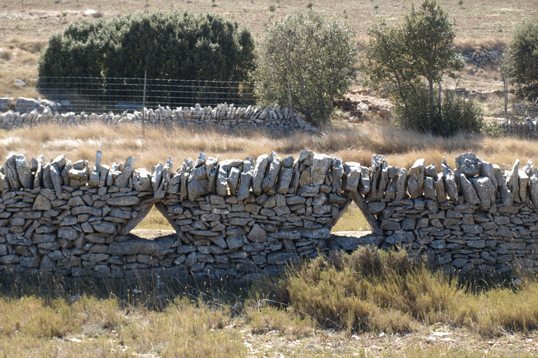
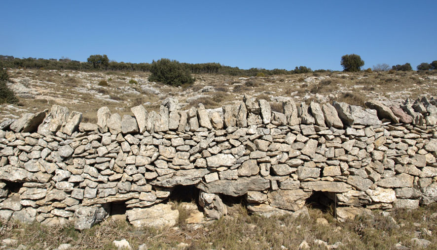
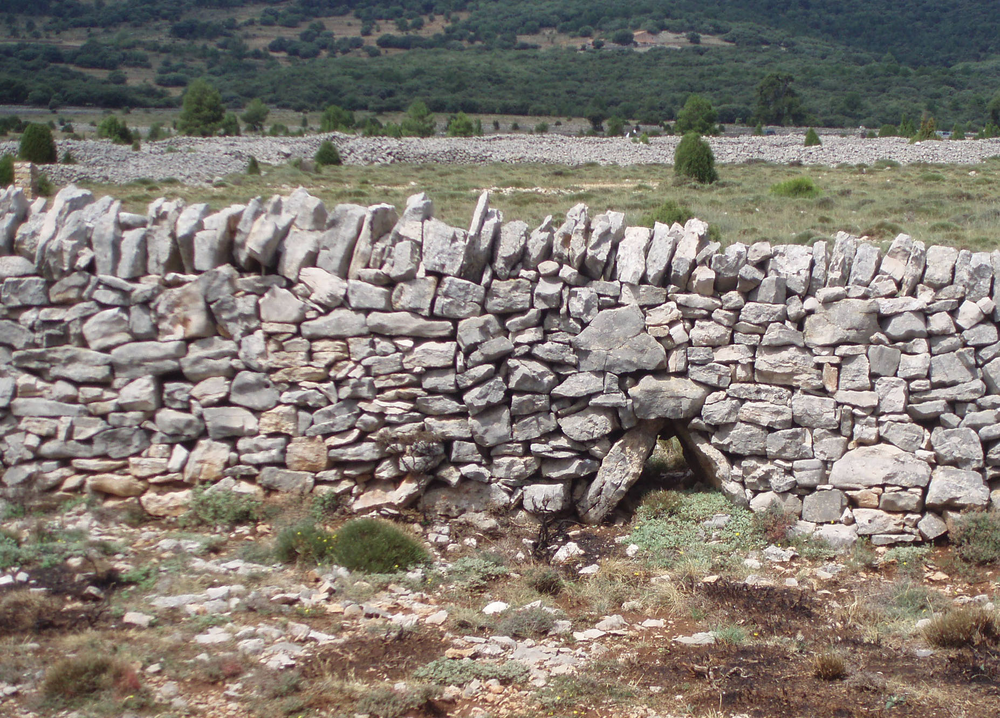
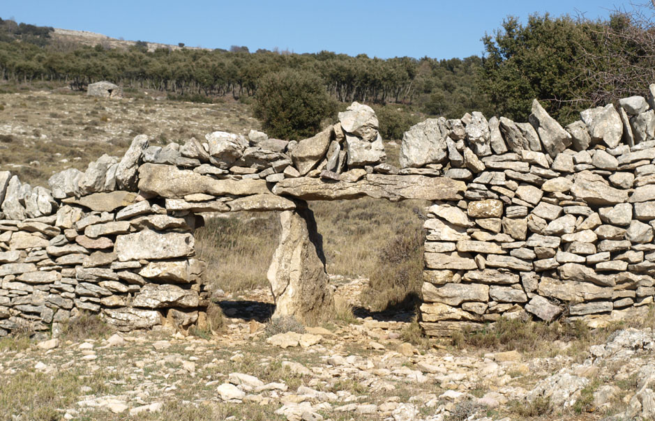
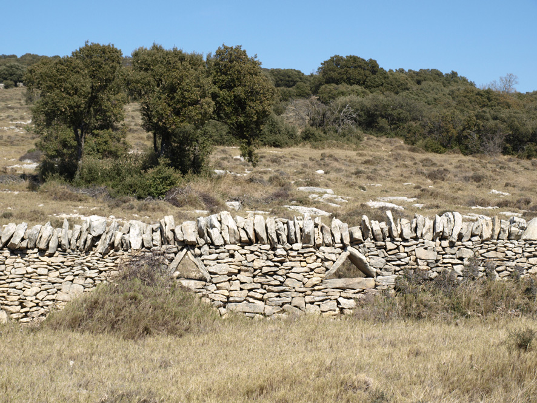
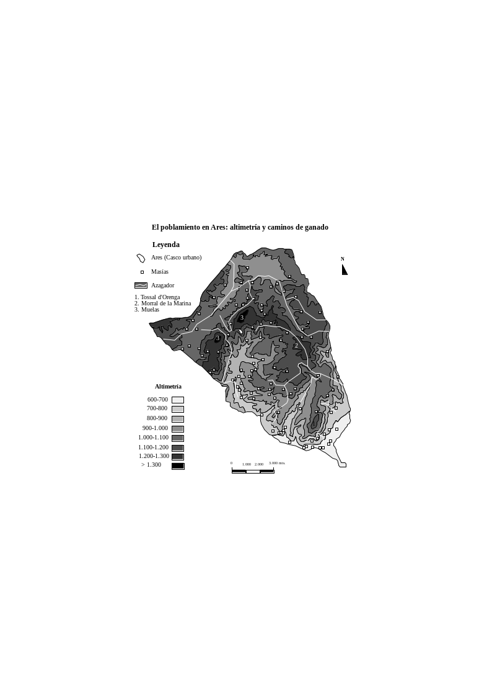
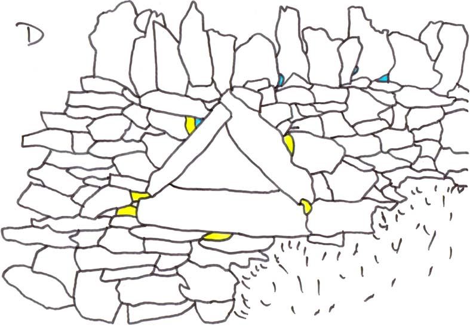
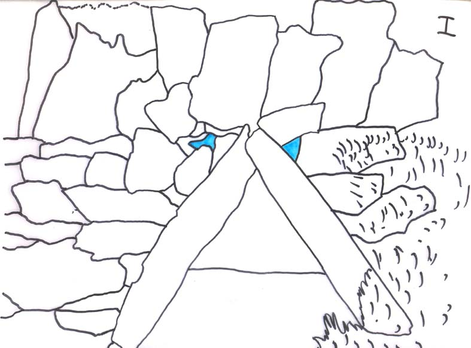

**Los *bufadors* de Ares: un elemento estratégico para combatir el viento en las paredes de los azagadores**

**THE *bufadors* OF ARES: A STRATEGIC ELEMENT FIGHTING THE WIND IN THE WALLS OF THE ‘AZAGADORES’**

**Javier Soriano Martí**

Universitat Jaume I / IES Francisco Ribalta

> **RESUMEN**
>
> La trashumancia ha sido durante muchos siglos una actividad económica estratégica y que ha generado un inmenso patrimonio cultural, tanto material como inmaterial. Uno de los elementos constructivos inherente a las migraciones de ganado, especialmente en ámbito mediterráneo, son los muros que acotan los caminos, es decir, los azagadores o cañadas. Esas paredes, que constituyen por sí mismas un valioso elemento arquitectónico, todavía nos deparan algunas sorpresas, como los *bufadors*, una especie de ventanas diseñadas para dejar pasar el viento y garantizar la durabilidad de los muros de piedra en seco.
>
> **Palabras clave:** patrimonio cultural, paredes de piedra en seco, *bufadors*, trashumancia.
>
> **ABSTRACT**
>
> Transhumance has been for many centuries a strategic economic activity and has generated an immense cultural heritage, both tangible and intangible. One of the constructive elements inherent in the migration of cattle, especially in Mediterranean area, are the walls that mark the ways of the animals, such us *azagadores* or *cañadas*. These walls, which themselves constitute a valuable architectural element, produce still some surprises, as *bufadors*, a kind of windows designed to let the wind go through them. These elements guarantee the durability of the drystone walls.
>
> **Key words:** cultural heritage, drystone walls, *bufadors*, transhumance.

# 1. Introducción: un complemento digno de perfeccionistas

La arquitectura de piedra en seco ha generado un vasto patrimonio y unos espectaculares paisajes culturales en muchos lugares del mundo. La provincia de Castellón presenta uno de los mejores ejemplos de todo el ámbito mediterráneo y, probablemente, también del planeta dada la diversidad de elementos, su número y el grado de perfección alcanzado en las construcciones.

Se trata de una arquitectura popular o tradicional, erigida por personas que se basaban en su experiencia y en los conocimientos adquiridos mediante la tradición oral para construir barracas, corrales, fuentes, balsas, descansaderos para el ganado, majadas, corrales-cueva, pozos, norias de elevación de agua o *sénies*, miles de kilómetros de paredes que delimitan caminos o parcelas, muros que sujetan monumentales bancales, etc. Todo este legado es obra de arquitectos sin titulación y, por lo tanto, mayoritariamente anónimo.

Aunque está documentada la existencia de maestros de obra –precedente del arquitecto o el aparejador– en el diseño y construcción de algunos edificios de significada importancia, especialmente masías, corrales, molinos o puentes, las construcciones de la arquitectura popular son obra de pastores, agricultores o masoveros que, sencillamente, apuestan por utilizar su ingenio en realidad la inteligencia adulta[^1] y la táctica del acierto-error-acierto para satisfacer necesidades básicas: dotarse de refugio en caso de lluvia, garantizar el suministro de agua o defender los cultivos de la ganadería que, en muchas zonas, era una actividad estratégica desde el punto de vista económico por sus potenciales beneficios: venta de carne y leche, elaboración de productos derivados (queso, cuajada, etc.), producción de lana y piel, obtención de estiércol, etc.

Las paredes de piedra en seco, en este sentido, han desempeñado un papel vital en la ordenación del territorio desde el siglo XIII, cuando la conquista cristiana introdujo una nueva gestión de los usos del suelo y otorgó ciertos privilegios a la práctica pecuaria. Esas paredes, que en ocasiones también eran construidas por auténticos especialistas como los paredadores, fijan las lindes de la propiedad y marcan los límites de los azagadores o caminos de ganado, es decir, contribuyen a guiar a los rebaños en sus largos itinerarios entre zonas de agostada e invernada (trashumancia), en los caminos más cortos hacia pastos estacionales (trasterminancia), así como en los trayectos recurrentes, de uso diario, protagonizados por los pastores de las masías o directamente por los masoveros.

Este elemento delimitador, quizás uno de los más sencillos en el complejo y heterogéneo mundo de la piedra en seco, nos brinda soluciones ingeniosas que hasta ahora no han sido objeto de demasiados estudios específicos. Existen desagües, contadores de ovejas, pasos para liebres y conejos, puertas y, además, unos elementos de extraordinario interés que la tradición popular ha bautizado como *bufadors* la traducción literal sería sopladores, pero quizás es más adecuado hablar de ventanas para canalizar el viento y que, a priori, no son demasiado frecuentes en nuestro territorio a tenor de la escasez de estudios sobre su existencia y su ausencia en los inventarios oficiales (Figura 1).

Este trabajo se centra en analizar esos elementos y, en concreto, un lienzo de pared de piedra en seco que se encuentra en el término de Ares (Castellón) y que en poco más de 300 metros tiene una asombrosa concentración de esos imprescindibles complementos: puertas, desagües, contadores de ovejas y, por supuesto, *bufadors*.

La metodología utilizada para realizar la investigación es la habitual en este tipo de proyectos, acometidos por norma general por profesionales de diferentes ámbitos (geografía, historia, antropología, arquitectura, ciencias ambientales, etnografía, etc.). La pared fue inicialmente inventariada en el curso de los trabajos encargados por la Conselleria de Cultura para conocer el patrimonio rural en el entorno del Parc Cultural de la Valltorta-Gasulla, un proyecto jamás concluido por la Administración valenciana. Las tareas de inventario fueron realizadas por un equipo interdisciplinar (geógrafo, antropóloga, arqueólogo) y permitieron descubrir los *bufadors*, aunque solo unos años más tarde se descubrió su verdadera utilidad gracias a un espontáneo intercambio de información intergeneracional[^2].

Figura 1. La pared del azagador es adornada por estas peculiares ventanas, que facilitan la canalización del viento.

La investigación, por tanto, culmina en 2012 mediante la realización de varias entrevistas a pastores y masoveros de la comarca dels Ports, la consulta de variada documentación histórica, nuevos trabajos de inventario del elemento en cuestión y la puesta en común con otros expertos en arquitectura de piedra en seco para localizar elementos similares y confirmar su auténtica razón de ser: minimizar los efectos del viento sobre las paredes que dibujan y perfilan en el paisaje los caminos de ganado. Los informantes principales, en concreto, fueron Rosario Tena y Andrés Cubero, a quienes debe agradecerse su celo e interés por nuestro patrimonio cultural. Sin su sabiduría este modesto trabajo nunca hubiera visto la luz.

## 2. El origen de la arquitectura trashumante

La trashumancia en nuestras comarcas es un hecho antiquísimo porque las primeras normas para regular el trasiego ganadero datan de las tres primeras décadas del siglo XIV, cuando las migraciones de ganado debieron intensificarse notablemente a juzgar por el gran número de acuerdos de pastos que se concretan entre las villas de Aragón y el norte del País Valenciano (Obiol, 1989, 235). Pero los desplazamientos largos conviven en tierras intermedias (600 a 1.200 metros de altitud) con la denominada trasterminancia, es decir, en comarcas como l’Alt Maestrat o Els Ports había una cabaña ganadera estante que alternaba pastos de zona de cultivo en invierno con los pastos de montaña en verano, por lo que sus trayectos nunca eran superiores a los 20 o 40 kilómetros.

Esas prácticas trasterminantes se veían favorecidas y aumentadas en nuestras comarcas por la larga línea fronteriza de pastos con Teruel, ya que la competencia entre ganaderos vecinos inducía a buscar áreas pascícolas alternativas. Así se explica el elevado número de vías pecuarias cortas e intermunicipales existente en Castellón (Obiol, 1989, 243). Precisamente en uno de esos trayectos se localizan los *bufadors* de Ares, cuyo origen cronológico no se ha podido precisar con exactitud.

La construcción de dotaciones pecuarias, como los corrales, sí está perfectamente datada porque el mismo Jaume I, inmediatamente después de la conquista, comienza a adjudicar licencias con ese objetivo:

> “Quod possitis construere et edificare domos et corralia seu statica ad vestrum bestiare recolligendum in heremo illo quod est in extremo termini de Peniscola inter cannare de Uyldecon et Vinaraloz et quinque jovatas terre in ipso heremo” (Huici y Cabanes, 1978: 87).

La legislación de ámbito comarcal, como *els llibres d’establiments*, también contempla con asombrosa prontitud algunas medidas para preservar las infraestructuras pecuarias de agresiones. Morella y sus aldeas, de hecho, aprueban normas concretas para evitar invasiones en los azagadores en la rúbrica titulada *De no estrenyer camins* (Sánchez, 1958: 91):

> “Item stablirem e ordenarem que nenguna persona no sie tan ossada que gos pendre ni strenyer camins ni carreres publiques ni pendre antuxans que sien del comu ni abcegar camins ni abcegar aigües, fons o abeuradors que sien comuns o sien en antuxans comuns o que’l comu hi age a empriu”.

El amojonamiento de bovalares y dehesas también es una constante en diferentes demarcaciones territoriales con la finalidad de garantizar a los rebaños lugares donde obtener alimentación y evitar conflictos con las cabañas locales (Soriano, 2002a: 161 y Soriano, 2002b: 100). Los ejemplos más tempranos los encontramos en las propias cartas pueblas de muchas localidades, donde se concede como privilegio a los nuevos habitantes en cada municipio la posibilidad de crear dehesas y dehesas boyales —los bovalares, boalares o boverales—, aunque con posterioridad otorgan ese derecho otras instituciones, como por ejemplo la orden de Montesa, cuyo maestre fija los límites y mojones del bovalar de Vilafamés en 1423 según consta en el *llibre d’establiments* de esa villa (Rabassa y Díaz, 1995: 252).

En todo caso, aunque la trashumancia adquiere máxima relevancia en tierras mediterráneas tras la conquista cristiana, buena parte de las manifestaciones del patrimonio pecuario que actualmente podemos contemplar debieron ser erigidas en fechas más recientes. El boom demográfico del siglo XVIII significa el despegue cualitativo y cuantitativo del proceso constructor de infraestructuras, tanto de tipo lineal —ampliación de la red preexistente de cañadas y azagadores— como puntuales en el territorio —construcción de corrales, corralizas y otros edificios complementarios—, proceso que nos ha legado la ingente cantidad de elementos ganaderos que podemos apreciar en la actualidad[^3].

Figura 2. El poblamiento disperso y su relación con la topografía en Ares (Castellón). Fuente: Mapa Topográfico Nacional. Elaboración propia.

Es entre 1700 y 1900 cuando también se produce el mayor porcentaje de rompimientos de tierras —aumenta la demanda de alimentos y no existen mecanismos técnicos para ampliar la cosecha—, cuando se incrementan los conflictos entre pastores y agricultores —aumenta el número de cabezas de ganado— y, por supuesto, cuando se modela el paisaje de *bocage*, tan propio de áreas donde se practica una economía mixta basada en la agricultura y la ganadería.

# 3. La ganadería, una fábrica de patrimonio

La trashumancia tiene una enorme capacidad para crear flujos y redes entre ámbitos bastante contrastados porque los viajes de rebaños y pastores han producido a lo largo del tiempo múltiples relaciones —sociales, económicas, afectivas, etc.— que llegan a modelar la personalidad de las áreas de veraneo, las de invernada y las zonas de paso. Esa intensa actividad acaba erigiéndose en una auténtica fábrica de patrimonio, es decir, genera una serie de elementos arquitectónicos que constituyen su legado tangible.

Ese patrimonio, que dada su riqueza y diversidad podríamos catalogar como trashumante, tiene un elevado valor, ya que un porcentaje mayoritario de esas manifestaciones arquitectónicas pastoriles fueron levantadas por los propios protagonistas de las migraciones ganaderas. Los testimonios de algunos pastores nos indican que sus antepasados aprovechaban los tiempos libres mientras vigilaban los rebaños para realizar esas construcciones (Martí, 2007: 30), caracterizadas porque son eminentemente funcionales y porque se adaptan a la perfección a las necesidades de sus usuarios. En idéntica línea se destaca que los pastores llegaban a construir casetas, barracas o refugios en aquellas fincas donde iban a guardar ganado (Beltrán, 2000: 85).

Otros informantes, en cambio, apuntan que los guías de los animales nunca hacían paredes ni grandes obras, como mucho reparaban derrumbes en bancales o muros, es decir, lo que popularmente se conoce como *solsides* o *portells*. Para añadir riqueza a este debate, publicaciones datadas hace más de medio siglo destacan que muchas de esas construcciones catalogadas como rústicas pero no exentas de ingenio y habilidad, en definitiva, podían ser obra de los propios agricultores (Violant, 1954: 196).

Figura 3. Los desagües son un elemento de protección de las paredes contra la escorrentía.

Los diversos elementos de la arquitectura trashumante tienen cierta ubicuidad porque los grandes valles que antaño sirvieron para trazar vías de comunicación se convierten desde tiempos remotos en cauce para las migraciones de ganado, en auténticos azagadores o cañadas naturales para facilitar el trasiego entre las tierras altas y las bajas, los pastos de verano y los de invierno. Así ocurre con los principales ríos (Llobregat, Ebro, Millars, Palancia, Júcar, Turia, Vinalopó, Segura, etc.), así como con la infinidad de ramblas y ríos secos (rambla Carbonera, rambla Cervera, etc.) que surcan nuestro territorio. Los puertos para culminar la escalada o el descenso son relativamente escasos, por lo que el tráfico trashumante tiende a concentrarse temporal y territorialmente en puntos concretos: el Ragudo en el trayecto entre Valencia y Teruel, o el coll d’Ares en el itinerario entre Castellón y el Maestrazgo turolense, por citar dos ejemplos.

Uno de los elementos centrales de la trashumancia y la trasterminancia son las cañadas o azagadores[^4], también veredas o cordeles o ligallos, en términos más comunes un camino de ganado. Algunos autores defienden los posibles antecedentes romanos de estas vías (Muncharaz, 1985a: 25), aunque es más probable que la densa red de caminos haya sido trazada paulatinamente a lo largo de la historia, con épocas de mayor intensidad en torno a la Edad Media y los siglos XVIII-XIX.

La extensión, tanto superficial como longitudinal de esos trayectos ganaderos, solo puede entenderse como el resultado de un dilatado proceso de implantación con sucesivas ampliaciones a lo largo de varias generaciones. La tradición oral y la experiencia de los pastores permite descubrir que algunas de las paredes de azagadores eran construidas por los propios masoveros para proteger sus propiedades y, de hecho, era habitual que cada masía levantara medio muro porque el otro, hasta constituir paredes de doble cara, era acabado por la masía vecina. La prioridad era proteger las cosechas y/o los pastos propios de las continuas visitas de los rebaños trashumantes y por esa razón eran los masoveros quienes preferentemente levantaban los muros.

En la provincia de Castellón, por ejemplo, las rutas ganaderas ocupan 24.260 hectáreas a lo largo de 4.800 kilómetros, un destacado 2,12% de la superficie (Muncharaz, 1985b)[^5]. En comparación, en España la extensión ocupada por las vías pecuarias apenas representa un 1% del total, con 125.000 kilómetros de longitud.

Estas vías trashumantes reciben diferentes apelativos en función de su anchura, tipo de delimitación y otras variables, generando una clasificación según su orden de importancia. La toponimia local aporta tipos adicionales, como ocurre en Vilafranca, donde los caminos de ganado de corto recorrido ligados a actividades tradicionales como la dula —rebaño formado por los animales que cada vecino tenía en casa y que eran conducidos por un pastor contratado a tal efecto— o el pastoreo en el boalar reciben el nombre de *caletjes* o callejuelas. Se trata de azagadores de apenas un metro y medio de anchura que están totalmente acotados por paredes de piedra. Los términos ligallo o *carrerada*, habituales en las comarcas de Teruel y Castellón, añaden riqueza léxica a ese otro patrimonio trashumante que podemos calificar como intangible o inmaterial, la toponimia.

Los muretes de estos caminos, que son levantados por la estudiada acumulación y superposición de piedras sin utilizar argamasa[^6], constituyen un elemento esencial en el paisaje de *bocage* o campos cerrados, ya que impiden el acceso del ganado a tierras de cultivo y áreas de bosque comunal o particular. Las paredes presentan como virtudes especiales su resistencia, la austeridad, una plena integración paisajística y la funcionalidad.

Esos elementos lineales también son útiles para aislar áreas de descanso para los rebaños en puntos determinados de los azagadores. Es el caso de las redondas o cerradas que, en realidad, son improvisadas corralizas —corrales al ras o a cielo abierto— habitualmente circulares, donde tener controlados a los animales. Estos descansaderos suelen asociarse a fuentes, abrevaderos, balsas y lavaderos donde los pastores hacen un alto en el camino con sus animales.

La compartimentación de las áreas de pasto es otra de las funciones de los muros delimitadores. Las planas cumbres de las muelas castellonenses o de los páramos turolenses deparan paisajes absolutamente fragmentados en función del número de rebaños que accedían a esas tierras o el calendario de aprovechamiento de las hierbas y demás alimento (bellotas, ramas, hojas...). Las grandes parcelas están perfectamente acotadas para evitar fugas de animales y permitir cierta tranquilidad a pastores y perros una vez alcanzados los pastaderos.

La utilización de piedra como señalador del territorio genera un tipo patrimonial añadido, los hitos o mojones, que se utilizan para marcar límites de propiedad, principios o finales de rutas ganaderas y como referencia visual para los pastores en sus itinerarios pedestres, especialmente en casos de nevadas[^7]. Estos elementos cobran máxima importancia en los paisajes de *openfield* o campos abiertos, donde las parcelas no están delimitadas visualmente por vallas, muros o construcciones similares[^8].

En otras ocasiones, en cambio, los mojones son simples piedras pintadas de blanco o que apenas sobresalen del terreno, pero también varas o cañas plantadas en los vértices de parcelas, como ocurre en la sierra de Espadán o en muchos tramos del azagador Segarró-Catí.

**4. Las virtudes calladas de las paredes de azagador**

Las paredes de azagadores, según zonas, eran construidas por los propios masoveros tal y como se ha comentado con anterioridad o bien se recurría a auténticos expertos en la materia:

“Hasta hace unas décadas todos los vecinos sabían trabajar la piedra en seco y estaban familiarizados con su uso, ya que el conocimiento de esta técnica era fundamental para el mantenimiento y construcción de cualquier elemento del paisaje. Pero de los trabajos más importantes, como construir un ribazo, una pared de azagador o una barraca, se encargaban los paredadores, que eran personas de la misma comunidad local que tenían una especial habilidad para trabajar con la piedra. Su formación la recibían en el seno de la familia y aprendían el oficio desde pequeños ayudando a sus padres” (Besó, 2001: 13).

En una época en la que no existían ni arquitectos ni ingenieros se adoptan soluciones absolutamente imaginativas para garantizar la durabilidad de estos muros y, por ejemplo, evitar derrumbes en el seno de vaguadas, donde podía canalizarse con cierta virulencia el agua de escorrentía. Era habitual, por tanto, diseñar desagües para permitir su evacuación por la base de la pared, unas sencillas dotaciones que demuestran un tremendo carácter previsor o la necesidad de recurrir a medidas excepcionales tras sucesivas destrucciones por avenidas o riadas.

Pero las virtudes de la técnica constructiva que prescinde de la argamasa no siempre eran suficientes para superar los impactos de la naturaleza:

> “el muro de piedra en seco tiene la gran ventaja sobre otras construciones de ser elástico y permeable. Las acumulaciones de agua suelen ser los grandes enemigos de estas construcciones, pero la piedra en seco permite un drenaje fácil del exceso de agua y absorbe las pequeñas sobrepresiones debido a su elasticidad” (Miralles et al, 2002: 46).

Esas relativas porosidad y flexibilidad, de hecho, no son válidas por completo para combatir los efectos del viento. Algunas voces experimentadas confirman que muchas paredes están combadas por la acción de Eolo y, como muestra, el muro objeto de estudio en este trabajo presenta sospechosas ondulaciones, que en ningún caso llegan a los 20 ó 30 centímetros desde su eje, pero que sí son evidentes a simple a vista. Con toda seguridad, esos orificios para canalizar el viento, conocidos como *bufadors*, se diseñaron para minimizar los impactos del viento y ahorrar el tiempo invertido en las continuas reparaciones de la pared.

Figura 4. Este desagüe tiene una similitud evidente en su concepción con los *bufadors.* Quizás el diseño corresponde a un mismo paredador o se creó un tipo arquitectónico que se repitió por imitación.

La instalación de parques eólicos en las inmediaciones de algunos azagadores y puertos de montaña —han invadido la comarca de Els Ports— son la mejor demostración de la importancia que ese elemento meteorológico tiene en estas tierras y, aunque las paredes de piedra en seco literalmente respiran —la ausencia de argamasa o cemento permite que el viento las traspase en mayor o menor medida—, debía ser frecuente la destrucción de algunos metros lineales de muro como consecuencia de las fuertes rachas, especialmente del temido cierzo o la tramuntana.

El análisis de los *bufadors* de Ares permite además confirmar que, como en tantas manifestaciones de la arquitectura de piedra en seco, la

funcionalidad no está reñida con la belleza. Las aberturas triangulares en la pared, conseguidas mediante la disposición de grandes losas que interrumpen la monótona disposición horizontal de las piedras, muestra una intencionalidad estética evidente. Probablemente, por tanto, estamos hablando de un auténtico arte constructivo.

En cualquier caso, las paredes se construyen con unos parámetros más o menos normalizados en buena parte de las comarcas septentrionales del País Valencià:

“Los cimientos no son demasiado hondos. El ancho en la base suele ser de unos 50 cm y va disminuyendo progresivamente a razón de un 10% por término medio conforme se gana altura hasta llegar más o menos al metro. A partir de ahí el muro es coronado por una especie de alero de piedras o losas dispuestas en rastrillo (de forma vertical o suavemente inclinadas), estructura que da mayor resistencia a la pared para evitar las caídas progresivas producidas por el paso de animales que intentan saltar el muro (...). Las piedras más voluminosas se colocaban en las caras externas y si sobresalía alguna punta se rompía con el martillo. La superficie interior se rellenaba con piedras de menor tamaño y con cascajo” (Besó, 2001: 13).

Figura 5. El contador doble da acceso, desde el mismo azagador, a una parcela donde abundan los pastos y los pastores disponían de una barraca.

El muro analizado en Ares, no obstante, no obedece estrictamente a esas pautas porque no se trata de una pared doble con una sección interior, sino simple y que, más o menos, mantiene la misma anchura en la base que en su coronación. Además, como se observará en los croquis (Figuras 8 y 9), los constructores utilizan ocasionalmente pesadas losas de grandes dimensiones por encima del metro de altura para consolidar la fábrica.

Los contadores de ovejas, por otra parte, también son una muestra magnífica del binomio utilidad-sencillez y de las virtudes calladas de las paredes, ya que esas puertas para el ganado son fáciles de diseñar y permiten censar las cabezas de cada rebaño en determinados momentos de la jornada. Como algunos autores han manifestado, el valor antropológico e histórico de esas aberturas resulta excepcional y constituye una muestra más de la inteligencia adulta:

> “Gateras, pasos o contadores... Son aberturas de unos 60 cm de alto y un ancho suficiente para pasar una oveja (unos 50 cm), resueltas con una piedra que hace de umbral y que, normalmente, permite rematar la pared por encima. La gatera es de dimensiones más reducidas (unos 20x20 cm) y tenía como finalidad acostumbrar a liebres y conejos a cruzar la pared por esos puntos al no poder saltar. Así, en ciertos momentos, podían ponerse cepos o trampas para cazarlas” (Miralles et al, 2002: 133).

Uno de esos pasos para animales, por cierto, presenta una enorme similitud constructiva con el formato empleado en los *bufadors* del término de Ares. El muro en cuestión está en el Pla del Mosorro, en Vilafranca. La utilización de losas colocadas en vertical o ligeramente inclinadas para formar un triángulo, con el suelo como base, demuestra la creatividad y el ingenio de los paredadores para configurar esos singulares huecos. La particularidad estriba aquí en que esas gateras son mayoritariamente de sección cuadrada o rectangular en otros municipios.

La disposición triangular permite aprovechar las losas más regulares y grandes, así como aportar un toque estético a los desagües o pasos para la fauna de especial interés gastronómico. En definitiva, los constructores lograron un binomio perfecto: máxima utilidad (paso de agua y punto de caza) junto a una extrema sencillez (Figura 4).

Un carácter especial adquieren los denominados contadores dobles, es decir, unas aberturas en las paredes que diseñan dos vanos separados por una especie de parteluz para facilitar el recuento de rebaños más numerosos o el acceso más ágil a áreas de pasto con determinadas características (limitación temporal de aprovechamiento, uso compartido, etc.). La apuesta generalizada para resolver estos ingeniosos accesos suele ser un pilar central que, en realidad, es una losa de considerables dimensiones para separar las dos aberturas, como ocurre en el caso de Ares (Figura 5). La utilización de cuñas para garantizar la horizontalidad de los dinteles, formados igualmente por grandes losas, parece un recurso técnico recurrente.

**5. Cómo combatir los embates del viento: los *bufadors* de Ares**

La pared de Ares resulta un tanto especial por la elevada concentración de elementos complementarios que presenta, ya que en menos de 300 metros encontramos un contador doble (extremo E), una serie de cuatro desagües correlativos (Figura 3), una puerta tradicional de madera —desaparecida hace más de 15 años— que tiene asociada una barraca con paravientos incluido[^9] y que realmente parece un punto de control de acceso a una parcela de pastos, los *bufadors* y, por último, otro contador, en este caso simple, en el extremo oeste.

El azagador se sitúa en una de las vías de acceso a las muelas calcáreas, unas tierras altas situadas entre los 900 y los 1.300 metros de altitud, en las que se ha mantenido secularmente un sistema de explotación mixto basado en la agricultura, los aprovechamientos forestales y, sobre todo, las prácticas ganaderas. Los *bufadors*, en concreto, se sitúan a 1.039 metros de altitud y en un sector, justo antes de iniciarse una empinada rampa, donde el viento de componente norte se canaliza de forma natural, ya que el relieve configura una especie de alargada cubeta topográfica.

El área analizada reviste máxima importancia pecuaria porque es una auténtica encrucijada donde se combinan los itinerarios trashumantes —ruta hacia el Coll d’Ares desde la rambla Carbonera para acceder a las altas tierras turolenses desde el litoral[^10]— con los de carácter trasterminante, con una duración y recorrido inferiores, que presentan un denso entramado íntimamente ligado al sistema de poblamiento de estas tierras para aprovechar los pastos de agostada (Soriano, 2007: 141).

El azagador donde se localizan los *bufadors* es un ramal secundario que conecta precisamente la rambla Carbonera con el acceso a la Canà a través del antiguo camino de Morella a Valencia (*camí Vell*), que sigue el trazado del barranco d’En Priu y de la Belluga (Figura 7). Esta ruta, por tanto, debía acoger fuertes flujos ganaderos en momentos puntuales, ya que su anchura es de 30 metros y, por lo tanto, tenía una elevada capacidad para facilitar el trasiego de rebaños con muchas cabezas. Los *bufadors* se ubican en los últimos metros antes de llegar al mas de les Llomes, que debió jugar un importante papel en la trashumancia por su estratégico emplazamiento, como el vecino mas de la Belluga: punto de intercambio comercial y descanso, lugar de cobro de impuestos pecuarios, etc.

Hay que tener en cuenta que Ares, que con sus 118,7 Km2 es el octavo municipio de la provincia por tamaño, canaliza en la mitad septentrional (a partir del coll d’Ares) el movimiento trashumante, mientras que las muelas del sector meridional (Morral de la Marina y Tossal d’Orenga) tienen una vocación trasterminante porque se convierten en áreas de agostada para rebaños de comarcas próximas o municipios vecinos.

Como aseguran muchos pastores, las paredes no solo acotaban los caminos de ganado, también servían para separar los pastos de invierno de los pastos de verano, o las zonas de umbría de las solanas (éstas con peor calidad pascícola) o, también, aplicar un curioso y efectivo sistema de aprovechamiento por meses o semanas que implicaba pastar en unas parcelas un tiempo para posteriormente pasar a otras y dejar crecer la hierba en sectores ya aprovechados. Es decir, en ocasiones se imponía una especie de barbecho de pastos para gestionar los recursos de forma óptima.

Vetar el acceso de los animales a determinadas zonas o delimitar sus itinerarios fue la prioridad de los pobladores de unas tierras donde han convivido la trashumancia y la trasterminancia con una actividad agrícola centrada en los cereales —sin olvidar eventuales plantaciones de productos tan exóticos como el tabaco—, aunque también dedicada a producir hortalizas para autoconsumo en aquellos lugares donde se disponía de agua. La convivencia entre agricultores y pastores no siempre era fácil, como lo demuestran los miles de kilómetros de muros que defienden las parcelas de cultivo.

Los propios pastores recuerdan que debían vigilar estrechamente sus rebaños, sobre todo en caso lluvia, ya que con la tierra húmeda era preceptivo no pisarla para evitar su apelmazamiento, dado que eso provocaba serios problemas al arado para penetrar en el suelo (“*el parell no movia*”) y realizar su valiosa función de airear y remover la capa superficial de tierra.

Figura 6. Los orificios triangulares introducen matices estéticos en un muro dominado por las líneas horizontales y la coronación vertical.

Las curiosas y estéticas ventanas que facilitan el paso del viento no son exclusivas de Ares, ya que la tradición oral recuerda otros casos similares en Forcall, Morella, Vilafranca... Debía ser una solución relativamente recurrente porque, como resaltan los informadores, “vivimos en comarcas muy ventiladas” y el viento es un enemigo, no solo de los pastores que, a menudo se fabrican abrigos sencillos de piedra —muretes en forma de herradura o semicírculo que apenas levantan 50 cm del suelo—, también para las mismas paredes, que ofrecen una resistencia variable a las corrientes dominantes en función de su situación, la regularidad y fuerza de los vientos.

El lienzo de piedra en seco de Ares, además, es simple, es decir, no presenta una doble pared como es habitual en algunas paredes medianeras. En este caso se trata de un muro tremendamente sencillo en su concepción y que aparece ligeramente ondulado en su trazado, probablemente como consecuencia del viento reinante en la zona o quizás por la poca pericia de los constructores, hipótesis ésta que se contradice con la presencia de los *bufadors*.

En su base, la anchura de las losas más grandes alcanza máximos de 70 centímetros y mínimos de 50, mientras que en la coronación oscila entre los 70 y los 40 centímetros en función de las dimensiones de las piedras utilizadas. La escasa cimentación se compensa con la utilización de grandes bloques pétreos, casi ciclópeos, en las hiladas inferiores. Conforme el muro va adquiriendo altura, lógicamente, las piedras tienen menores dimensiones, aunque con algunas notables excepciones porque a menudo se encuentran grandes bloques intercalados para aportar solidez. La técnica, en definitiva, consiste en combinar piedras poliédricas con losas rectangulares.

La pared está orientada de forma perpendicular a los vientos más fuertes en la zona, los que tienen componente norte, cuyas rachas pueden llegar a tumbar los muros más expuestos según la experiencia transmitida de generación en generación por los paredadores. De hecho, es probable que el constructor tuviera negativas experiencias previas antes de encontrar esa sabia solución para minimizar la resistencia al viento, es decir, quizás la pared fue tumbada en más de una ocasión con anterioridad a adquirir su actual fisionomía.

Figura 7. La red de azagadores es bastante densa en Ares debido a la contrastada topografía del municipio y la relativa riqueza de pastos de verano en sus muelas. Fuente: Mapa Topográfico Nacional. Elaboración propia.

Las fuentes consultadas confirman que “todos los *bufadors* suelen situarse más o menos perpendiculares a los vientos del norte”. Esos orificios son una inmejorable forma de aliviar de tensiones a la pared y, por supuesto, también sirven para luchar contra las ventiscas, que podían llegar a tumbar muros por la presión de la nieve empujada y acumulada por el viento. Por esa razón esos elementos “deben estar de media pared hacia arriba” y no en su base, agregan los informantes.

Y, en efecto, el muro tiene una altura que oscila entre 1,30 y 1,40 metros y la base de los triángulos que dejan pasar el viento se sitúa, del suelo, a 56 cm (*bufador* izquierdo) y 60 cm (*bufador* derecho). Las ventanas están separadas una de otra por 1,40 metros y tienen una altura de 35 cm (izquierda) y 30 cm (derecha), por lo que su disposición, ubicación en altura y dimensiones permiten descartar otras hipótesis sobre su utilidad (paso de fauna, desagüe, apostadero de caza, etc.).

Figura 8. El *bufador* derecho se asienta utilizando múltiples cuñas (piedras coloreadas en amarillo) y la pared presenta otras pequeñas aberturas (tonos azules) para ventilarse.

La coronación de la pared es la tradicional *en rastell gitat*, es decir, con losas dispuestas en vertical sobre la última fila horizontal y ligeramente inclinadas. La particularidad reside en que el vértice superior de los *bufadors* sirve de apoyo para esa estructura aérea (losas verticales), sin ningún remate inferior o base. La técnica de la piedra en seco ofrece una lección en este punto, ya que sin ningún elemento cimentador es el propio peso de las losas el que aporta solidez y firmeza a la estructura. El constructor tuvo la habilidad de encastar las piedras, que no siempre tienen un perfil regular, como un delicado puzzle.

La presencia de esa culminación de losas inclinadas nos depara otras enseñanzas, ya que esa disposición es, por sí misma, otro mecanismo de lucha contra el viento —las rachas se canalizan entre las piedras verticalmente colocadas en lugar de verse frenadas— y, además, suele indicar los límites de propiedad, así como evitar que ovejas y cabras tengan la tentación de trepar para saltar a las parcelas aledañas.

Las seis losas que forman las ventanas —tres por *bufador*— tienen unas dimensiones respetables, ya que son más o menos rectangulares y presentan un lado largo de unos 50 centímetros por uno corto de unos 30 cm —su medición exacta es prácticamente imposible por su disposición y por las intrínsecas irregularidades que la piedra presenta—, mientras que su grosor alcanza los 10 centímetros en algunos puntos y nunca baja de los ocho. Las piedras que forman la base, por su parte, son prácticamente cuadradas: 50x45 cm la izquierda y 60x60 cm la derecha.

En cuanto a los detalles constructivos, la pormenorizada contemplación de la pared —un análisis microlítico, podría decirse— nos permite descubrir una colocación meticulosa y estudiada de cada piedra, así como la utilización constante de cuñas, es decir, pequeños fragmentos de losas que son introducidos cuidadosamente en las hendiduras resultantes de la superposición de las piedras para otorgar una soberbia firmeza a la pared. El constructor consigue diseñar, en grandes extensiones lineales del muro, un rompecabezas milimétricamente encajado de piedras de muchas formas diferentes. De hecho, resulta prácticamente imposible retirar algún elemento porque todo está perfectamente unido, a pesar de la falta de unión inherente a la técnica de la piedra en seco. Como es obvio, el rozamiento de la caliza brinda a los constructores una calidad excelente para hacer posible esa solidez[^11].

Figura 9. Las losas del *bufador* izquierdo encajan a la perfección, pero en sus proximidades aparecen otros orificios (tonos azules) que podrían ser imperfecciones de la fábrica.

La localización de estas ventanas es relativamente previsible en determinados lugares una vez descubierta su utilidad, ya que aparecen en *clotades* o vaguadas, donde el viento se canaliza con fuerza y, por tanto, donde más fuerte es la presión sobre los muros cuya altura oscila entre 1,50 m y los dos metros. Los expertos en el análisis de la arquitectura de piedra en seco de Vilafranca, por ejemplo, afirman que algunos lienzos de pared llegan a apoyarse en una especie de nervios o contrafuertes que, dispuestos cada determinado número de metros, aportan consistencia y seguridad adicionales a estos muros.

Los constructores, con toda seguridad, fueron los propios masoveros de la zona, quizás algunos de ellos pastores como primera ocupación, ya que era necesario adaptarse a las duras condiciones ambientales y las largas jornadas laborales[^12]. Una frase pronunciada por uno de los informantes, de hecho, resume a la perfección la esencia de esta arquitectura anónima: “De letra no sabían, pero el ingenio tenía que funcionar porque si no se aclimataban a unas condiciones a menudo hostiles no podían vivir”. También resulta sintomática una frase hecha bastante difundida en *valencià* y que justifica el ingenio y la creatividad de los paredadores: “La necessitat fa fer” (la necesidad hace hacer).

La datación de estos peculiares elementos resulta harto compleja, un problema compartido en buena medida con el resto del patrimonio de la arquitectura de piedra en seco, aunque todo apunta a que son obra de varias generaciones y, con toda seguridad, tienen más de un siglo de antigüedad porque los informantes aseguran que sus padres y abuelos recordaban la existencia de los *bufadors*. Quizás fueron construidos con posterioridad a erigirse el muro —tras un derrumbe, por ejemplo— o, por el contrario, ambos elementos se concibieron al unísono. En cualquier caso, parece probable que su origen sea posterior al siglo XVIII, pero sin descartar fechas más remotas, ya que la ganadería está regulada desde la Edad Media en estas tierras.

**6. Conclusiones: aprovechar las últimas oportunidades**

Los *bufadors* son una muestra perfecta de la versatilidad de la arquitectura de piedra en seco, una cualidad de esta técnica constructiva que le ha permitido desde tiempo inmemorial modelar paisajes, flexibilizar tipos arquitectónicos y dotar a la población de la montaña mediterránea de toda una serie de edificios, infraestructuras y complementos absolutamente funcionales para mitigar las duras condiciones de vida que antaño se sufrían en esos lugares. Los estéticos orificios triangulares que han motivado este trabajo, en definitiva, se unen a toda una serie de elementos asociados a un patrimonio cultural que está en vías de extinción y que no alcanza el renombre de edificios como las barracas o las masías, pero cuya mera existencia nos ayuda a entender un modo de gestión del territorio que consiguió encontrar soluciones ingeniosas para resolver problemas repetitivos, como la destrucción de los muros de azagadores a causa del viento.

El reciente descubrimiento de su función continúa siendo una sorpresa y nos alecciona para continuar investigando e inventariando (I+I) el patrimonio cultural que nos ha sido legado, ya que dentro de pocos años, probablemente, será imposible realizar nuevos descubrimientos de esta importancia y documentarlos. El análisis de los *bufadors* nos otorga una lección de sacrificio —la de los abnegados masoveros, pastores y paredadores— y nos invita a continuar invirtiendo tiempo en la catalogación de las construcciones modestas. Desaprovechar esa oportunidad sería sinónimo de pobreza cultural y de ceguera intelectual porque todavía tenemos mucho que aprender de nuestros antepasados, cuyo modo de vida se adaptó a unas condiciones poco idóneas para conseguir el ansiado bienestar.

# Bibliografía

BELTRÁN TENA, Miguel Ángel (2000): “Arquitectura en piedra seca en el Maestrazgo”, en *Temas de antropología aragonesa*, 10, pp. 77-92.

BESÓ ROS, Adrià (2001): “Pedra sobre pedra. L’emprempta humana en la configuració d’un paisatge rural”, en Francesc Jarque: *L’home i la pedra*, Universitat de València, València, pp. 9-34.

– (2004): “Sota el sostre de la pedra. Les construccions de pedra seca com a habitatges temporals”, en VV.AA., *L’habitatge temporal: L’home i la pedra 2. Fotografies de F. Jarque (catàleg de l’exposició)*, pp. 21-26. Universitat de València, València.

CEBRIÁN GIMENO, Rafael (2011): *La arquitectura de la piedra seca. 14 itinerarios. Caminos y paisajes.* Carena Editors, València, 198 pp.

Farnós, Àlex (coord.) (1993): *Cuadernos de la trashumancia – Nº 14. Gúdar-Maestrazgo*. Icona, Madrid, 97 pp.

GARCÍA LISÓN, Miguel; ZARAGOZÁ CATALÁN, Arturo (2000): *Arquitectura rural primitiva en secà*. Generalitat Valenciana, Castelló, 63 pp.

HUICI MIRANDA, Ambrosio y M.ª Desamparados CABANES PECOURT (1976-1978 y 1982): *Documentos de Jaime I de Aragón*. Anubar Ediciones, València.

LLOP I BAYO, Francesc (2003): “La piedra en seco: la construcción de los paisajes tradicionales”, en *Recuperem patrimoni. Revista de difusión de la recuperación del patrimonio artístico valenciano*, Generalitat Valenciana, conselleria de Cultura, Valencia, pp. 26-33.

MARTÍ TOMÁS, Miguel Ángel (2007): *La pedra en sec a Benafigos.* Diputació de Castelló, Castelló.

MESEGUER FOLCH, Vicente; ZARAGOZÁ CATALÁN, Arturo (2004): *Arquitecturas de piedra en seco. Actas del VII Congreso Internacional de Arquitecturas de Piedra en Seco.* Centro de Estudios del Maestrazgo, 2004, Sant Carles de la Ràpita.

MESEGUER FOLCH, Vicente (2000): “La piedra en seco en las comarcas del Norte de Castellón”, en *Boletín del Centro de Estudios del Maestrazgo*, nº 63, pp. 7-36.

– (2006): *Arquitectura popular de pedra seca al terme de Vinaròs.* Centre d’Estudis del Maestrat, Sant Carles de la Ràpita.

MIRALLES, Francisco; MONFORT, Julio; MARÍN, Margarita (2002): *Els homes i les pedres. La pedra seca a Vilafranca: un paisatge humanitzat.* Diputació de Castelló, Castelló, 181 pp.

MUNCHARAZ POU, Manuel (1985a): “Azagadores y sistemas de pastoreo”, *Boletín del Centro de Estudios de La Plana*, 4, 25-41.

(1985b): “Los caminos ganaderos del Maestrazgo. Significado actual de las vías pecuarias”, en *Boletín del Centro de Estudios del Maestrazgo*, 9, 39-56.

OBIOL MENERO, Emilio M. (1989): *La ganadería en el Norte del País Valenciano.* Premio Ciudad de Castellón de Ciencias y Técnica 1988. Publicaciones del Excelentísimo Ayuntamiento de Castellón de la Plana, Castelló. 282 pp.

RABASSA I VAQUER, Carles y Carmen DÍAZ DE RÁBAGO (1995): *Documents per a la Història de Vilafamés.* Generalitat Valenciana, Universitat Jaume I, Ajuntament de Vilafamés. València, 610 p.

SÁNCHEZ ADELL, José (1954): “Establiments de Morella y sus aldeas, de 1370”, en Boletín de la Sociedad Castellonense de Cultura, XXX, 249-260.

– (1955): “Establiments de Morella y sus aldeas, de 1370”, en Boletín de la Sociedad Castellonense de Cultura, XXXI, 144-148.

– (1958): “Establiments de Morella y sus aldeas, de 1370”, en Boletín de la Sociedad Castellonense de Cultura, XXXIV, 88-100.

SIMÓ CASTILLO, Juan Bautista (1993): “La construcció de bancals i la intel·ligència adulta”, en *Boletín del Centro de Estudios del Maestrazgo*, 43-44, pp. 5-44.

– (2004): *L’aprenentatge al llarg de la vida. Apunts per a la reflexió i l’acció.* Antinea, Vinaròs, 221 p.

SORIANO, J.; LLORÍA, R.; SELMA, S. (1999): “El sistema de poblament de la Vall de Catí. Una aproximació geohistòrica”, en *Boletín del Centro de Estudios del Maestrazgo*, nº 61, pp. 13-32.

SORIANO MARTÍ, Javier (2002a): *Aprovechamientos históricos y situación actual del bosque en Castelló.* Comité Econòmic i Social de la Comunitat Valenciana, Bancaixa, Fundació Caixa Castelló, València, 838 p.

– (2002b): “Los espacios comunales de aprovechamiento mixto pecuario-forestal en la provincia de Castelló: los boalares o bovalares”, en PIQUERAS ARENAS, José A. (coord.), *Bienes comunales: propiedad, arraigo y apropiación*, Ministerio de Agricultura, Madrid, pp. 95-129.

– (2005): “El patrimonio rural iletrado. Nuevos recursos para el desarrollo en áreas de montaña”, en *Millars. Espai i Història*, XXVII. pp. 137-151.

– (2007): “Poblamiento y actividades agrarias tradicionales en la montaña mediterránea: el caso de Ares (Castellón)”, en BERNAT I MARTÍ, Joan Serafí y Francisco José GUERRERO CAROT (ed,): *Las comarcas de interior: una perspectiva demográfica*, Instituto de Cultura del Alto Palancia, Segorbe, p. 139-151.

– (2010): “Las cuevas como hábitat trashumante: un tipo arquitectónico convertido en arquetipo”, en VIDAL, Pablo y José Luis CASTÁN (eds.): *Trashumancia en el Mediterráneo*, Ceddar, Huesca, pp. 229-248.

VIOLANT Y SIMORRA, Ramón (1954): “Las ‘barraques’ de viña, de pared en seco, del Pla de Bages (Barcelona)”, en *Estudios Geográficos*, 15, 55. Consejo Superior de Investigaciones Científicas, pp. 189-200.

[^1]: Se trata de la inteligencia específica de las personas adultas, que está basada en la experiencia. Son un “conjunto de capacidades con origen en la práctica habitual y universal de la vida, reflexivas en sus concepciones y automáticas en sus manifestaciones, y dotadas de la particularidad de poder incrementarse con aprendizajes en cualquier edad” (Simó, 2004: 76).

[^2]: En realidad, su utilidad fue desvelada por un alumno de la Universitat per a Majors de la Universitat Jaume I, quien tras ver en una clase la fotografía de las ventanas en la pared recordó su denominación y utilidad. El alumno en cuestión envió esa información a su profesor y mediante esa sencilla forma de transmitir conocimiento empezó este trabajo.

[^3]: La figura 2, con la localización de las masías de Ares, es una buena muestra de la presión demográfica que la población ejerció durante muchos siglos en la montaña mediterránea: el 62% de los vecinos del municipio (2.132 habitantes, su máximo histórico) vivía en masías o núcleos dispersos en 1910, por lo que los paisajes construidos que todavía pueden admirarse en la actualidad debieron mantener hasta mediados del siglo XX toda su vitalidad.

[^4]: Este segundo vocablo conserva todo su sabor pecuario, ya que ir a la zaga significa “ir detrás de”. La palabra, por tanto, hace referencia a la forma de trashumar las ovejas y otros animales, siguiéndose unos a otros hasta formar un rebaño ordenado. De hecho, los azagadores son los caminos expresamente preparados para la circulación del ganado. Son vías que tienen un ancho considerable, a menudo superior a los 25 ó 30 metros, ya que de esa manera se permite que los animales se alimenten mientras avanzan (Miralles et al, 2002: 131).

[^5]: Esas cifras, sin embargo, suponen un conflicto si se comparan con otras estimaciones, que apuntan que solo en Vilafranca hay más de mil kilómetros de muros de piedra en seco (Llop, 2003: 32), aunque no se precisa si bajo el término ‘muros’ se incluyen los ribazos de los bancales y las paredes de azagador indistintamente.

[^6]: Como es sabido, la técnica de construcción tradicional (piedra en seco o *pedra seca* en *valencià*) consiste en utilizar únicamente piedras sin ningún tipo de mortero o aglutinante para su fijado. Las piedras así ensambladas se sostienen por su propio peso, el rozamiento y por las cuñas que, con habilidad, colocan los constructores para provocar un medido juego de presiones que dan solidez a todo el conjunto.

[^7]: En el vecino Maestrazgo turolense estas sencillas construcciones son conocidas literalmente como señalizadores de nieve en el argot pastoril (Beltrán, 2000: 83).

[^8]: Resulta curioso encontrar algunos de estos mojones en áreas de denso paisaje de *bocage* como el Maestrat o Els Ports, donde se reservan para las zonas de pastos en las que la delimitación física de las parcelas no era rentable por su elevado coste, económico o en horas de trabajo. Su presencia también puede explicarse por la innecesaria construcción de muros ya que, a menudo, las propias paredes verticales de las muelas actuaban como elemento limitante y disuasorio para el ganado. En ese caso, los mojones anunciaban al pastor la proximidad del precipicio.

[^9]: No es extraño, por tanto, entender la práctica obligatoriedad de abrir *bufadors* en el muro del azagador, ya que si la propia barraca cuenta con un paravientos de considerable altura (casi dos metros) para proteger la puerta de los fríos vientos del norte, es lógico pensar que rachas de ese mismo viento podrían llegar a tumbar total o parcialmente la pared.

[^10]: Se trata de la ruta conocida como Castellón-Mosqueruela o Castellonense Central (Farnòs, 1993: 55).

[^11]: La aparición de agujeros en algunos puntos de la pared, en cambio, plantea nuevos interrogantes sobre su intencionalidad: ¿son simples defectos de la construcción?, ¿son *bufadors* más pequeños confeccionados a propósito?, ¿son fruto del azar? Una de las publicaciones de referencia en el análisis de la arquitectura de piedra en seco no aporta información de elementos similares a los *bufadors* pero, en cambio, sí explica la presencia de esas aparentes imperfecciones: “Las piedras quedan más sueltas que en otros tipos de pared de piedra en seco; eso provoca que queden unos pequeños agujeros por donde pasa el aire en los vendavales fuertes y, así, se consigue una mayor resistencia contra la fuerza que tumbaría la pared” (García y Zaragozá, 2000: 49).

[^12]: La vida de los pastores vinculados a las masías era bastante rutinaria, ya que en verano salían con los animales “a punta de día”. Habitualmente, los corderos recién nacidos y los más jóvenes permanecían en el corral, pero el resto pastaba en el monte hasta las 11, más o menos. En las horas de máxima insolación, desde el mediodía hasta las cinco, se quedaban bajo techo y, obviamente, el pastor empleaba ese tiempo en diferentes tareas agrícolas, forestales o domésticas, como las reparaciones o las construcciones de piedra en seco. La sesión vespertina se prolongaba entre 17 y 22 horas con las ovejas nuevamente en la montaña. En invierno, en cambio, el horario variaba por completo porque los rebaños se pasaban de 10 a 17 horas fuera de la masía. Era entonces cuando resultaban especialmente necesarios algunos complementos arquitectónicos básicos (barracas, refugios, corralizas, etc.) que, ocasionalmente, podían ser construidos por los propios masoveros/pastores.
