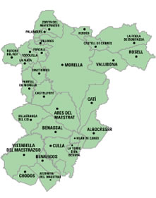

Comarcas dels Ports i Maestrat

BIOLOGIA DE LA TRUFA NEGRA

Reino Fungi.

División: Ascomicota.

Clase: Ascomycetes.

Orden : Pezizales.

Familia: Tuberaceae.

Género: Tuber

Especie: Tuber melanosporum).

La trufa negra o de Perigord o **tartufo nero pregiato** es la mas conocida y preciada de España y de Francia, también es conocida como el diamante negro de la cocina.  

Debemos apreciar y apoyar los productos autóctonos, aquéllos que produce nuestra tierra, y debemos hacerlo poniéndolos en valor y mostrándolos

Su color y su época de recolección es la que su nombre indica, negra y de invierno (noviembre a marzo).   
De forma más o menos redondeada dependiendo de la estructura del suelo donde se cría, su corteza de forma piramidal y su color variando de marrón a negro según el grado de maduración y en el interior negra con finas ramificaciones blanquecinas (gleba). Para esta variedad de trufa es muy importante la lluvia en la época estival, así como las tormentas de verano, que es cuando la trufa se está formando.

.

La trufa es un  hongo subterráneo muy apreciado ya por los egipcios que las cocinaban rebozadas en grasa y cocidas. Los griegos y los romanos les atribuían virtudes afrodisíacas, más que gastronómicas.

En la Edad Media debido a su color negro y a su aspecto amorfo se le atribuía al demonio, y por su existencia en lo profundo de los bosques lo asignaban al mundo de las brujas y hechiceros, asimismo por el hecho de ser un alimento afrodisiaco aumentaba las fantasías sobre este hongo.

Todo ello  hizo que la trufa cayera en el olvido, no apareciendo en los libros de cocina de la época, como ingrediente de ninguna receta.

Volvió a resurgir en el Renacimiento pero no fue hasta principios del siglo XVIII en que empezaron a ser otra vez valoradas y buscadas con la ayuda de cerdos y perros. Las trufas pasaron a ser un producto muy selecto y elegido por los grandes cocineros de la época en sus creaciones culinarias

Actualmente se utiliza como el más excepcional aromatizante para platos de gran exquisitez.

Trufa ciclo biologico:

Los hongos poseen un aparato reproductor y un aparato vegetativo o micelio. El aparato reproductorr contiene las esporas, encargadas de la diseminación del hongo. Al ser la trufa un hongo hipogeo, esta diseminación ha de ser a través de la fauna silvestre: jabalí, zorros, ratones, conejos, etc. La germinación de las esporas dará lugar al micelio y comenzará de nuevo la vida del hongo. Los carpóforos maduran durante el invierno, que es la época de recolección del hongo. El micelio es un conjunto de filamentos muy finos, denominados hifas, que se extienden por el perfil del suelo. Los hongos micorrícicos se asocian a las raíces de las encinas a través de las micorrizas, lugar de intercambio entre hongo y árbol.

Cuando el micelio de la trufa se instala y adueña de un terreno, se aprecian unos síntomas evidentes en la superficie, aparecen los denominados calveros o quemados. En estos calveros se seca la vegetación herbácea y la mayoría de las matas, quedando el suelo prácticamente desnudo. Este hecho se explica por la acción competitiva y herbicida del propio micelio en contra de las plantas no micorrizadas por éste. En primavera se produce la germinación de las esporas, comienzan a formarse las primeras trufas en el micelio, que van creciendo con el paso de los días y se produce la expansión del sistema radical de la planta micorrizada, reinfectación de raíces por el hongo y una gran actividad metabólica de las micorrizas. Las lluvias primaverales y las tormentas veraniegas ayudan a su desarrollo, en verano existe una formación de los primordios fúngicos y un engrosamiento de los mismos. Ya entrado el otoño comienza el proceso de maduración, alcanzando tamaños variables desde el de una nuez al de una patata mediana o tal vez mas grande.

La trufa puede asociarse con infinidad de especies leñosas en la naturaleza, se encuentran formando micorrizas con las raíces de carrascas, robles coscojas, avellanos,… sobre terrenos calizos frescos, aireados, no demasiado pedregosos y bien iluminados y preferentemente en orientaciones sur. Para que la trufa se desarrolle adecuadamente es imprescindible que llueva en el verano, en años con escasas precipitaciones veraniegas crecen en las zonas donde se mantiene la humedad; En las plantaciones, la tendencia va hacia la instalación de sistemas de riego que permitan regular la cantidad de agua recibida por las plantas, sin tener que depender de la climatología. En las últimas décadas se han realizado grandes plantaciones de carrascas microrrizadas que están dando la última década cantidades interesantes de trufa cultivada.

El declive acusado y generalizado de la producción trufera  silvestre, según los expertos, ha sido causado por un **aumento de la espesura del monte trufero**, **sobreexplotación** (el aprovechamiento intensivo  impide la dispersión de esporas) y las **malas prácticas en la recolección**. Otras causas que han podido influir son el**cambio climático**, traducido en una **disminución de tormentas estivales**, **aumento en las poblaciones de jabalíes** que consumen este hongo y causan daños en el sistema productivo de la trufera con sus hozaduras, y el aumento notable de los **incendios forestales**.

y\. El consumo de trufas también estuvo rodeado de secretismo e incluso sufrió prohibiciones, debido a las supersticiones medievales y a los efectos afrodisiacos que se le atribuían

Entre las propiedades de la trufa esta la abundancia de vitaminas y minerales. Es un alimento muy ligero, su contenido de hidratos de carbono y grasas es moderado, y generosa en agua como todos los hongos.

Tiene minerales como fosforo, selenio y potasio, también posee azufre, calcio, magnesio, hierro y manganeso en menor proporción.

También la trufa posee vitaminas pertenecientes al grupo B mayoritariamente niacina y riboflabina.

La truAlgunas trufas son verdaderas joyas dentro de la gastronomía. La **trufa blanca de Italia** (**Tuber magnatum**), por ejemplo, puede alcanzar un [**precio**](http://definicion.de/precio/) de hasta **6.000 euros por kilogramo**, lo que la convierte en un manjar poco accesible.

**[<u>Propiedades</u>](http://definicion.de/trufa/) de la trufa**

A menudo se habla de la abundancia de vitaminas y minerales presentes en la trufa, un hongo que posee propiedades medicinales y alimentarias muy atractivas. Se trata de un alimento muy ligero, con un contenido moderado de hidratos de carbono y grasas, pero generoso de [**agua**](http://definicion.de/agua/).

Entre los minerales que se encuentran en la trufa podemos mencionar el fósforo, el selenio y el potasio, tres de los que ocupan un mayor porcentaje de su composición, pero también posee azufre, calcio, magnesio, hierro y manganeso, aunque en menor proporción. Así como todas las setas, la trufa es rica en [**vitaminas**](http://definicion.de/vitaminas/) pertenecientes al grupo B, principalmente niacina y riboflabina.

Lee todo en: [Definición de trufa - Qué es, Significado y Concepto](http://definicion.de/trufa/#ixzz3Y4GqTWbZ) <http://definicion.de/trufa/#ixzz3Y4GqTWbZ>

fa ha sido hasta los años 60 desconocida por la Comarca dels Ports.

Todos los años llegaban como cazadores con sus perros buscadores de Vic Y Centelles, creando cierta alarma entre los habitantes de la zona, pues veían que iban por el campo de forma poco usual y recogiendo lo que extraían de la tierra.

Un vecino de Morella les siguió en uno de sus viajes hasta una conservera de Granolles.

Se descubren los hongos y sus beneficios económicos y se empieza de forma discriminada su búsqueda por todos, creando un mercado semi clandestino por las conserveras catalanas y francesas para tener el dominio del mercado

Con la legalización del producto hace 5 décadas la trufa es tradición, se consiguieron mejores precios y épocas de veda para su protección.

Aun se compra parte de la trufa un bruto por la cooperativa y se exporta al Perigord francés en recipientes de 2 y 5 K. que luego vuelven en  La trufa ya consumida en el antiguo Egipto, era manjar de griegos y romanos, prohibida en la Edad Media, pero consumida por la nobleza, y resucitada en el Renacimiento en la cocina francesa.pequeños envAquí se dan cita numerosos compradores, procedentes de Aragón y Cataluña, y una buena cantidad de este tubérculo carpóforo que se obtiene en las tierras de Morella y de Els Ports se traslada a Francia donde se comercializa.ases de 50 grs a veces como trufa originaria de Francia.

La provincia de Castellón es uno de los principales productores de España de trufa negra. Las condiciones medioambientales del interior de esta provincia son las ideales para la producción del apreciado hongo que se utiliza de forma preeminente en la cocina de los municipios del interior castellonense

**Hàbitat**

Ter

**gares:**

 Bosques caducifolios de suelo calcáreo y clima mediterráneo

El lugar donde se pueden encontrar estos hongos se identifica por la ausencia de hierbajos puesto que los mismos privan su desarrollo. El mismo terreno presenta unas pequeñas grietas debido a la pujanza que ejercen en su crecimiento. 

renys calcaris de mitjana altitud, aquells que van dels 400 als 1000m són dels òptims, en climes temperats o mediterranis. Apareixen soterrades

10-30cm, a la zona del Port i resta del Matarranya i Maestrat  micoriza principalmente en alzines o carraspees (*Quercus ilex)*, roures (*Q.faginea*) però

també ho pot fer en altres planifolis com ara coscolls (*Q.coccifera*) i avellaners (*Corylus avellana*); des de l’hivern fins a l’inici de la primavera.

### TRUFA NEGRA (Tuber melanosporum)

Como todas las trufas, es un hongo hipogeo. Su aspecto general recuerda una piedra irregular o un trozo de carbón. La piel, muy fina, es de color marrón negruzco y está cubierta de verrugas poliédricas, tomando forma de plaquetas planas e irregulares, delimitadas por líneas verduzcas. La carne, más oscura y aromática, es compacta, de olor muy fuerte y picante, y sabor agradable pero ligeramente amargo.

##### Variaciones:

Actualmente se utilizan perros adiestrados que por su buen olfato localizan las piezas soterradas con la ventaja, respecto a los cerdos, que no se las comen. Tanto el cerdo como el perro pueden localizar las trufas hasta unos quince centímetros por debajo del nivel del suelo
