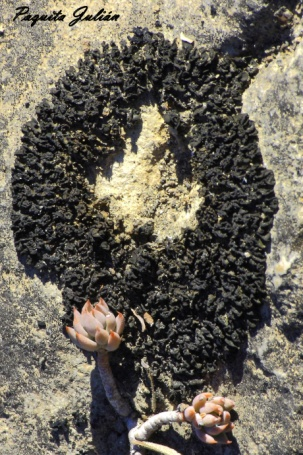

LÍQUENS

Caloplaca aurantia Parmelia caperata

Ramilea fracxinea Xanthoria calcicola

Xanthoria parietins Collema cristatum teloschistes chrysopphthaim

En ser els primers que colonitzen un mitja, com pot ser roca, ho preparen perquè formes superiors puguin assentar-se en ella.
