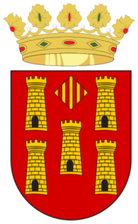

Toponimia de Cinctorres.

Hay poca información de su origen. Al lado de mi finca separado por una pared hay restos de un poblado Ibero. Cerca también uno musulmán y en una casa de aspecto noble, cerca de los bares y del ayuntamiento al hacer reformas en el patio se encontraron columnas romanas, los dueños, las han tapado no quieren decirlo aunque todo se sabe, y en el patio de la casa Santjoans de manera confidencial, sé que hay restos Iberos al lado de los cimientos muy escasos de la Torre del Cortillo o Quartillo de origen musulmán, casa de la Vila i centro administrativo, esta si está documentada incluso por mí en el libro del pavimento. Se sabe con exactitud que el casco urbano era una alquería musulmana o ‘’qarya’’ que formaba parte del Castell de Morella.

En la Carta Pobla de Camaron 1194 38 años antes de la reconquista ya se nombra CINCO TORRES junto con el rio Bergante límite de territorio aragonés. Es el documento más antiguo con este nombre.

La toponimia de Cinctorres es múltiple, te voy a redactar dos, a mi las dos me gustan.

La más antigua expresada en dos palabras: CIRCUM TURRIBUS, circundada, rodeada de Torres. Recorriendo el término municipal hay múltiples rastros de TORRES, ovaladas o cilíndricas .La más conocida es la TORRE DE EN NAVALLES, esta está pegada al mas de Santpere, y al lado de Sant Pere nombre de la ermita que se ve desde el pueblo.

LA TORRE SOLSONA o castellet de St. Marc también se aprecia de cualquier lugar (alguna vez he ido paseando con mi perro, la pista es buena se pueden ir a todas en coche, tiene unas vistas del pueblo preciosas, aunque me cuesta ir y volver toda la mañana)

La TORRE TORRASA, cerca del Mas de en Coll.

La TORRETA DELS MOROS, en el camino del Mas de Maciá. Esta torre es la única cuadrada y de tres alturas, está restaurada, se ve por la carretera de Forcall.

Estas las conozco todas. Paquita.

Les TORRETES de La Llongera, la TORRE de EN PALLARES,y la TORRE TORNERA, existen documentos que hablan de ellas y de las partidas donde estaban, pero no se sabe con exactitud el lugar.

Y la otra versión, QUINQUE TURRES, cinco torres, 5 torres, CINCTORRES.

Cuando la conquista a los musulmanes de la población por las tropas del Rey Jaime 1º en 1232, había un tal Benet de TORRES, noble catalán que, en su escudo de armas figuraba sobre fondo azul, ‘’CINC- CASTELLETS DAURATS\`\`

Así que tenemos para escoger.

Tonica discúlpame por el rollo que te mando ,pero ya sabes que me gusta terminar lo que empiezo.

Un beset. Paquita,

En varias ocasiones se pidió En diferentes ocasiones debido a su antigüedad, se pidió declarar zona húmeda al  río Monnegre que alimenta el embalse de Tibi .Finalmente entre las 48 Zonas Húmedas de la Comunidad Valenciana, se acepto entre otros embalses, el de Tibi, debido a su fluctuación, o cambio,y  oscilación, de  su caudal..

os embalses con régimen mediterráneo pue-

den sufrir fuertes e impredecibles fluctuaciones

del nivel del agua. Se pueden p

Estados Unidos

Alemania

101

Rusia

96

Reino Unido

78

Argentina

68

México

68

Perú

51

Francia

45

Brasil

29

Estados Unidos

15185

España

14498

Alemania

101

Rusia

96

Reino Unido

78

Argentina

68

México

68

Perú

51

Francia

45

Brasil

29

Estados Unidos

15185

España

14498

Alemania

101

Rusia

96

Reino Unido

78

Argentina

68

México

68

Perú

51

Francia

45

Brasil

29
