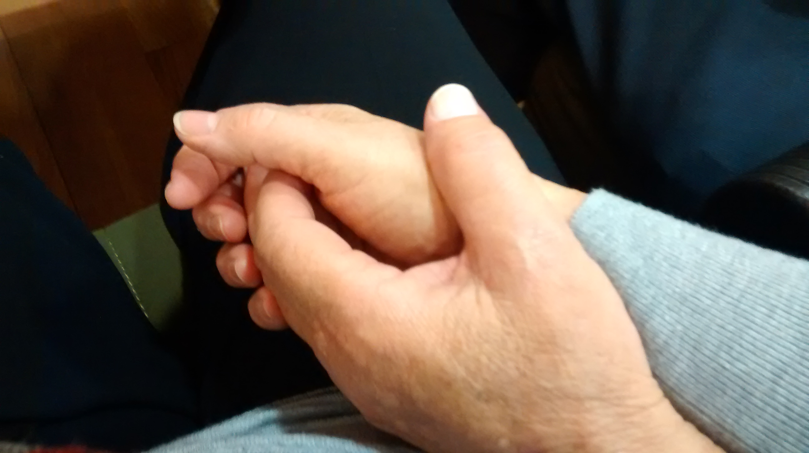

***<u>A DOS MANOS</u>.***

***Me dispongo a manipular las teclas de mi ordenador con los dedos de ambas manos.***

***Así es que una vez puesto manos a la obra formulo la siguiente pregunta:***

***¿Cómo quedarían nuestros escritos y conversaciones si para construirlos nos fuera vetado el uso del sustantivo común que voy repitiendo en las precedentes líneas?***

***Es tal la frecuencia de ese vocablo en nuestro idioma que a uno se le antoja dicha presencia equiparable a la de un condimento de cocina dentro la misma. Me atrevería a decir de la palabra “mano” que es el componente verbal más asiduo en nuestro lenguaje tanto hablado como escrito.***

***Dado que ello a mano viene bien, añadiré más ejemplos. Ellos acabarán de confirmar cuanto voy diciendo.***

***Es constante, en efecto, la aparición de esa palabra en nuestra boca y en nuestra pluma; Dicho vocablo también puede presumir de singular poder, pues en ocasiones ha llegado a tener entre el vulgo la operatividad de un documento notarial. Un apretón de manos, pongamos por caso, significaba que posturas alejadas entre sí habían terminado en acuerdo ó avenencia. De esa forma se hacía patente que los dialogantes, casi siempre tratantes de profesión, habían llegado al punto final de un recorrido sembrado de obstáculos. Dicho gesto cerraba y sellaba para siempre lo previamente debatido entre las partes.***

***Pedir la mano constituye un acto de singular y especial trascendencia en nuestra sociedad.***

***Recibir una mano de golpes es tanto como ser objeto de una descomunal paliza.***

***Pero la cosa no queda ahí, porque similar prestancia aportan sus derivados, es decir, aquellas modalidades linguísticas que nacen o emanan de esa palabra, tales como manojo, manada…etc. Variantes que nos llevan de la mano a escenarios de gratos recuerdos y de finos detalles, A llanuras y parajes en los que todo es abundante...Porque, quien no ha recogido alguna vez con sus manos un manojo de espigas, quien no ha acariciado puntualmente un manojo de flores… Quien no ha tenido en alguna ocasión la oportunidad de contemplar en la llanura grandes y vistosas manadas de ganado…***

***La palabra mano goza de total y robusta autonomía, pero igualmente se siente enriquecida y bien acompañada cuando tiene junto a sí un adjetivo. De tal manera que a través de la unión de ambos llegamos a composiciones tan expresivas y variadas como: manos unidas, manos limpias, manos largas, manos entrelazadas…***

***Precisamente las manos entrelazadas merecen aquí especial atención por nuestra parte.***

***Lo primero que advertimos en este tipo de enlace es que ellos están constituidos primordialmente por dedos; esto es, por apéndices unidos a distinto soporte u origen; En efecto, por lo general esos dedos pertenecen a manos masculina y femenina Digamos, pues, que no estamos ante manos unidas sino más bien ante dedos entrelazados. A partir de ahí el abanico de mensajes que transmiten resulta de inmensa variedad...***

***Información tan diversa como variada pueda ser la edad de los dedos entrelazados...***

***En esos casos el mensaje que ellos transmiten no se ve con claridad. Mas bien se vislumbra ó intuye.***

***A través de su configuración puedes estar viendo planes de futuro, dudas, inseguridad, incipiente relación sentimental, complicidad puntual. En definitiva, algo aún no consolidado.***

***Por otra parte estamos ante mensajes andantes. Lo cual significa que para leerlos hay que salir a la calle. Han de leerse, pues, sobre la marcha.***

***Recientemente, en cambio, tuve la oportunidad de ver una estampa similar y al mismo tiempo muy diferente La comunicación que semejante estampa emitía era nítida, transparente. Se lectura se disfrutaba desde cualquier posición estática...***

***El cuadro me pareció único por su fuerza expresiva, así como por su naturalidad; también por su elegancia y quietud. Sus dedos y manos parecían componer una escena propia de un posado; No era ciertamente una estampa tomada en la calle.***

***El conjunto formado por ambas manos y sus entrelazados apéndices pulgares emitía tranquilidad, sosiego, relajación, experiencia.***

***La conjunción entera parecía guardar un tesoro. Ese tesoro estaba contenido en el interior del cofre que las palmas unidas de ambas manos configuraban. Parecían indicar que para ellas había llegado la hora de compartir y de exhibir. Apiñaban en su interior un trasunto de vivencias desarrolladas por separado.***

***El azar había convertido aquella conjunción de manos en lugar de encuentro para unas vidas paralelas y de parecida trayectoria.***

***Alguien que conoce ambas manos aseguraba al contemplarlas que entre las dos suman ciento cincuenta años.***

***Vicente Vicente.***
