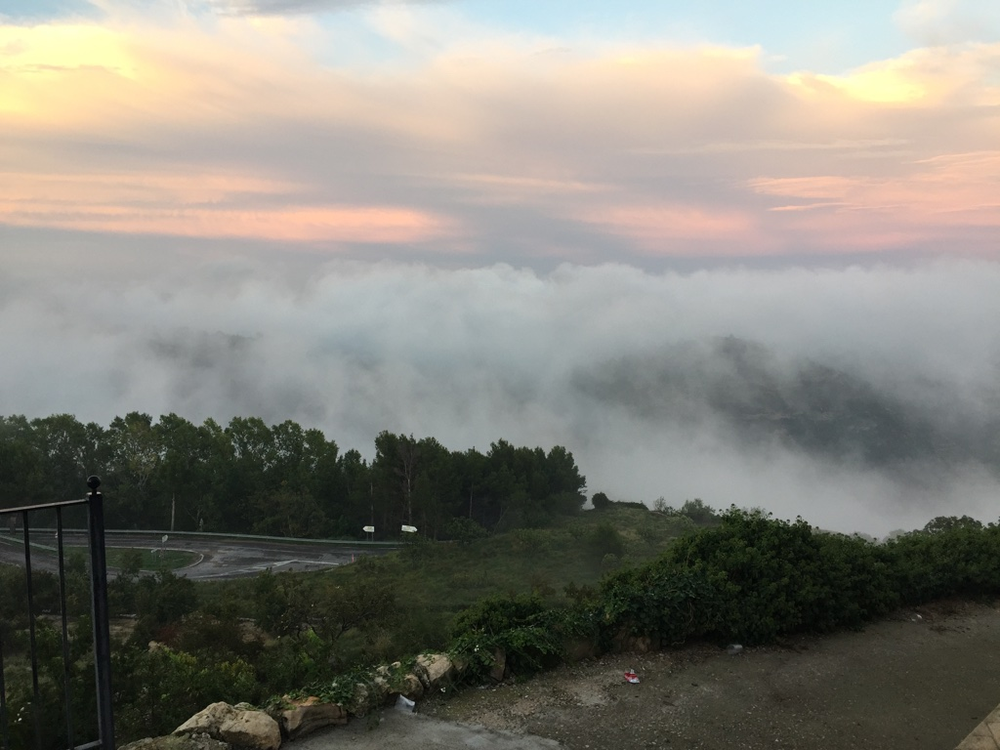

***BENAFIGOS***

*Abrí la semana* con una estancia de dos días en Benafigos. Cerré la misma de igual manera. Así es que de ese modo participé junto con la familia en el principio y final de las fiestas patronales de ese pueblo.

Esta localidad cuenta con bajo número de habitantes. Pero ese número se multiplica mientras se desarrollan los actos tradicionales de los ocho días a que me refiero. De hecho sus programas festivos nada tienen que envidiar a aquellos otros que se redactan para ciudades mucho más pobladas. Definitivamente he visto gran cantidad de coches y de gente en las fiestas de Benafigos.

Al margen de todo lo dicho y dado que era la *primera* vez que este servidor acudía a esa localidad, algo ha llamado poderosamente mi atención. Ello tiene que ver con la ubicación del pueblo. Y es que sin duda el asentamiento del mismo tuvo lugar en su momento en lo alto de una montaña. Es como si en su día se hubiera urbanizado un trozo de sierra montañosa. De modo que entrar en ese pueblo es tanto como empezar a subir largas y pronunciadas pendientes.

Todas sus calles van a morir a lo más alto del pueblo. Terminan en la Plaza Mayor. A ese punto es obligado acudir. Pues en él está el centro neurálgico de su recinto. Allí se encuentran los edificios civiles y religiosos copropiedad de todos sus vecinos. En dicha Plaza, en efecto, se desarrollan los actos festivos y culturales del pueblo.

La construcción del conjunto me hace pensar en un paraguas abierto.Pero no para proteger de nada a sus habitantes, sino para caminar y circular sobre él.

La empuñadura ó invertido bastón de ese utensilio no se ve. El extremo superior de esa especie de badajo esta apuntando de forma invisible y desde abajo a la Plaza Mayor El conjunto formado por su varillaje y tela está imaginariamente desplegado y adherido a la superficie del alto cerro.

Las varillas de este supuesto paraguas serían las calles por las que vamos subiendo. El espacio que separa a las mismas está ocupado por edificios ó viviendas. Estas superficies a su vez presentan desniveles que obligan al uso de peldaños ó escalinatas para acceder a alguna de sus casas. Así es que podríamos decir que no todas las viviendas del pueblo están situadas a la misma altura sobre el nivel del mar.

La meteorología del lugar es caprichosa. Puede tener a lo largo del día numerosos cambios. Y es que los cirros, nimbos y cúmulos de la zona están en continuo movimiento...Si se observa detenidamente su actividad en la bóveda celeste se aprecia algo parecido a un espectáculo. Todas las nubes parecen pasear y cruzarse con cierto respeto; también con alguna consideración mutua para no chocar entre sí. Mas está claro que ese protocolo que a primera vista guardan se rompe con frecuencia…

Pero lo singular de las nubes que comentamos es que el contraste de sus tonalidades y movimientos pueden ser observadas de manera singular. Para ello no es preciso dirigir la mirada hacia lo alto. Basta mirar hacia el frente desde cualquiera de sus inclinadas calles. El espectáculo está a la altura de tu mirada horizontal.

Para verlo has de ir a Benafigos.

Vicente Vicente Rodriguez
