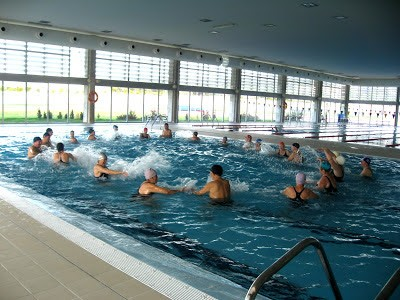
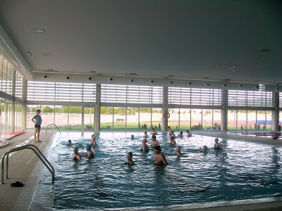

Quan arriben aquestes festes, hi han tantes coses per a  celebrar,  que  s’ amuntona la faena.

Tenim el dinar de les amigues de la Colla, de les amigues  d’infantesa, de la classe... Sempre anem al mateix restaurant on  ens coneixen, i ens preparen  una taula rodona i gran, com les que fiquen a les celebracions importants,  al racó del menjador on podem parlar i riure amb ganes sense molestar massa als altres comensals.

 Com si fora poc, també gaudim de  tots el dinars familiars, on comprem menjar, cuinem i preparem la taula plena,  sense mesura ni ordre.

Aquest ha sigut el primer  any que ha pogut anar a les classes de ACTIVITATS FISICA PER A MAJORS  i com és el costum, l’últim dia també vàrem esmorzar uns quans companys a la cafeteria que hi ha en la Facultat d’Humanes, entre bromes i rialles.

    Però el millor va   ser la sessió gimnàstica dins l’aigua. La monitora, ens fica diferents tipus de música per  a compassar els moviments.   

    Aquest dia  tota la música era  de motius Nadalencs, inclòs vàrem tocar campanes i engronsar  a Jesuset  al compàs  de la Nadala. Açò no seria   estrany si no fos  per que tots, homes i dones  tenim de 65 any  cap avant.

   Els jovents que fan natació al costat, ja s’han  acostumats  a veure-mos per qualsevol lloc  i compartim   els vestuaris i tots els serveis, amb tota normalitat.

   A primer d’any, quan començaran les classes per a  tots el universitaris,  tornarem  a començar amb el exercicis de manteniment. Aleshores és  una de les moltes coses que podem desitjar, mantindre -mos el millor que pugem, amb ganes de viure i de gaudir de la companyia dels que estimem.
