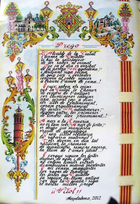
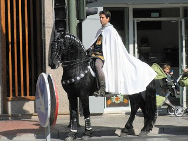
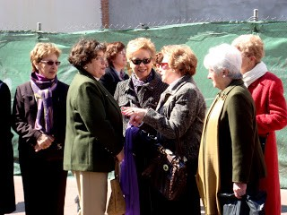

|  |
|:--:|
| Caballer de la Conquesta. |

|  |
|:--:|
| Amigues. |

Doncs per a ser la Vespra de la Festa grossa a Castelló, dia de la Magdalena, no està gens ni mica malament.

A les 12 en punt del mig dia del dissabte, és el començament  oficial de festes

 Abans d’aquest hora, per els carres que donen a les Palmeretes és un riu de gent de totes les edats i condició. Un grup d’amigues, estàvem com tots el dissabtes fen tertúlia,  i prenen el primer cafenet del dia al voltant del mercat, va ser seguir a la gent i trobar-nos en mig del ambient. de festa. Viure la mascletà és cosa que t’agrada molt, o te donen ganes de fugir, cosa quasi impossible, s’està rodejat de persones mirant amb expectació el cel, escenari del primer acte de festes, el soroll es impressionat, jo no mai havia estat tanta a prop, ni recordo els colors tan bonic dels coets a ple sol  d’un blau ver i taronja lluminós, l’olor de pólvora i fum a més dels trons i tremolons, fan el acabament, impressionat.

Tot seguint, vàrem fer el camí a l’anvers tornat al centre, on començava l’acte del Cavallers de La Conquesta, fent-li l’homenatge al Rei en Jaume. 

Al dinar, era cosa de visitar el Mesó de les Tapes, també ple de gent, i clar no podia faltar viure la Cavalcada del Pregó, Museu en viu, on estan representats la Mitologia, la Historia Fundacional, Ciutat i Term,e amés de la representació de les diferents comarques i pobles de la província, que ens fan gaudir del seu folklore i costums. I el moment més important, com escoltar llegír amb veu de baríton, al Sequier Major o Pregoner convocar al poble amb els versos de Bernat Artola i despertant el sentiment castellonenc.

 El voltegi de la campana Maria al Fadrí a l’acabar el Prego, seguit de l’espectacle a la Plaça Major,va ser el moment en que vaig pensar que ja era hora de tornar a cassa i deixar pal proper any el que. quedava per veure aquest dia, com berbena, Festival de Pirotècnia i no se quantes cosses més

Crec, que pa ser de LA VESPRA DE LA FESTA, ja està bé.
