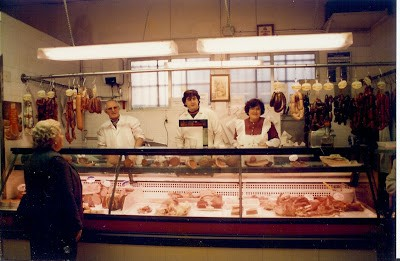
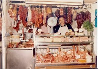
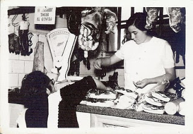

S’han celebrat fa poc dies els 50 anys del mercat de Sant Antoni a Castelló. A l’acte oficial, varen vindre les autoritats, doncs és un mercat municipal. Jo estava allí, veient l’acte i recordant com en una pel•lícula els 35 anys millors de la meua vida, treballant i lluita’n junt a Juan Padilla el meu marit i consolidant el nostre negoci familiar com cansaladers, elaborant tot tipus d’embotits típics d’esta terra i els derivats del poc.

Tots el venedors teníem la mateixa edat amunt o avall, i fa o no fa els mateixos problemes, junts em gaudint i compartit els mateixos o pareguts problemes i esdeveniments; naixement del nostres fills ,xarampions, catarros, comunions desprès suspensos, bones notes, milis, ( en els cas de tindre xics que érem la majoria), nuviatges i fins i tot el dolor de l’absència per sempre, d’alguns companys.

Les fotos que formen part del escrit, son del arxiu familiar, en elles s’aprecien les diferents èpoques, la primera en blanc i negre es del any 1965, la segons, en el calendari de la paret la data es 1982, i l’ultima en que estem el meu marit Juan i el meu fill Manolo, es l’any 1999.Mirat les diferents bàscules, es veu com la tecnologia avança poc a poc.

El mercat actual, no te res que veure amb el que jo treballava, doncs aleshores, és un espai modern i lluminós. Tant com els anys han passat me n’ha donat, que prompte, del mercadet antic ningú recordaria res, i que era el moment de fer història.

La primera visita obligada ha segut a l’arxiu municipal, d’eon vaig recollir de les actes oficials, el projecte on es va decidir la seua construcció, els anunciïs al B. O. P.nº1 de 28 de 1958 i al B. O. E nº 89 de 1958, les costes, tots els documents necessàries,les diferents subhastes per ha construir-lo,estudiar-ho,i copiar-ho tot, d’aquesta manera poder donar els detalls i tota l'informació.

També ha escorcollar a l’arxiu del periòdic Mediterràneo, les diferents notícies relacionades amb el mercat fins al dos de gener de 1960, on dona l’ultima informació amb la seua inauguració.

L’olivera, ja retirada, i una companya carnissera, que queda de la primera fornada, (l’única, encara treballant,) m’han ajudar a recordar noms,i mots, impensables de dir hui, que abans eren corrents, i que tot hom portava amb orgull. Els productes que es venien a totes les parades, els noms de carregadors, empleats, fins i tot el que es venia els caps de setmana al carrer, a la cera ampla del edifici,per la part de darrere, com ara, plantes aromàtiques, margallons o caragols.

Tots els venedors actuals tenen a la seua parada,el xicotet llibre editat pel ajuntament per a esta ocasió, amb la historia del Mercadet, on abans venien a comprar des de els barris de La Guinea, Els Mestrets , El Rabal i tota la contornà, llibret, que amb molt de gust els obsequiaran. Llegint-lo, coneixeran l’esperit d’un mercat de barri que sempre ha estat açi, a La Ronda ,prop del Frares, en el barri del codony i que per molt de temps, estarà.
