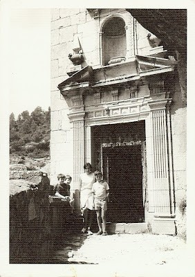

El primer dissabte de setembre, és festa Grossa a La Balma:

Sols cal dir això, i tota la gent de la contornà, sap, que en aquest lloc de peregrinació, se celebra la victòria del Bé contra el Mal, amb la lluita del Àngel sota Lucífer. La representació, es fa al començament del camí, vaig la majestuosa creu coberta, amb unes pintures bellíssimes del pintor morellà Cruella. El diàleg entre l’Angel i el dimoni té un text antiquíssim, la lluita acaba, quan l’àngel vens al dimoni, ficant-li el peu al cap.

Els grups de gitanetes,llauradorets i pastorets, acompanyen a la professo fins  l’església construïda dins d' una balma, amb danses ancestrals, vaig l’odre, dels pastors majors,i la música de dolçaina i tabalet. Els vestits molt vistosos, son de colors blau, roig, i groc, la camisa blanca i tots calçats amb espardenyes minyoneres. Per la vesprada, tornen al poble amb la peanya i la gran bandera, i davant de l’església de Sorita, s’encomien de la mateixa manera, dansant fins el proper any

La Balma, és un conjunt d’edificis històrics, construïts S.XIV encaixat de forma bovejada, a una balma o abrigo natural, on antígament en l'esglesia, es feien exorcismes, fets que estan documentats, aleshores, es creu que moltes vegades eren malats epilèptics.

Actualment tot el conjunt s’ha restaurat, i es pot gaudir d’hostaleria i restaurant.

Moltes vegades ha estat aquest lloc, doncs és difícil passar prop per la carretera que va a Aiguaviva (camí natural cap al Vaig Aragó) i no entrar a fer-li una visita.

|  |
|:--:|
| Paquita,germanet,fill i nebot 1969 |

Quan els nostres fills eren menuts, en les vacances, estàvem al poble,i anàvem a prendre el bany al riu Bergantes que creua tot la vall, a un toll que fèiem servir de piscina, on l’aigua te corren, està molt neta i fresqueta, cinc Km. més en lla, prop de la província de Terol, on el riu s’ajunta amb el Guadalope afluent del Ebre.

Aquest any, la visita al santuari amb els amics de Cinctorres, ha segut com calia, el dia de la seua festa. Estava de gom a gom, hi havia paradetes de llepolies ,records i moltes coses més.

De sobte, a oït que em cridaven, i la meua sorpresa a segut veure entre la gent de totes les edats que hi havia, al veïnat del carrer Virgen de La Balma de Castelló, molts d’ells amics i clientes meus del Mercat de Sant Antoni, (no recordava que molts anys visitaven a la Mare de Deu el dia de la seua festa assistint a la celebració).

L’amiga Reina tota seriosa em va dir, Com pot ser? Eres un cas!!et coneixen per tot arreu on vas. M’ha fet cavil•lar...Serà viritat?
