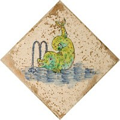
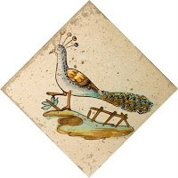

[<u>  
</u>](http://2.bp.blogspot.com/_d7lxtKNLdDg/S_mHZXNVJaI/AAAAAAAAAn0/oxVeNVhdyO0/s1600/Pavo+real.jpg)

Cuando eres niño todo lo ves grande y a tu manera. Siempre quise ver el interior de la Casa Sanjoan. Vivíamos enfrente.

Mi padre era herrero, hacia todo tipo de trabajos de forja y herraba a las caballerías del pueblo y de las masias de alrededor de Cinctorres.

Algunas veces también lo hacia en la casa Sanjoans, siempre hacia falta reparaba algún desperfecto, y me decía: En el salón hay un pavimento, en que cada pieza es distinta y tiene pintados animales de todo tipo y que tu, no has visto nunca.

Estas palabras despertaban mi fantasía pensando como serian esos animales.

Han pasado mas de cincuenta años. Cuando he visto el pavimento del salón con animales, (hay mas de seiscientos azulejos) son tan hermosos que ha merecido la pena.

La curiosidad que tengo, de entender lo que no se, me hizo indagar sobre el pavimento cerámico con figuras zoomorfas de la casa. Hay muy poca información de su fabricación y este es el trabajo de investigación que he hecho para presentar en la Universidad de Mayores de Castellón UJI en mi segundo ciclo de estudiante.

Ha sido un trabajo a veces difícil pues he tenido que aprender desde la cocción de las piezas, hasta los orígenes de los dibujos, todos ellos de diferentes Aucas de la segunda mitad s.XVIII. Asi como la técnica de su esmaltado, de diferentes óxidos metálicos.

El día 13 de mayo presenté y defendí mi trabajo en el Aula Magna de la Universidad Jaume I de Castellón, ante compañeros y profesores. Y me alegra entender al fin, lo que mi padre, un hombre sencillo de pueblo supo ver, la importancia y belleza del pavimento que ha estado alli desde 1770-1798 hasta ahora.
