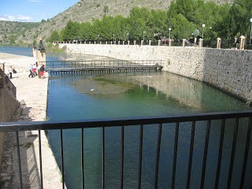
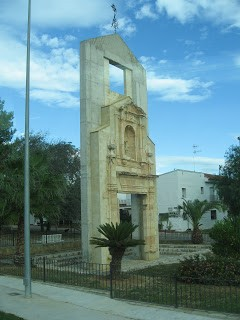
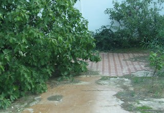

A la gen de secà,  ens agrada l’abundància d’aigua corrent, no sempre hi ha a les nostres fons i rius.

Potser per aixó, que la visita que he fet a La Ribera Alta per on el riu Xúquer és l’amo m’agrada’t.** **Anàvem a veure l’Assut d’Antella,que creua obliquament la llera del diu Xúquer.

|  |
|:--:|
| L'Assut d''Entella  |

L’Assut, deixa passar l’aigua del riu Xúquer a la Sèquia Reial, al principi hi ha la casa de les tres comportes que serveixen per a retenir  o graduar la quantitat d’aigua que es deixa entrar.

L’ aigua que brolla sobrant de la sèquia, es la platja de la comarca amb un espai d’arbres i ombra molt bonic.

La primera parada ha sigut a Tous i com que aquestos dies s’han complit 30 anys de La Pantanada, em vist tota aquesta zona

 A l’entrada del poble nou de Tous, està un tros de la façana de l’antiga església, que van desmuntar pedra s pedra i que es un monument al record. Al mig del embassament nou, deu vegades més fort, més gran i més segur  es veu  el campanar del antic poble inundat.

|  |
|:--:|
| Façana antiga esglesia de Tous |

Em creuat el poble de Gavarda  en  una planícia, encara hi ha varies cases habitades per veïns que no van voler anar a viure al poble nou construït al costat en una petita muntanya.

Quan es passa pel poble vell es veu els llocs vuits marcats pel paviment,de diferents habitacions de les vivendes,  pareix un plànol amb la distribució de les antigues cases dels veïns que van acceptar anar a viure al poble nou amb la condició de derruir les antigues vivendes. Els que es van quedar les van reconstruir. Dóna una sensació estranya  de buidor.

|  |
|:--:|
| Gavarda, paviment cases derruïdes.  |

Hi a gent que  encara recorden la pantanada,  jo també. Aleshores s’escoltava molt la radio y allò era molt greu,doncs van  ser moltes les persones i el pobles i  afectats. Vàrem parlar amb uns veïns hi ens deien,  que van tindre que fugir de casa amb lo que portaven i gràcies a la solidaritat de la gent de altres pobles que els van donar acollida, persones que no coneixien de res, van arribar a conviure 30 persones al mateix lloc, aquesta amistat ja es pa sempre. I el pitjor va ser quan  passat el tems es van trobar un magatzem   ple de menjar,mantes y avituallament,  que la solidaritat de  tot arreu va  donar, els aliments peribles estaven   podrits, sense poder aprofitar res, quan hi havia  tanta necessitat.

Poc a poc estic coneixen trossets desconeguts per a mi, pobles i gent  que parlen com nosaltres ,amb la mateixa llengua i que a vegades té  el so  diferent. Estos camps, no tenen res que veure amb la co

marca dels Ports  que conec bé. Tenim una immensa riquesa amb la nostra diversitat.
