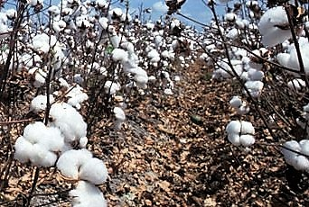

1.  AGRICULTURA

2.  LAS PARTIDAS DE CASTELLÓN

3.  SISTEMA DE RIEGO

4.  CAMINO CAMINÁS Y DONACIÓ

5.  ERMITAS EN LAS PARTIDAS DE CASTELLÓN

6.  EL CÁÑAMO 8

7.  EL NARANJO 15

8.  EL ARROZ 26

9.  EL ALGARROBO 30

10. LAS CAÑAS 38

11. LOS HERBEROS 38

12. LA SEDA 38

13. CAÑA DE AZUCAR 39

14. EL ALGODÓN 39

15. EL HERRERO 40

16. ELFAIXERO 43

17. LA ALIMENTACIÓN 45

18. BIBLIOGRAFIA 47

*Vivencias.*

*El meu abuelo materno Viçent Chabrera Agustí, era tallaor i Cap de cuadrilla en contaba les vivencies quan anaven a la casa els propietaris d’hotrs i quedaben per tallar la finca, me deia que el propietari acordaba si le tenía que pegar fort o poc acapolat, lo que volia dir lleval-li molt de llenya ó poca. Tambe els contrataben per empeltar les plantonaes jovens ó canviar de llavor el que hi habien de mes adults.*

*La compra del producte, els corredors anaben per la nit a fer els tractes a les cases del propietaries per aclarir el tracte, alló era de lo mes curios per estirar el  preu, cap una banda i per l’altra, per fí es fà el acort del preu dia de collida i de cobrar, Ens recorde de algunes persones que feien aquesta faena; el senyor Manolo Melía, Rubio, Agots (Safanoriero) Porcar, Pasqualet “ El Canari “  i el germà; tots personatges molt coneguts pel poble.*

*Les almacens de taronges més famosses de l’epoca de fà cent anys eren La Llúsia també La Geasa una de les primeres Cooperatives més importans, que acollien a quasi totes les dones de Castelló que anaben totes les dies a fer jornà.*

Los regantes de Fadrell, al ser los primero en tomar el agua del río Mijares, tenían derechos y privilegios, tales como que el riego lo efectuaban durante el día, desde la salida del sol hasta su ocaso y que solamente su propio acequiero podía controlar su riego. Puesto que el acequiero de la huerta de Castellón solamente tenía jurisdicción sobre ella.

