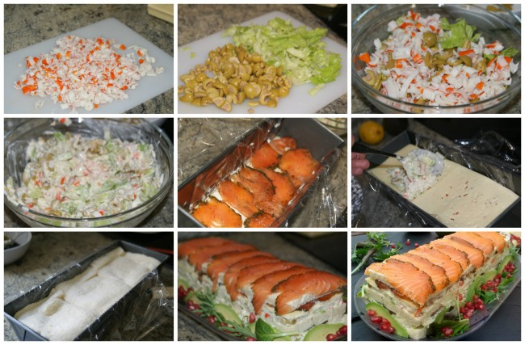
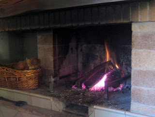

**Ingredientes**

**Para 6 a 8 personas**

- 10 rebanadas de pan de molde sin corteza

- 200 g de salmón

- 200 g de palitos de cangrejo (surimi)

- queso en lonchas

- 4 cucharadas de mayonesa

- 4 hojas de lechuga

- 150 g de olivas rellenas

- 1 aguacate

- 1 limón

- sal

Preparación del pastel de salmón

[<u>  

</u>](http://4.bp.blogspot.com/-F2KekecbtQw/TuPv9xC0WII/AAAAAAAAA04/6jXXgg7ISs8/s1600/llar+012.JPG)

 A veces me pregunto.¿ que es, como es la belleza?

A veces me pregunto: Como es la belleza, objetiva o subjetiva

* Según el diccionario de La Real Academia de la Lengua la belleza, es armonía y perfección de las personas o cosas, que nos induce a amarlas, produciéndonos un deleite espiritual.*

*Es un calificativo y una cualidad, belleza es también, la armonía de los elementos  y el equilibrio y la percepción de los sentidos.*

Quede absorta mirando el fuego del hogar, y pensé; es hermoso, que belleza, las llamas cambian de forma constantemente y son irrepetibles parece una danza, alumbra,la gama de colores rojos  de las brasas, de un momento a otro es diferente, en algunos como el amanecer. Sorprende el chasquido que a veces produce, cuando se queman las ramas. Es efímero, pues se consumen muy pronto, pero no es así cuando se quema  un buen tronco de encina. Da calor confortable. Ha sido imprescindible a trabes de la historia para hacer el carbón vegetal necesario como combustible  También sirve para cocinar, durante siglos y aun ahora no hay nada como unos buenos brasas para asar los alimentos. La ceniza, se ha utilizado para lavar, en las antiguas coladas era el filtro por donde el agua caliente eliminaba la suciedad de la ropa, cuando el jabón era escaso o inexistente, luego sus restos también se reciclan.

Desde el Paleolítico en todas las civilizaciones, el fuego es adorado. Lo mismo que en la Mitología, y aquí mismo sin ir más lejos en los pueblos del interior de Castellón, el culto al fuego se aprecia en las distintas celebraciones de San Antonio, y por otros  lugares las Hogueras de San Juan.

.

Dicen que el fuego ahuyenta  a las fieras,  Pero también es peligroso, un incendio  destruye todo lo que encuentra a su paso, y en espacios cerrados también lo es, por los gases y humos tóxicos que genera. Cuando en los pueblos la única fuente de calor era el hogar  siempre, antes de acostarse deshacían las brasas para que se apagaran, por precaución.

Así, que no sé, si el fuego es hermoso, o peligroso, creo  más bien, que en el momento que vi en el su belleza, no era objetiva, la belleza que vi en ese momento de calma, era belleza subjetiva, y quizás en otro momento y circunstancia, lo vea de otra forma y cambie de opinión...

EEs además Rey de España, de Castilla, de León, de Aragón, de las Dos Sicilias (Nápoles y Sicilia), de Jerusalén, de Navarra, de Granada, de Toledo, de Valencia, de Galicia, de Mallorca, de Sevilla, de Cerdeña, de Córdoba, de Córcega, de Murcia, de Menorca, de Jaén, de los Algarves, de Algeciras, de Gibraltar, de las Islas Canarias, de las Indias Orientales y Occidentales y de las Islas y Tierra Firme del Mar Océano.

Por cierto, no es rey de Francia, lo es Luis Alfonso de Borbón, duque de Anjou, como Luis XX.

[13 marzo 2014 \| 1](http://blogs.20minutos.es/yaestaellistoquetodolosabe/sabias-que-juan-carlos-i-ademas-de-espana-es-tambien-rey-de-jerusalen/#comment-9087)

i conocimiento del corcho aparte de los tapones de las botellas (cada vez menos) se limitan al BASSO O RUSC DE SURO recipiente de forma cónica unido por un lado, para las colmenas que se utilizaban hasta hace unos años, aun se ve alguno en las solanas que aprovechan los apicultores dels Ports,

Reglamento vías pecuarias o assagadors .

Auque la palabra via pecuaria , cañada o assagadors parezca lo mismo hay diferencias en su nombre y cometido.

Es un tema apasionante y una vez lo conoces, entiendes su importancia en tiempos pasados y también presentes

Recibe el nombre de **Cañada o *assagadors*** *la via pecuaria que cruza varias provincias de ancho 75,22 m.*

***Corde:** Vía pecuaria que afluye a las cañadas y pone en comunicación dos provincias limítrofes, ancho 37,61cm.*

***Vereda**: Vía pecuaria que comunica varias comarcas de la misma provincia, ancho 20,89cm.*

***Colada**: Via pecuaria que comunica las diversas fincas de un termino municipal.*

*(Reglamento de vías pecuarias de 3 de noviembre de 1978)*

*Fotografia: Tranhumancia Colada Cana d’Ares.*

18 feb. 1985 - **Colada de la Cana de Arés**: Anchura legal y necesaria dentro de1ténnino de Morella de 10,2 metros y longItud aproximada de 2.500 metros.

**RESUMEN: BUFADORS** Francisca Julián Querol

La palabra **bufadors** en las paredes de piedra seca, indica el hueco por donde pasa el viento, y que están construidas en zonas donde el aire helado es constante.

He indagado y buscado. A pesar de ello no he descubierto en la zona *Els* ***Ports y Maestrat*** otros que no sean ***Els Bufadors d’Ares.***

**Els assagadors,** o vías pecuarias para la trashumancia, son un ejemplo de inteligencia adulta o capacidad de adaptación al medio por el hombre del campo. **La neccesitat fa fer,** con ingenio y mucha sabiduría rural. Hay que conservar firmes las paredes, esto ha creado diferentes maneras de construirlas, según necesidades, a veces con pequeños ***contrafuertes***, y espacios huecos por donde pasa la ***fauna***, y como ***els contadors*** de ovejas. Los pastores, tienen una habilidad especial para saber las cabezas de ganado que pasan por el hueco de la pared. Las rutas ganaderas de la provincia son 24.260 hectáreas y su longitud 4.800 Km, aproximadamente.

**RESUMEN:** **BARRAQUES O CASETES**

Les ***barraques o casetes*** en el campo del interior de la provincia son un recuerdo de nuestros ancestros que se utilizan como refugio en climatología adversa. Construidas con habilidad por labradores, masoveros y pastores. Así como las ***valonas*** más utilizadas en el Maestrat

***Barraques i casetes***, grandes o pequeñas, todas cumplen su cometido.

Pequeñas: Escasamente permiten refugiarse una o dos persona, están integradas en ***parets o marges*** el portal tiene linde de losa.

Medianas: las que permiten refugiarse un grupo de personas, pueden estar integradas en la pared o medio embebida en roca, con portal o linde de piedras cortas y curva.

Grandes: Aisladas en medio del campo, con capacidad para personas y animales .Están construidas con hileras de piedras planas unas encima de otras a pocos centímetros, cubierta de **falsa volta** y dintel alineado. Todas tienen técnica equilibrio y estética. Verdaderas obras maestras.

1-Los "bufadors" de Ares.-Debido a sus propias necesidades,los agricultores y ganaderos fueron construyendo la arquitectura de la piedra en seco,con su inteligencia y experiencia.Mas tarde aparecerían los "paredadores" y los "bancaleros", expertos  en la construcción de paredes y ribazos respectivamente.De ahí se desprende la "inteligencia adulta", experiencia e ingenio a cualquier edad.Al conjunto de construcciones, incluida la trashumante ,tan importante en tierras castellonenses con una extensión de 4.800kms,le daremos la categoría de Bienes Inmuebles Etnológicos.

Los vientos del Norte,Cierzo y Tramuntana ,fueron los causantes de que en la azagadores aparezcan los "bufadors" ,asi como  las losas inclinadas en l en la culminación de los muros AL ingenio y creatividad de los paredadores se le llama "la necessitat fa fer"

2-Las "barraques"-Abrigo campesino de pared seca.-La barraca de viña es de piedra seca en su totalidad.Siempre cubierta con bóveda cónica o de cúpula,construida por el sistema arcaico de falsa bóveda.Con una hilada de losas planas a modo de alero.El mencionado alero escupe el agua de lluvia hacia afuera.Eran obra de campesinos especializados llamados"barracaires",Se las denomina: barraques, borges, cabanes agopastoriles, cacherulos.

Los VALONES son muy comunes en el Maestrazgo,pero no exclusivos

Todas estas construcciones mas arriba mencionadas, son de tradición prehistórica..

Las maquinas al mejorar el trabajo ,ya con la rueda ,la palanca,martillos cuchillos  hachas.. etc  facilitaron el trabajo, aumentaron la procuccion y dieron mas tiempo libre para filosofar,contemplar el firmamento..pero no a todos los humanos,siendo algunos  mas inteligentes o capacitados  los que disfrutaron del privilegio.

Con la maquina de vapor, la electricidad ,la energia atomica etc  no se hace sino aumentar  mas la diferencia entre los privilegiados y los obreros. 

Todo esto  nos lleva a modelos de sociedad mas inestables ,cuyo fin parece una vuelta a un tipo de Sistema Feudal ( Nobles vasallos y mendigos)

Estimado compañero; seguro que recuerdas la imagen de algún labrador arando, con la azada, hacha, haciendo las tareas del campo con su esfuerzo, así ha sido durante siglos. Ya era hora de que estas tareas se puedan hacer con maquinas, eso no son privilegios son derechos necesarios incluso de supervivencia -

Y si hablamos de las tareas domesticas, lavadoras, frigoríficos…etc. Ni te cuento. Muchas de nosotras, mujeres, lo hemos conocido de diferentes maneras, por eso puedo hablar y dar mi opinión. El progreso es necesario, incluidas las maquinas, tecnologías y todo lo que sea avanzar con mesura.
