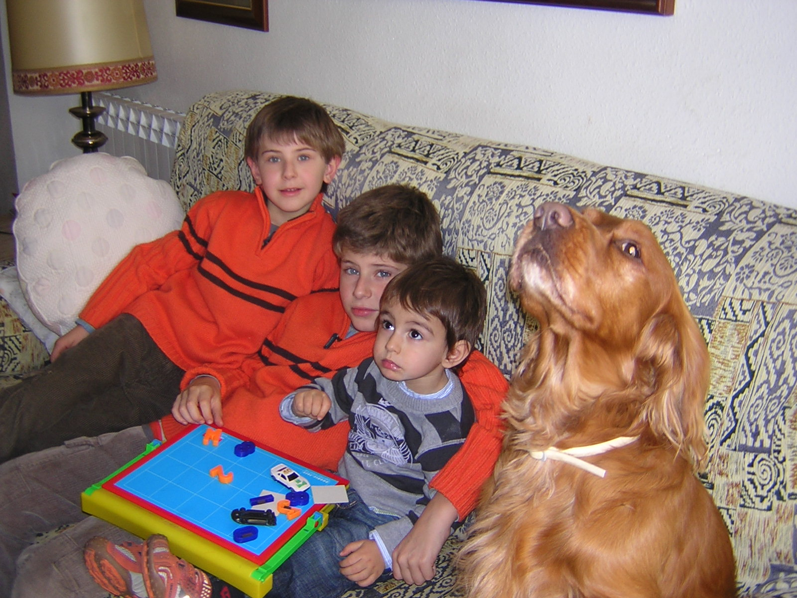
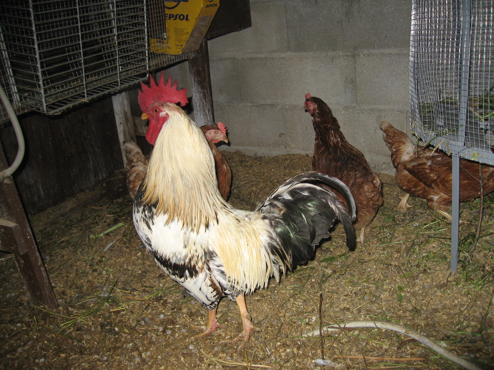
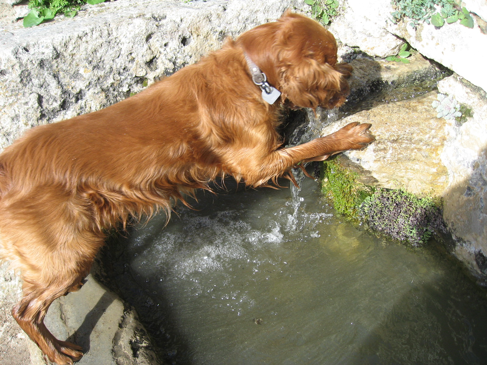
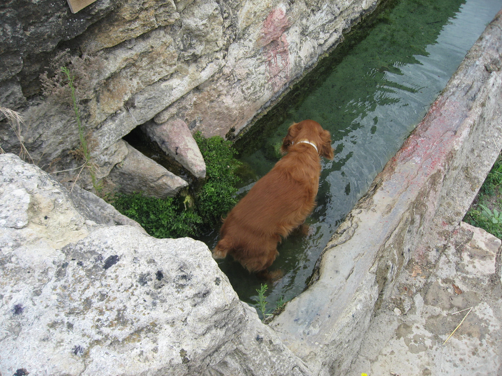

JA ESTEM A CASA.

He escoltat a la meua ama, dir amb un sospir profund (Ja estem a casa. Gràcies a Dèu!!!) i jo penso – I tant... fa tres mesos que anem pel món. Carregats amb la seua maleta, el meu menjar, el llit, xampú i no sé quantes coses més. De fet, no cabem en els cotxes dels fills. Sempre fa de carregador Tadeo, el germà. En el seu vehicle anem al poble, de tant en tant fem alguna parada i jo puc córrer i fer altres coses ... pel camp abans d’arribar.

Estic acostumat a fer canvis. Quan comença l’estiu, ens anem a la platja, allí s’està bé, sols tinc que estar vigilant als xiquets, menys mal que es fan grans i quan ja estic fart d’ells, m’amago sota el sofà, allí, no poden acostar-se i n'estic una estona tranquil, També tinc la ventaja de tastar totes les llepolies que ells mengen i que em donen d’amagat, més que res, els gelats de tota mena que ens agraden molt, quan van cap al frigorífic jo vaig amb ells, sempre cau algun mosset.

Desprès toca el poble, també uns dies a Morella i al mas.

Quan m’agrada Cinctorres!!! tinc tota l'entrada de la casa per mi, a més d’una renglera d’escales fins al terrat. En veritat són moltes escales, tres pisos, però com m’agrada estar prop de la meua ama, faig tants viatges amunt i avall com ella. A vegades les potes em tremolen i penso...desprès a Castelló descansaré.

De bon matí, ens anem a passejar a la font del Bassí, està a les afores del poble. Primer, faig una ullada al galliner que té la Rosa, la veïna del carreró de La Placeta a les eres, són cinc gallines i un gall molt presumit, blanc i negre, les gallines de color quasi roig. El gall és un escandalós, fa molt de soroll amb el seu kikiriki. Al sortir de casa ja l’oïm, i quan jo m’acosto lladrant, s’amaguen tots i només marxem nosaltres, tornen a ficar-se a la finestra del corral. La meua ama diu, que els ous de les gallines de La Rosa són molt bons.0

El camí de la font és un passeig on va la gent del poble i els forasters que estan estiuejant. A mi m’agrada anar pels bancals, córrer i botar, doncs la terra és molla i a les meues potetes no li fa mal.

Quan arribem, tinc molta set i el primer que faig es beure al xorro, (que fresqueta esta l’aigua!.) La meua ama, desprès de guaitar que no hi ha ningú a prop, em deixa prendre el bany al bassiol, on beuen els animals de la rabera i els cavalls i desprès seguim caminant. Però aquest any, no hem pogut menjar mores dels esbarzers. Al Barranc de La Vila, que està prop, la sequera no ha deixat que maduren... l’any que ve, serà.

Listo

