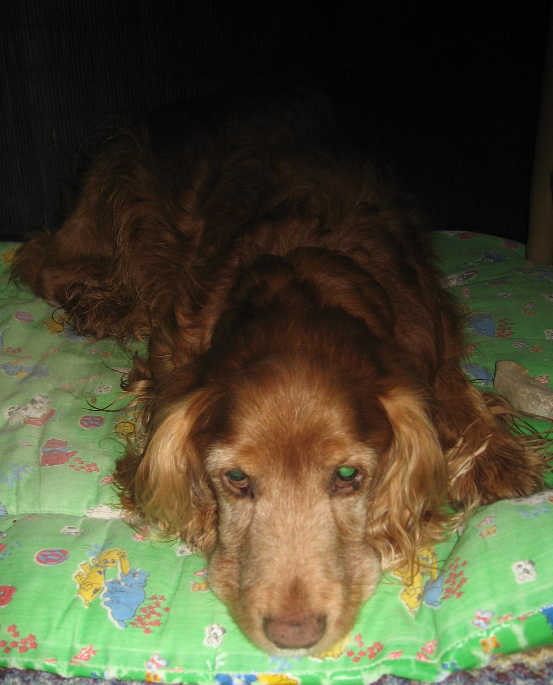

LISTO T´HE PILLAT¡¡¡

La meua ama Paquita quan se'n va de casa, sempre tanca la porta de la seua habitació, tota la resta de casa es queda oberta, a mi m'agrada estar a tots els llocs.

Jo, sempre faig una ullada a veure si s’ha quedat la porta oberta (a vegades amb les presses no se’n recorda de tancar-la.) Com que ja fa fresqueta i el sol entra per les dos finestres del xamfrà, damunt del llit es dorm molt bé, recolzat amb dos coixins grans que fica damunt d’un altre allargat.

Estava jo donant voltes i rebolcant-me per tot el llit i gojant amb els coixins, quan de moment em sent: LISTOOO ..T’HE PILLAT!! quin esglai, per on ha vingut ? no he oït res!. Vist i no vist m’he amagat baix del llit. Paquita portava una granera i un bon empipament... Surt de baix del llit, pocavergonya.!!

  Qualsevol s’arrisca, segur que la granera aniria al meu llom. Va llevar el cobertor, els llençols, coixins i ho va ficar tot a la rentadora, també va flitar el llit, amb un spray i deia: a saber les puces que has deixat!! Puces? Si de tant tan em fica una pipeta al llom que no m’agrada gens, i a més, no sé d’on ha tret la idea de ficar-me a l'aigua de beure unes gotes de vinagre de poma que diu es antiparàsit. Puces? Seria un milacre.

Vaig estar baix del llit fins es va fer de nit i no podia aguantar el pis, així que li vaig portar el meu joguet preferit (un cocodril verd que xiula) manejant la cua. Encara se’n recordava,  mirant-me amb ulls acusadors, però ens vàrem anar al carrer a passejar, doncs jo tenia molta pressa.

  Es clar que tinc que anar amb conte, i quan tornaré a veure l’habitació oberta faré alta vegada, una bona dormideta, escoltaré si s’obri la porta de casa per a poder fugir apressa. Es dorm tant bé al seu llit !! es tan gran!! que és un llàstima no aprofitar-ho.

Listo.
